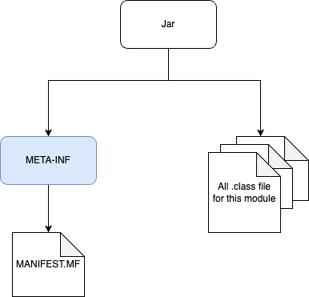

# 목차

<br>

- [목차](#목차)
- [JAR 개념 및 구조](#jar-개념-및-구조)
- [1 JAR 개념과 존재이유](#1-jar-개념과-존재이유)
  - [1-1 JAR란](#1-1-jar란)
  - [1-2 JAR 파일은 배포를 용이하게하기위해 존재한다](#1-2-jar-파일은-배포를-용이하게하기위해-존재한다)
- [2 JAR 구성요소](#2-jar-구성요소)
  - [2-1 구성요소](#2-1-구성요소)
  - [2-2 META-INF/MANIFEST.MF](#2-2-meta-infmanifestmf)
- [참고](#참고)

<br>

# JAR 개념 및 구조
자바 애플리케이션은 개발자가 작성한 `.java` 코드를 컴파일하여 `.class`로 만들어 JVM에 올라감으로써 실행된다.

자바 애플리케이션을 배포한다는 의미는 컴파일 된 `.class`파일 묶음을 업로드한다는 의미와 같다.

자바에선 이러한 배포를 용이하게하기위해 자바 앱을 구성하는 모든 파일이 압축되어 하나의 파일로 포장될 수 있도록 `.jar` 포맷을 지원한다.

> `.jar`외에도 `.ear`, `.war` 등도 존재한다.

이번 글은 자바 애플리케이션을 배포하기위해 필요한 jar의 개념들을 살펴본다.

<br>

# 1 JAR 개념과 존재이유

<br>

## 1-1 JAR란

💁‍♂️ **JAR 개념**

```text
JAR(Java Archive, 자바 아카이브)는 여러개의 자바 클래스 파일과, 클래스들이 이용하는 관련 리소스(텍스트, 그림 등) 및 메타데이터를 하나의 파일로 모아서 자바 플랫폼에 응용 소프트웨어나 라이브러리를 배포하기 위한 소프트웨어 패키지 파일 포맷이다.

- 위키 백과
```

JAR에 대한 개념은 위키 백과에 잘 정리되어있다. 

정리하면 JAR는 배포하기위해 아래 파일들을 모아서 압축한 파일이다.

* 컴파일된 자바 클래스 파일 (`.class`)
* 리소스 (yml설정파일, 텍스트, 이미지등)
* 메타 데이터 (manifest)
* 라이브러리

> 메타 데이터는 데이터의 데이터를 의미한다. 즉, 데이터를 설명해주는 데이터.

<br>

💁‍♂️ **JAR는 실제로 ZIP 파일 포맷으로 이루어진 압축 파일이다.**

```text
JAR 파일은 실제로 ZIP 파일 포맷으로 이루어진 압축 파일로서 파일 확장자는 .jar이다. 컴퓨터 사용자들은 JDK에 포함된 jar 명령어를 이용하여 JAR 파일을 만들거나 압축을 풀 수 있다. 또, zip 도구를 사용할 수도 있으나 압축 시에는 매니페스트 파일이 처음이어야 하는 경우가 있어서 zip 파일 헤더의 엔트리 순서가 중요하다. JAR 안에서 파일 이름들은 유니코드 텍스트로 되어 있다.

- 위키백과
```

JAR는 실제로 특별한 파일이 아닌, 자바 애플리케이션 실행을 위해 필요한 여러 파일들을 묶어서 압축한 하나의 파일 포맷이다.

<br>

## 1-2 JAR 파일은 배포를 용이하게하기위해 존재한다

일반적으로 여러 파일을 인터넷에 업로드할 때, ZIP과 같은 압축파일로 묶어서 업로드하는게 용이하다.

JAR 파일도 동일하게 개발자가 작성한 자바 애플리케이션이 효율적으로 배포 (deploy)할 수 있도록 설계되었다.

다시 말해 자바 애플리케이션을 구성하는 클래스와 관련 리소스들을 단일 파일로 묶어 압축된 형태인 JAR로 만들어 배포하는 것이다.

<br>

# 2 JAR 구성요소

JAR 파일은 ZIP 파일과 다를 것이 없기에, 쉽게 압축을 풀어 내용물을 확인할 수 있다.

```shell
# jar 파일 내부 보기
$ jar tf {jar 파일}

# jar 파일 압축 풀기
$ jar -xf {jar 파일}
```

<br>

## 2-1 구성요소

간단한 자바 애플리케이션의 JAR 파일 내부를 보면 아래와 같이 되어있다.

```shell
META-INF/
META-INF/MANIFEST.MF
com/
com/binghe/
com/binghe/HelloRemoteService$1.class
com/binghe/HelloServiceGrpcServer.class
com/binghe/HelloRemoteService.class
com/binghe/HelloRemoteService$2.class
```

생각보다 구성요소가 굉장히 간단하다.

<p align="center"> </p>

* META-INF
  * 이 디렉토리는 보안, 버전 관리, 확장 및 서비스를 포함한 패키지 및 라이브러리를 명시하는 파일들을 저장한다.
  * 대표적으로 `MANIFEST.MF` (매니페스트 파일)을 저장하는 경로로 매니페이스 안에는 어떻게 JAR 파일을 이용할지를 기술한 엔트리 정보가 기록되어있다. 
  * 예를 들어, 클래스패스 엔트리를 사용하면 해당 JAR 파일과 함께 로드할 다른 JAR 파일들을 지정할 수 있다.
* 클래스파일들
  * 개발자가 구현한 컴파일된 클래스 파일들이 담겨져있다.

<br>

## 2-2 META-INF/MANIFEST.MF

💁‍♂️ **MANIFEST 기본적인 이해**

* `MANIFEST.MF`는 JAR 파일에 패키징된 파일들에 대한 메타데이터 정보를 포함한다.
* 이 메타데이터 정보에는 확장 정보 및 패키지 관련 데이터가 기술되어 있다.
* JAR 파일을 내부의 `MANIFEST.MF` 파일을 활용하여 다양한 기능을 지원한다.
  * 전자서명, 버전관리, 패키징등
* JAR 파일 생성시 자동으로 `MANIFEST.MF`파일이 생성된다.
  * 항상 하나의 `META-INF/MANIFEST.MF` 경로에 하나의 파일만 존재해야한다.

<br>

💁‍♂️ **MANIFEST.MF 파일은 일반적인 key : value 쌍의 목록을 기록하는 파일이다**

`MANIFEST.MF` 파일은 헤더 또는 속성이라고하는 일반적인 `key : value` 쌍의 목록이다.

그리고 섹션 형식으로 구성된다.

실제로 간단한 애플리케이션의 파일 내부를 살펴보면 아래와 같다.

> `MANIFEST.MF`
```shell
Manifest-Version: 1.0
Main-Class: com.binghe.xxx
```

<br>

💁‍♂️ **기본 속성**

매니페스트 파일은 기본 섹션과 개별 JAR 파일 항목에 대한 섹션으로 구성되며, 각각은 줄 바꿈으로 구분된다.

그리고 기본 섹션에서 설정하는 속성은 아래와 같다.

* Manifest-Version: 매니페스트 파일 버전을 정의한다.
* Created-By: 매니페스트 파일이 생성되는 JAVA 구현의 버전과 공급업체를 정의한다.
* Signature-Version: JAR 파일의 서명 버전을 정의한다.
* Class-Path: 해당 애플리케이션에 필요한 확장 및 라이브러리의 상태 URL을 정의한다. URL은 하나 이상의 공백으로 구분되며, 애플리케이션 또는 확장 클래스 로더는 이 속성의 값을 사용하여 내부 검색 경로를 구성한다.
  * 더 자세한 내용은 [여기](https://docs.oracle.com/javase/8/docs/technotes/guides/jar/jar.html#classpath) 참고.

<br>

💁‍♂️ **실행 가능한 jar 파일**

실행 가능한 자바 프로그램은 사용하는 다른 라이브러리와 함께 JAR 파일로 압축될 수 있다. JAR 파일이 실행 가능하려면 파일 안에 포함된 MANIFEST 파일에 Entry Point의 클래스 이름이 `Main-Class`라는 key에 매핑되어있어야한다.

> `MANIFEST.MF`
```shell
Main-Class: {실행할 클래스 파일}
```

<br>

# 참고
* https://ko.wikipedia.org/wiki/JAR_(파일_포맷)
* https://docs.oracle.com/javase/8/docs/technotes/guides/jar/jar.html

