[자바의 정석](http://www.yes24.com/Product/Goods/24259565?OzSrank=2)을 바탕으로 정리한 자료입니다.


# 목차

- [java.lang 패키지](#javalang-패키지)
  * [1 Object 클래스](#1-object-클래스)
    + [1-1 equals(Object obj)](#1-1-equals-object-obj-)
      - [1-1-1 기존의 equals](#1-1-1-기존의-equals)
      - [1-1-2 오버라이딩을 통한 equals 사용하기](#1-1-2-오버라이딩을-통한-equals-사용하기)
    + [1-2 hashCode()](#1-2-hashcode--)
      - [1-2-1 hashCode()란](#1-2-1-hashcode--란)
      - [1-2-2 equals 재정의할 때 왜 hashCode()도 같이 바꿔야하는가?](#1-2-2-equals-재정의할-때-왜-hashcode--도-같이-바꿔야하는가?)
    + [1-3 toString()](#1-3-tostring--)
      - [1-3-1 기존의 toString()](#1-3-1-기존의-tostring--)
      - [1-3-2 toString 활용](#1-3-2-tostring-활용)
        * [(1) Arrays.toString()](#-1--arraystostring--)
        * [(2) 사용자 정의 toString](#-2-사용자-정의-tostring)
    + [1-4 clone()](#1-4-clone--)
      - [1-4-1 기존의 clone()](#1-4-1-기존의-clone--)
      - [1-4-2 clone()을 이용한 배열 복사](#1-4-2-clone--을-이용한-배열-복사)
      - [1-4-2 얕은 복사와 깊은 복사](#1-4-2-얕은-복사와-깊은-복사)
    + [1-5 getClass()](#1-5-getclass--)
      - [1-5-1 Reflection API](#1-5-1-reflection-api)
        * [리플렉션이 가능한 이유](#리플렉션이-가능한-이유)
        * [클래스 로더가 클래스영역에 Class객체를 저장한다.](#클래스-로더가-클래스영역에-class객체를-저장한다)
      - [1-5-2 Class파일 얻는 방법](#1-5-2-class파일-얻는-방법)
  * [2 String 클래스](#2-string-클래스)
    + [2-1 immutable(변경 불가능한) 클래스](#2-1-immutable-변경-불가능한--클래스)
      - [String인스턴스의 내용을 바꿀 수 없다.](#string인스턴스의-내용을-바꿀-수-없다)
    + [2-2 문자열 리터럴](#2-2-문자열-리터럴)
    + [2-3 문자열 비교](#2-3-문자열-비교)
    + [2-4 빈 문자열](#2-4-빈-문자열)
    + [2-5 문자열과 기본형간의 변환](#2-5-문자열과-기본형간의-변환)
  * [3 StringBuffer와 StringBuilder](#3-stringbuffer와-stringbuilder)
    + [3-1 내부적으로 버퍼(buffer)를 가지고 있다](#3-1-내부적으로-버퍼--buffer-를-가지고-있다)
    + [3-2 StringBuffer의 변경](#3-2-stringbuffer의-변경)
    + [3-2 StringBuffer의 비교](#3-2-stringbuffer의-비교)
    + [3-3 StringBuilder란?](#3-3-stringbuilder란?)
  * [4 래퍼(wrapper) 클래스](#4-래퍼-wrapper--클래스)
    + [4-1 래퍼클래스 종류](#4-1-래퍼클래스-종류)
    + [4-2 래퍼클래스의 사용](#4-2-래퍼클래스의-사용)
    + [4-3 Number클래스](#4-3-number클래스)
    + [4-4 문자열, 숫자 변환](#4-4-문자열,-숫자-변환)
      - [문자열을 숫자로 변환](#문자열을-숫자로-변환)
      - [n진법의 문자열을 숫자로 변환](#n진법의-문자열을-숫자로-변환)
    + [4-5 오토박싱 & 언박싱](#4-5-오토박싱---언박싱)
      - [예제](#예제)


# java.lang 패키지

`java.lang`패키지는 자바에서 **가장 기본이 되는 클래스들의 모음**이다.

자바 소스코드에서 **`import`하지 않아도 바로 사용할 수 있는 패키지**이다.

`Thread`, `System`, `Object`등의 자바의 기초를 다루는 거의 모든 클래스가 이 패키지 안에 존재한다.

여기선 꼭 알아야하는 클래스들의 대해서 다뤄본다.


## 1 Object 클래스

`Object`클래스는 모든 클래스의 최고 조상이기 때문에 `Object`클래스의 멤버들은 모든 클래스에서 바로 사용할 수 있다.

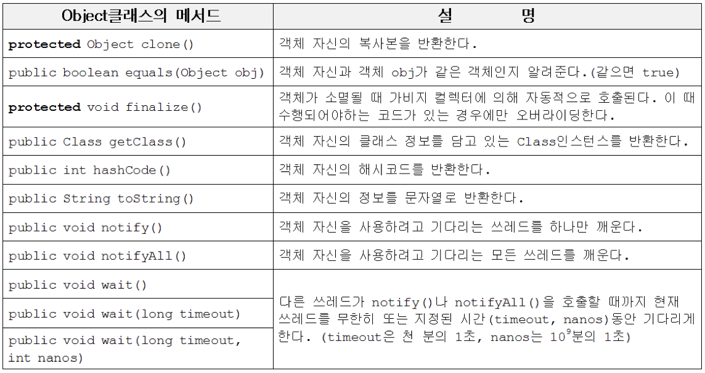

* `Object`클래스는 멤버변수가 없고 오직 11개의 메서드만 가지고 있다. 이 메서드들은 모두 인스턴스가 가져야 할 기본적인 것들이다.

  


---

### 1-1 equals(Object obj)


#### 1-1-1 기존의 equals

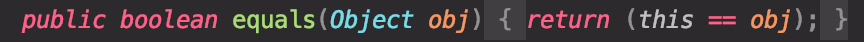

* `Object`(모든 클래스)를 매개변수로 받아와, **참조변수의 값으로 두 객체의 같고 다름을 비교한다.**
  * **서로 다른 두 객체를 `equals`로 비교하면 항상 `false`이다.** ( 주소 값이 서로 무조건 다르기 때문 )

```java
class Value {
    int value;

    public Value(int value) {
        this.value = value;
    }
}

public class Main {

    public static void main(String[] args) throws IOException {

        Value v1 = new Value(10);
        Value v2 = new Value(10);

        if(v1.equals(v2)){ // 참조변수의 주소를 바탕으로 비교.
            System.out.println("v1과 v2는 같습니다.");
        } else{
            System.out.println("v1과 v2는 다릅니다.");
        }

        v2 = v1; // 주소 값 복사

        if(v1.equals(v2)){ // 참조변수의 주소를 바탕으로 비교.
            System.out.println("v1과 v2는 같습니다");
        } else {
            System.out.println("v1과 v2는 다릅니다.");
        }
    }
}
// 결과
v1과 v2는 다릅니다.
v1과 v2는 같습니다.
```


* 기본 `equals`는 참조 값(주소)으로 비교를 하기 때문에, `v1`과 `v2`는 `false`일 수 밖에 없다.
* `v2 == v1`을 통해 주소 복사를 함으로써 equals를 true로 할 수 있다.


#### 1-1-2 오버라이딩을 통한 equals 사용하기

기존의 equals는 참조 값만을 통해서 비교를 한다.

**만약 특정 값으로 비교를 하고 싶으면 해당 클래스에서 오버라이딩을 하여 사용하면 된다.**

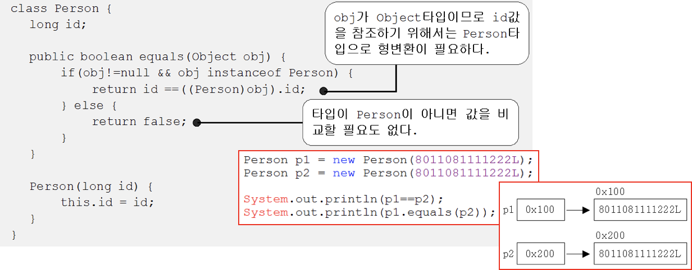

> **`Date`, `File`, `Wrapper(Integer, Double)`, `String`등 클래스도 `equals`를 오버라이딩하여 값으로 비교를 할 수 있게 되어 있다.**


---

### 1-2 hashCode()

> Returns a hash code value for the object. This method is supported for the benefit of hash tables such as those provided by [`HashMap`](https://docs.oracle.com/en/java/javase/11/docs/api/java.base/java/util/HashMap.html). - JAVA 11 API -

#### 1-2-1 hashCode()란

자바에서는 각  객체마다 **식별코드**를 만든다. ( **주민번호** )

Object의 **`hashCode()`메서드가 바로 객체의 메모리 주소를 이용해서 해시코드를 만들어 리턴하는 메서드이다.**

**각 객체의 메모리 주소가 다르기 때문에, 각 객체의 해시 값도 당연히 다 다르다.**

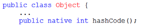

* `hashCode()`는 **객체의 내부주소**를 반환한다.
* `native call`을 하여 Memory에서 가진 해시 주소값을 반환한다.
* **오버라이딩을 하지 않았을 경우, `System.identityHashCode()`와 동일한 값을 나타낸다.**


#### 1-2-2 equals 재정의할 때 왜 hashCode()도 같이 바꿔야하는가?

**결과적으로는 어떠한 자료구조나 메서드들은 각 객체의 해시 값을 기준으로 객체들을 구분하기 때문이다.**

**즉, equals()를 재정의할 때 side effect를 줄이기 위해서 hashCode()도 재정의하는 것이 좋다.**

* `equals()`가 true인 두 `Object`를 **`HashMap`에 `put`을 할 때 동일한 `Key`로 인식하고 싶은 경우**

```java
class Value {
    int value;

    public Value(int value) {
        this.value = value;
    }

    @Override
    public boolean equals(Object obj) {
        if(obj instanceof Value){
            return this.value == ((Value) obj).value;
        } else {
            return false;
        }
    }
}

public class Main {

    public static void main(String[] args) throws IOException {

        Value v1 = new Value(10);
        Value v2 = new Value(10);

        Map<Value, Integer> map = new HashMap<>();
        map.put(v1, 1);
        map.put(v2, 1);
        System.out.println(map.size()); // 2 (동일한 객체였다면 1이였을 것이다.)

    }
}
// 결과 값
2
```

* **결과를 보면 알다싶이, 동일한 값을 가진 객체를 `HashMap`에 넣으면 하나로 인식하지 않고, 서로 다르다고 인식을 한다.**
  * **`Hash`를 사용한 `Collection(HashMap, HashTable, HashSet, LinkedHashSet등)`은 `key`를 결정할 때 `hashCode()`를 사용하기 때문이다.**
  * **즉, 각 객체마다 다른 해시값을 가지는데, 이를 기준으로 구별하기 때문에, 서로 다르다고 분류하는 것이다.**
* 우선 `hashCode()`메서드를 실행해서 리턴된 해시 값이 같은지를 본다. 해시 값이 다르면 다른 객체로 판단하고, 해시 값이 같으면 `equals()`메서드로 다시 비교한다. (이중 비교) 이 두개가 모두 맞아야 동등 객체로 판단한다.

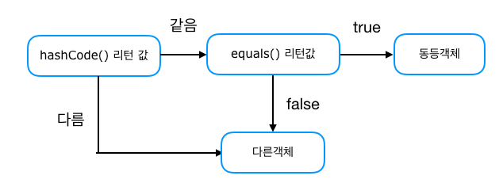


> 어떻게 Key값을 동일하게 인식하게 할 것인가?
>
> * `hashCode()`를 오버라이딩하여 문제를 해결한다.


> 출처
>
> * https://minwan1.github.io/2018/07/03/2018-07-03-equals,hashcode/
> * https://nesoy.github.io/articles/2018-06/Java-equals-hashcode


---

### 1-3 toString()


#### 1-3-1 기존의 toString()

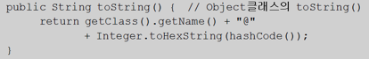

* **객체의 정보를 문자열(`String`)로 제공할 목적으로 정의된 메서드.**
  * 객체의 정보는 인스턴스 변수에 저장된 값을 의미한다.
* **`Object`에 정의된 기존의 `toString`은 위와 같이 클래스이름에 16진수의 해시코드를 반환한다.**


#### 1-3-2 toString 활용

##### (1) Arrays.toString()

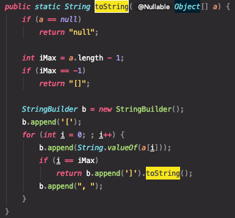

* **배열을 `toString()`의 매개변수로 넣으면 해당 배열안에 요소들을 문자열로 반환한다.**


##### (2) 사용자 정의 toString

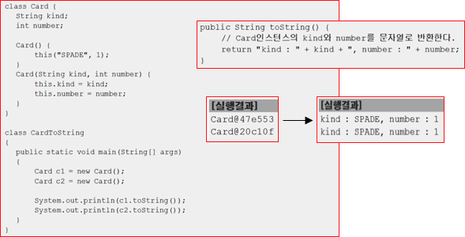

* 클래스를 정의하고 `toString()`을 호출하면 클래스이름과 16진수 해시코드가 반환된다.
* **`toString()`을 오버라이딩하면 원하는 인스턴스 변수를 출력하도록 할 수 있다.**


---

### 1-4 clone()

이름에서 알 수 있듯이 이 메서드는 자신을 복제하여 새로운 인스턴스를 생성하는 일을 한다.


#### 1-4-1 기존의 clone()

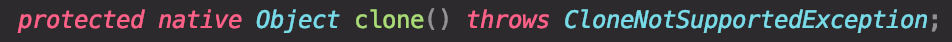

* 객체 자신을 복제(clone)해서 새로운 객체를 만드는 메서드
  * 목적 : 백업, 복제

```java
class Point implements Cloneable{ // Cloneable 인터페이스를 구현해야지만 clone사용가능.

    int x;
    int y;

    public Point(int x, int y) {
        this.x = x;
        this.y = y;
    }

    @Override
    public String toString() {
        return "x = "+this.x+", y = "+this.y;
    }

    @Override
    public Object clone(){
        Object obj = null;
        try{
            obj = super.clone(); // clone은 반드시 예외처리를 해주어야 한다. ( super = Object )
        } catch (CloneNotSupportedException e){}
        return obj;
    }
}

public class Main {

    public static void main(String[] args) throws IOException {

        Point p1 = new Point(1,1);
        Point p1Clone = (Point)p1.clone();

        System.out.println(p1);
        System.out.println(p1Clone);
    }
}
// 결과
x = 1, y = 1
x = 1, y = 1
```

* **`Cloneable`인터페이스를 구현한 클래스의 인스턴스만 복제할 수 있다.**
  * 인스턴스의 데이터를 보호하기 위함.
  * `Cloneable`인터페이스가 구현된 클래스는 작성자가 복제를 허용한다는 의미로 받아들인다.
* **`Object`의 `clone()`은 단순히 인스턴스변수의 값만을 복사한다. ( 얕은 복사 )**

* **`Object`의 `clone()`을 오버라이딩하면서 `protected`에서 `public`으로 변경한다.**
  * 상속관계가 없는 다른 클래스에서 `clone()`을 호출하기 위함.


> 공변 반환타입
>
> * JDK1.5부터 추가된 기능.
> * 오버라이딩할 때 부모 메서드의 반환타입을 자식 클래스의 타입으로 변경을 허용하는 것.
>
> ```java
> public Point clone() { // 기존엔 Object였는데, Point로 변경할 수 있다.
>   Object obj = null;
>   try {
>     obj = super.clone();
>   } catch (CloneNotSupportedExcept e) {}
>   return (Point)obj; // Point타입으로 형변환.
> }
> ```
>
> * 이렇게 하면 clone()을 호출할 때 형변환을 안해줘도 사용이 가능해진다.
>   * `Point copy = original.clone();`


#### 1-4-2 clone()을 이용한 배열 복사

```java
public class Main {

    public static void main(String[] args) throws IOException {

        int[] arr = {1, 2, 3, 4, 5};

        int[] arrClone = arr.clone();
        arrClone[0] = 6;

        System.out.println(Arrays.toString(arr));
        System.out.println(Arrays.toString(arrClone));
    }
}
// 결과
[1, 2, 3, 4, 5]
[6, 2, 3, 4, 5]
```

* 배열도 객체이기 때문에 `Object`클래스를 상속받으며, 동시에 `Cloneable`인터페이스와 `Serializable`인터페이스가 구현되어 있다.
* 배열에서는 `Object`의 `protected`인 `clone`을 `public`으로 오버라이딩되어 있기 때문에 직접 호출이 가능하다.
* 배열 뿐만 아니라 `java.util`패키지의 `ArrayList`, `LinkedList`, `Hashset`, `TreeSet`, `HashMap`, `TreeMap`등등도 모두 같은 방식으로 `clone`을 사용한다.


> 배열 복사에는 `clone()`와 `arraycopy()` 두 가지 방법이 있다.
>
> ```java
> // clone
> int[] arr = {1, 2, 3, 4, 5};
> int[] arrClone = arr.clone();
> 
> // arraycopy
> int[] arr = {1, 2, 3, 4, 5};
> int[] arrClone = new int[arr.length];
> System.arraycopy(arr, 0, arrClone, 0, arr.length);
> ```


#### 1-4-2 얕은 복사와 깊은 복사

`Object`의 `clone()`은 단순히 객체에 저장된 값을 그대로 복사할 뿐, 객체가 참조하고 있는 객체까지 복제하지는 않는다.

* 얕은 복사 : **객체의 저장된 멤버들을 그대로 복사한다.**
  * 객체안에 저장된 멤버중 참조하고 있는 객체는 복제되지 않는다.
    * **참조변수만 복제되고, 힙에 저장되어 있는 객체는 그대로 남아 있는다.**
  * 원본을 변경하면 복사본도 영향을 받는다. ( 힙에 저장된 객체는 그대로이기 때문에 )
* 깊은 복사 : **객체의 저장된 멤버들의 참조하고 있는 객체까지 복제한다.**
  * 객차안에 저장된 멤버중 참조하고 있는 객체까지 복제한다.
    * **참조변수도 복제하고, 힙에 저장되어 있는 객체까지 복제한다. ( new를 통해 인스턴스화 )**
  * 원본의 변경이 복사본의 영향을 끼치지 못한다. ( 힙에 저장된 객체가 서로 다르기 때문 )


```java
class Point {
    int x,y;

    public Point(int x, int y) {
        this.x = x;
        this.y = y;
    }

    @Override
    public String toString() {
        return "x : "+this.x+", y : "+this.y;
    }
}

class Circle implements Cloneable {
    Point p; // 원점
    double r; // 반지름

    public Circle(Point p, double r) {
        this.p = p;
        this.r = r;
    }

    public Circle shallowCopy(){ // 얕은 복사
        Object obj = null;
        try {
            obj = super.clone();
        } catch (CloneNotSupportedException e){}
        return (Circle)obj;
    }

    public Circle deepCopy() { // 깊은 복사
        Object obj = null;

        try {
            obj = super.clone();
        } catch (CloneNotSupportedException e) {}

        Circle c = (Circle)obj;
        c.p = new Point(this.p.x, this.p.y); // 힙에 새로운 객체를 복제.

        return c;
    }

    @Override
    public String toString() {
        return "[p = "+this.p+", r = "+this.r+"]";
    }
}

public class Main {

    public static void main(String[] args) throws IOException {

        Circle c1 = new Circle(new Point(1,1), 2.0);
        Circle c1shallowClone = c1.shallowCopy();
        Circle c1deepClone = c1.deepCopy();

        // 출력
        System.out.println("c1 = "+c1);
        System.out.println("c1shallowClone = "+c1shallowClone);
        System.out.println("c1deepClone = "+c1deepClone);

        c1.p.x = 9;
        c1.p.y = 9;

        System.out.println("--- c1의 값 변경후 ----");
        System.out.println("c1 = "+c1);
        System.out.println("c1shallowClone = "+c1shallowClone);
        System.out.println("c1deepClone = "+c1deepClone);
    }
}
// 결과
/*
c1 = [p = x : 1, y : 1, r = 2.0]
c1shallowClone = [p = x : 1, y : 1, r = 2.0]
c1deepClone = [p = x : 1, y : 1, r = 2.0]
--- c1의 값 변경후 ----
c1 = [p = x : 9, y : 9, r = 2.0]
c1shallowClone = [p = x : 9, y : 9, r = 2.0] // 영향을 받는다.
c1deepClone = [p = x : 1, y : 1, r = 2.0] // 영향을 받지 않는다.
*/
```

* 결과
  * `c1`을 변경하면 `c1shallowClone`은 영향을 받는다.
  * `c1`을 변경하면 `c1deepClone`은 전혀 영향을 받지 않는다.

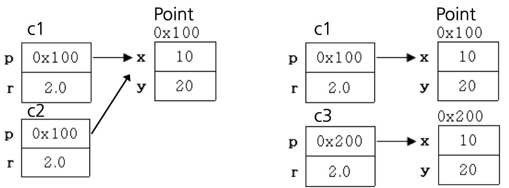


> **쉽게 생각해서, `Object`의 `clone()`은 인스턴스 멤버중 참조변수도 그저 값 (주소)만 복사한다. 이를 얕은 복사라고 한다.**
>
> **만약, 완전히 새로운 객체를 만들기 위해서는 `clone()`을 오버라이딩하여 재정의해줘야한다.**


---

### 1-5 getClass()

자신이 속한 클래스의 Class객체를 반환하는 메서드이다. Class객체는 이름이 'Class'인 클래스의 객체이다.


#### 1-5-1 Reflection API

Reflection은 '투영, 반사'의 사전적 의미를 갖고 있다.

자바에서는 '객체를 이용해 클래스의 정보를 분석하는 기법'이다.

리플렉션은 구체적인 클래스 타입을 알지 못해도 그 클래스의 메서드, 타입, 변수등을 접근할 수 있도록 해주는 API이다.

> 참고 : https://12bme.tistory.com/129

##### 리플렉션이 가능한 이유

자바는 JVM을 사용하기 때문이다. 자바 코드를 작성하여 컴파일과 실행을 하면 .java파일을 .class파일(바이트 코드)로 컴파일하고 JVM상에 로드된다.

그리고 **클래스에 대한 정보는 JVM의 Runtime Data Area의 클래스 영역이라는 메모리 공간 ( 클래스 영역 )에 저장된다.**

즉, **런타임 시점에서 로드된 클래스들의 정보를 가져올 수 있기 때문에 이러한 리플렉션이 가능한 것이다.**

> 참고 : https://geekhub.tistory.com/67


##### 클래스 로더가 클래스영역에 Class객체를 저장한다

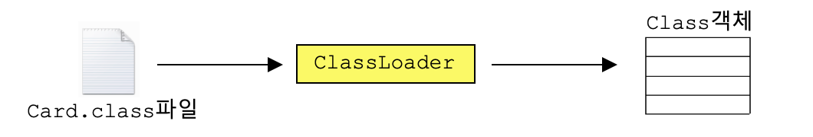

* Class객체는 클래스의 모든 정보를 담고 있으며, 클래스당 단 1개만 존재한다.
* 클래스 파일이 '클래스 로더'에 의해서 메모리에 올라갈 때, 자동적으로 생성된다.
  * 파일 형태(.class)로 되어 있는 클래스를 읽어서 Class클래스에 정의된 형식으로 변환한 후 클래스 영역(메모리)에 객체로 저장한다.


#### 1-5-2 Class파일 얻는 방법

클래스의 정보가 필요할 때, 먼저 Class객체에 대한 참조를 얻어 와야한다.

```java
Class cObj = new Card().getClass(); // 생성된 객체로 부터 얻는 방법
Class cObj = Card.class; // 클래스 리터럴(*.class)로 부터 얻는 방법
Class cObj = Class.forName("Card"); // 클래스 이름으로 부터 얻는 방법
```


```java
class Point {
    int x,y;

    public Point(int x, int y) {
        this.x = x;
        this.y = y;
    }

    @Override
    public String toString() {
        return "x : "+this.x+", y : "+this.y;
    }

    public void getClasstest() {
        System.out.println("hi");
    }
}

public class Main {

    public static void main(String[] args) throws IOException {

        Point p = new Point(10,10);
        Class pClass = p.getClass();

      	// Point클래스에 정의된 메서드 출력
        for(int i = 0; i < pClass.getMethods().length; i++){
            System.out.println(pClass.getMethods()[i]);
        }
    }
}
// 결과 (Point클래스에 정의되어 있는 메서드들)
public java.lang.String Point.toString()
public void Point.getClasstest()
public final native void java.lang.Object.wait(long) throws java.lang.InterruptedException
public final void java.lang.Object.wait(long,int) throws java.lang.InterruptedException
public final void java.lang.Object.wait() throws java.lang.InterruptedException
public boolean java.lang.Object.equals(java.lang.Object)
public native int java.lang.Object.hashCode()
public final native java.lang.Class java.lang.Object.getClass()
public final native void java.lang.Object.notify()
public final native void java.lang.Object.notifyAll()
```


> new 연산자의 의미
>
> ```java
> Card c = new Card(); // new연산자를 이용해서 객체 생성
> Card c = Card.class.newInstance(); // Class객체를 이용해서 객체 생성
> ```


> **쉽게 말하면 자바가 실행될 때 클래스로더가 클래스(.class)의 정보를 클래스영역에 인스턴스화(Class 객체)하여 저장한다.**


## 2 String 클래스

C언어는 문자열을 `char형`의 배열로 다룬다. 하지만 자바에서는 자체적으로 문자열을 위한 클래스를 제공한다.


### 2-1 immutable(변경 불가능한) 클래스

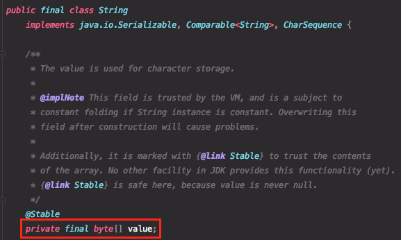

* String클래스에는 문자열을 저장하기 위해서 문자형 배열 변수`(char[]) value`를 인스턴스 변수로 정의해놓고 있다.
  * 인스턴스 생성 시 생성자의 매개변수로 입력받는 문자열을 이 인스턴스 변수(`value`)에 문자형 배열(`char[]`)로 저장되는 것이다.
* **`final`로 선언된 `value`를 볼 수 있다. (immutable)**


#### String인스턴스의 내용을 바꿀 수 없다

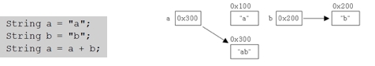

* **한번 생성된 `String`인스턴스가 갖고 있는 문자열은 읽어 올 수 만 있고, 변경할 수는 없다.**
  * 위 예제에서 `a+b`를 하면 `a`에 `b`를 합쳐야 하지만 `String`은 `ab`를 담는 **새로운 인스턴스를 만든다.**

* **덧셈 연산자를 사용해서 문자열을 결합하는 것은 매 연산 시 마다 새로운 문자열을 가진 `String`인스턴스가 생성되어 메모리공간을 차지하게 되므로 가능한 한 결합횟수를 줄이는 것이 좋다.**


> 예제

```java
int num = 10;
num = 20;

String str = "abc";
str = "def";
```

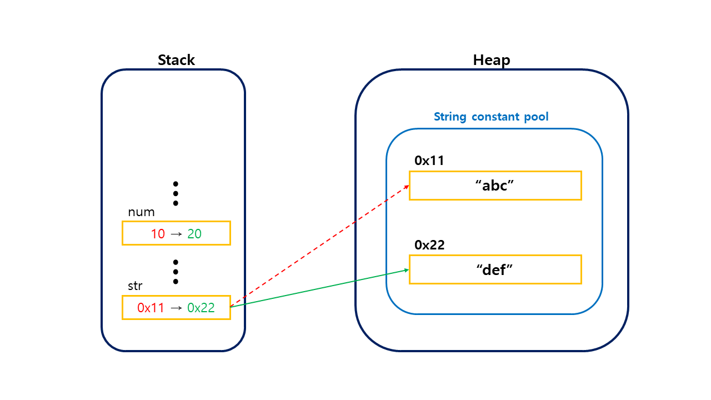

> 참조 : https://readystory.tistory.com/139?category=784159


---

### 2-2 문자열 리터럴

자바 소스파일에 포함된 모든 문자열 리터럴은 컴파일 시에 클래스 파일에 저장된다. 

이때 **같은 내용의 문자열 리터럴은 한번만 저장된다.**

**문자열 리터럴도 `String`인스턴스이고, 한번 생성되면 내용을 변경할 수 없기 때문에 하나의 인스턴스를 공유하면 되기 때문이다.**

```java
String s1 = "AAA";
String s2 = "AAA";
String s3 = "AAA";
String s4 = "BBB";
```

이렇게 **다른 변수여도 같은 문자열을 가지고 있으면 문자열 리터럴은 아래와 같이 처리한다.**

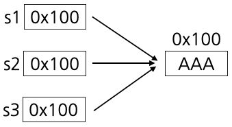

`"AAA"`라는 문자열을 담고 있는 `String`인스턴스가 하나 생성된 후, 참조변수 `s1`, `s2`, `s3`는 모두 이 `String`인스턴스를 참조하게 된다.

> 그래서 문자열 리터럴는 ==만으로도 비교가 가능했던 것이다.


**더 정확하게 말하면 상수 저장소(`constant pool`)중에서 `String Constant Pool`에 객체를 생성하여 저장된다.** 

**이 문자열 풀은 힙에 저장되어 있다.**


---

### 2-3 문자열 비교

자바에서는 문자열을 만드는 방법이 위와 같이 두 가지 였다.

* 문자열 리터럴
* String객체 생성

```java
String s1 = "Cat";
String s2 = "Dog";
String s3 = new String("Cat");
```

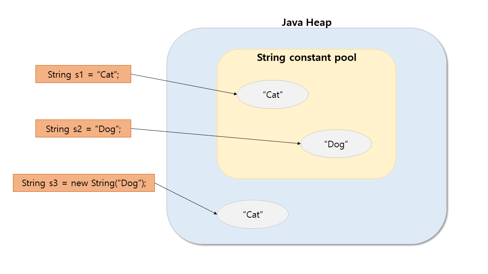

* **문자열 리터럴은 String pool에 저장된다. ( String pool은 힙에 위치한다. )**
* **String 객체는 보통의 객체와 동일하게 취급되며, 힙에 저장된다.**


```java
String str1 = "abc";
String str2 = "abc";
String str3 = new String("abc");
String str4 = new String("abc");
```

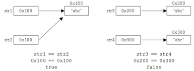

* `==` 연산자는 값만으로 비교를 한다. 참조변수의 주소가 다르면 `false`가 나오는 이유이다.
  * `equals`를 사용하여 `String`객체도 비교를 할 수 있다.


---

### 2-4 빈 문자열

**자바에서는 길이가 0인 배열이 존재 할 수 있다. `int[] iArr = {};`**

그러므로 **빈 문자열도 가능하다.**

```java
char[] chArr = new char[0];
String s = null;
String s = "";
```

> **C언어에서는 문자열의 끝에 널 문자로 항상 붙지만, 자바에서는 널 문자를 사용하지 않는다. 대신 문자열의 길이정보를 따로 저장한다.**


---

### 2-5 문자열과 기본형간의 변환

* 기본형 값을 문자열로 바꾸는 두 가지 방법
  * 방법2가 더 빠르다.

```java
int i = 100;
String str1 = i + ""; // 100을 "100"으로 변환하는 방법1
String str2 = String.valueOf(i); // 100을 "100"으로 변환하는 방법2
```


* 문자열을 기본형 값으로 변환하는 방법

```java
int i = Integer.parseInt("100"); // "100"을 100으로 변환하는 방법1
int i2 = Integer.valueOf("100"); // "100"을 100으로 변환하는 방법2
```

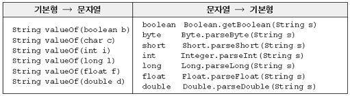


## 3 StringBuffer와 StringBuilder

**`String`클래스는 `value`멤버를 `final`로 가지고 있다.** 그러므로 인스턴스를 생성할 때 지정된 문자열을 변경할 수 없지만 `StringBuffer`클래스와 `StringBuilder`는 변경이 가능하다. 

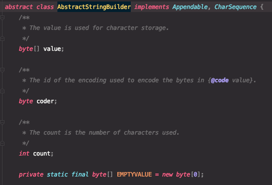

* **`value`멤버가 `final`로 저장되어 있지 않으므로, 변경이 가능하다.**

  

### 3-1 내부적으로 버퍼(buffer)를 가지고 있다

인스턴스화를 하고 수정이 가능한 이유는 내부적으로 버퍼(`buffer`)를 가지고 있기 때문이다.

**또한 인스턴스를 생성할 때 그 크기를 지정할 수 있다.**

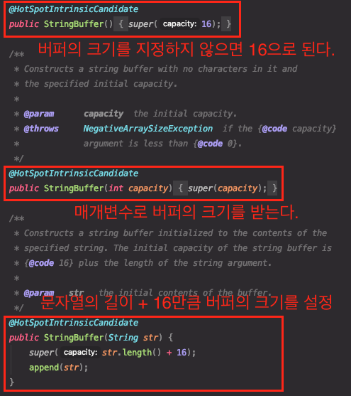


### 3-2 StringBuffer의 변경

`String`과 달리 `StringBuffer`은 문자열 변경이 가능하다고 했다. 그 이유는 버퍼를 이용하기 때문이다.

```java
StringBuffer sb = new StringBuffer("abc");
```


```java
sb.append("123"); // 123추가 (sb의 내용 뒤에 "123"을 추가한다.)
```


* `append`는 반환타입이 `StringBuffer`이며, 자신의 주소를 반환한다.

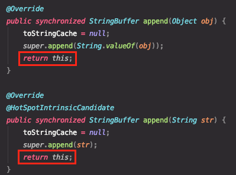

```java
StringBuffer sb2 = sb.append("ZZ"); // sb의 내용 뒤에 "ZZ"를 추가한다.
System.out.println(sb); // abc123ZZ
System.out.println(sb2); // abc123ZZ
```


* 위와 같이, `sb`에 새로운 문자열이 추가되고 `sb`자신의 주소를 반환하여 `sb2`에는 `sb`의 주소인 `0x100`이 저장된다.


### 3-2 StringBuffer의 비교

자바에서 인스턴스 간의 비교는 아래와 같이 두가지가 있다.

* `==`
* `equals`

**`StringBuffer`클래스는 `equals`메서드를 오버라이딩하지 않아서 기존의 `String`처럼 인스턴스 멤버의 값으로 비교를 하지 않는다.**

즉, `Object`의 `equals`처럼 `==`로 비교연산을 한다.


### 3-3 StringBuilder란?

**`StringBuffer`은 멀티쓰레드에 안전(`thread safe`)하도록 동기화되어 있다.**

동기화가 `StringBuffer`의 성능을 떨어트린다는 것만 이해하면 된다.

멀티쓰레드로 작성된 프로그램이 아닌 경우, `StringBuffer`의 동기화는 불필요하게 성능만 떨어트리게 된다.

`StringBuilder`는 `StringBuffer`와 완전히 똑같은 기능으로 작성되어 있어서, 소스코드에서 `StringBuffer`대신 `StringBuilder`를 사용하도록 바꾸기만 하면 된다.

> 둘 의 차이는 멀티쓰레드 환경에서 쓰레드 안전을 지키도록 했느냐 안했느냐이다.


## 4 래퍼(wrapper) 클래스

자바는 대표적인 객체지향 언어이다. 

하지만 자바에서는 8개의 기본형을 객체로 다루지 않는데 이것이 바로 자바가 완전한 객체지향 언어가 아니라는 얘기를 듣는 이유이다. 그 대신 높은 성능을 얻을 수 있었다.

> 만약 기본형이 없고 전부 다 객체로 되어있다면, 기본형 값들도 참조변수를 통해 객체에 접근하는데 이럴 경우 성능상으로 바로 접근하는 기본형보다 느리다.

기본형 변수도 어쩔 수 없이 객체로 다뤄야 하는 경우가 있다. 이때 사용하는 것이 바로 래퍼 클래스이다.

**8개의 기본형을 대표하는 8개의 래퍼클래스가 있는데, 이 클래스들을 이용하면 기본형 값을 객체로 다룰 수 있다.**

> 래퍼클래스 = 기본형 값을 감싸는 클래스.

### 4-1 래퍼클래스 종류

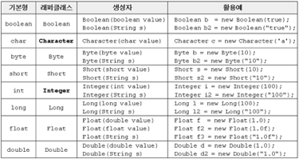

* 내부적으로 기본형(primitive)변수를 가지고 있다.

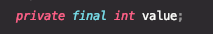


### 4-2 래퍼클래스의 사용

```java
Integer i = new Integer(100);
Integer i2 = new Integer(100);

System.out.println("i == i2 ? "+(i==i2));
System.out.println("i.equals(i2) ? "+(i.equals(i2)));
System.out.println("i.compareTo(i2) = "+(i.compareTo(i2)));
System.out.println("i.toString() = "+i.toString());

System.out.println("MAX_VALUE = "+Integer.MAX_VALUE);
System.out.println("MIN_VALUE = "+Integer.MIN_VALUE);
System.out.println("SIZE = "+Integer.SIZE);
System.out.println("BYTES = "+Integer.BYTES);

// 결과
i == i2 ? false // 참조형 주소 값 비교
i.equals(i2) ? true // 객체의 value를 비교
i.compareTo(i2) = 0 // 같으면 0, 작으면 양수, 크면 음수 ( 정렬에 사용됨 )
i.toString() = 100
MAX_VALUE = 2147483647 // 4바이트 (32비트)
MIN_VALUE = -2147483648 // 4바이트 (32비트)
SIZE = 32
BYTES = 4
```

* 래퍼 클래스의 생성자는 매개변수로 문자열이나 각 자료형의 값들을 인자로 받는다.
* 래퍼 클래스는 자료형과 관련된 여러 메서드가 정의되어 있다.
  * `equals()`가 오버라이딩되어 있어서 주소값이 아닌 객체가 가지고 있는 값을 비교한다.
  * `toString()`도 오버라이딩되어 있어서 객체가 가지고 있는 값을 문자열로 변환하여 반환한다.
  * `MAX_VALUE`, `MIN_VALUE`, `SIZE`, `BYTES`, `TYPE`등의 `static`상수를 공통적으로 가지고 있다.


### 4-3 Number클래스

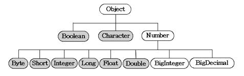

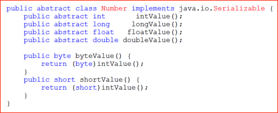

* 래퍼 객체를 기본형 자료형으로 변환할 때 쓰이는 메서드를 가지고 있다. 
  * `intValue()`
  * `longValue()`
  * `floatValue()`
  * `doubleValue()`

```java
Integer i = new Integer(100);
int a = i.intValue(); // Integer에서 int형으로 변환
```


### 4-4 문자열, 숫자 변환


#### 문자열을 숫자로 변환

```java
int i = new Integer("100").intValue(); // 래퍼클래스 만들고 int로 변환
int i2 = Integer.parseInt("100"); // 주로 사용하는 방법
int i3 = Integer.valueOf("100");
```

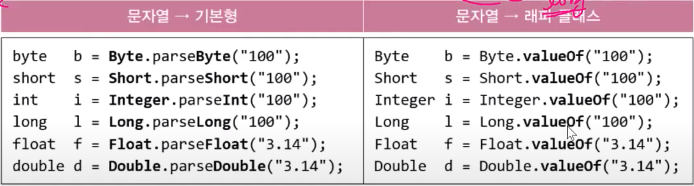


#### n진법의 문자열을 숫자로 변환

```java
int i4 = Integer.parseInt("100", 2); // 2진수로 해석 100(2) -> 4
int i5 = Integer.parseInt("100", 8); // 8진수로 해석 100(8) -> 64
int i6 = Integer.parseInt("100", 16); // 16진수로 해석 100(16) -> 256
int i7 = Integer.parseInt("FF", 16); // 16진수로 해석 FF(16) -> 255
// int i8 = Integer.parseInt("FF"); // NumberFormatException발생
```

* `parseInt`의 진수 해석 `default`값은 10이다.


### 4-5 오토박싱 & 언박싱

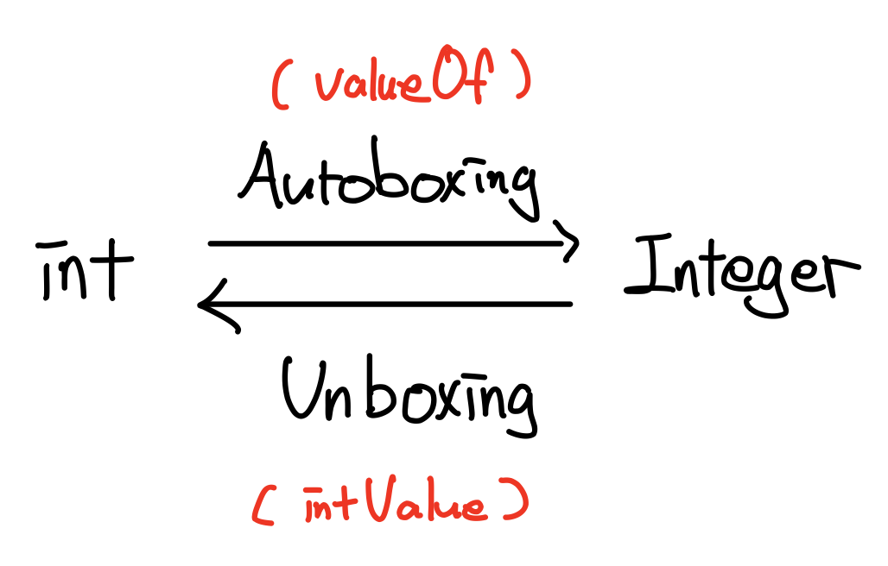

> boxing : 래퍼 클래스의 '감싼다는 의미'
>
> * boxing = wrapping

```java
int i = 5; // 기본형
Integer iObj = new Integer(7); // 참조형

int sum = i + iObj; // 에러 (JDK1.5 이전)
```

* JDK1.5이전에는 기본형과 참조형 간의 덧셈이 불가했다. 그 이후엔 가능.
  * **컴파일러가 자동적으로 변환을 해준다.**
  * Integer -> int (언박싱)

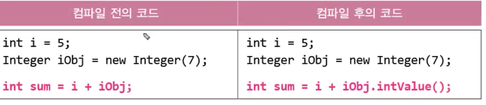


```java 
ArrayList<Integer> list = new ArrayList<Integer>();
list.add(10); // 오토박싱  10 -> new Integer(10);
// list.add(new Integer(10));

int value = list.get(0); // 언박싱.  new Integer(10) -> 10
// int value = list.get(0).intValue();
```

* 기존엔 Integer 객체만을 넣어야 한다. 하지만 자바에서는 오토박싱 기능을 이용해 기본형을 자동적으로 넣을 수 있게 해준다.
  * **자동이긴 하지만 오토박싱이나 언박싱이 된다는 사실을 알고 있어야 한다. ( 혼동이 올 수 있기 때문에 )**


#### 예제

```java
int i = 10;
        
// 기본형을 참조형으로 형변환 (형변환 생략가능)
Integer intg = (Integer)i; // Integer intg = Integer.valueOf(i);
Object obj = (Object)i; // Object obj = (Object)Integer.valueOf(i);

Long lng = 100L; // Long lng = new Long(100L);

int i2 = intg + 10; // 참조형과 기본형간의 연산 가능
long l = intg + lng; // 참조형 간의 덧셈도 가능.

Integer intg2 = new Integer(20); 
int i3 = (int)intg2; // 참조형을 기본형으로 형변환도 가능 (형변환 생략가능)
```


> 결론
>
> * 오토박싱 & 언박싱
>   * **기본형과 참조형간의 자동형 변환**
>   * 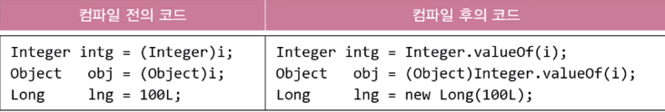


