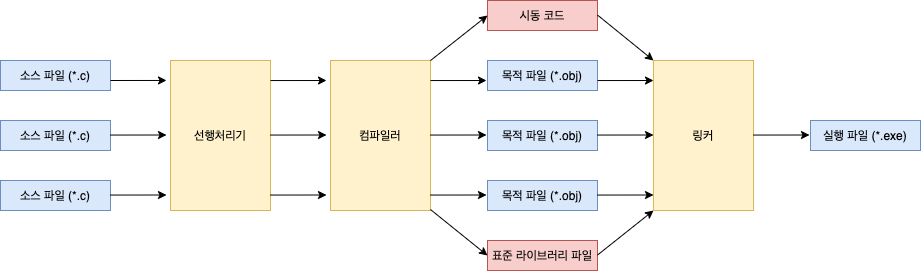
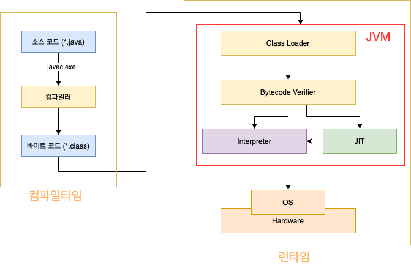
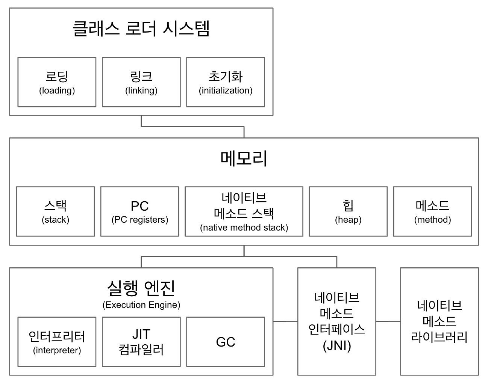
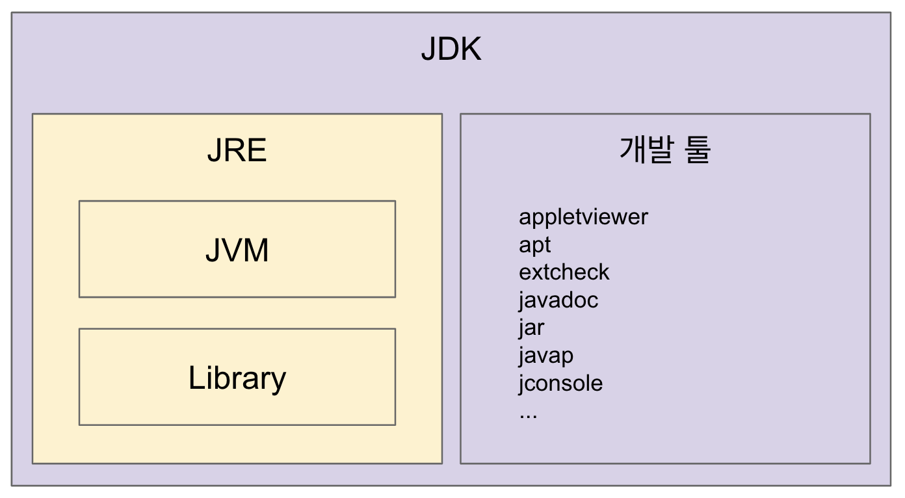

# 1주차 - JVM

본 글은 [백기선님의 live-study](https://github.com/whiteship/live-study/issues/1)를 진행하며 정리한 자료입니다.

목적 - **자바 소스 파일(.java)을 JVM으로 실행하는 과정 이해하기**


## 목차

  * [목차](#목차)
  * [다루는 내용](#다루는-내용)
  * [1 JVM이란](#1-jvm--)
    + [1-1 JVM이란 무엇인가](#1-1-jvm이란-무엇인가)
    + [1-2 바이트코드란 무엇인가](#1-2-바이트코드란-무엇인가)
    + [1-3 JIT 컴파일러란 무엇이며 어떻게 동작하는지](#1-3-jit-컴파일러란-무엇이며-어떻게-동작하는지)
  * [2 JVM 구성요소](#2-jvm-구성요소)
    + [2-1 클래스 로더](#2-1-클래스-로더)
    + [2-2 메모리](#2-2-메모리)
  * [3 자바 컴파일 및 실행 방법](#3-자바-컴파일-및-실행-방법)
    + [3-1 컴파일 하는 방법](#3-1-컴파일-하는-방법)
    + [3-2 실행하는 방법](#3-2-실행하는-방법)
    + [3-4 JDK와 JRE의 차이](#3-4-jdk와-jre의-차이)

- [참고](#참고)


## 다루는 내용

- JVM이란 무엇인가
- 컴파일 하는 방법
- 실행하는 방법
- 바이트코드란 무엇인가
- JIT 컴파일러란 무엇이며 어떻게 동작하는지
- JVM 구성 요소
- JDK와 JRE의 차이


## 1 JVM이란


### 1-1 JVM이란 무엇인가

#### JVM이란?

* JVM (Java Virtual Machine)은 **자바 바이트코드를 실행할 수 있는 있게 해주는 주체**이다.
  * 바이트코드로 컴파일 되는 대표적인 언어가 자바이다. 그 외에도 코틀린, Scala.. 등등 있다.


#### JVM 특징

* WORA (Write Once, Run Anywhere )
  * **JVM은 플랫폼에 독립적**이며 모든 자바 가상 머신은 자바 가상 머신 규격에 정의된 대로 자바 바이트 코드를 실행한다.
  * **모든 자바 프로그램은 CPU나 운영 체제의 종류와 무관하게 동일하게 동작할 것을 보장한다.**
  * 윈도우, 맥, 리눅스.. 등등 운영체제에 종속적이지 않다.
* 가비지 컬렉션 (GC)
  * 클래스 인스턴스는 사용자 코드에 의해 명시적으로 생성되고 GC에 의해 자동적으로 소멸된다.


### 1-2 바이트코드란 무엇인가


#### 바이너리 코드

* 바이너리 코드 (이진코드)란?
  * 바이너리 코드는 **컴퓨터가 이해할 수 있는 0과 1로 구성된 이진코드**를 의미한다.
  
    
  
  * **C언어에서 컴파일러에 의해 소스파일 (`*.c`)이 목적파일 (`*.obj`)로 변환될 때 바이너리 파일로 변환된다. (0과 1)**
    
    * C언어의 목적파일은 기본적으로 컴퓨터가 이해할 수 있는 바이너리 코드의 형태이지만 실행될 수는 없다.
    * 그 이유는 완전한 기계어 (CPU에서 사용하는 명령어 집합)가 아니기 때문이다.
    * 변환된 목적파일은 링커에 의해 실행 가능한 실행파일 (`*.exe`)로 변환될 때 여러 개의 코드와 데이터를 모아서 연결하여 메모리에서 실행 가능 한 파일로 만든다. 이러한 과정을 거쳐야 비로소 컴퓨터가 바로 실행 할 수 있는 기계어가 된다.
  
* 기계어

  * 기계어는 0과 1로 이루어진 바이너리 코드이다.
  * `바이너리 코드 != 기계어`
    * **기계어가 이진코드로 이루어졌을 뿐이지 모든 이진코드가 기계어인 것은 아니다.**
  * **기계어는 특정한 언어가 아니다.**
    * CPU 제조사마다 CPU를 만들때 사용할 수 있는 명령어를 공개하며, 이를 '기계어'라고 부를 뿐이다.
    * 만약 CPU가 변경되면 기계어도 달라진다. 같은 동작을 하는 명령어이지만 0과 1을 인식하는 단위나 방법이 다를 수 있기 때문이다.


#### 바이트 코드

<p align="center"><br>자바 실행 과정</p>

* 바이트 코드란?
  * 컴퓨터가 이해할 수 있는 언어가 바이너리 코드(0과 1)라면 **바이트 코드는 JVM이 이해할 수 있는 코드이다.**
  * 고급 언어로 작성된 소스코드를 JVM이 이해할 수 있는 중간 코드로 컴파일한 것을 의미한다.
  * 이렇게 함으로써, 어떠한 플랫폼에도 종속되지 않고 JVM에 의해 실행될 수 있다.
* 바이트 코드라 불리우는 이유는?
  * 역사적으로 대부분의 명령 집합이 0개 이상의 매개 변수를 갖는 1바이트 크기의 동작 코드였기 때문에 바이트코드라 불리게 되었다고 한다.


### 1-3 JIT 컴파일러란 무엇이며 어떻게 동작하는지

* 전통적인 컴퓨터 프로그램을 만드는 방법
  * 인터프리터 방식 - 실행 중 프로그래밍 언어를 읽어가면서 해당 기능에 대응하는 기계어 코드를 실행 (동적)
    * 코드를 한줄 씩 번역하여 실행한다.
  * 컴파일 방식 - 실행하기 전에 프로그램 코드를 기계어로 번역하여 실행 (정적)
    * 코드를 한번에 번역하고 실행한다.
  * **JIT 컴파일러는 이 두 가지 방식을 혼합한 방식이다.**
* JIT 컴파일러의 동작방식
  * 바이트 코드를 네이티브 코드로 컴파일해주는 역할
  * **인터프리터 효율을 높이기 위해, 인터프리터가 반복되는 코드를 발견하면 JIT 컴파일러로 반복되는 코드를 모두 네이티브 코드로 바꿔둔다.**
  * **그 다음부터 인터프리터는 네이티브 코드로 컴파일된 코드를 바로 사용한다.**
* JIT 컴파일러의 장점
  * **실행 시점에서 인터프리터 방식으로 기계어 코드를 생성하면서 그 코드를 캐싱하여, 같은 함수가 여러 번 불릴 때 매번 기계어 코드를 생성하는 것을 방지한다. 그러므로 인터프리터보다 실행속도가 빠르다.**


## 2 JVM 구성요소

<p align="center"><br>출처 : 백기선님 더 자바 강의</p>

### 2-1 클래스 로더

* 로딩 : 클래스를 읽어오는 과정
* 링크 : 레퍼런스를 연결하는 과정
* 초기화 : static 값들 초기화 및 변수에 할당


### 2-2 메모리

* 메서드 (class 영역)
  * 메모리 영역에는 클래스 수준의 정보 (클래스 이름, 부모 클래스 이름, 메서드, 변수) 저장.
  * class, interface 등등.
* 힙
  * 객체 저장되는 공간.
* 스택
  * 스레드마다 런타임 스택을 만들고, 그 안에 메서드 호출을 스택 프레임이라 부르는 블럭으로 쌓는다.
  * 스레드 종료하면 런타임 스택도 사라진다. (main 스레드 포함 모든 스레드 종료시 프로세스 종료)
* PC (Program Counter) 레지스터
  * 스레드마다 스레드 내 현재 실행하고 있는 부분의 포인터(주소)를 PC라 한다.
  * **프로세스내에서 스레드끼리의 컨텍스트 스위칭을 할 때 실행 주소를 저장하기 위해 사용된다.**
* 네이티브 메서드 스택
  * 자바 이외의 언어 (C, C++, 어셈블리 등)로 작성된 코드를 실행할 때, Native Method Stack이 할당되며, 일반적인 C 스택을 사용한다.
  * 일반적인 경우 JVM 스택에 쌓이다가 해당 메서드 내부에 네이티브 방식을 사용하는 메서드가 있다면 해당 메서드는 네이티브 스택에 쌓인다.


## 3 자바 컴파일 및 실행 방법


### 3-1 컴파일 하는 방법

```shell
$ javac 소스파일명.java
```

* 자바에서 컴파일은 소스파일(`*.java`)를 바이트코드(`*.class`)로 변환하는 과정을 의미한다.
  * **컴파일할 때는 `javac.exe`를 사용한다.**


### 3-2 실행하는 방법

```shell
$ java 소스파일명
```

* `java.exe` 파일을 사용하여 바이트코드로 컴파일 된 `*.class`를 실행하면된다.


### 3-4 JDK와 JRE의 차이

<p align="center"><br>출처 : 백기선님 더 자바 강의</p>

* JDK (Java Development Kit)
  * JRE + 개발에 필요한 툴
*  JRE (Java Runtime Environment)
  * 자바 애플리케이션을 실행할 수 있도록 구성된 배포판.
  * JVM과 핵심 라이브러리 및 자바 런타임 환경에서 사용하는 프로퍼티 세팅이나 리소스 파일을 가지고 있다.


# 참고

* [백기선님 더 자바, 코드를 조작하는 다양한 방법](https://www.inflearn.com/course/the-java-code-manipulation#)
* https://ko.wikipedia.org/wiki/%EC%9E%90%EB%B0%94_%EA%B0%80%EC%83%81_%EB%A8%B8%EC%8B%A0
* https://namu.wiki/w/%EC%9E%90%EB%B0%94%20%EA%B0%80%EC%83%81%20%EB%A8%B8%EC%8B%A0?from=Java%20Virtual%20Machine
* https://d2.naver.com/helloworld/1230
* https://shrtorznzl.tistory.com/82
* https://ko.wikipedia.org/wiki/JIT_%EC%BB%B4%ED%8C%8C%EC%9D%BC
* https://simplesnippets.tech/execution-process-of-java-program-in-detail-working-of-just-it-time-compiler-jit-in-detail/


