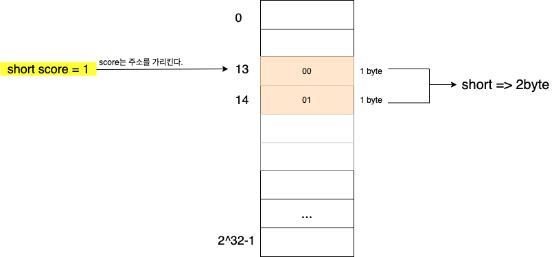

# 2주차 - 자바 데이터 타입, 변수 그리고 배열

본 글은 [백기선님의 live-study](https://github.com/whiteship/live-study/issues/1)를 진행하며 정리한 자료입니다.

목적 - **자바 소스 파일(.java)을 JVM으로 실행하는 과정 이해하기**


## 목차

  * [프리미티브 타입과 레퍼런스 타입](#프리미티브-타입과-레퍼런스-타입)
  * [리터럴](#리터럴)
  * [변수 선언 및 초기화하는 방법](#변수-선언-및-초기화하는-방법)
  * [변수의 스코프와 라이프타임](#변수의-스코프와-라이프타임)
  * [타입 변환, 캐스팅 그리고 타입 프로모션](#타입-변환-캐스팅-그리고-타입-프로모션)
  * [1차 및 2차 배열 선언하기](#1차-및-2차-배열-선언하기)
  * [타입 추론, var](#타입-추론-var)

- [참고](#참고)


## 프리미티브 타입과 레퍼런스 타입


### 타입이란

데이터 타입이란 해당 **데이터가 메모리에 어떻게 저장되고**, 프로그램에서 어떻게 처리되어야 하는지를 명시적으로 알려주는 것이다.

기본적으로 프로그램에서 프로세스로 실행되어 주 기억 장치 (RAM)에 데이터가 올라가면 다음과 같이 저장이 된다.

<p align="center"></p>

전체 메모리를 셀 단위 (8비트 == 1바이트)로 자른다. 셀은 고유 주소와 1 byte의 데이터로 구성된다.

그리고 데이터 타입들은 아래와 같이 저장이 된다.

<p align="center"><br> short의 메모리 저장 방식</p>

<p align="center"><br>int의 메모리 저장 방식</p>

**식별자 (`score`)는 score의 값이 저장된 첫번째 셀의 주소를 참조하고, 데이터 타입으로 다음 몇바이트를 읽어들일지 결정한다.** 

`score`는 int형 데이터 타입의 대표인 1번째 메모리 주소만 가지고 있으면 되는 것이다. (배열도 같은 원리이다.)

그러므로, 데이터 타입에 따라 기본형 데이터 타입의 표현 범위도 다른 것이다.


### 프리미티브 타입 종류와 값의 범위 그리고 기본 값

기본형 데이터타입 (Primitive Type)은 비객체타입이며, 기본적으로 사용되는 데이터 타입이다.


* 총 8가지의 기본형 타입(Primitive Type)을 미리 정의하여 제공한다.
* **모든 기본형 타입은 기본값이 있으며, `Null`이 존재하지 않는다.**
  * 만약 `Null`을 사용하려면 래퍼 클래스를 이용해야 한다.


### Signed vs Unsigned

> 결론적으로 말하면 자바는 Signed만을 디폴트로 지원한다.

기본형 데이터 타입도 레퍼런스 타입과 동일하게 주 기억 장치에 저장된다. (자세히는 Call Stack과 Heap이라 할 수 있겠다.)

데이터 타입마다 할당되는 바이트가 있으며, 이 메모리를 어떻게 사용할지는 개발자 마음이다.

<p align="center"><br>출처 : https://stackoverflow.com/questions/27527943/how-does-adding-min-value-compare-integers-as-unsigned?noredirect=1&lq=1</p>

즉 Signed와 Unsigned는 프로그램에서 수를 표기하는 자료형의 특성이다.

Unsigned는 음수부분을 빼고 양수부분만을 인식하게 하는 하나의 특성이라 보면 된다.

하지만, **자바의 창시자인 고슬링은 Unsigned가 프로그램을 복잡하게한다는 이유로 자바에는 넣지 않았다.**

Java 8의 래퍼 클래스에서는 지원한다는데 사용해본적은 없다.


### 레퍼런스 타입

레퍼런스 타입 (Reference Type)은 참조형이라하며, 기본적으로 `java.lang.Object`를 상속 받는다.

선언한 자료형이 기본형이 아닌 경우 모두 참조형이라고 보면 된다.

* 클래스형
* 인터페이스형
* 배열형


## 리터럴


### 값이란

```java
// 10 + 20은 평가되어 숫자 값 30을 생성한다
10 + 20; // 30
int sum = 10 + 20; // 변수에는 10 + 20이 평가되어 생성된 숫자 값 30이 할당된다.
```

* 값 (value)
  * 값은 식 (표현식, expression)이 평가되어 생성된 결과를 말한다.
  * 변수에 평가되어 할당되는 값


### 리터럴이란

```java
100 // 정수 리터럴

10.5 // 부동소수점 리터럴

"hello" // 문자열 리터럴

true // 불리언 리터럴

null // null 리터럴
```

* 사전적 의미
  * 소스 코드에서 특정한 자료형의 값을 직접 표현하는 방식
  * 변수 및 상수에 저장되는 값 자체
  * 예시
    * 정수 리터럴 - 10, 1, 10000
    * 실수 리터럴 - 10.1, 10e3
    * 문자열 리터럴 - "System", "Binghe"
* 리터럴 (literal)
  * 사람이 이해할 수 있는 문자 또는 약속된 기호를 사용해 값을 생성하는 표기법
  * **리터럴은 평가되어 값을 생성한다**


## 변수 선언 및 초기화하는 방법


### 변수 선언

변수를 선언한다는 것은, 데이터 타입에서도 말했듯 저장공간을 확보하겠다는 의미이다.

```java
int score;
```

`score`라는 식별자는 int 타입의 값을 저장할 수 있는 공간을 확보했다고 볼 수 있다.

변수는 보통 바구니, 그릇에 많이 비유가 된다.


### 초기화하는 방법

변수를 선언했다면, 변수에 저장되는 값을 초기화해야한다.

변수를 선언하면 해당 변수 공간에는 아무런 의미 없는 쓰레기 값이 저장된다.

실제로 자바에서는 초기화를 안하고 실행하게 되면 초기화가 필요하다는 컴파일 에러코드를 마주하게 된다.

```java
// 변수 선언
int score;

// 변수 초기화
score = 100;

// 선언과 초기화 동시에
int score = 100;
```


## 변수의 스코프와 라이프타임


프로그램상에서 사용되는 변수들은 사용 가능한 범위를 가진다. 그 범위를 변수의 스코프라한다.

자바에서는 변수가 선언된 블럭이 해당 변수의 스코프가 된다.

```java
public class ScopeEx {
  int globalScope = 1; // 인스턴스 변수
  
  public void scopeMethod(int value) { // 매개변수인 value도 복사되어 로컬 변수가 된다.
    int localScope = 2; // 로컬 변수
    System.out.println(globalScope);
    System.out.println(localScope);
  }
}
```


### 인스턴스 변수

클래스 안에 선언되며, 객체마다 고유하게 가지고있는 변수를 의미한다.

* 스코프 : static method를 제외한 객체 전체
* 라이프타임 : 인스턴스화한 객체가 메모리에서 소멸될 때까지


### 클래스 변수

클래스 안에 선언되며, static이라는 키워드가 포함된 변수를 의미한다. 

* 스코프 : 클래스 전체
* 라이프타임 : 프로그램 종료시까지


### 로컬 변수

인스턴스 변수, 클래스 변수가 아닌 모든 변수

* 스코프 : 변수가 선언된 블록 내부
* 라이프타임 : 제어권이 로컬 변수가 선언된 블록 내부에 있는 동안 (제어권이 벗어나면 소멸된다.)


## 타입 변환, 캐스팅 그리고 타입 프로모션

프로그래밍 언어에서 연산은 보통 동일한 데이터 타입에서만 가능하다. (2진수를 생각하면 당연하다.)

이럴때 필요한 것이 바로 타입 변환이며, 타입 변환의 종류로는 2가지가 있다.

* 자동 형변환 (타입 프로모션)
* 강제 형변환 (캐스팅)


### 타입 프로모션

```java
int a = 10;
byte b = 12;

a + b // b가 int로 자동 형변환되어 연산의 결과가 나온다.
```

자동적으로 형변환되는 순서는 다음과 같다.

<p align="center"><br>출처 : https://www.scientecheasy.com/2020/07/type-promotion-method-overloading-java.html/</p>


### 캐스팅

캐스팅은 타입 프로모션이 이뤄지는 경우를 제외한 상황에서 연산을 하기 위해 형변환 시켜주는 것을 의미한다.

캐스팅을 하는 방법은 변환시킬 변수 앞에 괄호(`()`)를 사용해서 변환하고자 하는 데이터 타입을 적으면 된다.

주의할 점은 표현할 범위가 더 작은 데이터타입으로 변환할 경우 작은 데이터타입의 표현 범위를 벗어나게되면 예상한 것과 다른 값이 나올수도 있다.

```java
int a = 3531;
byte b = (byte)a;

System.out.println(b); // -53
```


## 1차 및 2차 배열 선언하기


### 배열

컴퓨터에서 배열이란 번호(인덱스)와 번호에 대응하는 같은 타입의 데이터들로 이루어진 선형 자료 구조를 의미한다.

같은 종류의 데이터들이 순차적으로 저장되어, 값의 번호가 곧 배열의 시작점으로부터 값이 저장되어 있는 상대적인 위치가 된다.


### 1차 배열 선언

배열을 선언하기 위해서는 `[]`를 사용한다.

```java
int[] arr = new int[3];
```


배열은 보통 위와 같이 메모리에 선언된다.

`arr`이라는 배열의 식별자는 배열의 첫번째 요소만을 가리키고 있는다. 그리고 첫번째 요소 이외의 요소들을 참조할 때는 다음과 같이 참조하게 된다.

<p align="center"><br>출처 : http://tcpschool.com/c/c_pointerArray_relation</p>

```java
arr[1] == arr+1;
```


### 2차 배열 선언

2차 배열도 1차 배열과 유사하다. 하나의 아파트라고 생각하면 이해가 쉽다.

```java
int[][] arr = new int[3][3];
arr[0][0] = 1;
arr[0][1] = 2;
...
```

<p align="center"><br>출처 : http://ropas.snu.ac.kr/~gslee/lecture-slides/c2011-01/20110513-01.pdf</p>

한가지 중요한 점은 `arr[0]`은 0번째 행을 의미하며, `arr[0][0]`, `arr[0][1]`, `arr[0][2]`의 대표 식별자라고 봐도 된다.


## 타입 추론, var

타입 추론 (Type Reference)이란 소스코드의 값을 보고 컴파일러가 데이터 타입을 무엇인지 추론 한다는 의미이다.

자바스크립트처럼 동적 타입 언어에서 자주 사용되는 `var`, `let`, `const`등을 예로 들 수 있다.

자바에서의 대표적인 타입 추론으로는 Generic Type이 있다.


# 참고

* https://www.learningjournal.guru/article/programming-in-java/scope-and-lifetime-of-a-variable/
* http://ropas.snu.ac.kr/~gslee/lecture-slides/c2011-01/20110513-01.pdf
* TCP School


