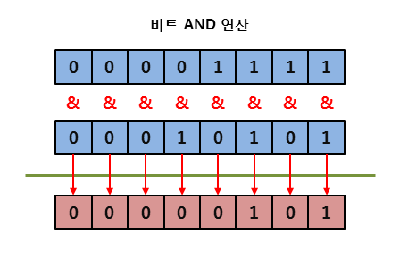
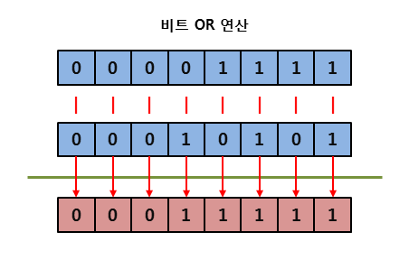
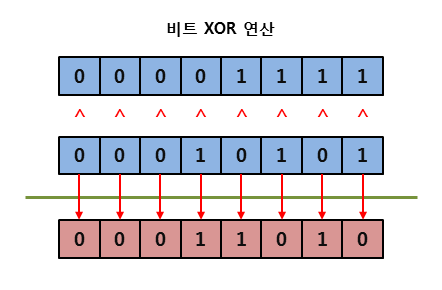
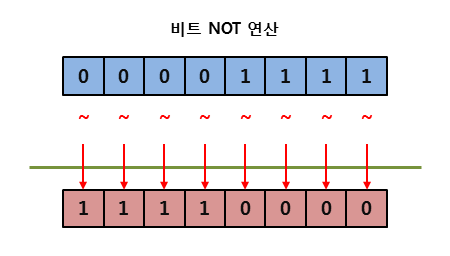
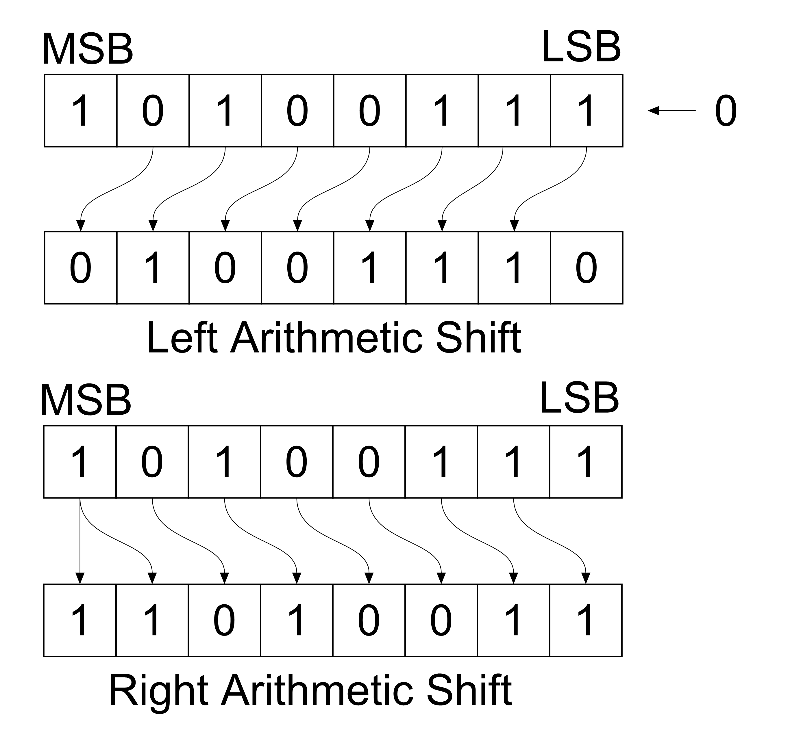

# 3주차 - 연산자

본 글은 [백기선님의 live-study](https://github.com/whiteship/live-study)를 진행하며 정리한 자료입니다.

목적 - **자바가 제공하는 다양한 연산자를 학습**


## 목차

  * [목차](#목차)
  * [용어 정리](#용어-정리)
  * [산술 연산자](#산술-연산자)
  * [비트 연산자](#비트-연산자)
  * [관계 연산자](#관계-연산자)
  * [논리 연산자](#논리-연산자)
  * [instanceof](#instanceof)
  * [assignment(=) operator](#assignment-operator)
  * [화살표(->) 연산자](#화살표--연산자)
  * [3항 연산자](#3항-연산자)
  * [연산자 우선 순위](#연산자-우선-순위)

- [참고](#참고)

<br>

## 용어 정리

* 연산 : 프로그램에서 데이터를 처리하여 결과를 산출하는 것
* 연산자 : 연산에 사용되는 표시나 기호
* 피연산자 : 연산의 대상이 되는 데이터
* 연산식 : 연산자와 피연산자로 연산의 과정을 기술한 것 

<br>

## 산술 연산자

| 산술 연산자 | 설명                                                         |
| ----------- | ------------------------------------------------------------ |
| +           | 왼쪽의 피연산자에 오른쪽의 피연산자를 더함.                  |
| -           | 왼쪽의 피연산자에서 오른쪽의 피연자를 뺌.                    |
| *           | 왼쪽의 피연산자에 오른쪽의 피연산자를 곱함.                  |
| /           | 왼쪽의 피연산자를 오른쪽의 피연산자로 나눔.                  |
| %           | 왼쪽의 피연산자를 오른쪽의 피연산자로 나눈 후, 그 나머지를 반환함. |

```java
public class Main {

    public static void main(String[] args) throws IOException {

        int x1 = 5;
        int x2 = 2;

        System.out.println("x1 + x2 : " + (x1 + x2)); // 7
        System.out.println("x1 - x2 : " + (x1 - x2)); // 3
        System.out.println("x1 * x2 : " + (x1 * x2)); // 10
        System.out.println("x1 / x2 : " + (x1 / x2)); // 2
        System.out.println("x1 % x2 : " + (x1 % x2)); // 1
    }
}
```

기본적으로 프로그래밍에서 산술을 하는데 특징은 아래와 같다.

* 같은 데이터타입끼리만 연산이 된다.
  * 만약 데이터 타입이 다를 경우 타입 프로모션 (자동 형변환)이 발생하게 된다.
* 연산의 결과는 피연산자의 데이터 타입과 동일하다.
  * `5 / 2`는 원래 `2.5`가 나와야하지만, 결과를 보면 `2`가 나온다. 그 이유는 피연산자 모두 정수이기 때문에, 결과도 정수도 나오기 때문이다. 

```java
public class Main {

    public static void main(String[] args) throws IOException {

        double x1 = 5;
        double x2 = 2;

        System.out.println("x1 + x2 : " + (x1 + x2)); // 7.0
        System.out.println("x1 - x2 : " + (x1 - x2)); // 3.0
        System.out.println("x1 * x2 : " + (x1 * x2)); // 10.0
        System.out.println("x1 / x2 : " + (x1 / x2)); // 2.5
        System.out.println("x1 % x2 : " + (x1 % x2)); // 1.0
    }
}
```

<br>

## 비트 연산자

| 비트 연산자 | 설명                                                         |
| ----------- | ------------------------------------------------------------ |
| `&`         | 대응되는 비트가 모두 1이면 1을 반환함. (AND)                 |
| `|`         | 대응되는 비트 중에서 하나라도 1이면 1을 반환함. (OR)         |
| `^`         | 대응되는 비트가 서로 다르면 1을 반환함. (XOR)                |
| `~`         | 비트를 1이면 0으로, 0이면 1로 반전시킴 (NOT, 1의 보수)       |
| `<<`        | 지정한 수만큼 비트들을 전부 왼쪽으로 이동시킴 (left shift)   |
| `>>`        | 부호를 유지하면서 지정한 수만큼 비트를 전부 오른쪽으로 이동시킴. (right shift) |

기본 비트 연산자는 아래와 같이 작동한다.

<p align="center"><br><br><br><br>출처 : http://www.tcpschool.com/cpp/cpp_operator_bitwise</p>

비트 쉬프트 연산은 아래와 같다.

<p align="center"><br>출처 : https://github.com/microsoft/calculator/issues/1118</p>

<br>

## 관계 연산자

| 관계 연산자 | 이름             |
| ----------- | ---------------- |
| `==`        | 같음             |
| `!=`        | 같지 않음        |
| `>`         | 보다 큼          |
| `>=`        | 보다 크거나 같음 |
| `<`         | 보다 작음        |
| `<=`        | 보다 작거나 같음 |

관계 연산자는 피 연산자의 값이 어떤 관계를 갖는지 확인하는 연산이다.

<br>

## 논리 연산자

| 논리 연산자 | 설명                                                 |
| ----------- | ---------------------------------------------------- |
| `&&`        | 논리식이 모두 참이면 1을 반환. (AND)                 |
| `||`        | 논리식 중에서 하나라도 참이면 1을 반환. (OR)         |
| `!`         | 논리식의 결과가 참이면 0을, 거짓이면 1을 반환. (NOT) |

논리 연산자는 주어진 논리식을 판단하여, 참(true)과 거짓(false)을 결정하는 연산자다.

보통 if, for문등에서 많이 사용된다.

```java
public class Main {

    public static void main(String[] args) throws IOException {

        int x1 = -3;
        int x2 = 7;

        boolean result1 = (x1 < 0) && (x1 > -4); // true
        boolean result2 = (x2 < 0) || (x2 > 10); // false
    }
}
```

<br>

## instanceof

instanceof연산자는 이항연산자이며, 레퍼런스 타입 변수가 형변환 가능한지 확인하기 위해 사용된다.

* `A instanceof B` : A가 B의 타입 혹은 하위 클래스(구현체)인지 확인.
  * Reference Type만 사용이 가능하다.

```java
public class Main {

    public static void main(String[] args) throws IOException {

        Parent parent = new Parent();
        Child child = new Child();
        GrandChild grandChild = new GrandChild();

        System.out.println(parent instanceof Parent);             // true
        System.out.println(child instanceof Parent);              // true
        System.out.println(grandChild instanceof Child);          // true
        System.out.println(grandChild instanceof Parent);         // true
        System.out.println(grandChild instanceof MyInterface);    // true
        System.out.println(parent instanceof MyInterface);        // false
    }
}

class Parent {}

class Child extends Parent {}

class GrandChild extends Child implements MyInterface {}

interface MyInterface {}
```

어떤 타입의 대한 instanceof 연산의 결과가 true라는 것은 검사한 타입으로 형변환이 가능하다는 것을 의미한다.

<br>

## assignment(=) operator

대입 또는 할당 연산자라고 부른다.

* `=` : 같다는 의미가 아닌, 오른쪽의 피연산자를 왼쪽의 피연산자의 값으로 할당(대입)하는 연산자
* `==` : 같다는 의미. 왼쪽의 피연산자와 오른쪽의 피연산자가 동일한지 확인하는 관계 연산자

연산의 편리성을 위해 아래와 같이 산술 연산자 + 대입 연산자를 같이 사용하기도 한다.

* `a += 10` => `a = a + 10`

<br>

## 화살표(->) 연산자

자바 8의 람다식에서 익명함수를 만들 때 사용된다.

화살표 연산자를 사용하면 코드가 간결해진다.

* `(인자, ...) -> { /* 메서드 바디 */}`
  * 화살표 왼쪽에 인자, 오른쪽에 실제 표현식을 쓴다.

```java
public class Main {

    public static void main(String[] args) throws IOException {

        List<Integer> list = Arrays.asList(10, 3, 5, 4, 2, 6);

        // 기존의 정렬 (내림차순)
        list.sort(new Comparator<Integer>() {
            @Override
            public int compare(Integer o1, Integer o2) {
                return o2.compareTo(o1);
            }
        });
        
        // 화살표 연산자를 이용한 정렬 (내림차순)
        list.sort((o1, o2) -> {
            return o2.compareTo(o1);
        });
        
    }
}
```

위 예제 코드만 봐도 화살표 연산자를 통해 코드가 많이 짧아지고 가독성도 높아진다는 것을 알 수 있다.

<br>

## 3항 연산자

3항 연산자는 if - else 구문을 간결하게 만든 표현식이다.

* `{조건} ? {true일 경우 반환 값} : {false일 경우 반환 값}`

```java
public class Main {

    public static void main(String[] args) throws IOException {

        int x1 = 5;
        int x2 = 3;

        int max = x1 > x2 ? x1 : x2; // 5
        int min = x1 < x2 ? x1 : x2; // 3
    }
}
```

<br>

## 연산자 우선 순위

| 우선순위 | 연산자       | 예시                                                   |
| -------- | ------------ | ------------------------------------------------------ |
| 1        | 최우선연산자 | `.`, `[]`, `()`                                        |
| 2        | 단항연산자   | `++`, `--`, `!`, `~`, `+/-`  : 부정, bit변환>부호>증감 |
| 3        | 산술연산자   | `*`, `/`, `%`, `+`, `-` ,shift                         |
| 4        | 비교연산자   | `>`, `<` ,`>= `, `<=`, `==`, `!=`                      |
| 5        | 비트연산자   | `&`, `|`, `~`                                          |
| 6        | 논리연산자   | `&&`, `||`, `!`                                        |
| 7        | 삼항연산자   | `조건 ? true : false`                                  |
| 8        | 대입연산자   | `=`, `*=`, `/=`, `%=`, `+=`, `-=`                      |

<br>

# 참고

* TCP School

