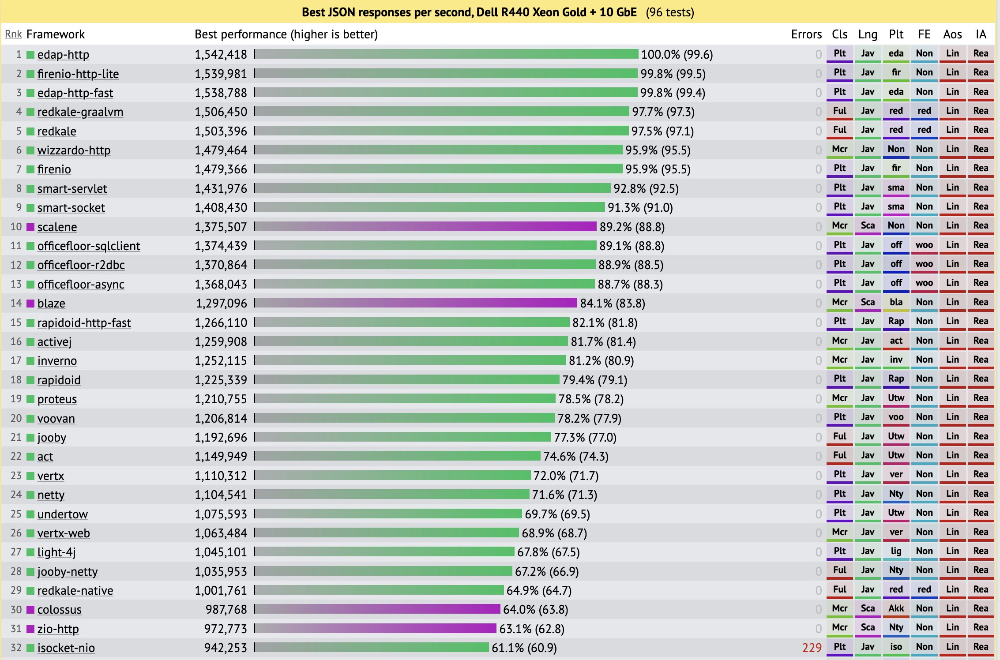
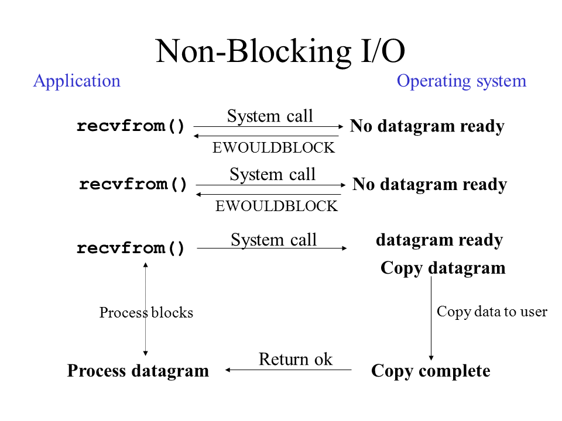
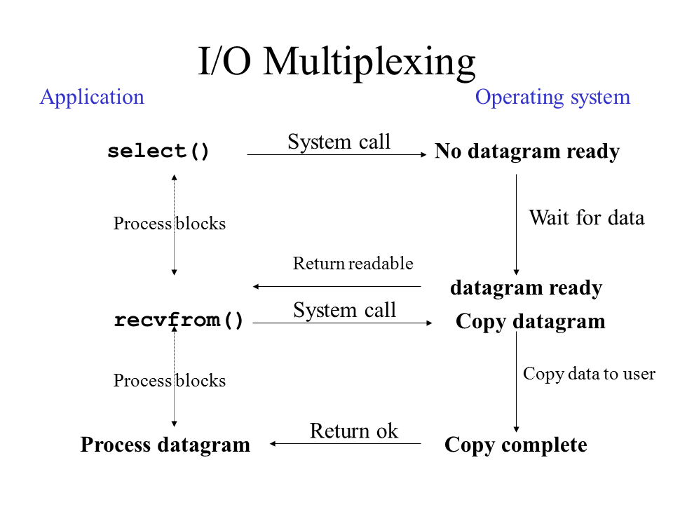
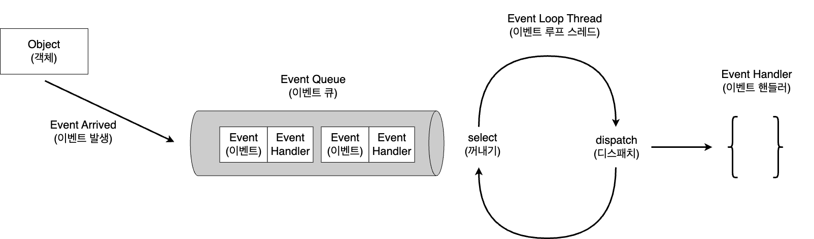
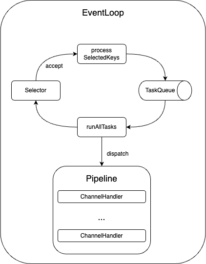
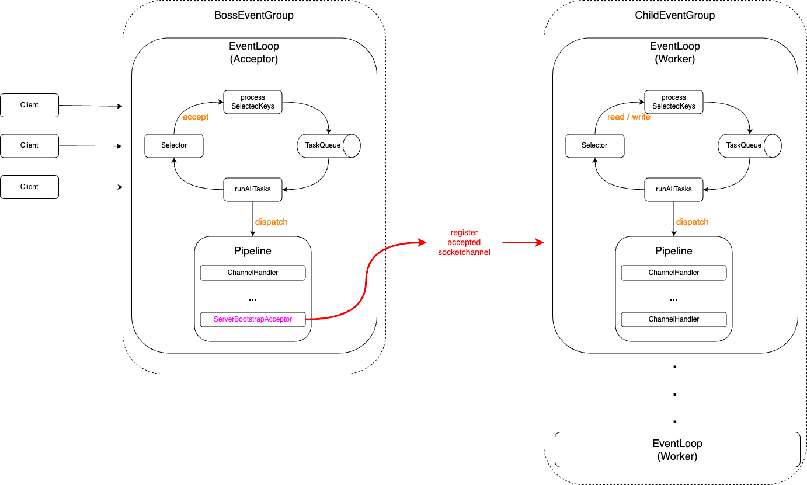
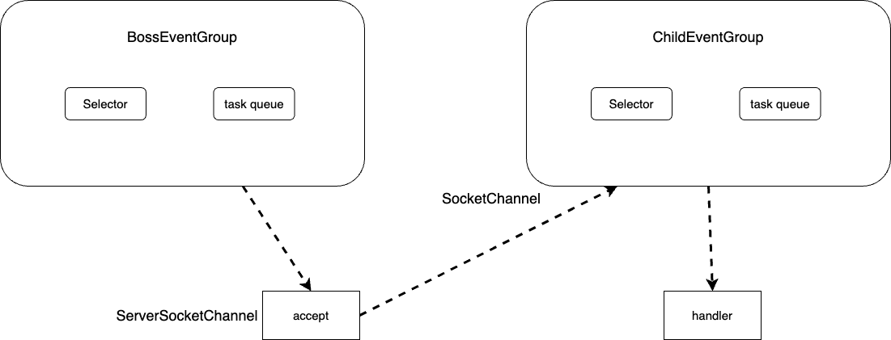
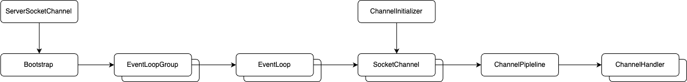

# 목차

<br>

- [목차](#목차)
- [Netty가 빠른 이유와 동작 흐름](#netty가-빠른-이유와-동작-흐름)
- [Netty란 무엇이며 왜 빠른가?](#netty란-무엇이며-왜-빠른가)
  - [첫번째. Blocking I/O와 Non-Blocking I/O](#첫번째-blocking-io와-non-blocking-io)
  - [두번째. 이벤트 기반 프로그래밍 -\> Multiplexing](#두번째-이벤트-기반-프로그래밍---multiplexing)
  - [세번째. ByteBuffer](#세번째-bytebuffer)
  - [결국은 EventLoop](#결국은-eventloop)
- [Netty를 왜 사용하는가?](#netty를-왜-사용하는가)
- [Netty 동작 흐름](#netty-동작-흐름)
- [Netty 구성 요소 (Component)](#netty-구성-요소-component)
  - [Netty 설정 - bootstrap](#netty-설정---bootstrap)
  - [NettyServerSocketChannel](#nettyserversocketchannel)
  - [SocketChannel와 ChannelInitializer](#socketchannel와-channelinitializer)
  - [Handler](#handler)
- [마치며](#마치며)
- [참고](#참고)

<br>

# Netty가 빠른 이유와 동작 흐름

Netty는 JVM 진영에선 가장 유명하고 많이 사용되는 비동기 Event Driven 방식의 네트워크 애플리케이션 프레임워크다.

고성능 네트워크 클라이언트와 서버 모두 개발할 수 있으며, TCP와 UDP를 모두 지원한다.

<p align="center"><br>출처: https://www.techempower.com/ </p>

실제로 JSON 방식의 네트워크 애플리케이션중 흔히 느리다고 많이 말하는 JVM 기반 애플리케이션중 netty는 항상 순위권에 있으며, 

netty를 활용한 다양한 프레임워크 (ex. 대표적으로 vertx, undertow 등등)들도 순위권에 항상 배치되어있다.

그렇다면 `Netty는 어떻게 동작하길래 빠른걸까?` 이 의문은 최근에 가진 나의 의문이었고, 이번 글을 시작으로 Netty에 대해서 하나하나 정리해보고자한다.

그리하여 이번 글은 Netty가 무엇이며 왜 빠른가를 간단히 정리해보고, 동작 흐름과 구성 요소는 무엇이 있는지 Netty를 이해하는게 필요한 큰 그림과 사전 지식을 정리해본다.

<br>

# Netty란 무엇이며 왜 빠른가?

> 아래 이전 글들을 이미 보았다면 이번 장은 스킵하고 바로 Netty 동작 흐름으로 이동해도 좋다. 
> 
> 그리고 만약 Multiplexing이나 EventLoop에 대해 더 자세히 알고싶다면 아래 글을 참고하길 추천한다.
> 
> * [사례를 통해 이해하는 네트워크 논블로킹 I/O와 Java NIO](../../network/nio/io-nio-example-server/io-nio-example-server.md)
> * [사례를 통해 이해하는 Event Loop](../../network/nio/event_loop/event_loop.md)

<br>

Netty는 왜 비교적 빠른 성능을 보여주는 것일까?

이유는 다양할 것인데, 나는 아래 3가지가 가장 큰 이유라고 생각한다.

<br>

## 첫번째. Blocking I/O와 Non-Blocking I/O

Blocking 방식의 네트워크 애플리케이션 서버는 이해하기 쉽고 구현하기 용이하다는 장점이 있지만, 컴퓨터 리소스를 제대로 사용하지 못하는 문제가 있다.

컴퓨터 리소스를 제대로 사용하지 못하는 이유는 TCP 네트워킹에서 accept, read, write등의 I/O 작업을 Blocking하게 처리하기때문에 

소켓을 연결 및 처리하는 Thread가 실제 일을 하지않고있음에도 Thread를 점유해 다른 작업 요청을 처리하지 못하게된다.

Blocking 될 때의 해당 Thread의 기회 비용이 너무 크다는 의미이다.

이 문제를 해결하는 방법은 I/O 작업을 Non-Blocking하게 변경함으로써 적은 수의 Thread로 여러 개의 커넥션을 처리하도록 하는 것이다.

쉬운 이해를위해 음식점을 비유로 들자면 아래와 같다.

* Blocking
  * 손님이 줄서서 자기 순번이오면 음식을 시키고, 그 앞에서 다른 일을 하지 않고 음식 나올 때까지 기다린다.
  * 이때 식당의 카운터 직원도 다른 손님의 주문을 받지 못한다.
* Non-Blocking
  * 손님이 음식을 시키고 전화번호를 입력해두고나서 자기 할 일을 한다. 음식이 나오면 음식점에서 메시지로 알림을 준다. 알림이오면 그제서야 손님은 음식을 받는다.
  * 이때 식당의 카운터 직원은 계속해서 다른 손님의 주문을 받는다.

비유를 통해 알 수 있듯이, Non-Blocking이 음식점 입장에선 훨씬 많은 수의 고객 대상으로 빠르고 효율적으로 장사할 수 있다.

자바도 I/O에 대한 Non-Blockig 기반의 Multiplexing 처리를 위해 New I/O (NIO)를 도입했으며, NIO는 현재까지도 Netty에서 잘 활용되고있다.

그리고 이렇게 Non-Blocking하게 I/O를 처리하면 쉽게 async하게 처리하도록 할 수 있다. Netty도 실제 async + non-blocking하게 동작한다.

<br>

## 두번째. 이벤트 기반 프로그래밍 -> Multiplexing

앞서 말한 Non-Blocking I/O도 구현 방식에 따라 속도 차이가 굉장히 크다. 

<br>

💁‍♂️ **Polling 방식의 Non-Blocking**

<p align="center"><br>출처: https://stackoverflow.com/questions/17615272/java-selector-is-asynchronous-or-non-blocking-architecture </p>

이 방식은 특정 Thread가 polling 방식으로 지속적으로 모든 소켓을 반복하여 작업할게 있는지 체크하고 있으면 작업을 수행하는 방식이다.

Non-Blocking 방식이라고도 볼 수 있긴 한데, **특정 소켓에서 어떤 일이 발생했는지 계속 확인해야하기때문에**

**지속된 kernel에 I/O 시스템 콜 (`read()`)을 계속 호출하면서 필요이상의 CPU의 리소스가 소요된다.**

또한, 구현에 따라 확인하는 과정이 Blocking 되어 처리가 계속 지연되어 더 큰 문제가 발생할 수도 있게된다.

당연히 소켓 수가 늘어나면 성능이 선형적으로 나빠지게된다.

<br>

💁‍♂️ **이벤트 기반 프로그래밍 - Multiplexing**

전통적으로 사용자 인터페이스가 포함된 프로그램에선 이벤트 기반 프로그래밍이 많이 사용된다.

예를 들어 마우스를 클릭에 반응하는 코드가 이에 해당한다. 이와 같이 각 이벤트를 먼저 정의해두고 발생한 이벤트에 따라서 코드가 실행되도록 프로그램을 작성하는 것이다.

앞서 살펴본 Polling 방식은 직접 socket들을 순회하며 읽을 데이터가 있는지 체크하였는데, 이보단 특정 socket이 변경되면 변경되었다고 이벤트를 만들어 알림을 주도록하면 실제 사건이 일어났을때만 컴퓨터가 일을 하면되므로 리소스를 효율적으로 사용할 수 있게된다.

이렇게 이벤트 기반의 Non-Blocking이 바로 Multiplexing이다.

Multiplexing은 단어 뜻대로하면 다중화로 하나의 통로를 여러 개가 활용한다는 의미인데, 

이를 이벤트 기반의 소켓 통신에 적용하면 셀렉터라는 하나의 객체가 여러 소켓 채널의 변화를 감지하여 처리한다는 의미이다.

<p align="center"><br>출처: https://stackoverflow.com/questions/17615272/java-selector-is-asynchronous-or-non-blocking-architecture </p>

그림에서도 알 수 있듯이, Application이 계속해서 OS에 요청을 하지않고, 소켓에 변화가 있을때마다 OS가 Application에 알려주는 방식이다.

자바는 JDK 1.4버전부터 NIO라는 이름으로 이러한 Multiplexing I/O를 지원한다.

그리고 Netty도 이러한 멀티플렉싱을 십분 활용한 EventLoop 기반으로 동작함으로써 높은 성능을 유지한다.

<br>

## 세번째. ByteBuffer

💁‍♂️ **NIO 이전의 기존 Java I/O가 느린 이유**

기존의 Java I/O는 느리다는 얘기를 많이 들었다.

앞서 말했듯이 Blocking 방식으로 처리되는 문제도 있었지만, 또 다른 큰 이유는 JVM 애플리케이션이 커널 버퍼 (Direct Buffer)를 직접 핸들링 할 수 없었기 때문이다.

소켓이나 파일에서 Stream이 들어오면 OS의 커널은 데이터를 커널 버퍼에 쓰게되는데, Java 코드상에서 이 커널 버퍼에 접근할 수 있는 방법이 없었다.

따라서 처음엔 JVM 내부 메모리에 커널 버퍼 데이터를 복사해서 접근할 수 있도록했다. 즉, “커널에서 JVM 내부 메모리에 복사”하는 오버헤드가 존재했다.

> 여기서 말하는 JVM 내부 메모리는 프로세스별로 할당되는 스택이나 힙 메모리를 의미한다.

💁‍♂️ **조금 더 구체적으로 살펴보자면**

* JVM (프로세스)이 file이나 socket으로부터 데이터를 읽기 위해 kernal에 명령을 전달한다.
* kernel은 시스템 콜 (read())를 사용함으로써 디스크 컨트롤러가 물리적 디스크나 소켓으로부터 데이터를 읽어온다.
* OS는 DMA를 이용하여 kernel 버퍼에 해당 데이터를 복사한다. 
* 그리고 JVM (프로세스) 내부 버퍼로 복사하고, JVM은 그제서야 해당 데이터를 사용한다.

위 과정은 단순해보이지만 아래와 같은 문제를 야기한다.

* kernel 버퍼에서 JVM 내부 버퍼로 복사할 때 CPU 소비.
* 복사한 JVM 버퍼내 데이터 사용후 GC가 수거해야함으로써 CPU 소비.
* 복사가 진행되는 동안 I/O 요청한 JVM Thread는 Blocking된 상태.

<br>

💁‍♂️ **커널에 직접 접근할 수 있는 ByteBuffer**

JDK 1.4부터 JVM 내부 버퍼에 복사하는 문제를 해결하기위해 kernel 버퍼에 직접 접근할 수 있는 기능을 제공하기 시작했다.

바로 ByteBuffer이다. 그리고 Netty도 이를 적극 활용함으로써 메모리 복사에 대한 비효율성을 없앴다.

<br>

## 결국은 EventLoop

지금까지 Netty가 빠른 이유 3가지를 살펴보았는데, 이 3가지를 적응 활용하여 만들어진 개념이 바로 EventLoop이다.

<p align="center"> </p>

* Event Loop
  * 무한 반복문을 실행하며 이벤트가 발생할 때까지 대기하다가 이벤트가 발생하면 해당 이벤트를 처리할 수 있는 Handler에게 디스패치한다.
  * 보통 특정 Channel에 대한 이벤트를 큐에 삽입할 때, 해당 이벤트를 처리할 수 있는 Handler도 같이 첨부해준다.
* Handler
  * 이벤트를 받아 비즈니스 로직을 수행한다. (수행완료하고 결과에 맞는 이벤트를 다시 발행하기도한다.)

Netty는 실제로 위 EventLoop 개념을 적극 적용하여 높은 성능을 유지한다. 

물론 잘 사용했을 때 높은 성능을 보장하는 것뿐, blocking이 발생하는 코드를 포함하거나 로직을 잘못구성하면 자칫 성능이 더욱 악화될 수 있다.

그래서 Netty는 잘 알고 사용하는 것이 무엇보다 중요하다.

> 이번 글에선 Java NIO 기준으로 많이 작성되었는데, Netty는 EventLoop 추상화를 다양한 구현체를 지원한다.
> 
> 대표적으로 Linux `epoll()` 기반의 EventLoop도 지원한다.

<br>

# Netty를 왜 사용하는가?

Netty가 왜 빠른지는 알아보다보면 사실 이러한 의문이 생긴다.

`Java NIO를 직접 사용해서 구현하면 되는거 아닌가?`

이 의문에 대한 나의 답은 `그것도 맞다.`이다. 즉, 직접 Java NIO로 EventLoop를 구현하여 고성능 네트워크 애플리케이션을 만들 수 있다.

다만, 개발자는 사실 네트워크 연결과 관련된 부가적 관심사보단 핵심 비즈니스에 대한 핵심 관심사 구현이 주업무이다.

Netty를 사용하면 개발자는 더이상 네트워크 연결의 신뢰성과 잘못될 수 있는 네트워크 모든 세부 사항을 걱정할 필요가 없어진다.

그저 빠르고 쉽게 핵심 비즈니스만 구현하여 고성능 네트워크 애플리케이션 만드는데 집중할 수 있는 것이다.

실제 Netty를 사용하면 아래와 같이 얼마 안되는 코드로 여러 EventLoop가 유기적으로 동작하도록 애플리케이션을 만들 수 있다.

```java
EventLoopGroup bossGroup = new NioEventLoopGroup(1);
EventLoopGroup workerGroup = new NioEventLoopGroup();

try {
    ServerBootstrap b = new ServerBootstrap();
    b.group(bossGroup, workerGroup)
        .channel(NioServerSocketChannel.class)
            .childHandler(new ChannelInitializer<SocketChannel>() {
                @Override
                protected void initChannel(SocketChannel ch) throws Exception {
                    ChannelPipeline pipeline = ch.pipeline();
                    pipeline.addLast(new EchoServerChildInboundHandler());
                }
            });

    // 서버 시작
    log.info("start server...");
    ChannelFuture f = b.bind(8080).sync();
    f.channel().closeFuture().sync();
} finally {
    log.info("close server...");
    workerGroup.shutdownGracefully();
    bossGroup.shutdownGracefully();
}
```

> 물론 Netty를 사용함으로써 가져오는 장점은 많다. 예를 들어, Netty는 EventLoop에 대한 추상화를 잘해둬서 EventLoop 구현체를 쉽게 갈아끼울 수 있다.
> 
> 그리고 다수의 EventLoop를 손쉽게 설정하여 사용할 수도 있다.

<br>

# Netty 동작 흐름
Netty가 왜 비교적 빠른지 살펴보았으니, 이제 Netty는 실제로 어떤 흐름으로 동작하는지 살펴본다.

> Netty Server를 이해하면 Client는 자연스레 이해되므로 Server에 입장에서 글을 작성했다.

<br>

💁‍♂️ **Netty의 기본적인 동작 방식 - EventLoop**

앞서 이야기했듯이 Netty는 EventLoop 기반의 처리 방식으로 동작한다.

더 정확히 말하자면 Netty는 NIO Selector나 Epoll에 등록된 Channel에서 발생하는 이벤트들을 설정된 핸들러가 처리하는 구조이다.

EventLoop의 처리 방식을 그림으로 도식화하면 아래와 같다.

<p align="center"> </p>

그림에서 알 수 있듯이, Selector에 등록한 Key중 이벤트가 발생한 `SelectedKey`들을 Task Queue에 넣고 등록된 Handler Pipeline에 위임하여 네트워크 read/write을 처리하는 구조다.

Pipeline은 추후에 다른 글에서 더 자세히 다룰 예정이며, 여기선 그저 이벤트를 Stream으로 처리하는 Pipeline이라고만 이해해도 충분하다. (Handler 모음)

Node.js와 Redis의 EventLoop와 동일한 매커니즘을 가진다고 보면된다.

<br>

💁‍♂️ **Netty EventLoop 구성 - BossGroup와 ChildGroup**

Netty는 설정을 통해 여러 EventLoop를 조합해서 구성할 수 있다.

즉, 같은 역할을 수행하는 복수의 EventLoop를 EventLoopGroup으로 묶을 수 있으며, EventLoopGroup은 크게 BossGroup와 ChildGroup으로 구성된다.

아래는 Netty의 EventLoop를 구성할 때의 가장 기본이 되는 구조를 도식화한 그림이다.

<p align="center"> </p>

조금 복잡해보일 수 있는데, 간단히보면 두 개의 EventLoop Group으로 구성되어있다고 보면된다.

* BossGroup
  * Acceptor EventLoopGroup으로도 많이 알려져있으며, 새로운 클라이언트의 연결 요청을 처리한다. 즉, 새로운 클라이언트와의 `SocketChannel`을 생성하며, `accept` 이벤트를 처리한다.
  * BossGroup내 EventLoop는 클라이언트와의 연결 부분만 처리하며, `accept` 완료된 `SocketChannel`은 ChildGroup내 EventLoop Selector에 등록하여 데이터 `read/write`부터는 ChildGroup내 EventLoop가 처리하게된다.
* ChildGroup
  * Worker EventLoopGroup으로도 많이 알려져있으며, BossGroup으로부터 전달받아 Selector에 등록된 `SocketChannel`에서 발생하는 `read/write` 이벤트를 처리한다.
  * `read/write`에 대한 이벤트를 모두 처리하기때문에 사용자와의 요청/응답에 대한 비즈니스 처리는 모두 ChildGroup내 EventLoop에서 처리한다.

정리하면 Netty는 다수의 EventLoop를 두 개의 Group으로 묶어서 사용하며, BossGroup은 새로운 커넥션 처리, ChildGroup은 연결된 커넥션에 대한 non-blocking하게 `read/write`를 처리한다고 보면된다.

이를 도식화하면 아래와 같다.

<p align="center"> </p>

이렇게 Netty는 새로운 연결에 대한 처리와 연결된 커넥션에 대한 처리를 분리함으로써 더 많은 트래픽을 동시에 처리할 수 있도록 구성했다.

당연히 새로운 연결보단 채널에 대한 read/write에 대한 이벤트가 훨씬 많이 발생하기때문에, 보통 Worker EventLoop의 수를 더 많이 설정한다.

Netty는 따로 설정안할시 디폴트로 `2 * 사용가능한 프로세서 수`를 설정한다.

> 물론 위 구조가 무조건적인 것은 아니다. 예를 들어, Netty를 Client로 사용할 경우 보통 EventLoopGroup 하나에 connect/read/write 관련 이벤트 모두 처리하도록한다.

<br>

# Netty 구성 요소 (Component)

앞서 살펴보았듯이 Netty는 기본적으로 EventLoop 기반으로 동작한다.

이때 실제 클라이언트-서버간의 네트워크 통신과정에선 여러 컴포넌트들이 각자의 역할을 수행하며 협력한다.

각 컴포넌트별 관계를 아래와 같다.

<p align="center"> </p>

구성 요소간의 동작 흐름을 아래와 같다.

**Netty 설정 -> NettyServerSocketChannel -> (새로운 연결) SocketChannel -> ChannelInitializer -> Pipeline -> Handler**

<br>

## Netty 설정 - bootstrap

Netty를 사용할 때의 흐름중 가장 먼저 접하게되는 건 설정 컴포넌트인 bootstrap이다.

bootstrap은 Netty로 작성한 네트워크 애플리케이션의 동작 방식과 환경을 설정하는 도우미 클래스이며, Netty 애플리케이션이 수행할 동작과 각종 설정등을 지정할 수 있다.

아래는 bootstrap으로 설정할 수 있는 요소이다.

* 전송 계층 (소켓 모드와 I/O 종류)
* 이벤트 루프
* 채널 파이프라인 설정
* 소켓 주소와 포트
* 소켓 옵션

<br>

💁‍♂️ **bootstrap 예시**

```java
EventLoopGroup bossGroup = new NioEventLoopGroup(1);
EventLoopGroup workerGroup = new NioEventLoopGroup();

ServerBootstrap b = new ServerBootstrap();
b.group(bossGroup, workerGroup) // 1
    .channel(NioServerSocketChannel.class) // 2
    .handler(new ChannelInitializer<NioServerSocketChannel>() { // 3
        @Override
        protected void initChannel(NioServerSocketChannel ch) throws Exception {
            log.info("NioServerSocketChannel.initChannel. ch: {}", ch);
            ChannelPipeline pipeline = ch.pipeline();
            pipeline.addLast(new EchoServerInboundHandler());
        }
    })
    .childHandler(new ChannelInitializer<SocketChannel>() { // 4
        @Override
        protected void initChannel(SocketChannel ch) throws Exception {
            log.info("childHandler ChannelInitializer. ch: {}", ch);
            ChannelPipeline pipeline = ch.pipeline();
            pipeline.addLast(new EchoServerChildInboundHandler());
        }
    });
```
주석을 해석하면 아래와 같다.

1. 이벤트 루프 그룹 설정.
2. 비동기 네트워킹에 사용될 서버 채널 설정. (NioServerSocketChannel, EpollServerSocketChannel)
3. boss 이벤트 루프 채널 초기화 클래스 설정. (ServerSocketChannel에 대한 핸들러 설정)
4. worker 이벤트 루프 채널 초기화 클래스 설정. (SocketChannel에 대한 핸들러 설정.)

<br>

## NettyServerSocketChannel
Netty 이벤트 루프와 사용될 Channel등을 설정했다면, 이제 ServerSocketChannel에 대한 설정을 bootstrap해주어야한다.

즉, Netty 서버의 시작과 종료를 관리하는 역할이다.

```java
ChannelFuture f = b.bind(8080).sync(); // 1
f.channel().closeFuture().sync();
```

주석을 해석하면 아래와 같다.

1. bind 호출하여 port와 바인딩후 sync를 호출하여 작업이 완료될 때까지 대기 한다.

<details>
  <summary>netty 실행을 위한 bootstrap 설정</summary>
  
  ---
  
  ```java
    EventLoopGroup bossGroup = new NioEventLoopGroup(1);
    EventLoopGroup workerGroup = new NioEventLoopGroup();

    try {
        ServerBootstrap b = new ServerBootstrap();
        b.group(bossGroup, workerGroup)
                .channel(NioServerSocketChannel.class)
                .handler(new ChannelInitializer<NioServerSocketChannel>() {
                    @Override
                    protected void initChannel(NioServerSocketChannel ch) throws Exception {
                        log.info("NioServerSocketChannel.initChannel. ch: {}", ch);
                        ChannelPipeline pipeline = ch.pipeline();
                        pipeline.addLast(new EchoServerFirstHandler());
                    }
                })
                .childHandler(new ChannelInitializer<SocketChannel>() {
                    @Override
                    protected void initChannel(SocketChannel ch) throws Exception {
                        log.info("SocketChannel.initChannel. ch: {}", ch);
                        ChannelPipeline pipeline = ch.pipeline();
                        pipeline.addLast(new EchoServerFirstChildHandler());
                    }
                });

        // 서버 시작
        log.info("start server...");
        ChannelFuture f = b.bind(8080).sync();
        f.channel().closeFuture().sync();
    } finally {
        log.info("close server...");
        workerGroup.shutdownGracefully();
        bossGroup.shutdownGracefully();
    }
  ```
  
  ---
</details>

<br>

## SocketChannel와 ChannelInitializer
bootstrap 설정후 Netty 서버를 실행했다면 이제 클라이언트의 요청을 받을 수 있다.

그리고 매 새로운 연결이 수립될 때마다 SocketChannel이 생성되며, 이때 ChannelInitializer가 해당 Channel에 Pipeline을 초기화해주는 역할을 수행한다.

```java
public class ChannelInitializerExample extends ChannelInitializer<SocketChannel> {

    // 1
    @Override
    protected void initChannel(SocketChannel ch) throws Exception {
        // 2
        ChannelPipeline pipeline = ch.pipeline();

        // 3
        pipeline.addLast(new EchoServerFirstChildHandler());
    }
}
```

주석을 해석하면 아래와 같다.

1. 새로운 연결이 accept되어 채널이 생성될 때마다 호출된다.
2. 채널 파이프라인을 가져온다.
3. 채널에서 read/write 이벤트 발생시마다 처리할 Handler들을 ChannelPipeline에 초기화해준다.
   * 비즈니스 로직은 따로 구현후 pipeline에 추가해주면 된다.

<br>

## Handler
Handler는 사실 Netty 서버의 가장 핵심적인 부분이다.

Handler는 클라이언트와 연결이 수립되고 데이터를 read/write 할 때의 비즈니스 로직을 담고있다.

간단히 요청받은 내용을 로깅하고 그대로 반환하는 Handler는 아래와 같이 구현할 수 있다.

```java
public class EchoServerFirstChildHandler implements ChannelInboundHandler {

    private static final Logger log = LoggerFactory.getLogger(EchoServerFirstChildHandler.class);

    @Override
    public void channelRegistered(ChannelHandlerContext ctx) throws Exception {
        log.info("EchoServerFirstChildHandler.channelRegistered 실행됨");
        ctx.fireChannelRegistered();
    }

    @Override
    public void channelUnregistered(ChannelHandlerContext ctx) throws Exception {
        log.info("EchoServerFirstChildHandler.channelUnregistered 실행됨");
        ctx.fireChannelUnregistered();
    }

    @Override
    public void channelActive(ChannelHandlerContext ctx) throws Exception {
        log.info("EchoServerFirstChildHandler.channelActive 실행됨");
        ctx.fireChannelActive();
    }

    @Override
    public void channelInactive(ChannelHandlerContext ctx) throws Exception {
        log.info("EchoServerFirstChildHandler.channelInactive 실행됨");
        ctx.fireChannelInactive();
    }

    @Override
    public void channelRead(ChannelHandlerContext ctx, Object msg) throws Exception {
        log.info("EchoServerFirstChildHandler.channelRead 실행됨");
        ctx.fireChannelRead(msg);
    }

    @Override
    public void channelReadComplete(ChannelHandlerContext ctx) throws Exception {
        log.info("EchoServerFirstChildHandler.channelReadComplete 실행됨");
        ctx.fireChannelReadComplete();
    }

    @Override
    public void userEventTriggered(ChannelHandlerContext ctx, Object evt) throws Exception {
        log.info("EchoServerFirstChildHandler.userEventTriggered 실행됨");
        ctx.fireUserEventTriggered(evt);
    }

    @Override
    public void channelWritabilityChanged(ChannelHandlerContext ctx) throws Exception {
        log.info("EchoServerFirstChildHandler.channelWritabilityChanged 실행됨");
        ctx.fireChannelWritabilityChanged();
    }

    @Override
    public void exceptionCaught(ChannelHandlerContext ctx, Throwable cause) throws Exception {
        log.info("EchoServerFirstChildHandler.exceptionCaught 실행됨");
        ctx.fireExceptionCaught(cause);
    }

    @Override
    public void handlerAdded(ChannelHandlerContext ctx) throws Exception {
        // Bootstrap 동작시 handler ChannelPipeline에 추가되면서 실행됨.
        log.info("EchoServerFirstChildHandler.handlerAdded 실행됨");
    }

    @Override
    public void handlerRemoved(ChannelHandlerContext ctx) throws Exception {
        log.info("EchoServerFirstChildHandler.handlerRemoved 실행됨");
    }
}
```
굉장히 다양한 메서드가 존재하는데, 이번 글은 Channel에 대한 생명주기별 콜백 함수를 Handler에 모두 정의할 수 있음을 알려주기위해 모두 구현해보았다.

> Handler도 Inbound와 Outbound로 구성되며, 생명주기도 존재하는데 이와 관련해서는 다른 글에서 더 자세히 다뤄보고자한다.

<br>

# 마치며
이것으로 Netty가 왜 빠르며 왜 사용하는지? 그리고 어떤 흐름으로 동작하는지 큰그림을 정리해보았다.

다음으로는 Netty의 채널 파이프라인, 이벤트 모델, 부트 스트랩, 파이프 버퍼등을 내가 이해한대로 자세히 정리하는 글을 작성해보려고한다.

<br>

# 참고
* https://netty.io/

