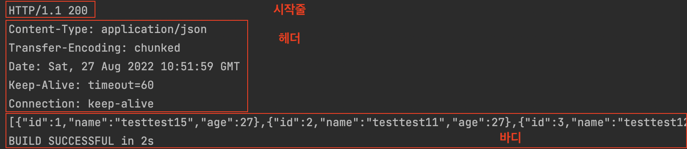
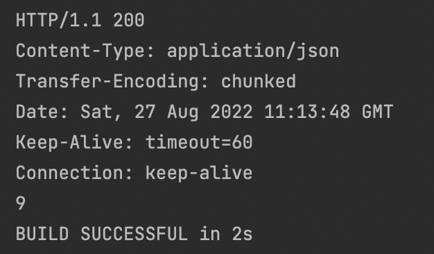

# 목차

<br>

<br>

* HttpClient의 탄생과 HttpComponents
  * URLConnection & HttpURLConnection의 문제
    * 상대적으로 가벼우며 핵심적인 API만 지원한다.
    * 서버로부터 전달 받은 Response 결과를 Stream으로 직접 처리해야하는 문제가 있다. (생산성 저하)
    * 기본적으로 JAVA에서 기본적으로 제공하는 URLConnection은 Connection pool을 사용하지 않습니다.
    * URLConnection은 대상측에서 “Connection : keep-alive” 헤더가 있다면, connection을 살려두고 재사용합니다. 단, 이경우 명시적으로 connection을 닫아주지 않는다면 stream이 종료되더라도 connection이 닫히지 않습니다.
    * URLConnection 객체를 재사용 할 수 없습니다.
    * http 연결에 있어서 다량의 선작업이 필요해 생산성은 떨어지지만, 성능 및 속도면에서 가장 우수하다는 의견이 있습니다. 
  * HttpClient의 탄생
    * HttpURLConnection의 입출력흐름을 인터페이스로 추상화시킴.
      * 기존의 HttpURLConnection의 스트림을 받아서 하나씩 처리해줘야 했던 것과 달리 `execute` 메서드로 꾀나 직관적으로 요청을 처리함.
    * HttpClient 는 오픈 소스 프레임 워 크 로 HTTP 에 접근 하 는 요청 헤더, 파라미터, 내용 체, 응답 등 을 패키지 합 니 다.HttpURLConnection 의 입 출력 흐름 동작 은 이 인터페이스 에서 HttpPost (HttpGet) 와 HttpResponse 로 통일 되 었 습 니 다.이렇게 해서 조작의 번 거 로 움 을 줄 였 다.
      * HttpURLConnection 대비 다양한 API를 제공. (추상화시켜서 사용하기도 편함)
  * 기존 HttpClient의 문제
    * 상대적으로 무겁다는 자료가있음.
    * https://hc.apache.org/httpclient-legacy/
  * HttpClient 4.0부터 재탄생한 HttpComponents
    * HttpClient는 3버전과 4버전이 있으며 4버전부터는 HttpComponents로 불리고 있음.(단, 3버전과 4버전은 둘간 직접적인 호환은 되지 않음)
    * HttpComponents(4버전) 부터는 Thread에 안정적인 기능들을 많이 제공함.
  * HttpComponents는 HttpClient와 HttpCore 모듈로 구성됨.
  * 현재 자바 11부터는 URLConnection 대신 HttpClient가 기본적으로 탑재되었다.
* HttpClient Quick-Start
  * Get
  * Post
* HttpClient 모듈 구성 (각 모듈의 역할)
  * HttpClient
  * HttpCore
* HttpClient는 동작원리
* HttpClient 제대로 사용하기
  * https://inyl.github.io/programming/2017/09/14/http_component.html
* HttpClient의 단점 (RestTemplate 빌드업)
  * URLConnection 을 이용한 방식보다 코드가 간결해졌지만, 여전히 반복적이고 코드들이 길다.
  * 응답의 컨텐츠타입에 따라 별도 로직이 필요하다. (RestTemplate 가 이때 유용!!)

# Apache HttpClient 사용법과 동작원리 (feat. HttpComponents)
[이전 글](../UrlConnection%26HttpUrlConnection/UrlConnection%26HttpUrlConnection.md)에서 Java 애플리케이션을 이용하여 HTTP 호출하는 방법중 가장 기초적인 `URLConnection & HttpURLConnection`에 대해 정리해보았다.

비록 자바는 `java.net` 패키지의 `URLConnection`을 통해 HTTP 요청과 관련된 기능을 제공해주지만, 많은 응용 프로그램에 필요한 유연성과 기능들을 제공하진 않는다.

> 실제로 이전 글에서도 볼 수 있듯이, 요청과 응답에 대한 입출력 흐름을 모두 하나하나 작성해줘야하며, Connection Pool과 관련된 기능도 전혀 없다.

이에 Apache는 `URLconnection`을 추상화하여 편하게 사용할 수 있는 `HttpClient`를 개발하기시작하였고, 이는 HTTP 표준을 지키며 유연하고 효율적이며 풍부한 기능들을 제공해주게된다.

그로인해 대부분의 자바 애플리케이션에서 HTTP 호출할 때 `URLConnection` 대신 `HttpClient`를 사용하게되었다.

> 심지어 자바 11부터는 `HttpClient`가 기본으로 제공되기시작했다. 다만, 이 글은 Apache의 `HttpClient`에 대한 글이다.
> 
> 두 라이브러리의 차이는 [여기](https://medium.com/@kir.maxim/lesson-i-have-learned-from-using-jdk11-http-client-2cf990daba03)를 참고하면 된다.

초반 개발 당시엔 `3.x` 버전으로 Apache Commons의 프로젝트였다가 승급해서 Apache의 탑 레벨 프로젝트가 되었다.

그리고 지금은 `4.x`부터 사용되는 버전을 대부분 사용하며, 이는 `HttpComponents`로 불리운다.

이번 글은 Apache HttpClient (HttpComponents)의 사용법에 대해서 간단히 다루고, 어떻게 동작하는지에 대해서 정리해본다.

<br>

# HttpClient Quick-Start (사용 방법)
바로 HttpClient의 이론적인 부분을 살펴보면 사실 내용이 크게 와닿지도 않고, 재미도없다...

그래서 이번 글에선 HttpClient의 모듈 구성이나 동작 원리에 대해서 알아보기 이전에 간단히 HttpClient를 이용하여 GET과 POST 요청을 날려본다.

이를 통해 HttpClient의 간단한 사용법과 어떻게 동작하는지 큰그림을 그려본다.

<br>

## 동작 순서
HttpClient를 이용하여 HTTP 요청과 응답을 처리하기위한 순서는 아래와 같다.

1. 

<br>


## GET 요청
우선 GET 요청부터 알아본다. 

예시에선 회원 리스트 조회 `GET /users`에 API를 요청해본다.

```java
@Test
void GET_Quick_Start() throws IOException {
    // HttpClient 인스턴스 생성
    CloseableHttpClient httpclient = HttpClients.createDefault();
    // 요청할 HTTP Method에 맞는 인스턴스 생성.
    HttpGet httpGet = new HttpGet("http://localhost:8080/users");
    // HTTP 요청에 담을 내용 정의 (헤더와 바디)
    httpGet.addHeader("User-Agent", "Java Client; Mac OS");
    httpGet.addHeader("Accept", "*/*");
    httpGet.addHeader("Connection", "keep-alive");
    httpGet.addHeader("Keep-Alive", "timeout=5, max=100");

    // HTTP 요청 실행 (TCP 커넥션 + HTTP 요청)
    CloseableHttpResponse response = httpclient.execute(httpGet);

    // 응답 처리
    try {
        System.out.println(response.getStatusLine());                         // 응답의 시작줄
        Arrays.stream(response.getAllHeaders()).forEach(System.out::println); // 응답 헤더

        HttpEntity entity = response.getEntity();

        // 응답 바디 처리
        InputStream inputStream = entity.getContent();
        BufferedReader reader = new BufferedReader(new InputStreamReader(inputStream));

        StringBuilder responseBody = new StringBuilder();
        String line = "";
        while((line = reader.readLine()) != null) {
            responseBody.append(line);
        }
        System.out.println(responseBody);

        // 응답 콘텐츠를 완전히 소비. (완전히 소비해줘야 다음 연결이 안전하게 사용될 수 있다.)
        EntityUtils.consume(entity);
    } finally {
        // 리소스 반환.
        response.close();
    }
}
```
위 테스트의 결과는 아래와 같다. 

<p align="center"> </p>

> 어떤 URL에 요청하느냐에 따라 헤더와 바디 값을 다를 수 있습니다. 이번 글에선 필자가 만든 간단한 회원 CRUD 서버를 로컬에 미리 띄워놓고 해당 서버에 요청을 보냅니다.

<br>

## POST 요청
POST 요청을 통해 회원을 생성해본다.

```java
@Test
void POST_Quick_Start() throws IOException {
    CloseableHttpClient httpClient = HttpClients.createDefault();

    HttpPost httpPost = new HttpPost("http://localhost:8080/users");

    // 요청 헤더
    httpPost.addHeader("User-Agent", "Java Client; Mac OS");
    httpPost.addHeader("Accept", "*/*");
    httpPost.addHeader("Connection", "keep-alive");
    httpPost.addHeader("Keep-Alive", "timeout=5, max=100");

    // 요청 바디
    String requestBody = "{\"name\":\"testtest1\",\"age\":27}";
    httpPost.setEntity(new StringEntity(requestBody, ContentType.APPLICATION_JSON));

    // HTTP 요청 실행 (TCP 커넥션 + HTTP 요청)
    CloseableHttpResponse response = httpClient.execute(httpPost);

    // 응답 처리
    try {
        System.out.println(response.getStatusLine());                         // 응답의 시작줄
        Arrays.stream(response.getAllHeaders()).forEach(System.out::println); // 응답 헤더

        HttpEntity entity = response.getEntity();

        // 응답 바디 처리
        InputStream inputStream = entity.getContent();
        BufferedReader reader = new BufferedReader(new InputStreamReader(inputStream));

        StringBuilder responseBody = new StringBuilder();
        String line = "";
        while((line = reader.readLine()) != null) {
            responseBody.append(line);
        }
        System.out.println(responseBody);

        // 응답 콘텐츠를 완전히 소비. (완전히 소비해줘야 다음 연결이 안전하게 사용될 수 있다.)
        EntityUtils.consume(entity);
    } finally {
        // 리소스 반환.
        response.close();
    }
}
```
위 테스트의 결과는 아래와 같다.

<p align="center"> </p>

<br>

# HttpClient 동작 원리

<br>

## HttpClient 동작 순서

<br>

## HttpClient 동작 원리


<br>

# HttpClient 모듈 구성
> 각 모듈의 역할


## close()를 꼭 호출해줘야한다
GET과 POST 요청을 잘 살펴보면 가장 아래 부분 `finally` 절 안에 `response.close()`를 호출해준다.

// 기본 HTTP 연결은 여전히 응답 개체에 의해 유지되어 응답 콘텐츠가 네트워크 소켓에서 직접 스트리밍될 수 있습니다.
// 시스템 리소스의 올바른 할당 해제를 보장하기 위해 사용자는 finally 절에서 CloseableHttpResponse#close()를 호출해야 합니다.
// 응답 콘텐츠가 완전히 사용되지 않으면 기본 연결을 안전하게 재사용할 수 없으며 연결 관리자에 의해 종료되고 폐기됩니다.

<br>

# 마치며
다음 글은 HttpClient에서 Connection Pool을 이용하는 방법에 대해서 다룬다.


