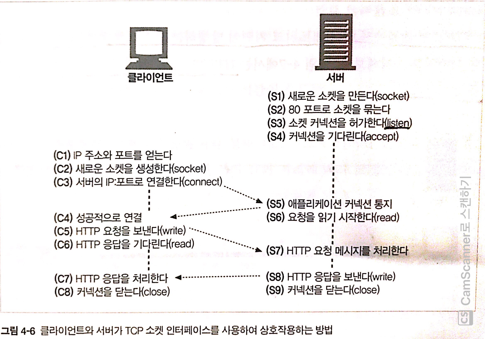
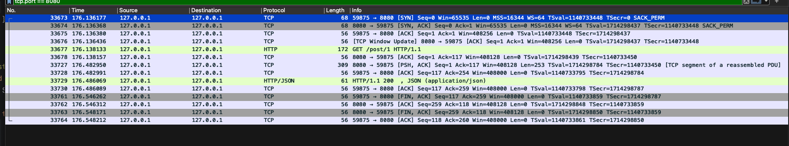
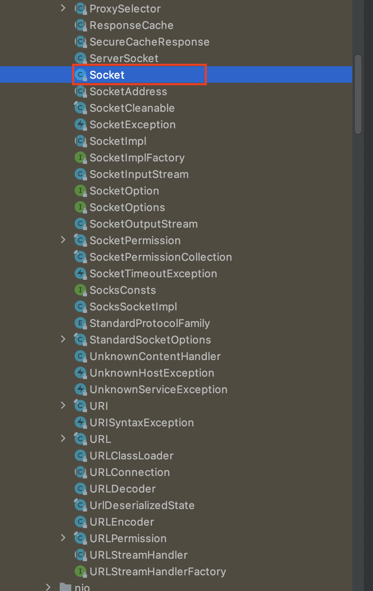
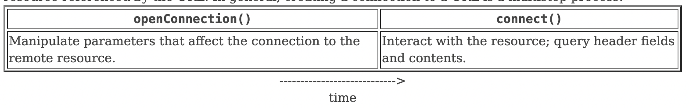
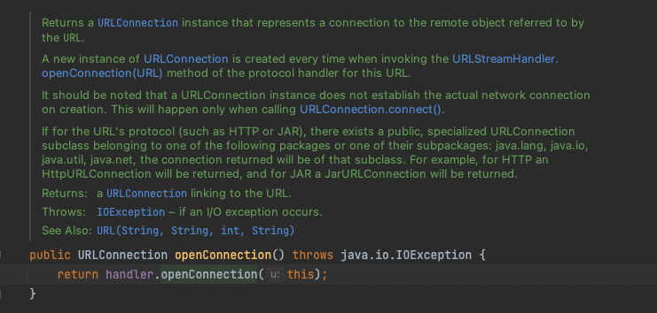
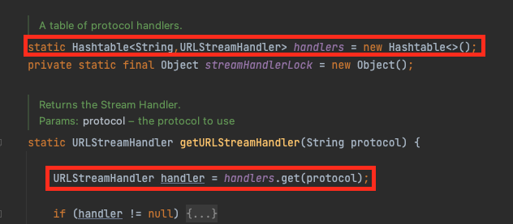
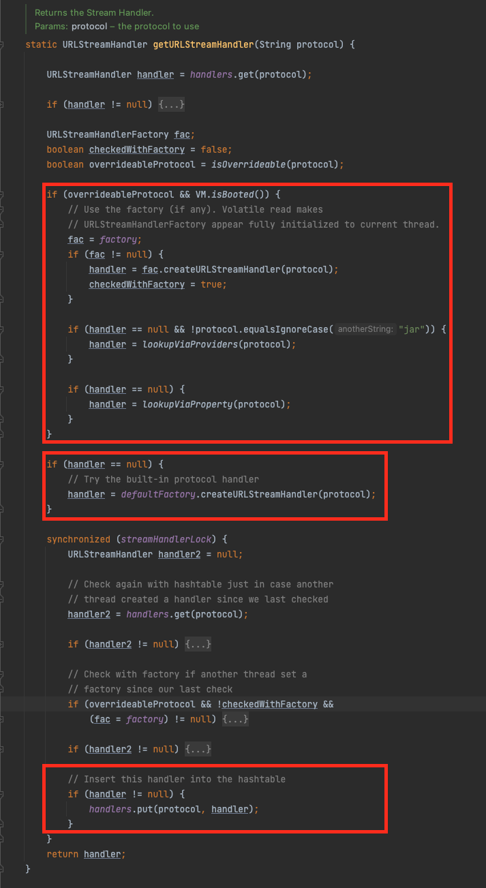
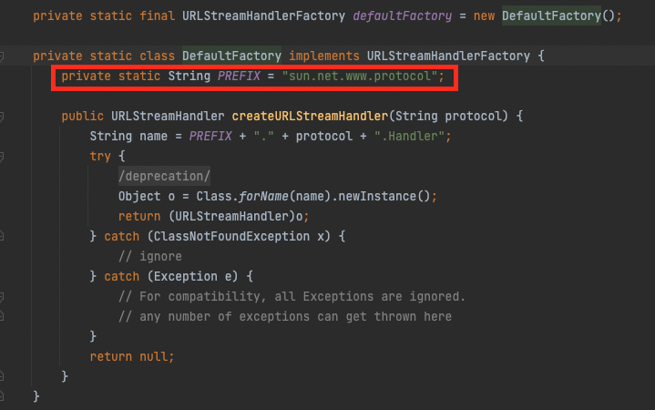

# 목차

<br>

- [목차](#목차)
- [URLConnection \& HttpURLConnection](#urlconnection--httpurlconnection)
- [1 HTTP 통신은 Socket 통신이다.](#1-http-통신은-socket-통신이다)
- [2 URLConnection은 Socket을 추상화한 것이다.](#2-urlconnection은-socket을-추상화한-것이다)
- [3 URLConnection과 HttpURLConnection](#3-urlconnection과-httpurlconnection)
- [4 URLConnection과 HttpURLConnection 사용방법](#4-urlconnection과-httpurlconnection-사용방법)
  - [4-1 URL 객체 생성](#4-1-url-객체-생성)
  - [4-2 URL 객체로부터 URLConnection 객체 얻기](#4-2-url-객체로부터-urlconnection-객체-얻기)
  - [4-3 URL 연결 구성 (요청 헤더 및 HTTP 기타 설정)](#4-3-url-연결-구성-요청-헤더-및-http-기타-설정)
  - [4-4 HTTP 요청 바디 구성 (출력 스트림을 이용하여 데이터 쓰기)](#4-4-http-요청-바디-구성-출력-스트림을-이용하여-데이터-쓰기)
  - [4-5 HTTP 연결](#4-5-http-연결)
  - [4-6 HTTP 헤더 및 응답 가져오기](#4-6-http-헤더-및-응답-가져오기)
  - [4-7 연결 종료](#4-7-연결-종료)
  - [4-8 GET과 POST 요청 예시](#4-8-get과-post-요청-예시)
- [마치며](#마치며)
- [참고](#참고)

<br>

# URLConnection & HttpURLConnection
필자가 다니는 회사에서 맡고있는 서비스가 점차 커짐에따라 점차 외부 요청에 대한 수요가 많아졌다.

물론 RestTemplate와 WebClient등을 사용하여 쉽게 HTTP 통신을 구현할 수 있지만.. 여러가지 설정을 하다보니 이해안되는 부분이많아 관련해서 파고들다 결국 URLConnection까지 오게되었다...

**RestTemplate과 WebClient 모두 URLConnection을 추상화한 HttpClient를 이용하여 네트워크 통신을한다.**

> HttpClient는 인터페이스이며 여러 벤더사가 존재한다. 유명한걸로는 Apache HttpClient가 존재한다.

그러기에 필자는 URLConnection의 사용 방법과 동작원리를 이해하는게 큰 도움이 될 것이라 생각들어 이번 글을 작성하게되었다.

이번 글은 URLConnection이 무엇이며, 어떤 역할을하는지 살펴보고, 직접 학습테스트를 통해 코드로 통신하는 과정을 살펴본다.

<br>

# 1 HTTP 통신은 Socket 통신이다.
본격적으로 URLConnection을 살펴보기전에, 네트워크 개념을 먼저 정리하였다.

> 이미 아는 내용이면 이 부분은 넘어가도 좋다.

<br>

구글에 HTTP 통신과 소켓 통신을 검색하면 `HTTP 통신 vs 소켓 통신`의 주제로 둘을 많이 비교한다.

이로인해 많은 사람들이 이 둘이 같은 레벨에 존재하며, 둘중 하나만을 이용하여 네트워크 통신해야하는 것으로 알고있는 경우가 있다.

> 실제 필자 주변의 개발자중에 그러신 분이 있었다.. 이 내용을 이 글에 추가하게 된 계기가되기도한다.

<br>

결론적으로 말하면 **HTTP 통신은 Socket을 통해 통신한다.**

HTTP(HyperText Transfer Protocol)란 웹상에서 데이터를 주고 받을때 사용되는 애플리케이션 계층의 프로토콜로 보통 클라이언트와 서버가 서로 통신할 때 사용되는 일종의 약속이다.

**HTTP는 두 엔드포인트가 연결될 수 있도록하는 근본적인 전송 프로토콜을 요구하진 않지만.. 보통 연결 기반인 TCP 표준에 의존한다.** (TCP가 무결성을 만족해주기때문)

즉, **HTTP란 TCP 위에서 실행된다는 것이다. 그리고 애플리케이션 계층에서 TCP 연결을 위해선 소켓이라는 인터페이스를 이용한다.**

> 다시 한번 말하지만.. HTTP 또한 소켓 통신을 활용한다. 그리고 소켓은 TCP를 통해 연결된다.

[HTTP 완벽 가이드](http://www.yes24.com/product/goods/15381085)에서 가져온 아래 이미지를 보면 쉽게 이해가 된다.

<p align="center"><br>출처: HTTP 완벽 가이드 </p>

다만, 보통 소켓 프로그래밍이라고하면 두 엔드포인트가 TCP로 연결되어 사용자가 종료를 하지않는 이상 계속해서 연결하여 양방향으로 통신한다. (채팅을 생각하면 이해가 쉽다.)

이에 반해, HTTP는 아래와 같이 소켓을 통해 두 엔드포인트가 TCP 연결하고 HTTP 요청과 응답을 수행하고 바로 TCP 연결을 종료한다.

<p align="center"><br>간단한 HTTP 요청과 응답 과정. </p>

3 way handshake로 TCP Socket을 연결하고, 연결이 성공적으로 되었다면 HTTP 요청과 응답이 이루어진다.

그리고 마지막으로 4 way handshake로 TCP 연결을 종료하는 것을 볼 수 있다.

> 물론 HTTP1.1부터 나온 Keep-Alive를 통해 HTTP도 주어진 시간만큼 커넥션을 유지한다.

<br>

# 2 URLConnection은 Socket을 추상화한 것이다.
자! 이제 HTTP는 소켓 통신을 이용한다는 것을 이해했다.

본격적으로 자바 세계로 들어오자면.. 자바에서도 Socket 통신을 위한 라이브러리를 지원한다.

<p align="center"><br>JDK의 `java.net` 패키지에있는 클래스들 </p>

`Socket` 클래스를 이용한다면 HTTP 통신을 실행할 수 있다.

다만.. `Socket` 클래스는 바이너리 형식으로 데이터를 전송하고 수신하며, 매번 HTTP 통신을 위해 중복된 코드를 많이 작성해줘야한다.

이는 **개발자로하여금 핵심 로직 (HTTP 통신)보다 부가 로직 (Socket 통신)이 더 많으므로, 핵심 로직에만 집중할 수 없게된다.**

이로인해 **자바에선 `URLConnection` 클래스를 지원한다.**

**`URLConnection` 클래스는 자바에서 외부와 통신할 때 부가로직 (Socket 통신)과 구체적인 원리를 잘 알지 못해도 URL을 통해서 외부와 통신을 쉽게 구현할 수 있도록해준다.**

즉, **통신하고 싶은 URL만 알면 쉽게 통신할 수 있도록, Socket 통신부분을 추상화했다고 볼 수 있다.**

> 실제로 URLConnection의 connect() 부분을보면 Socket 관련 코드를 쉽게 찾아볼 수 있다.

<br>

# 3 URLConnection과 HttpURLConnection

<br>

💁‍♂️ **URLConnection의 역할**

추상 클래스인 `URLConnection`은 자바 애플리케이션과 외부 URL 간의 통신을 지원하는 모든 클래스의 상위 클래스이다.

이 클래스를 상속하는 모든 하위 클래스는 URL에서 참조하는 리소스를 읽고 쓰는데 모두 사용될 수 있다.

**정리하면, URLConnection은 URL을 통한 통신할 때 사용되는 모든 클래스들의 인터페이스 역할을 한다고 볼 수 있다.**

<br>

💁‍♂️ **`URLConnection`의 연결 순서**

`URLConnection`이 일반적으로 연결을 수행하는 과정은 아래와 같다.

<p align="center"><br>출처: https://docs.oracle.com/javase/8/docs/api/java/net/URLConnection.html </p>

1. `URLConnection` 객체는 `URL` 객체의 `openConnection()` 메서드를 호출하여 생성한다.
2. 요청에 사용되는 매개변수와 속성들을 `URLConnection`에 설정한다.
3. `connect()` 메서드를 사용하여 외부 URL과의 실제 연결이 이루어진다.
4. 외부 URL의 존재하는 애플리케이션의 응답을 사용할 수 있게된다. 헤더 필드와 바디에 액세스할 수 있다.

> 지금은 위 순서가 이해가 안되도 무방하다. 아래에서 학습 테스트를 통해 더 자세한 알아본다.

<br>

💁‍♂️ **`HttpURLConnection`**

앞서 말했듯, `URLConnection` 클래스는 일반적인 URL통신에 대한 추상화된 API를 제공한다.

개발자는 Socket 통신 부분을 전혀 이해하지못해도 쉽게 URL만으로 통신을 할 수 있다.

**`HttpURLConnection`은 `URLConnection`의 구현 하위 클래스로 HTTP 고유의 기능에 대한 추가 적인 API를 제공한다.**

<br>

💁‍♂️ **`URLConnection`과 `HttpURLConnection` 모두 추상클래스다.**

두 클래스는 모두 추상클래이다.

이는 **두 클래스의 새 인스턴스를 직접 만들 수 없음을 뜻하며, 하위의 구현 클래스를 이용해야한다는 것을 의미한다.**

**보통은 `URL` 객체에서 연결을 통해 `URLConnection`의 인스턴스를 얻어낸다.**

<br>

# 4 URLConnection과 HttpURLConnection 사용방법
이제 지루한 이론적은 부분을 끝내고, 직접 자바 코드를 작성하면서 HTTP 통신을 해보는 학습 테스트를 진행해본다.

<br>

💁‍♂️ **통신 단계**

앞에서도 다루었지만, 조금 더 구체적으로 URLConnection을 통해 통신하는 과정을 나열하면 아래와 같다.

1. URL 객체 생성
2. URL 객체로부터 URLConnection 객체 얻기
3. URL 연결 구성 (요청 헤더 및 HTTP 기타 설정)
4. HTTP 요청 바디 구성 (출력 스트림을 이용하여 데이터 쓰기)
5. HTTP 연결 (Socket 연결도 이때 실행된다.)
6. HTTP 응답 바디 가져오기
7. 연결 종료

<br>

## 4-1 URL 객체 생성
```java
URL url = new URL("http://localhost:8080")
```
URL 객체는 위와 같이 생성할 수 있다.

URL 객체는 생성자에서 URL 형식에 대한 검증을 진행한다. 그리고 URL 형식이 잘못된 경우 `MalformedURLException`을 던진다.

> 이 예외는 `IOException`의 하위 킅래스이다.

<br>

## 4-2 URL 객체로부터 URLConnection 객체 얻기
`URLConnection` 인스턴스는 추상 클래스이기에 바로 생성할 수는 없다.

바로 `URL` 객체의 `openConnection()` 메서드 호출에 의해 생성된다.

```java
URLConnection urlConnection = url.openConnection();
```

`http://`로 시작하는 URL인 HTTP 프로토콜이면 `HttpURLConnnection`으로 캐스팅할 수 있다.

```java
HttpURLConnection httpUrlConnection = (HttpURLConnection) url.openConnection();
```

`URLConnection`은 명시적으로 `connect()` 메서드를 호출하거나, 암시적으로 입력스트림/출력스트림을 가져오기전까지 네트워크 연결이 이루어지지않는다.

네트워크 연결을 이루기전까진 `URLConnection` 클래스에 HTTP 요청에 대한 설정을 할 수 있다.

그리고 `openConnection()` 메서드는 I/O오류가 발생하면 `IOException`이 발생한다.

<br>

🤔 **`openConnection()`이 반환하는 `URLConnection` 객체는 어디에서 얻는 것일까?**

<p align="center"> </p>

위 코드에서 `handler`는 `URLStreamHandler`의 인스턴스이다.

그리고 `URL` 클래스의 `openConnection()` 메서드를 보면 아래와 같이 써져있는 부분이 존재한다.

> A new instance of URLConnection is created every time when invoking the URLStreamHandler.openConnection(URL) method of the protocol handler for this URL.

`URLStreamHandler.openConnection(URL)` 메서드를 호출할 때마다 `URLConnection`의 새 인스턴스가 생성된다. (물론 항상 새로 생성하여 반환하진 않을 것이다.)

`URLStreamHandler`는 `URL` 객체가 아래와 같이 static으로 가지고있는다. (`Map<Protocol, URLStreamHandler>` 형태이다)

<p align="center"> </p>

`getURLStreamHandler()`는 매 `URL` 인스턴스가 생성될 때마다 매개변수로 `Handler`를 넘기지않으면 실행되는 메서드이다.

즉, `URL`의 인스턴스가 새로 생성될 때마다, 프로토콜을 분석하여 위 `Map`으로부터 `URLStreamHandler`를 얻어온다.

<br>

🤔 **그렇다면 `URL` 객체는 `URLStreamHandler`의 구현 클래스를 어디에서 얻어서 static 형태의 `Map`에 저장하는 것일까?**

결론적으론 `URLStreamHandlerFactory`에 의해서 생성되며, `URL` 객체는 저 객체를 static으로 가지고있다.

> `URLStreamHandlerFactory`을 설정하는 setter는 주어진 JVM에서 최대 한 번만 호출된다. (이때 JVM이 실행되면서 해당되는 Factory 구현체가 static으로 주입되는 것)

그리고 `URLStreamHandlerFactory`는 크게 두 가지 방식으로 가지고오게된다.

<p align="center"> </p>

1. JVM이 시동되면서 static으로 설정된 `URLStreamHandlerFactory`이 주입되었는지 확인한다. 만약 있다면 해당 Factory를 이용한다.
2. 1번이 없다면 `DefaultFactory`를 이용한다. `DefaultFactory`는 아래와 같이 특정 패키지에 있는 Factory를 반환한다.
   * 필자가 테스트로 생성한 프로젝트에선 `sun.net.www.protocol` 패키지에서 가져온다.

<p align="center"> </p>

<br>

## 4-3 URL 연결 구성 (요청 헤더 및 HTTP 기타 설정)
실제 네트워크 연결을 실행하기 전에 타임아웃, 캐시, HTTP 설정등을 설정할 수 있다.

그리고 이러한 설정은 `URLConnection`통해 설정한다.

```java
URL url = new URL("http://localhost:8080");
HttpURLConnection urlConnection = (HttpURLConnection) url.openConnection();

// 요청 Header
urlConnection.setRequestMethod("GET");
urlConnection.setRequestProperty("User-Agent", "Java Client; Mac OS");
urlConnection.setRequestProperty("Accept", "*/*");
urlConnection.setRequestProperty("Connection", "keep-alive");
```

물론 다양한 설정을 제공한다.

* `setConnectTimeout(int timeout)` - 연결 타임아웃 값을 설정한다. (단위 : ms)
  * 연결이 설정되기 전에 설정된 시간이 만료되면 `java.net.SocketTimeoutException`이 발생한다.
  * JDK 1.5부터 생겼으며, 시간을 0으로 설정하면 타임아웃은 무한대이다.
* `setReadTimeout(int timeout)` - 읽기 타임아웃 값을 설정한다. (단위 : ms)
  * 제한 시간이 만료되었으나, 연결의 입력 스트림에서 읽을 수 있는 데이터가 없으면 동일하게 `SocketTimeoutException`이 발생한다.
  * JDK 1.5부터 생겼으며, 시간을 0으로 설정하면 타임아웃은 무한대이다.
* `setDefaultUseCaches(boolean default)` - `URLConnection`이 기본적으로 캐시를 사용할 것인지 여부를 설정한다.
  * 디폴트는 true이며, 한번 설정한 값이 다음 `URLConnection`에도 계속해서 적용된다.
* `setUseCaches(boolean useCaches)` - 연결이 캐시를 사용하는지 여부를 설정한다.
  * 디폴트는 true이다. 해당 `URLConnection`에만 적용된다.
* `setDoInput(boolean doInput)` - `URLConnection`를 통해 서버로부터 받아온 응답에서 Body 부분 읽기 여부를 설정한다.
  * 디폴트는 true이며, `GET`, `POST`등등 HTTP를 통해 응답 Body에서 값을 InputStream으로 꺼내야하는경우 true로 설정해줘야한다.
* `setDoOutput(boolean doOutput)` - `URLConnection`를 통해 서버에 요청보낼 때 요청 Body 부분을 사용할지 여부를 설정한다.
  * 디폴트는 false이며, `POST`, `PUT`등 서버에 요청 Body에 값을 OutputStream을 이용하여 넣어보내야할 때 true로 설정해줘야한다.
* `setIfModifiedSince(long time)` - HTTP 프로토콜에 대해 클라이언트가 검색한 컨텐츠의 마지막 수정 시간을 새로 설정한다.
  * 서버가 지정된 시간 이후에 정적컨텐츠가 변경되지 않았으면, 컨텐츠를 가져오지않고 상태 코드 304를 반환한다. 클라이언트가 지정한 시간보다 최근에 수정된 경우 새로운 컨텐츠를 받는다.
* `setAllowUserInteraction(boolean allow)` - 사용자 상호 작용 여부를 설정.
* `setDefaultAllowUserInteraction(boolean default)` - 이후의 모든 URLConnection 객체에 대한 사용자 상호 작용의 기본값을 설정.
* `setRequestProperty(String key, String value)` - 일반 요청 속성을 설정한다.
* `setRequestMethod(String method)` - HTTP메서드를 설정한다. 기본값은 GET이다.
* `setChunkedStreamingMode(int chunkLength)` - 컨텐츠 길이를 미리 알 수 없는 경우 내부 버퍼링 없이 HTTP 요청 본문을 스트리밍할 때 사용된다.
* `setFixedLengthStreamingMode(long contentLength)` - 컨텐츠 길이를 미리 알고있는 경우 내부 버퍼링 없이 HTTP 요청 본문을 스트리밍할 때 사용된다.
* `setFollowRedirects(boolean follow)` - HTTP 리다이렉션 뒤에 이 클래스의 미래 인스턴스가 자동으로 따라야 하는지 여부를 설정한다.
  * 디폴트는 true이다.
* `setInstanceFollowRedirects(boolean follow)` - HTTP 리다이렉션 뒤에 이 HttpURLConnection의 인스턴스가 자동으로 따라와야하는지 여부를 설정한다.
  * 디폴트는 true이다.

> 더 자세한 내용은 [여기](https://docs.oracle.com/javase/8/docs/api/java/net/HttpURLConnection.html)를 참고.

<br>

## 4-4 HTTP 요청 바디 구성 (출력 스트림을 이용하여 데이터 쓰기)
HTTP 요청의 바디는 출력 스트림을 통해 구성할 수 있다.

```java
// URL 및 URLConnection 생성
URL url = new URL(url);
HttpURLConnection urlConnection = (HttpURLConnection) url.openConnection();

// 요청 Header
urlConnection.setRequestMethod("POST");
urlConnection.setDoOutput(true); // RequestBody를 위한 설정
urlConnection.setRequestProperty("User-Agent", "Java Client; Mac OS");
urlConnection.setRequestProperty("Accept", "*/*");
urlConnection.setRequestProperty("Content-Type", "application/json; utf-8");
urlConnection.setRequestProperty("Connection", "keep-alive");

// 요청 Body
String requestBody = "{\"name\":\"testtest15\",\"age\":27}";
try (OutputStream os = urlConnection.getOutputStream()){
    byte request_data[] = requestBody.getBytes("utf-8");
    os.write(request_data);
}
catch(Exception e) {
    e.printStackTrace();
}
```
위 예시는 JSON을 바디로 담아서 요청보내는 예시이다.

<br>

## 4-5 HTTP 연결
`URLConnection`에 요청을 보낼 설정 (헤더, 바디)등을 완료하면 이제 Connection을 실행시켜 목적 URL에 실제 요청을 보낸다.

```java
// 연결 (HTTP 연결 실시)
urlConnection.connect();
```

위와 같이 `connection()`를 호출해도되고, `urlConnection.getHeaderFields()` 혹은 `urlConnection.getInputStream()`을 해도 된다.

뒤에 두 메서드도 자동으로 요청을 보낸다.

<br>

## 4-6 HTTP 헤더 및 응답 가져오기
연결이 이루어지고 HTTP 요청이 날아가면, 서버는 헤더와 실제 컨텐츠에 대한 응답을 다시 반환한다.

응답에 대한 헤더 정보와 바디 정보를 가져오는 방법은 아래와 같다.

```java
// 연결 (HTTP 연결 실시)
urlConnection.connect();

// 응답 헤더 출력
Map<String, List<String>> headerFields = urlConnection.getHeaderFields();

System.out.println("상태 코드: " + urlConnection.getResponseCode());
headerFields.forEach((key, value) -> {
    System.out.println(key + " : " + value);
});

// 응답 바디 출력
InputStream inputStream = urlConnection.getInputStream();
BufferedReader reader = new BufferedReader(new InputStreamReader(inputStream, "utf-8"));

StringBuilder responseBody = new StringBuilder();
String line = "";
while((line = reader.readLine()) != null) {
    responseBody.append(line);
}

// 응답 바디 출력
System.out.println(responseBody);
```

<br>

## 4-7 연결 종료
요청과 응답에 대한 처리가 완료되면 `InputStream` 또는 `OutputStream` 인스턴스에서 `close()` 메서드를 호출한다.

이를 통해 `URLConnection` 인스턴스의 연결된 네트워크 리소스를 해제할 수 있다.

<br>

## 4-8 GET과 POST 요청 예시

마지막으로.. 특정 서버에 GET과 POST 요청을하는 예시를 살펴본다.

서버는 간단하게 CRUD를 지원하는 회원 API를 생성하여 실행한다.

해당 API에 대한 코드는 [여기](https://github.com/binghe819/learning-sandbox/tree/master/spring-rest-template)를 참고하면 된다.

<br>

💁‍♂️ **GET 요청 예시**

```java
@Test
void Get_read_responseBody() {
    String url = "http://localhost:8080/users/1";

    try {
        URL urlObj = new URL(url);
        HttpURLConnection urlConnection = (HttpURLConnection) urlObj.openConnection();

        // 요청 Header
        urlConnection.setRequestMethod("GET");
        urlConnection.setDoInput(true);
        urlConnection.setRequestProperty("User-Agent", "Java Client; Mac OS");
        urlConnection.setRequestProperty("Accept", "*/*");
        urlConnection.setRequestProperty("Connection", "keep-alive");

        // 응답 가져오기
        InputStream inputStream = urlConnection.getInputStream();
        BufferedReader reader = new BufferedReader(new InputStreamReader(inputStream));

        StringBuilder responseBody = new StringBuilder();
        String line = "";
        while((line = reader.readLine()) != null) {
            responseBody.append(line);
        }

        // 연결 종료
        reader.close();

        // 출력
        System.out.println(responseBody);
    } catch (MalformedURLException e) {
        System.out.println("URL 객체에 URL 주소를 잘못주면 발생하는 예외");
        e.printStackTrace();
    } catch (IOException e) {
        System.out.println("openConnection는 입력 혹은 출력 스트림에서 예외가 발생하면 IOException을 던진다.");
        e.printStackTrace();
    }
}
```

<br>

💁‍♂️ **POST 요청 예시**

```java
@Test
void Post_send_requestBody_and_read_responseBody() {
    String url = "http://localhost:8080/users";

    try {
        URL urlObj = new URL(url);
        HttpURLConnection urlConnection = (HttpURLConnection) urlObj.openConnection();

        // 요청 Header
        urlConnection.setRequestMethod("POST");
        urlConnection.setDoInput(true);
        urlConnection.setDoOutput(true);
        urlConnection.setRequestProperty("User-Agent", "Java Client; Mac OS");
        urlConnection.setRequestProperty("Accept", "*/*");
        urlConnection.setRequestProperty("Content-Type", "application/json; utf-8");
        urlConnection.setRequestProperty("Connection", "keep-alive");

        // 요청 Body
        String requestBody = "{\"name\":\"testtest15\",\"age\":27}";
        try (OutputStream os = urlConnection.getOutputStream()){
            byte request_data[] = requestBody.getBytes("utf-8");
            os.write(request_data);
        }
        catch(Exception e) {
            e.printStackTrace();
        }

        // 연결 (HTTP 연결 실시)
        urlConnection.connect();

        // 응답 헤더 출력
        Map<String, List<String>> headerFields = urlConnection.getHeaderFields();

        System.out.println("상태 코드: " + urlConnection.getResponseCode());
        headerFields.forEach((key, value) -> {
            System.out.println(key + " : " + value);
        });

        // 응답 바디 출력
        InputStream inputStream = urlConnection.getInputStream();
        BufferedReader reader = new BufferedReader(new InputStreamReader(inputStream, "utf-8"));

        StringBuilder responseBody = new StringBuilder();
        String line = "";
        while((line = reader.readLine()) != null) {
            responseBody.append(line);
        }
        reader.close();

        // 응답 바디 출력
        System.out.println(responseBody);

    } catch (MalformedURLException e) {
        e.printStackTrace();
    } catch (IOException e) {
        e.printStackTrace();
    }
}
```

<br>

# 마치며
자바에서의 HTTP 연결하는 가장 로우 레벨인 URLConnection과 HTTPURLConnection에 대해서 알아보았다.

실제 서비스에서 URLConnection을 사용하는 경우는 보지 못했다. 아마 RestTemplate이나 WebClient를 사용할 것이다.

그 이유는.. 당연하겠지만 URLConnection은 요청과 응답에 대한 설정과 결과를 모두 Stream으로 직접 처리해줘야하기때문이다.

또한, Thread Pool과 Connection Pool에 대한 기능을 기본적으로 제공해주지않기에, 개발자가 직접 구현해줘야한다..

물론 HTTP 연결에 있어서 성능 및 속도면에서 가장 우수하다는 의견도 다수 존재한다. (로우 레벨이니.. 당연한 것일지도?)

마지막으로 이번 글의 내용을 알아보는 과정에서 네트워크와 관련된 많은 내용들을 복습할 수 있어서 배울게 많았던 정리였다 :)

이 다음 글은 URLConnection을 사용하기 좋게 추상화한 HttpClient에 대해서 살펴볼 예정이다.

<br>

# 참고
* Java docs
* https://www.codejava.net/java-se/networking/how-to-use-java-urlconnection-and-httpurlconnection
