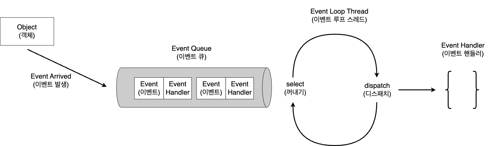

# 목차

<br>

- [목차](#목차)
- [사례를 통해 이해하는 Event Loop](#사례를-통해-이해하는-event-loop)
- [Event Loop의 의미와 역할](#event-loop의-의미와-역할)
- [NIO로 구현해보는 간단한 Event Loop 예시](#nio로-구현해보는-간단한-event-loop-예시)
  - [EventLoop](#eventloop)
  - [Handler](#handler)
- [마치며](#마치며)

<br>

# 사례를 통해 이해하는 Event Loop

이번 글은 [이전 글](../io-nio-example-server/io-nio-example-server.md)에서 다룬 Non-Blocking의 Best Practice 형식인 이벤트 기반의 Multiplexing I/O 방식을 이해한다는 가정하에 작성한다.

Multiplexing I/O를 쉽게 활용할 수 있게해주는 Java 고성능 비동기 프레임워크인 [Netty](https://netty.io/)를 사용하다보면 자연스레 Event Loop를 접하게된다.

Netty의 핵심이라고도 할 수 있는 Event Loop 방식의 동작원리는 이전 글에서 살펴본 Multiplexing I/O를 기반으로 두고있다.

그래서 이번 글은 직접 간단한 대문자 전환 서버를 Event Loop 형식으로 구현해보면서 Event Loop가 무엇인지 살펴본다.

> 이 글에서의 Event Loop는 개념에 대한 이해도를 높이기위해 학습 테스트한 것이며, 실제 Netty의 Single Thread EventLoop와는 조금 차이가 있다.
> 
> 게다가 Netty는 Multi Thread Event Loop도 지원하므로, 이번 글을 통해 EventLoop가 무엇이며 어떻게 동작하는지만 이해하기를 추천한다.

<br>

# Event Loop의 의미와 역할

위키피디아에 Event Loop를 검색하면 다음과 같이 알려준다.

```text
 event loop is a programming construct or design pattern that waits for and dispatches events or messages in a program. The event loop works by making a request to some internal or external "event provider" (that generally blocks the request until an event has arrived), then calls the relevant event handler ("dispatches the event").
```

조금 간략히 정리해보면 아래와 같다.

```text
이벤트 루프는 특정 이벤트나 메시지가 발생할 때까지 대기하다가 이벤트가 발생하면 디스패치하는 디자인 패턴 (혹은 구조체)이다.
```

이를 그림으로 그려보면 아래와 같다.

<p align="center"> </p>

그림을 보면 Event Loop가 쉽게 이해되는데, 보통 Event Loop는 Event Loop와 Handler로 구성된다.

* Event Loop
  * 무한 반복문을 실행하며 이벤트가 발생할 때까지 대기하다가 이벤트가 발생하면 해당 이벤트를 처리할 수 있는 Handler에게 디스패치한다.
* Handler
  * 이벤트를 받아 비즈니스 로직을 수행한다. (수행완료하고 결과에 맞는 이벤트를 다시 발행하기도한다.)

<br>

> 그리고 이러한 Event Loop를 Reactor Pattern이라고도 부른다.
> 
> Event Loop가 더 일반적인 개념이며, Event Loop를 활용하여 구현한 패턴중 하나가 Reactor Pattern이라고 볼 수 있다.

<br>

# NIO로 구현해보는 간단한 Event Loop 예시

이제 간단한 대문자 전환 TCP 서버를 만들어보면서 Event Loop가 어떻게 구성되며 동작하는지 살펴본다.

<br>

## EventLoop

> EventLoop.java
```java
// I/O 이벤트가 발생할 때까지 대기하다가 이벤트가 발생하면 처리할 수 있는 각 채널의 핸들러에게 dispatch 한다.
public class EventLoop implements Runnable {

    private final ServerSocketChannel serverSocket;
    private final Selector selector;

    public EventLoop(int port) throws IOException {
        this.serverSocket = ServerSocketChannel.open();
        this.serverSocket.bind(new InetSocketAddress(port));
        this.serverSocket.configureBlocking(false);

        this.selector = Selector.open();

        // ServerSocketChannel은 새로운 커넥션을 받아들이는 역할을한다. 따라서 OP_ACCEPT를 등록해준다.
        // ServerSocketChannel에 대한 이벤트는 새로운 커넥션에 대한 이벤트이기에, ServerSocketChannel엔 새로운 커넥션이 오면 처리해야하는 Handler를 등록해준다.
        SelectionKey selectionKey = this.serverSocket.register(selector, SelectionKey.OP_ACCEPT);
        selectionKey.attach(new ConnectionAcceptHandler(serverSocket, selector));
    }

    @Override
    public void run() {
        // I/O 이벤트가 발생할 때까지 대기하다가 이벤트가 발생하면 처리할 수 있는 핸들러에게 dispatch 한다.
        try {
            while (true) {
                selector.select();
                Set<SelectionKey> selected = selector.selectedKeys();
                for (SelectionKey selectionKey : selected) {
                    dispatch(selectionKey);
                }
                selected.clear();
            }
        } catch (IOException ex) {
            ex.printStackTrace();
        }
    }

    // 이벤트에 알맞는 Handler에게 dispatch.
    private void dispatch(SelectionKey selectionKey) {
        Handler handler = (Handler) selectionKey.attachment();
        handler.handle();
    }
}
```
* 무한 반복문을 실행하며 Selector에서 이벤트가 발생하기까지 대기하다가 이벤트가 발생한경우 발생한 이벤트채널을 가져와 적절한 핸들러에 dispatch한다.

> 위 예시는 각 채널마다 미리 등록하는 key의 attach object로 Handler를 매핑시켜 처리한다. (꼭 attach object로 사용할 필요는 없다.)

<br>

## Handler

> Handler.java
```java
public interface Handler {

    void handle();
}
```

* Handler 인터페이스.
  * 이 예시에서는 Handler가 Channel 1 : 1 Handler 관계를 가진다. (실제 Netty는 Handler를 pipeline으로 여러 개를 묶어서 사용할 수도 있다.)

<br>

> ConnectionAcceptHandler.java
```java
@AllArgsConstructor
public class ConnectionAcceptHandler implements Handler {

    private final ServerSocketChannel serverSocketChannel;
    private final Selector selector;

    @Override
    public void handle() {
        try {
            SocketChannel socket = serverSocketChannel.accept();

            if (socket != null) {
                ToUpperCaseHandler toUpperCaseHandler = new ToUpperCaseHandler(selector, socket);
            }
        } catch (IOException e) {
            e.printStackTrace();
        }
    }
}
```
* 새로운 연결 요청 이벤트가 발생하는 채널은 항상 `ServerSocketChannel`이다. 그리고 이를 활용해 클라이언트의 연결을 수락하고 연결된 `SocketChannel`을 가져올 수 있다.
* 위 `ConnectionAcceptHandler`는 `ServerSocketChannel`에서 새로운 연결 요청이오면 매핑되는 Handler이다.
  * 새로운 연결 요청이오면 `accept()`후 해당 Socket을 대문자 변환하는 `ToUpperCaseHandler`로 매핑한다.

<br>

> ToUppperCaseHandler.java

```java
public class ToUpperCaseHandler implements Handler {

    private final SocketChannel socketChannel;
    private final SelectionKey selectionKey;
    private final ByteBuffer byteBuffer = ByteBuffer.allocateDirect(256);

    public ToUpperCaseHandler(Selector selector, SocketChannel socketChannel) throws IOException {
        this.socketChannel = socketChannel;
        this.socketChannel.configureBlocking(false);

        this.selectionKey = this.socketChannel.register(selector, SelectionKey.OP_READ);
        this.selectionKey.attach(this);
    }

    @Override
    public void handle() {
        try {
            if (selectionKey.isReadable()) {
                handleReadEvent();
            } else if (selectionKey.isWritable()) {
                handleWriteEvent();
            }
        } catch (IOException e) {
            closeSocket(socketChannel);
            throw new UncheckedIOException(e);
        }
    }

    private void handleReadEvent() throws IOException {
        // 데이터 읽기
        int data = socketChannel.read(byteBuffer);

        if (data == -1) {
            closeSocket(socketChannel);
        }

        if (data > 0) {
            byteBuffer.flip();
            // 비즈니스 실행
            toUpperCase(byteBuffer);
            // 쓰기 모드로 전환
            selectionKey.interestOps(SelectionKey.OP_WRITE);
        }
    }

    private void handleWriteEvent() throws IOException {
        socketChannel.write(byteBuffer);

        while (!byteBuffer.hasRemaining()) {
            byteBuffer.compact();
            selectionKey.interestOps(SelectionKey.OP_READ);
        }
    }

    private static void closeSocket(SocketChannel socket) {
        try {
            socket.close();
        } catch (IOException e) {
            e.printStackTrace();
        }
    }

    private static void toUpperCase(final ByteBuffer byteBuffer) {
        // ByteBuffer내 모든 데이터를 읽어서 대문자로 변환한다.
        for (int x = 0; x < byteBuffer.limit(); x++) {
            byteBuffer.put(x, (byte) toUpperCase(byteBuffer.get(x)));
        }
    }

    private static int toUpperCase(int data) {
        return Character.isLetter(data) ? Character.toUpperCase(data) : data;
    }
}
```
* SocketChannel별로 매핑되는 Handler이며, 읽기 혹은 쓰기 이벤트가 발생했을 때 그에 맞는 처리를 수행한다.

<br>

# 마치며

Blocking I/O부터 시작해서 Non-Blocking I/O, 그리고 Multiplexing I/O에 이어서 Event Loop까지 Netty 혹은 Reactive Streams 구현체들을 이해하는데 필요한 I/O 개념을 익히기위해 정리해보았다.

다음 글은 Netty를 이용하여 실제 여러가지 구현한 사례를 정리해 볼 예정이다.
