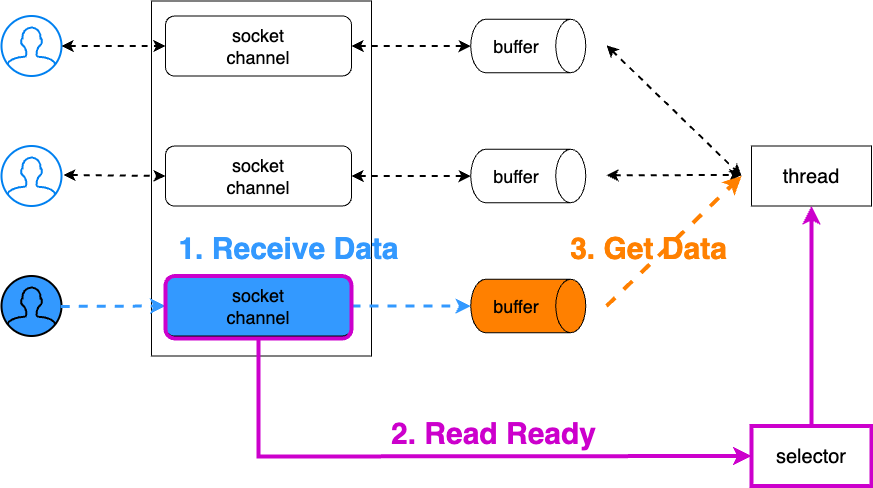

# 목차

<br>

- [목차](#목차)
- [사례를 통해 이해하는 네트워크 논블로킹 I/O와 Java NIO](#사례를-통해-이해하는-네트워크-논블로킹-io와-java-nio)
- [1 간단한 Blocking 서버](#1-간단한-blocking-서버)
- [2 Thread를 활용한 Blocking 서버](#2-thread를-활용한-blocking-서버)
- [3 Thread Pool을 활용한 Blocking 서버](#3-thread-pool을-활용한-blocking-서버)
- [4 NIO Blocking 서버 (Bad Practice)와 ByteBuffer](#4-nio-blocking-서버-bad-practice와-bytebuffer)
- [5 NIO Non-Blocking Polling 서버 (Bad Practice)](#5-nio-non-blocking-polling-서버-bad-practice)
- [6 NIO Non-Blocking Selector 서버 (Multiplexing 기반 다중 접속 서버)](#6-nio-non-blocking-selector-서버-multiplexing-기반-다중-접속-서버)
- [마치며](#마치며)
- [참고](#참고)

<br>


# 사례를 통해 이해하는 네트워크 논블로킹 I/O와 Java NIO

네트워크 소켓의 동작 방식은 크게 Blocking 모드와 Non-Blocking 모드로 나뉜다.

* Blocking은 요청한 작업이 성공하거나 에러가 발생하기 전까지는 응답을 돌려주지 않는 것을 의미한다. (JDK 1.3. 기존 Java I/O)
* Non-Blocking은 요청한 작업의 성공 여부와 상관없이 바로 결과를 돌려주는 것을 의미한다. (JDK 1.4 -> NIO)

제어권 관점에서 Blocking/Non-Blocking은 호출되는 함수의 리턴여부가 관심이다.

이렇게 글로만 작성하면 사실 이해하기가 쉽지않다. Blocking 방식이야 일반적으로 이해하기 쉬운 방식이기때문에 이해가 되지만, Non-Blocking은 어떻게 동작하는지 이해가 되지 않는다.

그 이유는 **Non-Blocking을 구현하는 방식이 다양하기 때문인데, I/O 관점에선 Multiplexing 방식이 가장 많이 사용된다.**

Multiplexing I/O를 이해하기 위해선 아래 개념들을 이해해야하는데, 사실 글로만 작성하면 이해하기 쉽지 않다.

* 동기와 비동기
* 블로킹과 논블로킹
* 이벤트 기반 프로그래밍

<br>

그래서 이번 글은 간단히 대문자 변환 서버를 직접 코드로 작성해보면서 네트워크 논블로킹 I/O와 Multiplexing I/O 그리고 Java NIO의 동작원리는 이해해본다.

아래 순서로 직접 구현하면서 Blocking I/O와 Non-Blocking I/O 그리고 Multiplexing I/O의 동작 방식을 살펴보면서 Java NIO를 정리해본다.

<br>

**(1) Blocking**

1. 간단한 Blocking 서버 - 모든 요청을 메인 스레드에서 처리한다. (싱글 스레드 모델)
2. Thread를 활용한 Blocking 서버 - 모든 요청을 서로 다른 스레드에서 처리한다. (멀티 스레드 모델)
3. Thread Pool을 활용한 Blocking 서버 - 모든 요청을 미리 생성해둔 스레드 풀내 스레드에서 처리한다. (멀티 스레드 모델)

<br>

**(2) Non-Blocking**

4. NIO Blocking 서버 - NIO를 사용하지만 싱글 스레드 모델로 처리한다.
   * Java I/O의 느린 첫번째 이유와 그 해결책인 NIO의 ByteBuffer에 대해서도 같이 알아본다.
5. NIO Non-Blocking Pool 서버 - Non-Blocking 방식으로 NIO를 사용하지만 Bad Practice인 Polling 방식으로 처리한다.
6. NIO Non-Blocking Selector 서버 - Non-Blocking Best Practice

<br>

# 1 간단한 Blocking 서버

먼저 간단히 모든 요청을 메인 스레드에서 처리하는 Blocking 서버를 구현해본다.

자바에선 JDK 1.3 부터 `ServerSocket`, `Socket`를 제공함으로써 Blocking 방식의 소켓을 지원한다.

<br>

💁‍♂️ **간단한 Blocking 서버 예시 코드**

```java
public class IoSimpleBlockingServerApplication {

    public static void main(String[] args) throws IOException {
        ServerSocket serverSocket = new ServerSocket(8080);

        while (true) {
            // blocking call (새로운 클라이언트가 접속할 때까지 blocking 된다.)
            Socket socket = serverSocket.accept();

            handleRequest(socket);
        }
    }

    private static void handleRequest(Socket socket) {
        try (InputStream in = socket.getInputStream();
             OutputStream out = socket.getOutputStream()) {
            int data;

            // read() 메서드는 데이터를 읽을 때까지 blocking 된다. 만약 소켓이 닫혀 더이상 읽을 게 없다면 -1을 리턴한다.
            while ((data = in.read()) != -1) {
                data = Character.isLetter(data) ? toUpperCase(data) : data;
                out.write(data);
            }
        } catch (IOException e) {
            throw new UncheckedIOException(e);
        }
    }

    private static int toUpperCase(int data) {
        return Character.toUpperCase(data);
    }
}
```

코드에서 알 수 있듯이, 이는 모든 요청을 메인 스레드에서 처리한다. (싱글 스레드 모델)

<br>

💁‍♂️ **클라이언트 요청**

위 서버를 실행하고 간단히 telnet으로 요청을 보내본다.

```shell
> telnet 127.0.0.1 8080
hi
HI
hello
HELLO
fdsafda
FDSAFDA
```

요청보낸 문자가 대문자로 정상적으로 변환되어 응답되어온다.

<br>

💁‍♂️ **간단한 Blocking 서버 구조와 문제점**

위 서버는 요청하면 대문자로 잘 변환하여 응답하지만, Blocking 소켓의 특성상 데이터 입출력에서 스레드의 블로킹이 발생하기 때문에 동시에 여러 클라이언트에 대한 처리가 불가능하다.

즉, `accept()`, `read()`, `write()` 등을 호출하면 해당 호출 스레드는 소켓 연결이 열리거나 데이터 입출력이 완료될 때까지 해당 스레드를 Blocking한다.

**당연히 메인 스레드가 Blocking되므로 다중 클라이언트 요청을 동시에 처리가 불가능하다.** (싱글 스레드 모델)

서버는 보통 하나의 클라이언트가 아닌 다중 클라이언트의 요청을 동시에 처리한다. 하지만 위 서버 구조는 메인 스레드만 동작하므로 동시에 하나의 클라이언트의 요청만 처리가능하다.

서버의 소켓이 사용되지않을때만 새로운 클라이언트를 받아들일 수 있으므로 서버 구조로서 굉장히 Bad Practice이다.

사실상 위 구조는 사용할 수 없는 서버 구조라고 볼 수 있다.

<br>

# 2 Thread를 활용한 Blocking 서버
> 모든 요청을 서로 다른 스레드에서 처리한다. (멀티 스레드 모델)

Blocking 소켓에서 다중 클라이언트의 접속 처리를 하지 못하는 문제점을 해결하기 위해서 등장한 모델이 연결된 클라이언트별로 각각 스레드를 할당하는 방식이다.

즉, 클라이언트 Connection 1 : 1 스레드를 할당하여 처리하는 멀티 스레드 방식을 의미한다.

<br>

💁‍♂️ **Thread를 활용한 Blocking 서버 예시 코드**

```java
public class IoThreadBlockingServerApplication {

    public static void main(String[] args) throws IOException {
        ServerSocket serverSocket = new ServerSocket(8080);

        while (true) {
            // blocking call (새로운 클라이언트가 접속할 때까지 blocking 된다.)
            Socket socket = serverSocket.accept();

            new Thread(() -> handleRequest(socket)).start();
        }
    }

    private static void handleRequest(Socket socket) {
        try (InputStream in = socket.getInputStream();
             OutputStream out = socket.getOutputStream()) {
            int data;

            // read() 메서드는 데이터를 읽을 때까지 blocking 된다. 만약 소켓이 닫혀 더이상 읽을 게 없다면 -1을 리턴한다.
            while ((data = in.read()) != -1) {
                data = Character.isLetter(data) ? toUpperCase(data) : data;
                out.write(data);
            }
        } catch (IOException e) {
            throw new UncheckedIOException(e);
        }
    }

    private static int toUpperCase(int data) {
        return Character.toUpperCase(data);
    }
}
```

동일하게 telnet이나 클라이언트 코드로 요청을 보내보면, 새로운 커넥션을 새로 생성한 Thread에 할당하기때문에 다중 커넥션을 동시에 처리가능하다.

<br>

💁‍♂️ **Thread를 활용한 Blocking 서버 구조와 문제점**

서버 구조를 그림으로 나타내면 아래와 같다.

<p align="center"> </p>

다중 커넥션을 동시에 맺어서 여러 요청을 동시에 처리할 수 있어 괜찮아보이지만 아래와 같은 문제점을 가진다.

* 커넥션 수에 따른 무한 리소스 증가.
   * 커넥션 수가 많아지면 많아질수록 요청을 처리하는 스레드가 증가하면서 서버가 충돌하거나 메모리 부족을 겪을 수 있다.
   * 스레드가 무한정으로 늘어나면서 서버가 쉽게 죽을 수도 있으며, 반대로 OS마다 프로세스에 대해 생성 가능한 스레드 수가 제한되어 더이상 요청을 받을 수 없게 될 수도 있다.
* 스레드 컨텍스트 스위칭 비용
  * 커넥션별로 스레드를 생성하기때문에 스레드가 기하급수적으로 많아질 수도 있다. 이때 스레드간의 컨텍스트 스위칭 하는 과정에서 CPU 시간과 리소스를 소모한다.
* 매번 스레드 생성 비용이 발생한다.
  * 새로운 커넥션마다 새로운 스레드를 생성하며, 이는 트래픽이 몰렸을 때 큰 장애로 이어질 가능성이 크다.

다중 연결을 처리할 수 있는 가장 기본적인 서버 구조이나, 요청이 증가하면 선형적으로 서버의 부하가 걸리는 구조라는 치명적인 문제가있다.

<br>

# 3 Thread Pool을 활용한 Blocking 서버

애플리케이션의 리소르르 제한하고 빠른 속도를 위해 스레드를 재활용하기위한 Thread Pool 방식이 탄생했다. (멀티 스레드 모델)

이는 특정 개수의 스레드를 미리 만들어두고 새로운 커넥션이 요청오면 미리 만들어준 스레드를 할당하는 방식이다. (여전히 커넥션 1 : 1 스레드지만, 스레드를 재활용한다)

Thread Pool의 사이즈를 초과하는 새로운 작업은 Thread Pool내 idle Thread가 나올 때까지 대기열에서 대기하고 자기 차례가되면 처리되는 구조이다.

웹 MVC 구조의 기초가 되는 모델이며, 아마 현존하는 높은 비율의 서버가 이 방식을 사용한다.

> 실제 필자가 경험한 많은 팀의 서버는 높은 확률로 Thread Pool 방식의 Blocking 서버다.

<br>

💁‍♂️ **Thread Pool을 활용한 Blocking 서버 예시 코드**

```java
public class IoThreadPoolBlockingServerApplication {

    public static void main(String[] args) throws IOException {
        ServerSocket serverSocket = new ServerSocket(8080);
        ExecutorService threadPool = Executors.newFixedThreadPool(3);

        while (true) {
            // blocking call (새로운 클라이언트가 접속할 때까지 blocking 된다.)
            Socket socket = serverSocket.accept();

            // 스레드 풀 개수인 3개이상 소켓 연결이 안된다.
            threadPool.submit(() -> handleRequest(socket));
        }
    }

    private static void handleRequest(Socket socket) {
        try (InputStream in = socket.getInputStream();
             OutputStream out = socket.getOutputStream()) {
            int data;

            // read() 메서드는 데이터를 읽을 때까지 blocking 된다. 만약 소켓이 닫혀 더이상 읽을 게 없다면 -1을 리턴한다.
            while ((data = in.read()) != -1) {
                data = Character.isLetter(data) ? toUpperCase(data) : data;
                out.write(data);
            }
        } catch (IOException e) {
            throw new UncheckedIOException(e);
        }
    }

    private static int toUpperCase(int data) {
        return Character.toUpperCase(data);
    }
}
```

<br>

💁‍♂️ **Thread Pool을 활용한 Blocking 서버 구조와 문제점**

서버 구조를 그림으로 나타내면 아래와 같다.

<p align="center"> </p>

이 구조는 다중 커넥션을 동시에 처리도 가능하고, 특정 시점에 특정 커넥션만 유지함으로써 리소스 (CPU, 메모리등등)의 과사용을 막을 수 있다.

하지만 여전히 아래와 같은 문제가 존재한다.

* 동시에 접속 가능한 사용자가 스레드 풀에 지정된 스레드 수에 의존하는 현상이 발생한다.
  * 리소스의 과사용은 어느정도 방지되지만 Thread Pool이 가득차면 idle Thread가 나올 때까지 새 커넥션은 대기하거나 차단된다. 이는 대용량 트래픽을 처리하기에 효율적이지 않다.
* 동시 접속 수를 늘리기 위해 Thread Pool의 크기를 자바 Heap이 허용하는 최대 한도에 도달할 때까지 늘리는 것이 합당한지 두 가지 관점에서 생각해 볼 필요가 있다.
  * GC
    * GC는 stop-the-world가 발생하므로 모든 스레드가 잠시동안 멈추게 되는데, Heap 크기가 크면 클수록 GC에 소요되는 비용이 점차 커진다. CPU 사용량의 증가로 이어져 장애로 이어지기도한다.
  * 컨텍스트 스위칭
    * 수많은 스레드가 CPU 자원을 획득하기 위해서 경쟁하면서 CPU 자원을 소모하기 때문에 실제로 작업에 사용할 CPU 자원이 적어지게된다.
    * 물론 프로세스 대비 스레드의 스위칭 비용이 적지만, 대용량 트래픽을 받는 서버에선 이 비용도 무시할 수 없다.
* 가장 큰 문제는 Blocking 방식으로 동작함에따른 컴퓨터 리소스(CPU, 메모리)를 제대로 활용하지 못한다는 것이다.
  * 커넥션 하나당 Thread 하나가 할당되어 처리되면서 Blocking 된다. 이는 만약 서버 애플리케이션이 아닌 서드 파티 (ex. DB)의 응답을 기다리거나 비즈니스가 오래걸리면서 Thread가 Blocking되어 idle함에도 다른 커넥션을 처리하지못하는 문제가있다.
  * Thread를 제대로 활용하지못하고 필요이상의 Thread를 만들고 사용함으로써, 높은 트래픽을 효율적으로 처리하지 못한다.

<p align="center"><br>멀티 스레드 모델의 이론과 현실<br>출처: https://www.reddit.com/r/ProgrammerHumor/comments/o8584o/multithreading_is_hard/</p>

위 문제를 해결하는 가장 근본적인 방법이 바로 Non-Blocking으로 소켓을 처리하는 것이다.

<br>

# 4 NIO Blocking 서버 (Bad Practice)와 ByteBuffer

앞서 살펴보았던 Blocking 방식의 멀티 스레드 모델 서버는 이해하기 쉽고 구현하기 용이하다는 장점이 있지만, 컴퓨터 리소스를 제대로 사용하지 못하는 문제가 있다.

조금 일반화해서 말하면 I/O 작업을 요청함에따라 Blocking되면서 일을 하고있지않고있지만 Thread를 점유함으로서 다른 작업 요청을 처리하지못한다.

Blocking 될 때의 해당 Thread의 기회 비용이 너무 크다는 의미이기도하다.

이 문제를 해결하는 방법은 I/O 작업을 Non-Blocking하게 변경함으로써 적은 수의 Thread로 여러 개의 커넥션을 처리하도록하는 것이다.

자바도 I/O에 대한 Non-Blocking 기반의 Multiplexing 처리를 위해 New I/O (NIO)를 도입한 것이며, NIO는 현재까지도 여러 라이브러리와 프레임워크에서 사용되고있다.

> 대표적으로 Netty와 Kafka.

이제부터는 NIO가 어떻게 Non-Blocking을 지원하게 되었는지 단계별로 살펴본다.

우선 NIO가 느린 이유중 하나인 메모리 부분을 살펴보고 Non-Blocking의 Bad-Practice를 살펴본다. 그리고 제대로된 이벤트 기반의 Non-Blocking을 살펴본다.

<br>

💁‍♂️ **NIO 이전의 기존 Java I/O가 느린 이유**

기존의 Java I/O는 느리다는 얘기를 많이 했었다.

앞서 말했듯이 Blocking 방식으로 처리되는 문제도 있었지만, 또 다른 큰 이유는 Java 애플리케이션이 커널 버퍼 (Direct Buffer)를 직접 핸들링 할 수 없었기 때문이다.

소켓이나 파일에서 Stream이 들어오면 OS의 커널은 데이터를 커널 버퍼에 쓰게되는데, Java 코드상에서 이 커널 버퍼에 접근할 수 있는 방법이 없었다.

따라서 처음엔 JVM 내부 메모리에 커널 버퍼 데이터를 복사해서 접근할 수 있도록했다. 즉, **"커널에서 JVM 내부 메모리에 복사"하는 오버헤드가 존재했다.**

> 여기서 말하는 JVM 내부 메모리는 프로세스별로 할당되는 스택이나 힙 메모리를 의미한다.

<br>

조금 더 구체적으로 살펴보면 아래와 같다.

* JVM (프로세스)이 file이나 socket으로부터 데이터를 읽기 위해 kernal에 명령을 전달한다.
* kernel은 시스템 콜 (`read()`)를 사용함으로써 디스크 컨트롤러가 물리적 디스크나 소켓으로부터 데이터를 읽어온다
* OS는 DMA를 이용하여 kernel 버퍼에 해당 데이터를 복사한다.
* 그리고 JVM (프로세스) 내부 버퍼로 복사하고, JVM은 그제서야 해당 데이터를 사용한다.

위 과정은 단순해보이지만 아래와 같은 문제를 야기한다.

* kernel 버퍼에서 JVM 내부 버퍼로 복사할 때 CPU 소비.
* 복사한 JVM 버퍼내 데이터 사용후 GC가 수거해야함으로써 CPU 소비.
* 복사가 진행되는 동안 I/O 요청한 JVM Thread는 Blocking된 상태.

데이터를 JVM 내부 버퍼로 복사함으로써 컴퓨터 리소스를 제대로 활용하지 못할 뿐만 아니라 필요이상으로 과사용하게 되는 문제가 있다는 의미다.

<br>

💁‍♂️ **Java I/O의 느린점을 해결하는 가장 첫번째는 JVM 내부 버퍼에 데이터를 복사하지않고 kernel 버퍼에 바로 접근하는 것이다.**

Java I/O의 문제점인 JVM 내부 버퍼에 데이터를 복사하는 문제를 해결하기 위해선 JVM이 직접 kernel 버퍼에 접근해야한다.

그 이유는 디스크 혹은 소켓에서 kernel 버퍼에 데이터를 가져오는 과정은 CPU가 관여하지않고 보통 DMA가 해주기때문이다.

이렇게하면 JVM 내부 버퍼로 데이터를 복사함으로써 발생하는 복사 및 GC의 CPU 낭비를 없앨 수 있으며, I/O로 인한 Thread를 Blocking하지않아도 되기때문에 Thread의 낭비도 줄일 수 있게된다.

<br>

💁‍♂️ **ByteBuffer를 사용하는 NIO**

JDK 1.4부터 JVM 내부 버퍼에 복사하는 문제를 해결하기위해 kernel 버퍼에 직접 접근할 수 있는 기능을 제공하기 시작했다.

바로 `ByteBuffer` 클래스다. 

ByteBuffer는 직접 kernel 버퍼를 참조하고 있으므로, 위에서 발생한 복사문제로인해 CPU 자원의 비효율성과 I/O 요청 Thread가 Blocking 되는 문제점을 해결할 수 있다.

<br>

ByteBuffer는 말 그대로 내부에 `byte[]` 배열로 구성되면서 버퍼형태의 네 가지 포인터를 가진 클래스다.

<p align="center"> </p>

* position
  * 읽기 또는 쓰기가 작업 중인 위치를 나타낸다. 
  * 버퍼 생성시 0으로 초기화되며, 데이터를 입력 (put)하거나 읽으면 (get) 자동으로 증가한다. 
  * limit와 capacity보다 작거나 같다.
* limit
  * 읽고 쓸 수 있는 버퍼 공간의 최대치를 나타낸다.
  * 이 값은 capacity보다 크게 설정할 수 없다.
* capacity
  * 버퍼에 저장할 수 있는 데이터의 최대 크기로 한 번 정하면 변경이 불가하다. 이 값은 버퍼를 생성할 때 생성자의 인수로 입력한다.
* mark
  * 사용자가 편의상 마음대로 지정할 수 있는 포인터이다.
  * 특별히 특정 위치를 기억하고 있다가 다음에 되돌아가야할 때 사용된다.

주의해야할 점은 ByteBuffer는 버퍼 하나만을 가지고있으므로 읽기/쓰기의 position은 공유된다. 

**즉, 읽고 쓰기를 할 때 자칫 데이터가 꼬이는 경우가 있을 수 있어서 읽기든 쓰기든 해당 작업을 꼭 다 마무리하고 다음 작업으로 넘어가야한다.**

<br>

사용 방법은 간단한 테스트 코드와 설명으로 대신한다.

<details>
  <summary>ByteBuffer 테스트</summary>
  
  ---
  
  ```java
    @Test
    void read_and_write() {
        ByteBuffer byteBuffer = ByteBuffer.allocateDirect(11);
        assertThat(byteBuffer.position()).isEqualTo(0);
        assertThat(byteBuffer.limit()).isEqualTo(11);

        byteBuffer.put((byte) 1);
        byteBuffer.put((byte) 2);
        byteBuffer.put((byte) 3);
        byteBuffer.put((byte) 4);
        assertThat(byteBuffer.position()).isEqualTo(4);
        assertThat(byteBuffer.limit()).isEqualTo(11);

        // The limit is set to the current position and then the position is set to zero. If the mark is defined then it is discarded
        byteBuffer.flip();
        assertThat(byteBuffer.position()).isEqualTo(0);
        assertThat(byteBuffer.limit()).isEqualTo(4);

        // get(index)는 position을 올리지 않는다.
        byteBuffer.get(3);
        assertThat(byteBuffer.position()).isEqualTo(0);

        // get()은 position의 값을 반환하고 position을 1만큼 올린다.
        byteBuffer.get();
        assertThat(byteBuffer.position()).isEqualTo(1);
    }
  ```

  * ByteBuffer 생성
    * allocate - 힙 버퍼. JVM내 힙영역에 버퍼를 할당한다.
    * allocateDirect - kernel 버퍼. JVM의 힙영역이 아닌 운영체제의 커널 영역에 버퍼를 할당한다. (생성 속도가 Heap 버퍼보다 비교적 느리다.)
    * wrap - 입력된 바이트 배열을 사용하여 버퍼를 생성한다. 내부적으로 힙버퍼를 사용한다.
  * 읽기 모드
    * flip - 작업후(읽기 혹은 쓰기) 데이터의 처음부터 읽을 수 있도록 limit을 현재 position 값으로 변경하고 position은 0으로 초기화.
    * clear - 말그대로 버퍼를 초기화한다. position은 0으로 세팅하고, limit을 capacity값과 동일하게 초기화.
    * rewind - position을 0으로 세팅한다. clear 메소드와 다른점은 limit값은 초기화 하지 않는다.
  
  ---
</details>

<br>

💁‍♂️ **NIO Blocking 서버 예시 코드**

이제 ByteBuffer를 활용하여 간단한 대문자 변환 서버 코드를 작성해본다.

```java
public class NioBlockingServerApplication {

    public static void main(String[] args) throws IOException {
        // 서버 생성 (NIO Channel)
        ServerSocketChannel serverSocket = ServerSocketChannel.open();

        // 서버를 8080 포트에 바인딩.
        serverSocket.bind(new InetSocketAddress(8080));

        while (true) {
            // NIO의 accept() 메서드도 blocking 된다.
            SocketChannel socket = serverSocket.accept();

            handleRequest(socket);
        }
    }

    private static void handleRequest(SocketChannel socket) {
        ByteBuffer byteBuffer = ByteBuffer.allocateDirect(80);

        try {
            while (socket.read(byteBuffer) != -1) {
                // 소켓으로부터 읽은 데이터를 쓰기위해 flip()
                byteBuffer.flip(); // position을 0으로 세팅한다. limit은 읽은 데이터 크기만큼.

                // 작업을 수행한다. (대문자 변환)
                toUpperCase(byteBuffer);

                // 소켓에 데이터를 쓴다.
                while (byteBuffer.hasRemaining()) {
                    socket.write(byteBuffer);
                }

                // 버퍼의 position을 다시 0으로 세팅한다.
                byteBuffer.compact();
            }
        } catch (IOException e) {
            throw new UncheckedIOException(e);
        }
    }

    private static void toUpperCase(final ByteBuffer byteBuffer) {
        // ByteBuffer내 모든 데이터를 읽어서 대문자로 변환한다.
        for (int x = 0; x < byteBuffer.limit(); x++) {
            byteBuffer.put(x, (byte) toUpperCase(byteBuffer.get(x)));
        }
    }

    private static int toUpperCase(int data) {
        return Character.isLetter(data) ? Character.toUpperCase(data) : data;
    }
}
```

<br>

💁‍♂️ **NIO Blocking 서버 구조와 문제점**

이 글의 가장 처음 구현했던 Blocking 서버와 동일하게 싱글 커넥션만 받는 구조이다. 모든 일이 메인 스레드에서만 발생한다.

다른 점이라면 ByteBuffer를 사용했다는 것과 NIO의 ServerSocketChannel를 사용해 연결을 받는다는 것이다.

당연히 동일한 문제점이 그대로있으며, 사용하면 안되는 구조이다. 

물론 앞서 살펴보았듯이 Thread Pool을 활용하면 조금 괜찮아지겠지만, NIO는 Non-Blocking 기반의 Multiplexing I/O를 목적으로 만들어진 것이기때문에 위 방식은 Bad Practice라고 볼 수 있다.

그저 ByteBuffer에 대한 개념과 위 방식이 Bad Practice라는 것만 알고가자.

<br>

# 5 NIO Non-Blocking Polling 서버 (Bad Practice)

이미 눈치챘겠지만, Blocking 모드였던 `ServerSocket`, `Socket`과 다르게 Non-Blocking 모드부턴 NIO의 `ServerSocketChannel`, `SocketChannel`를 사용한다.

이 두 클래스를 사용하면 Non-Blocking을 쉽게 구현할 수 있다. 바로 아래와 같이 NIO SocketChannel에 `configureBlocking`을 false로하면된다.

```java
socket.configureBlocking(false);
```

기존에 Blocking 방식은 언제 클라이언트가 연결 요청을 할지 모르기 때문에 `accept()`에서 Blocking 되었다. 

심지어 `read()` 또한 언제 데이터를 전달받을지 몰라 Blocking 되었다.

이제 NIO SocketChannel에선 위와 같이 `configureBlocking(false)`로 설정만해줘도 `coonect()`, `accept()`, `read()`, `write()` 모두에서 Blocking이 없이 바로 return된다. 

즉, Non-Blocking으로 동작한다는 의미이다.

> `accept()`를 호출하면 연결된 socket이 없어도 null로 바로 return된다.

**이렇게 쉽게 설정하여 사용하면 좋겠지만, Non-Blocking은 사실 사용하는 패러다임 자체를 변경해줘야한다.**

바로 Polling 방식이 아닌 이벤트 기반의 Push 방식으로 해주어야하는데, 우선 이해를 돕기위해 Bad Practice인 Non-Blocking이지만 Polling 방식으로 구현하는 서버를 구현해본다.

<br>

💁‍♂️ **NIO Non-Blocking Polling 서버 예시 코드**

아래는 모든 I/O 메서드가 Non-Blocking이니 무한루프를 돌게하면서 Polling하는 예시이다.

> 다시 한번 말하지만 아래 코드는 Bad Practice이다.

```java
public class NioNonBlockingServerApplication {

    public static void main(String[] args) throws IOException {
        // 서버 생성
        ServerSocketChannel serverSocket = ServerSocketChannel.open();
        serverSocket.bind(new InetSocketAddress(8080));

        // Non-Blocking 모드로 전환한다.
        serverSocket.configureBlocking(false);

        // SocketChannel별로 하나의 ByteBuffer를 사용한다.
        Map<SocketChannel, ByteBuffer> sockets = new ConcurrentHashMap<>();

        while (true) {
            // 여기서 accept()는 들어오는 연결 요청을 수락한다는 의미이다.
            // Non-Blocking 모드이기에 accept() 메서드는 blocking 되지 않고, null을 리턴한다.
            SocketChannel socket = serverSocket.accept();

            // 새로운 소켓이 연결된 경우
            if (socket != null) {
                // 연결된 Socket을 Non-Blocking하게 처리하겠다는 의미.
                socket.configureBlocking(false);

                // 매 Socket마다 하나의 ByteBuffer를 할당한다.
                sockets.put(socket, ByteBuffer.allocateDirect(80));
            }

            // 연결된 SocketChannel을 순회하면서, 연결이 끊긴 SocketChannel은 제거한다.
            sockets.keySet().removeIf(it -> !it.isOpen());

            // 연결된 SocketChannel을 순회하면서, 데이터를 읽고 작업을 수행한 다음 소켓에 다시 쓰기 작업을 수행한다. (Bad-Practice)
            sockets.forEach((socketCh, byteBuffer) -> {
                try {
                    // Non-Blocking 모드이기에 Blocking 모드와 다르게 read() 메서드 호출시 blocking 되지 않는다.
                    int data = socketCh.read(byteBuffer);

                    if (data == -1) { // 연결이 끊긴 경우
                        closeSocket(socketCh);
                    } else if (data != 0) { // 데이터가 들어온 경우
                        byteBuffer.flip(); // position=0으로해서 Read 모드로 전환한다.

                        // 작업을 수행한다. (대문자 변환)
                        toUpperCase(byteBuffer);

                        while (byteBuffer.hasRemaining()) {
                            socketCh.write(byteBuffer);
                        }

                        byteBuffer.compact();
                    }
                } catch (IOException e) {
                    closeSocket(socketCh);
                    throw new UncheckedIOException(e);
                }
            });
        }
    }

    private static void closeSocket(SocketChannel socket) {
        try {
            socket.close();
        } catch (IOException e) {
            e.printStackTrace();
        }
    }

    private static void toUpperCase(final ByteBuffer byteBuffer) {
        // ByteBuffer내 모든 데이터를 읽어서 대문자로 변환한다.
        for (int x = 0; x < byteBuffer.limit(); x++) {
            byteBuffer.put(x, (byte) toUpperCase(byteBuffer.get(x)));
        }
    }

    private static int toUpperCase(int data) {
        return Character.isLetter(data) ? Character.toUpperCase(data) : data;
    }
}
```

코드가 조금 길어보이지만, 간단하다. non-blocking하게 동작시키는데, 특정 이벤트(?)가 발생하면 작업을 실행하는게 아닌, 메인 Thread가 모든 소켓 채널을 반복하며 polling해서 작업을 진행하는 구조이다.

<br>

💁‍♂️ **NIO Non-Blocking Polling 서버 구조와 문제점**

위 서버 예시 코드는 I/O 관점에서보면 아래와 같이 동작한다.

<p align="center"><br>출처: https://stackoverflow.com/questions/17615272/java-selector-is-asynchronous-or-non-blocking-architecture </p>

실제로 위 구조를 non-blocking이라고 볼 수도 있긴한데.. 특정 Thread가 polling 방식으로 모든 소켓을 반복하며 작업할게 있는지 체크하고 있으면 작업을 수행하는 방식이다.

조금 더 구체적으로 살펴보자면 아래와 같다.

* 특정 스레드가 서버에 연결된 모든 소켓을 순회하며 읽어들일 내용이 있는지 확인한다.
* 특정 소켓에 읽어들일 내용이있다면 로직을 수행후 소켓에 쓰기 작업을 수행한다.

즉, **특정 소켓에서 어떤 일이 발생했는지 계속 확인해야하기때문에 지속된 kernel에 I/O 시스템 콜 (`read()`)을 계속 호출하면서 필요이상의 CPU의 리소스가 소요된다.**

구현에 따라 확인하는 과정이 Blocking 되어 처리가 계속 지연되어 더 큰 문제가 발생할 수도 있게된다.

당연히 소켓 수가 늘어나면 성능이 선형적으로 나빠지게된다.

지금까지의 예시에서 존재하던 컴퓨터 리소스 (CPU, 메모리)를 제대로 활용하지 못하는 문제는 여전히 해결되지 않은 것이다.

결론적으로 위 문제를 해결하기위해선 이벤트 기반의 Non-Blocking 방식을 사용해야한다. 

<br>

# 6 NIO Non-Blocking Selector 서버 (Multiplexing 기반 다중 접속 서버)
가장 마지막은 이 글의 핵심이기도한 부분이며 **Non-Blocking의 Best Practice 형식인 이벤트 기반의 Multiplexing I/O 방식이다.**

앞서 Non-Blocking으로 동작하기는 했지만, 특정 Thread가 순회하며 모든 소켓에 시스템 콜 (`read()`)을 호출하면서 변경된 내용이 있는지 확인하는 방식을 Polling 방식이라고 부른다.

그렇다면 어떻게해야 효율적으로 리소스를 사용할까?? **바로 Polling이 아닌 이벤트 기반의 Push 방식을 이용하는 것이다.**

<br>

💁‍♂️ **이벤트 기반 프로그래밍**

전통적으로 사용자 인터페이스가 포함된 프로그램에선 이벤트 기반 프로그래밍이 많이 사용된다.

예를 들어 마우스를 클릭에 반응하는 코드가 이에 해당한다. 이와 같이 각 이벤트를 먼저 정의해두고 발생한 이벤트에 따라서 코드가 실행되도록 프로그램을 작성하는 것이다.

**앞서 살펴본 Non-Blocking 방식도 직접 socket들을 순회하며 읽을 데이터가 있는지 체크하는 것이 아닌, 특정 socket이 변경되면 변경되었다고 이벤트를 만들어 알림을 주도록하면 컴퓨팅 자원을 효율적으로 사용할 수 있다.**

> 이러한 역할을 하는 녀석이 바로 `Selector`다.

그리고 이벤트가 발생했을때만 Thread에서 관련 동작을하면 CPU의 리소스를 효율적으로 사용할 수 있게된다.

I/O 그림으로보면 아래와 같다.

<p align="center"><br>출처: https://stackoverflow.com/questions/17615272/java-selector-is-asynchronous-or-non-blocking-architecture </p>

이렇게 socket에서 변경이 감지되면 이벤트로 전송하고 처리할 수 있도록하는 역할로 Java NIO에선 `Selector`라는 클래스를 제공한다.

`Selector`가 있기때문에 하나의 스레드로 여러 채널을 모니터링하고 작업을 수행할 수 있는 것이다.

<br>

💁‍♂️ **Selector, Channel**

Selector는 시스템 이벤트 통지 API를 사용하여 하나의 스레드로 동시에 많은 IO를 담당할 수 있다.

<p align="center"> </p>

위 그림을 통해 알 수 있듯이, **Selector는 이벤트 리스너 역할을하며, Non-blocking Channel에 Selector를 등록해놓으면 클라이언트의 커넥션 요청이 오거나 데이터 읽기/쓰기 작업이 필요한경우 Channel이 Selector에 이벤트를 통보한다.**

**그럼 Selector는 미리 등록해둔 Key의 상태를 변경하여 특정 Channel에 대한 작업을 수행하도록 미리 등록된 콜백 메서드를 실행하면서 Thread에 비즈니스 로직 처리를 위임한다.**

각각의 역할의 관점에서 살펴보면 아래와 같다.

* Selector (멀티플렉서)
  * 자신에게 등록된 채널에 변경 사항이 발생했는지 검사하고, 변경 사항이 발생한 채널에 대한 접근을 가능하게 해준다.
  * Linux I/O에 나오는 Multiplexing/IO Select와 같으며, 시스템 이벤트 리스너로서 준비된 I/O 채널을 선택(선별)하여 Thread에 작업을 위임하는 역할을 수행한다.
  * 내부적으로 `SelectorProvider`에서 운영체제와 버전에 따라 사용 가능한 멀티플렉싱 기술을 선택해 사용한다. (select, poll, epoll 등등)
* SocketChannel, ByteBuffer
  * 소켓의 open부터 connect 그리고 데이터 읽고 쓰기까지 모두 채널과 ByteBuffer를 통해 이뤄진다.
  * 기존의 Stream 기반으로 단방향만 지원하였지만, SocketChannel은 양방향 채널이 지원한다. 또한, blocking과 non-blocking 모두 지원한다.
* Thread
  * 구현에 따라 다양한 Thread가 존재할 수 있다.
  * 전반적인 NIO의 처리를 관장하는 Thread, 비즈니스 처리 Thread 등등

<br>

💁‍♂️ **Multiplexing I/O 기반 동작 과정 - 읽기, 쓰기**

NIO에서의 중요한 개념인 Selector, Channel, ByteBuffer가 무엇이며 어떤 역할인지 이해했다면, 이번엔 이 개념들이 서로 어떻게 상호작용하며 동작하는지 이해해야한다.

사용자 커넥션 요청이오면 새로운 SocketChannel이 열리고 (`open()`) Selector는 `ON_ACCEPT` 이벤트 키를 Thread에 전달한다.

해당 이벤트를 처리하는 Thread를 받아 해당 소켓 연결 (`connect()`)에 대한 요청을 `accept()`하고 채널에 ByteBuffer를 생성하여 할당한다.

그리고 소켓으로부터 데이터를 읽는 과정은 아래와 같다.

<p align="center"><br> 읽기 과정 </p>

비즈니스를 처리하는 Thread에 데이터를 전부 다 읽으면 특정 비즈니스를 처리하고나서, Selector에 `ON_WRITE` 이벤트를 던진다.

> 모두 읽고 비즈니스 처리를하여 결과를 ByteBuffer에 넣어뒀으니 소켓에 쓰기 작업을 하라고 이벤트를 보내는 것과 동일하다.

`Selector`는 해당 이벤트를 다시 Thread에게 알림하게되고 아래와 같은 쓰기 과정이 진행된다.

<p align="center"><br> 쓰기 과정 </p>

<br>

💁‍♂️ **전반적인 Multiplexing을 구성하는 코드**

이제 코드로 직접 구현해본다.

<br>

**1 - 서버 소켓 채널 생성 및 설정**

```java
ServerSocketChannel serverSocket = ServerSocketChannel.open();
serverSocket.bind(new InetSocketAddress(8080));
serverSocket.configureBlocking(false);
```

`configureBlocking`설정을 통해 쉽게 서버 소켓을 Non-Blocking하게 동작하도록 할 수 있다.

이후 서버 소켓에 연결된 Selector에 등록할 채널을 Non-Blocking하게 동작시키기위해선 위 설정이 필요하다.

**한 가지 기억해야할 점은 연결 요청 이벤트가 발생한 채널은 항상 ServerSocketChannel이라는 것이다. 그리고 이를 활용해 클라이언트의 연결을 수락하고 연결된 SocketChannel을 가져올 수 있다.**

즉, **`ServerSocketChannel`을 selector에 등록함으로써, 새로운 연결에 대한 이벤트를 받을 수 있는 것이다.**

<br>

**2 - 셀렉터 생성**

```java
Selector selector = Selector.open();
```

<br>

**3 - 채널 등록**

```java
SelectionKey register = serverSocket.register(selector, SelectionKey.OP_ACCEPT);
```

서버 소켓이 요청 받는 I/O 채널 (SocketChannel)에서 발생하는 이벤트를 리스너해줄 Selector와 해당 채널에서 발생하는 이벤트 중 해당 Selector를 통해 확인하고자하는 이벤트를 종류를 전달한다.

이벤트는 네 가지 종류가 있으며 `SelectionKey` 상수로 표현한다.

* SelectionKey.OP_CONNECT
* SelectionKey.OP_ACCEPT
* SelectionKey.OP_READ
* SelectionKey.OP_WRITE

그리고 `register`의 메서드 반환값으로 `SelectionKey` 객체가 반환되는데 해당 객체는 다음과 같은 속성을 가지고있다.

* Interest set
  * Selector에 등록된 채널이 확인하고자 하는 이벤트들을 의미한다. (관심있는 이벤트)
* Ready set
  * Selector에 등록된 채널에서 바로 처리할 수 있도록 준비된 이벤트들을 의미한다.
  * `int readySet = SelectionKey.readyOps()`로 몇 개의 이벤트가 준비되었는지 확인할 수 있다.
  * 보통은 `isReadble()`, `isWriteable`등으로 사용한다.
* Channel, Selector
  * SelectionKey를 이용해 채널과 Selector에 접근할 수 있다.
* Attached Object
  * SelectedKey에 객체를 첨부할 수 있다. 이를 통해 채널에 추가 정보나 채널에서 사용하는 버퍼 객체를 첨부할 수 있다.

<br>

**4 - 처리할 채널 선택 및 처리**

```java
// Selector에 등록된 채널들의 이벤트를 감지한다. (이벤트가 발생하기전까지 blocking 된다.)
selector.select(); // blocking

// Selector 준비된 채널들의 이벤트를 반환한다.
Set<SelectionKey> selectionKeys = selector.selectedKeys();
```

Selector에 하나 이상의 채널을 등록하고, `select()` 메서드를 호출하면 등록된 채널에서 변경 사항이 발생했는지 검사한다. 아무런 I/O 이벤트도 발생하지 않으면 스레드는 이 부분에서 Blocking된다.

처리할 준비가 된 채널이 존재한다면 Blocking이 풀리고, `selectedKeys()` 메서드르르 통해 해당 채널의 집합을 반환받을 수 있다.

> 만약 I/O 이벤트가 발생하지 않았을 때 Blocking을 피하고싶다면 `selectNow()` 메서드를 사용하면 된다.

그리고 해당 채널을 순회하며 처리해야할 부분을 아래와 같이 처리하면 된다.

```java
Set<SelectionKey> selectionKeys = selector.selectedKeys();

for (Iterator<SelectionKey> it = selectionKeys.iterator(); it.hasNext(); ) {
    SelectionKey key = it.next();

    try {
        if (key.isValid()) {
            if (key.isAcceptable()) {
                handleAcceptEvent(key); // 연결이 들어온 경우
            } else if (key.isReadable()) {
                handleReadEvent(key); // 읽기 이벤트가 발생한 경우
            } else if (key.isWritable()) {
                handleWriteEvent(key); // 쓰기 이벤트가 발생한 경우
            }
        }
    } catch (ClosedChannelException e) {
        closeSocket((SocketChannel) key.channel());
    } catch (IOException e) {
        throw new UncheckedIOException(e);
    }

    // 동일한 key가 두번 이상 처리되지않도록, 한번 처리한 key는 Iterator에서 제거한다.
    it.remove();
}
```

전반적인 서버 예시 코드는 아래를 참고하면 된다.

<br>

💁‍♂️ **Multiplexing 기반 서버 예시 코드 - Best Practice**

NIO의 Non-Blocking Multiplexing I/O를 제대로 구성한 대문자 변환 서버 코드를 살펴보면 아래와 같다.

```java
public class NioNonBlockingSelectorServerApplication {

    private static final Map<SocketChannel, ByteBuffer> sockets = new ConcurrentHashMap<>();

    public static void main(String[] args) throws IOException {
        // 서버 생성
        ServerSocketChannel serverSocket = ServerSocketChannel.open();

        // 서버를 8080 포트에 바인딩.
        serverSocket.bind(new InetSocketAddress(8080));

        // Non-Blocking 모드로 전환.
        serverSocket.configureBlocking(false);

        // 채널 관리자 (Selector) 생성
        try (Selector selector = Selector.open()) {

            // 채널 관리자 (Selector)에 채널 (ServerSocketChannel) 등록.
            // Accept connection에만 관심이 있으므로 OP_ACCEPT를 등록한다.
            serverSocket.register(selector, SelectionKey.OP_ACCEPT);

            while (true) {
                // 채널 관리자 (Selector)에 등록된 채널들의 이벤트를 감지한다. (이벤트가 발생하기전까지 blocking 된다.)
                selector.select();

                // 채널 관리자 (Selector)에 등록된 채널들의 이벤트를 순회한다.
                Set<SelectionKey> selectionKeys = selector.selectedKeys();

                for (Iterator<SelectionKey> it = selectionKeys.iterator(); it.hasNext(); ) {
                    SelectionKey key = it.next();

                    try {
                        if (key.isValid()) {
                            if (key.isAcceptable()) {
                                handleAcceptEvent(key); // 연결이 들어온 경우
                            } else if (key.isReadable()) {
                                handleReadEvent(key); // 읽기 이벤트가 발생한 경우
                            } else if (key.isWritable()) {
                                handleWriteEvent(key); // 쓰기 이벤트가 발생한 경우
                            }
                        }
                    } catch (ClosedChannelException e) {
                        closeSocket((SocketChannel) key.channel());
                    } catch (IOException e) {
                        throw new UncheckedIOException(e);
                    }

                    // 동일한 key가 두번 이상 처리되지않도록, 한번 처리한 key는 Iterator에서 제거한다.
                    it.remove();
                }
            }

        } catch (Exception e) {
            e.printStackTrace();
        }
    }

    private static void handleAcceptEvent(SelectionKey key) throws IOException {
        ServerSocketChannel socketChannel = (ServerSocketChannel) key.channel();
        SocketChannel socket = socketChannel.accept();

        socket.configureBlocking(false);

        socket.register(key.selector(), SelectionKey.OP_READ);

        // 매 Socket마다 하나의 ByteBuffer를 할당한다.
        sockets.put(socket, ByteBuffer.allocateDirect(80));
    }

    private static void handleReadEvent(SelectionKey key) throws IOException {
        SocketChannel socket = (SocketChannel) key.channel();
        ByteBuffer byteBuffer = sockets.get(socket);

        int data = socket.read(byteBuffer);

        if (data == -1) {
            closeSocket(socket);
            sockets.remove(socket);
        }

        // position = 0으로 함으로써 읽기 모드로 전환한다.
        byteBuffer.flip();

        // 작업을 수행한다. (대문자 변환)
        toUpperCase(byteBuffer);

        socket.configureBlocking(false);

        key.interestOps(SelectionKey.OP_WRITE);
    }

    private static void handleWriteEvent(SelectionKey key) throws IOException {
        SocketChannel socket = (SocketChannel) key.channel();
        ByteBuffer byteBuffer = sockets.get(socket);

        socket.write(byteBuffer);

        // 전부 다 write한 경우
        while (!byteBuffer.hasRemaining()) {
            byteBuffer.compact();
            key.interestOps(SelectionKey.OP_READ);
        }
    }

    private static void closeSocket(SocketChannel socket) {
        try {
            socket.close();
        } catch (IOException e) {
            e.printStackTrace();
        }
    }

    private static void toUpperCase(final ByteBuffer byteBuffer) {
        // ByteBuffer내 모든 데이터를 읽어서 대문자로 변환한다.
        for (int x = 0; x < byteBuffer.limit(); x++) {
            byteBuffer.put(x, (byte) toUpperCase(byteBuffer.get(x)));
        }
    }

    private static int toUpperCase(int data) {
        return Character.isLetter(data) ? Character.toUpperCase(data) : data;
    }
}
```

<br>

# 마치며

이번 글은 간단한 대문자 변환 서버를 직접 구현하면서 Blocking 방식의 소켓부터 Non-Blocking 방식의 소켓을 살펴보았다.

이를 통해 Non-Blocking I/O의 가장 많이 사용되는 Multiplexing I/O를 살펴보았으며 자바의 구현체인 NIO에 대해서 알아보았따.

직접 구현하면서 이해하는것에 초점을 맞춰 작성했기때문에 꼭 코드를 직접 작성하면서 이해하기를 추천한다.

다음 글은 Multiplexing 방식으로 요청을 받은 후 이벤트를 처리하는 코드를 어떻게하면 더 효율적으로 처리할지에 대한 Reactor 패턴과 이벤트 루프에 대해서 정리해볼 예정이다.

<br>

# 참고
* http://eincs.com/2009/08/java-nio-bytebuffer-channel-file/
* https://engineering.linecorp.com/ko/blog/do-not-block-the-event-loop-part2
* https://www.slideshare.net/kslisenko/networking-in-java-with-nio-and-netty-76583794
