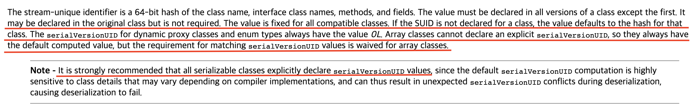

# 목차

<br>

- [목차](#목차)
- [자바 직렬화 이해하기 - 사용시 주의할 점과 사용을 추천하지 않는 이유](#자바-직렬화-이해하기---사용시-주의할-점과-사용을-추천하지-않는-이유)
- [1 자바 직렬화와 역직렬화](#1-자바-직렬화와-역직렬화)
- [2 자바 직렬화와 역직렬화 주의사항](#2-자바-직렬화와-역직렬화-주의사항)
  - [2-1 상속과 조합](#2-1-상속과-조합)
  - [2-2 역직렬화시 멤버 변수 타입이 변경되거나 패키지 위치가 변경되면 예외가 발생한다.](#2-2-역직렬화시-멤버-변수-타입이-변경되거나-패키지-위치가-변경되면-예외가-발생한다)
  - [2-3 역직렬화시 클래스 구조 변경 문제 (Serial Version UID)](#2-3-역직렬화시-클래스-구조-변경-문제-serial-version-uid)
- [3 왜 사용하지 말라는 것인가?](#3-왜-사용하지-말라는-것인가)
- [참고](#참고)

<br>

# 자바 직렬화 이해하기 - 사용시 주의할 점과 사용을 추천하지 않는 이유

직렬화는 자바 시스템에서 사용되는 객체 또는 데이터를 외부의 자바 시스템에서도 사용할 수 있도록 바이트 스트림 형태로 변환하는 것이다.

역직렬화는 반대로 직렬화를 통해 변환된 바이트 스트림 데이터를 다시 객체로 변환하는 것이다.

이러한 직렬화와 역직렬화 기술은 메모리에 위치한 데이터를 디스크에 저장시키거나, 네트워크 통신에 사용하기위한 목적으로 사용된다.

현재 웹상에서 주력으로 사용되는 JSON도 여러 장비들이 네트워크 통신을 위해 만들어진 직렬화 포맷중의 한 종류라고 볼 수 있다.

이번 글은 자바에서 기본적으로 제공하는 JDK 직렬화 방식에 대해서 알아본다.

그리고 자바 직렬화 사용시 주의해야할 점과 왜 사용을 추천하지 않는지 정리해본다.

<br>

# 1 자바 직렬화와 역직렬화

직렬화/역직렬화 프로세스는 독립적으로 실행되어야한다.

즉, A 자바 시스템에서 직렬화한 내용은 다른 B 자바 시스템에서 역직렬화할 수 있어야한다. 

자바 직렬화는 이를 지원하며, 대신 직렬화/역직렬화 대상 클래스 `Serializable` 인터페이스를 구현해야한다.

<br>

💁‍♂️ **직렬화 - 객체 to 바이트 스트림 데이터** (ObjectOutputStream)

```java
public final void writeObject(Object o) throws IOException;
```
자바 객체를 바이트 스트림 데이터로 직렬화할 때 `ObjectOutputStream.writeObject`을 사용한다.

리턴 값이 왜 없어? 할 수 있는데, `ObjectOutputStream`은 `java.io.OuputStream`을 상속받으므로, 해당 객체 생성시 OutputStream을 주입받는다.

그리고 `writeObject`를 실행하면 주입받은 `OutputStream`에 직렬화된 바이트 스트림 데이터를 write한다. (전송한다.)

> 아래 예시 코드를 보면 이해하기 쉽다 :)

<br>

💁‍♂️ **역직렬화 - 바이트 스트림 데이터 to 객체** (ObjectInputStream)

```java
public final Object readObject() throws IOException, ClassNotFoundException;
```

직렬화된 바이트 스트림 데잍터를 다시 자바 객체로 역직렬화할 때 `ObjectInputStream.readObject`를 사용한다.

`ObjectInputStream`도 `java.io.InputStream`을 상속받고있다. 그러므로 직렬화된 바이트 스트림 데이터의 Input 형식에 따라 InputStream을 주입하고 `readObject`를 호출하면 된다.

<br>

💁‍♂️ **직렬화 역직렬화 예시**

여러가지 설명보다 예시를 통해 직렬화를 살펴보자.

우선 직렬화/역직렬화할 간단한 객체를 생성해준다.

> Person.java
```java
@Getter
@AllArgsConstructor
public class Person implements Serializable {
    public static final Person EMPTY = new Person("EMPTY", 0, "EMPTY");

    private String name;
    private int age;
    private transient String description;
}
```

그리고 테스트 코드를 아래와 같이 작성해준다.

> Simple_Serialization_Deserialization_Test.java
```java
@Test
void whenSerializingAndDeserializing_thenCorrect() throws IOException, ClassNotFoundException {
    // given
    Person person = new Person("binghe", 30, "설명");

    // when
    // serializing 직렬화
    ByteArrayOutputStream baos = new ByteArrayOutputStream();
    ObjectOutputStream oos = new ObjectOutputStream(baos);
    oos.writeObject(person); // write (직렬화)
    oos.flush(); oos.close();
    byte[] serializedPerson = baos.toByteArray();
    System.out.println(Base64.getEncoder().encodeToString(serializedPerson));

    // deserializing 역직렬화
    ByteArrayInputStream bais = new ByteArrayInputStream(serializedPerson);
    ObjectInputStream ois = new ObjectInputStream(bais);
    Object objectMember = ois.readObject(); // read (역직렬화)
    Person deserializedPerson = (Person) objectMember;

    // then
    assertThat(deserializedPerson.getName()).isEqualTo(person.getName());
    assertThat(deserializedPerson.getAge()).isEqualTo(person.getAge());

    // transient는 역직렬화 되지 않는다. (역직렬화하면 null로 초기화된다.)
    assertThat(deserializedPerson.getDescription()).isNull();
    assertThat(deserializedPerson.EMPTY).isEqualTo(person.EMPTY);
}
```
실행해보면 문제없이 테스트가 통과한다 :)

이렇게 굉장히 쉽게 직렬화/역직렬화를 할 수 있다.

<br>

💁‍♂️ **자바 직렬화/역직렬화는 static, transient 값은 직렬화하지 않는다.**

위 예시에서 알 수 있듯이, static, transient 값은 자바에서 직렬화하지않는다.

특히 transient는 역직렬화시 null로 초기화되므로 주의해야한다.

<br>

# 2 자바 직렬화와 역직렬화 주의사항
자바 직렬화/역직렬화는 위와 같이 쉽게 비교적 사용할 수 있지만 (?) 주의해서 사용해야한다.

<br>

## 2-1 상속과 조합
자바 직렬화는 기본적으로 직렬화/역직렬화 대상이 `java.io.Serializable`를 구현해줘야한다.

이와 관련해서 주의해야할 부분이 있다.

<br>

💁‍♂️ **조합 관련**

`Serializable`를 구현하고있는 객체를 직렬화/역직렬화하기위해선, 해당 객체가 참조하는 모든 객체도 `Serializable`를 구현해야한다.

> Person.java, Address.java

```java
@Getter
@AllArgsConstructor
public class Person implements Serializable {

    private String name;
    private int age;
    private transient String description;
    private Address address;
}

// Address는 Person에 의해 참조되지만 Serializable을 구현하지 않고있다.
@Getter
@AllArgsConstructor
public class Address {

    private String address;
}
```

> Serializable_Composition_Test.java
```java
@Test
void whenSerializing_thenThrowNotSerializableException() throws IOException {
    // given
    Address address = new Address("서울"); // not implement serializable object
    Person person = new Person("binghe", 30, "설명", address);

    // when, then
    ByteArrayOutputStream baos = new ByteArrayOutputStream();
    ObjectOutputStream oos = new ObjectOutputStream(baos);
    assertThatThrownBy(() -> oos.writeObject(person))
            .isInstanceOf(NotSerializableException.class);
}
```
위 코드에서 `Address`는 `Person`에 의해 참조되지만 `Serializable`을 구현하지 않고있다.

그래서 테스트코드 실행시 `NotSerializableException`가 던져진다.

정리하면, **만약 참조하는 객체들이 `Serializable`를 구현하고있지 않으면, 위와 같이 `NotSerializableException` 예외가 발생한다.**

이는 Collection의 요소도 포함이다. Collection의 요소도 모두 `Serializable`을 구현해줘야한다.

<br>

💁‍♂️ **상속 관련**

`Serializable`를 구현하는 클래스를 상속하는 하위 클래스도 자동으로 모두 `Serializable`를 구현하게된다.

이는 모든 하위 클래스도 `Serializable`로부터 자유로울 수 없으며, 자바 직렬화 사용시 주의해야할 점을 모두 주의해줘야한다는 것이다.

**즉, 하위 클래스도 모두 `Serializable`이 자동으로 모두 구현하게되므로, 이를 인지하고있어야한다.**

<br>

## 2-2 역직렬화시 멤버 변수 타입이 변경되거나 패키지 위치가 변경되면 예외가 발생한다.

💁‍♂️ **자바 직렬화는 직렬화시 객체의 메타 정보도 데이터 스트림에 같이 저장한다.**

> 직렬화한 데이터 스트림을 Base64로 인코딩후 디코딩한 결과

```text
�sr�/com.binghe.ex05.SoftwareDeveloper=	n;�L�languaget�Ljava/lang/String;xr�$com.binghe.ex05.Person}f=�I�ageL�nameq�~�xp���t�binghet�java
```

위와 같이 `String`, `com.binghe.ex05.Person`등등의 메타 정보를 모두 같이 저장한다.

<br>

💁‍♂️ **역직렬화시 해당 메타 정보를 활용하여 역직렬화한다.**

직렬화된 정보를 다시 역직렬화할 때, 해당 메타 정보를 활용하여 역직렬화를 진행한다.

<br>

💁‍♂️ **문제는 메타 정보에 나와있는 멤버 변수의 타입이 변경되거나, 패키지 위치가 변경되면 예외가 발생한다.**

> Person.java

```java
package comm.binghe.ex05;

@Getter
public class Person implements Serializable {
    private static final long serialVersionUID = 1L;

    private String name;
    private int age;
    private Address address;
}
```

> Address.java

```java
package comm.binghe.ex05;
@Getter
public class Address implements Serializable {

    private String address;

    public Address(String address) {
        this.address = address;
    }
}
```

이제 `Person`을 직렬화한다. 그 결과는 아래와 같다.

```text
<!-- 직렬화후 Base64로 인코딩한 결과를 디코딩한 결과 -->
�sr�"com.binghe.ex05.Person��������I�ageL�addresst�%Lcom.binghe.ex05/Address;L�namet�Ljava/lang/String;xp���sr�#com.binghe.ex05.AddressJt̗$�L�addressq�~�xpt�seoult�binghe
```

이때 `Address`의 패키지 위치를 변경해본다.

`com.binghe.ex05` -> `com.binghe.ex05.address`

그리고 위에서 직렬화한 데이터 스트림을 역직렬화해보면 `ClassNotFoundException`가 발생한다.

**직렬화한 결과에서 역직렬화시 `com.binghe.ex05.Address`를 찾는데, `Address`는 `com.binghe.ex05.address.Address`로 패키지가 변경되었기때문에 클래스를 찾을 수 없다는 예외가 발생하는 것이다.**

<br>

💁‍♂️ **패키지뿐만 아니라 타입이 변경되면 `InvalidClassException`가 던져진다.**

심지어 int를 long으로 변경해도 문제가 발생한다.

> Person.java

```java
@Getter
public class Person implements Serializable {
    private static final long serialVersionUID = 1L;

    private String name;
    private int age;
}
```

위 Person을 직렬화후 `age`의 타입을 `long`으로 변경해도 `InvalidClassException`가 발생한다.

당연히 참조 타입의 객체도 변경되면 `InvalidClassException`가 발생한다.

<br>

💁‍♂️ **정리**

* 자바는 직렬화시 멤버 변수의 패키지와 타입을 메타 정보로 저장한다. 그리고 역직렬화시 이를 활용하여 역직렬화한다.
* 만약 역직렬화시 기존의 클래스 멤버변수 패키지 위치가 변경되었으면, 해당 클래스를 찾을 수 없으므로 `ClassNotFoundException`가 발생한다.
* 만약 역직렬화시 기존의 클래스 멤버변수 타입이 변경되었으면, 역직렬화시 변환할 수 없으므로 `InvalidClassException`가 발생한다.
* 이외에도, 역직렬화한 데이터 스트림을 악의적으로 수정하여 보안적인 공격도 가능하다고한다.

<br>

## 2-3 역직렬화시 클래스 구조 변경 문제 (Serial Version UID)

> **직렬화와 역직렬화할 때의 클래스의 버전이 서로 다르면 예외가 발생한다.**

<br>

💁‍♂️ **앞서 살펴본 `Person` 클래스를 기준으로 역직렬화시 클래스 구조 변경 문제를 살펴본다.**

> Person.java

```java
@Getter
public class Person implements Serializable {
    private String name;
    private int age;
}
```

`Person`을 직렬화하고 Base64로 인코딩한 결과는 아래와 같다.

```text
<!-- name: binghe, age: 30 으로 객체 생성후 직렬화 및 Base64 인코딩 -->
rO0ABXNyACRleDA0X3NlcmlhbGl6YXRpb25fdmVyc2lvblVJRC5QZXJzb26/7herOgpoOAIAAkkAA2FnZUwABG5hbWV0ABJMamF2YS9sYW5nL1N0cmluZzt4cAAAAB50AAZiaW5naGU=
```

<br>

이 문자열을 바로 역직렬화하면 `Person`으로 잘 변환된다. (물론 테스트할 때에 반드시 패키지도 동일해야한다.)

그렇다면 `Person` 클래스의 구조를 변경하고 직렬화하면 어떻게될까? (ex. 멤버변수 추가)

> Person.java

```java
@Getter
public class Person implements Serializable {
    private String name;
    private int age;

    // 직렬화후 속성 추가
    private String description;
}
```
`Person`에 `description`이라는 필드를 추가하고, 이전에 `name`과 `age`만 존재하던 상태에서 직렬화한 `Person`을 다시 역직렬화해본다.

그럼 아래와 같이 `InvalidClassException`이 발생한다.

간단한 테스트 코드를 작성해서 확인해보자.

> Serializable_UID_Test.java
```java
@Test
void whenDeserializingChangedObject_thenThrowInvalidClassException() throws IOException, ClassNotFoundException {
    // given (name, age만 가진 ex04_serialization_versionUID.Person 객체를 직렬화한 base64 데이터)
    String deserializedPersonBase64 = "rO0ABXNyACRleDA0X3NlcmlhbGl6YXRpb25fdmVyc2lvblVJRC5QZXJzb26/7herOgpoOAIAAkkAA2FnZUwABG5hbWV0ABJMamF2YS9sYW5nL1N0cmluZzt4cAAAAB50AAZiaW5naGU=";
    byte[] deserializedPersonBase = Base64.getDecoder().decode(deserializedPersonBase64);

    // when
    ByteArrayInputStream bais = new ByteArrayInputStream(deserializedPersonBase);
    ObjectInputStream ois = new ObjectInputStream(bais);

    // then
    assertThatThrownBy(() -> ois.readObject())
        .isInstanceOf(InvalidClassException.class);
//        ois.readObject();
}
```
문제 없이 통과한다 :) 

<br>

자세한 예외 메시지는 아래와 같다.

```text
java.io.InvalidClassException: ex04_serialization_versionUID.Person; local class incompatible: stream classdesc serialVersionUID = -4616726543827572680, local class serialVersionUID = 7715257156664215348
```

보통 개발자가 원하는 것은 `description` 멤버 변수가 추가되어도 기존 멤버 변수는 그대로 채워지고 새로운 멤버 변수는 `null`로 되는 것이다.

하지만 예외가 발생한다.. 예외를 잘 읽어보면 `Person`의 `serialVersionUID`가 일치하지않아서 발생한 것을 알 수 있다.

**여기서 알 수 있는 것은 자바는 객체를 직렬화할 때 `serialVersionUID`을 생성하고, 역직렬화할 때의 생성한 `serialVersionUID`와 같지않으면 `InvalidClassException`를 던진다는 것이다.**

> 직렬화할 때의 클래스 버전과 역직렬화할 때의 클래스 버전이 서로 다르면 예외가 발생한다는 의미.

<br>

💁‍♂️ **자바 직렬화 스펙을 살펴보면 직렬화 객체에 serialVersionUID를 항상 정의해주는 것을 추천한다.**

<p align="center"><br>출처: https://docs.oracle.com/javase/6/docs/platform/serialization/spec/class.html#4100 </p>

**SUID (`serialVersionUID`)는 필수 값이 아니지만, 직접 기술하지 않으면 내부적으로 SUID 정보가 추가되며, 자바 직렬화 스펙 그대로 자동으로 생성된 클래스의 해시 값이 사용된다.**

**문제는 SUID가 서로 다르면 직렬화/역직렬화시 호환되지 않는다는 것이다... 그래서 위 스펙에서도 호환 가능한 클래스는 SUID 값이 고정되어있어야한다고한다.**

그리고 "조금이라도 역직렬화 대상 클래스 구조가 바뀌면 에러 발생해야 된다."정도의 민감한 시스템이 아닌 이상은 클래스를 변경할 때에 직접 `serialVersionUID`값을 관리해주는 것을 추천한다고한다.

즉, 민감한 시스템이 아니라면 아래와 같이 직렬화 대상의 클래스에 `serialVersionUID`를 명시하는 것을 추천한다.

> Person.java
```java
@Getter
public class Person implements Serializable {
    // SUID 값 명시.
    private static final long serialVersionUID = 1L;

    private String name;
    private int age;

    // 직렬화후 속성 추가
    private String description;
}
```

이렇게 SUID를 정의해주면, 멤버 변수를 추가했을때 `null`로 넣어주며, 멤버 변수를 삭제해도 예외 없이 해당 값 자체를 제외하고 나머지 값들만 역직렬화해준다.

<br>

💁‍♂️ **정리**

* 자바는 객체를 직렬화할 때 직렬화 결과에 `serialVersionUID`을 생성하여 메타 정보로 저장한다.
* 사용자가 따로 지정해주지않으면 내부적으로 클래스의 해시 값을 사용하여 저장한다.
* 문제는 역직렬화시의 저장된 SUID와 현재 클래스의 SUID가 다르면 `InvalidClassException`가 발생한다.
  * **직렬화와 역직렬화할 때의 클래스의 버전이 서로 다르면 예외가 발생한다.**
* "조금이라도 역직렬화 대상 클래스 구조가 바뀌면 에러 발생해야하는 예민한 시스템"이 아니라면 직렬화할 클래스에 `serialVersionUID`를 명시해주는 것이 좋다.

<br>

# 3 왜 사용하지 말라는 것인가?

사실 자바 직렬화와 관련된 이슈는 굉장히 잘 알려져있다.. 그리고 이펙티브 자바의 아이템 85에선 아래와 같이 강조한다.

* "The best way to avoid serialization exploits is to never deserialize anything."
* "There is no reason to use Java serialization in any new system you write."

가능한 역직렬화를 하지 않는 것이 좋으며, 새로운 시스템에선 자바 역직렬화를 사용할 이유가 전혀 없다는 것이다.

> 자바 역직렬화 사용을 추천하지 않는다고 강하게 강조한다.

<br>

그래서 필자는 몇몇 자료를 참조하고 사용해보면서 JDK 직렬화 추천하지 않는 이유를 정리해보았다.

1. 버저닝 이슈
   * [사용시 주의 사항](#2-3-역직렬화시-클래스-구조-변경-문제-serial-version-uid)에서 얘기했듯이, 직렬화할 때와 역직렬화할 때의 클래스 버저닝이 다르면 예외가 발생한다.
   * 문제는 컴파일 타임에 이를 확인할 방법이 없으며, 런타임에 역직렬화할 때야 예외가 발생하게된다. 
   * 또한, 직렬화하는 클래스의 변경으로 인한 버전이 바뀌는 경우는 굉장히 많다... 직렬화로인해 이러한 변경이 자유롭지 않는 것이 좋지 않다고 생각든다.
   * 물론 SUID를 직접 관리해서 버저닝 이슈를 해결할 순 있지만, 좋은 구조는 아니라고 생각든다.
2. Serializable 지옥
   * `Serializable`을 구현한 클래스만 직렬화/역직렬화 될 수 있다.
   * 문제는 다른 객체를 참조하고있는 클래스가 직렬화/역직렬화하려면 참조하는 객체도 모두 `Serializable`을 구현해야한다는 것이다. (상속도 동일)
   * 이는 [사용시 주의 사항](#2-1-상속과-조합)에도 정리한 내용이기도한데, 이 특징으로인해 복잡한 객체 그래프를 가진경우 `Serializable` 지옥에 빠질 수 있다.
   * 또한, **필자 생각엔 Serializable에 의존하는 코드 자체가 JDK의 기본 스펙임에도 POJO의 비침투성을 깨트리는게 아닌가 생각든다.**
3. 용량 문제
   * [사용시 주의 사항](#2-2-역직렬화시-멤버-변수-타입이-변경되거나-패키지-위치가-변경되면-예외가-발생한다)에서 알 수 있듯이, 자바 직렬화는 직렬화시 멤버변수의 패키지와 타입을 메타 정보로 저장한다.
   * 이는 캐시 서버와 같은 곳에 사용된다면 용량 문제로 이어질 수 있다. 항상 조심해서 사용해야한다.
4. 호환성 문제
   * 자바 직렬화는 자바 시스템간의 직렬화와 역직렬화만 지원한다.
   * 자바에서만 읽을 수 있으므로, 다른 시스템과 프로그래밍 언어간의 호환이 전혀 안된다.
5. 보안 이슈
   * 직렬화된 데이터가 제대로 검증되지 않은 경우 보안 악용에 취약할 수 있다. 
   * 공격자는 데이터가 역직렬화될 때 실행될 수 있는 직렬화된 데이터에 악성 코드를 삽입할 수 있는데, 이때 외부와 통신하는 코드를 넣는다면 자칫 해킹되어 보안적으로 큰 이슈가 될 수 있다.

<br>

# 참고
* https://www.baeldung.com/java-serialization#java-serialization-caveats
* https://docs.oracle.com/javase/6/docs/platform/serialization/spec/class.html#4100
* https://techblog.woowahan.com/2551/
* https://dzone.com/articles/history-and-motivations-behind-javas-maligned-seri
* 이펙티브 자바 3/e


