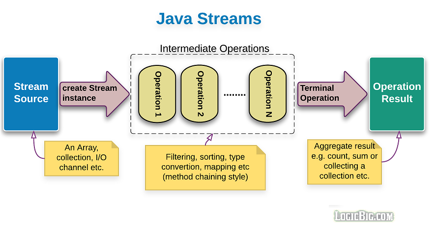

# 목차

- [Stream](#stream)
  * [1 Stream이란](#1-stream이란)
    + [1-1 Stream 이전의 문제](#1-1-stream-이전의-문제)
    + [1-2 Stream이란](#1-2-stream이란)
    + [1-3 Stream 특징](#1-3-stream-특징)
    + [1-4 Stream의 동작 흐름](#1-4-stream의-동작-흐름)
  * [2 Stream 생성 방법](#2-stream-생성-방법)
    + [2-1 컬렉션 스트림](#2-1-컬렉션-스트림)
    + [2-2 배열 스트림](#2-2-배열-스트림)
    + [2-3 Stream.builder()](#2-3-streambuilder)
    + [2-4 Stream.generate()](#2-4-streamgenerate)
    + [2-5 Stream.iterate()](#2-5-streamiterate)
    + [2-6 빈 스트림](#2-6-빈-스트림)
    + [2-7 기본 타입형 스트림](#2-7-기본-타입형-스트림)
    + [2-8 문자열 스트림](#2-8-문자열-스트림)
    + [2-9 병렬 스트림](#2-9-병렬-스트림)
    + [2-10 두 스트림 연결](#2-10-두-스트림-연결)
  * [3 Stream 연산](#3-stream-연산)
    + [3-1 중간 연산 - 가공](#3-1-중간-연산---가공)
      - [스트림 필터링 - filter, distinct](#스트림-필터링---filter-distinct)
      - [스트림 변환 - map, flatMap](#스트림-변환---map-flatmap)
      - [스트림 제한 - limit, skip](#스트림-제한---limit-skip)
      - [스트림 정렬 - sorted](#스트림-정렬---sorted)
      - [스트림 연산 결과 확인 - peek](#스트림-연산-결과-확인---peek)
    + [3-2 최종 연산 - 결과](#3-2-최종-연산---결과)
      - [요소의 출력 - forEach](#요소의-출력---foreach)
      - [요소의 소모 - reduce](#요소의-소모---reduce)
      - [요소의 검색 - findFirst, findAny](#요소의-검색---findfirst-findany)
      - [요소의 검사 - anyMatch, allMatch, noneMatch](#요소의-검사---anymatch-allmatch-nonematch)
      - [요소의 통계 - count, min, max](#요소의-통계---count-min-max)
      - [요소의 연산 - sum, average](#요소의-연산---sum-average)
      - [요소의 수집 - collect](#요소의-수집---collect)
  * [참고](#참고)

<br>

# Stream


## 1 Stream이란

### 1-1 Stream 이전의 문제

컬렉션이나 배열에 데이터를 담고 연산은 하기 위해서 `for`문과 `Iterator`를 이용해야 한다. 

이때 발생되는 문제는 다음과 같다.

* 코드가 너무 길다.
  * 코드의 depth도 점점 깊어지고 길어지면 가독성이 떨어진다.
* 재사용성이 떨어진다.
* 데이터 소스마다 다른 방식으로 다뤄야 한다.
  * 예 ) List를 정렬할 때는 `Collections.sort()`, 배열을 정렬할 때는 `Arrays.sort()`

위와 같은 문제를 해결한 것이 바로 Stream이다.

<br>

### 1-2 Stream이란

자바 8에서 추가한 **스트림은 람다를 활용할 수 있는 기술 중 하나**이다.

* 스트림은 **데이터 소스와 상관없이 같은 방식으로 데이터를 다룰 수 있다.** (코드의 재사용성)
  * 스트림은 데이터 소스를 추상화하고, 자주 사용되는 메서드들을 정의해놓았다.
* **스트림은 '데이터의 흐름'이다.**
  * 배열 또는 컬렉션에  함수 여러 개를 조합해서 원하는 결과를 필터링하고 가공된 결과를 얻을 수 있다.
* 람다를 이용해서 코드의 양을 줄이고 간결하게 표현한다.
* **DB의 쿼리(SELECT)와 같이 정형화된 처리 패턴을 적용시킨 것.**
  * 배열 혹은 컬렉션의 데이터를 쿼리(Stream와 동일하다고 봐도 무방)하는 것.

<br>

### 1-3 Stream 특징

> 특징만 이해해도 Stream은 이해했다고 보면 된다.

* 스트림은 외부 반복을 통해 작업하는 컬렉션과는 달리 **내부 반복 (internal interation)을 통해 작업을 수행한다.**
* 스트림은 재사용이 가능한 컬렉션과는 달리 **단 한 번만 사용할 수 있다.**
* 스트림은 **원본 데이터를 변경하지 않는다.**
* 스트림의 연산은 **필터-맵(filter-map) 기반의 API를 사용하여 지연 (lazy) 연산을 통해 성능을 최적화**한다.
* 스트림은 parallelStream() 메서드를 통한 **손쉬운 병렬 처리를 지원한다.**

<br>

### 1-4 Stream의 동작 흐름

Stream은 다음 세 가지 단계에 걸쳐서 동작한다.

<p align="center"><br>출처 : https://www.logicbig.com/tutorials/core-java-tutorial/java-util-stream/stream-api-intro.html</p>

1. 스트림 생성
2. 스트림의 중간 연산 (스트림의 변환)
   * 연산 결과가 스트림인 연산.
3. 스트림의 최종 연산 (스트림의 사용)
   * 연산 결과가 스트림이 아닌 연산. 스트림의 요소를 소모하므로 단 한번만 가능.

<br>

## 2 Stream 생성 방법

Stream을 사용하기 위해서는 일단 생성하는 방법을 알아야 한다.

### 2-1 컬렉션 스트림

컬렉션의 최고 조상인 `Collection`에 `stream()`이 정의되어 있다. 그러므로 모든 `Collection`은 사용이 가능하다.

```java
public interface Collection<E> extends Iterable<E> {
    ...
    
    default Stream<E> stream() {
        return StreamSupport.stream(spliterator(), false);
    }
    
    ...
}
```

생성 방법은 다음과 같다.

```java
List<Integer> list = Arrays.asList(1, 2, 3, 4, 5, 6, 7);
Stream<Integer> stream = list.stream();
Stream<Integer> parallelStream = list.parallelStream(); // 병렬 처리 스트림
```

<br>

### 2-2 배열 스트림

배열을 소스로 하는 스트림을 생성하는 메서드는 `Stream`과 `Arrays`에 static 메서드로 정의되어 있다.

```java
Stream<T> Stream.of(T... values) // 가변 인자
Stream<T> Stream.of(T[])
Stream<T> Arrays.stream(T[])
Stream<T> Arrays.stream(T[] array, int startInclusive, int endExclusive)
```

예를 들어 다음과 같이 생성이 가능하다.

```java
Stream<String> strStream = Stream.of("a", "b", "c"); // 가변 인자
Stream<String> strStream = Stream.of(new String[]{"a", "b", "c"});
Stream<String> strStream = Arrays.stream(new String[]{"a", "b", "c"});
Stream<String> strStream = Arrays.stream(new String[]{"a", "b", "c"}, 0, 3);
```

<br>

### 2-3 Stream.builder()

빌더(Builder)를 사용하면 스트림에 직접적으로 원하는 값을 넣을 수 있다. 빌더 패턴과 동일하다.

```java
public interface Stream<T> extends BaseStream<T, Stream<T>> {
    ...
      
    public static<T> Builder<T> builder() {
        return new Streams.StreamBuilderImpl<>();
    }
  
    ...
      
    public interface Builder<T> extends Consumer<T> {
        void accept(T t);
      
        default Builder<T> add(T t) {
            accept(t);
            return this;
        }
      
        Stream<t> build();
    }
}
```

아래와 같이 사용된다.

```java
Stream<String> builderStream =
                Stream.<String>builder()
                .add("a").add("b").add("c")
                .build();
```

<br>

### 2-4 Stream.generate()

`generate()`는 람다식을 매개변수로 받아서, 이 람다식에 의해 계산되는 값들을 요소로 하는 무한 스트림을 생성한다. 

중요한 점은 람다식의 `Supplier`가 매개변수로 주어집니다. 즉, 리턴값만 있는 함수형 인터페이스를 매개변수로 입력해야 합니다.

```java
public interface Stream<T> extends BaseStream<T, Stream<T>> {
    ...
      
    public static<T> Stream<T> generate(Supplier<? extends T> s) { ... }
}
```

아래와 같이 사용된다. `generate()`는 크기가 정해져있지 않고 무한하기 때문에 특정 사이즈로 최대 크기를 제한해야 한다.

```java
Stream<String> generateStream = Stream.generate(() -> {return "binghe";}).limit(10);
```

10개의 `binghe`라는 문자열이 들어간 스트림이 생성된다.

<br>

### 2-5 Stream.iterate()

`iterate()`는 씨앗값(seed)으로 지정된 값부터 시작해서, 람다식 f에 의해 계산된 결과를 다시 seed값으로 해서 계산을 반복한다. 즉 요소가 다음 요소의 인풋으로 들어간다.

```java
Stream<Integer> iterateStream =
                Stream.iterate(0, n -> n+2)
                .limit(5);
// 0, 2, 4, 6, 8
```

> 주의 : `generate()`와 `iterate()`는 기본형 스트림 타입의 참조변수를 다룰 수 없다.

<br>

### 2-6 빈 스트림

요소가 하나도 없는 비어있는 스트림을 생성할 수도 있다. 빈 스트림을 생성하는 이유는 `null`보다 빈 스트림을 반환하는 것이 낫기 때문이다.

```java
public Stream<String> streamOf(List<String> list) {
    return list == null || list.isEmpty() 
      ? Stream.empty() 
      : list.stream();
}
```

<br>

### 2-7 기본 타입형 스트림

제너릭을 사용하면 리스트나 배열을 이용해서 기본 자료형 타입 (int, long, double 등) 스트림을 생성할 수 있다.

하지만 제너릭을 사용하지 않고 직접적으로 해당 타입의 스트림을 다룰 수도 있다.

```java
IntStream IntStream.of(int... values) // Stream이 아니라 IntStream
IntStream IntStream.of(int[])
IntStream Arrays.stream(int[])
IntStream Arrays.stream(int[] array, int startInclusive, int endExclusive)
```

이외에도 `LongStream`과 `DoubleStream`이 존재한다. 제너릭을 사용하지 않기 때문에 불필요한 오토박싱(autu-boxing)이 일어나지 않으며, 필요시 `boxed` 메서드를 이용해서 박싱할 수 있다.

```java
IntStream intStream = IntStream.of(1, 2, 3, 4);
DoubleStream doubleStream = DoubleStream.of(1.0, 2.0, 3.0, 4.0);
```

```java
IntStream intStream = IntStream.range(1, 5); // [1, 2, 3, 4]
LongStream longStream = LongStream.rangeClosed(1, 5); // [1, 2, 3, 4, 5]
```

`range`와 `rangeClosed`는 범위의 차이이다.

또한, `Random` 클래스를 가지고 난수 스트림을 생성할 수 있다.

```java
DoubleStream doubles = new Random().doubles(3); // 난수 3개 생성
```

<br>

### 2-8 문자열 스트림

문자열(`String`)을 이용해서 스트림을 생성할수도 있다.

아래는 각 문자를 `IntStream`으로 변환한 예제이다.

```java
IntStream charsStream = "binghe".chars(); // [98, 105, 110, 103, 104, 101]
```

<br>

### 2-9 병렬 스트림

스트림 생성시 `parallelStream` 메서드를 사용하면 병렬 스트림을 쉽게 생성할 수 있다.

```java
List<String> language = Arrays.asList(new String[]{"JAVA", "JS", "PYTHON"});

// 병렬 스트림 생성 (컬렉션)
Stream<String> parallelStream = language.parallelStream();

// 병렬 스트림 생성 (배열)
Arrays.stream(arr).parallel();

// 병렬 스트림 여부 확인
boolean isParallel = parallelStream.isParallel();
```

병렬로 만든 스트림은 각 작업을 쓰레드를 이용해 병렬 처리하게 된다. (map, anyMatch 등등)

컬렉션이나 배열이 아닌 경우 다음과 같이 `parallel()` 메서드를 이용해 처리하면 된다.

```java
IntStream intStream = IntStream.range(1, 150).parallel();
```

다시 시퀀셜 모드로 돌리고 싶다면 `sequential()` 메서드를 사용하면 된다.

```java
IntStream intStream = intStream.sequential();
```

<br>

### 2-10 두 스트림 연결

`Stream.concat` 메서드를 이용해서 두 스트림을 하나로 연결할 수 있다. 물론 두 스트림의 요소는 같은 타입이어야 한다.

```java
Stream<String> stream1 = Stream.of("JAVA", "JS", "PYTHON");
Stream<String> stream2 = Stream.of("GO", "C", "C++");

Stream<String> concatStream = Stream.concat(stream1, stream2);
// [JAVA, JS, PYTHON, GO, C, C++]
```

<br>

## 3 Stream 연산

연산의 종류는 다음과 같다.

* 중간 연산 - 가공
  * 스트림 필터링 : filter(), distinct()
  * 스트림 변환 : map(), flatMap()
  * 스트림 제한 : limit(), skip()
  * 스트림 정렬 : sorted()
  * 스트림 연산 결과 확인 : peek()
* 최종 연산 - 결과
  * 요소의 출력 : forEach()
  * 요소의 소모 : reduce()
  * 요소의 검색 : findFirst(), findAny()
  * 요소의 검사 : anyMatch(), allMatch(), noneMatch()
  * 요소의 통계 : count(), min(), max()
  * 요소의 연산 : sum(), average()
  * 요소의 수집 : collect()

<br>

### 3-1 중간 연산 - 가공

생성된 초기 스트림은 중간 연산을 통해 또 다른 스트림으로 변환된다.

이러한 중개 연산은 스트림을 전달받아 스트림을 반환하므로, 중개 연산은 연속으로 연결해서 사용할 수 있다.

또한, 스트림의 중개 연산은 필터-맵 기반의 API를 사용함으로 지연(lazy) 연산을 통해 성능을 최적화할 수 있다.

#### 스트림 필터링 - filter, distinct

```java
IntStream stream1 = IntStream.of(1, 2, 3, 4, 5, 5, 6, 6, 1, 3, 4);
IntStream stream2 = IntStream.of(1, 2, 3, 4, 5, 5, 6, 6, 1, 3, 4);

// 홀수만을 골라내기
stream1.filter(n -> n % 2 != 0).forEach(System.out::print); // 135513

// 중복된 요소 제거
stream2.distinct().forEach(System.out::print); // 123456
```

* filter() : 해당 스트림에서 주어진 조건(predicate)에 맞는 요소만으로 구성된 새로운 스트림을 반환한다.
* distinct() : 내부적으로 Object 클래스의 `equals()` 메서드를 사용하여 요소의 중복을 비교한다.

<br>

#### 스트림 변환 - map, flatMap

```java
Stream<String> stream = Stream.of("JAVA", "C", "C++", "PYTHON");
stream.map(s -> s.length()).forEach(System.out::println);
// stream.map(s -> s.toLowerCase()).forEach(System.out::println); // 소문자로 전환
```

* map() : 해당 스트림의 요소들을 주어진 함수에 인수로 전달하여, 그 반환값들로 이루어진 새로운 스트림을 반환한다.
  * 즉, 스트램 내 요소들을 하나씩 특정 값으로 변환해준다. 값을 변환하기 위한 람다를 인자로 받는다.

```java
Stream<String> stream = Stream.of("I study hard", "You study JAVA", "I am hungry");
stream.flatMap(s -> Stream.of(s.split(" +"))).forEach(System.out::println);
```

* flatMap() : 만약 스트림의 요소가 배열이라면, flatMap() 메서드를 사용하여 각 배열의 각 요소의 반환값을 하나로 합친 새로운 스트림을 얻을 수 있다.

<br>

#### 스트림 제한 - limit, skip

```java
IntStream stream1 = IntStream.range(0, 10);
IntStream stream2 = IntStream.range(0, 10);

stream1.skip(4).forEach(n -> System.out.print(n + " ")); // 4 5 6 7 8 9
stream2.limit(5).forEach(n -> System.out.print(n + " ")); // 0 1 2 3 4
```

* limit() : 해당 스트림의 첫 번째 요소부터 전달된 개수만큼의 요소만으로 이루어진 새로운 스트림을 반환한다.
* skip() : 해당 스트림의 첫 번째 요소부터 전달된 개수만큼의 요소를 제외한 나머지 요소만으로 이루어진 새로운 스트림을 반환한다.

<br>

#### 스트림 정렬 - sorted

```java
Stream<String> stream = Stream.of("JAVA", "C", "C++", "PYTHON");

stream.sorted().forEach(s -> System.out.print(s + " ")); // C C++ JAVA PYTHON
```

* sorted() : 해당 스트림을 주어진 비교자(`comparator`)를 이용하여 정렬한다.
  * 비교자를 전달하지 않으면 기본적으로 사전 편찬 순으로 정렬하게 된다.

<br>

#### 스트림 연산 결과 확인 - peek

```java
IntStream stream = IntStream.of(7, 5, 5, 2, 1, 2, 3, 5, 4, 6);

stream.peek(s -> System.out.println("원본 스트림 : " + s))
  .skip(2)
  .peek(s -> System.out.println("skip(2) 실행 후 : " + s))
  .limit(5)
  .peek(s -> System.out.println("limit(5) 실행 후 : " + s))
  .sorted()
  .peek(s -> System.out.println("sorted() 실행 후 : " + s))
  .forEach(n -> System.out.print(n + " "));
```

* peek() : 결과 스트림으로부터 요소를 소모하여 추가로 명시된 동작을 수행한다.
  * 이 메서드는 원본 스트림에서 요소를 소모하지 않으므로, 주로 연산과 연산 사이에 결과를 확인하고 싶을 때 사용된다.

<br>

### 3-2 최종 연산 - 결과

Stream에서 중개 연산을 통해 변환된 스트림은 마지막으로 최종 연산을 통해 각 요소를 소모하여 결과를 표시한다.

즉, 지연(lazy)되었던 모든 중개 연산들이 최종 연산 시에 모두 수행되는 것이다.

이렇게 최종 연산 시에 모든 요소를 소모한 해당 스트림은 더는 사용할 수 없게 된다.

#### 요소의 출력 - forEach

```java
IntStream stream = IntStream.of(1, 2, 3, 4);
stream.forEach(System.out::println);
```

* forEach() : 스트림의 각 요소를 소모하여 명시된 동작을 수행한다. (for문과 같다.)
  * 반환 타입이 void이므로 보통 스트림의 모든 요소를 출력하는 용도로 많이 사용된다.

<br>

#### 요소의 소모 - reduce

```java
// 1개 (accumulator)
Optional<T> reduce(BinaryOperator<T> accumulator);

// 2개 (identity)
T reduce(T identity, BinaryOperator<T> accumulator);

// 3개 (combiner)
<U> U reduce(U identity,
    BiFunction<U, ? super T, U> accumulator,
    BinaryOperator<U> combiner);
```

* reduce() : 첫 번째와 두번째 요소를 가지고 연산을 수행한 뒤, 그 결과와 세 번째 요소를 가지고 또 다시 연산을 수행한다. 이런식으로 해당 스트림의 모든 요소를 소모하여 연산을 수행하고, 그 결과를 반환하게 된다.
  * accumulator : 각 요소를 처리하는 계산 로직. 각 요소가 올 때마다 중간 결과를 생성하는 로직.
  * identity : 계산을 위한 초기값으로 스트림이 비어서 계산할 내용이 없더라도 이 값은 리턴.
  * combiner : 병렬(*parallel*) 스트림에서 나눠 계산한 결과를 하나로 합치는 동작하는 로직.

```java
OptionalInt reduced
  = IntStream.range(1, 4) // 1, 2, 3
  .reduce((a, b) -> {
    return Integer.sum(a, b);
  });

System.out.println(reduced.getAsInt()); // 6
```

<br>

#### 요소의 검색 - findFirst, findAny

```java
IntStream stream1 = IntStream.of(4, 2, 7, 3, 5, 1, 6);
IntStream stream2 = IntStream.of(4, 2, 7, 3, 5, 1, 6);

OptionalInt result1 = stream1.sorted().findAny();
System.out.println(result1.getAsInt()); // 1

OptionalInt result2 = stream2.sorted().findFirst();
System.out.println(result1.getAsInt()); // 1
```

* findFirst(), findAny() : 두 메서드 모두 스트림에서 첫 번째 요소를 참조하는 `Optional` 객체를 반환한다.
* 차이점
  * 병렬 스트림인 경우에는 findAny() 메서드를 사용해야만 정확한 연산 결과를 반환할 수 있다.

<br>

#### 요소의 검사 - anyMatch, allMatch, noneMatch

```java
IntStream stream1 = IntStream.of(4, 2, 7, 3, 5, 1, 6);
IntStream stream2 = IntStream.of(4, 2, 7, 3, 5, 1, 6);

System.out.println(stream1.anyMatch(n -> n > 5)); // true
System.out.println(stream2.allMatch(n -> n > 5)); // false
```

* anyMatch() : 해당 스트림의 **일부 요소**가 특정 조건을 **만족할 경우**에 true를 반환함
* allMatch() : 해당 스트림의 **모든 요소**가 특정 조건을 **만족할 경우**에 true를 반환함.
* noneMatch() : 해당 스트림의 **모든 요소**가 특정 조건을 **만족하지 않을 경우**에 true를 반환함.

* 공통점
  * 세 메서드 모두 인수로 Predicate 객체를 전달받으며, 요소의 검사 결과는 boolean 값으로 반환된다.

<br>

#### 요소의 통계 - count, min, max

```java
IntStream stream1 = IntStream.of(4, 2, 7, 3, 5, 1, 6);
IntStream stream2 = IntStream.of(4, 2, 7, 3, 5, 1, 6);

System.out.println(stream1.count());           // 7
System.out.println(stream2.max().getAsInt());  // 7
```

* count() : 해당 스트림의 요소의 총 개수를 long 타입의 값으로 반환한다.
* min(), max() : 해당 스트림의 요소 중에서 가장 큰 값과 가장 작은 값을 가지는 요소를 참조하는 Optional 객체를 얻을 수 있다.

<br>

#### 요소의 연산 - sum, average

```java
IntStream stream1 = IntStream.of(4, 2, 7, 3, 5, 1, 6);
IntStream stream2 = IntStream.of(4, 2, 7, 3, 5, 1, 6);

System.out.println(stream1.sum());                   // 28
System.out.println(stream2.average().getAsDouble()); // 4.0
```

* IntStream이나 DoubleStream과 같은 기본 타입 스트림에는 해당 스트림의 모든 요소에 대해 합과 평균을 구할 수 있는 sum()과 average() 메서드가 각각 정의되어 있다.
* average() 메서드는 Double로 래핑 된 Optional 객체를 반환한다.

<br>

#### 요소의 수집 - collect

```java
Stream<String> stream = Stream.of("넷", "둘", "하나", "셋");

List<String> list = stream.collect(Collectors.toList());

Iterator<String> iter = list.listIterator();
while (iter.hasNext()) {
    System.out.print(iter.next() + " ");
}
```

* collect() : 인수로 전달되는 Collectors 객체에 구현된 방법대로 스트림의 요소를 수집한다.
* Collectors : 스트림 요소의 수집 용도로 사용하는 클래스. 미리 정의된 다양한 방법이 클래스 메서드로 정의되어 있다.
  * 스트림을 배열이나 컬렉션으로 변환 : toArray(), toCollection(), toList(), toSet(), toMap()
  * 요소의 통계와 연산 메서드와 같은 동작을 수행 : counting(), maxBy(), minBy(), summingInt(), averagingInt()
  * 요소의 소모와 같은 동작을 수행 : reducing(), joining()
  * 요소의 그룹화와 분할 : groupingBy(), partitioningBy()
  * 사용자가 직접 Collector 인터페이스를 구현하여 자신만의 수집 방법을 정의할 수 있다.

```java
Stream<String> stream = Stream.of("JAVA", "C", "C++", "PYTHON");

Map<Boolean, List<String>> patition 
    = stream.collect(Collectors.partitioningBy(s -> (s.length() % 2) == 0));

List<String> oddLengthList = patition.get(false);
System.out.println(oddLengthList);               // C, C++

List<String> evenLengthList = patition.get(true);
System.out.println(evenLengthList);               // JAVA, PYTHON
```

<br>

## 참고

* 자바의 정석 - 스트림
* http://www.tcpschool.com/java/java_stream_concept
* https://futurecreator.github.io/2018/08/26/java-8-streams/