[자바의 정석](http://www.yes24.com/Product/Goods/24259565?OzSrank=2)을 바탕으로 정리한 자료입니다.


# 목차

- [인터페이스](#인터페이스)
  * [1 인터페이스란?](#1-인터페이스란?)
    + [1-1 인터페이스의 의미](#1-1-인터페이스의-의미)
    + [1-2 인터페이스의 특징](#1-2-인터페이스의-특징)
    + [1-3 인터페이스 vs 추상클래스](#1-3-인터페이스-vs-추상클래스)
  * [2 인터페이스의 작성](#2-인터페이스의-작성)
  * [3 인터페이스의 상속](#3-인터페이스의-상속)
  * [4 인터페이스 구현 implement](#4-인터페이스-구현-implement)
  * [5 인터페이스를 이용한 다형성](#5-인터페이스를-이용한-다형성)
  * [6 인터페이스의 장점](#6-인터페이스의-장점)
    + [6-1 인터페이스의 근본적인 개념](#6-1-인터페이스의-근본적인-개념)
    + [6-2 인터페이스의 진짜 장점](#6-2-인터페이스의-진짜-장점)
    + [6-3 인터페이스의 또 다른 장점들](#6-3-인터페이스의-또-다른-장점들)
      - [6-3-1 개발시간을 단축할 수 있다](#6-3-1-개발시간을-단축할-수-있다)
      - [6-3-2 변경에 유리한 설계가 가능하다](#6-3-2-변경에-유리한-설계가-가능하다)
      - [6-3-3 표준화가 가능하다](#6-3-3-표준화가-가능하다)
      - [6-3-4 서로 관계없는 클래스들을 관계를 맺어줄 수 있다](#6-3-4-서로-관계없는-클래스들을-관계를-맺어줄-수-있다)
  * [7 디폴트 메서드와 static 메서드](#7-디폴트-메서드와-static-메서드)


# 인터페이스

객체지향의 기본 설계 원칙은 SOLID와 여러 디자인 패턴은 인터페이스를 기반으로 구현된다.

인터페이스에 대해 정확히 이해하고 있는 것은 큰 도움이 될 거라 생각한다.


## 1 인터페이스란?


### 1-1 인터페이스의 의미

* **추상 메서드의 집합** (프로그래밍 관점)
  * 추상 메서드가 인터페이스의 핵심이다.
* **구현된 것이 전혀 없는 설계도. 껍데기** ( 모든 멤버가 public )
  * 객체의 껍데기


### 1-2 인터페이스의 특징

* 실제 구현된 것이 전혀 없는 기본 설계도. (알맹이 없는 껍데기)
* **추상메서드와 상수만을 멤버로 가질 수 있다.**
* 미리 정해진 규칙에 맞게 구현하도록 표준을 제시하는데 사용된다.


### 1-3 인터페이스 vs 추상클래스

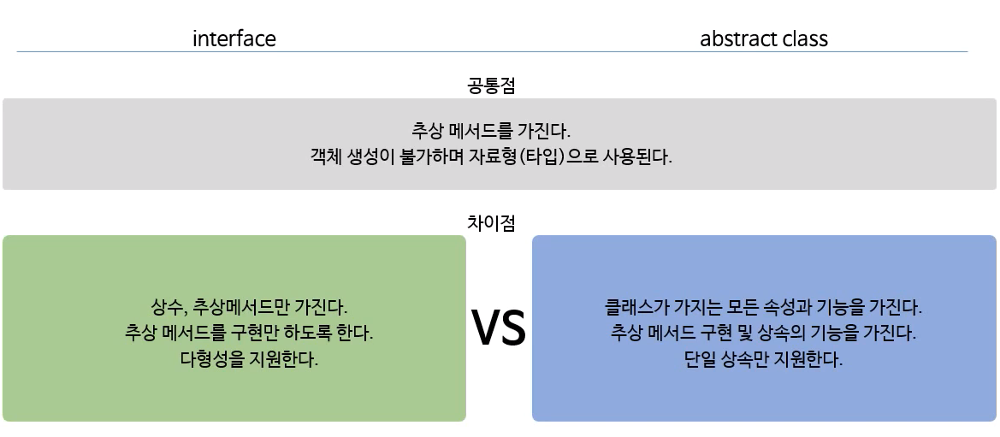

* 추상 클래스 : **일반 클래스(동일)인데 추상메서드를 가지고 있는 것.**
  * **멤버변수를 가지고 있다**.
  * 생성자가 있다.
  * **일부 미완성**
* 인터페이스 : **추상메서드만을 가지고 있는 것.**
  * **멤버변수를 가질 수 없다**. ( 상수만을 선언할 수 있다. )
  * 생성자가 없다.
  * 완전 미완성

* 추상 클래스와 인터페이스의 공통점
  * 추상 메서드를 가지고 있다. (미완성 설계도)
  * 객체 생성이 불가하다.


## 2 인터페이스의 작성

`class`대신 `interface`를 사용한다는 것 외에는 클래스 작성과 동일하다.

```java
interface 인터페이스이름 {
  public static final 타입 상수이름 = 값; // 상수.
  public abstract 메서드이름(매개변수); // 추상 메서드.
}
```

* **모든 멤버변수는 `public static final`이어야 하며, 이를 생략할 수 있다.**
* **모든 메서드는 `public abstract` 이어야 하며, 이를 생략할 수 있다.**


> 예제

```java
interface PlayingCard {
  public static final int SPADE = 4;
  final int DIAMOND = 3; // public static final int DIAMOND = 3;
  static int HEART = 2; // public static final int HEART = 2;
  int CLOVER = 1; // public static final int CLOVER = 1;
  
  public static String getCardNumber();
  String getCardKind(); // public abstract String getCardKind();
}
```


## 3 인터페이스의 상속

```java
interface Fightable extends Movable, Attackable {//메서드 두개(move, attack)} // 다중 상속

interface Movable {
  // 지정한 위치(x, y)로 이동하는 가능의 메서드
  void move(int x, int y);
}

interface Attackable {
  // 지정한 대상 (u)을 공격하는 기능의 메서드
  void attack(Unit u);
}
```

* 자식 인터페이스(Fightable)는 부모 인터페이스(Movable, Attackable)에 정의된 멤버를 모두 상속받는다.
* **인터페이스의 조상은 인터페이스만 가능** ( **인터페이스는 Object가 최고 조상이 아니다**. )
* **다중 상속이 가능하다**. ( **추상메서드는 충돌해도 문제가 없다**. )
  * 기존의 클래스는 부모 클래스중 동일한 메서드가 있으면 어떤 것을 상속 받을지 모르기 때문에 충돌이 발생했다.
  * **추상메서드는 몸통이 없고 선언부만 있으므로, 상속을 받아 구현해주면 되기 때문에 문제가 없다.**


## 4 인터페이스 구현 implement

* **구현 : 인터페이스에 정의된 추상 메서드를 완성하는 것.**
  * 추상메서드 구현 = 메서드 몸통 완성시키기.
  * **추상클래스 완성시키는 것과 동일하다.**

```java
class 클래스이름 implements 인터페이스이름 {
  // 인터페이스에 정의된 추상메서드를 모두 구현해야 한다.
}
```


> 예제

```java
class Fighter implements Fightable {
  public void move(int x, int y) { /* 구현 내용 */ }
  public void attack(Unit u) { /* 구현 내용 */ }    
}
```


> 예제 ( 1개만 구현 했을 경우 )

```java
abstract class Fighter implements Fightable {
  public void move(int x, int y) { /* 구현 내용 */ }
  // public abstract void attack(Unit u) { /* 구현 내용 */ } // 추상메서드로 남겨둔다.
}
```


## 5 인터페이스를 이용한 다형성

```java
interface Fightable{
  void attack(Fightable f);
}

abstract class Unit {
  int x, y;
  public abstract void move(int x, int y);
  public abstract void attack(Fightable f); // 인터페이스 Fightable의 attack과 중복
}

class Fighter extends Unit implements Fightable {
  public void move(int x, int y){ /* 내용 생략 */ }
  public void attack(Fightable f){ /* 내용 생략 */ } 
}

class Main {
  public static void main(String[] args) {
    // 다형성을 이용하여 인터페이스를 참조형 타입으로 사용이 가능하다.
    Unit u = new Fighter(); // move, attack, x, y 모두 접근 가능.
    Fightable f = new Fighter(); // attack만 사용가능.
    f.move(); // 오류
    f.attack();
  }
}
```

* 인터페이스를 다형성으로 사용가능한 이유는 인터페이스도 해당 메서드의 주소를 가지고 있기 때문이다
  * **`Fightable` 인터페이스가 `attack`이라는 메서드의 주소를 참조할 수 있기 때문이다. (리모콘)**
    * 즉, `Fightable`를 참조형으로 사용한 `f`는 `attack`밖에 사용이 불가하다.


> 매개변수로 이용할 수도 있다.

```java
interface Fightable {
  void move(int x, int y);
  void attack(Fightable f); // 인스턴스를 이용한 매개변수 다형성
}
```

* **`Fightable`인터페이스를 구현한 클래스의 인스턴스만 매개변수로 가능하다.**


## 6 인터페이스의 장점


### 6-1 인터페이스의 근본적인 개념

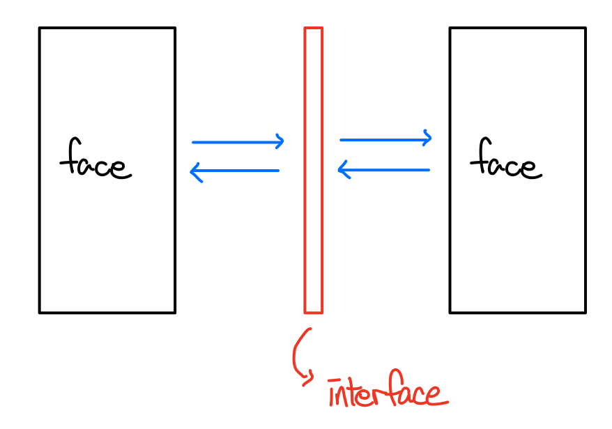

* interface = inter(사이, ~간의) + face(얼굴, 대상)
  * 두 대상(객체) 간의 '연결, 대화, 소통'을 돕는 **'중간 역할'**을 한다.
  * 껍데기
* 왜 인터페이스가 필요한가?
  * 어떤 두 대상이 직접 소통도 가능하지만, 인터페이스가 소통을 도와줄 수 있다.
  * 인간 사이의 중계인이 있듯이.  


* 사람이 직접 복잡한 기계를 조작하는 것 보다는 사람이 사용하기 편리한 인터페이스를 붙여놓으면 기계와 소통하기 쉬워진다.
  * **GUI ( 컴퓨터 하드웨어를 쉽게 사용할 수 있게 해준다. - 운영체제 )**
  * 자판기

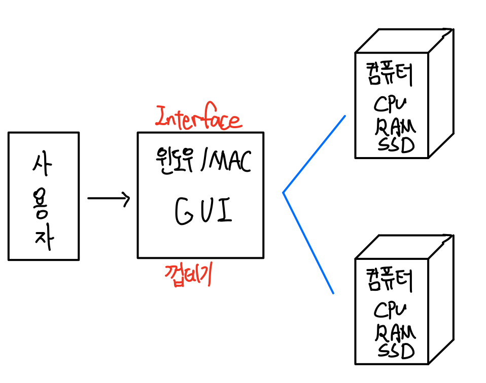

* 인터페이스의 대표적인 예제는 **GUI**이다.
  * **컴퓨터(하드웨어)가 다른 것으로 바뀌어도, 인터페이스만 바뀌지 않으면 사용하는데 전혀 지장이 없다.**
    * **컴퓨터가 삼성이든, LG든, 뭐든 윈도우 운영체제만 쓴다면 똑같은 조작 방법을 제공한다.**
  * 인터페이스가 없다면, 삼성 컴퓨터의 하드웨어에 익숙해진 상태에서 LG로 컴퓨터를 바꾸면 또 다시 LG 컴퓨터 하드웨어에 대한 공부와 익숙해지는 시간이 필요하다.
* **인터페이스는 변경에 유리하다.**


### 6-2 인터페이스의 진짜 장점

> 인터페이스의 진짜 장점은 개방-폐쇄 원칙과 의존-역전 원칙이다.

* 선언(설계, 껍데기)와 구현(알맹이)을 분리시킬 수 있게 한다.

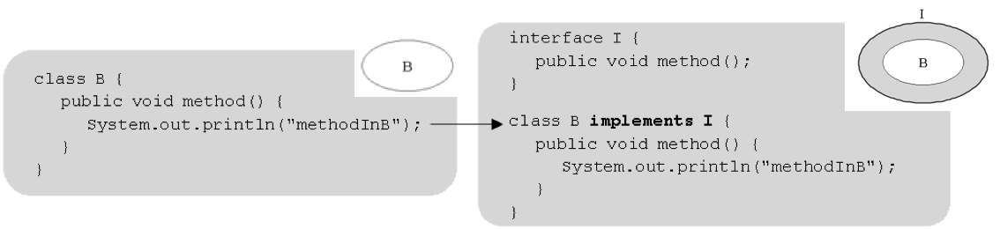

* `class B` : 껍데기 + 알맹이
  * 유연하지 않다. ( 변경에 불리하다. )
* `interface I` (껍데기) `class B implements I` (알맹이)
  * 인터페이스는 껍데기와 알맹이를 따로 분리 시킨 것. ( class -> class + interface )
    * 분리함으로써, 알맹이를 다른 것으로 바꿔도 사용하는 데는 지장이 없다.
  * 유연하다. ( 변경에 유리하다. )

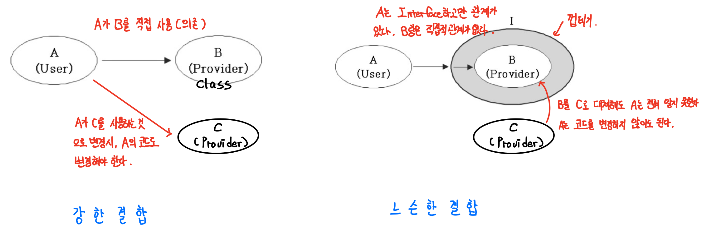

* 강한 결합 ( A와 B가 직접적으로 연결 )
  * 빠르다.
  * 변경에 취약하다.
* 느슨한 결합 ( A와 B가 간접적으로 연결 )
  * 느리다.
  * 변경에 유리하다. ( 유연한 코드 )

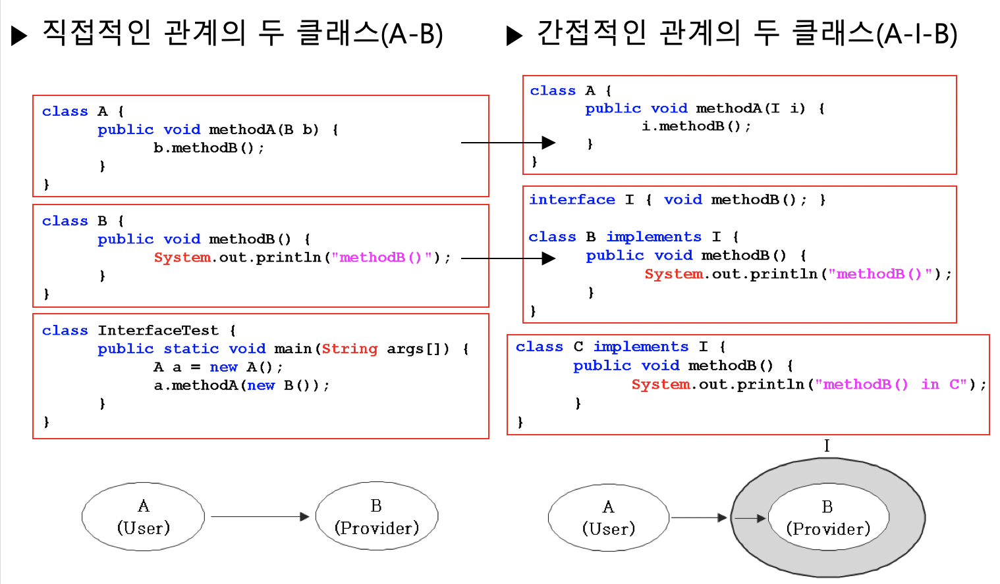

* interface를 도입하면 `class A`와 `class B`는 관계가 없어진다.
  * `class A`의 `methodA(B b`)를 `methodA(I i)`로 바꿔주었다.
* `class C`가 새로 나와도, `I`를 인터페이스로 구현하고 있다면 `class A`의 코드는 바꾸지 않아도 똑같이 동작한다.


> 인터페이스를 사용하지 않는다면.

```java
class A {
  public void method(B b){ // C를 사용하려면 매개변수를 C로 변경해줘야 한다.
    b.method();
  }
}

class B {
  public void method(){
    System.out.println("B클래스의 메서드");
  }
}

class C {
  public void method(){
    System.out.println("C클래스의 메서드.")
  }
}

public class InterfaceTest {
  public static void main(String[] args){
    A a = new A();
    a.method(new B()); // A가 B를 사용 (의존) -> 사용 가능.
    a.method(new C()); // A가 C를 사용 (의존) -> 에러 발생.
  }
}
```

* a를 통해 C의 메서드를 사용하려면 A클래스의 매개변수를 C로 바꿔줘야한다.


> 인터페이스 사용한다면 ( 껍데기와 알맹이로 분리하기 )

```java
class A {
  public void method(I i){ // B나 C나 모두 사용이 가능해진다.
    i.method();
  }
}

// 선언과 구현을 분리하는 역할.
interface I {
  void method();
}

class B implements I {
  public void method(){
    System.out.println("B클래스의 메서드");
  }
}

class C implements I {
  public void method(){
    System.out.println("C클래스의 메서드.")
  }
}

public class InterfaceTest {
  public static void main(String[] args){
    A a = new A();
    a.method(new B()); // 사용 가능
    a.method(new C()); // 사용 가능
  }
}
```

* **중요한 점은 A의 코드는 변경이 없다. ( 사용자가 조작방식을 변경하지 않아도 된다. )**


### 6-3 인터페이스의 또 다른 장점들

#### 6-3-1 개발시간을 단축할 수 있다

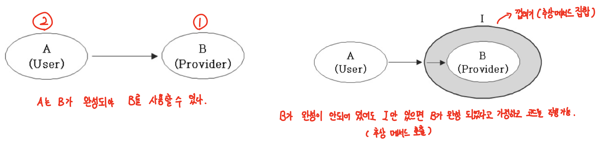


#### 6-3-2 변경에 유리한 설계가 가능하다

* `I`를 구현한 클래스가 있다면, `B`대신 사용이 가능하다. ( 사용자는 똑같은 조작으로 그대로 사용한다. )
* 협업 개발시 완성되었다고 가정하고 동시에 개발이 가능하다.


#### 6-3-3 표준화가 가능하다

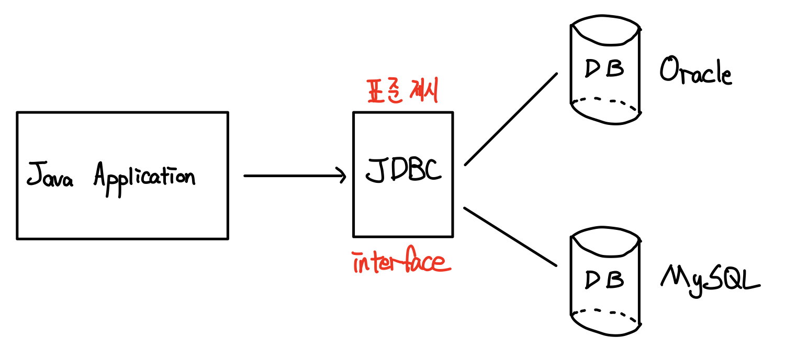

* 자바 애플리케이션을 사용하여 DB에 연결한다고 가정한다면, Oracle을 사용하다가 MySQL로 변경하면 자바단에서 코드를 많이 수정해야 한다.
* 그러므로, 자바에서는 JDBC라는 인터페이스를 만들어 Oracle과 MySQL에게 표준안을 제시한 것이다.
* 사용자는 JDBC의 메서드를 사용하여 Oracle이든 MySQL이든 똑같이 데이터를 조회, 수정등을 수행할 수 있다.
* 즉, 자바 개발자는 JDBC만 익숙해지면 어떤 DB도 의존하지 않고 사용이 가능하다.


> 사용자(Java Application)과 개발자(Oracle/MySQL) 둘 다 JDBC(Interface)를 지키도록 한다.


#### 6-3-4 서로 관계없는 클래스들을 관계를 맺어줄 수 있다

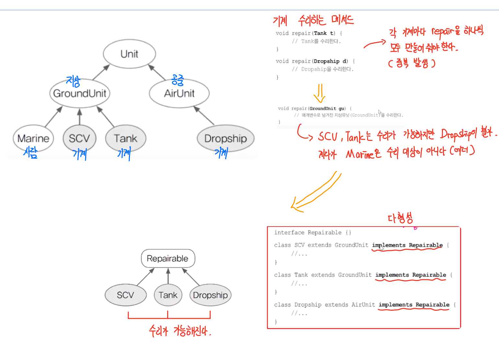

```java
void repair(Repairable r) {
  if(r instanceof Unit){
    Unit u = (Unit)r;
    while(u.hitPoint != u.MAX_HP){
      u.hitPoint++; // Unit의 HP를 증가시킨다.
    }
  }
}
```

* 위 예제처럼, 서로 관계가 없는 클래스들끼리 다형성의 성질을 이용하여 서로 관계를 맺어줄 수 있다.
  * 상속 관계도에서 관계가 없는 클래스.


## 7 디폴트 메서드와 static 메서드

> JDK 1.8부터 생겨난 것인데, 함수형 인터페이스와 깊은 연관이 있는 것 같다.

* 인터페이스에 디폴트 메서드, static메서드 추가 기능 ( JDK1.8부터 )
  * static은 클래스 멤버기 때문에, 독립적이다. 그러므로 인터페이스에 포함되지 않을 이유가 없었는데, 인터페이스 기존의 기능을 단순화하기 위해서 빼둔 것이라고 함.

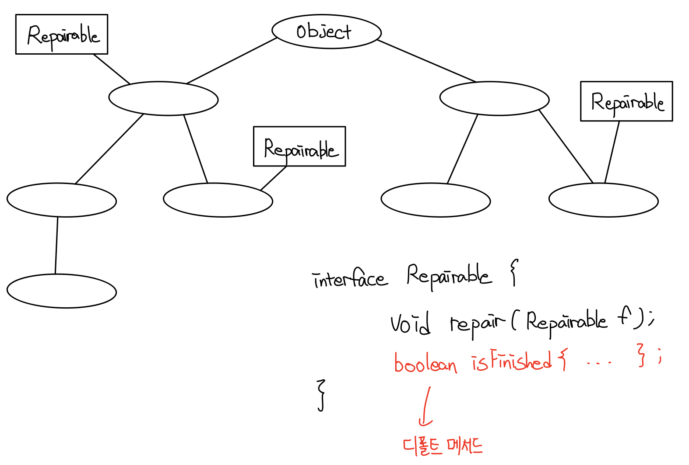

* 디폴트 메서드 : 인터페이스는 구현(implements)한 클래스에서 몸통을 만들어 주지 않아도 된다.
* 기존의 인터페이스는 추상메서드의 집합이다.
  * 하지만, 인터페이스를 상속받는 클래스들의 공통적인 역할을하는 메서드를 추가할 때는 디폴트 메서드를 사용할 수 있게 변경되었다.
  * 디폴트 메서드가 없다면, 인터페이스를 구현(implements)한 클래스에서 몸통을 모두 구현해줘야한다. (중복 발생)

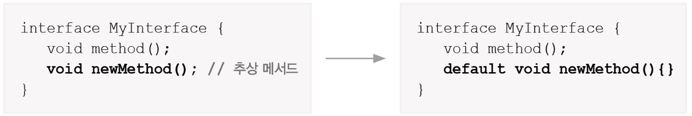

> 기존의 인터페이스는 추상메서드의 집합이었는데, 이를 깬 것이 디폴트메서드이다.
>
> 디폴트 메서드는 인터페이스를 구현한 클래스에서 굳이 오버라이딩을 하지 않아도 되기 때문이다.


> 디폴트 메서드가 기존의 메서드와 충돌하는 경우 아래와 같이 해결 된다.
>
> ( 쉽게 생각하서, 그냥 오버라이딩하면 해결된다고 생각하자. )

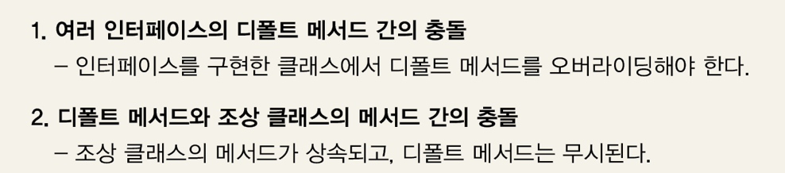


