[자바의 정석](http://www.yes24.com/Product/Goods/24259565?OzSrank=2)을 바탕으로 정리한 자료입니다.


# 목차

- [애노테이션 (Annotation)](#애노테이션-annotation)
  * [1. 애노테이션이란?](#1-애노테이션이란)
  * [2. 표준 애노테이션](#2-표준-애노테이션)
  * [3. 메타 애노테이션](#3-메타-애노테이션)
    + [3-1. @Target](#3-1-target)
    + [3-2. @Retention](#3-2-retention)
    + [3-3. @Documented](#3-3-documented)
    + [3-4. @Inherited](#3-4-inherited)
    + [3-5. @Repeatable](#3-5-repeatable)
    + [3-6. @Native](#3-6-native)
  * [4. 애노테이션 타입 정의하기](#4-애노테이션-타입-정의하기)
    + [4-1. 애너테이션의 요소](#4-1-애노테이션-타입-정의하기)
    + [4-2. 애너테이션 요소의 기본 값](#4-2-애노테이션-요소의-기본-값)
  * [5. 애노테이션 원리](#5-애노테이션-원리)
    + [5-1. 모든 애노테이션의 조상](#5-1-모든-애노테이션의-조상)
    + [5-2. 애노테이션의 정보는 리플렉션을 통해서 구한다.](#5-2-애노테이션의-정보는-리플렉션을-통해서-구한다)


# 애노테이션 (Annotation)

> 사전적 의미
>
> * 주석, 메모


## 1. 애노테이션이란?

* 애노테이션이란?
  * JDK 1.5부터 도입
  * 클래스나 메서드 위에 붙여 사용
  * 소스코드에 메타코드(추가정보)를 주는 것
* 활용
  * JDK에서 기본적으로 제공하는 것과 다른 프로그램에서 제공하는 것이 있다.
  * `@Test`는 JUnit에서 제공
  * 스프링에서는 `@Component`에 사용된다.
  * `Getter`와 `Setter` 메서드의 자동생성을 위해 `lombok`이라는 라이브러리를 많이 사용하는데, 이 라이브러리에서 `Getter/Setter` 애노테이션 구현을 확인 가능
* 사용자 정의 가능 (커스텀 애노테이션)


## 2. 표준 애노테이션

* 표준 애노테이션이란?
  * 자바에서 기본적으로 제공하는 애노테이션
  * ***보통 컴파일러가 사용한다.***
  * 메타 애노테이션을 포함

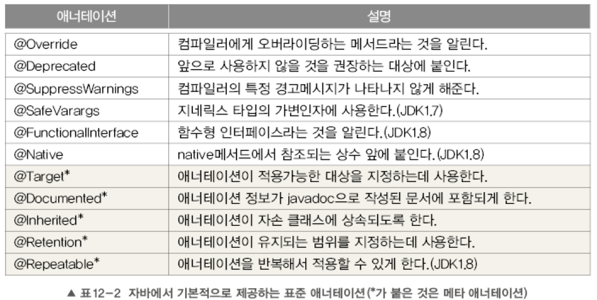


## 3. 메타 애노테이션

* 메타 애노테이션이란?
  * **애노테이션 정의와 실행을 위한 애노테이션**
  * 메타 애노테이션 : **"애노테이션을 위한 애너테이션"**
  * `java.lang.annotation` 패키지에 포함되어 있다.


### 3-1. @Target

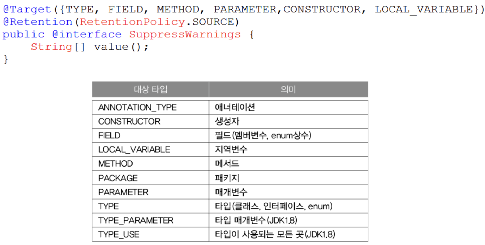

* `@Target`이란?
  * 애너테이션이 적용할 수 있는 대상을 `@Target`으로 지정한다.
  * 여러 개의 값을 지정할 때는 배열에서처럼 `{}`괄호를 사용한다.


### 3-2. @Retention

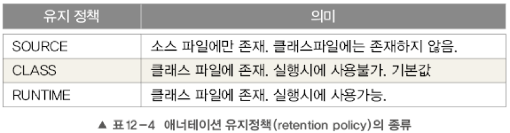

* `@Retention`이란?
  * **애너테이션이 유지(Retention)되는 기간을 지정하는데 사용**
  * 컴파일러에 의해 사용되는 애너테이션의 유지 정책은 `SOURCE`이다.
    * 컴파일을 하고나면 클래스파일에는 존재하지 않는다.
  * 실행시에 사용가능한 애너테이션의 정책은 `RUNTIME`이다.
    * Reflection API를 사용해서 여러가지 기능을 수행하게 할 수 있다. (스프링)


### 3-3. @Documented

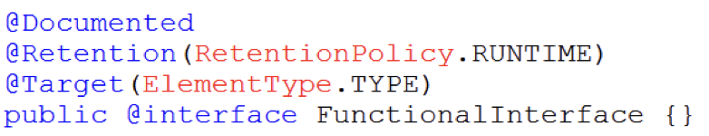

* `@Documented`란?
  * 애너테이션에 대한 정보가 `javadoc`으로 작성한 문서에 포함되도록 한다.


### 3-4. @Inherited

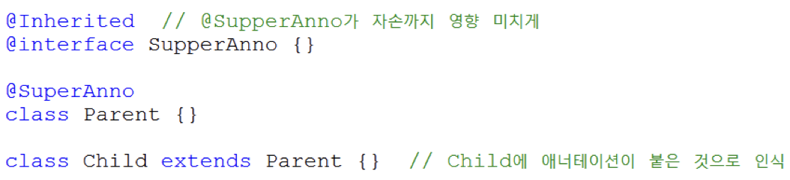

* `@Inherited`란?
  * 애너테이션이 하위 클래스에 상속되도록 한다.
  * **`@Inherited`가 붙은 애너테이션을 상위 클래스에 붙이면, 하위 클래스도 이 애너테이션이 붙은 것과 같이 인식된다.**


### 3-5. @Repeatable

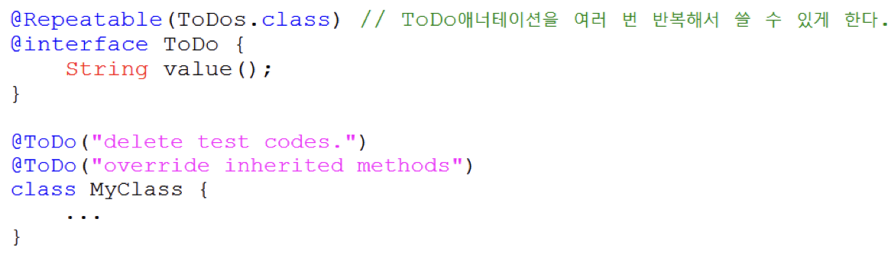

* `@Repeatable`이란?
  * 반복해서 붙일 수 있는 애너테이션을 정의할 때 사용한다.
  * `@Repeatable`이 붙은 애노테이션은 반복해서 붙일 수 있다.


### 3-6. @Native

* `@Native`란?
  * `native`메서드에 의해 참조되는 상수에 붙이는 애노테이션


## 4. 애노테이션 타입 정의하기

사용자가 직접 애노테이션을 만들어 사용할 수 있다.

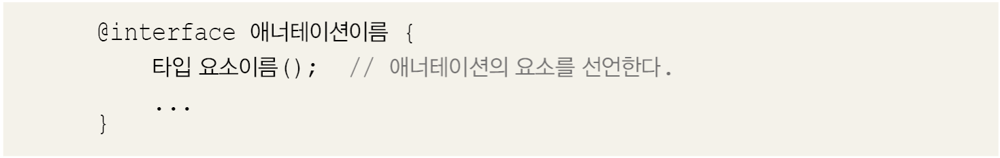

* 애너테이션의 타입 정의
  * 위와 같이 애너테이션을 직접 만들어 쓸 수 있다.


### 4-1. 애노테이션의 요소

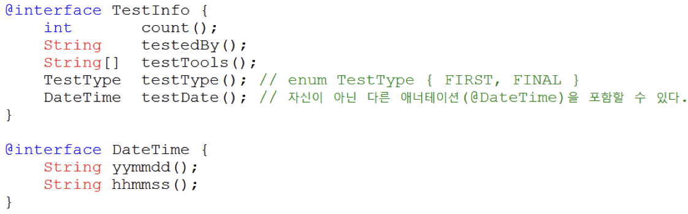

* 요소

  * 애노테이션 내에 **선언된 메서드를 "애노테이션의 요소"**라고 한다.

  * 애노테이션의 요소는 반환값이 있고 매개변수는 없는 ***추상 메서드의 형태***를 가지며, 상속을 통해 구현하지 않아도 된다.

  * ***애노테이션을 적용할 때 이 요소들의 값을 빠짐없이 지정해주어야 한다.***

  * ```java
    @TestInfo(
    		count = 3,
     		testedBy = "kim",
      	testTools = {"JUnit", "AutoTester"},
      	testType = TestType.FIRST,
      	testDate = @DateTime(yymmdd="160101", hhmmss="235959")
    )
    public class NewClass {...}
    ```

* 애노테이션 요소의 규칙
  * 요소의 타입은 기본형, String, enum, 애너테이션, Class만 허용된다.
  * ()안에 매개변수를 선언할 수 없다.
  * 예외를 선언할 수 없다.
  * 요소를 타입 매개변수로 정의할 수 없다.


> 애노테이션에서 멤버와 같은 역할을 하는 변수를 왜 메서드로 선언해주는가?
>
> * 


### 4-2. 애노테이션 요소의 기본 값

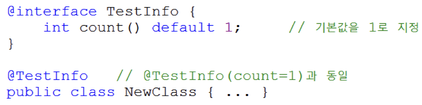

* **적용시 값을 지정하지 않으면, 사용될 수 있는 기본갑 지정이 가능하다.**
  * `default`

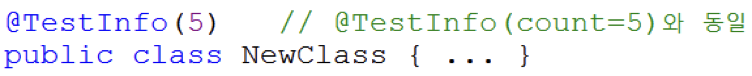

* 요소가 하나일 때는 요소의 이름 생략가능


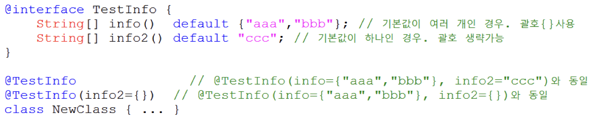

* 요소의 타입이 배열인 경우, 괄호`{}`를 사용해야 한다.


## 5. 애노테이션 원리

애노테이션은 어떠한 원리로 사용할 수 있는 것인가?


### 5-1. 모든 애노테이션의 조상

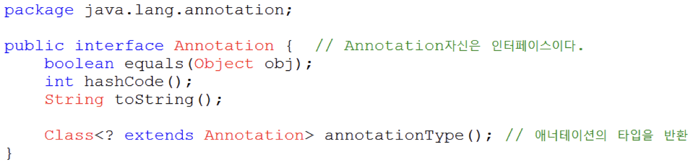

* **모든 애노테이션의 조상은 `Annotation`이라는 인터페이스이다.**
  * `Annotation`은 애너테이션이 아니라 **일반적인 인터페이스로 정의**되어 있다.
  * 애노테이션은 특별한 종류의 인터페이스이며, 앞에 `@`를 붙여줌으로써 구분한다.


```java
@Retention(value = RetentionPolicy.RUNTIME)
@Target(value = ElementType.METHOD)
public @interface myAnnotation {
  public String name();
}
```

위 애노테이션을 컴파일하면 아래와 같이 나온다.

```java
public interface annotation.myAnnotation extends java.lang.annotation.Annotation {
  public abstract java.lang.String name();
}
```

* **어떠한 애노테이션이든 `Annotation`인터페이스를 상속받으므로, 따로 다른 인터페이스를 상속받지 못한다.**


### 5-2. 애노테이션의 정보는 리플렉션을 통해서 구한다.

```java
// myAnnotation (애너테이션)
@Retention(RetentionPolicy.RUNTIME) // 실행시 사용가능하도록 설정
public @interface myAnnotation {
    int count() default 1;
    String testedBy();
    String[] testTools() default "JUnit";
    TestType testType() default TestType.FIRST;
    DateTime testDate();
}

enum TestType {FIRST, FINAL}

// DateTime (애너테이션)
@Retention(RetentionPolicy.RUNTIME)
public @interface DateTime {
    String yymmdd();
    String hhmmss();
}

@Deprecated
@SuppressWarnings("1111") // 유효하지 않은 애너테이션은 무시된다.
@myAnnotation(testedBy = "kim", testDate = @DateTime(yymmdd = "200819", hhmmss = "235959"))
public class Main {

    public static void main(String[] args) throws IOException {
        // Main의 Class 객체를 얻는다.

        Class<Main> mainClass = Main.class;

        myAnnotation myAnnotation = (myAnnotation)mainClass.getAnnotation(com.algorithm.myAnnotation.class);
        System.out.println("testBy : "+myAnnotation.testedBy());
        System.out.println("testDate.yymmdd : " + myAnnotation.testDate().yymmdd());
        System.out.println("testDate.hhmmss : " + myAnnotation.testDate().hhmmss());
        for(String str : myAnnotation.testTools()){
            System.out.println("testTools : "+str);
        }
        System.out.println();

        // Main에 적용된 모든 애너테이션을 가져온다.
        Annotation[] annoArr = mainClass.getAnnotations();
        for(Annotation a : annoArr){
            System.out.println(a);
        }
    }
}

// 결과
testBy : kim
testDate.yymmdd : 200819
testDate.hhmmss : 235959
testTools : JUnit

@java.lang.Deprecated(forRemoval=false, since="")
@com.algorithm.myAnnotation(count=1, testType=FIRST, testTools={"JUnit"}, testedBy="kim", testDate=@com.algorithm.DateTime(yymmdd="200819", hhmmss="235959"))
```

* 해석
  * 애노테이션을 선언하고, `Main`클래스에 애노테이션을 적용하였다.
  * 그리고 `Main`클래스에서 애노테이션을 불러와 출력하였다.
* 중요한 점
  * 리플렉션 API를 통해서 애노테이션의 정보에 접근할 수 있다.
  * 클래스 객체에 애니테이션 정보도 포함되어 있다는 것을 의미한다.
