[자바의 정석](http://www.yes24.com/Product/Goods/24259565?OzSrank=2)을 바탕으로 정리한 자료입니다.


# 목차

- [람다 (lambda)](#람다-lambda)
  * [1. 함수형 프로그래밍](#1-함수형-프로그래밍)
    + [1-1. 람다 대수](#1-1-람다-대수)
      - [람다 대수의 표현](#람다-대수의-표현)
      - [명령형 프로그래밍과의 비교](#명령형-프로그래밍과의-비교)
    + [1-2. Currying (추상화)](#1-2-currying-추상화)
    + [1-3. 부수 효과와 순수함수](#1-3-부수-효과와-순수함수)
      - [부수 효과](#부수-효과)
      - [순수함수](#순수함수)
    + [1-4. 1급 객체](#1-4-1급-객체)
    + [1-5. 고차함수](#1-5-고차함수)
    + [결론](#결론)
  * [2. 자바의 람다식](#2-자바의-람다식)
    + [2-1. 람다식이란?](#2-1-람다식이란)
    + [2-2. 람다식 작성하기](#2-2-람다식-작성하기)
  * [3. 함수형 인터페이스](#3-함수형-인터페이스)
    + [3-1. 함수형 인터페이스란?](#3-1-함수형-인터페이스란)
    + [3-2. @FunctionalInterface](#3-2-functionalinterface)
    + [3-3. 람다식의 활용](#3-3-람다식의-활용)
    + [3-4. 매개변수와 반환타입](#3-4-매개변수와-반환타입)
      - [매개변수](#매개변수)
      - [반환타입](#반환타입)
      - [예제](#예제)
    + [3-5. 람다식의 타입과 형변환](#3-5-람다식의-타입과-형변환)
  * [4. java.util.function패키지](#4-javautilfunction패키지)
    + [4-1. 기본형 함수형 Interface](#4-1-기본형-함수형-interface)
      - [4-1-1. Supplier](#4-1-1-supplier)
      - [4-1-2. Consumer](#4-1-2-consumer)
      - [4-1-3. Function](#4-1-3-function)
    + [4-2. 매개변수가 2개인 함수형 인터페이스](#4-2-매개변수가-2개인-함수형-인터페이스)
    + [4-3. UnaryOperator와 BinaryOperator](#4-3-unaryoperator와-binaryoperator)
    + [4-4. 컬렉션 프레임워크와 함수형 인터페이스](#4-4-컬렉션-프레임워크와-함수형-인터페이스)
    + [4-5. Function의 합성](#4-5-function의-합성)
      - [4-5-1. andThen()](#4-5-1-andthen)
      - [4-5-2. compose()](#4-5-2-compose)
    + [4-6. Predicate의 결합](#4-6-predicate의-결합)
    + [4-7. 메서드 참조](#4-7-메서드-참조)


# 람다 (lambda)

> 참고
>
> * https://www.slideshare.net/HyungHoKo/pure-function-and-honest-design
> * https://www.slideshare.net/kazuyapsh/design-pattern-in-functional-language
> * https://www.sangkon.com/haskell-study-part02/
> * [https://medium.com/korbit-engineering/%ED%95%A8%EC%88%98%ED%98%95-%ED%94%84%EB%A1%9C%EA%B7%B8%EB%9E%98%EB%B0%8D%EC%9D%B4%EB%9E%80-e7f7b052411f](https://medium.com/korbit-engineering/함수형-프로그래밍이란-e7f7b052411f)
> * [https://medium.com/@lazysoul/%ED%95%A8%EC%88%98%ED%98%95-%ED%94%84%EB%A1%9C%EA%B7%B8%EB%9E%98%EB%B0%8D%EC%9D%B4%EB%9E%80-d881230f2a5e](https://medium.com/@lazysoul/함수형-프로그래밍이란-d881230f2a5e)
> * https://www.youtube.com/watch?v=jVG5jvOzu9Y&t=245s
> * [https://velog.io/@kyusung/%ED%95%A8%EC%88%98%ED%98%95-%ED%94%84%EB%A1%9C%EA%B7%B8%EB%9E%98%EB%B0%8D-%EC%9A%94%EC%95%BD](https://velog.io/@kyusung/함수형-프로그래밍-요약)


람다식은 수학자 알론도 처지(Alonzo Church)가 1930년대에 발표한 추론 또는 계산법에서 사용된 식으로, 이를 제자 존 매카시(John Macarthy)가 프로그래밍 언어에 도입하였다.

Java에서는 JDK 1.8부터 람다식을 지원하게 되었다.

람다식을 보다 자세하고 쉽게 이해하기 위해서는 람다식의 근원인 **람다대수**와 **함수형 프로그래밍**에 대해서 알아야 한다.


## 1. 함수형 프로그래밍

함수형 프로그래밍은 자료 처리를 수학적 함수의 계산으로 취급하고 상태와 가변 데이터를 멀리하는 프로그래밍 패러다임의 하나이다.

명령형 프로그래밍에서는 상태를 바꾸는 것을 강조하는 것과 달리, 함수형 프로그래밍은 함수의 응용을 강조한다.


### 1-1. 람다 대수

> 사전적 의미
>
> * 람다 대수 (λ-대수)는 ***추상화***와 함수 적용 등의 논리 연산을 다루는 형식 체계이다.
> * 람다 대수의 항은 변수와 추상화 및 적용 연산을 통해 구성되며, **추상화의 기호로는 그리스 문자 λ(람다)**가 사용된다.


#### 람다 대수의 표현

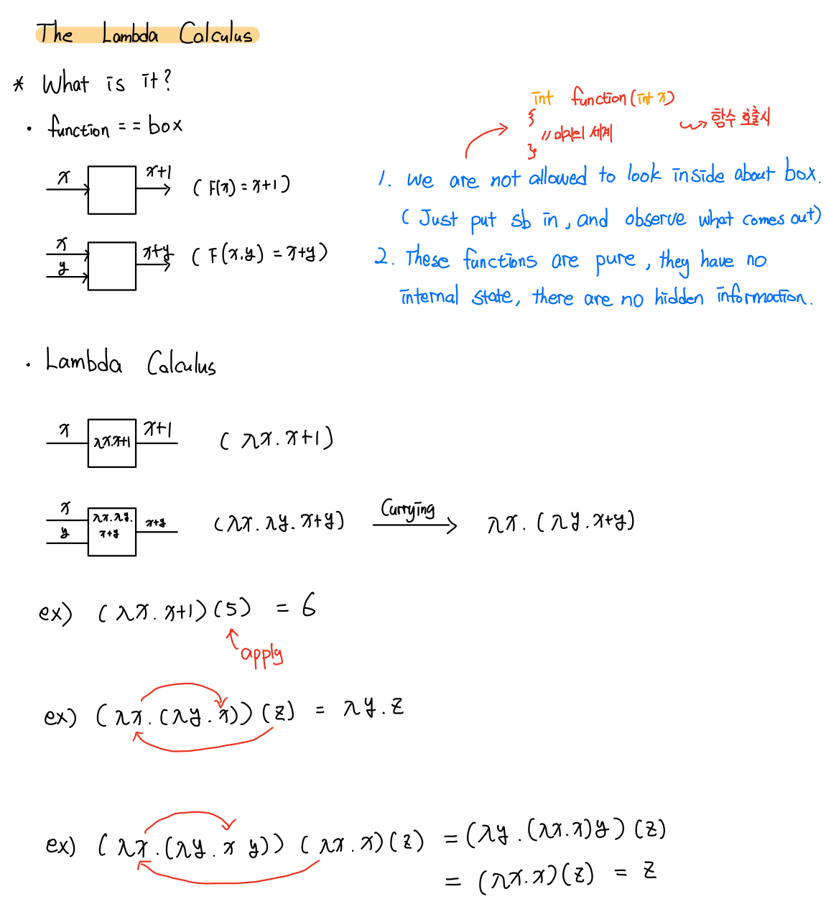

* 기존의 함수는 집합 X의 각 원소에 집합 Y의 원소가 오직 하나만 대응 될 때, 이 대응관계를 x에서 y로의 함수라고 하였다.
  * y = f(x)

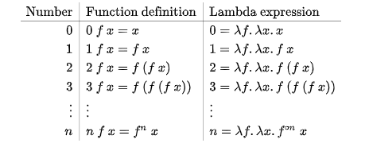


#### 명령형 프로그래밍과의 비교


*  **함수형 프로그래밍은 계산을 수학적 함수의 조합으로 생각하는 방식을 말한다**.
* 이것을 일반적인 프로그래밍 언어에서 함수가 특정 동작을 수행하는 역할을 담당하는 것과는 반대되는 개념으로, 함수를 수행해도 함수외부의 값이 변경될 수 없다.


---

### 1-2. Currying (추상화)

람다 대수에서는 '추상화'를 구현하기 위해 currying 기법을 사용한다.

currying이란 여러 인자를 받는 함수를 인자 하나씩 사용하여 함수 순서를 실행할 수 있도록 변환하는 것을 말한다.

```javascript
function basic(x, y){
  return x+y
}

basic(5, 3) // -> 8

function curry(x) {
  return function(y){
    return x+y
  }
}
curry(5)(3) // -> 8
```

* abstaraction (추상화)
  * currying can delay parts of a function to be called later


> 한마디로, currying을 사용하면 추상화가 가능하다.
>
> 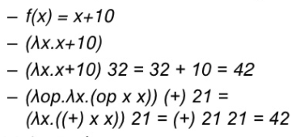


---

### 1-3. 부수 효과와 순수함수


#### 부수 효과

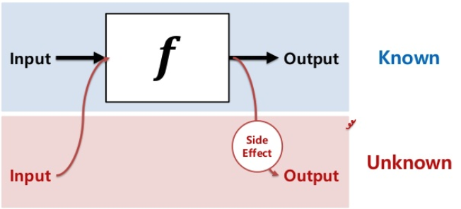

일반적인 함수 `f(x) = y`는 `x`를 입력하면 항상 `y`라는 결과값이 나온다. 

여기서 중요한 점은 함수 안에서 상태를 관리하고 상태에 따라서 결과값이 다르게 나올 수도 있다.

이를 부수효과(SideEffect)라고 한다.

함수형 프로그래밍은 부수효과를 배제한 독립적인 순수함수를 지향한다.

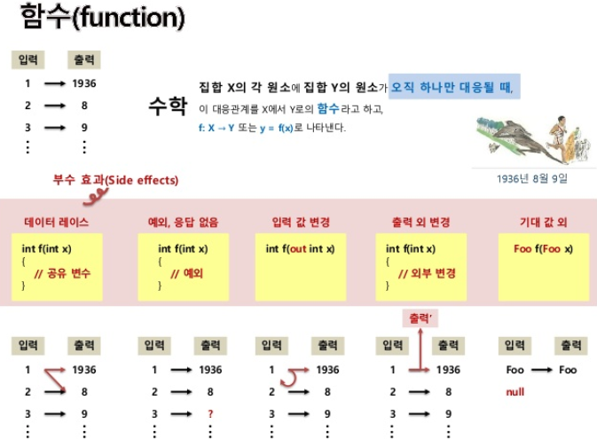

* 공유 변수나 예외 상황등의 여러 요인으로 인해서 기존의 함수는 프로그래밍 환경에서 부수 효과가 발생할 수 있다.

```javascript
// pure function (no sideeffect)
const double = num => (num*2);

// impure function
const operand = 2;
const multiple = num => (num * operand);
```

> 부수효과(SideEffect)가 없는 함수를 순수한 함수(pure function)이라고 한다.
>
> * 순수 함수는 외부와 배제되고 항상 일정한 값을 반환하기 때문에 안정적이고 예측가능한 프로그램을 짜는 것을 도와준다.


#### 순수함수

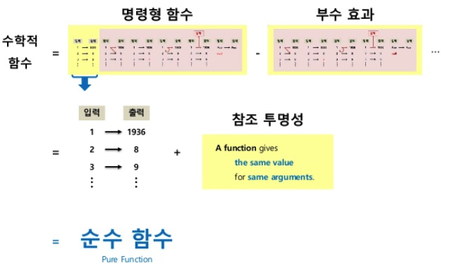


---

### 1-4. 1급 객체

> 함수형 언어에서는 모든 것이 객체이다.
>
> * 함수 역시 객체이다.

* 1급 객체란 다음과 같은 조건을 만족하는 객체 ( 1급 시민의 조건이기도 하다. )
  * 변수나 데이터 구조안에 담을 수 있다. (함수를 변수취급)
  * 파라미터로 전달 할 수 있다.
  * 반환값(return value)으로 사용할 수 있다.
  * 할당에 사용된 이름과 관계없이 고유한 구별이 가능하다.
  * 동적으로 프로퍼티 할당이 가능하다.

> JS에서 함수(function)은 객체(Object)이므로 `1급 함수`로 불린다.

```javascript
// 일반적인 함수의 표현
function sayHello() {
  alert("Hello World!");
}
sayHello();

// 함수를 1급 객체로 표현 (객체에도 함수를 담을 수 있다.)
var a = function sayHello(){
  alert("Hello World");
}

function sayHello(b){
  b()
}

sayHello(a);
```


> 내 생각에는 함수형 프로그래밍에서 함수는 `순수 함수`의 특성으로 인해 부수 효과가 없으므로, 일정한 값을 넣으면 일정한 값이 나온다. 
>
> 즉, **일정한 값이 나오므로 함수를 값으로 생각할 수 있는 것.**


---

### 1-5. 고차함수

고차함수는 아래와 같은 특징을 가진 함수다.

* 다른 함수를 인자로 사용할 수 있다.
* 함수를 반환하는 함수.
* 활용
  * 콜백 함수, 프로미스, 모나드 등을 사용하여, 동작과 효과 또는 비동기 흐름 제어를 추상화하거나 격리한다.
  * 다양한 데이터 유형에 대해 작동할 수 있는 유틸리티를 생성한다.
  * currying을 가능하게 한다.
* 대표적인 고차함수
  * `filter`
  * `map`


> 예제

```javascript
const isEven = x => !(x % 2);

const numbers = [1, 2, 3, 4, 5, 6, 7, 8, 9, 10];
const evenNumbers = numbers.filter(isEven); // 함수안에 함수

console.log(evenNumbers); // 2, 4, 6, 8, 10
```

* `isEven`은 배열을 처리하는 로직이 필요 없으며, 배열을 순환하면서 재사용된다.


---

### 결론

**함수형 프로그래밍은 순수 함수(pure function) 를 조합하고 공유 상태(shared state), 변경 가능한 데이터(mutable data) 및 부작용(side-effects) 을 피하여 소프트웨어를 만드는 프로세스다. 함수형 프로그래밍은 명령형(imperative) 이 아닌 선언형(declarative) 이며 애플리케이션의 상태는 순수 함수를 통해 전달된다**

* Immutability
* Pure Function
* First-Class Function
* Closure : 고차함수 프로그래밍적으로 만든 개념


## 2. 자바의 람다식

자바는 JDK1.8부터 람다식을 지원하기 시작하였다.

람다식의 도입으로 인해, 자바는 객체지향언어인 동시에 함수형 언어가 되었다.


### 2-1. 람다식이란?

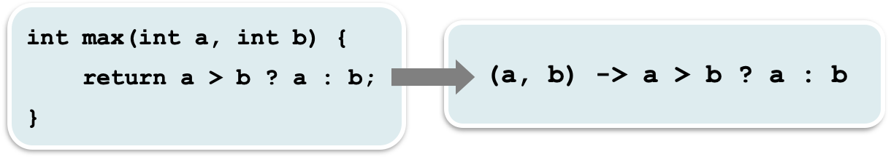

* 람다식은 메서드(함수)를 하나의 '***식(expression)***'으로 표현한 것이다.
  * 람다식은 함수를 간략하면서도 명확한 식으로 표현할 수 있게 해준다.

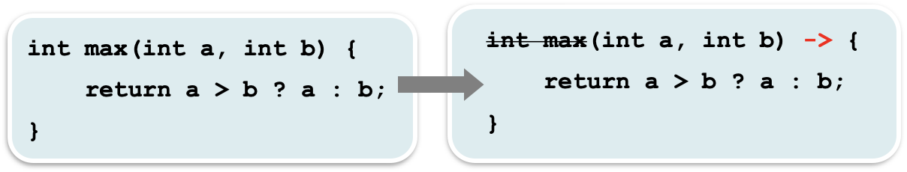

* 메서드를 람다식으로 표현하면 메서드의 이름과 반환값이 없어지므로, 람다식을 '***익명 함수***'이라고도 한다.
* ***1급 객체***
  * 람다식은 메서드의 매개변수로 전달되어지는 것이 가능하고, 메서드의 결과로 반환될 수도 있다.
  * 람다식으로 인해 메서드를 변수처럼 다루는 것이 가능해진 것이다.


> ***함수와 메서드의 차이***
>
> * 근본적으로 동일. 함수는 일반적 용어, 메서드는 객체지향개념 용어
>   * 함수는 클래스에 독립적
>     * 함수(람다식)는 이 모든 과정없이 오직 함수(람다식) 자체만으로도 이 메서드의 역할을 수행할 수 있다.
>   * 메서드는 클래스에 종속적
>     * 모든 메서드는 클래스에 포함되어야하므로 클래스도 새로 만들어야 한다.


### 2-2. 람다식 작성하기


* 메서드의 이름과 반환타입을 제거하고 `->`를 블록{} 앞에 추가한다.

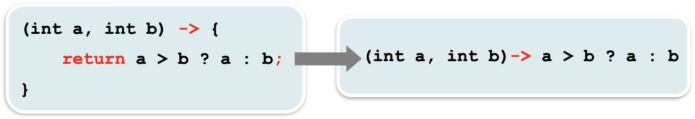

* 반환값이 있는 경우, 식이나 값만 적고 `return`문은 생략 가능하다. (***끝에 `;`안 붙임***)

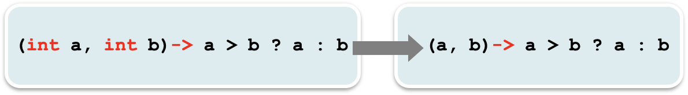

* 매개변수의 타입이 추론 가능하면 생략가능 (대부분의 경우 생략가능)

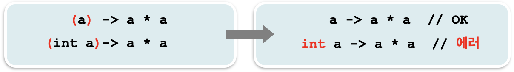

* 매개변수가 하나인 경우, 괄호() 생략가능 (타입이 없을 때만)

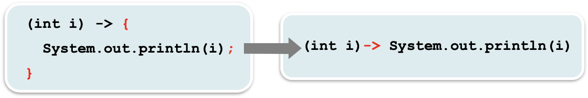

* 블록 안의 문장이 하나뿐 일 때, 괄호{} 생략가능 (끝에 `;`안 붙임)

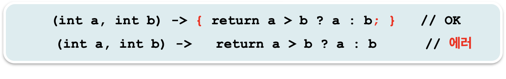

* 단, 하나뿐인 문장이 `return`문이면 괄호{} 생략불가


## 3. 함수형 인터페이스

***람다식을 다루기 위한 인터페이스를 "함수형 인터페이스"라고 한다.***

***자바에서 람다식은 Function Interface의 인스턴스를 생성하는 것과 같다.***


### 3-1. 함수형 인터페이스란?

> 자바에서 ***모든 메서드는 클래스 내에 포함되어야 하는데, 람다식은 어떤 클래스에 포함되는 것일까??***
>
> 람다식은 메서드와 동등한 것처럼 설명해왔지만, 사실 ***람다식은 익명 클래스의 객체와 동등하다***.

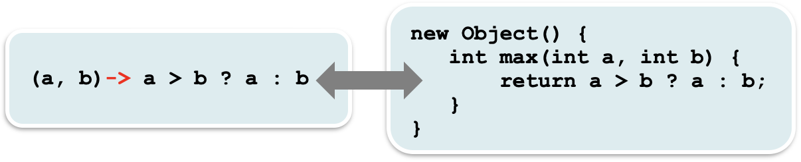

* ***람다식은 익명 객체***
  * `max`는 임의로 붙인 것일 뿐 의미는 없다.

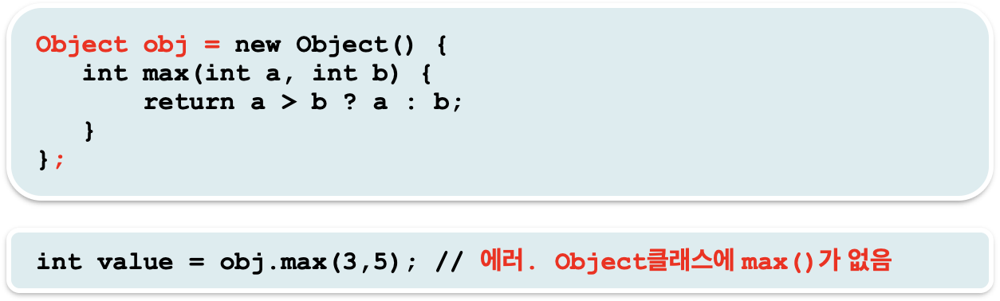

* 참조변수가 있어야 객체의 메서드를 호출 할 수 있다. 그럼 람다식을 의미하는 익명 객체의 주소는 어떻게 저장하는가??
  * 위 그림에서 `obj.max(3,5)`를 호출했는데 `Object`에는 `max`라는 메서드가 없다..
  * 즉, `Object`를 참조 타입으로 사용하면 안된다


* ***그럼 어떤 타입으로 해야하는가?***
  * 참조형이니 `클래스`아니면 `인터페이스`여야 한다.


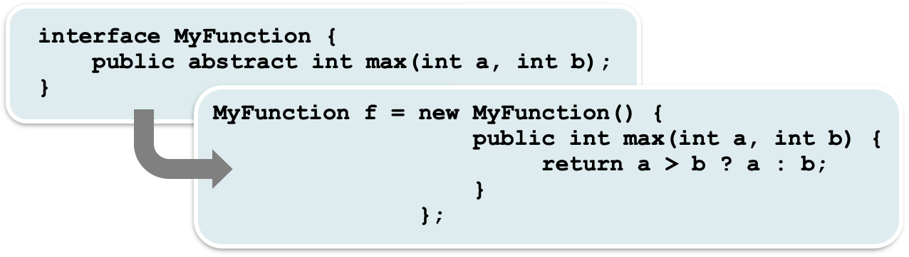

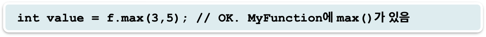

* ***함수형 인터페이스 타입의 참조변수로 람다식을 참조 할 수 있다.***
* ***함수형 인터페이스 - 단 하나의 추상 메서드만 선언된 인터페이스***
  * 람다식과 동등한 메서드가 단 하나 정의되어 있는 인터페이스


```java
interface MyFunction {
    int max (int a, int b);
}

public class Main {

    public static void main(String[] args) throws IOException {
        MyFunction fLambda = (int a, int b) -> a > b ? a : b;

        MyFunction f = new MyFunction() {
            @Override
            public int max(int a, int b) {
                return a > b ? a : b;
            }
        };

        System.out.println(fLambda.max(5, 3));
        System.out.println(f.max(5,3));
    }
}
```

* `fLambda`와 `f`는 같은 의미를 가진다.
  * 이렇게 쓸거면 그냥 안 쓰는게... 오히려 더 복잡해지는 느낌...

> 결론적으로는 람다식도 결국은 익명 객체라는 것이다.


### 3-2. @FunctionalInterface

* ***함수형 인터페이스에는 오직 하나의 추상 메서드만 정의되어 있어야 한다.***
  * 람다식과 인터페이스의 메서드가 1:1로 연결될 수 있기 때문이다.
* ***`@FunctionalInterface`를 붙이면 컴파일러가 함수형 인터페이스를 올바르게 정의하였는지 확인해준다.***


### 3-3. 람다식의 활용

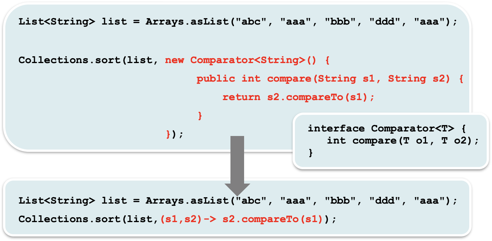

* `Comparator`이 인터페이스이기 때문에, 람다식을 사용해서 익명 객체를 만든 것이다.
  * ***`Comparator`이 인터페이스이며, 익명객체로 구현한다 = 람다식***
* 훨씬 직관적이다.
  * 이럴 때만 사용하는게 좋을거 같다..


### 3-4. 매개변수와 반환타입

> 람다식의 특징중 하나인 1급 객체를 구현하기 위해서 자바가 인터페이스를 사용한 것이기도 한 것 같다.

* 람다식을 참조변수로 다룰 수 있다는 것은 메서드를 통해 람다식을 주고받을 수 있다는 것을 의미한다.
  * 즉, ***1급 객체의 특성에 따라 변수처럼 메서드를 주고받는 것이 가능해진 것이다.***

* ***사실상 메서드가 아니라 객체(인터페이스를 구현한 익명객체)를 주고받는 것이라 근본적으로 달라진 것은 아무것도 없다.***


#### 매개변수

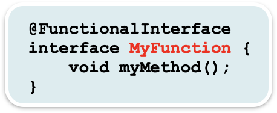

* 함수형 인터페이스 `MyFunction`이 위와 같이 정의되어 있을 때

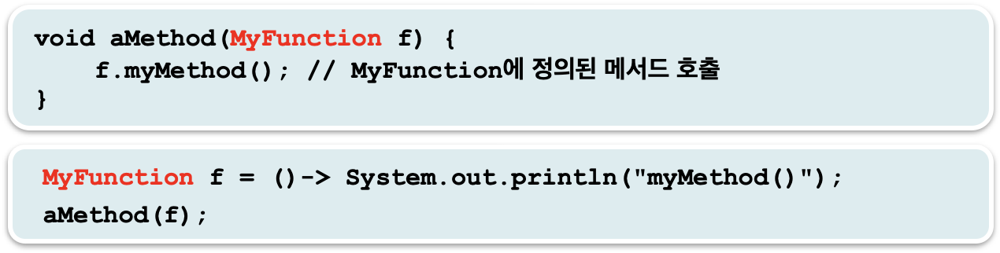

* 메서드의 매개변수가 `MyFunction`타입이면, 이 메서드를 호출할 때 람다식을 참조하는 참조변수를 매개변수로 지정할 수 있다.


* 위와 같이 참조변수 없이 직접 람다식을 매개변수로 지정할 수도 있다.


#### 반환타입

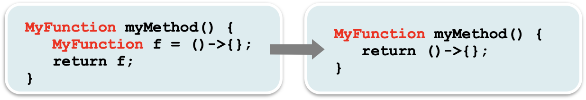

* 메서드의 반환타입이 함수형 인터페이스타입이라면, 이 함수형 인터페이스의 추상 메서드와 동등한 람다식을 가리키는 참조변수를 반환하거나 람다식을 직접 반환할 수 있다.


#### 예제

```java
@FunctionalInterface
interface MyFunction {
  void run();
}

class LambdaTest {
  static void execute(MyFunction f){
    f.run();
  }
  
  static MyFunction getMyFunction(){
    MyFunction f = () -> System.out.println("f3.run()");
    return f;
  }
  
  public static void main(String[] args){
     // 람다식으로 MyFunction의 run() 구현
    MyFunction f1 = () -> System.out.println("f1.run()");
    
    MyFunction f2 = new MyFunction() { // 익명클래스로 run()을 구현
      public void run(){
        System.out.println("f2.run()");
      }
    };
    
    MyFunction f3 = getMyFunction();
    
    f1.run();
    f2.run();
    f3.run();
    
    execute(f1);
    execute(() -> System.out.println("run()"));
  }
}

// 결과
f1.run()
f2.run()
f3.run()
f1.run()
run()
```


---

### 3-5. 람다식의 타입과 형변환

```java
@FunctionalInterface
interface MyFunction {
  void method();
} 

public class Main {
  public static void main(String[] args) {
    MyFunction f = () -> {}; // MyFunction을 구현했을뿐 정확히 어떤 타입인지 모른다. () -> {}
    
    MyFunction f1 = (MyFunction) (()->{}); // 양변의 타입이 다르므로 형변환이 필요.
    
    Object obj = (Object)(()->{}); // 에러. 함수형 인터페이스로만 형변환 가능.
    
    Object obj1 = (Object)(MyFunction)(()->{}); // 함수형 인터페이스로 형변환하고 Object는 가능하다.
      
  }
}
```

* ***함수형 인터페이스를 구현한 람다식은 정확히 어떤 타입인지 모른다.***
  * 익명 객체이므로 정확한 타입을 모르는 것이다.
  * ***물론 함수형 인터페이스 타입과 일치하는 것도 아니다. 그러므로 형변환을 해주면 좋다.***


## 4. java.util.function패키지

JDK 1.8부터는 `java.util.function`패키지에 수많은 `Functional Interface`들이 등록되어 있다.

이 패키지에 등록되어 있는 모든 인터페이스들은 `@FunctionalInterface`로 지정되어 있다. 

> API 문서상의 내용
>
> * This is a functional interface and can therefore be used as the assignment **target for a lambda expression or method reference.**

일반적으로 자주 쓰이는 형식의 메서드를 함수형 인터페이스로 미리 정의해 놓았다. 매번 새로운 함수형 인터페이스를 정의하지 않고 이 패키지의 인터페이스를 활용할 수 있다.


### 4-1. 기본형 함수형 Interface

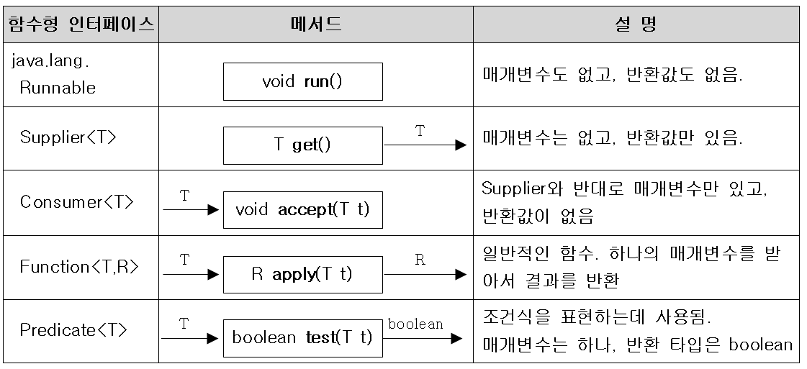

* 위 인터페이스는 `Stream`인터페이스와 결합하여 강력한 기능을 제공한다.
  * `Supplier` : 특정 타입의 데이터를 공급
  * `Consumer` : 어떤 데이터를 소비
  * `Function` : 어떤 기능을 수행
  * `Predicate` : 근거를 확인


#### 4-1-1. Supplier

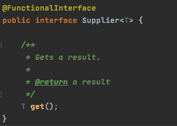

* 매개 변수는 없고, 리턴 값만 있는 인터페이스
  * 이 메서드들을 호출한 곳으로 데이터를 리턴(공급)하는 역할을 수행한다.

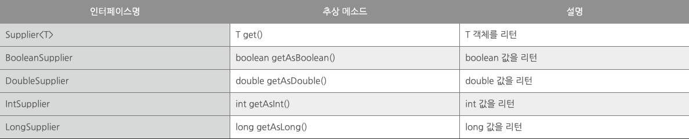

```java
public static void main(String[] args) {
  // 람다식
  Supplier<Integer> intSupplier = () -> {
    return (int) (Math.random() * 6) + 1;
  };
  
  // 함수형 인터페이스를 익명 객체로 구현한 예시 (람다식의 구체적인 구현)
  Supplier<Integer> intSupplier2 = new Supplier<Integer>() {
    @Override
    public Integer get() {
      return (int) (Math.random()*6) + 1;
    }
  };
  
  System.out.println(intSupplier.get());
}

// 결과 - 랜덤 값
```


#### 4-1-2. Consumer

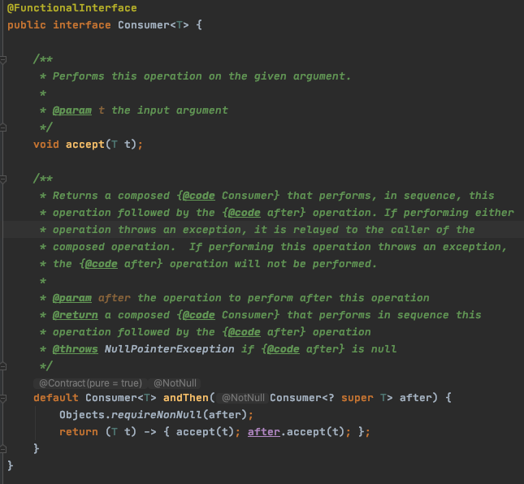

* 매개 변수를 소비하는 역할만 하며, 리턴 값은 없다.
* `andThen` : 디폴트 메서드이며, 여기서는 함수적 인터페이스의 호출 순서만 정한다.

```java
public static void main(String[] args) {
  
  // 람다식
  Consumer<String> consumer = s -> System.out.println(s + "World!");
  consumer.accept("Hello ");
  
  // 람다식을 풀어 쓴 익명 객체
  Consumer<String> consumer1 = new Consumer<String>() {
    @Override
    public void accept(String s) {
      System.out.println(s + "World!");
    }
  };
  consumer.accept("Hello ");
  consumer1.accept("Hello ");
}

// 결과값
Hello World
Hello World
```

```java
public static void main(String[] args){
  Consumer<String> consumer = s -> System.out.println(s + "World!");
  Consumer<String> consumer1 = s -> System.out.println(s + "JAVA!");
  consumer.andThen(consumer1).accept("Hello "); 
}

// 결과값
Hello World!
Hello JAVA!
```


#### 4-1-3. Function

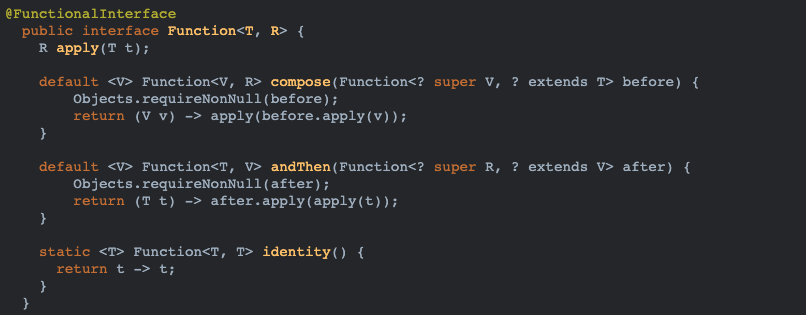

* 매개 변수와 리턴 값이 있는 인터페이스.
  * 인터페이스 명칭에서 알 수 있듯이 전형적인 함수를 지원한다고 보면 된다.

```java
public static void main(String[] args){
  // 람다식
  Function<String, Integer> f = str -> Integer.parseInt(str);
  
  // 람다식을 풀어 쓴 익명 객체
  Function<String, Integer> f1 = new Function<String, Integer>() {
    @Override
    public Integer apply(String s) {
      return Integer.parseInt(s);
    }
  };

  String[] input = {"1", "3", "5", "8"};
  for(int i = 0; i < input.length; i++){
    System.out.print(f.apply(input[i])+" ");
  }
}

// 결과 값
1 3 5 8
```


### 4-2. 매개변수가 2개인 함수형 인터페이스

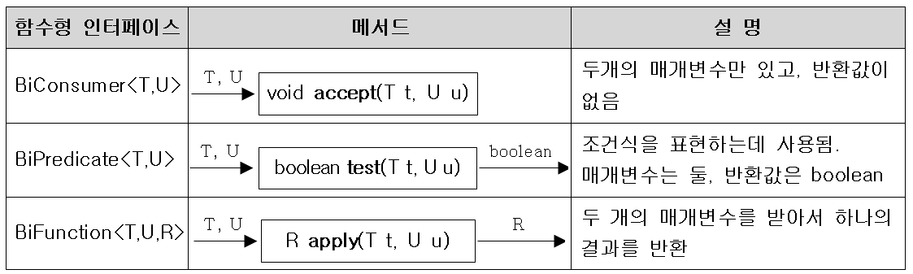

* 매개변수 2개 받도록 되어 있는 인터페이스


> 매개변수가 2개 이상이라면?
>
> * 직접 만들어서 써야한다
>
> ```java
> @FunctionalInterface
> interface TriFunction<T, U, V, R> {
>   R apply(T t, U u, V v);
> }
> ```


### 4-3. UnaryOperator와 BinaryOperator

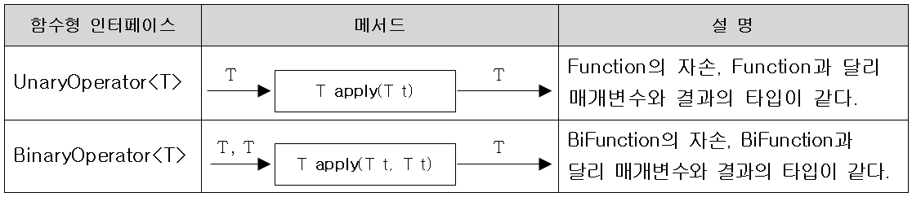

* 매개변수의 타입과 반환타입이 일치하는 함수형 인터페이스

```java
@FunctionalInteface
public interface UnaryOperator<T> extends Function<T, T> {
  static <T> UnaryOperator<T> identity() {
    return t -> t;
  }
}
```


### 4-4. 컬렉션 프레임워크와 함수형 인터페이스

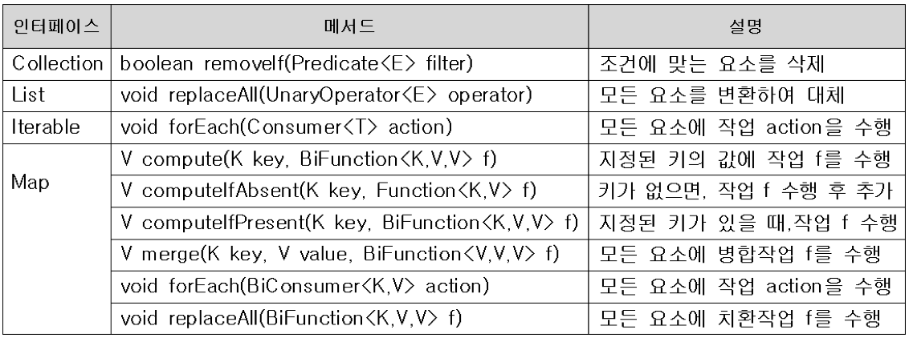

* 함수형 인터페이스를 사용하는 컬렉션 프레임워크의 메서드

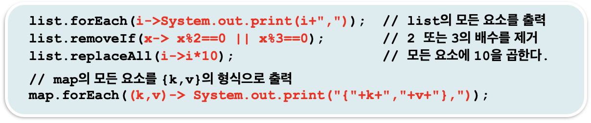


### 4-5. Function의 합성

Function인터페이스를 합성해서 사용할 수 있게 해주는 디폴트 메서드이다.

> JDK1.8부터 인터페이스에 디폴트 메서드를 사용하게 된 이유가 이것 때문인가???


#### 4-5-1. andThen()

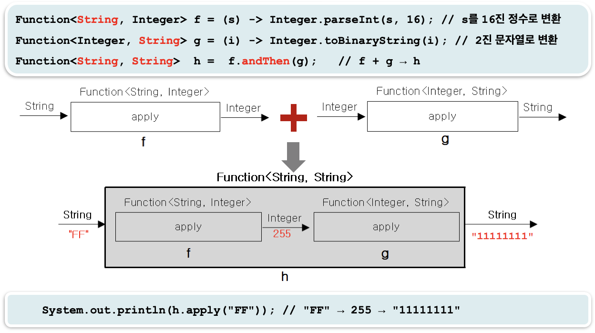


#### 4-5-2. compose()

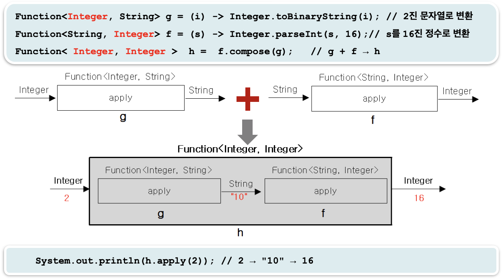


> * 인터페이스A.compose(인터페이스B);
>   * B실행 -> A실행
> * 인터페이스A.andThen(인터페이스B);
>   * A실행 -> B실행


### 4-6. Predicate의 결합

`Predicate`는 `Function`과 같은 역할을 하지만 반환 값이 `boolean`이다.

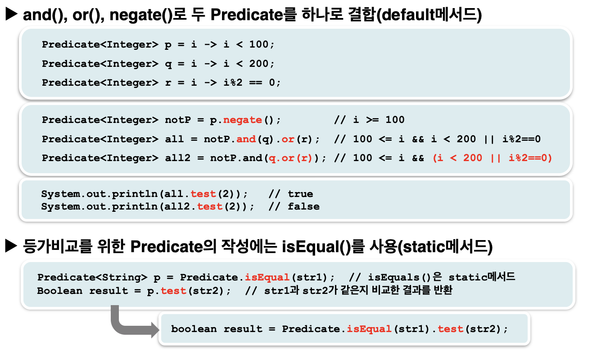


### 4-7. 메서드 참조

람다식을 더 간결하게 하는 방법이며 항상 가능한 것은 아니고 람다식이 하나의 메서드만 호출하는 경우에는 메서드 참조라는 방법으로 람다식을 간략히 할 수 있다.


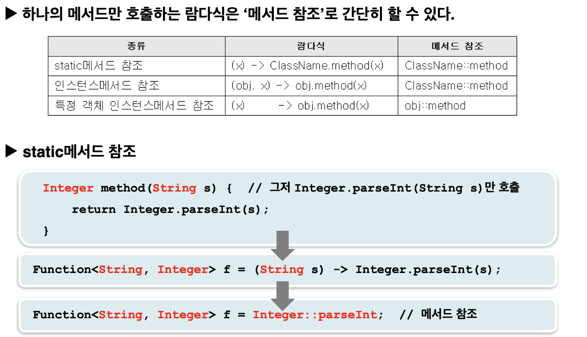


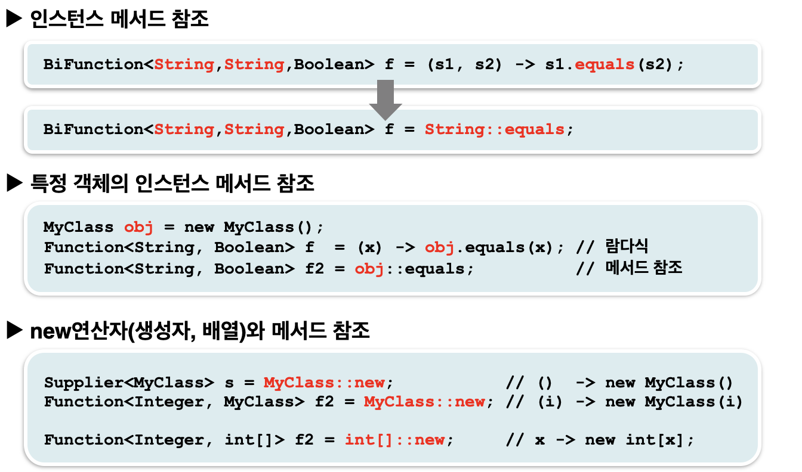

