[자바의 정석](http://www.yes24.com/Product/Goods/24259565?OzSrank=2)을 바탕으로 정리한 자료입니다.


# 목차

- [스레드 (Thread)](#스레드-thread)
  * [1. 프로세스 스레드](#1-프로세스-스레드)
    + [1-1. Program과 Process](#1-1-program과-process)
    + [1-2. 메모리계층구조](#1-2-메모리계층구조)
    + [1-3. Process](#1-3-process)
      - [CPU가 프로세스를 처리하는 방법 = 병행](#cpu가-프로세스를-처리하는-방법--병행)
      - [컨텍스트 스위칭](#컨텍스트-스위칭)
    + [1-4. 동기 비동기 블록 논블록](#1-4-동기-비동기-블록-논-블록)
      - [1-4-1-. Blocking / Non-Blocking](#1-4-1--blocking--non-blocking)
      - [1-4-2. Synchronous / Asynchronous](#1-4-2-synchronous---asynchronous)
      - [1-4-3. 동기/비동기 블록/논블록](#1-4-3-동기비동기-블록논블록)
        * [Sync-Blocking](#sync-blocking)
        * [Async-NonBlocking](#async-nonblocking)
        * [Sync-NonBlocking](#sync-nonblocking)
        * [Async-Blocking](#async-blocking)
  * [2. 스레드의 구현과 실행](#2-스레드의-구현과-실행)
    + [2-1. Thread클래스](#2-1-thread클래스)
    + [2-2. Runnable인터페이스](#2-2-runnable인터페이스)
    + [2-3. start()와 run()](#2-3-start와-run)
  * [3. 싱글스레드와 멀티스레드](#3-싱글스레드와-멀티스레드)
    + [3-1. 싱글스레드와 멀티스레드](#3-1-싱글스레드와-멀티스레드)
    + [3-2. 프로세스 관점에서의 스레드](#3-2-프로세스-관점에서의-스레드)
      - [3-2-1. Thread의 출현 배경](#3-2-1-thread의-출현-배경)
      - [3-2-2. 프로세스와 스레드의 관계](#3-2-2-프로세스와-스레드의-관계)
    + [3-3. 메모리 관점에서의 스레드](#3-3-메모리-관점에서의-스레드)
    + [3-4. 병행과 병렬](#3-4-병행과-병렬)
      - [3-4-1. 병행과 병렬의 차이](#3-4-1-병행과-병렬의-차이)
      - [3-4-2. 스레드의 개수가 2배면 처리량도 2배일까?](#3-4-2-스레드의-개수가-2배면-처리량도-2배일까)
      - [3-4-3. 병행과 병렬 예제](#3-4-3-병행과-병렬-예제)
      - [3-4-4. Blocking](#3-4-4-blocking)
  * [4. 스레드 우선순위](#4-스레드-우선순위)
  * [5. 스레드 그룹](#5-스레드-그룹)
  * [6. 데몬 스레드](#6-데몬-스레드)
    + [6-1. 스레드의 종류](#6-1-스레드의-종류)
    + [6-2. 자바 메인 스레드](#6-2-자바-메인-스레드)
    + [6-3. 데몬스레드 예제](#6-3-데몬스레드-예제)
  * [7. 스레드의 실행제어](#7-스레드의-실행제어)
    + [7-1. 스레드 생명주기](#7-1-스레드-생명주기)
    + [7-2. 스레드 실행제어](#7-2-스레드-실행제어)
      - [7-2-1. sleep(long millis)](#7-2-1-sleeplong-millis)
      - [7-2-2. interrupt()와 interrupted()](#7-2-2-interrupt와-interrupted)
      - [7-2-3. suspend(), resume(), stop()](#7-2-3-suspend-resume-stop)
      - [7-2-3. yield()](#7-2-3-yield)
      - [7-2-4. join()](#7-2-4-join)
      - [7-2-5. sleep(), yield(), join()의 예제](#7-2-5-sleep-yield-join의-예제)
    + [7-3. 스레드 안전한 종료 방법](#7-3-스레드-안전한-종료-방법)
      - [7-3-1. flag](#7-3-1-flag)
      - [7-3-2. interrupt() 사용](#7-3-2-interrupt-사용)
  * [8. 스레드의 동기화](#8-스레드의-동기화)
    + [8-1. 동기화란?](#8-1-동기화란)
    + [8-2. synchronized](#8-2-synchronized)
    + [8-3. wait()과 notify()](#8-3-wait과-notify)
      - [8-3-1. 동기화 제어](#8-3-1-동기화-제어)
      - [8-3-2. 예제](#8-3-2-예제)
    + [8-4. Lock과 Condition을 이용한 동기화](#8-4-lock과-condition을-이용한-동기화)
    + [8-5. volatile](#8-5-volatile)
      - [8-5-1. 원자성](#8-5-1-원자성)
  * [9. 스레드 풀](#9-스레드-풀)


# 스레드 (Thread)


## 1. 프로세스 스레드

프로세스와 스레드에 대해서 정확히 이해하기 위해서는 메모리 계층구조와 Process에 대해서 알아야한다.


### 1-1. Program과 Process

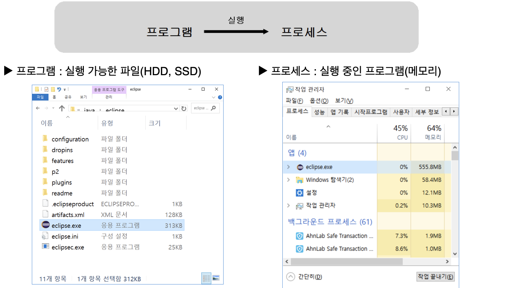

* **보조 기억 장치(HDD, SSD)에 저장되어 있는 프로그램(코드의 모음)을 실행하면 주 기억장치(RAM)에 프로세스를 생성하여 CPU가 실행하는 구조**
  * 보조기억장치(HDD, SSD)
    * CPU가 직접 접근하지 못한다. device controller등을 통해 접근 가능하다.
    * 용량이 크며, 속도가 비교적 느리다.
    * 비휘발성 메모리 (컴퓨터를 꺼도 데이터 유지)
    * 정적인 텍스트 (코드)
  
  * 주기억장치(RAM)
    * CPU가 직접 접근하여 데이터를 사용할 수 있다.
    * 용량이 작으며, 속도가 매우 빠르다.
    * 휘발성 메모리 (컴퓨터를 끄면 데이터 소멸)
    * 동적인 상태 ( 변수등의 값이 바뀐다. )


> 프로그램 : 보조 기억 장치(HDD, SSD)에 저장되어 있는 프로그램(코드의 모음)
>
> 프로세스 : 프로그램이 실행되어 RAM에 적재되어 실행 중인 상태


---

### 1-2. 메모리계층구조

> 컴퓨터에는 왜 메모리가 이렇게 나뉘어져 있는 것일까??
>
> 그냥 보조 기억 장치(HDD, SSD)에 다 때려박으면 될 일 아닌가?
>
> * **지역적 특성**때문이다.


> 우리가 도서관에가서 원하는 여러 권의 책을 제일 빠르게 읽는 방법은?

책장에서 읽고싶은 여러 권의 책을 한번에 내 책상으로 가져와서 읽는게 제일 빠르다.

* 책장 : HDD/SSD ( 여러권의 책들을 저장할 수 있지만, 찾는데 오래 걸린다. )
* 책상 : RAM ( 적은 수의 책들을 저장할 수 있지만, 찾는데 엄청 빠르다. )
* 사람 : CPU


> 컴퓨터도 똑같아. 지역적 특성때문에 메모리의 계층을 나누어놓았다.

CPU의 ALU(연산장치)가 요구하는 피 연산자의 데이터가 만약 하드디스크에 있다면 데이터를 가져오기 위해서 L1캐시부터 하드디스크까지 모든 계층을 거쳐야 하고, 다시 하드디스크에서 L1캐시까지 거쳐서 데이터를 가져오게 된다.


* **캐시 메모리가 필요한 이유**
  * CPU의 성능이 좋아서 연산 속도가 아무리 빨라진다 해도 연산에 필요한 데이터가 CPU의 레지스터로 옮겨지기까지 기다려야한다. **자주 사용하는 데이터를 캐시에 저장하면 CPU가 데이터를 빨리 처리할 수 있게되기 때문**이다.
* Trade - Off
  * 캐시메모리는 속도가 엄청 빠른 대신 용량이 작다.
  * 하드디스크는 속도가 엄청 느린 대신 용량이 크다.


> 결과적으로 속도를 빠르게 하기 위해서 각자의 역할을 하는 메모리가 존재하는 것이다.

> 하드디스크를 HDD에서 SSD로 바꾸면 게임의 로딩 속도가 빨라진다. 
>
> 그 이유는 게임에서의 로딩이 바로 프로그램(HDD/SDD)를 프로세스(SSD)로 바꾸는 과정이기 때문이다.


---

### 1-3. Process

> 이해하고 넘어가야 할 부분
>
> 1. 어떻게 여러 개의 프로세스가 동시에 실행되는가?
>    * 현대의 사람들은 컴퓨터를 이용해서 음악을 들으면서 코딩도 하고 웹서핑도한다. 
>    * 하나의 CPU로 어떻게 동시에 실행할 수 있는거지?
> 2. Process는 RAM에 어떤 식으로 저장되는가?
>    * CPU가 프로세스들을 왔다갔다 실행한다면 프로세스마다 상태를 어떻게 저장하지?
>      * CPU가 A프로세스를 실행하다가 B프로세스를 실행하고 다시 A프로세스를 실행한다면 A프로세스의 어디부터 실행되는가?


#### CPU가 프로세스를 처리하는 방법 = 병행

컴퓨터 내의 가장 핵심적인 역할을 하는 중앙 처리 장치인 CPU는 사람의 뇌와 같다. 

사람이 두 가지의 생각을 동시에 하지 못하듯, CPU도 동시에 두 개의 프로세스를 실행하고 관리하지 못한다.

그렇지만, **컴퓨터는 여러 개의 프로그램이 함께 동작하는것 처럼 프로세스들을 처리한다.**

**제한된 CPU가 여러 개의 프로세스들을 동시에 처리할 수 있는 이유는 병행으로 처리하기 때문이다.**


위와 같이 크롬과 멜론은 Time-Sharing(시분할)으로 CPU를 나눠 사용함으로써 사용자가 병행성을 느낄 수 있도록 한다.

위 과정이 너무 빠르게 반복되고 실행되므로 사람들은 이를 알아차리지 못하는 것 뿐이다.

또한, 제한된 CPU의 개수로 여러 프로세스를 처리하기 위해 `CPU 스케줄링`이라는 개념이 나오게 되었다.

> CPU 스케줄링은 내용이 너무 많으므로, 나중에 정리하고자 한다...


#### 컨텍스트 스위칭

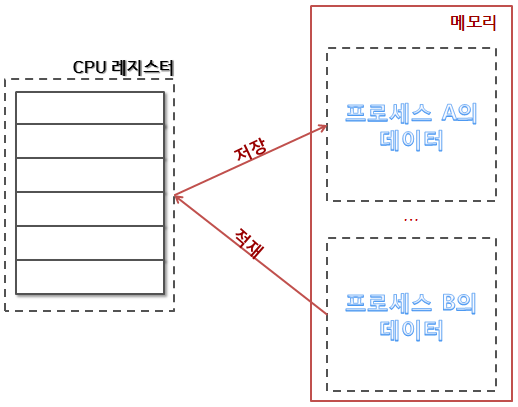

여러 프로세스가 서로 경쟁하며 CPU를 점유하여 제어권을 가져가는게 CPU의 처리방법이다.

그리고 **여러 프로세스가 CPU의 제어권을 점유하는 과정에서 점유권을 교환하는 것을 컨텍스트 스위칭이라고 한다.**

> 컨텍스트 (Context)
>
> * 프로세스의 내용(정보)을 의미한다. (PCB = Process Control Block)
>   * 프로세스 식별자 ( Process ID )
>   * 프로세스 상태 : 생성, 준비, 실행, 대기, 완료
>   * 프로그램 카운터 ( Program Counter ) : 이 프로세스가 다음에 실행할 명령어의 주소를 가리킨다.
>     * PC라고 하며, 컨텍스트중에서 제일 중요한 부분을 차지한다.
>     * Process A가 CPU의 점유권을 가지고 있다가, Process B에게 넘겨주고, 시간이 지나  다시 Process A가 CPU의 점유권을 가지면 전까지 실행된 코드의 위치를 알아야한다. PC가 바로 이러한 위치 주소를 저장하고 있는 변수이다.
>   * CPU 레지스터 및 일반 레지스터
>   * CPU 스케줄링 정보
>
> 
>
> 스위칭 (Switching)
>
> * 교환


---

### 1-4. 동기 비동기 블록 논블록

스레드와 관련된 내용이며, 꼭 알고 넘어가야 할 내용이다.

> 참고 사이트
>
> * [동기와 비동기, 그리고 블럭과 넌블럭](https://musma.github.io/2019/04/17/blocking-and-synchronous.html)
> * [Blocking-NonBlocking-Synchronous-Asynchronous](http://homoefficio.github.io/2017/02/19/Blocking-NonBlocking-Synchronous-Asynchronous/)
> * [블럭,논블럭,동기,비동기 이야기](https://hamait.tistory.com/930)


#### 1-4-1-. Blocking / Non-Blocking

> 블록/논블록은 `호출되는 함수`가 바로 리턴하느냐 마느냐가 관심사다.
>
> 제어권이랑 연관이 싶다. 
>
> * 블록 : 제어권 하나
> * 논블록 : 제어권 하나 이상


행위자가 취한 행위 자체가, 또는 그 행위로 인해 다른 무엇이 **막혀버린, 제한된, 대기**하는 상태

* `호출된 함수`가 **자신이 할 일을 모두 마칠 때까지 제어권**을 **계속 가지고**서 `호출한 함수`에게 바로 돌려주지 않으면 Block

* `호출된 함수`가 **자신이 할 일을 채 마치지 않았더라도 바로 제어권**을 **건네주어(return)** `호출한 함수`가 다른 일을 진행할 수 있도록 해주면 Non-Block


#### 1-4-2. Synchronous / Asynchronous

> 사전적 의미
>
> * 동기의 사전적의미 : 동시 발생하는
> * 비동기의 사전적의미 : 동시에 발생하지 않는
>
> 동기/비동기는 `호출되는 함수`의 작업 완료 여부를 누가 신경쓰냐가 관심사다.
>
> 행위라고도 본다.


**동시에 발생**하는 것들 (always plural, can never be singular)

동시라는 것은 시(time)라는 단일계(system)에서 **같이, 함께** 무언가가 이루어지는 두 개 이상의 개체 혹은 이벤트를 의미한다고 볼 수 있다.

* `호출된 함수`의 수행 결과 및 종료를 `호출한 함수`가(`호출된 함수`뿐 아니라 `호출한 함수`도 함께)신경 쓰면 Synchronous
  * A라는 행위와 B라는 행위가 순차적으로 작동한다면 Synchronous
    * **A라는 행위가 별개의 것이 아니라, B라는 행위를 관찰하는 행위라면 이것이 동시에 일어나더라도 동기라고 본다.**
    * **A라는 쓰레드와 B라는 쓰레드가 따로 돌아간다고 해도, 어떤 하나의 행위가 다른 행위에 밀착되어 있다면 두 행위가 다른 쓰레드에서 벌어지더라도 동기를 의미한다.**
* `호출된 함수`의 수행 결과 및 종료를 `호출된 함수` 혼자 직접 신경 쓰고 처리한다면(as a callback fn.) Asynchronous
  * A라는 행위와 B라는 행위가 동시(or 순차적이지 않다면)에 실행되고 있으면 Asynchronous
    * A,B 행위 사이에는 **인과관계**가 있어야한다.
    * **웹서버에서 멀티쓰레드로 각각 A와 B가 다른 클라이언트와 작업 할 때 둘은 동시에 작업하고 있지만, 둘의 인과관계는 없다. 이럴때는 비동기라고 보지 않는다.**


#### 1-4-3. 동기/비동기 블록/논블록


##### Sync-Blocking

A가 실행되다가 B라는 일을 수행하는 함수를 호출해서 B를 시작한다.

B라는 일이 끝나면 함수를 리턴한다.

**A와 B는 순차적으로 진행되기 때문에 동기이며, B라는 일을 하는 함수를 호출하고 그 이이 끝나고 나서야 리턴되므로 블럭.**

> 서로 같은 일(순차적)을 하며(동기), 제어권을 하나만 가지고 서로 돌려가며 사용한다.(블록)

```
나 : 대표님, 개발자 좀 더 뽑아주세요..
대표님 : 오케이, 잠깐만 거기 계세요!
나 : …?!!
대표님 : (채용 공고 등록.. 지원자 연락.. 면접 진행.. 연봉 협상..)
나 : (과정 지켜봄.. 궁금함.. 어차피 내 일 하러는 못 가고 계속 서 있음)
```


##### Async-NonBlocking

A는 B의 일을 시작시키고 바로 리턴하므로 논블럭.

그리고 A와 B는 각자 자신의 일을 하므로 비동기.

**A와 B는 자신들의 일을 하면서 서로가 제어권을 가지고 있다.**

> 서로 다른 일(순차적이지 않음)을 하며(비동기), 제어권을 서로가 따로 가지고 있다.(논블록)

```
나 : 대표님, 개발자 좀 더 뽑아주세요..
대표님 : 알겠습니다. 가서 볼 일 보세요.
나 : 넵!
대표님 : (채용 공고 등록.. 지원자 연락.. 면접 진행.. 연봉 협상..)
나 : (열일중..)
대표님 : 한 분 모시기로 했습니다~! (인과관계)
나 : 😍

// ajax의 댓글이 바로 Async-NonBlocking
```


##### Sync-NonBlocking

A는 B라는 일을 시킨다. 바로 리턴한다. (논블럭)

B는 일을 하는데, A는 자신의 일을 하지 않는다.

A의 하는 일은 그저 B가 하는 일을 확인하는 것이다.

B가 결과 보고를 했는지를 확인하는 함수를 호출하고, 바로 리턴한다. (논블럭) 즉 결과보고를 받을 때 까지 기다리는게 아니라, 결과 보고가 나왔는지 확인하고 바로 리턴한다. 이 짓을 계속한다..

즉 **함수를 계속 논블럭으로 호출되긴 하나, A는 그저 B를 염탐할 뿐이다. 이 상태를 말한다. 그냥 염탐하지 말고 B가 일을 모두 끝마치고 리턴되길 기다린다.**

> 서로 같은 일(순차적)을 하며(동기), 제어권을 서로가 따로 가지고 있다.(논블록)

```
나 : 대표님, 개발자 좀 더 뽑아주세요..
대표님 : 알겠습니다. 가서 볼 일 보세요.
나 : 넵!
대표님 : (채용 공고 등록.. 지원자 연락.. 면접 진행.. 연봉 협상..)
나 : 채용하셨나요?
대표님 : 아직요.
나 : 채용하셨나요?
대표님 : 아직요.
나 : 채용하셨나요?
대표님 : 아직요~!!!!!!
```


##### Async-Blocking

A는 B라는 일을 시킨다. 바로 리턴한다. (논블럭)

B는 일을 시작하고, A도 자신의 일을 한다. **A는 중간에 B라는 일이 하는 중간 결과를 보고 받아서 처리해야 한다.**

**A는 B에게 요청을 해서 중간결과를 기다린다. (블록)** 요청의 결과를 받고 나서 그 결과를 이용해서 A는 자신의 일을 처리한다.

동시에 B는 또 자신의 일을 동시에 한다. (비동기)

**A는 다시 B에게 중간결과를 요청해서 기다린다. (블록)**

요청의 결과를 받고 A는 자신의 일을, B는 자신의 일을 한다. 반복한다.

> 제일 애매하다... 의도적으로 사용하진 않는다고 한다.

```
나 : 대표님, 개발자 좀 더 뽑아주세요..
대표님 : 오케이, 잠깐만 거기 계세요!
나 : …?!!
대표님 : (채용 공고 등록.. 지원자 연락.. 면접 진행.. 연봉 협상..)
나 : (안 궁금함.. 지나가는 말로 여쭈었는데 붙잡혀버림.. 딴 생각.. 못 가고 계속 서 있음)

// 중간에 블록되는 지점이 있지만, 그 이전과 이후에는 각자 자신의 일을 한다.
```


## 2. 스레드의 구현과 실행

자바에서 Thread를 구현하는 방법은 2가지 있다.

* `Thread` 클래스를 상속받는 방법
* `Runnable` 인터페이스를 구현하는 방법

```java
// Thread클래스를 상속
class Thread1 extends Thread {
    @Override
    public void run() {
        for(int i = 0; i < 5; i++){
            System.out.println(getName()); // 부모인 Thread의 getName() 호출
        }
    }
}

// Runnable인터페이스 구현
class Thread2 implements Runnable {
    @Override
    public void run() {
        for(int i = 0; i < 5; i++){
            // Thread.currentThread(); - 현재 실행중인 Thread 실행
            System.out.println(Thread.currentThread().getName());
        }
    }
}

public class Test {

    public static void main(String[] args){

        Thread1 th1 = new Thread1();

        Runnable r = new Thread2();
        Thread th2 = new Thread(r);

        th1.start();
        th2.start();
    }
}
// 결과
Thread-0
Thread-0
Thread-0
Thread-0
Thread-0
Thread-1
Thread-1
Thread-1
Thread-1
Thread-1
```

* 실행하는 것이 별로 없어서 `동기/블록`처럼 보이지만, 비동기적으로 실행되고 있다.


### 2-1. Thread클래스

```java
// JAVA API Thread Class
public class Thread implement Runnable{
  /* 중요 멤버 */
  private Runnable target; // run()을 위한 Runnable
  private ThreadGroup group;
  private volatile String name;
  
  /* 생성자 */
  // 기본 생성자
  Thread(){
    // ThreadGroup, Runnable, name, stacksize
    this(null, null, "Thread-" + nextThreadNum(), 0);
  }
  
  // Runnable 매개변수로 받는 생성자
  Thread(Runnable target) {
    this(null, target, "Thread-" + nextThreadNum(), 0);
  }
  
  // name 매개변수로 받는 생성자
  Thread(String name) {
    this(null, null, name, 0);
  }
  
  // 진짜 생성자 (모두 이 생성자를 호출한다)
  Thread(ThreadGroup g, Runnable target, String name, long stackSize){
    // Thread name 초기화
    if(name == null)
      throw new NullPointerException("name cannot be null");
    this.name = name;
    
    // ThreadGroup 초기화
    ...
      
    // Runnable 초기화
    this.target = target;
  }
  
  
  /* start */
  public synchronized void start() {
    
    // ThreadGroup에 add
    group.add(this);
    
    boolean started = false;
    try {
      start0(); // native 메서드
      started = true;
    } finally {
      try {
        if(!started){
          group.threadStartFaild(this);
        }
      } catch (Throwable ignore){
        // do nothing
      }
    }
  }
  
  private native void start0(); // C언어로 된 코드
  
  /* run */
  public void run() {
    if(target != null){
      target.run(); // 중요! 개발자가 구현한 Runnable 인터페이스의 run()을 실행하는 것.
    }
  }
  
  /* 주요 메서드 */
  public static native Thread currentThread(); // Thread 반환
  
  public final String getName(){
    return name;
  }
  
}
```

* `run()`의 의미
  * `Thread`클래스 안에 `Runnable`인터페이스 `target`변수가 존재한다. 
  * `target`은 개발자가 오버라이딩을 통해 구현한다.
    * Thread클래스 상속 : 상속받은 클래스의  `run()`을 실행한다.
    * Runnable인터페이스 구현 : 구현된 클래스의 `run()`을 실행한다.
  * **`run()`은 그저 개발자가 구현한 메서드를 실행할 뿐 새로운 스레드를 만들진 않는다.**

* **`Thread`를 `start()`하면 해당 스레드는 특정 `ThreadGroup`안에 들어간다.**

* `currentThread()` : 현재 실행중인 쓰레드의 참조를 반환한다. (native)


> 책의 내용을 외우는 것보다는 Java API와 직접 코드를 분석하여 공부하면 훨씬 쉽게 다가온다.


### 2-2. Runnable인터페이스

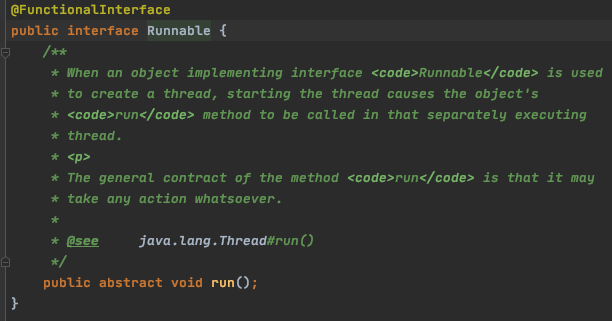

* `Runnable`을 사용하면 다중상속이 제한된 자바에서 다른 상속을 받을 수 있게 해준다.


### 2-3. start()와 run()

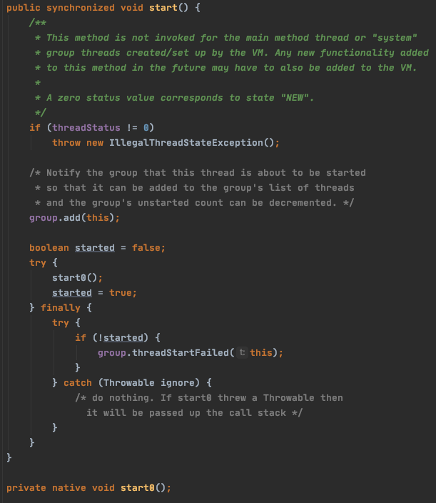

* `start()`를 실행하면 해당 `Thead`객체를 `ThreadGroup`에 넣는다.


* `start()`는 새로운 스레드가 작업을 실행하는데 필요한 호출스택(call stack)을 생성한 다음에 `run()`을 호출한다.
* 생성된 호출스택(call stack)에 `run()`이 첫 번째로 올라가게 된다.


> 모든 스레드는 독립적인 작업을 수행하기 위해 자신만의 Call Stack을 필요로 하기 때문에, 새로운 스레드를 생성하고 실행시킬 때마다 새로운 Call Stack이 생성되고 스레드가 종료된 작업에 사용된 Call Stack은 소멸된다.

> 한 번 실행이 종료된 스레드는 다시 실행할 수 없다.
>
> 다시 실행하고 싶으면 새로운 스레드 객체를 생성해서 실행해야한다.

> 실행 중인 사용자 스레드가 하나도 없을 때 프로그램은 종료된다.


## 3. 싱글스레드와 멀티스레드


### 3-1. 싱글스레드와 멀티스레드

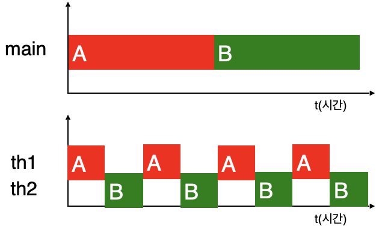

* 하나의 스레드로 두 작업을 처리하는 경우는 한 작업 마친 후에 다른 작업을 시작한다. (동기/블록)
* **두 개의 스레드로 작업 하는 경우에는 짧은 시간동안 2개의 스레드(`th1`, `th2`)가 번갈아 가면서 작업을 수행해서 동시에 두 작업이 처리되는 것과 같이 느끼게 된다.**
  * **여러 프로세스들이 CPU의 점유를 가져가려 경쟁하는 것과 같이 여러 스레드가 프로세스의 점유를 가져가려 경쟁한다.**
    * **스레드도 프로세스 안에서 컨텍스트 스위칭을 한다는 의미.**
    * 스레드의 레지스터는 **호출스택의 지역변수**와 **Program Counter(실행위치)**다.


### 3-2. 프로세스 관점에서의 스레드

> 참고 사이트
>
> * [https://medium.com/pocs/process%EC%99%80-thread%EC%9D%98-%EC%B0%A8%EC%9D%B4-afd03c18edc4](https://medium.com/pocs/process와-thread의-차이-afd03c18edc4)

> 프로세스의 작업 방식 (컨텍스트 스위칭)

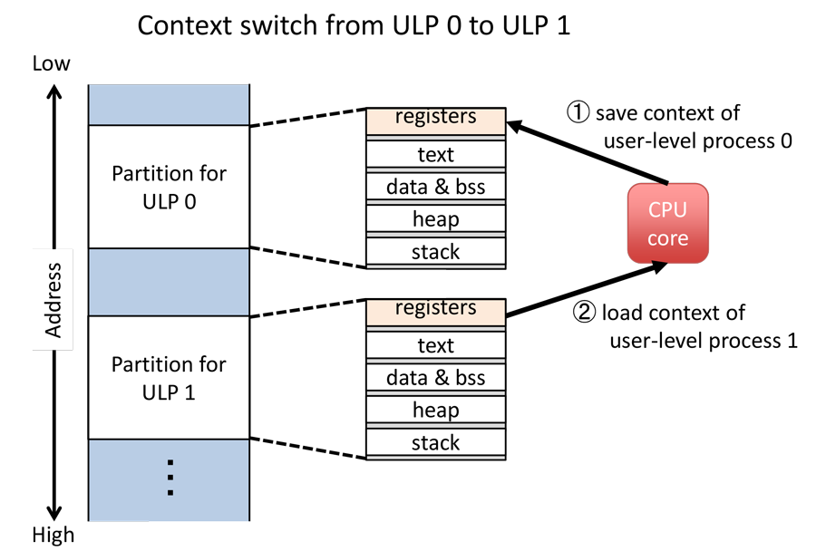


* OS는 개별 프로세스가 다른 프로세스의 영역을 침범하여 오류를 범하지 않도록 **프로세스를 격리시킨다.**
* **CPU가 프로세스A를 실행중에 I/O처리나 시스템 콜 등 인터럽트가 걸리면 실행중이던 프로세스 A의 Context를 저장하고, 실행할 프로세스의 Context를 로드하여 실행한다. (컨텍스트 스위칭)**


#### 3-2-1. Thread의 출현 배경

> 스레드의 출현 배경을 알면, Process의 차이를 더욱 명확하게 알 수 있다.

**프로세스의 문제점**

1. **프로세스 간 컨텍스트 스위치 오버헤드**
   * CPU가 프로세스A를 실행하다가 B를 실행한다고 하자. 프로세스 A의 컨텍스트를 PCB에 저장하고 B의 컨텍스트를 레지스터에 저장해주어야한다.
   * 또한, 캐시와 MMU의 TLB도 flush해주어야 한다.
   * 그리고 L1, L2 캐시에는 프로세스 B의 데이터로 채워준다.
2. **프로세스 사이 통신의 어려움**
   * 프로세스들은 독립된 주소공간을 가지고 있기 때문에, 단순한 방법으로 서로의 메모리 공간을 접근 할 수 없다.
   * 공유메모리, 소켓등을 이용해서 접근 해야 한다.


**프로세스의 문제점을 해결한 스레드**

1. **빠른 컨텍스트 스위치**
   * 스케줄링 단위가 프로세스였던 시절, Context Switching가 일어날 때마다 캐시 flush, 캐시 복수 등을 해야했다.
   * 하지만, 스케줄링 단위가 Thread로 되면서 같은 프로세스 내의 Thread들을 Context Switch를 할 때는 TCB만 바꾸면 된다.
2. **스레드간 통신으로 멀티스레드 구현**
   * 프로세스끼리의 통신은 비용이 많이 들고 어렵다.
   * 하지만, 같은 프로세스내에서 스레드끼리의 통신을 더욱 쉽게 할 수 있도록 하였다.


#### 3-2-2. 프로세스와 스레드의 관계

> **프로세스는 스레드의 컨테이너이다. 스레드의 정보를 담고있는 것에 불과하다.**

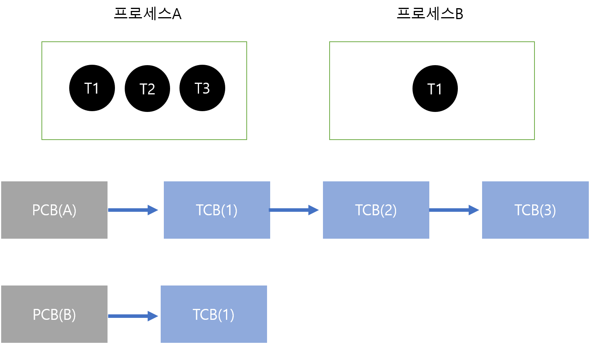

* PCB A는 A의 프로세스 전체 정보를 가지고 있다. 
  * 그 중에서 프로세스는 Thread들을 LinkedList형식으로 저장한다.


> 실행단위에 따른 메모리 구조

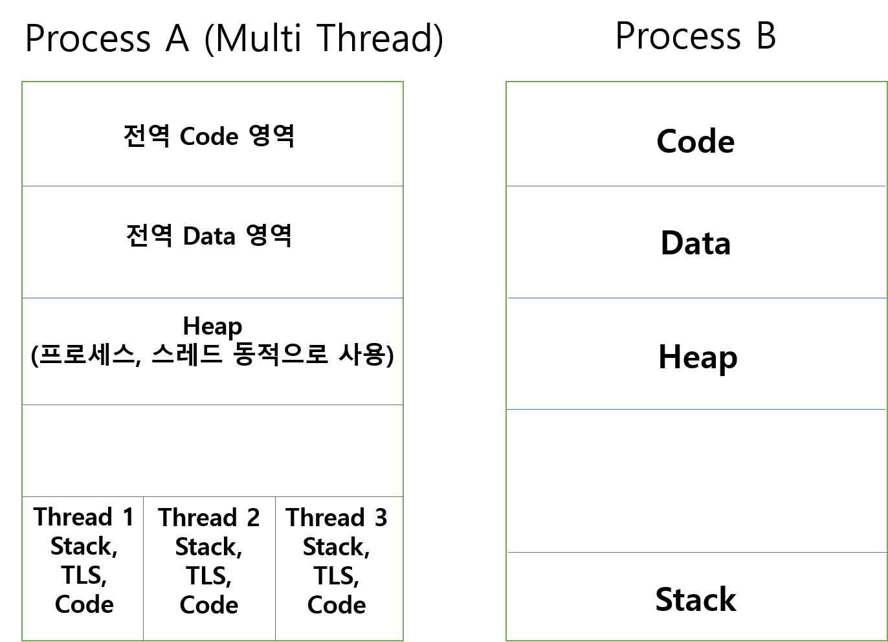

* 프로세스는 스레드 간의 공유 환경을 제공할 뿐이다.
  * 프로세스는 스레드간의 공유변수를 제공한다.
* 스레드의 컨테이너 역할을 한다.


### 3-3. 메모리 관점에서의 스레드


* 프로세스는 프로세스마다의 독립적인 메모리를 가지고 있다.
* **스레드는 프로세스의 Heap, Static, Code 영역을 공유한다.**
  * 스레드 간의 데이터 공유비용이 매우 적다.


> 프로세스 컨텍스트 스위칭시에는 모든 데이터 영역을 저장하고 로드하기 때문에 시간비용이 많이 발생한다.
>
> 스레드 컨텍스트 스위칭은 같은 프로세스 내에서 호출스택의 지역변수와 PC(실행위치)만을 저장하고 로드하기 때문에 시간비용이 훨씬 적다.


### 3-4. 병행과 병렬


#### 3-4-1. 병행과 병렬의 차이

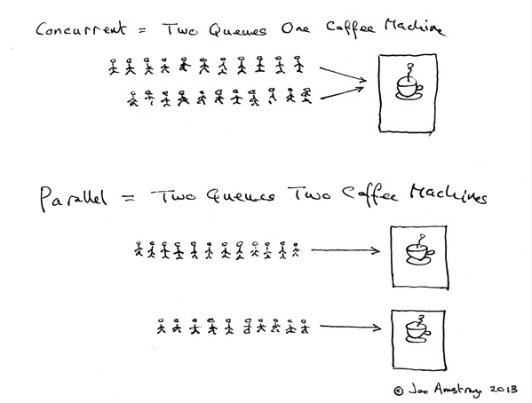

* 병행성(Concurrency) - CPU
  * **동시에 실행되는 것처럼 보이는 것.**
    * 1코어 멀티 스레딩.
  * Single Core
    * 물리적으로 병렬이 아닌 순차적으로 동작할 수 있다.
    * 실제로 Time-Sharing(시분할)으로 CPU를 나눠 사용함으로써 사용자가 병행성을 느낄 수 있도록 한다.
  * Multi Core
    * 물리적으로 병렬로 동작할 수 있다.
    * 각 CPU가 병행처리를하며, 전체적으로 봤을때는 병렬로 동작하는 것.
  * Case
    * Mutex, Deadlock
* 병렬성(Parallelism) - GPU
  * **실제로 동시에 작업이 처리가 되는 것.**
    * n개의 코어, n개의 스레드.
  * 오직 Multi Core에서만 가능하다.
  * Case
    * CUDA


> 병행 : 하나의 작업을 작은 단위로 분할하여 처리한다.
>
> * 싱글코어CPU에서는 순차로 처리된다.
> * 멀티코어CPU에서는 각 CPU끼리 병렬로 처리되며, CPU에 할당된 작업들끼리 순차처리된다.
>
> 
>
> 병렬 : 복수의 업무를 동시에 처리 한다.


> [처리관점에서의 병행과 병렬](http://kevinpelgrims.com/blog/2010/08/30/parallel-programming-in-net-introduction/)
>
> 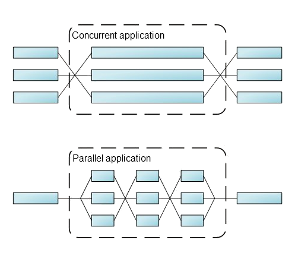
>
> * **Concurrent applications** tend to create a thread that handles a whole series of tasks. Most of the time these concurrent applications create threads because they need an isolated process for a concurrent event.
>   * 10개의 업무를 2종류의 독립된 작업으로 분할해 처리하는 것.
> * **Parallel applications** divide a process into small tasks that are executed on seperate threads. Because the tasks are small, the threads can be divided evenly over the processors, resulting in very efficient use of a multi-core CPU.
>   * 10개의 업무를 2명이 분담하여 처리하는 것.


#### 3-4-2. 스레드의 개수가 2배면 처리량도 2배일까?

No! 두 가지의 이유가 있다.

1. **Context Switching ( 문맥 교환 )**
   * 스레드 개수가 늘어났다고 해도, CPU 개수에 제약이 있기 때문에 병렬로 동작하지 않는다.
   * 병행적으로 처리하기때문에, 스레드간의 문맥교환의 비용이 발생한다.
2. **Mutual Exclusion ( 상호 배제 )**
   * 만약 스레드가 병렬적으로 처리된다고 해도 스레드 간의 상호배제를 수행하기 위해 오버헤드가 발생한다.
     * 스레드간의 상호 배제의 비용이 발생한다.
   * 스레드 동기화


> **Mutual Exclusion**
>
> * 공유자원을 어느 시점에서 단지 한 개의 프로세스만이 사용할 수 있도록 하며, 다른 프로세스가 공유자원에 대하여 접근하지 못하게 제어하는 기법.
>   * 공유 자원 : 프로세스의 Heap, 
> * 임계 구역(공유 자원)을 어느 시점에서 한 개의 프로세스만이 사용할 수 있도록 하며, 다른 프로세스가 현재 사용 중인 임계 구역에 대해 접근하려고 할 때 금지하는 행위.
>   * 어느 한 스레드가 프로세스의 공유 데이터를 갱신하는 동안 다른 모든 스레드에서 접근하지 않고 우선 대기한다.
>   * 그리고 실행중인 스레드가 공유 데이터를 사용하는 작업을 마치고 나서야 시스템이 대기 중인 프로세스 중 하나가 공유 데이터를 접근할 수 있게 해야한다. 
>   * DeadLock이 발생할 확률이 높다.
> * 해결 방법
>   * 동기화 - 세마포어, 모니터기법
>   * 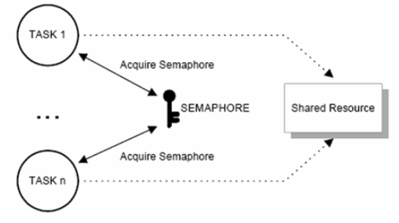
>
> 
>
> **DeadLock**
>
> * 교착상태(DeadLock)는 상호 배제에 의해 나타나는 문제점으로, 둘 이상의 프로세스들이 자원을 점유한 상태에서 서로 다른 프로세스가 점유하고 있는 자원을 요구하며 무한정 기다리는 현상을 말한다.
> * 결과적으로 서로 상대방의 작업이 끝나기만을 기다리고 있기 때문에 결과적으로 아무것도 완료되지 못하는 상태를 만한다.
>   * 사다리
>     * 아래에 있는 사람은 위로 올라가려고 하고, 위에 있는 사람은 아래로 내려 오려고만 한다면, 두 사람은 서로 상대방이 사다리에서 비켜줄 때 까지 하염없이 기다리고 있을 것이고 결과적으로 아무도 사다리를 내려오거나 올라가지 못하게 된다.
>   * 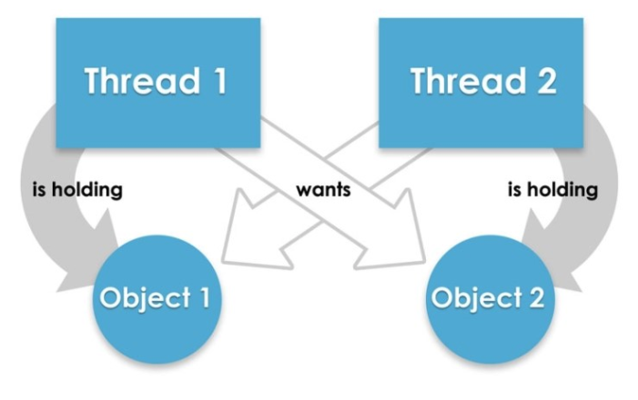
>   * 
>     * 자동차 여러 대가 혼잡하고 바쁜 자동차 행렬을 뚫고 지나가려고 애쓰고 있는 사진. (교착상태)
>     * 몇 차만 추진해줘도 풀릴 수 있는데 서로 자리를 차지한 상태로 남이 비켜주길 기다리고 있다.


#### 3-4-3. 병행과 병렬 예제


> 싱글스레드


```java
public class Test {

    public static void main(String[] args){
        long startTime = System.currentTimeMillis();

      	// A
        for(int i = 0; i < 100; i++){
            System.out.printf("%s",new String("-"));
        }

        System.out.println("소요시간1 : " + (System.currentTimeMillis() - startTime));

      	// B
        for(int i = 0; i < 100; i++){
            System.out.printf("%s",new String("|"));
        }

        System.out.println("소요시간2 : "+ (System.currentTimeMillis() - startTime));
    }
}

// 결과
----------------------------------------------------------------------------------------------------소요시간1 : 42
||||||||||||||||||||||||||||||||||||||||||||||||||||||||||||||||||||||||||||||||||||||||||||||||||||소요시간2 : 70
```


> 멀티스레드

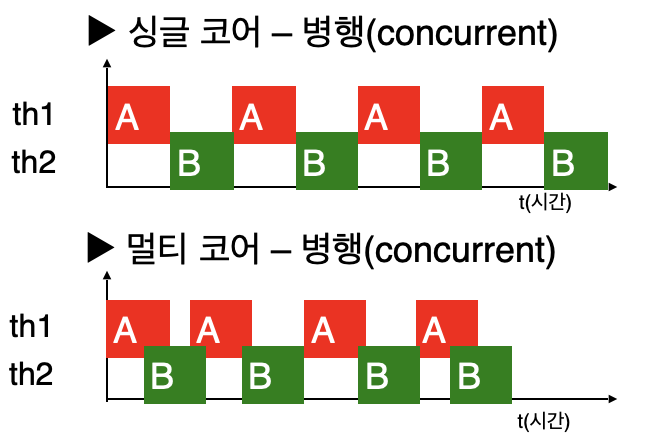

> OS의 JVM마다 코어와 스레드를 다루는 것이 다르기때문에, 이게 싱글코어로 돌린건지 멀티코어로 돌린건지는 모르겠다..
>
> * **싱글코어** : 프로세스의 점유를 받기 위해 스레드  간 컨텍스트 스위칭을 계속해서 한다.
> * **멀티코어** : A스레드는 코어1에서, B스레드는 코어2에서 처리하며, 서로 번갈아가면서 처리한다.
>   * 멀티코어기 때문에 **두 개의 작업**을 분리해서 **병렬적(가짜 병렬)으로 처리한다고 봐도 된다.**
>   * **만약 하나의 작업을 멀티 코어로 처리한다면 진정한 병렬 (찐 병렬)**
>   * 

```java

class ThreadTest extends Thread {
    @Override
    public void run() {
        for(int i = 0; i < 100; i++){
            System.out.printf("%s", new String("|"));
        }
        System.out.println("소요시간2 : "+ (System.currentTimeMillis() - Test.startTime));
    }
}


public class Test {

    static long startTime = 0;

  	// 스레드 A
    public static void main(String[] args){
        // 다른 스레드 실행 B
        Thread th1 = new ThreadTest();
        th1.start();

        startTime = System.currentTimeMillis();

        for(int i = 0; i < 100; i++){
            System.out.printf("%s",new String("-"));
        }

        System.out.println("소요시간1 : " + (System.currentTimeMillis() - startTime));
    }
}
// 결과 ( 싱글코어 )
----------------||||||||||||||||||||||||||||||||||||||||||||||||||||||||||||||||||||||||||||||||||||||||||||||||||||------------------------------------------------------------------------------------소요시간2 : 58
소요시간1 : 74
  
// 결과 ( 멀티코어 )
--------------|||||||||--------|||||||||||||----------------------------------------------|||||||||||||||||||||||||||||||||||-------||--------------||||-----------|||--------------
```

* 두 스레드가 번갈아가면서 작업을 처리하기 때문에 스레드간의 **작업전환시간**이 소요되기 때문에 싱글스레드보다 느릴 수 있다.
* 한 스레드가 화면에 출력하고 있는 동안 다른 스레드는 **출력이 끝나기를 기다려야하는데**, 이때 발생하는 대기시간때문에도 느릴 수 있다. ( **모니터 락** )
  * **화면을 잡기 위해서 기다리는 것을 DeadLock라고한다.**

> **싱글코어와 멀티코어의 출력 결과 비교**
>
> * 싱글코어 : 병행
> * 멀티코어 : 병렬 ( 여러 코어에서 병행적으로 실행되므로 병렬 )


#### 3-4-4. Blocking

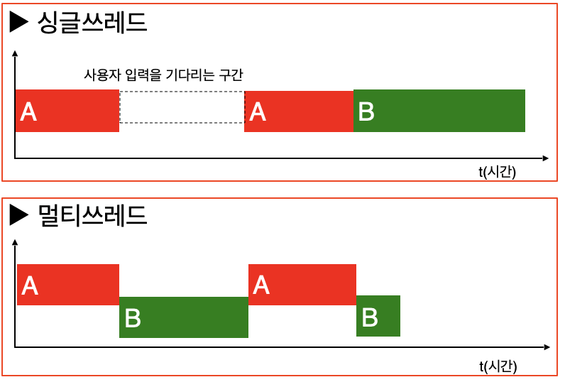

> Blocking 예제

```java
public class Test {

    public static void main(String[] args){
        // 입력을 받는다.
        Scanner sc  = new Scanner(System.in);
        System.out.print("입력 값 : ");
        String input = sc.next();
      	System.out.println("입력하신 값은 : "+input);

        // 10부터 1까지 출력한다.
        for(int i = 10; i > 0; i--){
            System.out.println(i);
            try {
                Thread.sleep(1000); // 1초간 지연한다.
            } catch (InterruptedException e) {
                e.printStackTrace();
            }
        }
    }
}
// 결과
입력 값 : 10
입력하신 값은 : 10
10
9
8
7
6
5
4
3
2
1
```

* 입력값을 받기전까지 for문은 돌아가지 않는다. (블록)


> Non-Blocking 예제

```java
class ThreadTest extends Thread {
    @Override
    public void run() {
        for(int i = 10 ; i > 0; i--){
            System.out.println(i);
            try {
                Thread.sleep(1000);
            } catch (InterruptedException e) {
                e.printStackTrace();
            }
        }
    }
}

public class Test {

    public static void main(String[] args){
        // 다른 스레드 실행
        Thread th1 = new ThreadTest();
        th1.start();

        // 입력을 받는다.
        Scanner sc  = new Scanner(System.in);
        System.out.print("입력 값 : ");
        String input = sc.next();
        System.out.println("입력하신 값은 : "+input);
    }
}
// 결과
10
입력 값 : 9
8
7
30
입력하신 값은 : 30
6
5
4
3
2
1
```

* 입력값을 받기 전부터 for문이 실행되고 있다.


## 4. 스레드 우선순위

```java
public class Thread implements Runnable {
  ...
  /* 우선순위 관련 멤버 */
  public static final int MIN_PRIORITY = 1;
  public static final int NORM_PRIORITY = 5;
  public static final int MAX_PRIORITY = 10;
  ...
    
  /* 우선순위 관련 메서드 */
  void setPriority(int newPriority);
  int getPriority();
  ...
}
```

* 스레드는 우선순위(Priority)라는 속성(멤버변수)를 가지고 있으며, 이 우선순위의 값에 따라 쓰레드가 얻는 실행시간이 달라진다.
  
  

> **스레드는 큐를 사용하는데 어떻게 우선순위에 따라 정렬하는가?? `Priority Queue`와의 관계는?**
>
> * 스레드의 우선순위는 해당 스레드가 CPU(실행)를 점유했을때, 더 오래 잡고 있는다는 의미
> * 스레드의 Priority Queue는 CPU를 점유하고 있지 않은 대기 상태인 스레드 사이에서의 우선순위를 정하는 의미.
>
> **토론이 필요하다!!**


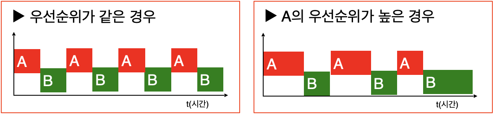

* 우선순위가 같은 경우 각 스레드에게 거의 같은 양의 실행시간이 주어지지만, 우선순위가 다르다면 우선순위가 높은 th1에게 상대적으로 th2보다 더 많은 양의 실행시간이 주어지고 결과적으로 작업 A가 B보다 더 빨리 완료될 수 있다.
  * 단, **멀티코어에서는 병렬처럼 실행되기때문에 우선순위에 따른 차이가 거의 없다.**


> 예제

```java
class ThreadTest1 extends Thread {
    @Override
    public void run() {
        for(int i = 0; i < 100; i++){
            System.out.print("-");
            try {
                Thread.sleep(100);
            } catch (InterruptedException e) {
                e.printStackTrace();
            }
        }
    }
}

class ThreadTest2 extends Thread {
    @Override
    public void run() {
        for(int i = 0; i < 100; i++){
            System.out.print("|");
            try {
                Thread.sleep(100);
            } catch (InterruptedException e) {
                e.printStackTrace();
            }
        }
    }
}

public class Test {

    public static void main(String[] args){

        Thread th1 = new ThreadTest1();
        Thread th2 = new ThreadTest2();

        th2.setPriority(7);
        System.out.println("Priority of th1 : "+th1.getPriority());
        System.out.println("Priority of th2 : "+th2.getPriority());
        
        th1.start();
        th2.start();
    }
}
// 결과
Priority of th1 : 5
Priority of th2 : 7
-|-|-|-|-|-||-|-|-|--|-||--|-|-|-||-|--|-|-|-|-|-||-|--|-|-|-|-|-|-|-|-||-|-|-|--|-|-|-|-|-|-|-|-|-|-|-|-|-|-|-|-|-|-|-|-|-|-|-|-|-|-|-|-|-|-|-|-|-|-|-|-|-|-|-|-|-|-|-|-|-|-|-|-|-|-|-|-|-|-|-|-|-|-|-|
```

* `|` 를 출력하는 `th2` 의 우선순위를 7로 높인 예제

  * 싱글코어의 결과

    ```java
    |||||||||||||||||||||||||||||||||||||||||||||||||||||||||||||||||||-----|||||||||||||||||||||||||||||||||||||--------------------------------------------------------------------------------
    ```

    * 싱글코어의 경우 우선순위가 더 높은 `th2`에게 더 많은 실행시간이 주어진다.

  * 멀티코어의 결과

    ```java
    -|-|-|-|-|-||-|-|-|--|-||--|-|-|-||-|--|-|-|-|-|-||-|--|-|-|-|-|-|-|-|-||-|-|-|--|-|-|-|-|-|-|-|-|-|-|-|-|-|-|-|-|-|-|-|-|-|-|-|-|-|-|-|-|-|-|-|-|-|-|-|-|-|-|-|-|-|-|-|-|-|-|-|-|-|-|-|-|-|-|-|-|-|-|-|
    ```

    * 멀티코어의 경우 병렬(멀티의 병행)적으로 돌아가기 때문에 우선순위의 따른 차이가 없다.


> **OS의 JVM마다 CPU와 스레드의 스케쥴링이 다르기 때문에 스레드에 우선순위를 부여하는 대신 작업에 우선순위를 두어 `PriorityQueue`에 저장해 놓고, 우선순위가 높은 작업이 먼저 처리되도록 하는 것이 나을 수 있다.**


## 5. 스레드 그룹

* **서로 관련된 스레드를 그룹으로 묶어서 관리한다.**
  * 폴더시스템과 유사하다. 폴더 안에 폴더 생성 등. 스레드가 파일.
* **보안상의 이유로 도입된 개념이다.**
  * 자신이 속한 스레드 그룹이나 하위 스레드 그룹은 변경할 수 있지만, 다른 스레드 그룹의 스레드를 변경할 수 없다.
* **모든 스레드는 반드시 스레드 그룹에 포함되어야한다.**
  * 스레드 그룹을 지정하지 않고 생성한 스레드는 'main스레드 그룹'에 속한다.
* **자신을 생성한 스레드(부모 스레드)의 그룹과 우선순위를 상속받는다.**


* **JVM은 자바 프로그램을 실행하면 `main`과 `system`이라는 스레드 그룹을 만들고 JVM운영에 필요한 스레드들을 생성해서 이 스레드 그룹에 포함시킨다.**
  * `main `메서드 (main스레드)는 main스레드 그룹에 속한다.
  * **가비지컬렉션을 수행하는 `Finalizer`스레드는 `system`스레드 그룹에 속한다.**
* **우리가 생성하는 모든 스레드는 자동적으로 main스레드 그룹에 속하게 된다.**


## 6. 데몬 스레드

> 데몬의 사전적의미와 유래
>
> * 도깨비나 유령을 뜻하는 데몬(daemon)이란 이름은 MIT의 MAC 프로젝트 프로그래머들이 만들었다.
>   * 보이지 않는 곳에서 분자들을 골라주는 일을 하고 있는 유령에서 영감을 얻었다고 한다.
>   * 그리스 신화에서도 신들이 관여하지 않는 일들을 처리하는 데몬이 등장한다.
> * 데몬이란 이름이 나오고 유닉스 시스템이 이 용어를 받아들여 사용함으로써 데몬은 사용자가 직접 신경쓰지 않도록 하면서 백그라운드에서 일을 처리해 주는 것을 의미하게 되었다.


### 6-1. 스레드의 종류


스레드는 크게 일반 스레드와 데몬 스레드로 나눌 수 있다.

* 일반 스레드 : 데몬 스레드가 아닌 스레드.
* 데몬 스레드 : 일반 스레드의 작업을 돕는 보조적인 역할을 수행하는 스레드
  * 일반 스레드가 모두 종료되면 데몬 스레드는 강제적으로 자동 종료된다.
  * 예제
    * 가비지 컬렉션, 워드프로세서의 자동저장, 화면자동갱신


> **일반 스레드가 생성한 스레드는 일반 스레드, 데몬 스레드가 생성한 스레드는 데몬스레드이다.**


### 6-2. 자바 메인 스레드

> Main thread is the most important part of any application. Whenever we run an application the main thread is executed. A main thread is needed so that we can spawn or create the child threads. So, we can create child threads through main thread and start them. The main thread is the last thread to finish the execution i.e., the main thread terminates the program. Typically, JVM starts the main thread and other daemon threads at the same time. So, when an application is started the main thread and other daemon threads are started by JVM. The main thread can further start multiple child threads and the child threads can start further threads. 출처 : [Multithreading in Java](https://www.learntek.org/blog/multithreading-in-java/)

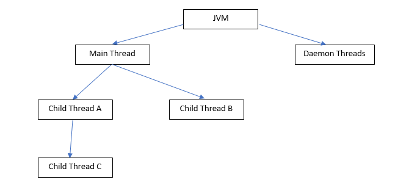

* **JVM이 시작되면 생성되는 모든 스레드는 메인 스레드를 제외한 모두가 데몬 스레드이다.**
  * 가비지 컬렉션등등
* 메인 스레드가 종료되면 가비지 컬력센등 데몬 스레드들은 종료된다.
* 개발자가 작성한 모든 코드는 메인 스레드에 존재하기때문에 설정해주지 않는 한 일반 스레드이다.


### 6-3. 데몬스레드 예제

```java
public class Test implements Runnable{

    static boolean autoSave = false;

    public static void main(String[] args){
        Thread th = new Thread(new Test());
        th.setDaemon(true); // 데몬스레드 설정. ( 이 부분이 없으면 종료되지 않는다. )
        th.start();

        for(int i = 1; i <= 10; i++){
            try {
                Thread.sleep(1000);
            } catch (InterruptedException e) { e.printStackTrace(); }
            System.out.println(i);

            if(i == 5)
                autoSave = true;
        }

        System.out.println("프로그램을 종료합니다.");
    }

    @Override
    public void run() {
        while(true) {
            try {
                Thread.sleep(3*1000); // 3초마다
            } catch (InterruptedException e) { e.printStackTrace(); }

            if(autoSave){
                autoSave();
            }
        }
    }

    public void autoSave() {
        System.out.println("작업파일이 자동저장되었습니다.");
    }
}

```

* 메인 스레드
  * 1초마다 숫자를 출력
  * 5초가 되면 `autoSave = true`
* 데몬 스레드
  * 3초마다 `autoSave`의 값을 확인후, `true`면 `autoSave()`호출


> **`main`스레드가 `th`라는 스레드를 실행시켰다. 그리고 `th`스레드를 데몬 스레드로 설정했다.**
>
> * `main`스레드는 `th`의 부모스레드.
> * 데몬 스레드는 부모 스레드가 죽으면 자기도 죽는다. 효도를 잘한다:)


## 7. 스레드의 실행제어

효율적으로 자원과 시간을 멀티 스레드 환경에서 사용하기 위해서는 "동기화"와 "스케줄링"이 필수적이다.


### 7-1. 스레드 생명주기

스레드는 효율적인 "동기화"와 "스케줄링"을 위해 생명주기를 갖는다.


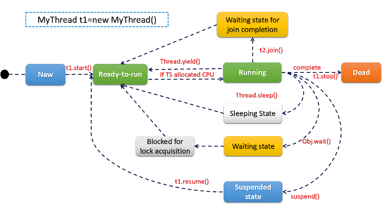

* 쓰레드를 생성하고 `start()`를 호출하면 바로 실행되는 것이 아니라 실행대기열(Runnable)에 저장되어 자신의 차례가 될 때까지 기다려야 한다. 실행대기열은 큐(queue)와 같은 구조로 먼저 실행대기열에 들어온 스레드가 먼저 실행된다.
* 실행대기상태에 있다가 자신의 차례가 되면 실행상태(Running)가 된다.
* 주어진 실행시간이 다되거나 `yield()`를 만나면 다시 실행대기상태가 되고 다음 차례의 스레드가 실행상태가 된다.
* 실행 중에 `suspend()`, `sleep()`, `wait()`, `join()`, `I/O block`에 의해 일시정지상태가 될 수 있다.
  * `I/O block`은 입출력작업에서 발생하는 지연사태를 말한다.
  * 사용자의 입력을 기다리는 경우에 일시정지 상태에 있다가 사용자가 입력을 마치면 다시 실행대기상태가 된다.
* 지정된 일시정지기간이 다 되거나(`time-out`), `notify()`, `resume()`, `interrupt()`가 호출되면 일시정지 상태를 벗어나 다시 실행대기열에 저장되어 자신의 차례를 기다리게 된다.
* 실행을 모두 마치거나 `stop()`이 호출되면 스레드가 소멸된다.


### 7-2. 스레드 실행제어

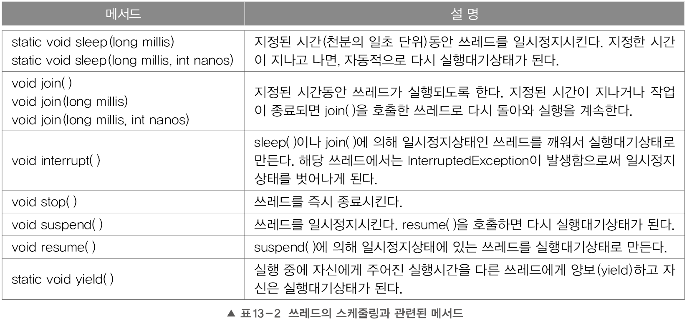

> `resume()`, `stop()`, `suspend()`는 스레드를 교착상태(Dead-Lock)로 만들기 쉽기 때문에 deprecated되었다.


#### 7-2-1. sleep(long millis)


* `sleep(long millis)`는 일정시간동안 스레드를 멈추게 한다.


* 예외처리를 해야 한다.
  * `sleep()`에 의해 일시정지 상태가 된 스레드는 지정된 시간이 다 되거나 `interrupt()`가 호출되면, `InterruptedException`이 발생되어 잠에서 깨어나 실행대기 상태가 된다.


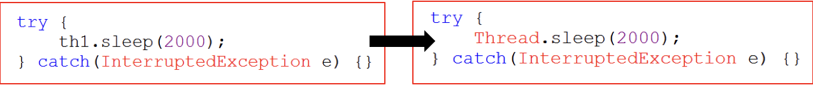

* 특정 스레드를 지정해서 멈추게 하는 것은 불가능하다.
  * `Thread.sleep()`을 호출한 스레드가 잠에 들게 된다.


#### 7-2-2. interrupt()와 interrupted()

> interrupt의 사전적 의미
>
> * 방해하다, 중단시키다, 차단하다

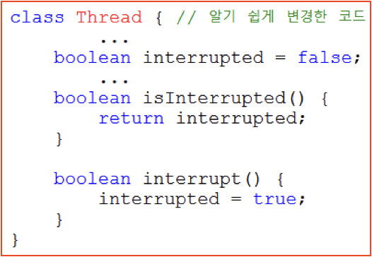

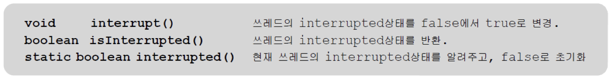

**`interrupt()`는 진행중인 스레드의 작업이 끝나기 전에 취소시켜야 할 때가 있는 경우 사용한다.**

* 예를 들어 큰 파일을 다운로드 받을 때 시간이 너무 오래 걸리면 중간에 다운로드를 포기하고 취소할 수 있어야한다.
* `interrupt()`는 스레드에게 작업을 멈추라고 요청한다.
  * 반대로 일시 정지된 스레드를 다시 실행상태로도 요청한다.
* **멈추는 것은 아니고, 그저 스레드의 interrupted 상태 (인스턴스 변수)를 바꾼다.**
  * CPU 프로세스의 인터럽트와 같은 역할
  * I/O 요청이 들어오면 인터럽트가 걸리거나, 시스템 콜에 의해서 인터럽트가 걸리거나


> 예제

```java
class ThreadTest extends Thread {
    @Override
    public void run() {
        int i = 10;

        while(i != 0 && !isInterrupted()){
            System.out.println(i--);
            for(long x = 0; x < 2500000000L; x++); // 시간 지연
        }
        System.out.println("카운터가 종료되었습니다.");
    }
}

public class Test {

    public static void main(String[] args){
        ThreadTest th1 = new ThreadTest();
        th1.start();

        Scanner sc = new Scanner(System.in);
        System.out.print("아무 값이나 입력하세요 : ");
        String input = sc.next();
        System.out.println("입력하신 값은 : "+input+" 입니다.");
        th1.interrupt();
        System.out.println("isInterrupted() : "+th1.isInterrupted());
    }
}
// 결과
10
아무 값이나 입력하세요 : 9
8
7
6
4
입력하신 값은 : 4 입니다.
isInterrupted() : true
카운터가 종료되었습니다.
```

* 사용자가 입력을 하자마자 바로 `th1.interrupt()`가 호출되고 `th1`스레드가 종료되며 모든 스레드가 종료된다.


> 스레드가 `sleep()`, `wait()`, `join()`에 의해 일시정지 상태(WAITING)에 있을 때, 해당 스레드에 대해 `interrupt()`를 호출하면 `sleep()`, `wait()`, `join()`에서 `InterruptedException`이 발생하고 스레드는 `실행대기 상태(Runnable)`로 바뀐다.

```java
class ThreadTest extends Thread {
    @Override
    public void run() {
        int i = 10;

        while(i != 0 && !isInterrupted()){
            System.out.println(i--);
            try {
                Thread.sleep(1000);
            } catch (InterruptedException e) {
                // interrupt(); // 꼭 해주어야 멈춘다.
            }
        }
        System.out.println("카운터가 종료되었습니다.");
    }
}

public class Test {

    public static void main(String[] args){
        ThreadTest th1 = new ThreadTest();
        th1.start();

        Scanner sc = new Scanner(System.in);
        System.out.print("아무 값이나 입력하세요 : ");
        String input = sc.next();
        System.out.println("입력하신 값은 : "+input+" 입니다.");
        th1.interrupt();
        System.out.println("isInterrupted() : "+th1.isInterrupted());
    }
}
// 결과
10
아무 값이나 입력하세요 : 5
입력하신 값은 : 5 입니다.
9
isInterrupted() : true // main의 sout이 먼저 출력되고, th1스레드에서 Exception이 발생한다.
8
7
6
5
4
3
2
1
카운터가 종료되었습니다.
```

* 이전과 다르게 종료되지 않은 이유는 `Thread.sleep(1000)`에서 `InterruptedException`이 발생했기 때문이다.
  * **`sleep()`에 의해 스레드가 잠시 멈춰있을 때, `interrupt()`를 호출하면 `InterruptedException`이 발생**되고 스레드의 **`interrupted`상태는 `false`로 자동 초기화된다.**


#### 7-2-3. suspend(), resume(), stop()


* 스레드의 실행을 일시정지, 재개, 완전정지 시킨다. 교착상태에 빠지기 쉽다.


* **`suspend()`, `resume()`, `stop()`은 deprecated되었으므로, 직접 구현해야 한다.**


> **deprecated된 이유는?**
>
> * 제일 큰 이유는 스레드가 사용중이던 자원들이 불안전한 상태로 남겨져 데드락이 걸리기 쉽기 때문이다.
>
> * `stop()`
>
>   * ```java
>     public class Test implements Runnable {
>       static int j = 0;
>       static int i = 100;
>       
>       public synchronized void run() {
>         while(i > 0){
>           j++; // stop
>           i--;
>         }
>       }
>       
>       public static void main(String[] args) throws InterruptedException {
>         Thread thread = new Thread(new Test());
>         
>         thread.start();
>         Thread.sleep(5000);
>         thread.stop();
>       }
>     }
>     ```
>
>     * while문 안에 두가지 작업이 일어난다. j와 i는 항상 짝이 맞아서 합이 100이여야한다고 가정하자.
>     * 하지만 중간에 `Thread.stop()`메서드가 호출되어 `j++`만 실행하고 끝났다고 한다.
>     * 이렇게 끝나면 사용자는 어떻게 끝났는지 알수가 없다. 나중에 어떤 에러가 나타날지도 모른다.
>     * **`while`문 안의 구문은 통으로 다뤄져야 하며 임계구역(Critical Section)이다.**
>
> * `suspend()`와 `resume()`
>
>   * `suspend()`는 잠시 대기하는 목적인데, `synchronized`를 걸어놓은 메서드(`run()`)가 실행되다 일시정지되면, 다른 스레드에서 공유 자원에 대한 접근이 불가능하다. (위 예제에서는 `i`와 `j`에 접근이 불가능하다.)
>   * 만약에 스레드끼리 서로 공유된 자원에 대해 접근하기 위해 `resume()`되어 있지 않은 놈과 서로 엉키다 보면 데드락이 발생하기 쉽다.
>   * 
>     * `Thread1`과 `Thread2`과 서로 같은 자원에 락을 걸며 병행적으로 실행하는 도중, `Thread1`이 `suspend()`에 의해 일시정지되면 락이 걸린 상태로 일시정지상태가 된다.
>     * `Thread2`가 CPU를 점유하고 `Thread1`과 같은 자원에 접근하려고보니 락이 걸려 있어  `Thread1.resume()`을 실행하면, 또 다시 `Thread1`이 실행되는데, 이때 `Thread2`도 락이 걸려있어 데드락이 걸리게 된다.


#### 7-2-3. yield()

> yield의 사전적 의미
>
> * 양도하다

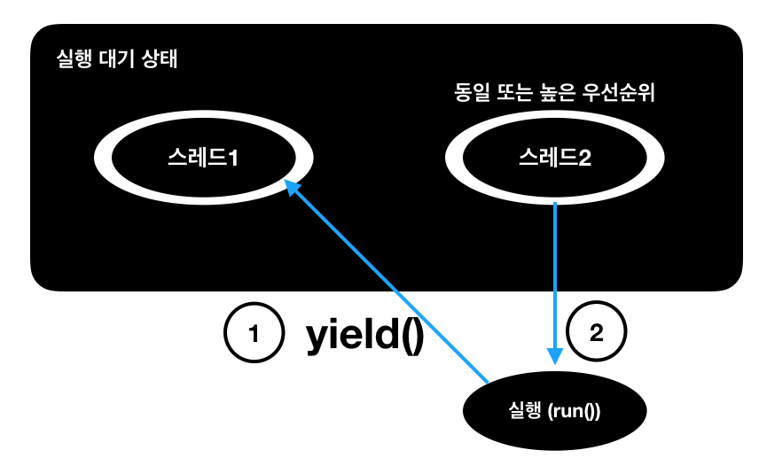

* `yield()`는 스레드 자신에게 주어진 실행시간을 다음 차례의 스레드에게 양보(yield)하도록 한다.
  * 스케줄러에 의해 1초의 실행시간을 할당받은 스레드가 0.5초의 시간동안 작업한 상태에서 `yield()`가 호출되면, 나머지 0.5초는 포기하고 다시 실행대기상태가 된다.

```java
class ThreadTest implements Runnable {
    boolean suspended = false;
    boolean stopped = false;

    Thread th;

    public ThreadTest(String name){
        th = new Thread(this, name);  // Runnable인 현재 객체와 이름을 Thread의 생성자로 넘긴다.
    }

    @Override
    public void run() {
        String name = th.getName();

        while(!stopped){
            if(!suspended){
                System.out.println(name);
                try {
                    Thread.sleep(1000);
                } catch (InterruptedException e) {
                    System.out.println(name + " - interrupted");
                }
            } else {
                Thread.yield();
            }
        }
        System.out.println(name + " - stopped");
    }

    public void suspend() {
        this.suspended = true; // 다음번에 하지 말아라
        th.interrupt(); // Sleep상태의 스레드를 바로 멈추기위해서 ( 바로 하지 말아라 )
        System.out.println(th.getName() + " - interrupted() by suspend()");
    }

    public void resume() {
        this.suspended = false;
    }

    public void stop() {
        this.stopped = true;
        th.interrupt();
        System.out.println(th.getName() + " - interrupted() by stop()");
    }

    public void start() {
        th.start();
    }
}

public class Test {

    public static void main(String[] args){
        ThreadTest th1 = new ThreadTest("*");
        ThreadTest th2 = new ThreadTest("**");
        ThreadTest th3 = new ThreadTest("***");
        th1.start();
        th2.start();
        th3.start();

        try {
            Thread.sleep(2000);
            th1.suspend();
            Thread.sleep(2000);
            th2.suspend();
            Thread.sleep(3000);
            th1.resume();
            Thread.sleep(3000);
            th1.stop();
            th2.stop();
            Thread.sleep(2000);
            th3.stop();
        } catch (InterruptedException e){}
    }
}

```

* 분석이 필요하다.


#### 7-2-4. join()

> join의 사전적의미
>
> * 참여하다
> * 자신의 작업 중간에 다른 스레드의 작업을 참여(join)시킨다는 의미.

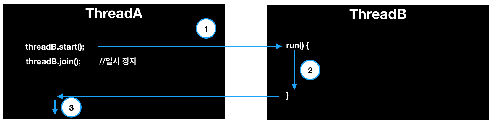


* `join()`는 지정된 시간동안 특정 스레드가 작업하는 것을 기다린다.
  * 스레드 자신이 하던 작업을 잠시 멈추고 다른 스레드가 지정된 시간동안 작업을 수행하도록 할 때 `join()`을 사용한다.
  * 시간을 지정하지 않으면 해당 스레드가 작업을 모두 마칠 때까지 기다리게 된다.
  * 작업 중에 다른 스레드의 작업이 먼저 수행되어야할 필요가 있을 때 `join()`을 사용한다.

```java
class ThreadTest extends Thread {

    public ThreadTest(String name){
        this.setName(name);
    }

    @Override
    public void run() {
        for(int i = 0; i < 100; i++){
            System.out.print(new String(this.getName()));
        }
    }
}

public class Test {

    static long startTime;

    public static void main(String[] args){
        ThreadTest th1 = new ThreadTest("-");
        ThreadTest th2 = new ThreadTest("|");

        th1.start();
        th2.start();
        startTime = System.currentTimeMillis();

        try {
            th1.join(); // main스레드가 th1의 작업이 끝날 때까지 기다린다.
            th2.join(); // main스레드가 th2의 작업이 끝날 때까지 기다린다.
        } catch (InterruptedException e) {
            e.printStackTrace();
        }

        System.out.println("소요시간 : "+(System.currentTimeMillis() - Test.startTime));
    }
}
// 결과
||||||||||||||||||||||||||||||---------||||||||||||||||||||||||||||||||||||||||||||||||||||||||||||||||||||||-------------------------------------------------------------------------------------------소요시간 : 6
```

* `join()`을 사용하지 않았다면 main스레드는 바로 종료되었겠지만, `join()`으로 스레드 `th1`과 `th2`의 작업을 마칠 때까지 main스레드가 기다리도록 했다.


#### 7-2-5. sleep(), yield(), join()의 예제

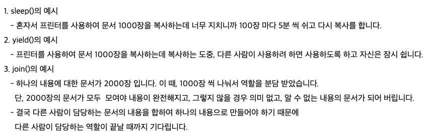

> 출처 : https://widevery.tistory.com/28


### 7-3. 스레드 안전한 종료 방법

> **스레드는 `run()`메서드만 끝나면 자동적으로 종료되므로 `stop()`메서드 사용 대신 `run()`메서드가 정상적으로 종료되도록 코드를 작성해야 한다.** 
>
> * 스레드를 안전하게 종료시키는 방법은 스레드의 `run()`메서드가 정상적으로 종료 되도록 유도하는 것이다.


#### 7-3-1. flag

스레드에서 안전하게 끝마쳐야하는 작업을 `while`문으로 감싸고 flag를 설정해놓는다.

```java
class ThreadTest extends Thread {

    private boolean flag;

    public void setFlag(boolean flag){
        this.flag = flag;
    }

    @Override
    public void run() {
        while(!flag){
            System.out.println("실행중 !");
        }
        System.out.println("자원 정리");
        System.out.println("실행 종료");
    }
}

public class Test {

    public static void main(String[] args){
        ThreadTest th = new ThreadTest();
        th.start();

        try {
            Thread.sleep(1000);
        } catch (InterruptedException e) { e.printStackTrace(); }
        th.setFlag(true);
    }
}

```

* 1초 후에 `th`의 스레드가 안전하게 멈추게 된다.


#### 7-3-2. interrupt() 사용

```java
class ThreadTest extends Thread {
    @Override
    public void run() {
        try {
            while(true){
                System.out.println("실행중");
                Thread.sleep(1); // 1밀리세컨드마다 일시정지 (InterruptedException을 실행시키기위함.)
            }
        } catch (InterruptedException e) {}
        System.out.println("자원 정리");
        System.out.println("실행 종료");
    }
}

public class Test {

    public static void main(String[] args){
        ThreadTest th = new ThreadTest();
        th.start();

        try {
            Thread.sleep(1000);
            th.interrupt();
        } catch (InterruptedException e) { e.printStackTrace(); }
    }
}
```

* main메서드에서 `th`의 `interrupt()`메서드를 실행하게 되면 `th`가 `sleep()`메서드로 일시 정지 상태가 될 때 `th`에서 `InterruptedException`이 발생하여 예외처리(catch)블록으로 이동한다.
* 결국, `th`는 `while`문을 빠져나와서 `run()`메서드를 정상 종료하게 된다.


>  Thread의 `interrupt()` 메소드는 스레드가 일시 정지 상태에 있을 때 `InterruptedException` 예외를 발생시키는 역할을 한다. 이것을 이용하면 Thread의 `run()` 메소드를 정상 종료시킬 수 있다. 


> 물론 `sleep()`을 쓰지 않고도 가능하다.

```java
class ThreadTest extends Thread {
    @Override
    public void run() {
      // while(!isInterrupted())도 가능 (앞에 this가 생략되었기 때문) this.isInterrupted().
        while(!(Thread.interrupted())){  // currentThread.interrupted();
            System.out.println("실행중");
        }
        System.out.println("자원 정리");
        System.out.println("실행 종");
    }
}

public class Test {

    public static void main(String[] args){
        ThreadTest th = new ThreadTest();
        th.start();

        try {
            Thread.sleep(1000);
            th.interrupt();
        } catch (InterruptedException e) { e.printStackTrace(); }
    }
}
```

* 스레드 객체의 `interrupt`멤버를 사용하는 것이다.


> **`Interrupted()`와 `isInterrupted()`의 차이**
>
> 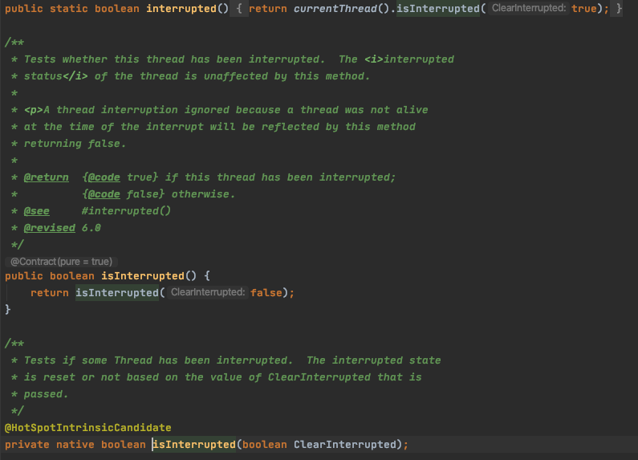
>
> * ` Interrupted()`는 static메서드 **(native)**
>   * `Thread.interrupted()` : 이 메서드가 호출된 현재 실행중인 스레드의 `interrupt`값이 무엇인지 체크. 
>   * 이 메서드를 호출한 스레드의 `interrupt`값 확인
>   * `Interrupted == Thread.currentThread().isInterrupted()`
> * `isInterrupted()`는 인스턴스 메서드
>   * `objThread.isInterrupted()` : `objThread`스레드 객체의 인스턴스 멤버인 `interrupt`값이 무엇인지 체크.
>   * 주어진 어떤 스레드 객체에 대한 인스턴스 멤버 `interrupt`값 확인


## 8. 스레드의 동기화

**멀티 프로세스에서는 프로세스별로 자원을 가지고 있기 때문에 문제가 크지 않다.**

하지만 멀티 스레드의 환경에서는 하나의 프로세스 공유 자원을 서로 공유하기 때문에 문제가 발생한다.

여러 스레드가 같은 프로세스 내의 자원을 공유해서 작업하기 때문에 서로의 작업에 영향을 주게 되기 때문이다.

> 여러 스레드가 어떤 자원들을 공유하는지는 3-3을 확인하기 바랍니다. (중요)


### 8-1. 동기화란?

> 동기화하지 않으면 발생하는 문제

`스레드 1`이 작업하던 도중에 다른 `스레드 2`에게 제어권이 넘어갔을 때, `스레드 1`가 작업하던 공유데이터를 `스레드 2`가 임의로 변경하였다면, 다시 `스레드 1`가 제어권을 받아서 나머지 작업을 마쳤을 때 원래 의도했던 것과는 다른 결과를 얻을 수 있다.

이러한 문제를 해결하기 위해서는 한 스레드가 특정 작업을 끝마치기 전까지 다른 스레드에 의해 방해받지 않도록 하는 것이 필요하다. 그래서 도입된 개념이 **'임계 영역(Critical Section)'과 '잠금(Lock)'**이다.


> 동기화란?

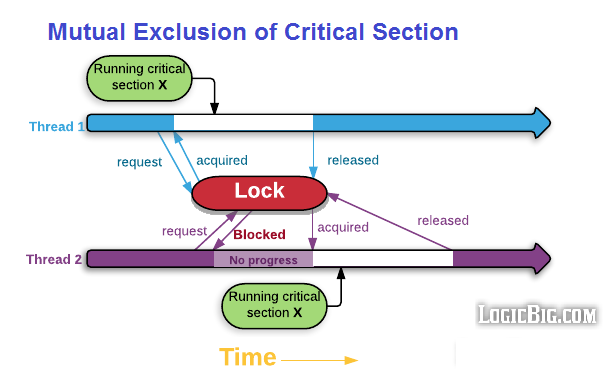

* **한 스레드가 진행 중인 작업을 다른 스레드가 간섭하지 못하도록 막는 것을 '스레드의 동기화'이라고 한다.**
  * 공유 데이터를 사용하는 코드 영역을 **임계 영역**으로 지정해놓고, 공유 데이터(객체)가 가지고 있는 **Lock**을 획득한 단 하나의 스레드만 이 영역 내의 코드를 수행할 수 있도록 한다. 그리고 해당 스레드가 **임계 영역**내의 모든 코드를 수행하고 벗어나서 **Lock**을 반납해야 비로소 다른 스레드가 반납된 **Lock**을 획득하여 **임계 영역**의 코드를 수행할 수 있게 된다.


### 8-2. synchronized

> 자바에서 스레드 동기화를 하는 방법

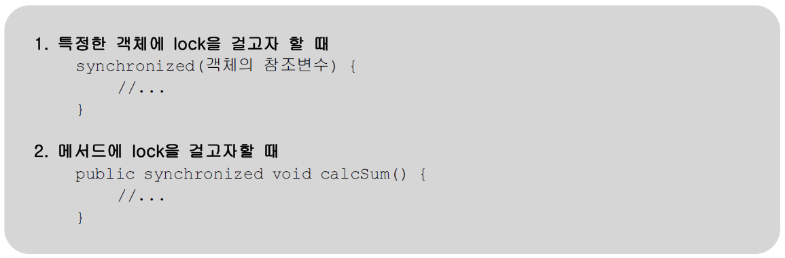

* 동기화 메서드
  * 스레드는 `synchronized`메서드가 호출된 시점부터 해당 메서드가 포함된 `객체의 lock`을 얻어 작업을 수행하다가 메서드가 종료되면 `lock`을 반환한다.
* 동기화 블럭
  * `synchronized`블럭이라 불리며, 이 블럭의 영역 안으로 들어가면서부터 스레드는 지정된 `객체의 lock`을 얻게 되고, 이 블럭을 벗어나면 `lock`을 반납한다.
  * **`synchronized`뒤에 `(참조변수)`를 붙이는데, 이 참조변수는 락을 걸고자하는 객체를 참조하는 것이어야 한다.**

> 두 방법 모두 `lock`의 획득과 반납이 자동적으로 이루어지므로 우리가 해야 할 일은 그저 임계 영역만 설정해주는 것 뿐이다.

> 임계 영역은 멀티스레드 프로그램의 성능을 좌우하기 때문에 가능하면 메서드 전체에 락을 거는 것보다 `synchronized`블럭으로 임계 영역을 최소화해서 보다 효율적인 프로그램이 되도록 노력해야 한다.
>
> * 한 스레드가 한 객체의 `Lock`을 너무 오래 가지고 있으면, 다른 스레드가 해당 객체에 접근이 안되므로 가능한 빨리 `Lock`을 반환하도록 설계하는 것이 좋다는 뜻.


> 예제 (동기화가 필요한 이유)

```java
// 계좌
class Account {
    private int balance = 1000;

    public int getBalance() {
        return this.balance;
    }

    public void withdraw(int money) {
        if(balance >= money){
            try {
                Thread.sleep(1000);
            } catch (InterruptedException e) { e.printStackTrace(); }

            balance-=money;
        }
    }
}

// 고객
class ThreadTest implements Runnable {

    Account acc = new Account(); // 하나의 계좌

    @Override
    public void run() {
        while(acc.getBalance() > 0){
            // 100, 200, 300중의 한 값을 임의로 선택해서 출금
            int money = (int)(Math.random() * 3 + 1) * 100;
            acc.withdraw(money);
            System.out.println("balance : "+acc.getBalance());
        }
    }
}

public class Test {

    public static void main(String[] args){
      	// 하나의 Runnable 객체를 생성. (내부에 Account 객체도 생성됨.)
        Runnable r = new ThreadTest();
        // 두 개의 스레드 실행.
        new Thread(r).start();
        new Thread(r).start();
    }
}

// 결과
balance : 800
balance : 700
balance : 400
balance : 400
balance : 100
balance : 100
balance : 100
balance : 0
balance : -100
```

* 실행결과를 보면 잔고(balance)가 마이너스가 되는 것을 볼 수 있다.
  * 그 이유는 한 스레드가 if문의 조건식을 통과하고 출금하기 바로 직전에 다른 스레드가 끼어들어서 출금을 먼저 했기 때문이다.
  * 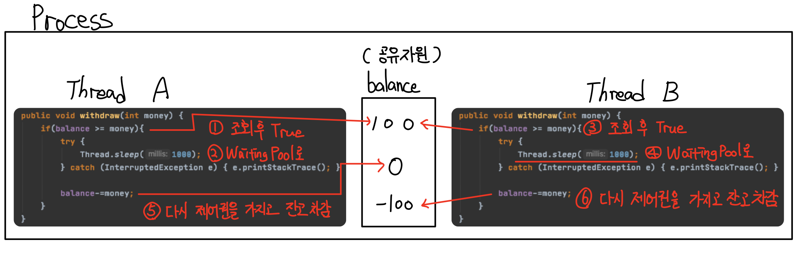
  * 잔고가 100인 상태에서 스레드 1이 조건식(balance >= money)이 true가 되고 balance를 차감하려는 순간 다른 스레드에게 제어권이 넘어가서 다른 스레드가 100을 차감하고 balance는 0이 되었다. 다시 이전의 스레드1이 제어권을 가지고 잔고가 0인 상태에서 100을 출금하여 잔고가 결국 -100이 된 것이다.
* **또 하나의 중요한 점**
  * `Runnable`객체를 하나만 만들어서 두 개의 스레드를 만들었다는 것.
  * 하나의 객체를 두 개의 스레드가 실행한 것.
  * `Account`객체는 하나만을 인스턴스화한다. (공유자원)


> 예제 (동기화한 예제)

```java
class Account {
    private int balance = 1000;

    // READ
    public int getBalance() {
        return this.balance;
    }

    // 동기화한 예제 (READ & WRITE)
    public synchronized void withdraw(int money) {
        if(balance >= money){
            try {
                Thread.sleep(1000);
            } catch (InterruptedException e) { e.printStackTrace(); }

            balance-=money;
        }
    }
}

class ThreadTest implements Runnable {

    Account acc = new Account(); // 공유 자원

    @Override
    public void run() {
        while(acc.getBalance() > 0){
            // 100, 200, 300중의 한 값을 임의로 선택해서 출금
            int money = (int)(Math.random() * 3 + 1) * 100;
            acc.withdraw(money);
            System.out.println("balance : "+acc.getBalance());
        }
    }
}

public class Test {

    public static void main(String[] args){
        Runnable r = new ThreadTest();
        new Thread(r).start();
        new Thread(r).start();
    }
}

// 결과
balance : 900
balance : 700
balance : 400
balance : 100
balance : 0
balance : 0
```

* `withdraw`에 `synchronized`를 한 결과이다.
  * **한 스레드에 의해서 먼저 `withdraw()`가 호출되면, 이 메서드가 종료되어 `lock`이 반납될 때까지 다른 스레드는 `withdraw()`를 호출하더라도 대기상태에 머물게 된다.**


> **`synchronized`를 걸면 그 함수가 포함된 해당 객체(this)에 lock을 건다.**
>
> * `synchronized`가 동기화 문제를 푸는데 **제일 무식하다는 이유**이기도 하다.
>   * 객체 단위로 `Lock`을 건다. (객체에 대한 this)
> * `synchronized`로 인해서 객체에 포함된 다른 모든 `synchronized`의 접근까지 lock이 걸리기 때문이다.


> **`synchronized`를 이용한 동기화는 지정된 영역의 코드를 한 번에 하나의 스레드가 수행하는 것을 보장하는 것 뿐이다.**
>
> * 만약 `Account`의 `balace`가 `public`이라면 아무리 동기화를 해도 **외부에서 직접 접근**이 되기 때문에 값의 변경을 막을 길이 없다. ( 캡슐화 필수 )


### 8-3. wait()과 notify()

`synchronized`로 동기화해서 공유 데이터를 보호하는 것 까지는 좋은데, **특정 스레드가 객체의 락을 가진 상태로 오랜 시간을 보내지 않도록 하는 것도 중요하다.**

하나의 스레드가 한 객체를 동기화해서 오랜 시간 가지고 있으면 성능상의 저하가 발생하기 때문이다.

이러한 문제를 해결하고 **동기화의 효율을 높이기 위한 메서드가 바로 `wait()`과 `notify()`이다.**


#### 8-3-1. 동기화 제어

> `wait()`과 `notify()`는 스레드 동기화를 제어하기 위한 메서드이다.

동기화된 임계 영역의 코드를 수행하다가 작업을 더 이상 진행할 상황이 아니면, 일단 `wait()`을 호출하여 스레드가 락을 반납하고 기다리게 한다. 다른 스레드가 락을 얻어 해당 객체에 대한 작업을 수행할 수 있게 된다.

나중에 작업을 진행할 수 있는 상황이 되면 `notify()`를 호출해서, 작업을 중단했던 스레드가 다시 락을 얻어 작업을 진행할 수 있게 한다.

> 마치 빵을 사려고 빵집 앞에 줄을 서있는 것과 비슷한데, 자신의 차례가 되었는데도 자신이 원하는 빵이 나오지 않았으면, 다음 사람에게 순서를 양보하고 기다리다가 자신이 원하는 빵이 나오면 통보를 받고 빵을 사가는 것이다.


```java
public class Object { // Object에 정의되어 있다!!!
  void wait();
  void wait(long timeout);
  void wait(long timeout, int nanos);
  void notify();
  void notifyAll();
}
```

* `wait()`
  * `wait()`은 `notify()`또는 `notifyAll()`이 호출될 때까지 기다리지만, 매개변수가 있는 `wait()`은 지정된 시간동안만 기다린다. 지정된 시간이 지난 후에 자동적으로 `notify()`가 호출되는 것과 같다.
  * **`waiting pool`은 객체마다 존재한다.**
    * **`notifyAll()`이 호출된다고 해서 모든 객체의 `waiting pool`에 있는 스레드가 깨워지는 것이 아니다.**
    * `notifyAll()`이 호출된 객체의 `waiting pool`에 대기 중인 스레드만 해당된다.

* `notify()`
  * `notify`가 호출되면 해당 객체의 `waiting pool`에 있던 모든 스레드 중에서 **임의의 스레드**만 통지를 받는다.
    * **스레드를 고를 수 없고, 임의의(랜덤) 스레드가 제어권을 가진다.**
* `notifyAll()`
  * `notifyAll()`은 해당 객체의 `waiting pool`에서 기다리고 있는 모든 스레드에게 통지를 보낸다.
  * 모든 스레드가 통지를 받는다고 해도 `lock`의 제어권은 한 스레드만 가지게 되고, 나머지는 다시 `wait`상태가 된다.


> * `wait()`과 `notify()`는 동기화 블록(`synchronized`)내에서만 사용이 가능하다.
> * **`waiting pool`은 객체마다 존재한다.**


#### 8-3-2. 예제

> 동기화를 사용하지 않으면 생기는 문제의 예제
>
> * 생산자(요리사)와 소비자(손님) 문제

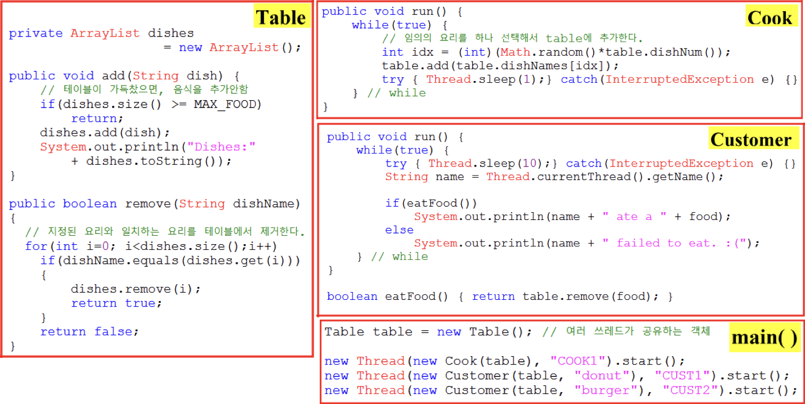

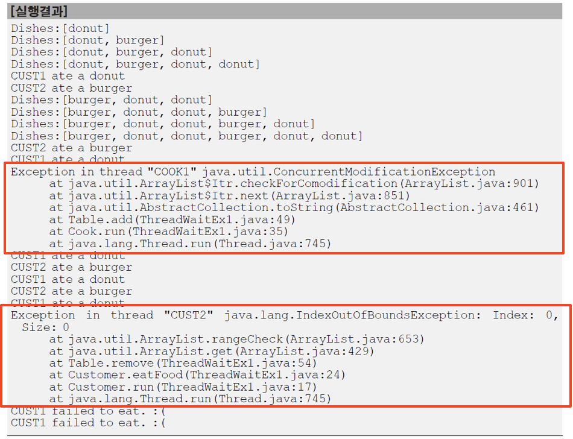

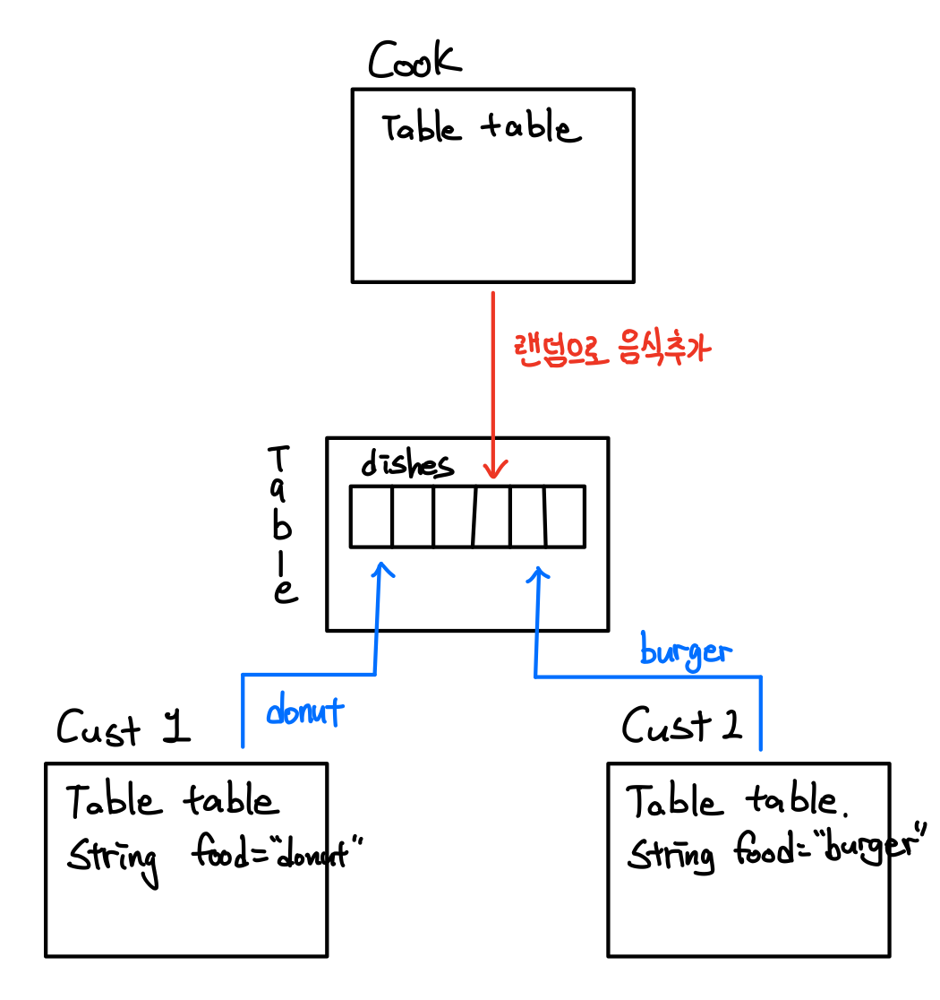

* 문제 1 : 요리사가 `Table`에 요리를 추가하는 과정에 손님이 요리를 먹음. ( `ConcurrentModificationException` )
  * 토론이 필요..
* 문제 2 : 하나 남은 요리를 손님2가 먹으려하는데, 손님 1이 먹음. ( `IndexOutOfBoundsException` )
  * `CUST1` 스레드가 테이블의 마지막 남은 음식을 가져가는 도중에 `CUST2` 스레드가 먼저 음식을 낚아채버려서 있지도 않은 음식을 테이블에서 제거하려 했기 때문에 발생하는 예외.


> 동기화를 한 예제

```java
import java.util.ArrayList;

class Customer implements Runnable{

    private Table table;
    private String food;

    public Customer(Table table, String food) {
        this.table = table;
        this.food = food;
    }

    @Override
    public void run() {
        try { Thread.sleep(10); } catch (InterruptedException e) {}
        String name = Thread.currentThread().getName();

        if(eatFood())
            System.out.println(name + " ate a " + food);
        else
            System.out.println(name + " failed to eat ");
    }

    boolean eatFood() {
        return table.remove(food);
    }
}

class Cook implements Runnable {

    private Table table;

    public Cook(Table table) {
        this.table = table;
    }

    @Override
    public void run() {
        while(true) {
            // 임의의 요리를 하나 선택해서 table에 추가한다.
            int idx = (int) (Math.random() * table.dishNum());
            table.add(table.dishNames[idx]);

            try { Thread.sleep(1); } catch (InterruptedException e) {}
        }
    }
}

class Table {
    String[] dishNames = {"donut", "donut", "burger"};
    final int MAX_FOOD = 6;

    private ArrayList<String> dishes = new ArrayList<>();

    // 요리사가 음식을 추가.
    public synchronized void add(String dish){ // synchronized 추가
        // 테이블에 음식이 가득찼으면, 테이블에 음식을 추가하지 않는다.
        if(dishes.size() >= MAX_FOOD)
            return;
        dishes.add(dish);
        System.out.println("Dished : "+dishes.toString());
    }

    // 소비자가 음식을 먹음.
    public boolean remove(String dishName){
        // 지정된 요리와 일치하는 요리를 테이블에서 제거한다.
        synchronized (this) {
            while(dishes.size() == 0){
                String name = Thread.currentThread().getName();
                System.out.println(name +" is waiting ");
                try { Thread.sleep(500); } catch (InterruptedException e) {}
                // 문제점 : 요리사가 제어권을 가질지, 다른 소비자가 제어권을 가질지 모름.
            }
            for(int i = 0; i < dishes.size(); i++){
                if(dishes.get(i).equals(dishName)){
                    dishes.remove(i);
                    return true;
                }
            }
        }
        return false;
    }

    public int dishNum() {
        return dishNames.length;
    }
}

public class Test {

    public static void main(String[] args){
        Table table = new Table();

        new Thread(new Cook(table), "COOK1").start();
        new Thread(new Customer(table, "donut"), "CUST1").start();
        new Thread(new Customer(table, "burger"), "CUST2").start();

        try { Thread.sleep(5000); } catch (InterruptedException e) {}
        System.exit(0);
    }
}
// 결과 
Dished : [donut]
CUST2 is waiting 
CUST1 ate a donut
CUST2 is waiting 
CUST2 is waiting 
CUST2 is waiting 
CUST2 is waiting 
CUST2 is waiting 
CUST2 is waiting 
CUST2 is waiting 
CUST2 is waiting 
CUST2 is waiting 
```

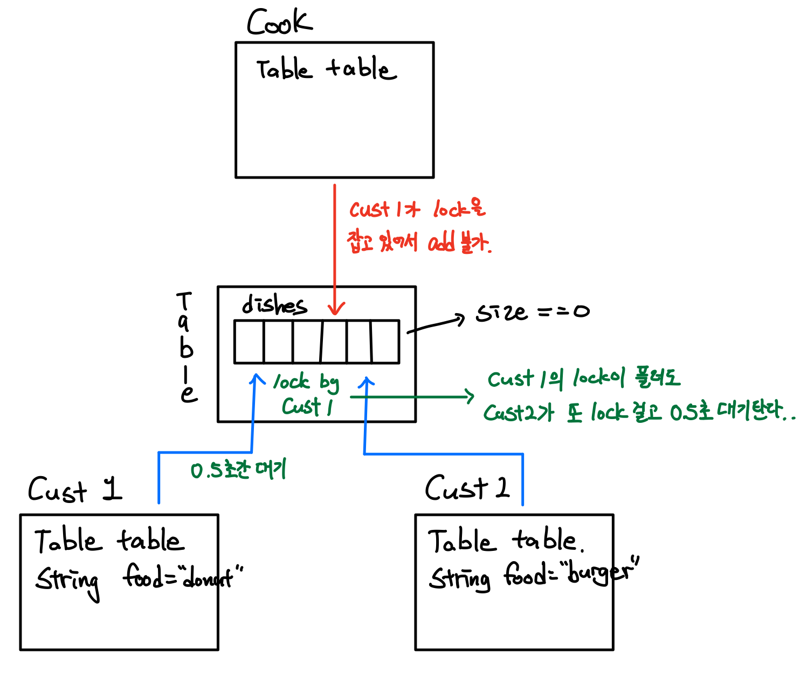

* 여러 스레드가 공유하는 객체인 `Table`의 `add()`와 `remove()`를 동기화하였다.
  * 손님 스레드가 음식이 테이블에 없으면, `failed to eat`을 출력하고, 테이블에 음식이 하나도 없으면, 0.5초마다 음식이 추가되었는지 확인하면서 기다리도록 작성되어 있다.
  * **요리사 스레드는 왜 음식을 추가 하지 않을까?**
    * **손님 스레드가 테이블 객체의 `lock`을 쥐고 기다리기 때문이다.**
    * **요리사 스레드가 음식을 새로 추가하려해도 테이블 객체의 `lock`을 얻을 수 없어서 불가능하다.**


> 객체마다 `lock`을 위한 `lock waiting`이 있다.
>
> * 스레드 1이 객체1의 `lock`을 걸고, `sleep`되었다면 다른 스레드는 객체1에 접근이 안된다.


> `wait()`과 `notify()`를 사용한 예제

```java
import java.util.ArrayList;

class Customer implements Runnable{

    private Table table;
    private String food;

    public Customer(Table table, String food) {
        this.table = table;
        this.food = food;
    }

    @Override
    public void run() {
        try { Thread.sleep(10); } catch (InterruptedException e) {}
        String name = Thread.currentThread().getName();

        table.remove(food);
        System.out.println(name + " ate a "+food);
    }
}

class Cook implements Runnable {

    private Table table;

    public Cook(Table table) {
        this.table = table;
    }

    @Override
    public void run() {
        while(true) {
            // 임의의 요리를 하나 선택해서 table에 추가한다.
            int idx = (int) (Math.random() * table.dishNum());
            table.add(table.dishNames[idx]);

            try { Thread.sleep(1); } catch (InterruptedException e) {}
        }
    }
}

class Table {
    String[] dishNames = {"donut", "donut", "burger"};
    final int MAX_FOOD = 6;

    private ArrayList<String> dishes = new ArrayList<>();

    // 요리사를 위한 메서드.
    public synchronized void add(String dish){ // synchronized 추가
        // 테이블의 사이즈가 꽉 찼으면, 다른 스레드에게 락을 넘기고 0.5초동안 sleep한다.
        while(dishes.size() >= MAX_FOOD){
            String name = Thread.currentThread().getName();
            System.out.println(name + " is waiting ");
            try {
                wait();
                Thread.sleep(500);
            } catch (InterruptedException e) {}
        }
        dishes.add(dish);
        notify(); // 기다리고 있는 CUST를 깨우기 위함.
        System.out.println("Dished : "+dishes.toString());
    }

    // 손님을 위한 메서드
    public void remove(String dishName){
        // 지정된 요리와 일치하는 요리를 테이블에서 제거한다.
        synchronized (this) {
            String name = Thread.currentThread().getName();
            // 테이블이 비어 있다면. (IndexOutOfBounding을 막기 위한 코드)
            while(dishes.size() == 0){
                System.out.println(name +" is waiting ");
                try {
                    wait(); // COOK스레드가 테이블에 추가할 수 있게, CUST스레드를 기다리게 한다.
                    Thread.sleep(500);
                } catch (InterruptedException e) {}
            }

            // 계속해서 자기가 원하는 음식이 나오면 먹는다.
            while(true){
               	// 원하는 음식이 있으면 remove
                for(int i = 0; i < dishes.size(); i++){
                    if(dishes.get(i).equals(dishName)){
                        dishes.remove(i);
                        notify(); // 잠자고 있는 COOK을 깨우기 위함.
                        return;
                    }
                }

                try {
                    System.out.println(name +" is waiting ");
                    wait(); // 원하느 음식이 없는 CUST스레드를 기다리게 한다.
                    Thread.sleep(500);
                } catch (InterruptedException e) {}
            }

        }

    }

    public int dishNum() {
        return dishNames.length;
    }
}

public class Test {

    public static void main(String[] args){
        Table table = new Table();

        new Thread(new Cook(table), "COOK1").start();
        new Thread(new Customer(table, "donut"), "CUST1").start();
        new Thread(new Customer(table, "burger"), "CUST2").start();

        try { Thread.sleep(5000); } catch (InterruptedException e) {}
        System.exit(0);
    }
}

// 결과 
Dished : [donut]
CUST2 is waiting 
CUST1 ate a donut
CUST2 is waiting 
Dished : [burger]
CUST2 ate a burger
Dished : [donut]
Dished : [donut, donut]
Dished : [donut, donut, donut]
Dished : [donut, donut, donut, donut]
Dished : [donut, donut, donut, donut, donut]
Dished : [donut, donut, donut, donut, donut, donut]
COOK1 is waiting 
```


* 비교적 잘 돌아가는 듯 보인다. `wait()`과 `notify()`를 추가한 예제이다.
  * 음식이 없을 때, `wait()`으로 손님이 `lock`을 풀고 기다리게한다.
  * 요리사가 음식을 추가하면, `notify()`로 손님에게 알린다. (손님이 `lock`을 재획득)
* 문제
  * **만일 테이블의 음식이 줄어들어서 `notify()` 된다면, 요리사 스레드가 통지를 받아야 한다. 하지만 `notify()`는 그저 `waiting pool`에서 대기 중인 스레드 중에서 하나를 임의로 선택해서 통지할 뿐, 요리사 스레드를 선택해서 통지할 수 없다.**


> **기아 현상과 경쟁 상태**
>
> * **기아 현상 (starvation)**
>   * **기아란 OS에서 프로세스나 스레드가 수행이 가능한 상황임에도 불구하고 매우 오랜 기간 대기하는 현상을 말한다.**
>   * 요리사 스레드는 계속 통지는 받지 못하고 오랫동안 기다리게 되는데 이것을 기아현상이라고 한다.
>   * **해결방법**
>     * `notifyAll()`로 `waiting pool`에 있는 모든 스레드에게 통지한다.
> * **경쟁 상태 (race condition)**
>   * 프로세스나 스레드가 하나의 자원을 갖기 위해 싸우는 것. 
>   * **하나의 자원을 동시에 요청**
>   * `notifyAll()`로 요리사 스레드의 기아현상은 막았지만, 손님 스레드까지 통지를 받아서 불필요하게 요리사 스레드와 `lock` 을 얻기 위해 경쟁하게 된다.
>   * **해결방법**
>     * 요리사(공급자)와 손님(소비자)의 스레드에게 구별해서 통지하는 것이 필요하다.


### 8-4. Lock과 Condition을 이용한 동기화

> 8-3-2 마지막 예제를 보면 요리사(공급자)와 손님(소비자)의 스레드가 같은 `waiting pool`에 존재하므로 기아 현상과 경쟁 상태가 발생한다. 이를 해결하기 위해서는 요리사와 손님의 스레드를 각자 따른 `waiting pool`에 넣어줘야 한다.


> Lock의 종류

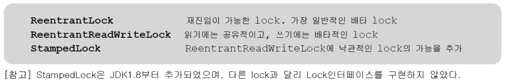

* `ReentrantLock`
  * `Reentrant` : 재진입할 수 있는
  * 특정 조건에서 `lock`을 풀고 나중에 다시 `lock`을 얻고 임계영역으로 들어와서 이후의 작업을 수행할 수 있다.
  * `wait()`과 `notify()`와 같은 락
* `ReetrantReadWriteLock`
  
  * 읽기를 위한 `lock`과 쓰기를 위한 `lock`이 존재한다.
  
  * 읽기 `lock`이 걸려있어도, 다른 스레드가 읽기 `lock`을 중복해서 걸고 읽기를 할 수 있다.

  * 읽기 `lock`이 걸린 상태에서 쓰기 `lock`을 거는 것은 허용되지 않는다.
    
    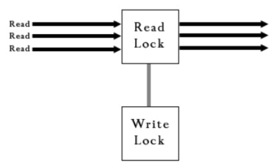
    
    * 반대로 쓰기 `lock`이 걸려있을때 모든 읽기 `lock`을 거는 것이 허용되지 않는다.
    
      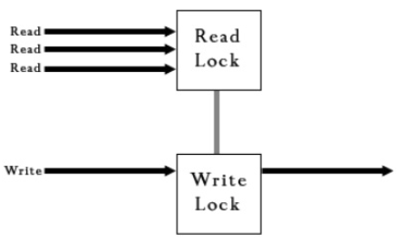
  
* `StampedLock`
  
  * `ReetrantReadWriteLock`에 `낙관적 읽기 lock`을 추가했다.
  * `lock`을 걸거나 해지할 때 스탬프(`long`타입의 정수값)를 사용한다.
  * 무조건 읽기 `lock`을 걸지 않고, 쓰기와 읽기가 충돌될 때만 쓰기가 끝난 후에 읽기 `lock`을 건다


### 8-5. volatile

> volatile의 사전적 의미
>
> * 변덕스러운, 불안한, 휘발성의

**코어는 메모리에서 읽어온 값을 캐시에 저장하고 캐시에서 값을 읽어서 작업한다. 다시 같은 값을 읽어올 때는 먼저 캐시에 있는지 확인하고 없을 때만 메모리에서 읽어온다. ( 성능 향상을 위함 )**


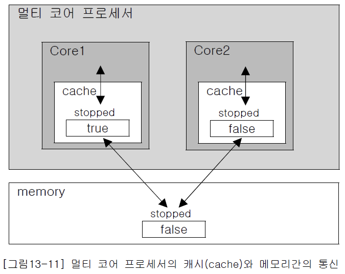

* **`volatile`는 Java 변수를 Main Memory(RAM)에 저장하겠다는 것을 명시하는 것이다.**
  * 매번 변수의 값을 Read나 Write할 때마다 CPU chche가 아닌 Main Memory(RAM)에서 읽고 저장한다.

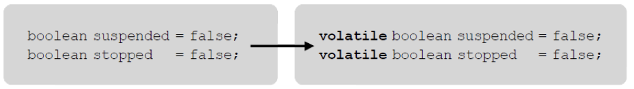

* 자바에서는 `volatile`을 붙여주면 해결이 된다.


> **왜 필요할까?**

```java
public class SharedObject {
  public int counter = 0;
}
```

* `SharedObject`를 공유하는 두 개의 Thread가 있다.
  * `Thread-1`는 `counter`값을 더하고 읽는 연산을 한다. (Read & Write)
  * `Thread-2`는 `counter`값을 읽기만 한다. (Only Read)


* `Thread-1`은  `counter`값을 증가시키고 있지만 `CPU Cache`에만 반영되어 있고 실제로 Main Memory(RAM)에는 반영되지 않는다. 그렇기 때문에 `Thread-2`는 `counter`값을 계속 읽어오지만 0을 가져오는 문제가 발생한다.


> **언제 `volatile`를 사용해야 할까?**
>
> * **멀티 스레드 환경에서 하나의 `Thread`만 `Read & Write`하고 나머지 `Thread`가 `Read`하는 상황에서 가장 최선의 값을 보장한다.**

* `Thread-1`는 값을 읽어 1을 추가하는 연산을 진행한다.
  * 추가된 변수는 아직 Main Memory에 반영되기 전 상황
* `Thread-2`도 값을 읽어 1을 추가하는 연산을 진행한다.
  * 추가된 변수는 아직 Main Memory에 반영되기 전 상황
* 두 개의 `Thread`가 1을 추가하는 연산을 하여 최종결과가 2가 되어야 하는 상황이지만?
  * 각각 결과를 Main Memory(RAM)에 반영하게 된다면 1만 남는 상황이 발생하게 된다.

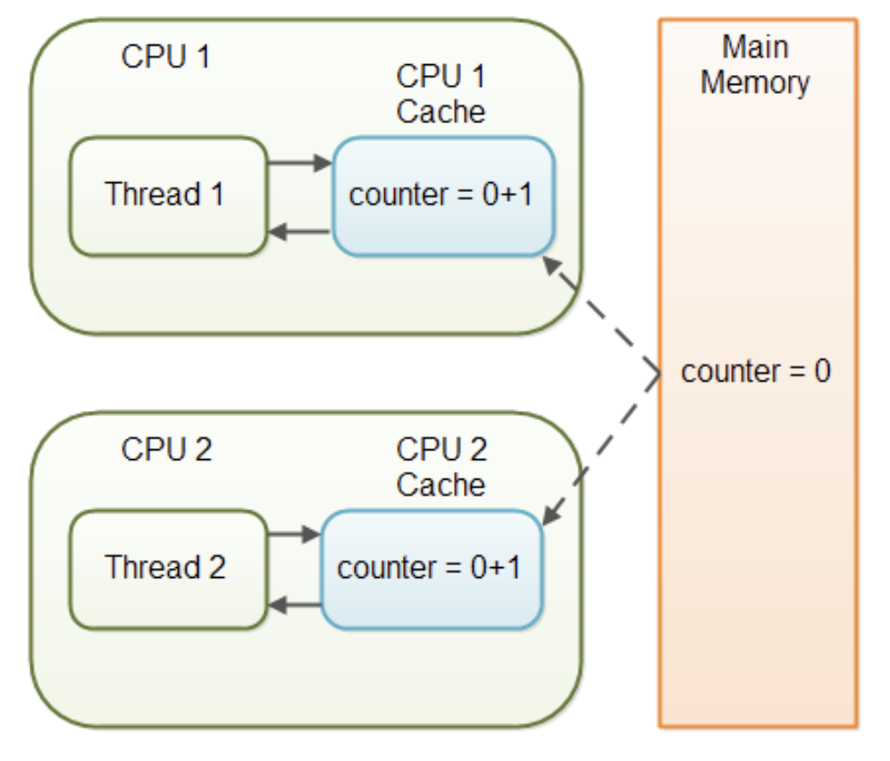

* **하나의 `Thread`가 아닌 여러 `Thread`가 `Write`하는 상황에서는 적합하지 않다.**
* **여러 `Thread`가 `Write`하는 상황이라면**
  * **`synchronized`를 통해 변수 `Read & Write`의 원자성(atomic)을 보장해야 한다.**


#### 8-5-1. 원자성

> 사전적 의미
>
> * 어떤 것이 더 이상 쪼개질 수 없는 성질.
> * 어떠한 작업이 실행될 때 언제나 완전하게 진행되어 종료되거나, 그럴 수 없는 경우 실행을 하지 않는 경우를 말한다.
> * 원자성을 가지는 작업은 실행되어 진행하다가 종료하지 않고 중간에서 멈추는 경우는 있을 수 없다.


> JVM의 원자성

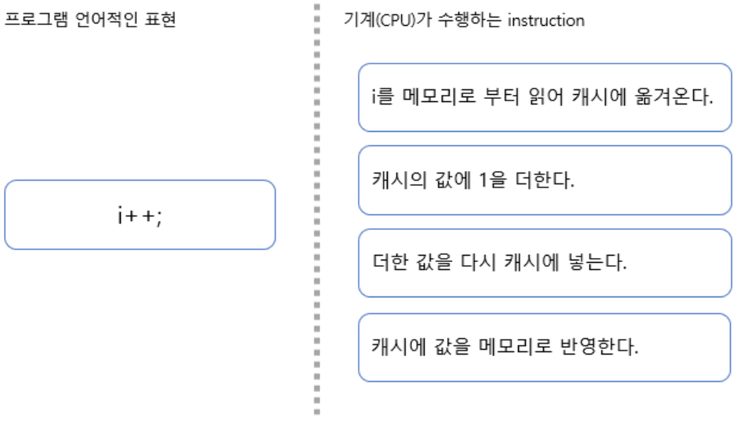

* JVM은 데이터를 `4byte(=32bit)` 단위로 처리하기 때문에, `int`와 `int`보다 작은 타입들은 한 번에 읽거나 쓰는 것이 가능하다. 
  * 즉, 단 하나의 명령어로 읽거나 쓰기가 가능하다.
  * 이는 더 이상 나눌 수 없는 최소의 작업 단위이므로, 작업의 중간에 다른 스레드가 끼어들 틈이 없다.
* 크기가 `8bytes`인 `long`과 `double` 타입의 변수는 하나의 명령어로 값을 읽거나 쓸 수 없다.
  * 즉, 변수의 값을 읽는 과정에서 다른 스레드가 끼어들 여지가 있다. (원자성을 보장해야 한다.)
  * 이를 방지하기 위해 변수를 읽고 쓰는 모든 문장을 `synchronozied`블럭으로 감싸거나 변수를 선언할 때 `volatile` 을  붙이는 것이다.

> `synchronized`블럭은 여러 문장을 원자화함으로써 스레드의 동기화를 구현하는 것이다.
>
> * 스레드가 `synchronized`블럭으로 들어갈 때와 나올 때, 캐시와 메모리간의 동기화가 이루어져서 값의 불일치가 해소된다.
>
> 하지만 `volatile`은 변수의 읽거나 쓰기를 원자화 할 뿐, 동기화하는 것은 아니다.


## 9. 스레드 풀

https://limkydev.tistory.com/55


