[자바의 정석](http://www.yes24.com/Product/Goods/24259565?OzSrank=2)을 바탕으로 정리한 자료입니다.


# 목차

- [날짜와 시간](#날짜와-시간)
  * [1. 날짜, 시간 관련 클래스의 역사](#1-날짜-시간-관련-클래스의-역사)
    + [1-1. Date클래스 (JDK 1.0 - 1995)](#1-1-date클래스--jdk-10---1995-)
    + [1-2. Calendar클래스 (JDK 1.1 - 1997)](#1-2-calendar클래스--jdk-11---1997-)
    + [1-3. time패키지 (JDK 1.8 - 2014)](#1-3-time패키지--jdk-18---2014-)
  * [2. Calendar클래스](#2-calendar클래스)
    + [2-1. Calendar 객체 생성](#2-1-calendar-객체-생성)
      - [getInstance()](#getinstance--)
    + [2-2. get()](#2-2-get--)
      - [Calendar에 정의된 필드 ( `Calendar.xxx` )](#calendar에-정의된-필드----calendarxxx---)
    + [2-3. set()](#2-3-set--)
    + [2-4. 두 날짜간의 차이 구하기](#2-4-두-날짜간의-차이-구하기)
    + [2-5. add()](#2-5-add--)
      - [roll()](#roll--)
  * [3. 형식화 클래스](#3-형식화-클래스)
    + [3-1. DecimalFormat](#3-1-decimalformat)
    + [3-2. SimpleDateFormat](#3-2-simpledateformat)
  * [4 LocalDate, LocalTime, LocalDateTime](#4-localdate-localtime-localdatetime)
    * [4-1 Calendar, Date 클래스의 문제점](#4-1-calendar-date-클래스의-문제점)
      + [불변 객체가 아니다](#불변-객체가-아니다)
      + [상수 필드 남용](#상수-필드-남용)
      + [헷갈리는 월 지정](#헷갈리는-월-지정)
      + [일관성 없는 요일 상수](#일관성-없는-요일-상수)
      + [Date와 Calendar 객체의 역할 분담](#date와-calendar-객체의-역할-분담)
    * [4-2 LocalDate, LocalTime, LocalDateTime 사용법](#4-2-localdate-localtime-localdatetime-사용법)
      + [LocalDate](#localdate)
      + [LocalTime](#localtime)
      + [LocalDateTime](#localdatetime)


# 날짜와 시간

자바에서 날짜, 시간과 관련된 클래스는 아래와 같다.

* `java.util.Date`
* `java.util.Calendar`
* `java.time.*`


## 1. 날짜, 시간 관련 클래스의 역사

### 1-1. Date클래스 (JDK 1.0 - 1995)

* 날짜와 시간을 다룰 목적으로 만들어진 클래스 
* **`Date`의 메서드는 거의 `deprecated`되었지만, 여전히 쓰이고 있다.**

> deprecated : 앞으로 사용하지 말라는 의미.


### 1-2. Calendar클래스 (JDK 1.1 - 1997)

* `Date`클래스의 단점을 개선해서 만들어진 클래스
  * 여전히 단점이 존재하긴 하다.
* 정말 오래오래 사용해왔다. (17년)


### 1-3. time패키지 (JDK 1.8 - 2014)

* `Date`와 `Calendar`의 단점을 개선한 새로운 클래스들을 제공.
  * **`Date`와 `Calendar`의 단점**
    * 날짜와 시간을 같이 다룸. 
    * 불변으로 처리를 못한다.
* **`time`패키지 에서는 `LocalDate`와 `LocalTime`으로 나눠진다.** 
  * 같이 쓰일 때는 `LocalDateTime`을 사용한다.
  * 즉, 클래스들을 나눠놨다.


> 앞으로는 `time`패키지는 쓰겠지만, 아직 실무에서는 `Calendar`클래스를 많이 사용한다.


## 2. Calendar클래스

현업에서는 대부분 Calendar클래스를 사용하고 있기 때문에, 알고 넘어가야 할 내용이다.

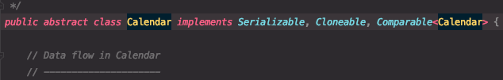


### 2-1. Calendar 객체 생성

```java
Calendar cal = new Calendar(); // 에러! 추상클래스는 인스턴스를 생성할 수 없다.

// getInstance()메서드는 Calendar클래스를 구현한 클래스의 인스턴스를 반환한다.
Calendar cal = Calendar.getInstance; 
```

* Calendar은 추상 클래스이므로 `getInstance()`를 통해 구현된 객체를 얻어야 한다.
  * Calendar은 추상클래스이다.


#### getInstance()

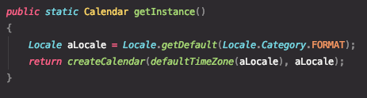

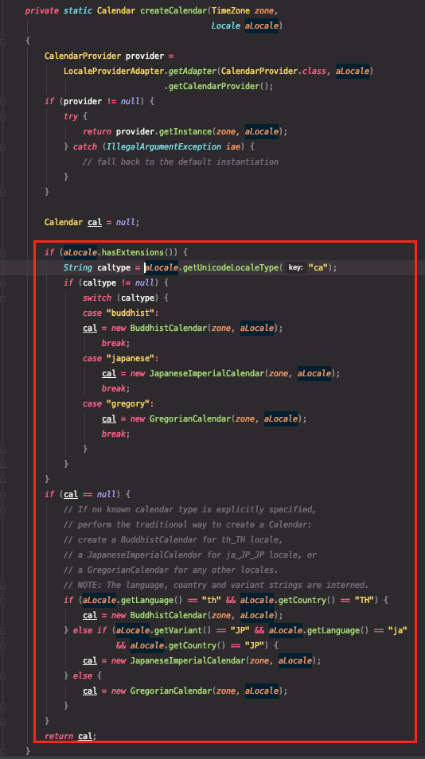

* Calendar은 `getInstance()`를 사용해서 객체를 얻기 때문에 static메서드이다.
* getInstance()는 사용자 시스템의 국가와 지역설정을 확인해서 해당 지역의 Calendar의 객체를 반환한다.
* Calendar의 종류
  * 서양력
  * 불교력
  * 일본렬


> **굳이 getInstance()를 사용하는 이유는?**
>
> * 추상화를 위함이다. 
> * **상황에 맞는 객체를 받기 위함. (현재 위치한 달력을 받기 위함.)**
>
> ```java
> Calendar cal = new GregorianCalendar();
> ```
>
> 위처럼 객체를 생성하면 사용자가 다른 달력을 쓰고 싶을때, 하나하나 직접 변경을 해줘야 한다.
>
> 하지만, getInstance()를 통한다면 사용자는 상황에 따라 변경을 안해줘도 원하는 객체를 받을 수 있다.


### 2-2. get()

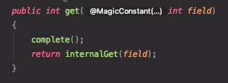

* get()으로 날짜와 시간 필드 가져오기

```java
Calendar cal = Calendar.getInstance(); // 현재 날짜와 시간으로 셋팅됨.
int thisYear = cal.get(Calendar.YEAR); // 올해가 몇년인지 알아낸다.
int lastDayOfMonth = cal.getActualMaximum(Calendar.DATE); // 이 달의 마지막날.
```


#### Calendar에 정의된 필드 ( `Calendar.xxx` )

> 날짜

| **필드명**           | **설 명**                           |
| -------------------- | ----------------------------------- |
| YEAR                 | 년                                  |
| MONTH                | 월(0부터  시작)                     |
| WEEK_OF_YEAR         | 1월 1일부터 지금까지 몇번째 주인지? |
| WEEK_OF_MONTH        | 그  달의 몇 번째 주                 |
| DATE                 | 일                                  |
| DAY_OF_MONTH         | 그  달의 몇 번째일                  |
| DAY_OF_YEAR          | 그  해의 몇 번째일                  |
| DAY_OF_WEEK          | 요일                                |
| DAY_OF_WEEK_IN_MONTH | 그  달의 몇 번째 요일               |

* MONTH - 0부터 시작된다.
  * 7이 반환되면 8월을 의미.
* DAY_OF_WEEK - 1~7
  * 1 : 일요일


> 시간

| **필드명**  | **설 명**                        |
| ----------- | -------------------------------- |
| HOUR        | 시간(0~11)                       |
| HOUR_OF_DAY | 시간(0~23)                       |
| MINUTE      | 분                               |
| SECOND      | 초                               |
| MILLISECOND | 천분의  일초                     |
| ZONE_OFFSET | GMT기준  시차(천분의  일초 단위) |
| AM_PM       | 오전/오후                        |


> 예제

```java
// 기본적으로 현재날짜와 시간으로 설정된다.
Calendar today = Calendar.getInstance();
System.out.println("이 해의 년도 : " + today.get(Calendar.YEAR));
System.out.println("월(0~11, 0:1월): "	+ today.get(Calendar.MONTH));
System.out.println("이 해의 몇 째 주: "		+ today.get(Calendar.WEEK_OF_YEAR));
System.out.println("이 달의 몇 째 주: "		+ today.get(Calendar.WEEK_OF_MONTH));
// DATE와 DAY_OF_MONTH는 같다.
System.out.println("이 달의 몇 일: "	+ today.get(Calendar.DATE));
System.out.println("이 달의 몇 일: "	+ today.get(Calendar.DAY_OF_MONTH));
System.out.println("이 해의 몇 일: "	+ today.get(Calendar.DAY_OF_YEAR));
System.out.println("요일(1~7, 1:일요일): " + today.get(Calendar.DAY_OF_WEEK)); 
// 1:일요일, 2:월요일, ... 7:토요일
System.out.println("이 달의 몇 째 요일: "	+ today.get(Calendar.DAY_OF_WEEK_IN_MONTH));
System.out.println("오전_오후(0:오전, 1:오후): " + today.get(Calendar.AM_PM));
System.out.println("시간(0~11): "	+ today.get(Calendar.HOUR));
System.out.println("시간(0~23): "	+ today.get(Calendar.HOUR_OF_DAY));
System.out.println("분(0~59): "	+ today.get(Calendar.MINUTE));
System.out.println("초(0~59): "	+ today.get(Calendar.SECOND));
System.out.println("1000분의 1초(0~999): " + today.get(Calendar.MILLISECOND));

// 천분의 1초를 시간으로 표시하기 위해 3600000으로 나누었다.(1시간 = 60 * 60초)
System.out.println("TimeZone(-12~+12): " + (today.get(Calendar.ZONE_OFFSET)/(60*60*1000)));
System.out.println("이 달의 마지막 날: " + today.getActualMaximum(Calendar.DATE) ); 
// 이 달의 마지막 일을 찾는다.

// 결과 (2020년 7월 1일 기준)
이 해의 년도 : 2020
월(0~11, 0:1월): 6
이 해의 몇 째 주: 27
이 달의 몇 째 주: 1
이 달의 몇 일: 1
이 달의 몇 일: 1
이 해의 몇 일: 183
요일(1~7, 1:일요일): 4
이 달의 몇 째 요일: 1
오전_오후(0:오전, 1:오후): 1
시간(0~11): 4
시간(0~23): 16
분(0~59): 12
초(0~59): 10
1000분의 1초(0~999): 551
TimeZone(-12~+12): 9
이 달의 마지막 날: 31
```


### 2-3. set()

```java
void set(int field, int value);
void set(int year, int month, int date);
void set(int year, int month, int date, int hourOfDay, int minute);
void set(int year, int month, int date, int hourOfDay, int minute, int second);
```

* 날짜와 시간을 원하는 값으로 변경하는 메서드.

```java
Calendar cal1 = Calendar.getInstance();
Calendar cal2 = Calendar.getInstance();

// cal1의 시간을 10시 20분 30초로 설정
cal1.set(Calendar.HOUR_OF_DAY, 10);
cal1.set(Calendar.MINUTE, 20);
cal1.set(Calendar.SECOND, 30);

// cal2의 시간을 20시 30분 10초로 설정
cal2.set(Calendar.HOUR_OF_DAY, 20);
cal2.set(Calendar.MINUTE, 30);
cal2.set(Calendar.SECOND, 10);

System.out.println("cal1 : "+cal1.get(Calendar.HOUR_OF_DAY)+"시 "+cal1.get(Calendar.MINUTE)+"분 "+cal1.get(Calendar.SECOND)+"초.");
System.out.println("cal2 : "+cal2.get(Calendar.HOUR_OF_DAY)+"시 "+cal2.get(Calendar.MINUTE)+"분 "+cal2.get(Calendar.SECOND)+"초.");

// 결과
cal1 : 10시 20분 30초.
cal2 : 20시 30분 10초.
```


### 2-4. 두 날짜간의 차이 구하기

* **두 날짜간의 차이를 구하기 위해서는 두 날짜를 최소단위인 초단위로 변경한 다음 그 차이를 구하면 된다.**
* `getTimeInMillis();`
  * 1/1000초 단위로 값을 반환한다.
  * 초 단위로 얻기 위해서는 `getTimeInMillis()/1000`을 해주어야 한다.
    * **1초 = 1000밀리세컨드**
    * **1분 = 60*1초 = 60000**
  * 일 단위로 얻기 위해서는 `getTimeInMillis()/(24시간 * 60분 * 60초 * 1000)`로 해줘야한다.

```java
// 두 시간의 차이 구하기
long difference = Math.abs(cal2.getTimeInMillis() - cal1.getTimeInMillis())/1000;
System.out.println("cal1과 cal2의 차이는 "+difference+"초 입니다.");

// 시간, 분, 초로 변환
int[] TIME_UNIT = {3600, 60, 1};
String[] TIME_UNIT_NAME = {"시간","분","초"};
String tmp = ""; // StringBuilder를 쓰는게 효율적이다.
for(int i = 0; i < TIME_UNIT.length; i++){
  tmp += (difference/TIME_UNIT[i])+TIME_UNIT_NAME[i]+" ";
  difference %= TIME_UNIT[i];
}
System.out.println("시분초로 변환하면 "+tmp);

// 결과
cal1과 cal2의 차이는 36580초 입니다.
시분초로 변환하면 10시간 9분 40초.
```


### 2-5. add()

* `add(int field, int amount)`를 사용하면 지정한 필드의 값을 원하는 만큼 증가 또는 감소시킬 수 있다.
  * 'xxx일 후' 같이 시간 연산을 쉽게 도와준다.

```java
public class Main {

    public static String toString(Calendar date){
        return date.get(Calendar.YEAR)+"년 "+(date.get(Calendar.MONTH)+1)+"월 "+date.get(Calendar.DATE)+"일 ";
    }

    public static void main(String[] args) throws IOException {

        Calendar date = Calendar.getInstance();

        date.set(2005, 7, 31); //2005년 08월 31일

        toString(date);
        System.out.println("= 1일 후 =");
        date.add(Calendar.DATE, 1);
        System.out.println(toString(date));

        System.out.println("= 6달 전 =");
        date.add(Calendar.MONTH, -6);
        System.out.println(toString(date));

        System.out.println("= 31일 후 (roll) =");
        date.roll(Calendar.DATE, 31);
        System.out.println(toString(date));

        System.out.println("= 31일 후 (add) =");
        date.add(Calendar.DATE, 31);
        System.out.println(toString(date));
        
    }
}
// 결과
= 1일 후 =
2005년 9월 1일 
= 6달 전 =
2005년 3월 1일 
= 31일 후 (roll) =
2005년 3월 1일 
= 31일 후 (add) =
2005년 4월 1일
```

#### roll()

* add와 똑같이 지정한 필드의 값을 증가 또는 감소시킬 수 있다.
  * **단, add와 다르게 다른 필드에 영향을 끼치지 않는다. (위에 예제 참고)**


## 3. 형식화 클래스

점수의 평균을 소수점 2자리로 일정하게 맞춰서 출력하는 것과 날짜를 형식에 맞게 출력하는 것은 생각보다 귀찮은 일이다.

이를 쉽게 도와주는 라이브러리가 바로 `java.text`패키지에 포함되어 있는 형식화 클래스들이다.


### 3-1. DecimalFormat

`DecimalFormat`은 숫자를 형식화 하는데 사용된다. 

`DecimalFormat`을 이용하면 **숫자 데이터를 정수, 부동소수점, 금액 등의 다양한 형식으로 표현**할 수 있다.

반대로 일정한 형식의 **텍스트 데이터를 숫자로 쉽게 변환**하는 것도 가능하다.

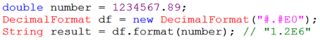

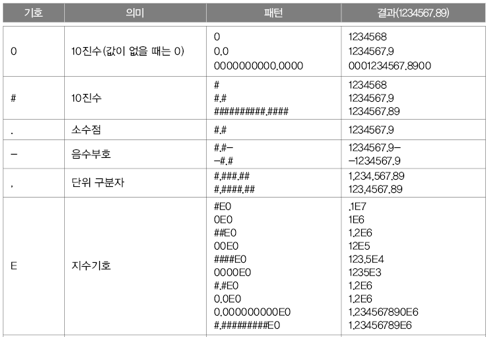

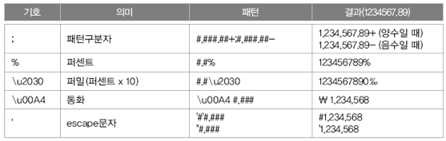

* 특정 형식으로 되어 있는 문자열에서 숫자를 뽑아낼 수 있다.

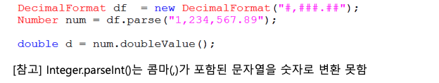


### 3-2. SimpleDateFormat

날짜를 계산할 때 Date와 Calendar를 사용해서 날짜를 계산했다.

SimpleDateFormat은 날짜 데이터를 원하는 형태로 다양하게 출력하는 것을 도와주는 클래스이다.

* 날짜와 시간을 다양한 형식으로 출력할 수 있게 해준다.

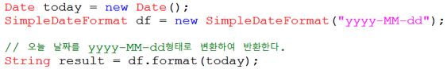

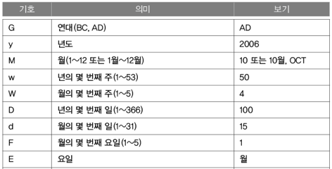

* 특정 형식으로 되어 있는 문자열에서 날짜와 시간을 뽑아낼 수도 있다.

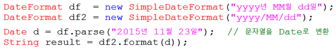

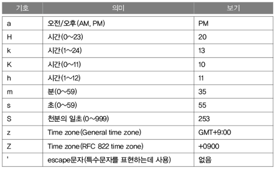


## 4 LocalDate, LocalTime, LocalDateTime

본 내용은 [D2 - Java의 날짜와 시간 API](https://d2.naver.com/helloworld/645609)를 참고하였습니다.


### 4-1 Calendar, Date 클래스의 문제점

기존의 `Calendar`와 `Date`는 많은 문제점을 가지고 있으며, 이러한 문제점을 개선한 Joda-Time 같은 오픈소스 라이브러리가 만들어지기도 했다.

JDK 1.8부터는 Joda-Time 라이브러리를 참고하여 Time 클래스를 지원한다.


#### 불변 객체가 아니다

🤔 불변 객체란?

* VO (Value Object)
  * VO는 값에 의해 동등성이 판단되는 객체이다.
  * VO는 완전한 불변 객체일 때 별칭 문제, 스레드 불안정성 등의 부작용에서 자유롭고 여러 객체에서 공유되어도 안전하다.
  * 대표적인 예시 - 날짜, 돈
* 즉, 날짜는 한번 생성된 이후에는 내부 속성을 바꿀 수 없다.


:scream: Java의 기본 날짜, 시간 클래스는 불변 객체가 아니다

* Java의 기본 날짜, 시간 클래스는 `set`을 통해 속성을 변경할 수 있다.
* 이 때문에 날짜, 시간 클래스가 여러 객체에서 공유되면 한 곳에서 바꾼 값이 다른 곳에 영향을 미칠 부작용이 생길 수 있다.


#### 상수 필드 남용

```java
calendar.add(Calendar.SECOND, 2);
```

* 첫 번째 파라미터로 `Calendar.JUNE`과 같이 전혀 엉뚱한 상수가 들어가도 이를 컴파일 시점에서 확인할 방법이 없다.


#### 헷갈리는 월 지정

```java
calendar.set(1582, Calendar.OCTOBER, 4); // 1582년 10월 4일로 지정하는 코드
```

* 월에 해당하는 `Calendar.OCTOBER` 값은 실제로 9이다.
  * JDK 1.0에서 `Date` 클래스를 1월을 0으로 표현해서 그렇다.


#### 일관성 없는 요일 상수

어디서는 일요일이 0, 어디서는 일요일이 1이다.


#### Date와 Calendar 객체의 역할 분담

* 년/월/일 계산은 Date 클래스만으로는 부족해서 왔다갔다하는 문제가 존재한다.
* Calendar객체를 생성하고 Date객체를 생성하는 프로세스를 거치기 때문에 생성비용이 비싸다.


### 4-2 LocalDate, LocalTime, LocalDateTime 사용법

> 출처 : http://jekalmin.tistory.com/entry/%EC%9E%90%EB%B0%94-18-%EB%82%A0%EC%A7%9C-%EC%A0%95%EB%A6%AC


#### LocalDate

`LocalDate` 기본적인 사용 방법

```java
LocalDate currentDate = LocalDate.now(); // 2020-10-16
// LocalDate.of(int year, int month, int dayOfMonth);
LocalDate ofDate = LocalDate.of(2020, 10, 16); // 2020-10-16

int year = currentDate.getYear(); // 2020
Month month = currentDate.getMonth(); // OCTOBER -> enum (JANUARY, FEBRUARY ... )
int monthInt = currentDate.getMonthValue(); // 10
int dayOfYear = currentDate.getDayOfYear(); // 2020년의 몇 번째 일 = 290
int dayOfMonth = currentDate.getDayOfMonth(); // 10월의 몇 번째 일 = 16
DayOfWeek dayOfWeek = currentDate.getDayOfWeek(); // 요일 (FRIDAY) -> enum (MONDAY, TUESDAY, ... )
boolean leapYear = currentDate.isLeapYear(); // 윤년여부
```


#### LocalTime

`LocalTime` 기본적인 사용방법

```java
LocalTime currentTime = LocalTime.now(); // 현재 컴퓨터의 시간 정보 => 03:21:43.758563
// LocalTime.of(int hour, int minute, int second, int nanoOfSecond)
LocalTime ofTime = LocalTime.of(3, 21, 43);

int hour = currentTime.getHour(); // 3
int minute = currentTime.getMinute(); // 21
int second = currentTime.getSecond(); // 43
int nanoSecond = currentTime.getNano(); // 758563
```


#### LocalDateTime

`LocalDateTime` 기본적인 사용방법

```java
LocalDateTime currentDateTime = LocalDateTime.now(); // 컴퓨터의 현재 날짜와 시간 정보 : 2020-10-16T03:26:23.470419
// LocalDateTime.of(int year, int month, int dayOfMonth, int hour, int minute, int second, int nanoOfSecond)
LocalDateTime ofDateTime = LocalDateTime.of(currentDate, currentTime);
```

시간 / 날짜 변환

```java
// LocalDate -> String
LocalDate.of(2020, 8, 19).format(DateTimeFormatter.BASIC_ISO_DATE); // 20200819

// LocalDateTime -> String
LocalDateTime.now().format(DateTimeFormatter.ofPattern("yyyy-MM-dd HH:mm:ss"));

// LocalDateTime -> java.util.Date
Date.from(LocalDateTime.now().atZone(ZondId.systemDefault()).toInstant());

// LocalDate -> java.sql.Date
Date.valueOf(LocalDate.of(2015, 5, 5));

// LocalDateTime -> java.sql.Timestamp
Timestamp.valueOf(LocalDateTime.now());

// String -> LocalDate
LocalDate.parse("2020-08-19");
LocalDate.parse("20200819", DateTimeFormatter.BASIC_ISO_DATE);

// String -> LocalDateTime
LocalDateTime.parse("2020-08-19T10:12:30");
LocalDateTime.parse("2020-08-19 10:12:30");

// java.sql.Date -> LocalDate
new Date(System.currentTimeMillis()).toLocalDate();

// java.sql.TimeStamp -> LocalDateTime
new Timestamp(System.currentTimeMillis()).toLocalDateTime();

// LocalDateTime -> LocalDate
LocalDate.from(LocalDateTime.now());

// LocalDate -> LocalDateTime
LocalDate.now().atTime(2, 30);
```


