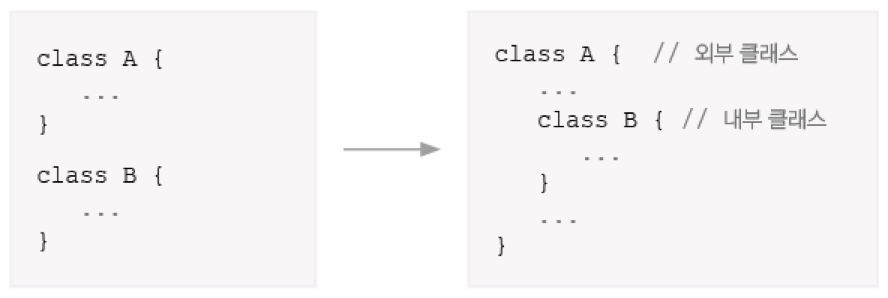
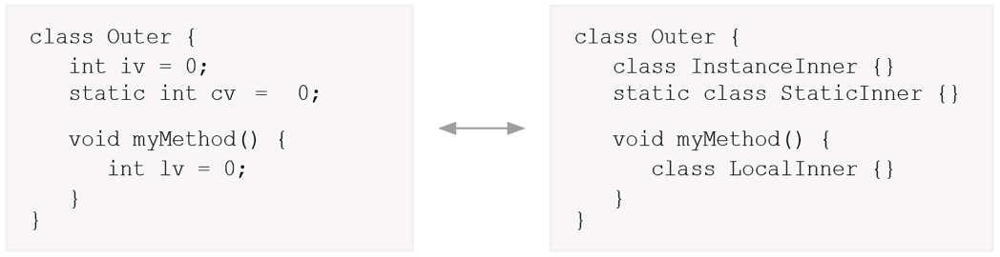
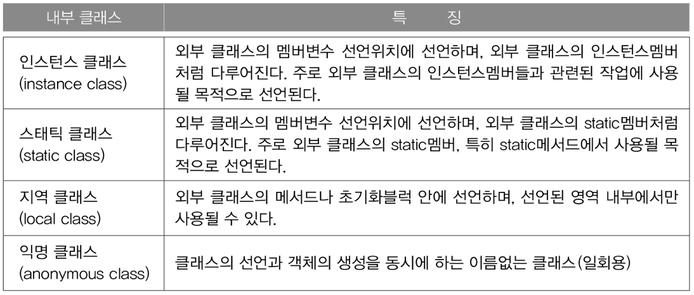
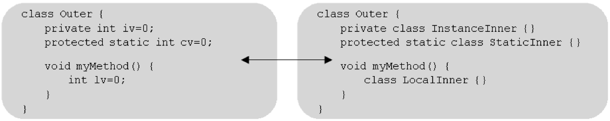
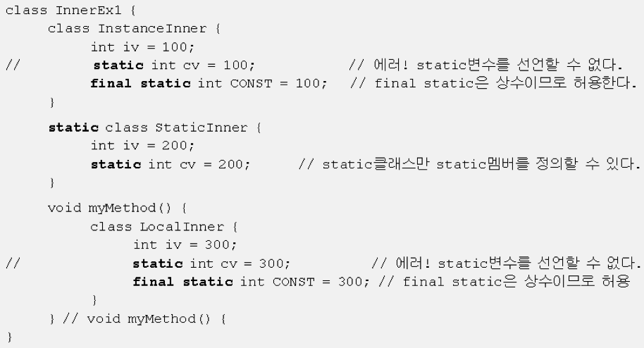
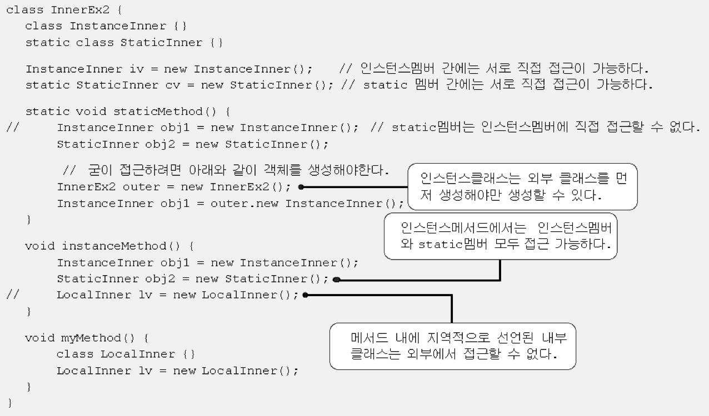
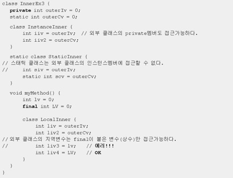
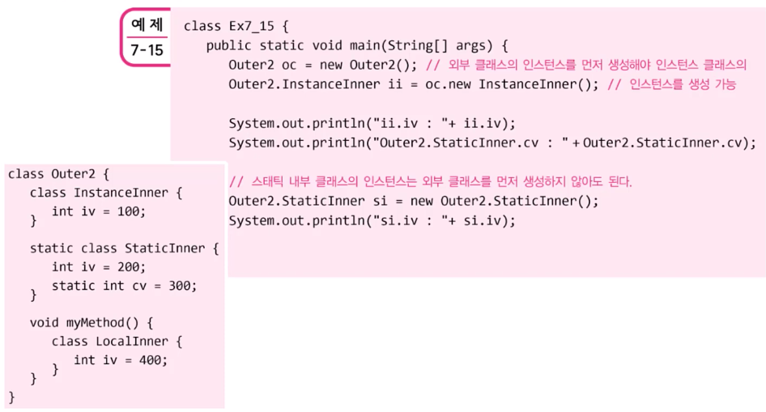
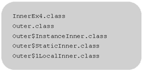
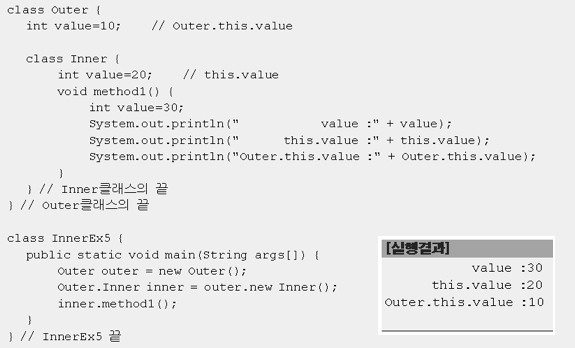

[자바의 정석](http://www.yes24.com/Product/Goods/24259565?OzSrank=2)을 바탕으로 정리한 자료입니다.


# 목차

- [내부 클래스](#------)
  * [1 내부 클래스란?](#1-내부-클래스란)
    + [1-1 내부 클래스 예제](#1-1-내부-클래스-예제)
  * [2 내부 클래스의 장점](#2-내부-클래스의-장점)
    + [2-1 내부 클래스에서 외부 클래스의 멤버들을 쉽게 접근할 수 있다.](#2-1-내부-클래스에서-외부-클래스의-멤버들을-쉽게-접근할-수-있다)
    + [2-2 코드의 복잡성을 줄일 수 있다. ( 캡슐화 )](#2-2-코드의-복잡성을-줄일-수-있다--캡슐화-)
  * [3 내부 클래스의 종류와 특징](#3-내부-클래스의-종류와-특징)
  * [4 내부 클래스의 제어자와 접근성](#4-내부-클래스의-제어자와-접근성)
    + [4-1 내부 클래스의 제어자와 접근성에 대한 예제](#4-1-내부-클래스의-제어자와-접근성에-대한-예제)


# 내부 클래스

> 메서드와 클래스도 모두 주소가 있다.
>
> 내부 클래스를 일반 멤버와 똑같은 시각에서 본다면 이해가 훨씬 쉽다.


## 1 내부 클래스란?



* **클래스 안의 클래스**
  * A는 B의 외부클래스
  * B는 A의 내부클래스
* **`class B`는 `class A`의 멤버라고 봐도 무방하다.**


### 1-1 내부 클래스 예제

> 내부 클래스를 도입하지 않은 코드

```java
class A {
  int i = 100;
  B b = new B();
}

class B {
  void method() {
    A a = new A(); // A를 사용하기 위해서 A객체를 생성.
    System.out.println(a.i);
  }
}

class C {
  B b = new B();
}

public class InnerTest{
  public static void main(String[] args){
    B b = new B();
    b.method();
  }
}
// 결과값 : 100
```

* 위와 같이 B객체에서 A객체를 사용하려면 B객체안에 A객체를 생성해줘야한다.


> 내부 클래스를 도입하는 예제

```java
class A { // A는 B의 외부 클래스
  int i = 100;
  B b = new B(); // 내부 클래스 객체를 생성해줘야만 B에 접근이 가능하다.
  
  class B { // 내부 클래스 (B는 A의 내부 클래스)
    void method(){
      // A a = new A(); // 불필요하다.
      // System.out.println(a.i);  // 불필요하다.
      System.out.println(i); // A클래스의 멤버에 바로 접근이 가능하다.
    }
  }
}

class C {
  B b = new B(); // 오류 (클래스B는 A안에 있으므로 바로 접근이 불가하다.)
}

public class InnerTest{
  public static void main(String[] args){
    A a = new A();
    a.b.method(); // 캡슐화
  }
}
// 결과값 : 100
```

* 클래스B를 클래스A에서만 사용한다는 가정하에 내부클래스로 만든 것.
  * **내부 클래스에서는 객체 생성없이 외부 클래스의 멤버 접근이 가능하다.**


## 2 내부 클래스의 장점


### 2-1 내부 클래스에서 외부 클래스의 멤버들을 쉽게 접근할 수 있다.

* 기존의 `class A`와 `class B`에서 **`class B`가 `class A`의 멤버에 접근하기 위해서는 `class B`안에 `class A` 객체를 생성했어야 했다. ( has - a )**

* ```java
  class A {
    ...
  }
  
  class B {
    A a = new A();
    ...
  }
  ```

* 내부 클래스를 사용하면 **객체 생성 없이도 `class A`의 멤버에 접근 가능**하다.


### 2-2 코드의 복잡성을 줄일 수 있다. ( 캡슐화 )

* `class B`는 `class A`에서만 접근한다면 내부 클래스를 이용하여 코드의 복잡성을 줄일 수 있다.
  * **밖에서 쓰지 않고 `class A`에서만 사용하는데 굳이 바깥에 둘 필요가 없다.**


## 3 내부 클래스의 종류와 특징



* **내부 클래스의 종류와 유효범위(scope)는 변수와 동일하다.**
  * **멤버 변수와 같은 종류가 있으며 똑같은 성질을 가진다.**
    * 인스턴스 : 인스턴스 안에서만 ( **외부 클래스의 인스턴스멤버처럼 다루어 진다.** )
    * 스태틱 : 외부클래스 생성하지 않아도 쓸 수 있다. ( **외부 클래스의 static멤버처럼 다루어 진다.** )
    * 지역 : 메서드 안에서만 ( **메서드나 초기화블럭 내부에서만 사용이 가능.** )



* **익명클래스도 내부클래스의 일종이다.**


## 4 내부 클래스의 제어자와 접근성



* **내부 클래스의 제어자는 변수에 사용 가능한 제어자와 동일하다.**
  * `private`, `protected` 등등


### 4-1 내부 클래스의 제어자와 접근성에 대한 예제

> 예제 1



* **static 멤버를 가질 수 있는 내부 클래스는 static 클래스뿐**

  * **static멤버는 객체 생성없이도 사용이 가능해야한다. 내부 클래스는 멤버변수로 보기 때문에, 외부 클래스 객체를 생성해야지만 사용이 가능하므로, static클래스를 제외한 내부 클래스에서는 static멤버를 정의할 수 없다.**
    * 내부 클래스 (static제외)의 static 멤버는 JVM이 실행될 때 클래스영역에 올라가지 않는건가??? ( 의문 )

* **static내부 클래스에서는 외부 클래스의 인스턴스 멤버에 접근할 수 없다.**

  * 외부 클래스의 인스턴스가 언제 생성될 지 모르기 때문.
  * 단, **외부 클래스의 static 멤버는 접근이 가능하다.**

* 상수인 경우는 가능하다.

  


> 예제 2



* 인스턴스 멤버와 static멤버
  * 인스턴스 멤버 => static 멤버 사용 가능
  * static 멤버 => 인스턴스 멤버 사용 불가능.
* `class InstanceInner{}` = 인스턴스 멤버
* `static class StaticInner{}` = static 멤버


> 예제 3



* **외부 클래스의 지역변수는 final이 붙은 변수(상수)만 접근가능하다.**
  * **상수는 Constant pool이 따로 있다.**
  * 지역 클래스의 인스턴스가 소멸된 지역변수를 참조할 수 있기 때문이다.
  * **지역 변수 `int lv`보다 내부 객체인 `LocalInner`이 더 오래 존재할 수 있기 때문.** ( 지역 변수는 스택에, 객체는 힙에 저장 되기 때문 )
    * **final은 Constant pool에 담기므로, `myMethod()`가 종료되도 `LocalInner`에서 접근이 가능하다.**
    * Thread
* **인스턴스 내부 클래스는 외부 클래스의 private멤버도 접근 가능하다.**


> 예제 4 - 내부 클래스 사용 방법



* 인스턴스 내부 클래스를 이용하려면 먼저 외부 클래스의 객체를 생성해줘야 한다.
  * 내부 클래스 자체가 외부 클래스에서만 사용하기 때문이다.
  * **인스턴스 내부 클래스 = 인스턴스 멤버**
* static 내부 클래스는 외부 클래스를 먼저 생성하지 않아도 사용이 가능하다.
  * **static 내부 클래스 = static 멤버**
* 컴파일 결과




> 예제 5



