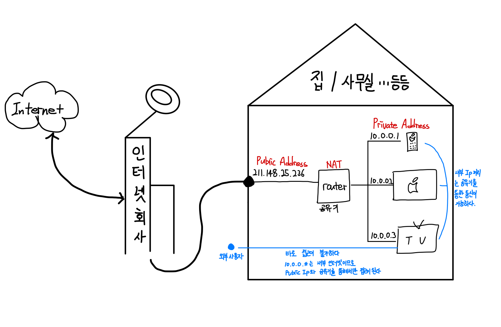

[자바의 정석](http://www.yes24.com/Product/Goods/24259565?OzSrank=2)을 바탕으로 정리한 자료입니다.


# 목차

- [네트워킹](#네트워킹)
  * [1. 네트워크 개념](#1-네트워크-개념)
    + [1-1. 네트워크 기본](#1-1-네트워크-기본)
    + [1-2. 클라이언트/서버](#1-2-클라이언트/서버)
    + [1-3. URL](#1-3-url)
      - [1-3-1. 프로토콜](#1-3-1-프로토콜)
      - [1-3-2. IP](#1-3-2-ip)
      - [1-3-3. 포트](#1-3-3-포트)
  * [2. OSI 7계층](#2-osi-7계층)
    + [2-1. OSI 7 계층이란?](#2-1-osi-7-계층이란)
    + [2-2. OSI 7 계층의 통신 방식](#2-2-osi-7-계층의-통신-방식)
    + [2-3. OSI 7 계층의 장점](#2-3-osi-7-계층의-장점)
    + [2-4. 계층별 역할](#2-4-계층별-역할)
      - [2-4-1. 응용 계층](#2-4-1-응용-계층)
      - [2-4-2. 표현 계층](#2-4-2-표현-계층)
      - [2-4-3. 세션 계층](#2-4-3-세션-계층)
      - [2-4-4. 전송 계층](#2-4-4-전송-계층)
      - [2-4-5. 네트워크 계층](#2-4-5-네트워크-계층)
      - [2-4-6. 데이터 링크 계층](#2-4-6-데이터-링크-계층)
      - [2-4-7. 물리 계층](#2-4-7-물리-계층)
  * [3. 자바에서의 네트워크](#3-자바에서의-네트워크)
    + [3-1. InetAddress](#3-1-inetaddress)
    + [3-2. URL](#3-2-url)
    + [3-3. URLConnection](#3-3-urlconnection)
  * [4. 소켓 프로그래밍](#4-소켓-프로그래밍)
    + [4-1. 소켓 프로그래밍이란?](#4-1-소켓-프로그래밍이란)
    + [4-2. TCP와 UDP](#4-2-tcp와-udp)
      - [4-2-1. TCP와 UDP 비교](#4-2-1-tcp와-udp-비교)
      - [4-2-2. TCP handshaking](#4-2-2-tcp-handshaking)
  * [5. TCP 소켓 프로그래밍](#5-tcp-소켓-프로그래밍)
    + [5-1. 통신 과정](#5-1-통신-과정)
    + [5-2. 더 자세한 통신 과정](#5-2-더-자세한-통신-과정)
    + [5-3. 데이터 송수신](#5-3-데이터-송수신)
    + [5-4. 예제](#5-4-예제)


# 네트워킹


## 1. 네트워크 개념

자바를 이용하여 네트워크 관련 공부를 하기전에 네트워크에 대한 개념을 먼저 잡는 것이 중요하다고 생각한다.


### 1-1. 네트워크 기본


* 개념
  * ***네트워크는 컴퓨터와 컴퓨터간의 연결을 의미한다.***
  * 우리가 사용하는 거의 모든 서비스는 네트워크를 사용한다.
* 네트워킹을 하기 위해서는?
  * 최소 두 개의 컴퓨터가 필요하다.
  * 네트워크 연결이 되기 위해서는 크게 세 가지가 필요하다. (URL)
    * 프로토콜 : 어떤 방식으로
    * IP주소 : 어디 컴퓨터로
    * 포트 : 어떤 프로그램을 연결할 것인지


### 1-2. 클라이언트/서버


* 클라이언트

  * 개념
    * 네트워크에서 정보를 요구해서 받는 쪽.
  * 예제
    * 브라우저(크롬, 파이어폭스), 안드로이드, 아이폰

* 서버

  * 개념
    * 정보를 제공해 주는 쪽.
  * 예제
    * 웹 서버 (APACHE, NginX) , WAS(Tomcat)

* DNS

  * 개념
    * 인터넷은 현실에서 우리가 주소를 가지고 집을 찾아가듯이, IP주소만을 통해서 웹서버에 접속을 한다.
    * 즉 `www.naver.com`라는 것은 네이버 서버의 IP주소(`12.1.1.2`)로 바꿔주는 역할을 해주는 것이 DNS서버의 역할이다.

  


### 1-3. URL


* URL 의미
  * 통합 자원 지시자 (Uniform Resource Locator)
  * ***URL은 특정 서버의 한 리소스에 대한 구체적인 위치를 서술한다.***
  * URL은 리소스가 정확히 어디에 있고 어떻게 접근할 수 있는지 분명히 알려준다.


#### 1-3-1. 프로토콜

* 개념
  * 통신을 위한 상호 간의 약속. (규격)
  * 클라이언트와 서버간의 요청과 응답의 약속을 정해두는 것.
* 예제
  * HTTP / HTTPS
  
  * FTP (SSH)
  
    


#### 1-3-2. IP

* 개념
  * 컴퓨터를 구별하는데 사용되는 고유한 주소 값
* IP의 종류
  * Public
  * Private




#### 1-3-3. 포트


* 개념
  * ***컴퓨터 내에 프로세스로 도달하기 위한 주소.***
  * IP주소가 컴퓨터끼리 연결을 위한 네트워크 주소이고, ***포트는 컴퓨터 내에서 프로세스가 가지고 있는 주소이다.***


## 2. OSI 7계층


### 2-1. OSI 7 계층이란?


* OSI 7 계층이란?
  * 통신에 관한 국제적인 표준기구인 ISO에서 통신이 일어나는 과정을 7개의 단계로 나누어 놓은 것.


### 2-2. OSI 7 계층의 통신 방식


* OSI 7 계층의 통신 방식
  * 같은 계층들의 순서에 따라 각 계층에서 담당하는 기술과 방식으로 데이터를 종단에서 종단까지 전달한다.


* 각 계층마다 담당하는 기술과 데이터이 있다. (캡슐화, 디캡슐화)
  * 송신 호스트가 데이터를 보낼 때 각 계층을 지나면서 헤더가 붙어 패킷의 크기가 커지고, 수신 호스트에 도착하면 아래에서 위에있는 계층으로 올라가며 헤더가 벗겨진다.


### 2-3. OSI 7 계층의 장점


1. Raw 레벨의 네트워크를 알지 못해도 통신이 가능하다.
2. 데이터의 흐름이 한 눈에 보인다.
3. 문제 해결이 편리하다.
   * 네트워크 상에서 문제가 발생하면 7개의 작은 문제로 나눈다음 그 문제를 해결하면 훨씬 쉽게 해결가능하다.
4. 층을 나누어 표준화를 해 놓으면 여러 회사 장비를 써도 네트워크에 이상이 없다.


### 2-4. 계층별 역할


#### 2-4-1. 응용 계층

* 응용 계층의 역할
  * 도착한 데이터를 최종 사용자가 확인하는 마지막 단계.
  * 브라우저, 메일 등 네트워크를 활용하는 다양항 응용 프로그램들이 이 계층에 포함될 수 있다.
  * HTTP, FTP, SMTP등과 같은 프로토콜을 사용하는 응용 프로그램
* 예시
  * 브라우저 - 크롬, 파이어폭스
  * 메일 프로그램

> 주의 할 점
>
> * 응용 계층은 통신의 양 끝단인 HTTP, FTP와 같은 프로토콜이지 응용 프로그램이 아니다.


#### 2-4-2. 표현 계층

* 표현 계층의 역할
  * ***데이터 표현이 상이한 응용 프로세스의 독립성을 제공하고, 암호화를 수행한다.***
  * 표현 계층은 코드 간의 번역을 담당하여 사용자 시스템에서 데이터의 형식상 차이를 다루는 부담을 응용 계층으로부터 덜어준다.
  * ***해당 데이터가 TEXT인지, 그림인지, GIF인지의 구분 등이 표현 계층의 몫이다.***
  * ***사용자 명령어를 완성 및 결과 표현. 포장/압축/암호화***
* 예시
  * EBCDIC로 인코딩된 문서 파일을 ASCII로 인코딩된 파일로 바꿔준다.
  * SSL (Secure Sockets Layer)


#### 2-4-3. 세션 계층

* 세션 계층의 역할

  * 양 끝단의 응용 프로세스가 통신을 관리하기 위한 방법을 제공.
  * 통신을 하기 위한 세션을 확립/유지/중단 관리
  * TCP/IP 세션을 만들고 없애는 책임을 진다.

* 예시

  * 동시 송수신 방식(duplex), 반이중 방식(half-duplex), 전이중 방식(full duplex)

    

#### 2-4-4. 전송 계층

* 전송 계층의 역할
  * 전송 계층은 양 끝단의 사용자들이 신뢰성 있는 데이터를 주고 받을 수 있도록 해주어, 상위 계층들이 데이터 전달의 유효성이나 효율성을 생각하지 않도록 해준다.
  * ***다른 프로세스로부터 데이터가 도착하면 전송 계층이 해당 데이터를 하나로 합쳐서 5계층에 던져준다.***
  * 모든 패킷들의 전송이 유효한지 확인한다.
* 예시
  * TCP
  * UDP


#### 2-4-5. 네트워크 계층

* 네트워크 계층의 역할
  * ***데이터를 목적지까지 가장 안전하고 빠르게 전달하는 기능을 담당한다. (라우팅)***
  * ***IP를 할당하는 계층.***
  * ***경로 설정(Route)를 하는 계층***
  * 프로토콜의 종류도 다양하고, 라우팅하는 알고리즘도 다양하다.
  * 라우터(공유기)가 이 계층에서 동작한다.
* 예시
  * 데이터가 들어 있는 "패킷"이 서울에서 뉴욕까지 가는 경로는 상당히 많다. 그러한 경로를 어떻게 설정해서 나아갈지를 결정하게 하는 계층.
  * IP 할당
  * 라우팅 (네트워크 구분)
  * 최적의 길을 찾아주는 경로 설정


#### 2-4-6. 데이터 링크 계층

* 데이터 링크 계층의 역할
  * 데이터를 신뢰성있게 전송하는 계층
  * 물리적인 주소(MAC주소)를 지정한다.
  * ***오류 제어 및 흐름 제어.***
* 예시
  * 이더넷
  * 무선 랜
  * 브릿지


#### 2-4-7. 물리 계층

* 물리 계층의 역할
  * 통신 단위는 비트이며, 전기적, 기계적, 기능적인 특성을 이용해 통신 케이블로 데이터를 전송한다.
  * 데이터가 무엇인지, 어떤 에러가 있는지 등에는 전혀 신경 쓰지 않는다.
* 예시
  * 케이블
  * 허브


## 3. 자바에서의 네트워크


### 3-1. InetAddress

* 자바에서는 IP주소를 다루기 위한 클래스로 `InetAddress`를 제공한다.


```java
public class Main {

    public static void main(String[] args) {
        InetAddress ip = null;
        InetAddress[] ipArr = null;

        // 네이버의 IP주소 가져오기 (DNS)
        try {
            ip = InetAddress.getByName("www.naver.com");
            System.out.println("getHostName() : "+ip.getHostName());
            System.out.println("getHostAddress() : "+ip.getHostAddress());
            System.out.println("toString() : "+ip.toString());

            byte[] ipAddr = ip.getAddress();
            System.out.println("getAddress() : " + Arrays.toString(ipAddr));
            System.out.println();
        } catch (UnknownHostException e){
            e.printStackTrace();
        }

        try {
            ip = InetAddress.getLocalHost();
            System.out.println("getHostName() : "+ip.getHostName());
            System.out.println("getHostAddress() : "+ip.getHostAddress());
            System.out.println();
        } catch (UnknownHostException e){
            e.printStackTrace();
        }

        try {
            ipArr = InetAddress.getAllByName("www.naver.com");
            for(int i = 0; i < ipArr.length; i++){
                System.out.println("ipArr["+i+"] : "+ipArr[i]);
            }
        } catch (UnknownHostException e){
            e.printStackTrace();
        }
    }
}

// 결과
getHostName() : www.naver.com
getHostAddress() : 210.89.160.88
toString() : www.naver.com/210.89.160.88
getAddress() : [-46, 89, -96, 88] // +256해주면 된다.

getHostName() : kimbyeonghwa-MacBookPro.local
getHostAddress() : 127.0.0.1

ipArr[0] : www.naver.com/210.89.160.88
ipArr[1] : www.naver.com/210.89.164.90
```


### 3-2. URL

* 자바에서는 URL를 다루기 위한 클래스로 `URL`클래스를 제공한다.


### 3-3. URLConnection

* `URLConnection`이란?
  * `URLConnection`은 어플리케이션과 URL간의 통신 연결을 나타내는 클래스의 최상위 추상클래스이다.
  * `URLConnection`을 사용해서 연결하고자하는 자원에 접근하고 읽고 쓰기를 할 수 있다.
* 하위 클래스
  * `HttpURLConnection`
  * `JarURLConnection`

```java
public class Main {

    public static void main(String[] args) throws MalformedURLException {

        URL url = null;
        String address = "http://www.codechobo.com/sample/hello.html";

        try {
            url = new URL(address);
            URLConnection conn = url.openConnection();

            System.out.println("conn.toString() : " + conn);
            System.out.println("getAllowUserInteraction():"+conn.getAllowUserInteraction());
            System.out.println("getConnectTimeout():"+conn.getConnectTimeout());
            System.out.println("getContent():"+conn.getContent());
            System.out.println("getContentEncoding():"+conn.getContentEncoding());
            System.out.println("getContentLength():"+conn.getContentLength());
            System.out.println("getContentType():"+conn.getContentType());
            System.out.println("getDate():"+conn.getDate());
         System.out.println("getDefaultAllowUserInteraction():"+con.getDefaultAllowUserInteraction());
            System.out.println("getDefaultUseCaches():"+conn.getDefaultUseCaches());
            System.out.println("getDoInput():"+conn.getDoInput());
            System.out.println("getDoOutput():"+conn.getDoOutput());
            System.out.println("getExpiration():"+conn.getExpiration());
            System.out.println("getHeaderFields():"+conn.getHeaderFields());
            System.out.println("getIfModifiedSince():"+conn.getIfModifiedSince());
            System.out.println("getLastModified():"+conn.getLastModified());
            System.out.println("getReadTimeout():"+conn.getReadTimeout());
            System.out.println("getURL():"+conn.getURL());
            System.out.println("getUseCaches():"+conn.getUseCaches());

        } catch(Exception e) {
            e.printStackTrace();
        }
    }
}
```


* Http프로토콜을 사용한 요청을하고 응답받은 반환 메시지들을 출력한 예제


```java
public class Main {

    public static void main(String[] args) throws MalformedURLException {

        URL url = null;
        BufferedReader input = null;
        String address = "https://www.naver.com";
        String line = "";

        try {
            url = new URL(address);

            input = new BufferedReader(new InputStreamReader(url.openStream()));

            while((line = input.readLine()) != null){
                System.out.println(line);
            }
            input.close();
        } catch(Exception e) {
            e.printStackTrace();
        }
    }
}
```

* 해석
  * Http 연결을 통해서 응답받은 내용을 읽어오는 예제.
* `BufferedReader`
  * 읽어올 내용이 문자열이기 때문에 `BufferedReader`를 사용
* `Inputstream`
  * `openStream()`을 호출해서 URL의 `InputStream`을 얻어 읽어왔다.
  * Http의 응답도 클라이언트 입장에서는 `InputStream`에 해당한다.


> StreamReader에 관한 다른 예시
>
> ```java
> public static void main(String[] args) throws MalformedURLException {
>     URL url = null;
>     Reader input;
>     Writer output;
>     String address = "https://www.naver.com";
>     int data = 0;
> 
>     try {
>       url = new URL(address);
> 
>       input = new InputStreamReader(url.openStream());
>       output = new OutputStreamWriter(System.out);
> 
>       while((data = input.read()) != -1){
>         output.write(data);
>         //                System.out.print((char)data);
>       }
> 
>       output.flush();
>     } catch(Exception e) {
>       e.printStackTrace();
>     }
> }
> ```
>
> * 네트워크상에서의 모든 통신은 `bit`단위이므로, 각 프로세스는 스트림을 사용하여 데이터를 핸들링해야한다.


## 4. 소켓 프로그래밍


### 4-1. 소켓 프로그래밍이란?


* 소켓이란?
  * 
  * 사전적 의미 : 구멍, 연결, 콘센트 = 네트워크 환경에 연결할 수 있게 만들어진 연결부.
  * 소켓이란 프로세스간의 통신에 사용되는 양쪽 끝단(end point)를 의미한다.
  * ***전화기가 필요한 것처럼, 프로세스간의 통신을 위해서는 그 무언가가 필요하고 그것이 바로 소켓이다.***
* 소켓 프로그래밍이란?
  * 소켓 프로그래밍이란 소켓을 이용한 통신 프로그래밍을 뜻한다.


### 4-2. TCP와 UDP

소켓은 전송 계층 바로 윗 계층이며, 소켓을 통해 데이터를 통신하기 위해서는 TCP혹은 UDP를 사용해야 한다.


#### 4-2-1. TCP와 UDP 비교


* TCP의 활용
  * 비교적 안전적인 통신이 필요한 파일 교환
* UDP의 활용
  * 게임이나 동영상의 데이터를 전송하는 경우 중간에 손실되어 좀 끊기더라고 속도만 빠르면 되므로 TCP보다 빠른 UDP가 적합하다.


#### 4-2-2. TCP handshaking

> 3 way handshaking
>
> * TCP에서 세션을 연결할 때 거치는 과정


1. 클라이언트는 서버에 접속 요청 메시지 `SYN(a)`패킷을 전송하고 `SYN_SENT`상태가 된다.
2. 서버는 클라이언트의 요청인 `SYN(a)`를 받고 클라이언트에게 요청을 수락한다는 `ACK(a+1)`과 `SYN(b)`이 설정된 패킷을 전송하고 `SYN_RECEIVED`상태가 된다.
3. 클라이언트는 서버의 수락 응답인 `ACK(a+1)`와 `SYN(b)`패킷을 받고 `ACK(b+1)`를 서버로 보내면 연결이 성립된다.


두 프로세스 간의 연결이 성립되는지 보장하는 과정이다.


> 4 way handshaking
>
> * TCP에서 세션 연결을 종료할 때 거치는 과정


1. 클라이언트가 연결을 종료하겠다는 `FIN`플래그를 전송한다.
2. 서버는 클라이언트의 요청(`FIN`)을 받고 알겠다는 확인 메시지로 `ACK`를 보낸다.
   * 그리고나서 서버는 데이터를 모두 보낼 때까지 잠깐 `TIME_OUT`이 된다.
3. 데이터를 모두 보내고 통신이 끝났으면 연결이 종료되었다고 클라이언트에게 `FIN`플래그를 전송한다.
4. 클라이언트는 `FIN`메시지를 확인했다는 메시지(`ACK`)를 보낸다.
5. 클라이언트의 `ACK`메시지를 받은 서버는 소켓 연결을 `close`한다.
6. 클라이언트는 아직 서버로부터 받지 못한 데이터가 있을 것을 대비해 일정 기간 동안 세션을 남겨놓고 잉여 패킷을 기다리는 과정을 거친다. (`TIME_WAIT`)


## 5. TCP 소켓 프로그래밍


### 5-1. 통신 과정


1. 서버 프로그램에서 ***서버소켓을 사용해서 서버 컴퓨터의 특정 포트에서 클라이언트의 연결요청을 처리할 준비***를 한다.
2. 클라이언트 프로그램은 접속할 서버의 IP주소와 포트 정보를 가지고 소켓을 생성해서 서버에 연결을 요청한다.
3. 서버소켓은 클라이언트의 연결요청을 받으면 ***서버에 새로운 소켓을 생성해서 클라이언트의 소켓과 연결되도록 한다.***
4. 이제 ***클라이언트의 소켓***과 ***새로 생성된 서버의 소켓***은 ***서버소켓과 관계없이 일대일 통신***을 한다.


### 5-2. 더 자세한 통신 과정


* 서버 (Server)
  * 서버 소켓 생성 (`socket()`)
  * 서버 소켓 바인딩 (`bind()`)
    * bind : 결합하다, 구속하다, 묶다
    * `bind()` API에 사용되는 인자는 소켓(socket)과 포트 번호(또는 IP + 포트번호)이다.
    * ***운영체제가 특정 포트 번호를 서버 소켓이 사용하도록 만들기 위해 소켓과 포트 번호를 결합한다. (포트 점유)***
  * 클라이언트 연결 요청 대기 (`listen()`)
    * 서버 소켓에 포트 번호(IP주소 + 포트번호)를 결합(bind)하고 나면, 서버 소켓을 통해 클라이언트의 연결 요청을 받아들일 준비가 되었다.
    * 연결이 많아지면 큐를 사용한다.
  * 클라이언트 연결 수입 (`accept()`)
    * `listen()` API가 클라이언트의 연결 요청을 확인하고 문제없이 리턴한다고 해서, 클라이언트와의 연결 과정이 모두 완료된 것은 아니다.
    * 아직 실질적인 소켓 연결(Connection)을 수립하는 절차가 남아있다.
    * 최종적으로 연결 요청을 받아들이는 역할을 수행하는 것은 `accept()` API이다.
    * ***`accept()` API에서 데이터 송수신을 위한 새로운 소켓(Socket)을 만들고 서버 소켓의 대기 큐에 쌓여있는 첫 번째 연결 요청을 매핑시킨다.***
  * 데이터 송수신 (`send()/recv()`)
  * 소켓 연결 종료 (`close()`)
* 클라이언트 (Client)
  * 클라이언트 소켓 생성 (`socket()`)
  * 연결 요청 (`connect()`)
    * `connect()` API는 블럭(block) 방식으로 동작한다. 
    * 연결 요청에 대한 결과(성공, 거절, 시간 초과등)가 결정되기 전에는 `connect()`의 실행이 끝나지 않는다.
  * 데이터 송수신 (`send()/recv()`)
  * 소켓 닫기 (`close()`)


### 5-3. 데이터 송수신


* 소켓의 데이터 송수신 방법
  * ***두 개의 소켓은 연결이 되면 데이터를 주고받는 연결통로는 바로 입출력스트림이다.***
  * 소켓은 두 개의 스트림 (Input, Output)을 가지고 있으며, 이 두 스트림들은 연결된 상대편 소켓의 스트림들과 교차연결된다.


### 5-4. 예제

> 서버 소켓

```java
public class Main {

    public static void main(String[] args) throws MalformedURLException {

        ServerSocket serverSocket = null;

        try {
            // 서버 소켓을 생성하여 7777번 포트와 결합(bind)한다.
            serverSocket = new ServerSocket(7777);
            System.out.println(getTime() + " 서버 준비가 되었습니다.");
        } catch (IOException e){
            e.printStackTrace();
        }

        int cnt = 0;
        while(true) {
            try {
                System.out.println(getTime() + " 연결요청을 기다립니다. " + ++cnt);

                // 서버소켓은 클라이언트의 연결요청이 올 때까지 실행을 멈추고 계속 기다린다.
                // 클라이언트의 연결요청이 오면 클라이언트 소켓과 통신할 새로운 소켓을 생성한다.
                Socket socket = serverSocket.accept(); // 요청이 올 때까지 블록.
                System.out.println(getTime() + socket.getInetAddress() + " 로부터 연결요청이 들어왔습니다.");

                // 소켓의 출력스트림을 얻는다.
                OutputStream out = socket.getOutputStream();
                DataOutputStream dos = new DataOutputStream(out);

                // 원격 소켓 (remote socket)에 데이터를 보낸다.
                dos.writeUTF("[Notice] Test Message1 from server");
                System.out.println(getTime() + " 데이터를 전송했습니다.");

                // 스트림과 소켓을 닫아준다.
                dos.close();
                socket.close();
            } catch (IOException e) {
                e.printStackTrace();
            }
        }
    }

    static String getTime() {
        SimpleDateFormat f = new SimpleDateFormat("[hh:mm:ss]");
        return f.format(new Date());
    }
}

```


> 클라이언트 소켓

```java
public class Client {
    public static void main(String[] args) {
        try {
            String serverIP = "127.0.0.1"; // localhost

            System.out.println("서버에 연결중입니다. 서버 IP : "+serverIP);

            // 소켓을 생성하여 연결을 요청한다.
            Socket socket = new Socket(serverIP, 7777);

            // 소켓의 입력스트림을 얻는다.
            InputStream in = socket.getInputStream();
            DataInputStream dis = new DataInputStream(in);

            // 소켓으로부터 받은 데이터를 출력한다.
            System.out.println("서버로부터 받은 메시지 : " + dis.readUTF());
            System.out.println("연결을 종료한다. ");

            // 스트림과 소켓을 닫는다.
            dis.close();
            socket.close();
            System.out.println("연결이 종료되었습니다. ");
        } catch (ConnectException ce){
            ce.printStackTrace();
        } catch (IOException ie){
            ie.printStackTrace();
        } catch (Exception e){
            e.printStackTrace();
        }
    }
}
```


