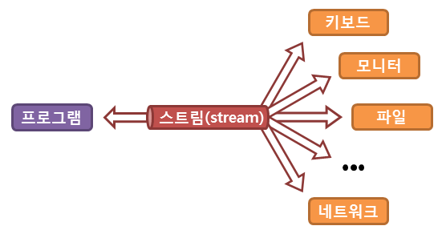
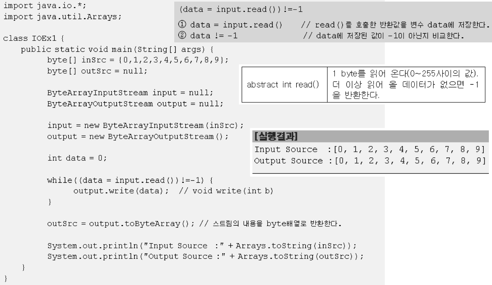

# 입출력 (I/O)


## 1. 자바에서의 입출력


### 1-1. 입출력이란?

* 입력(Input)과 출력(Output)을 줄여 부르는 말
* 두 대상 간의 데이터를 주고 받는 것


### 1-2. 스트림이란?

자바에서는 파일이나 콘솔의 입출력을 직접 다루지 않고, 스트림(stream)이라는 흐름을 통해 다룬다.

***어느 한쪽에서 다른 쪽으로 데이터를 전달하려면, 두 대상을 연결하고 데이터를 전송할 수 있는 무언가가 필요한데 이것을 스트림(stream)이라고 정의했다.***



```
스트림이란 데이터를 운반하는데 사용되는 연결통로이다.
```

* 스트림의 의미
  * 스트림은 운영체제의 의해 생성되는 가상의 연결 고리를 의미하며, ***중간 매개자 역할***을 한다.
  * 스트림은 큐와 같은 FIFO 구조로 되어 있다고 생각하면 이해가 쉽다.
* 스트림 특징 - 단방향 통신
  * 스트림은 연속적인 데이터의 흐름을 물에 비유해서 붙여진 이름인데, 여러 가지로 유사한 점이 많다.
  * 물이 한쪽 방향으로만 흐르는 것과 같이 ***스트림은 단방향통신***만 가능하기 때문에 하나의 스트림으로 입력과 출력을 동시에 처리할 수 없다.
  * ***입력과 출력을 동시에 수행하려면 입력을 위한 입력 스트림과 출력을 위한 출력스트림, 모두 2개의 스트림이 필요하다.***


### 1-3. java.io 패키지

자바의 기본적인 데이터 입출력은 `Java.io`패키지에서 제공한다.


* 바이트 단위 입출력 스트림 : 그림, 멀티미디어, 문자등 모든 종류의 데이터들을 주고받을 수 있다.
* 문자 단위 입출력 스트림 : 오로지 문자만 주고받을 수 있게 특화되어 있다.


### 1-4. 바이트기반 스트림

데이터를 바이트(byte)단위로 주고 받는다.


자바에서는 `java.io`패키지를 통해 많은 종류의 입출력관련 클래스들을 제공하고 있으며, 입출력의 대상이 달라져도 동일한 방법으로 입출력이 가능하다. (개방폐쇄원칙과 유사)


#### 1-4-1. InputStream


* InputStream은 바이트 기반 입력 스트림의 최상위 클래스로 추상 클래스이다.
* 모든 바이트 기반 입력 스트림은 이 클래스를 상속받아서 만들어진다.
* InputStream클래스에는 바이트 기반 입력 스트림이 기본적으로 가져야 할 메서드들이 정의되어 있다.


#### 1-4-2. OutputStream


* OutputStream은 바이트 기반 출력 스트림의 최상위 클래스로 추상클래스이다.
* 모든 바이트 기반 출력 스트림 클래스는 이 클래스를 상속받아서 만들어진다.
* OutputStream 클래스에는 모든 바이트 기반 출력 스트림이 기본적으로 가져야 할 메서드가 정의되어 있다.


### 1-5. 보조스트림


* 스트림의 기능을 향상시키거나 새로운 기능을 추가하기 위해 사용
* ***독립적으로 입출력을 수행할 수는 없다.***


### 1-6. 문자기반 스트림

바이트기반 스트림의 입출력 단위는 1byte이다.
***자바는 한 문자를 의미하는 `char`형이 2byte이기 때문에 바이트기반의 스트림으로 2byte인 문자를 처리하는 데는 어려움이 있다.***

* C언어는 ASCII코드만을 사용하므로 1byte
* 자바는 유니코드(Unicode)를 사용하기 때문에 2 byte


* 그저 InputStream을 Reader로, OutputStream을 Writer으로 바꾸면 된다.


* 바이트기반 스트림과 문자기반 스트림의 읽고 쓰는 메서드

* 달라진 점
  * `byte`대신 `char`형을 쓴다.
  * 둘의 이름만 조금 다를 뿐 활용방법은 거의 같다.


## 2. 바이트기반 스트림

위에서 언급한 바와 같이 `InputStream`과 `OutputStream`은 모든 바이트기반의 스트림의 조상이며 아래와 같은 메서드를 가지고 있다.

> IntputStream(바이트기반 입력스트림의 최고 조상)의 메서드


> OutputStream(바이트기반 출력스트림의 최고 조상)의 메서드


### 2-1. ByteArray

`ByteArrayInputStream`과 `ByteArrayOutputStream`은 `byte[]`(바이트배열)에 데이터를 입출력하는 바이트기반 스트림이다.

* 주로 다른 곳에 입출력하기 전에 데이터를 임시로 바이트배열에 담아서 변환 등의 작업을 하는데 사용된다.



* 바이트배열 `inSrc`의 데이터를 `outSrc`로 복사하는 예제
* 바이트배열은 사용하는 자원이 메모리 밖에 없으므로 GC에 의해 자동적으로 자원을 반환하므로 `close()`를 이용해서 스트림을 닫지 않아줘도 된다.


* `available()`
  * 블락킹없이 읽어 올 수 있는 바이트의 수를 반환한다.
* 결과가 예상과 다르다.
  * 이유는 `temp`에 남아있던 6,7까지 출력했기 때문이다. (`temp`배열의 크기가 4이므로 4개씩 복사.)
  * `int len = input.read(temp)`로 코드를 수정하면 읽어온 만큼(len)만 출력한다. 마지막에 8,9를 read했으므로 2개를 가져왔기 때문에 `write(temp, 0, 2)`와 같은 코드가 된다.


### 2-2. File

`FileInputStream`과 `FileOutputStream`은 파일에 데이터를 입출력할 때 사용하는 바이트기반 스트림이다.

실제 프로그래밍에서 많이 사용되는 스트림 중의 하나이다.


* 커맨드라인으로부터 입력받은 파일의 내용을 읽어서 그대로 화면에 출력하는 예제이다.
  * `FileCopy.java`파일의 내용을 그대로 `FileCopy.bak`로 복사한다.


> 텍스트파일을 다루는 것이라면 문자기반 스트림을 이용하는 것이 좋다.


## 3. 문자기반 스트림

문자데이터를 다루는데 사용된다는 것을 제외하고는 바이트기반 스트림과 문자기반 스트림의 사용방법은 거의 같다.

* 인코딩
  * 문자기반 스트림이라는 것이 단순히 2 byte로 스트림을 처리하는 것만을 의미하지 않는다.
  * 문자 데이터를 다루는데 필요한 또 하나의 정보는 인코딩이다.
  * `Reader`와 `Writer`는 자바에서 사용하는 유니코드(`UTF-16`)간의 변환을 자동적으로 처리해준다.

> Reader(문자기반 입력스트림의 최고 조상)의 메서드


> Writer(문자기반 출력스트림의 최고 조상)의 메서드


### 3-1. File

`FileReader`와 `FileWriter`는 텍스트 파일 입출력에 사용된다.


* 바이트기반 스트림인 `FileInputStream`과 문자기반 스트림 `FileReader`의 차이를 보여주는 예제이다.
  * `FileInputStream`을 사용했을 때 문자열이 깨진 것을 볼 수 있다.


### 3-2. Piped

`PipedReader`와 `PipedWriter`는 스레드간의 통신(데이터를 주고 받음)에 사용된다.

* 다른 스트림과 달리 입력과 출력스트림을 하나의 스트림으로 연결해서 데이터를 주고받는 특징이 있다.
* 스트림을 생성한 다음에 어느 한쪽 스레드에서 `connect()`를 호출해서 입력스트림과 출력스트림을 연결해야한다.


* 두 스레드가 `PipedReader`와 `PipedWriter`를 이용해서 서로 메시지를 주고받는 예제이다.
  * 두 쓰레드를 시작하기 전에 `inThread.connect(out.Thread.getOutput())`를 이용해서 `PipedReader`와 `PipedWriter`를 연결하였다.


### 3-3. String

`StringReader`와 `StringWriter`는 입출력 대상이 메모리인 스트림이다.

* `CharArrayReader`와 `CharArrayWriter`처럼 메모리의 입출력에 사용된다.
* `StringWriter`에 출력되는 데이터는 내부의 `StringBuffer`에 저장된다.


