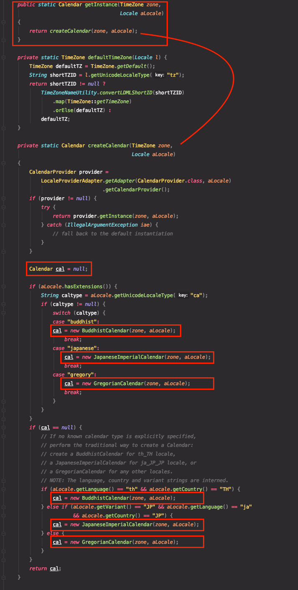
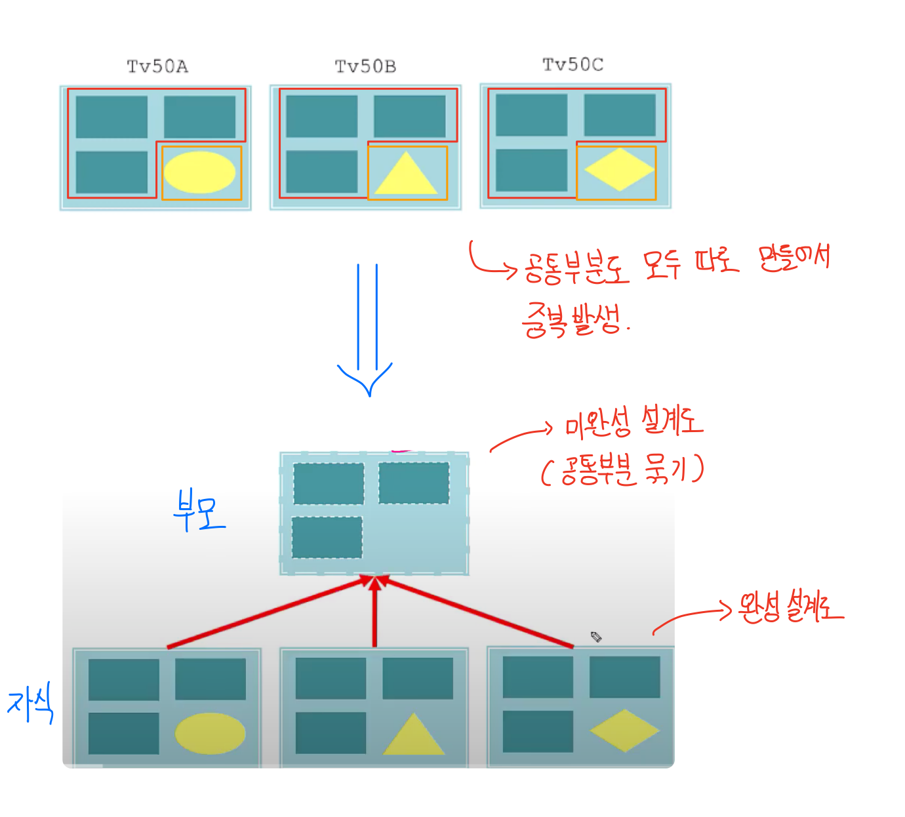
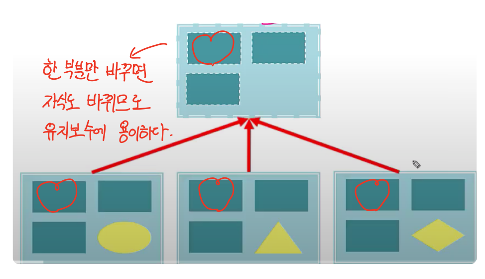
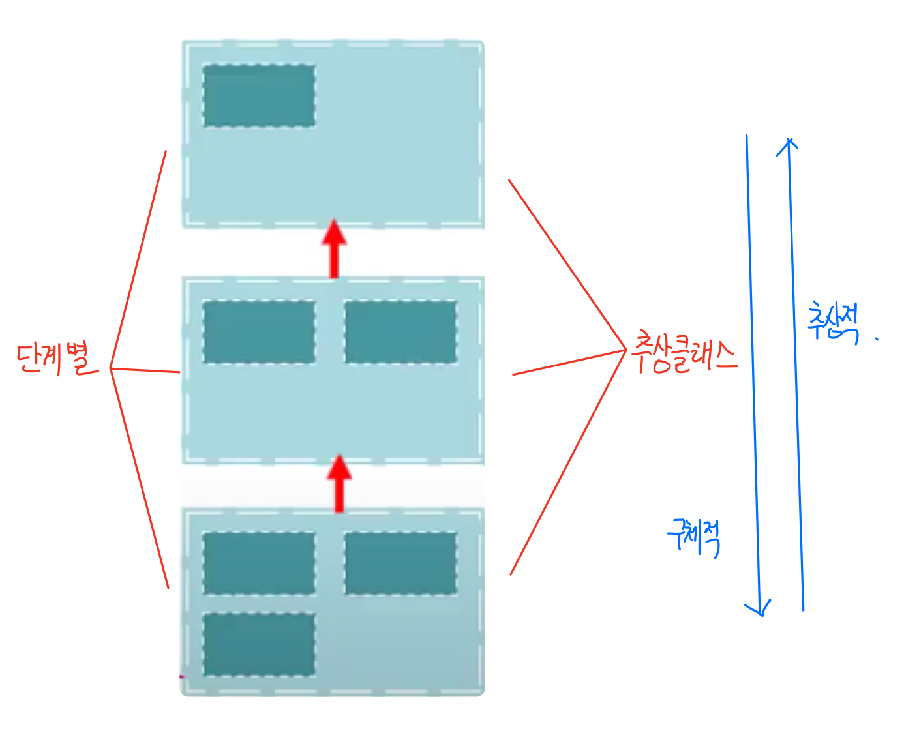
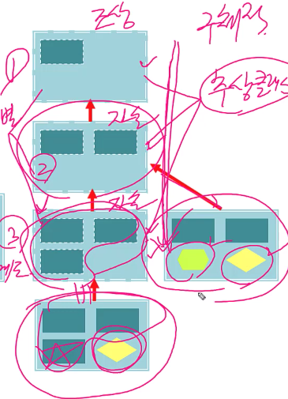
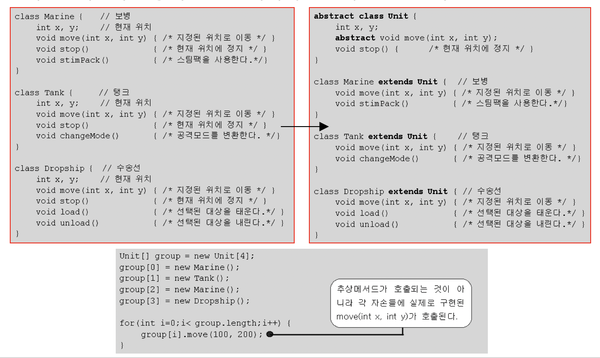

[자바의 정석](http://www.yes24.com/Product/Goods/24259565?OzSrank=2)을 바탕으로 정리한 자료입니다.


# 목차

- [추상 클래스](#추상-클래스)
  * [1 추상 클래스란?](#1-추상-클래스란?)
    + [1-1 추상클래스의 의미](#1-1-추상클래스의-의미)
    + [1-2 추상클래스의 특징](#1-2-추상클래스의-특징)
    + [1-3 추상클래스의 구현](#1-3-추상클래스의-구현)
  * [2 추상 메서드](#2-추상-메서드)
    + [2-1 추상 메서드란?](#2-1-추상-메서드란?)
    + [2-2 추상 메서드 특징](#2-2-추상-메서드-특징)
    + [2-3 추상 메서드 예제 1](#2-3-추상-메서드-예제-1)
  * [3 추상 클래스의 작성](#3-추상-클래스의-작성)
    + [3-1 추상의 의미](#3-1-추상의-의미)
    + [3-2 상속과 추상화](#3-2-상속과-추상화)
    + [3-3 추상화 vs 구체화](#3-3-추상화-vs-구체화)
    + [3-4 일반클래스와 추상클래스의 차이](#3-4-일반클래스와-추상클래스의-차이)
      - [3-4-1 추상클래스를 사용하는 이유](#3-4-1-추상클래스를-사용하는-이유)
    + [3-5 예제](#3-5-예제)
      - [3-5-1 예제1](#3-5-1-예제1)
    + [3-6 다형성](#3-6-다형성)


# 추상 클래스


## 1 추상 클래스란?

객체지향의 핵심은 추상화에 있다. 자바에서 추상화를 하는 대표적인 기법중 하나가 바로 추상 클래스이다.


### 1-1 추상클래스의 의미 

* 클래스가 설계도라면, 추상 클래스는 미완성 설계도이다.
  * **미완성의 기준은 미완성 메서드를 포함하고 있는 것이다.**
* **일반 클래스와 똑같다**. 다만 **미완성 메서드인 추상 메서드를 가지고 있을 뿐이다.**
* 추상클래스 자체로는 역할이 크지 않지만, 새로운 클래스를 작성하는데 있어서 바탕이 되는 부모클래스로서 중요한 의미를 갖는다.
  * 예 : TV의 대부분 설계는 90%정도가 동일하다. 서로 다른 세 개의 설계도를 따로 그리는 것보다 이들의 **공통부분만을 그린 미완성 설계도**를 만들어 놓고, 이를 활용하는게 더 효율적이다.


### 1-2 추상클래스의 특징

* **멤버의 개수에 관계된 것이 아닌, 추상메서드(미완성 메서드)를 포함하고 있는 클래스**
  * **미완성 메서드는 몸체가 없는 추상 메서드**를 의미한다.
  * `abstract void method();`
* 다른 클래스를 작성하는데 도움을 줄 목적으로 작성된다.
* **완성된 설계도가 아니므로 인스턴스를 생성할 수 없다.**
  * 자식 클래스를 이용해서만 완성될 수 있다. ( 오버라이딩 )


### 1-3 추상클래스의 구현

```java
abstract class 클래스이름 {
	...
}
```

* **선언부의 `abstract`를 보고 이 클래스에는 추상메서드**가 있으니, **상속을 통해서 구현**해주어야 한다는 것을 쉽게 알 수 있다.


> 추상 클래스는 아래와 같이 정의 할 수 있을 것 같다.
>
> * ***추상 메서드(미완성 메서드)를 가지고 있는 클래스 = 상속을 통해서 완성해야되는 클래스.***


## 2 추상 메서드


### 2-1 추상 메서드란?

* 선언부만 작성하고 **구현부는 작성하지 않은 채로 남겨 둔 메서드.**
  * `abstract void method();`
* 설계만 해 놓고 **실제 수행될 내용은 작성하지 않았기 때문에 미완성 메서드**라고 불린다.
* 미완성으로 남겨놓는 이유는 메서드의 내용이 상속받는 클래스에 따라 달라질 수 있기 때문이다.
  * 실제 내용은 상속받는 클래스에서 오버라이딩을 통해 구현해준다.


### 2-2 추상 메서드 특징

* **꼭 필요하지만 자식마다 다르게 구현될 것으로 예상되는 경우에 사용된다.**
* 추상클래스를 상속받는 **자식클래스에서 추상메서드의 구현부를 완성해야한다.** 
* **상속 받는 자식 클래스에서 무조건 구현을 해줘야 한다.**
  * 만약 부모로부터 **상속받는 추상메서드 중 하나라도 구현하지 않는다면**, **자식 클래스 역시 추상클래스로 지정해줘야 한다.**


### 2-3 추상 메서드 예제 1

```java
abstract class Player { // 추상 클래스
	abstract void play(int pos); // 추상 메서드
	abstract void stop(); // 추상 메서드
}

class AudioPlayer extends Player {
	void play(int pos){ // 내용 구현 } // 추상메서드 구현
	void stop(){ // 내용 구현 } // 추상메서드 구현
}

// 만약 play와 stop 추상메서드중 하나만을 구현한다면, 또다시 추상 클래스로 선언해줘야한다.
abstract class AbstractPlayer extends Player {
	void play(int pos) { // 내용 구현 } // 추상메서드 구현
	// abstract void stop() => 생략되어 있는 것이다.
}
// AbstractPlayer는 Player의 stop()을 구현하지 않았으므로 또다시 추상 클래스로 선언해줘야 한다.
```

* **추상 클래스나 추상 메서드는 모두 구현하지 않고, 일부만을 구현해도 되지만, 만약 추상 메서드중 일부만을 구현한다면 또 다시 `abstract` 를 붙여줘야 한다.**
* 메서드를 호출하는 쪽에서는 메서드가 실제로 어떻게 구현되어있는지 몰라도 메서드의 이름과 매개변수, 리턴타입, 즉 선언부만 알고 있으면 되므로 내용이 없을지라도 추상메서드를 사용하는 코드를 작성하는 것이 가능하며, 실제로도 자식클래스에 구현된 완성된 메서드가 호출되도록 할 수 있다.


## 3 추상 클래스의 작성


### 3-1 추상의 의미

> 추상[抽象] : 낱낱의 구체적 표상이나 개념에서 **공통된 성질을 뽑아 이를 일반적인 개념**으로 파악하는 정신 작용.

* 여기서 중요한 점은 **공통된 성질**이다.
* 추상클래스도 똑같이 **공통된 성질을 뽑아내서 부모를 만드는 것**을 의미한다.


### 3-2 상속과 추상화

* 상속
  * 일반 클래스의 상속이 자식 클래스를 만드는데 부모 클래스를 사용하는 것.
* 추상
  * 추상화는 기존의 클래스의 공통부분을 뽑아내서 부모 클래스를 만드는 것.


### 3-3 추상화 vs 구체화

* 추상화 : 클래스간의 공통점을 찾아내서 공통의 조상을 만드는 작업.
  * 추상화된 코드는 구체화된 코드보다 유연하다. 변경에 유리.
  * 명확
* 구체화 : 상속을 통해 클래스를 구현, 확장하는 작업.
  * 불명확


> **상속계층도를 통해 보는 상속과 추상**
>
> * 상속계층도를 따라 **내려갈수록 클래스는 점점 구체화** 되고,
>* 상속계층도를 따라 **올라갈수록 클래스는 점점 추상화** 된다.


> 예제를 통한 추상화 vs 구체화 ( **추상화의 장점** )

```java
GregorianCalendar cal = new GregorianCalendar(); // 구체적
Calendar cal = Calendar.getInstance(); // 추상적 ( Calendar의 추상 객체를 반환하는 것. )
```

* 구체적 : 어떤 클래스의 객체를 만들 것인지 써있다. ( 명확 )

  * 어떠한 캘린더를 사용하든 구체적으로 구현을 해줘야 한다.

* 추상적 : `Calendar` 객체를 반환해서 `cal` 참조변수에 담는다.

  * `Calendar` 는 추상클래스.

  * `Calendar` 에서 자식 인스턴스를 생성하여 반환하는 것. ( 불분명 )

    

  * 다르게 말하면, **사용자가 정확한 내부 로직을 몰라도 해당 인스턴스를 사용할 수 있다.**

    * 캘린더 타입에 따라 다르게 객체를 생성하여 반환한다.


### 3-4 일반클래스와 추상클래스의 차이

* **`abstract` 를 통해 추상메서드를 선언하는 이유는 자식 클래스에서 추상메서드를 반드시 구현하도록 강제하기 위함이다.**
  * 일반 클래스의 일반 메서드는 자식 클래스가 메서드를 강제로 구현할 필요가 없다. ( 오버라이딩 필요 x )
  * 추상 클래스의 추상 메서드는 자식 클래스가 메서드를 강제로 구현해줘야 한다. ( 오버라이딩 필수 )


#### 3-4-1 추상클래스를 사용하는 이유



* 50인치 TV 모델이 3개가 있다고 가정한다.
  * 네모부분은 모두 같은 특징(멤버 혹은 메서드)을 가지고 있고, 노란부분만 다른 상태를 가지고 있다.
* 이럴때, 같은 특징(멤버 혹은 메서드)는 추상클래스(미완성 설계도)를 바탕으로 3개의 TV의 설계를 완성할 수 있다.
  * 추상클래스를 이용하므로써, 중복을 없앨 수 있다.



* 또한, 추상 클래스(미완성 설계도)에서 하나만 바꾸면 자식들도 전부 바뀌기 때문에 유지보수에 용이하다.



* 또한, 추상클래스들을 단계별로 구현하므로써, 객체지향을 조금 더 다양하게 표현 할 수 있다.




### 3-5 예제

#### 3-5-1 예제1



* `abstract void move(int x, int y)`
  * **Marine, Tank는 지상유닛, Dropship은 공중유닛**이기 때문에 **이동하는 방법이 서로 달라서 move메서드의 실제 구현 내용이 다를것**이다.
  * 공통부분을 추상 메서드로 빼줌으로써 코드의 중복을 없애고 유지보수도 좋게 됐다.
  * **`abstract` 를 쓰는 이유이다.**


### 3-6 다형성

다형성을 이용해서 하나의 배열에 넣고 클래스에 따라 서로 다른 동작을 구현할 수 있다.

```java
Unit[] group = new Unit[4];
group[0] = new Marine();
group[1] = new Tank();
group[2] = new Marine();
group[3] = new Dropship();

for(int i = 0; i < group.length; i++){
	group[i].move(100,200); // Unit배열의 모든 유닛을 좌표(100, 200)의 위치로 이동한다.
}
```

* `Unit`클래스 타입의 참조변수 배열을 통해서 서로 다른 종류의 인스턴스를 하나의 묶음으로 다룰 수 있다.
  * **`Unit`클래스는 `move`라는 추상 메서드가 있으므로 지상 유닛이든, 공중유닛이든 `move`을 통해 호출을 할 수 있다.**


> `Object`클래스를 배열의 참조변수로 사용하면 `move`를 호출할 수 없다.

```java
Object[] group = new Object[4];
group[0] = new Marine();
group[1] = new Tank();
group[2] = new Marine();
group[3] = new Dropship();

for(int i = 0; i < group.length; i++){
	group[i].move(100,200); // 에러! (Object에는 move메서드가 없으므로 에러 발생.)
}
```


