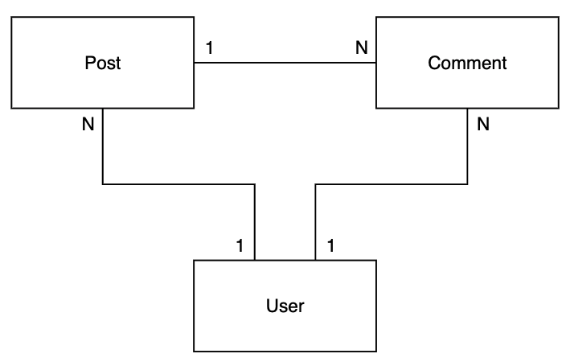
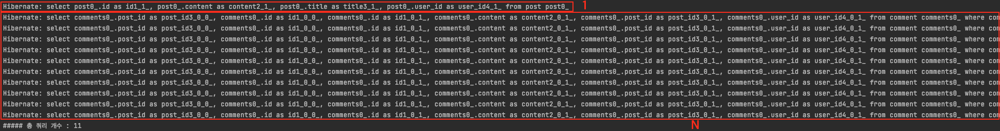
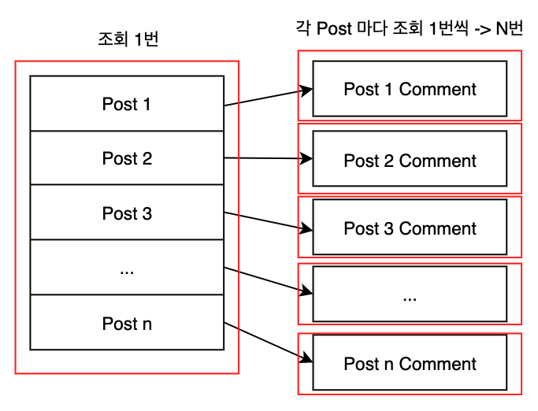
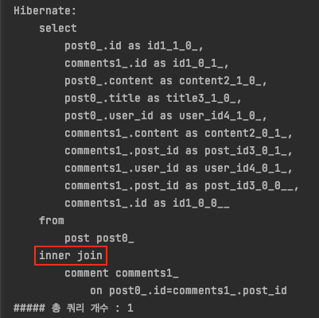
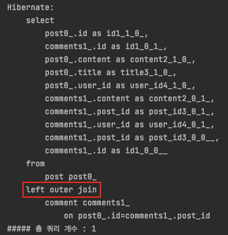
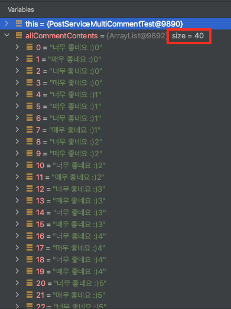
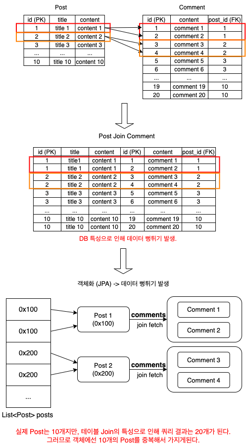
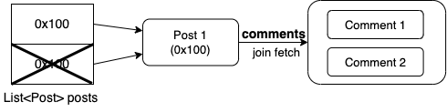
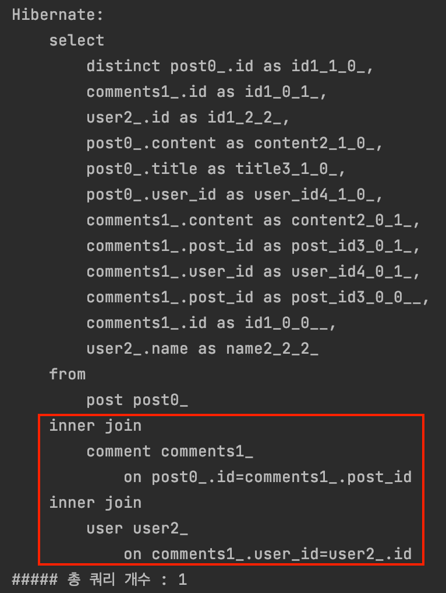
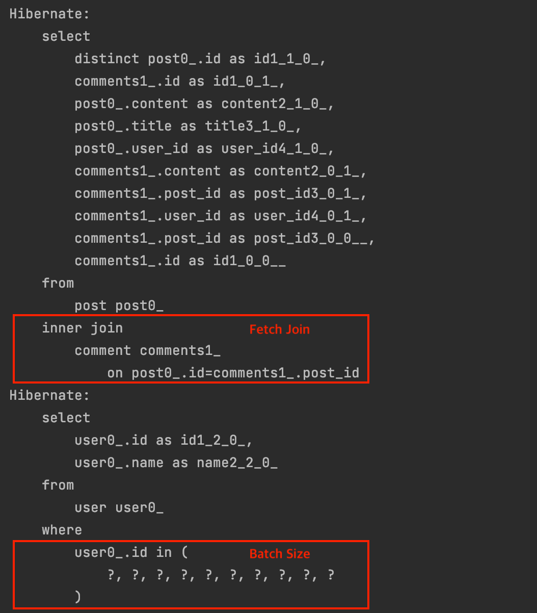

# 목차

<br>

- [목차](#목차)
- [들어가며](#들어가며)
- [0) 테스트 환경](#0-테스트-환경)
- [1) N + 1 문제란?](#1-n--1-문제란)
- [2) N + 1 문제 해결 방법](#2-n--1-문제-해결-방법)
  - [2-1) Join Fetch](#2-1-join-fetch)
  - [2-2) @EntityGraph](#2-2-entitygraph)
- [3) 데이터 뻥튀기 문제](#3-데이터-뻥튀기-문제)
- [4) 데이터 뻥튀기 문제 해결 방법](#4-데이터-뻥튀기-문제-해결-방법)
  - [4-1) Set](#4-1-set)
  - [4-2) DISTINCT](#4-2-distinct)
  - [4-3) 데이터 뻥튀기 문제는 일대다 상황에서만 발생한다](#4-3-데이터-뻥튀기-문제는-일대다-상황에서만-발생한다)
- [5) Join Fetch vs @EntityGraph](#5-join-fetch-vs-entitygraph)
- [번외 - 여러 단계로 Fetch Join을 해야하는 경우](#번외---여러-단계로-fetch-join을-해야하는-경우)
  - [Fetch Join 별칭을 이용한 여러번 사용](#fetch-join-별칭을-이용한-여러번-사용)
  - [batch_size](#batch_size)
- [마치며](#마치며)

<br>

# 들어가며
계속 미루다 이제야 정리하게되었다. 

이번 글은 JPA를 사용하다보면 꼭 한번 쯤은 마주하게 되는 N + 1 문제에 대해 쉽게 정리한 글이다. 

필자가 생각하기엔 쉽게 설명한 것 같다.. :)

개인적으로 직접 코드를 따라 작성하면서 읽는 것을 추천한다. (N + 1은 더더욱 직접 코드를 작성하지 않으면 이해하기 어렵다고 생각든다.)

> 모든 소스 코드는 [여기](https://github.com/binghe819/learning-sandbox/tree/master/jpa-n-plus-1-basic)를 참고하면 된다.

<br>

# 0) 테스트 환경
이번 글은 학습 테스트를 기반으로 작성된 글이다.

본격적으로 N + 1 문제에 대해 다루기 전에 학습 테스트용 환경을 만들어본다.

<br>

**의존성**

* Spring Boot 2.6.1
* Spring Data JPA 2.6.1
* Lombok

<br>

**테스트 도메인 설계**

테스트에 사용될 도메인은 아래와 같이 간단히 설계했다.

<p align="center"> </p>

**코드로 위 설계를 표현하면 아래와 같다. 모든 연관관계는 LAZY Loading되도록 하였다.**

> 모든 연관관계는 N : 1 양뱡향으로 설정.

<br>

> Post.java

```java
@NoArgsConstructor
@Getter
@Entity
public class Post {

    @Id @GeneratedValue(strategy = GenerationType.IDENTITY)
    private Long id;

    private String title;

    private String content;

    @ManyToOne(fetch = FetchType.LAZY)
    @JoinColumn(name = "user_id", nullable = false)
    private User writer;

    @OneToMany(mappedBy = "post", fetch = FetchType.LAZY, cascade = CascadeType.PERSIST)
    private List<Comment> comments = new ArrayList<>();

    @Builder
    public Post(String title, String content, User writer, List<Comment> comments) {
        this.title = title;
        this.content = content;
        this.writer = writer;
        if (Objects.nonNull(comments)) {
            this.comments = comments;
        }
    }

    public void addComment(Comment comment) {
        this.comments.add(comment);
        comment.updatePost(this);
    }
}
```

<br>

> Comment.java

```java
@NoArgsConstructor
@Getter
@Entity
public class Comment {

    @Id @GeneratedValue(strategy = GenerationType.IDENTITY)
    private Long id;

    private String content;

    @ManyToOne(fetch = FetchType.LAZY)
    @JoinColumn(name = "user_id", nullable = false)
    private User writer;

    @ManyToOne(fetch = FetchType.LAZY)
    @JoinColumn(name = "post_id", nullable = false)
    private Post post;

    @Builder
    public Comment(String content, User writer, Post post) {
        this.content = content;
        this.writer = writer;
        this.post = post;
    }

    public void updatePost(Post post) {
        this.post = post;
    }
}
```

<br>

> User.java

```java
@NoArgsConstructor
@Getter
@Entity
public class User {

    @Id @GeneratedValue(strategy = GenerationType.IDENTITY)
    private Long id;

    private String name;

    @OneToMany(mappedBy = "writer", fetch = FetchType.LAZY, cascade = CascadeType.PERSIST)
    private List<Post> posts = new ArrayList<>();

    @OneToMany(mappedBy = "writer", fetch = FetchType.LAZY, cascade = CascadeType.PERSIST)
    private List<Comment> comments = new ArrayList<>();

    @Builder
    public User(String name, List<Post> posts, List<Comment> comments) {
        this.name = name;
        if (Objects.nonNull(posts)) {
            this.posts = posts;
        }
        if (Objects.nonNull(comments)) {
            this.comments = comments;
        }
    }
}
```

앞으로의 예시는 모두 위 도메인을 사용한다.

<br>

# 1) N + 1 문제란?
대부분의 JPA를 사용하는 개발자는 `N + 1`이란 단어를 한 번쯤은 접한다.

개념은 누구나 알기 때문에, 이번 글에선 직접 예시를 통해 `N + 1`가 무엇인지 알아본다.

`Post 1 : N Comment`을 사용하여 **모든 Post의 Comment 내용**을 가져오는 예시를 사용한다.

<br>

> PostService.java

```java
@Slf4j
@Transactional(readOnly = true)
@Service
public class PostService {

    private PostRepository postRepository;

    public PostService(PostRepository postRepository) {
        this.postRepository = postRepository;
    }

    public List<String> findAllCommentContents() {
        return extractCommentContents(postRepository.findAll());
    }

    private List<String> extractCommentContents(List<Post> posts) {
        return posts.stream()
            .flatMap(post -> post.getComments().stream().map(Comment::getContent))
            .collect(Collectors.toList());
    }
}
```

<br>

테스트 코드는 아래와 같다.

> PostServiceSingleCommmentTest.java

```java
@DisplayName("N + 1 테스트 - Post당 Comment 하나씩")
@ActiveProfiles("test")
@DirtiesContext(classMode = ClassMode.BEFORE_EACH_TEST_METHOD)
@SpringBootTest(webEnvironment = WebEnvironment.NONE)
class PostServiceSingleCommentTest {

    @Autowired
    private PostService postService;

    @Autowired
    private PostRepository postRepository;

    @Autowired
    private UserRepository userRepository;

    @Autowired
    private QueryCounter queryCounter;

    @BeforeEach
    void setUp() {
        User user = userRepository.save(User.builder().name("빙허").build());

        for (int i = 0; i < 10; i++) {
            Post post = Post.builder()
                .title("N + 1 문제" + i)
                .content("N + 1 문제를 해결해보아요." + i)
                .writer(user)
                .build();

            post.addComment(Comment.builder().content("너무 좋네요 :)" + i).writer(user).build());
            postRepository.save(post);
        }
    }

    @DisplayName("문제 해결 전 - 모든 Post의 Comments를 조회하면 N + 1 문제가 발생한다.")
    @Test
    void findAllCommentContents() {
        queryCounter.startCount();

        List<String> allCommentContents = postService.findAllCommentContents();

        assertThat(allCommentContents).hasSize(10);

        assertThat(queryCounter.getCount().getValue()).isEqualTo(11); // N + 1
        printQueryCount();
    }
}
```

위 테스트 코드를 실행하면 아래와 같이 쿼리가 11번 날라간 것을 볼 수 있다.

<p align="center"> </p>

이는 **Post 목록 조회 1번 + 조회된 Post마다의 Comment 조회 1번씩 (N번) 발생해서 N + 1 문제가 발생한 것이다.**

그림을 통해 더 쉽게 보자면 아래와 같다.

<p align="center"> </p>

<br>

`11번이면 괜찮은 것 아닌가?`라고 생각하시는 분들이 있을 것 같다.

**현재는 Post 10개, 각 Post 별로 Comment 1개씩 (총 10개)이므로 11번 날라간 것이다.**

**만약 Post가 100만개면, 하나의 서비스 로직이 호출될 때마다 쿼리가 총 1,000,001(1 + 100만)번 날라가므로 굉장히 비용이 커지게 된다.**

> 실제로 서버 성능 테스트의 부하는 대부분 DB에서 발생한다. DB의 부하를 줄이는 것은 굉장히 중요하다.

<details>
  <summary>쿼리 카운팅과 관련해서 궁금하신 분은 여기를 참고</summary>
  
  --- 
  
  쿼리 카운팅은 필자가 캐싱 테스트와 N + 1 테스트를 위해 구현한 내용입니다.

  자세한 내용은 [여기](https://github.com/binghe819/TIL/blob/master/Spring/%EA%B8%B0%ED%83%80/QueryCounter/%EB%8B%A4%EC%9D%B4%EB%82%B4%EB%AF%B9%20%ED%94%84%EB%A1%9D%EC%8B%9C%EB%A5%BC%20%EC%9D%B4%EC%9A%A9%ED%95%9C%20QueryCounter%20%EC%A0%81%EC%9A%A9%EA%B8%B0.md)를 참고해주세요.

  > 꼭 구현하실 필요는 없습니다. 필자는 쿼리 횟수 테스트를 자동화하기 위해서 구현한 것입니다.
  
  --- 
</details>

<br>

# 2) N + 1 문제 해결 방법
N + 1 문제로 인해 하나의 서비스 로직을 실행하는데 DB에 많은 쿼리가 날라간다. DB의 부하가 점차 심해진다.

이를 해결하는 방법은 **최대한 DB에 쿼리를 적게 날리는 것이다.**

보편적으로 많이 사용되는 해결 방법은 두 가지다.

1. Join Fetch
2. @EntityGraph

<br>

## 2-1) Join Fetch
첫번째 해결 방법은 가장 많이 사용되는 `Join Fetch`이다.

> 보통은 `패치 조인`이라고 불린다.

<br>

> PostRepository.java

```java
public interface PostRepository extends JpaRepository<Post, Long> {

    @Query("select p from Post p join fetch p.comments")
    List<Post> findAllFetchJoin();
}
```

위 메서드를 통해 `Post` 목록을 가져오면 `Inner Join`을 통해 Comment도 하나의 쿼리로 가져온다.

<p align="center"> </p>

<br>

## 2-2) @EntityGraph
두번째 해결 방법은 `@EntityGraph` 애노테이션을 사용하는 방법이다.

> PostRepository.java

```java
public interface PostRepository extends JpaRepository<Post, Long> {

    @EntityGraph(attributePaths = "comments")
    @Query("select p from Post p")
    List<Post> findAllEntityGraph();
}
```

위 메서드를 통해 `Post` 목록을 가져오면 `Left Outer Join`을 통해 Comment도 하나의 쿼리로 가져온다.

<p align="center"> </p>

<br>

# 3) 데이터 뻥튀기 문제
지금까지 N + 1에 대한 기본적인 이해와 해결 방법에 대해서 알아보았다.

하지만 위 예시는 `Post 1 : N Comment`에서 `한 개의 Post당 한 개의 Comment`만 존재할 때의 예시이다.

즉, **1 : N 관계에서 N이 하나인 경우 (데이터 개수가 1 : 1인 경우 경우) distinct여부와 관계없이 정상동작한다.**

실제 현업에선 일대일 관계가 아닌이상 위와 같은 상황은 거의 없다. (1 : N이면 당연히 데이터도 1 : N으로 많은 데이터가 저장됨)

> Post마다 하나의 Comment만 달 수 있는 서비스는 없지 않은가..! 보통 여러 개의 Comment를 작성한다.

즉, 실제 운영에서 위와같이 사용하면 큰일 날 수 있다.

그 이유는 **데이터 뻥튀기 문제가 발생하기 때문이다.**

이번엔 `한 개의 Post당 여러 개의 Comment`를 가진 예시를 통해 테스트하면서, 데이터 뻥튀기에 대해서 알아본다.

<br>

> PostServiceMultiCommentTest.java

```java
@DisplayName("N + 1 테스트 - Post당 Comment 여러개씩")
@ActiveProfiles("test")
@DirtiesContext(classMode = ClassMode.BEFORE_EACH_TEST_METHOD)
@SpringBootTest(webEnvironment = WebEnvironment.NONE)
public class PostServiceMultiCommentTest {

    @Autowired
    private PostService postService;

    @Autowired
    private PostRepository postRepository;

    @Autowired
    private UserRepository userRepository;

    @Autowired
    private QueryCounter queryCounter;

    @BeforeEach
    void setUp() {
        User user = userRepository.save(User.builder().name("빙허").build());

        for (int i = 0; i < 10; i++) {
            Post post = Post.builder()
                .title("N + 1 문제" + i)
                .content("N + 1 문제를 해결해보아요." + i)
                .writer(user)
                .build();

            post.addComment(Comment.builder().content("너무 좋네요 :)" + i).writer(user).build());
            post.addComment(Comment.builder().content("매우 좋네요 :)" + i).writer(user).build());
            postRepository.save(post);
        }
    }

    @DisplayName("중복 제거 안한 테스트 - 데이터 뻥튀기로 인해 동일한 주소를 가리키는 객체 두 개를 중복해서 가지고 있는다. (카테시안 곱)")
    @Test
    void findAllCommentContentsByFetchJoin() {
        queryCounter.startCount();

        List<String> allCommentContents = postService.findAllCommentContentsByFetchJoin();

        assertThat(allCommentContents.size()).isNotEqualTo(20); // 20을 예상하지만 뻥튀기되어 40개가 나온다
        assertThat(allCommentContents).hasSize(40);
        assertThat(allCommentContents.get(0)).isSameAs(allCommentContents.get(2)); // 동일한 주소를 가리키는 객체
        assertThat(queryCounter.getCount().getValue()).isEqualTo(1);
        printQueryCount();
    }
}
```
`한 개의 Post당 두 개의 Comment`를 저장하고 모든 Comment의 Content를 가져오는 예시이다.

**당연히 결과는 `Post 10 * 2 = 20`일 것으로 예상하지만, 결과는 40이 나오게 된다.**

<p align="center"> </p>

이는 **객체와 RDB 테이블의 패러다임 차이**때문에 발생하는 문제이다.

글보다는 그림을 통해 보는 것이 이해하기 쉽다.

<p align="center"> </p>

SQL Join 쿼리를 통해 데이터를 가져오기 때문에, Post당 행이 두 개가 된다. (**만약 Post가 Comment를 n개 가지고 있다면 n개 행이 된다.**)

**실제 `List<Post>`는 결과 테이블의 개수인 20개이지만, 각 요소가 중복적으로 데이터(`Post`의 참조값)를 가지고 있어 `getComment`를 하면 데이터가 2배 (40개)로 나오게 된다.**

만약 Post마다 3개씩 Comment를 가지고 있다면, 결과는 90 (Post 10 * Post마다 Comment 개수 3 * 중복된 id로 인한 데이터 뻥튀기3)개가 된다. (점점 데이터 뻥튀기가 심해진다)

> 1:N관계를 조인했을 때 N을 기준으로 조인이 되고, 그 결과를 그대로 가져옴으로써 데이터 뻥튀기가 발생.

<br>

🤔 이러한 문제는 왜 발생할까?

**객체에선 쿼리 결과를 가져와서 영속성 컨텍스트가 `id`를 통해 판별하여 하나만 만들게 된다.**

하지만 RDB Join 결과의 특정상 중복된 값을 반환한다. JPA는 RDB 테이블 결과의 개수만큼 결과 리스트안에 담아 반환하게 되며, 이때 `id`를 통해 판별한 중복된 값이 들어가게 된다.

그러므로 **20개의 쿼리 결과가 객체에서의 List안에는 40개가 존재했던 것이다.**

> 쉽게 얘기해서 **JPA는 `id`를 통해 SQL 결과의 로우를 판별한다. 이때 중복은 신경쓰지 않고 SQL 결과의 행 하나당 하나의 객체로 결과를 반환한다.**

<br>

# 4) 데이터 뻥튀기 문제 해결 방법
데이터 뻥튀기 문제는 생각보다 훨씬 심각한 오류를 초래할 수 있기 때문에 항상 주의해주어야한다.

N + 1 문제와 다르게 발견하기가 쉽지 않다.

<br>

<p align="center"> </p>

위와 같이 중복된 결과를 제거해주어야한다.

<br>

## 4-1) Set
첫 번째 방법은 `1 : N` 필드의 타입을 `Set`으로 선언하는 것이다.

> 이때 `equals`, `hashCode`를 `id`기준으로 재정의해주어야한다. 

순서를 보장하기위해 보통은 `LinkedHashSet`를 사용한다고 한다.

```java
@Entity
public class Post {

    ...

    @OneToMany(mappedBy = "post", fetch = FetchType.LAZY, cascade = CascadeType.PERSIST)
    private Set<Comment> comments = new LinkedHashSet<>();

    ...
}
```

<br>

## 4-2) DISTINCT
두 번째 방법은 `DISTINCT`를 사용하여 중복을 제거하는 방법이다.

```java
public interface PostRepository extends JpaRepository<Post, Long> {

    @Query("select DISTINCT p from Post p join fetch p.comments")
    List<Post> findAllFetchJoinDistinct();

    @EntityGraph(attributePaths = "comments")
    @Query("select DISTINCT p from Post p")
    List<Post> findAllEntityGraphDistinct();
}
```
> Join Fetch와 @EntityGraph 모두 동일하게 사용가능하다.

JPQL의 `DISTINCT`는 2가지 기능을 제공한다.
1. SQL에 `DISTINCT`를 추가
2. **애플리케이션에서 엔티티 중복 제거 (같은 식별자를 가진 엔티티의 중복을 제거해준다)**

<br>

## 4-3) 데이터 뻥튀기 문제는 일대다 상황에서만 발생한다
데이터 뻥튀기 문제는 기준을 어디에 두느냐에 따라 데이터가 늘어나거나 늘어나지 않는다.
* `N : 1`의 Comment입장에서 데이터는 뻥튀기 되지 않는다.
* `1 : N`의 Post입장에서 데이터는 뻥튀기 된다.

즉, **PK(다)를 가지고 있는 엔티티를 기반으로 fetch join한다면 객체에서의 데이터 뻥튀기는 발생하지 않는다.**

<br>

# 5) Join Fetch vs @EntityGraph
지금까지 N + 1를 해결 방법으로 두 방법을 소개했다.

이 두 방법의 공통점과 차이점은 무엇일까?

<br>

**공통점 - 카테시안 곱**

두 해결 방법의 공통점은 둘 다 카테시안 곱이 발생한다.

위 예시에서는 Comment의 수만큼 Post가 중복 발생하게 된다. (실제 존재하는 데이터보다 2배 뻥튀기된 것을 볼 수 있었다)

<br>

**차이점**

* Fetch Join은 Inner Join을 사용한다.
* @EntityGraph는 Left Outer Join을 사용한다.

> Inner Join과 Left Outer Join의 차이점은 [여기](https://stackoverflow.com/questions/38549/what-is-the-difference-between-inner-join-and-outer-join)를 참고.

<br>

# 번외 - 여러 단계로 Fetch Join을 해야하는 경우
여러 단계로 Fetch Join (패치 조인을 여러번 사용해야 할 경우)은 어떻게 해야할까?

예를 들어, 모든 Post의 Comment와 Comment를 작성한 User를 쿼리 한 번으로 가져올려면 어떻게 해야할까? 

(Post -> Comment -> User를 한 번에 가져오기)

<br>

## Fetch Join 별칭을 이용한 여러번 사용

첫번째는 **한 JPQL 쿼리안에 Fetch Join을 여러번 사용**하는 방법이다.

<br>

> PostRepository.java
```java
public interface PostRepository extends JpaRepository<Post, Long> {
    @Query("select DISTINCT p from Post p join fetch p.comments c join fetch c.writer")
    List<Post> findAllFetchJoinWithCommentWriter();

    @EntityGraph(attributePaths = {"comments", "comments.writer"})
    @Query("select DISTINCT p from Post p")
    List<Post> findAllEntityGraphWithCommentWriter();
}
```
Fetch Join과 `@EntityGraph` 방법 모두 사용 가능하다.

이제 테스트를 만들어 직접 눈으로 확인해본다.

<br>

> PostServiceMultiCommentTest.java
```java
@DisplayName("중복 제거 + 여러 단계 Fetch Join")
@Test
void findAllFetchJoinWithCommentWriter() {
    // given
    queryCounter.startCount();
    List<Post> posts = postRepository.findAllEntityGraphWithCommentWriter();
    // List<Post> posts = postRepository.findAllEntityGraphWithCommentWriter();

    // when
    // 기존의 Post의 Comments 가져오는 코드.
    List<String> comments = posts.stream()
        .flatMap(post -> post.getComments().stream().map(Comment::getContent))
        .collect(Collectors.toList());

    // (User는 Lazy이지만, 여러 단계의 Fetch Join을 통해 User도 한 번에 가져왔기 때문에 추가로 쿼리가 날아가지 않는다.)
    List<String> userNames = posts.stream()
        .map(post -> post.getWriter().getName())
        .collect(Collectors.toList());

    // then
    assertThat(comments).hasSize(20);
    assertThat(userNames).hasSize(10);
    assertThat(queryCounter.getCount().getValue()).isEqualTo(1);
    printQueryCount();
}
```

<p align="center"> </p>

**두 번의 inner join을 통해 가져오는 것을 볼 수 있다. 이는 Fetch Join에 별칭을 주는 방법이다.**

데이터 일관성 문제로 인해 Fetch Join에 별칭을 붙이는 것은 좋지 않다.

다만, 위와 같이 어떠한 조건문 없이 Fetch Join에 별칭을 주는 것은 데이터 일관성을 깨트리지 않으므로 문제가 없다.

> 물론 그래도 문제가 없을지 꼼꼼히 확인해보고 사용하는 것이 좋다.

<br>

## batch_size

**다른 방법으로 Fetch Join에 별칭을 주기 싫다하면 `batch_size`를 사용하는 방법도 있다.**

테스트 코드는 [여기](https://github.com/binghe819/learning-sandbox/blob/master/jpa-n-plus-1-basic/src/test/java/com/binghe/jpanplus1/repository/PostRepositoryMultiFetchJoinTest.java)에서 자세히 볼 수 있으며, batch_size를 이용하면 아래와 같이 두 번의 쿼리가 날아가지만, N + 1 문제는 발생하지 않는다.

한번은 Post + Comment를 가져오며 (쿼리 한번), Comment의 User는 Batch처리로 in절을 이용하여 (쿼리 한번) 한번에 가져온다.

<p align="center"> </p>

> batch_size와 관련된 내용은 다음 글에서 더 자세히 다룰 예정이다.

<br>

# 마치며
간단히 작성하려고 했던 글이 생각보다 길어졌다.

그만큼 N + 1 문제는 쉬우면서도 고려해야 할 부분이 많다.

이 글을 통해 N + 1와 관련된 기초적인 개념을 이해했으면 좋겠다. 도움이 되었으면 좋겠다는 의미 :)

다음 글은 2개 이상의 컬렉션 패치 조인과 페이징 + Fetch Join에 관련된 글을 작성할 예정이다.
