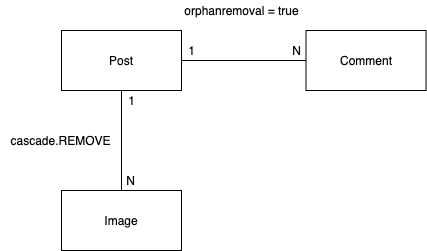
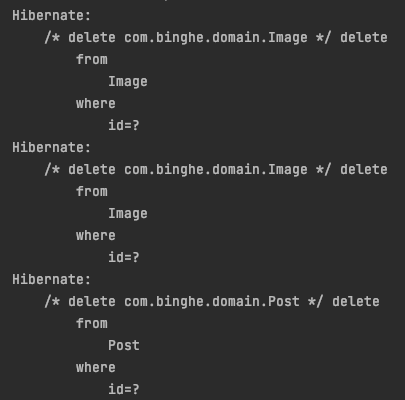
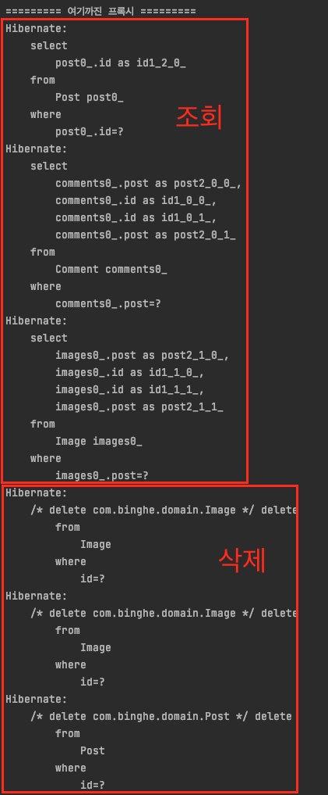
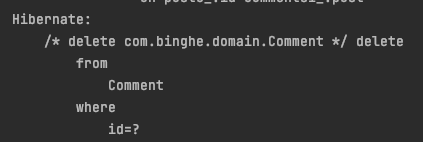

# 목차

<br>

- [목차](#목차)
- [개요](#개요)
- [테스트 도메인 모델](#테스트-도메인-모델)
- [cascade.REMOVE](#cascaderemove)
- [orphanremoval = true](#orphanremoval--true)
- [결론 - 공통점과 차이점](#결론---공통점과-차이점)

<br>

# 개요
프로젝트에 JPA를 사용하면서 CRUD를 구현해보았다.

그중에서도 여러 엔티티가 연관관계로 엮어있을 때 삭제를 구현하는 과정에서 두 가지가 헷갈렸다.

바로 `cascade.REMOVE`와 `orphanremoval=true`이다.

이번 글에선 학습 테스트를 통해 이 두 가지의 차이점을 알아보고자 한다.

자! 그럼 이제 간단한 요구사항을 지키는 도메인 모델을 설계하고, 아래 내용을 테스트해보자 :)

* 상위 엔티티가 삭제되면 하위 엔티티도 DB에서 같이 삭제되는가?
  * 하위 엔티티가 모두 프록시(지연 로딩)일 때도 DB에서 같이 삭제되는가?
* 상위 엔티티를 통해 하위 엔티티를 삭제하면 DB에서 삭제되는가?
* 상위 엔티티와 하위 엔티티가 프록시일 때 삭제되면 조회하고 같이 삭제되는가?

<br>

> 테스트 환경은 다음과 같다. (Spring-Data-JPA를 사용하지 않았다.)
> * hibernate: 5.3.10.Final
> * h2: 1.4.199
> * JUnit5: 5.7.0
> * assertJ: 3.20.2

<br>

# 테스트 도메인 모델
우선 학습 테스트하기 좋은 도메인 예시를 하나 만들어보자.

요구사항은 다음과 같다.

* Post는 여러 Image를 가질 수 있다. (1 : N = Post : Image)
  * 단, Image는 수정 및 삭제 될 수 없다. Post가 삭제될 때 같이 삭제된다.
* Post는 여러 Comment를 가질 수 있다. (1 : N = Post : Comment)
  * Comment는 삭제될 수 있다. Post가 삭제될 때도 같이 삭제된다.

<br>

위 요구사항을 간단히 코드로 구현해보면 아래와 같다.

<p align="center"> </p>

```java
// Post
@Entity
public class Post {

    @Id
    @GeneratedValue(strategy = GenerationType.IDENTITY)
    private Long id;

    @OneToMany(
        fetch = FetchType.LAZY,
        mappedBy = "post",
        cascade = {CascadeType.PERSIST, CascadeType.REMOVE}
    )
    private List<Image> images = new ArrayList<>();

    @OneToMany(
        fetch = FetchType.LAZY,
        mappedBy = "post",
        cascade = CascadeType.PERSIST,
        orphanRemoval = true
    )
    private List<Comment> comments = new ArrayList<>();

    public void addImage(Image image) {
        image.setPost(this);
        this.images.add(image);
    }

    public void addComment(Comment comment) {
        comment.setPost(this);
        this.comments.add(comment);
    }

    // getter, setter
}
```
> 추가적으로 `addXXX`라는 도움 메서드를 만들어주었다.

<br>

```java
@Entity
public class Image {

    @Id
    @GeneratedValue(strategy = GenerationType.IDENTITY)
    private Long id;

    @ManyToOne(fetch = FetchType.LAZY)
    @JoinColumn(name = "post")
    private Post post;

    // getter, setter
}
```

<br>

```java
@Entity
public class Comment {

    @Id
    @GeneratedValue(strategy = GenerationType.IDENTITY)
    private Long id;

    @ManyToOne(fetch = FetchType.LAZY)
    @JoinColumn(name = "post")
    private Post post;

    // getter, setter
}
```

> 그저 두 속성을 비교하기 위해 만든 간단한 예시일 뿐이다.
> 
> 요구사항마다 설계는 달라지므로, 그냥 참고용으로만 생각하면 좋을 듯 하다.

<br>

# cascade.REMOVE
> `cascade.REMOVE`는 Post - Image의 관계를 가지고 테스트한다.

<br>

cascade 속성은 영속성 전이 설정을 의미한다.

`cascade.REMOVE`의 의미는 상위 엔티티(Post)가 삭제될 때마다 하위 엔티티(Image)도 삭제되는 것을 의미한다.

즉, 상위 엔티티에 삭제 요청을 하면 하위 엔티티까지 해당 요청이 전이되는 것을 말한다.

<br>

**👨‍💻 첫번째 테스트. 상위 엔티티(Post)가 삭제되면 하위 엔티티(Image)도 같이 삭제되는가?**

```java
@DisplayName("상위 엔티티(Post)가 삭제되면 하위 엔티티(Image)도 같이 삭제된다.")
@Test
void cascade_REMOVE_DeleteParent() {
    // given
    createPostWithImages();

    // when
    entityManager.getTransaction().begin();
    entityManagerFlushAndClear();

    Post findPost = findPostById(1L);
    entityManager.remove(findPost);

    entityManager.getTransaction().commit();

    // then
    assertThat(findAllPosts().size()).isEqualTo(0);
    assertThat(findAllImages().size()).isEqualTo(0);
}
```

<p align="center"></p>

상위 엔티티를 삭제하니 하위 엔티티도 같이 삭제 쿼리 날리는 것을 볼 수 있다.

<br>

**👨‍💻 두번째 테스트. 상위 엔티티(Post)의 하위 엔티티(Image)를 삭제해도 DB엔 삭제되지 않는가?**

```java
@DisplayName("상위 엔티티(Post)의 하위 엔티티(Image)를 삭제해도 DB엔 삭제되지 않는다.")
@Test
void cascade_REMOVE_ParentDeleteChild() {
    // given
    createPostWithImages();

    // when
    entityManager.getTransaction().begin();
    entityManagerFlushAndClear();

    Post findPost = findPostById(1L);
    findPost.getImages().remove(0);

    entityManager.getTransaction().commit();

    // then
    assertThat(findAllPosts().size()).isEqualTo(1);
    assertThat(findAllImages().size()).isNotEqualTo(1);
    assertThat(findAllImages().size()).isEqualTo(2);
}
```

`assertThat` 구문을 보면 하위 엔티티인 Image가 삭제되지 않은 것을 알 수 있다.

실제 쿼리 로그를 봐도 DELETE 쿼리는 날아가지 않는다.

즉, 하위 엔티티가 삭제되지 않는다.

> 위 코드에선 getter를 통해 삭제하는 것은 좋지 않다. 
> 
> 그저 이번 테스트 용이성을 위해 저렇게 했을 뿐이다.
> 
> 실제 프로덕션 코드에선 자율적인 객체를 만들어주도록 노력하자.

<br>

**👨‍💻 세번째 테스트. 상위 엔티티(Post)와 하위 엔티티(Image)가 프록시일 때 상위 엔티티(Post)를 삭제하면 하위 엔티티(Image)까지 모두 삭제되는가?**

```java
@DisplayName("상위 엔티티(Post)와 하위 엔티티(Image)가 프록시일 때 상위 엔티티(Post)를 삭제하면 하위 엔티티(Image)까지 모두 조회하여 삭제한다.")
@Test
void cascade_REMOVE_DeleteProxyParentWithProxyChild() {
    // given
    createPostWithImages();

    // when
    entityManager.getTransaction().begin();
    entityManagerFlushAndClear();

    Post findPost = entityManager.getReference(Post.class, 1L);
    System.out.println("========= 여기까진 프록시 =========");
    entityManager.remove(findPost);

    entityManager.getTransaction().commit();

    // then
    assertThat(findAllPosts().size()).isEqualTo(0);
    assertThat(findAllImages().size()).isEqualTo(0);
}
```
<p align="center"> </p>

위와 같이 Post가 프록시로 조회하였고, 동일하게 삭제를 해보니 아래와 같이 쿼리를 날려 조회를 하고 삭제를 진행하는 것을 알 수 있다.

<p align="center"> </p>

<br>

# orphanremoval = true
> `orphanremoval=true`는 Post - Comment의 관계를 가지고 테스트한다.

우선 orphanremoval이란 단어는 고아 객체 설정을 의미한다.

`orphanremoval=true`의 의미는 고아 객체가 되면 DB에서 삭제하라는 설정이다.

> 고아 객체란 더이상 상위 엔티티에 연결되지 않은 엔티티를 의미한다.

<br>

**👨‍💻 첫번째 테스트. 상위 엔티티(Post)가 삭제되면 하위 엔티티(Comment)도 같이 삭제되는가?**

```java
@DisplayName("상위 엔티티(Post)가 삭제되면 하위 엔티티(Comment)도 같이 삭제된다.")
@Test
void orphanremoval_True_DeleteParent() {
    // given
    createPostWithComment();

    // when
    entityManager.getTransaction().begin();
    entityManagerFlushAndClear();

    Post findPost = findPostById(1L);
    entityManager.remove(findPost);

    entityManager.getTransaction().commit();

    // then
    assertThat(findAllPosts().size()).isEqualTo(0);
    assertThat(findAllComments().size()).isEqualTo(0);
}
```
테스트를 실행하면 `cascade.REMOVE`와 동일하게 DELETE 쿼리 세 개가 날라가는 것을 볼 수 있다.

즉, 삭제된다.

<br>

**👨‍💻 두번째 테스트. 상위 엔티티(Post)의 하위 엔티티(Comment)를 삭제해도 DB엔 삭제되지 않는가?**

```java
@DisplayName("상위 엔티티(Post)에서 하위 엔티티(Comment)를 삭제하면 DB에서 삭제된다.")
@Test
void orphanremoval_True_ParentDeleteChild() {
    // given
    createPostWithComment();

    // when
    entityManager.getTransaction().begin();
    entityManagerFlushAndClear();

    Post findPost = findPostById(1L);
    findPost.getComments().remove(0);

    entityManager.getTransaction().commit();

    // then
    assertThat(findAllPosts().size()).isEqualTo(1);
    assertThat(findAllComments().size()).isEqualTo(1);
    assertThat(findAllComments().size()).isNotEqualTo(2);
}
```
<p align="center"> </p>

위 로그를 보면 고아 객체가 된 0번째 하위 엔티티가 DB에서 삭제된 것을 볼 수 있다.

<br>

**👨‍💻 세번째 테스트. 상위 엔티티(Post)와 하위 엔티티(Comment)가 프록시일 때 상위 엔티티(Post)를 삭제하면 하위 엔티티(Comment)까지 모두 삭제되는가?**

```java
@DisplayName("상위 엔티티(Post)와 하위 엔티티(Comment)가 프록시일 때 상위 엔티티(Post)를 삭제하면 하위 엔티티(Comment)까지 모두 조회하여 삭제한다.")
@Test
void orphanremoval_True_DeleteParentWithProxyChild() {
    // given
    createPostWithComment();

    // when
    entityManager.getTransaction().begin();
    entityManagerFlushAndClear();

    Post findPost = entityManager.getReference(Post.class, 1L);
    System.out.println("========= 여기까진 프록시 =========");
    entityManager.remove(findPost);

    entityManager.getTransaction().commit();

    // then
    assertThat(findAllPosts().size()).isEqualTo(0);
    assertThat(findAllComments().size()).isEqualTo(0);
}
```

테스트를 실행해보면 `cascade.REMOVE`와 동일하게 프록시인 엔티티를 조회하고 삭제한다.

<br>

# 결론 - 공통점과 차이점
* 공통점
  * 상위 엔티티가 삭제되면 하위 엔티티도 같이 삭제된다. (하위 엔티티가 모두 프록시여도 삭제된다.)
* 차이점
  * `cascade.REMOVE`: 상위 엔티티를 통해 하위 엔티티를 삭제해도 DB엔 삭제가 되지 않는다.
    * 상위 엔티티에서 하위 엔티티의 값을 null로 주었다고 관계가 끊어졌다고 판단하지 않아서 DB에선 삭제되지 않는다.
  * `orphanremovel=true`: 상위 엔티티를 통해 하위 엔티티를 삭제하면 DB에도 삭제된다.
    * 상위 엔티티에서 하위 엔티티의 값을 null로 주면 관계가 끊어졌다고 판단하여 DB에서 삭제된다.

<br>

결론만 보면 생각보다 쉬운 내용이다 :)

물론 하이버네이트 공식 문서를 보면 나오는게 개념이지만, 헷갈리는 개념이어서 정리를 해보았다!

개인적으론 정리하며 JPA에 대한 이해가 더 깊어진 것 같아서 좋다!

더 자세한 코드는 [여기](https://github.com/binghe819/jpa-learning-sandbox/tree/cascade-remove-vs-orphanremoval-true)서 참고하길 바랍니다!

<br>

