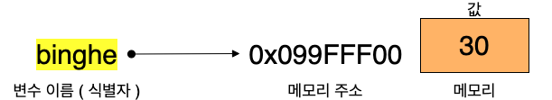
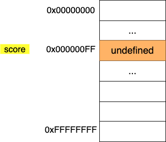
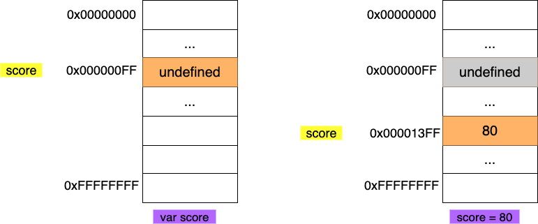
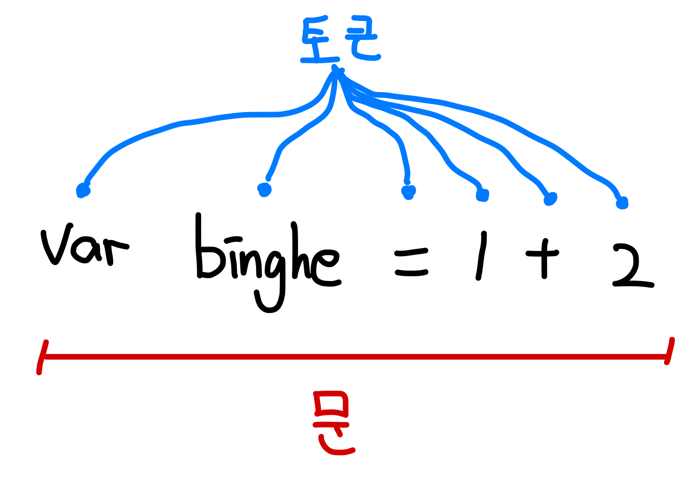

> 본 글은 다음 세 권의 책을 바탕으로 작성되었습니다.
>
> * [모던 자바스크립트 Deep Dive](http://www.yes24.com/Cooperate/Naver/welcomeNaver.aspx?pageNo=1&goodsNo=11781589)
> * [코어 자바스크립트](http://www.yes24.com/Cooperate/Naver/welcomeNaver.aspx?pageNo=1&goodsNo=11781589)
> * [인사이드 자바스크립트](http://www.yes24.com/Cooperate/Naver/welcomeNaver.aspx?pageNo=1&goodsNo=11781589)


# 목차

- [목차](#목차)
- [챕터 02 데이터 타입 및 연산자](#챕터-02-데이터-타입-및-연산자)
  * [1 변수](#1-변수)
    + [1-1 JS는 Unmanaged 언어이다](#1-1-js는-unmanaged-언어이다)
    + [1-2 값의 할당](#1-2-값의-할당)
    + [1-3 호이스팅](#1-3-호이스팅)
    + [1-4 네이밍 규칙](#1-4-네이밍-규칙)
  * [2 표현식과 문](#2-표현식과-문)
    + [2-1 값](#2-1-값)
    + [2-2 리터럴](#2-2-리터럴)
    + [2-3 표현식](#2-3-표현식)
    + [2-4 문](#2-4-문)
  * [3 JS 데이터 타입의 특징](#3-js-데이터-타입의-특징)
    + [3-1 데이터 타입의 필요성](#3-1-데이터-타입의-필요성)
    + [3-2 동적 타입](#3-2-동적-타입)
    + [3-3 동적 타입 언어 사용시 주의사항](#3-3-동적-타입-언어-사용시-주의사항)
  * [4 데이터 타입](#4-데이터-타입)
    + [4-1 숫자](#4-1-숫자)
    + [4-2 문자열](#4-2-문자열)
    + [4-3 템플릿 리터럴 (백틱)](#4-3-템플릿-리터럴-백택)
    + [4-4 불리언](#4-4-불리언)
    + [4-5 undefined](#4-5-undefined)
    + [4-6 null](#4-6-null)
    + [4-7 심벌](#4-7-심벌)
  * [5 JS 비교 연산자](#5-js-비교-연산자)
    + [5-1 동등 비교 ==](#5-1-동등-비교-)
    + [5-2 일치 비교 ===](#5-2-일치-비교-)
  * [6 타입 변환](#6-타입-변환)
    + [6-1 타입 변환 특징](#6-1-타입-변환-특징)
    + [6-2 암묵적 타입 변환](#6-2-암묵적-타입-변환)
    + [6-3 명시적 타입 변환](#6-3-명시적-타입-변환)
  * [7 단축 평가](#7-단축-평가)
    + [7-1 논리 연산자를 사용한 단축 평가](#7-1-논리-연산자를-사용한-단축-평가)
    + [7-2 Optional 체이닝 연산자](#7-2-optional-체이닝-연산자)
    + [7-3 null 병합 연산자](#7-3-null-병합-연산자)
- [참고](#참고)


# 챕터 02 데이터 타입 및 연산자


## 1 변수

프로그래밍 언어는 메모리 사용 관련해서 두 가지로 나눌 수 있다.

* Managed 언어
  * JAVA, Pythonm, C#, Javascript...
* Unmanaged 언어
  * C, C++, Assembly..


### 1-1 JS는 Unmanaged 언어이다

JS는 Unmanaged언어이며, 식별자가 값이 아닌 메모리 주소를 가리키고 있다.


#### 식별자

<p align="center">
</p>

* 식별자란
  * 어떤 값을 구별해서 식별할 수 있는 고유한 이름
* JS의 식별자
  * 식별자는 값이 아니라 메모리 주소를 기억하고 있다.
    * 실제 값은 메모리에 위치하며, 식별자는 그저 메모리 주소를 기억하고 있는다. (포인터)
  * 자바와 동일하다.


### 1-2 값의 할당

JS에서는 값의 할당과 재할당을 어떻게 하는 알아보자.


#### 변수 선언 -> undefined

```js
var score; // 변수 선언문 -> undefined
```

<p align="center">
</p>

* **변수 선언을 하면 메모리 공간을 확보하고 `undefined`값으로 초기화한다.**
  * null과 undefined의 차이점은 [여기](#3-8-undefined)서 확인하자.
* `undefined`값은 JS에서 제공하는 **원시 타입의 값**이다.


#### 값의 할당

```js
var score = 80; // 변수 선언과 값의 할당
```

**변수 선언은 호이스팅에 의해 런타임 이전에 실행되고, 값의 할당은 런타임시 순서대로 호출된다.**



1. 변수 선언 (호이스팅) -> `undefined`
2. 값 할당 -> `80`


#### 불변성

* 값의 할당 과정
  * 변수에 값을 할당할 때는 **이전 값 `undefined`가 저장되어 있던 메모리 공간을 지우고 그 메모리 공간에 할당 값 80을 새롭게 저장하는 것이 아니라 새로운 메모리 공간을 확보하고 그곳에 할당 값 80을 저장한다.**
* 불변성
  * 이러한 값의 할당 방식은 **값이 할당되고 변경될 수 없다는 성질을 의미하며, 이를 불변성**이라 칭한다.


#### 값의 재할당

```js
var score = 80;
score = 90;
```


* 컴파일 전 : score 변수 선언과 동시에 `undefined`로 할당
* 컴파일 후 : `80`으로 재할당 후, `90`으로 재할당.

> **중요한 점은 재할당 할 때마다 메모리를 담는 주소가 변경된다는 것이다. -> 불변성**


### 1-3 호이스팅

```js
console.log(score); // undefined

var score = 80;

console.log(score); // 80;
```

* 호이스팅이란
  * 변수 선언문이 코드 선두로 끌어 올려진 것처럼 동작하는 자바스크립트 고유의 특징
  * **변수 선언이 소스코드가 한 줄씩 순차적으로 실행되는 시점인 런타임이 아니라 그 이전 단계에 먼저 실행된다.**
    * **변수 선언만 컴파일 후 :arrow_right: 인터프리터방식으로 한 줄씩 실행**


### 1-4 네이밍 규칙

```js
// 카멜 케이스
var firstName;

// 스네이크 케이스
var first_name;

// 파스칼 케이스
var FirstName;

// 헝가리언 케이스
var strFirstName; // type + identifier
var $elem = document.getElementById('myId'); // DOM노드
var observable$ = fromEvent(document, 'click'); // RxJS 옵저버블
```

JS에서 자주 사용되는 방법

* 변수나 함수 - 카멜 케이스
* 생성자, 클래스 - 파스칼 케이스


## 2 표현식과 문


### 2-1 값

```js
// 10 + 20은 평가되어 숫자 값 30을 생성한다
10 + 20; // 30
var sum = 10 + 20; // 변수에는 10 + 20이 평가되어 생성된 숫자 값 30일 할당된다
```

* 값 (value)
  * 값은 식 (표현식, expression)이 평가되어 생성된 결과를 말한다
  * 변수에 평가되어 할당되는 값


### 2-2 리터럴

```js
100 // 정수 리터럴

10.5 // 부동소수점 리터럴

'hello' // 문자열 리터럴

true // 불리언 리터럴

null // null 리터럴

undefined // undefined 리터럴

{name : 'lee', address : 'seoul'} // 객체 리터럴

function() {} // 함수 리터럴
```

* 사전적 의미
  * 소스 코드에서 특정한 자료형의 값을 직접 표현하는 방식.
  * **변수 및 상수에 저장되는 값 자체**
  * 예시
    * 정수 리터럴 - 10, 1, 10000
    * 실수 리터럴 - 10.1, 10e3
    * 문자열 리터럴 - "System", "Binghe"
* 리터럴 (literal)
  * 사람이 이해할 수 있는 문자 또는 약속된 기호를 사용해 값을 생성하는 표기법
  * **리터럴은 평가되어 값을 생성한다.**

<p align="center">
</p>


### 2-3 표현식

```js
// 리터럴 표현식
10
'hello'

// 식별자 표현식
sum
person.name
arr[1]

// 연산자 표현식
10 + 20
sum = 10
sum !== 10

// 함수/메서드 호출 표현식
square()
person.getName()
```

* 표현식 (expression)
  * 표현식은 값으로 평가될 수 있는 문(statement)이다.
  * 즉, 표현식이 평가되어 새로운 값을 생성하거나 기존 값을 참조한다.
  * **인터프리터가 값으로 평가하는 구문**
* **값으로 평가될 수 있는 문은 모두 표현식이다.**
  * **표현식 == 값으로 평가**


### 2-4 문

```js
// 변수 선언문
var x;

// 할당문
x = 5;

// 함수 선언문
function foo() {}

// 조건문
if (x > 1) {console.log(x);}

// 반복문
for( var i = 0; i < 2; i++) {console.log(i);}
```



* 문 (statement)
  * 문은 프로그램을 구성하는 기본 단위이자 최소 실행 단위. (문이 모여 프로그램이 된다)


> 표현식인 문과 표현식이 아닌 문
>
> ```js
> // 변수 선언문은 표현식이 아닌 문이다
> var x;
> 
> // 할당문은 그 자체가 표현식이지만 완전한 문이기도 하다
> x = 100;
> 
> // 표현식이 아닌 문은 값처럼 사용할 수 없다
> var foo = var x;
> 
> // 할당문은 표현식이기 때문에 값처럼 사용이 가능하다
> var foo = x;
> ```


## 3 JS 데이터 타입의 특징

| 구분      | 데이터 타입       | 설명                                                |
| --------- | ----------------- | --------------------------------------------------- |
| 원시 타입 | 숫자 타입         | 숫자. 정수와 실수 구분 없이 하나의 숫자 타입만 존재 |
|           | 문자열 타입       | 문자열                                              |
|           | 불리언 타입       | 논리적 참(true)와 거짓(false)                       |
|           | undefined 타입    | var 키워드로 선언된 변수에 암묵적으로 할당되는 값   |
|           | null 타입         | 값이 없다는 것을 의도적으로 명시할 때 사용하는 값   |
|           | 심벌(symbol) 타입 | ES6에서 추가된 7번째 타입                           |
| 객체 타입 | 객체 타입         | 객체, 함수, 배열 등                                 |


### 3-1 데이터 타입의 필요성

* **값을 저장할 때 확보해야 하는 메모리 공간의 크기를 결정하기 위해**
  * 각 데이터 타입마다 확보해야할 메모리 공간의 크기가 다르다.
  * JS엔진은 데이터 타입 (값의 종류)에 따라 정해진 크기의 메모리 공간을 확보한다.
* **값을 참조할 때 한번에 읽어 들여야할 메모리 공간의 크기를 결정하기 위해**
  * 값을 참조하려면 한 번에 읽어 들여야 할 메모리 공간의 크기 (메모리 셀의 개수)를 알아야한다. 
* **메모리에서 읽어 들인 2진수를 어떻게 해석할지 결정하기 위해**


### 3-2 동적 타입

```js
// 정적 타입 언어 (C, Java, ...)
char c; // c변수에는 1바이트 정수 타입의 값 (-128 ~ 127)만 할당할 수 있다.
int num; // 4바이트 정수 타입의 값만 할당할 수 있다.

// 동적 타입 언어 (JS, Python, PHP...)
var foo;
console.log(typeof foo); //undefined

foo = 3;
console.log(typeof foo); // number

foo = 'Hello';
console.log(typeof foo); // string

foo = true;
console.log(typeof foo); // boolean

foo = null;
console.log(typeof foo); // object

foo = Symbol();
console.log(typeof foo); // symbol
```

* 정적 타입 언어 :arrow_right: 선언시 타입 결정
  * 정적 타입 언어는 **변수의 타입을 변경할 수 없으며, 컴파일 시점에 타입 체크를 수행한다.**
  * **변수 선언 시점에 변수의 타입이 결정된다.**
  * 유연성은 떨어지지만 신뢰성은 높다.
* 동적 타입 언어 :arrow_right: 할당시 타입 결정
  * **동적 타입 언어의 변수는 선언이 아닌 할당에 의해 타입이 결정된다.**
  * 그리고 **재할당에 의한 변수의 타입은 언제든지 동적으로 변할 수 있다.**
  * 어떠한 데이터 타입의 값이라도 자유롭게 할당할 수 있다.
  * 즉, **변수는 타입을 갖지 않는다. 값이 타입을 갖는다.**
* 동적 타입 언어의 단점
  * 계속해서 변환하는 변수 값과 타입을 추적하기 어렵다.
  * **값을 확인하기 전에는 타입을 확신할 수 없다**
  * 유연성은 높지만 신뢰성은 떨어진다


### 3-3 동적 타입 언어 사용시 주의사항

* 변수는 꼭 필요한 경우에 한해 제한적으로 사용한다.
  * 필요한 만큼 최소한으로 유지하도록 한다.
* 변수의 유효 범위 (스코프)는 최대한 좁게 만들어 변수의 부작용을 억제한다.
* 전역 변수는 최대한 사용하지 않도록 한다.
  * 어디서든지 참조/변경 가능한 전역 변수는 의도치 않게 값이 변경될 가능성이 높고 다른 코드에 영향을 줄 가능성이 높다.
* 변수보다는 상수를 사용해 값의 변경을 억제한다. (const)


## 4 데이터 타입


### 4-1 숫자

```js
// 모두 숫자 타입
var integer = 10; // 정수
var double = 10.12; // 실수
var negative = -20; // 음의 정수
```

* 자바스크립트는 **하나의 숫자 타입만 존재**한다.
  * 숫자 타입의 값은 배정밀도 **64비트 부동소수점 형식**을 따른다.
  * 즉, **모든 수를 실수로 처리하며, 정수만 표현하기 위한 데이터 타입이 별도로 존재하지 않는다.**
* 그 외의 특별한 값
  * Infinity : 양의 무한대
  * -Infinity : 음의 무한대
  * NaN : 산술 연산 불가 (Not a Number)


### 4-2 문자열

```js
// 문자열 타입
var string;
string = '문자열'; // 작은따옴표
string = "문자열"; // 큰따옴표
string = `문자열`; // 백틱 (ES6)
```

* 문자열
  * C는 문자의 배열로, 자바도 문자의 배열이면서 객체로 문자열을 지원한다. JS에서는 원시 타입으로 지원한다.
  * 즉, **문자열을 원시 타입이며, 불변값이다.**
* 자바스크립트에서는 작은 따옴표를 주로 사용한다고 한다.


### 4-3 템플릿 리터럴 (백틱)

```js
// 백틱에서는 줄바꿈등을 허용한다
var template = `<ul>
	<li><a href = "#">Home</a></li>
</ul>`;

// 표현식 삽입
var first = 'binghe';
var last = 'kim';

console.log(`My name is ${first} ${last}.`);
```

* 백틱에서는 일반 문자열에서 사용하지 못하는 여러 시퀀스를 허용한다.

```js
// 일반 문자열
console.log('1 + 2 = ${1 + 2}'); // 1 + 2 = ${1 + 2};

// 백틱
console.log(`1 + 2 = ${ 1 + 2 }`); // 1 + 2 = 3;
```


### 4-4 불리언

```js
var foo = true;
console.log(foo); // true

foo = false;
console.log(foo) ; // false
```


### 4-5 undefined

```js
var foo;
console.log(foo); // undefined
```

* 변수 선언에 의해 확보된 메모리 공간을 처음 할당이 이뤄질 때까지 빈 상태로 내버려두지 않고 JS엔진이 undefined로 초기화한다.

> **null 과 undefined의 차이**
>
> * undefined : 개발자가 의도적으로 할당하기 위한 값이 아니라 **JS 엔진이 변수를 초기화할 때 사용하는 값.**
> * null : **변수에 값이 없다고 개발자가 명시적으로 하고싶을 때 사용.**


### 4-6 null

```js
var foo = 'Lee';

// 이전 참조를 제거. 
foo = null;
```

* **null은 변수에 값이 없다는 것을 명시적으로 명시할 때 사용된다.**
  * null은 변수가 이전에 참조하던 값을 더 이상 참조하지 않겠다는 의미.
* **null보다는 변수의 스코프를 좁게 만들어 변수 자체를 재빨리 소멸시키는 편이 낫다.**


### 4-7 심벌

```js
// 심벌 값 생성
var key = Symbol('key');
console.log(typeof key); // Symbol

// 객체 생성
var obj = {};

// 이름이 충돌될 위험이 없는 유일무이한 값인 심벌을 프로퍼티 키로 사용한다.
obj[key] = 'value';
console.log(obj[key]); // value
```

* 심벌
  * ES6에서 추가된 7번째 타입으로, 변경 불가능한 원시 타입의 값.
  * 심벌 값은 다른 값과 중복되지 않는 유일무이한 값이다.
  * 주로 이름이 충돌할 위험이 없는 객체의 프로퍼티 키를 만들기 위해 사용된다.


## 5 JS 비교 연산자

JS는 동적 타입 언어이므로, 비교 연산방법이 C나 자바와는 조금 다르다.

| 비교 연산자 |    의미     |  사례   |           설명           | 부수 효과 |
| :---------: | :---------: | :-----: | :----------------------: | :-------: |
|     ==      |  동등 비교  | x == y  |    x와 y의 값이 같음     |     X     |
|     ===     |  일치 비교  | x === y | x와 y의 값과 타입이 같음 |     X     |
|     !=      | 부동등 비교 | x != y  |    x와 y의 값이 다름     |     X     |
|     !==     | 불일치 비교 | x !== y | x와 y의 값과 타입이 다름 |     X     |


### 5-1 동등 비교 ==

```js
// 동등 비교
5 == 5; // true

// 타입은 다르지만 암묵적 타입 변환을 통해 타입을 일치시키면 동등하다.
5 == '5'; // true
```

* 동등 비교란?
  * 동등 비교(==) 연산자는 좌항과 우항의 피연산자를 비교할 때 **먼저 암묵적 타입 변환을 통해 타입을 일치시킨 후 같은 값인지 비교한다.**
  * **동등 비교 연산자는 좌항과 우항의 피연산자가 타입은 다르더라도 암묵적 타입 변환 후에 같은 값일 수 있다면 true를 반환.**
* 동등 비교 연산의 단점
  * **편리해보이지만 결과를 예측하기 어렵고 실수하기 쉽다.**

```js
// 동등 비교. 결과를 예측하기 어렵다.
'0' == ''; // false
0 == ''; // true
0 == '0'; // true
false == 'false'; // false
false == '0'; // true
false == null; // false
false == undefined; // false
```

> 딱봐도 결과를 예측하기 어렵다.. 가능한 일치 비교 연산자를 사용한다.


### 5-2 일치 비교 ===

```js
// 일치 비교
5 === 5; // true

// 암묵적 타입 변환을 하지 않고 값을 비교한다
5 === '5'; // false
```

* 일치 비교란?
  * **일치 비교 연산자는 좌항과 우항의 피연산자가 타입도 같고 값도 같은 경우에 한하여 true를 반환한다.**
  * 즉, **좌항과 우항을 비교할 때 암묵적 타입 변환을 하지 않는다.**

* 주의할 점
  * 자바스크립트는 양의 0과 음의 0이 존재하는데 일치 비교시 같다고 처리한다.


## 6 타입 변환


### 6-1 타입 변환 특징

자바스크립트 타입 변환의 특징

* 원시 값은 불변이므로 변경할 수 없다. -> **새로운 메모리 공간을 할당하여 재할당하는 방식을 사용한다.**
  * 타입 변환이란 기존 원시값을 사용해 다른 타입의 새로운 원시 값을 생성하는 것
  * 즉, **기존 변수 값을 재할당하여 변경하는 것 아니다.**


### 6-2 암묵적 타입 변환

```js
// 피연산자가 모두 문자열 타입이어야 하는 문맥
'10' + 2; // '102'

// 피연산자가 모두 숫자 타입이어야 하는 문맥
5 * '10'; // 50

// 피연산자 또는 표현식이 불리언 타입이어야 하는 문맥
!0 // true
if(1) {}
```

* 연산을 하기 위해선 **하나의 데이터 타입으로 통일되야 한다. 이때 암묵적 타입 변환이 발생한다.**
* **문맥에 따라 타입 변환이 발생한다.**


#### 문자열 타입으로 변환

```js
// 숫자 타입
0 + '' // "0"
1 + '' // "1"
NaN + '' // "NaN"

// 불리언 타입
true + '' // true

...
```

* 어떠한 타입이든 뒤에 `+ ' '`를 붙여주면 문자열로 타입 변환이 발생한다.


#### 숫자 타입으로 변환

```js
// 문자열 타입
+ '' // 0
+ '0' // 0
+ '1' // 1

// 불리언
+true // 1
+false // 0

+null // 0
...
```

* 어떠한 타입이든 앞에 `+`를 붙여주면 숫자 타입으로 변환된다.


#### 불리언 타입으로 변환

```js
if('') console.log('1')
if(true) console.log('2') 
if(0) console.log('3')
if('str') console.log('4')
if(null) console.log('5')
// 정답 : 2 4
```

* 자바스크립트는 불리언 타입이 아닌 값을 두 가지로 구분한다.
  * Truthy 값 - 참으로 평가되는 값
  * Falsy 값 - 거짓으로 평가되는 값


#### Falsy값

```js
// Falsy값을 제외하면 모두 Truthy 값이다
if(!false) ...
if(!undefined) ...
if(!null) ...
if(!0) ...
if(!NaN) ...
if(!'') ...
```


### 6-3 명시적 타입 변환

* 명시적 타입 변환
  * **개발자의 의도에 따라 명시적으로 타입을 변환하는 방법**


#### 문자열 타입으로 변환

```js
// 1. String 생성자 함수를 new 연산자 없이 호출하는 방법
String(1); // "1"
String(NaN); // "NaN"
String(true); // "true"

// 2. Object.prototype.toString 메서드 사용하는 방법
(1).toString(); // "1"
(NaN).toString(); // "NaN"
(true).toString(); // "true"

// 3. 문자열 연결 연산자를 이용하는 방법
1 + ''; // "1"
NaN + ''; //"NaN"
true + ''; // "true"
```


#### 숫자 타입으로 변환

```js
// 1. Number 생성자 함수를 new 연산자 없이 호출하는 방법
Number('0'); // 0
Number('-1'); // -1
Number('10.53'); // 10.53
Number(true); // 1

// 2. parseInt, parseFloat 함수를 사용하는 방법 (문자열만 변환 가능)
parseInt('0'); // 0
parseInt('-1'); // -1
parseFloat('10.53'); // 10.53


// 3. + 단항 산술 연산자를 이용하는 방법
+'0'; // 0
+'-1'; // -1
+'10.53'; // 10.53
+true; // 1

// 4. * 산술 연산자를 이용하는 방법
'0' * 1; // 0
'-1' * 1; // -1
'10.53' * 1; // 10.53
true*1; // 1
```


#### 불리언 타입으로 변환

```js
// 1. Boolean 생성자 함수를 new 연산자 없이 호출하는 방법
Boolean('x'); // true
Boolean(''); // false
Boolean('false'); // true
Boolean(0); // false
Boolean(1); // true
Boolean(null); // false
Boolean(undefined); // false
Boolean({}); // true
Boolean([]); // true

// 2. ! 부정 논리 연산자를 두 번 사용하는 방법
!!'x'; // true
!!''; // false
!!'false'; // true
!!0; // false
!!1; // true
...
```


## 7 단축 평가

* 단축 평가란?
  * **논리 연산의 결과를 결정하는 피연산자를 타입 변환하지 않고 그대로 반환하는 것을 의미한다.**
  * 단축 평가는 표현식을 표현하는 도중에 평가 결과가 확정된 경우 나머지 평가 과정을 생략하는 것을 말한다.


### 7-1 논리 연산자를 사용한 단축 평가

|  단축 평가 표현식   | 평가 결과 |
| :-----------------: | :-------: |
| true \|\| anything  |   true    |
| false \|\| anything | anything  |
|  true && anything   | anything  |
|  false && anything  |   false   |

* 논리곱 연산의 평가 순서
  * **좌항 :arrow_right: 우항 (좌항에서 우항으로 평가한다)**
* 자바스크립트에서 논리 연산자의 결과는 불리언 값이 아닌 일반 데이터 타입일 수도 있다.

```js
// 논리합 (||) 연산자
'Cat' || 'Dog'; // "Cat"
false || 'Dog'; // "Dog"
'Cat' || false; // "Cat"

// 논리곱(&&) 연산자
'Cat' && 'Dog'; // "Dog"
false && 'Dog'; // false
'Cat' && false; // false
```


#### 활용 1 - Optional

JS에서 만약 객체를 가리키기를 기대하는 **변수의 값이 객체가 아니라 null 또는 undefined인 경우 객체의 프로퍼티를 참조하면 타입 에러가 발생한다.**

```js
// 에러가 발생하는 상황
var elem = null;
var value = elem.value; // TypeError: Cannot read property ...

// 논리곱을 사용한 에러 처리
var elem = null;
var value = elem && elem.value; // null
```

* elem이 null이나 undefined와 같은 Falsy 값이면 elem으로 평가되고
* elem이 Truthy 값이면 elem.value로 평가된다.


#### 활용 2 - 함수 매개변수에 기본값을 설정할 때

**함수를 호출할 때 인수를 전달하지 않으면 매개변수에는 undefined가 할당된다.**

이때 **단축 평가를 사용해 매개변수의 기본값을 설정하면 undefined로 인해 발생할 수 있는 에러를 방지할 수 있다.**

```js
// 단축 평가를 사용한 매개변수의 기본값 설정
function getStringLength(str) {
  str = str || '';
  return str.length;
}

getStringLength(); // 0
getStringLength('hi'); // 2

// ES6의 매개변수의 기본값 설정
function getStringLength(str = '') {
  return str.length;
}

getStringLength(); // 0
getStringLength('hi'); // 2
```


### 7-2 Optional 체이닝 연산자

옵셔널 체이닝 `?.`는 좌항의 피연산자가 null 또는 undefined인 경우 undefined를 반환하고, 그렇지 않으면 우항의 프로퍼티 참조를 이어간다.

* **`?.` == `&&`**

```js
var elem = null;

// elem이 null 또는 undefined이면 undefined를 반환하고, 그렇지 않으면 우항의 프로퍼티 참조를 이어간다.
var value = elem?.value;
console.log(value); // undefined

var value = elem && elem.value;
console.log(value); // null
```

* 좌항의 피연산자가 false면, 좌항의 프로퍼티.
* 좌항의 피연산자가 true면, 우항의 프로퍼티.


### 7-3 null 병합 연산자

null 병합 연산자 (`??`)는 좌항의 피연산자가 null 또는 undefined인 경우 우항의 피연산자를 반환하고, 그렇지 않으면 좌항의 피연산자를 반환한다.

* **`??` == `||`**

```js
var foo = null ?? 'default string';
console.log(foo); // default string

// 좌항의 피연산자 null 또는 undefined이면 우항의 피연산자를 반환하고, 그렇지 않으면 좌항의 피연산자를 반환한다
var foo = '' || 'default string';
console.log(foo); // default string

var foo = '' ?? 'default string'; // 꼭 null이나 undefined이여야 한다.
console.log(foo); // ''
```

* **좌항의 연산자가 꼭 falthy값이 아닌 null이나 undefined이여야 한다.** 
* **기본값을 설정**할 때 유용하다.


# 참고

