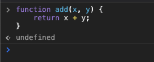
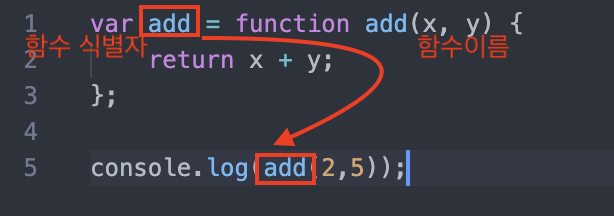

> 본 글은 다음 세 권의 책을 바탕으로 작성되었습니다.
>
> * [모던 자바스크립트 Deep Dive](http://www.yes24.com/Cooperate/Naver/welcomeNaver.aspx?pageNo=1&goodsNo=11781589)
> * [코어 자바스크립트](http://www.yes24.com/Cooperate/Naver/welcomeNaver.aspx?pageNo=1&goodsNo=11781589)
> * [인사이드 자바스크립트](http://www.yes24.com/Cooperate/Naver/welcomeNaver.aspx?pageNo=1&goodsNo=11781589)


# 목차


# 챕터 04 함수


# 1 함수


## 1-1 함수 리터럴

```js
// 변수에 함수 리터럴을 할당
var f = function add(x, y){
  return x + y;
};
```

* 자바스크립트의 함수는 객체 타입의 값이다.
  * 리터럴은 값을 생성하기 위한 표기법이다. 따라서 함수 리터럴도 평가되어 값을 생성하며, 이 값은 객체다.
* **함수는 객체다.**
  * 일반 객체는 호출할 수 없지만, 함수는 호출할 수 있다.
* 함수 이름은 함수 몸체 내에서만 참조할 수 있는 식별자다.
  * 만약 함수가 존재하는 스코프 밖에서 함수를 호출하려면 함수를 변수에 담아 사용해야 한다. ( 함수 표현식 )

> 여기서 말하는 함수는 메서드와 다르다.
>
> **함수는 기본적으로 부수효과가 없으며, 일정한 값을 넣으면 일정한 반환을 한다.**
>
> 그러므로 값 취급을 할 수 있는 것. (일급객체)


## 1-2 함수 정의

JS에서 함수를 정의하는 방법은 4가지가 있다.

* 함수 선언문
* 함수 표현식
* Function 생성자 함수
* 화살표 함수 (ES6)


### 1-2-1 함수 선언문


#### 함수 선언문

```js
// 함수 선언문 (함수 이름을 생략할 수 없다.)
function add(x, y) {
  return x + y;
}

console.log(add(2,5)); // 7
```

* **함수 선언문은 표현식이 아닌 문이다**

  

  * 함수 선언문은 평가 될 표현식이 없으므로 undefined를 반환한다.
  * 즉, **함수 선언문도 자동적으로 표현식으로 변환된다.**


#### 함수는 함수 이름이 아닌 함수 객체를 가리키는 식별자로 호출한다.



* **함수는 함수 이름으로 호출하는 것이 아니라 함수 객체를 가리키는 식별자로 호출한다.**
  * 함수 이름은 함수 내부에서만 호출가능하다. (재귀)


#### 함수 선언문은 함수 식별자를 생성한다

```js
function foo() {
  console.log('foo');
}

// 자동적으로 변수에 할당된다.
var foo = function foo() {
  console.log('foo');
}
```


* 그럼 함수 선언문은 어떻게 호출이 되는 것일까??
  * **함수 선언문은 생성된 함수를 호출하기 위해 함수 이름과 동일한 이름의 식별자를 암묵적으로 생성하고, 거기에 함수 객체를 할당한다.**

* 즉, 함수 선언문은 함수 표현식으로 변환되어 사용되어진다.


### 1-2-2 함수 표현식


#### 일급 객체

* 앞에서 언급했듯이 **함수는 객체 타입의 값이다**
  * JS에서 함수는 값처럼 변수에 할당할 수도 있고 프로퍼티 값이 될 수도 있으며 배열의 요소가 될 수도 있다.
* 일급 객체
  * 이러한 **값의 성질을 갖는 객체**를 일급 객체라 한다.
  * JS의 함수는 일급 객체다.


#### 함수 표현식

```js
// 함수 표현식
var add = function (x, y) { // 익명 함수
  return x + y;
};

console.log(add(2, 5)); // 7
```

* 함수 표현식이란
  * **함수 리터럴로 생성한 함수 객체를 변수에 할당하는 것을 의미한다.**
* 함수 리터럴의 함수 이름은 생략할 수 있다.
  * 이러한 함수를 익명 함수라 한다.


#### 함수 생성 시점과 호이스팅

```js
// 함수 참조
console.dir(add); // f add(x,y);
console.dir(sub); // undefined

// 함수 호출
console.log(add(2, 5)); // 7
console.log(sub(2, 5)); // TypeError: sub is not a function

// 함수 선언문
function add(x, y) {
  return x + y;
}

// 함수 표현식
var sub = function (x, y) {
  return x - y;
};
```

* **함수 선언문과 함수 표현식의 함수 생성 시점이 다르다.**
  * 함수 선언문 - 함수 호이스팅
  * 함수 표현식 - 변수 호이스팅

> 함수 호이스팅은 함수를 호출하기 전에 반드시 함수를 선언해야 한다는 규칙을 무시한다.
>
> 이같은 이유로 **더글라스 크락포드는 함수 선언문 대신 함수 표현식을 사용할 것을 권장한다.**


### 1-2-3 Function 생성자 함수

```js
var add = new Function('x', 'y', 'return x + y');

console.log(add(2,5));
```

* Function 생성자 함수
  * **Function 생성자 함수에 매개변수 목록과 함수 몸체를 문자열로 전달하면서 new 연산자와 함께 호출하면 함수 객체를 생성해서 반환한다.**
  * 객체를 생성하는 함수를 의미한다.


```js
var add1 = (function() {
  var a = 10;
  return function(x, y) {
    return x + y + a;
  };
}());

var add2 = (function() {
  var a = 10;
  return new Function('x', 'y', 'return x + y + a;');
}());

console.log(add2(1,2)); // ReferenceError: a is not defined;
```


### 1-2-4 화살표 함수

```js
// 화살표 함수
const add = (x, y) => x + y;
console.log(add(2,5));
```

* 화살표 함수는 기존의 함수보다 표현만 간략한 것이 아니라 내부 동작 또한 간략화 되어있다.
  * 기존 함수와 this 바인딩 방식이 다르고, prototype 프로퍼티가 없으며 arguments 객체를 생성하지 않는다.


## 1-3 다양한 함수의 형태


### 1-3-1 즉시 실행 함수

```js
// 익명 즉시 실행 함수
(function() {
  var a = 3;
  var b = 5;
  return a * b;
}());
```

* 즉시 실행 함수는 반드시 그룹 연산자로 감싸야한다.
* **그룹 연산자 (...) 내의 함수는 함수 선언문이 아니라 함수 리터럴로 평가된다.**
  * 즉, 외부에서 함수를 호출할 수 없다.

```js
// 즉시 실행 함수도 일반 함수처럼 값을 반환할 수 있다.
var res = (function() {
  var a = 3;
  var b = 5;
  return a * b;
}();
```


### 1-3-2 중첩 함수

```js
function outer() {
  var x = 1;
  
  // 중첩 함수
  function inner() {
    var y = 2;
    // 외부 함수의 변수를 참조할 수 있다.
    console.log(x + y); // 3
  }
  
  inner();
}

outer();
```

* **함수 내부에 정의된 함수는 중첩 함수 또는 내부 함수**라 한다.


### 1-3-3 콜백 함수

```js
// n만큼 어떤 일을 반복한다.
function repeat1(n) {
  for(var i = 0; i < n; i++)
    console.log(i);
}

repeat1(5); // 0 1 2 3 4

// 콜백 함수를 사용
// 외부에서 전달받은 f를 n만큼 반복 (부가 로직)
function repeat(n, f) {
  for(var i = 0; i < n; i++)
    f(i); // i를 전달하면서 f를 호출
}

// 핵심 로직
var logAll = function(i) {
  console.log(i);
};

repeat(5, logAll); // 0 1 2 3 4

// 핵심 로직
var logOdds = function(i) {
  if(i % 2)
    console.log(i);
}

repeat(5, logOdds); // 1 3
```

* 콜백 함수
  * 함수의 매개변수를 통해 다른 함수의 내부로 전달되는 함수를 콜백함수라 한다.
  * **핵심 로직 (전략)**
* 고차 함수
  * 매개변수를 통해 함수의 외부에서 콜백 함수를 전달받은 함수를 고차함수라 한다.
  * **부가 로직 (컨텍스트)**

```js
// 콜백 함수를 이용한 배열 고차함수
// map
var res = [1, 2, 3].map(function(item) {
  return item * 2;
});

console.log(res); // [2, 4, 6]

// filter
res = [1, 2, 3].filter(function(item) {
  return item % 2;
});

console.log(res); // [1, 3]

// reduce
res = [1, 2, 3].reduce(function(acc, cur) {
  return acc + cur;
}, 0);

console.log(res); // 6
```


### 1-3-4 순수함수와 비순수함수


#### 순수 함수

```js
var count = 0;

// 순수 함수는 동일한 인수가 전달되면 언제나 동일한 값을 반환
function increase(n) {
  return ++n;
}

// 순수 함수가 반환한 결과값을 변수에 재할당해서 상태를 변경
count = increase(count);
console.log(count); // 1

count = increase(count);
console.log(count); // 2
```

* 순수 함수의 특징
  * **부수효과가 없다.**
  * 동일한 인수가 전달되면 언제나 동일한 값을 반환한다.
  * **함수의 외부 상태를 변경하지 않는다.**


#### 비순수 함수

```js
var count = 0;

// 비순수 함수
function increase() {
  return ++count;
}

// 비순수 함수는 외부 상태를 변경하므로 상태 변화를 추적하기 어렵다.
increase();
console.log(count); // 1

increase();
console.log(count); // 2
```

* 비순수 함수의 특징
  * **부수효과가 있다.**
  * 외부 상태에 따라 반환값이 달라지는 함수
  * **함수의 외부 상태를 변경한다.**
* 객체는 기본적으로 비순수함수이다.
  * 매개변수를 통해 복사된 참조값이 변경되면 부수효과가 발생하기 때문.


> **함수형 프로그래밍은 순수함수와 보조 함수의 조합을 통해 부수 효과를 최소화해서 불변성을 지향하는 프로그래밍 패러다임.**


