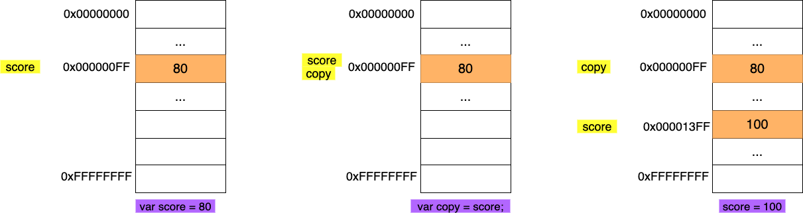
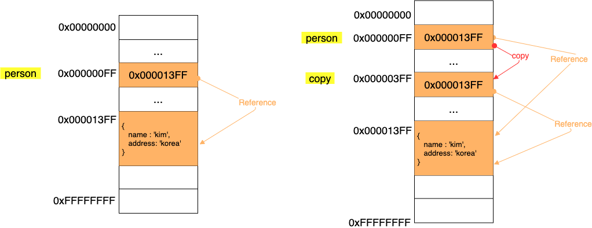

# 기본자료형과 참조형의 차이

JS에서는 기본형타입(숫자, 문자열, 불린값, null, undefined)를 제외한 모든 값은 객체다.

배열이나 함수 또한 객체로 취급한다. 그리고 이러한 타입을 참조타입이라고 부른다. (주소를 저장)

<br>

- [기본자료형과 참조형의 차이](#기본자료형과-참조형의-차이)
  - [1 데이터타입의 종류](#1-데이터타입의-종류)
  - [2 기본타입형의 특징](#2-기본타입형의-특징)
    - [2-1 불변성](#2-1-불변성)
    - [2-2 값에 의한 전달](#2-2-값에-의한-전달)
      - [새로운 값을 생성해서 전달하는 방식](#새로운-값을-생성해서-전달하는-방식)
      - [기존 값의 메모리 주소를 그대로 전달하는 방식](#기존-값의-메모리-주소를-그대로-전달하는-방식)
  - [3 객체](#3-객체)
    - [3-1 변경 가능한 값](#3-1-변경-가능한-값)
    - [3-2 call by value & call by reference](#3-2-call-by-value--call-by-reference)

<br>

## 1 데이터타입의 종류

자바스크립트의 데이터 타입은 크게 두가지로 나눌 수 있다.

* 원시 타입
  * 변경 불가능한 값 **(불변성)**
  * 값을 변수에 할당하면 변수(확보된 메모리 공간)에는 실제 값이 저장된다. **(식별자에는 변수가 저장된 메모리 주소가 저장된다.)**
  * 값에 의한 전달
* 객체 타입
  * 변경 가능한 값 (참조 값)
  * 객체를 변수에 할당하면 변수(확보된 메모리 공간)에는 참조 값이 저장된다. (객체의 주소값이 저장)
  * 참조에 의한 전달

<br>

## 2 기본타입형의 특징

<br>

### 2-1 불변성

<p align="center"> </p>

* 원시값은 기본적으로 불변 값이다.
  * 변수 값을 변경하기 위해 원시 값을 재할당하면 새로운 메모리 공간을 확보하고 재할당한 값을 저장한 후, 변수가  참조하던 메모리 공간의 주소를 변경한다.
* **불변성을 갖는 원시 값을 할당한 변수는 재할당 이외에 변수 값을 변경할 수 있는 방법이 없다.**

> 자바스크립트는 문자열도 원시값으로 다루기 때문에 한번 선언된 문자열을 일부 문자만을 변경해도 반영되지 않는다.
>
> ```js
> var str = 'string';
> 
> str[0] = 'S';
> console.log(str); //  string (일부 문자만 변경하면 반영되지 않는다.)
> ```

<br>

### 2-2 값에 의한 전달

```js
var score = 80;

var copy = score;

console.log(score, copy); // 80 80
console.log(score === copy); // true
```

* 값에 의한 전달도 면밀히 말하면 메모리 주소를 전달한다.
* 하지만, 두가지의 방법으로 값을 전달 할 수 있다.
  1. 새로운 값을 생성해서 메모리 주소를 전달하는 방식
  2. 기존 값의 메모리 주소를 그대로 전달하는 방식

<br>

#### 새로운 값을 생성해서 전달하는 방식

<p align="center"> </p>

* 새로운 값을 생성해서 전달하는 방식
  * **변수에 원시 값을 갖는 변수를 할당하면 할당되는 함수(score)의 원시 값이 복사되어 전달된다.**
  * 할당 시점에 두 변수가 기억하는 메모리 주소가 다르다.

<br>

#### 기존 값의 메모리 주소를 그대로 전달하는 방식

<p align="center"> </p>

* 기존 값의 메모리 주소를 그대로 전달하는 방식
  * score의 변수값 80의 메모리 주소를 그대로 전달한다.
  * 할당 시점에 두 변수가 기억하는 메모리 주소가 같다.


> 식별자도 메모리 주소에 붙인 이름이라고 할 수 있다.
>
> **중요한 점은 어떠한 방식이든 원시 값은 서로 다른 메모리 공간에 저장된 별개의 값이 되어 서로 간섭할 수 없다는 것이다.**

<br>

## 3 객체

<br>

### 3-1 변경 가능한 값

```js
var person = {
  name: 'kim',
  address: 'korea'
};

var copy = person;
```

<p align="center"><br>참조에 의한 전달</p>

* 객체를 할당한 변수가 기억하는 메모리 주소를 통해 메모리 공간에 접근하면 **참조 값에 접근할 수 있다.** (포인터)
* 변경 가능한 값
  * 원시 값은 불변이므로 재할당 외에는 값을 변경할 수 없었다.
  * **객체는 주소를 가지고 있으므로 재할당 없이 직접 변경할 수 있다.**
* **같은 주소를 가리키는 식별자는 하나의 객체를 공유하는 것.**
  * person이 변경되면 copy가 가리키는 객체도 같이 변경된다.

<br>

> **식별자가 기억하는 메모리 공간, 즉, 변수에 저장되어 있는 값이 원시 값이냐 참조 값이나 차이만 있을 뿐, 식별자가 기억하고 있는 메모리 공간을 복사하는 것은 동일하다.**
>
> 즉, **모두 `값에 의한 전달`이라고 볼 수 있다.**

<br>

### 3-2 call by value & call by reference
기타 프로그래밍 언어와 내용이 똑같아서 특별히 정리하진 않았다.