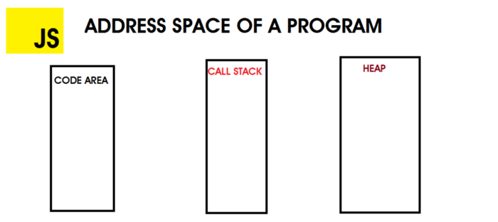
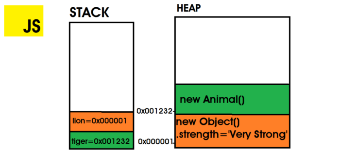

# 메모리 구조

<br>

- [메모리 구조](#메모리-구조)
  - [주소 공간](#주소-공간)
  - [예시](#예시)
- [참고](#참고)

<br>

이 글에서의 메모리 구조는 가장 기초적인 것들을 의미한다.

V8엔진이나 구글에 많이 나오는 JS 메모리 구조는 구글링을 하자!

<br>

## 주소 공간
> 자바와 굉장히 유사하다.

<p align="center"><br>출처 : https://blog.bitsrc.io/memory-leaks-in-nodejs-54ac7bbd4173 </p>

* Code Area: 실행할 JS 코드를 저장한다.
* Call Stack: 실행 중인 함수를 추적하며 계산을 수행하고, 지역 변수를 저장한다. 변수들은 `LIFO` 형식으로 저장된다.
  * 원시 타입들도 이 곳에 저장된다.
* Heap: 참조 타입(객체)들이 할당되는 곳.
  * 메모리 누수를 방지하기 위해 GC가 메모리를 관리한다.

<br>

## 예시
```js
function Animal() {};
// stores `new Animal()` instance on memory address 0x001232
// tiger has 0x001232 as value in stack
const tiger = new Animal();
// stores `new Object()` instance on memory address 0x000001
// `lion` has 0x000001 as value on stack
let lion = {
    strength: "Very Strong"
}
```
<p align="center"><br>출처 : https://blog.bitsrc.io/memory-leaks-in-nodejs-54ac7bbd4173 </p>

* `new Animal()`을 하면 인스턴스가 Heap 어딘가에 저장된다. 그리고 변수 `tiger`는 `Stack`에 쌓이게 되고, 그 value로 `Animal()`의 Heap 메모리 주소를 갖게 된다.
* `lion`도 동일하게 Heap에 인스턴스를 저장하고, 참조하는 방식이다.

> 더 자세한 내용은 [여기](https://ui.toast.com/weekly-pick/ko_20200228)를 참고바랍니다.

<br>

# 참고
* https://blog.bitsrc.io/memory-leaks-in-nodejs-54ac7bbd4173
* https://velog.io/@code-bebop/JS-%EB%A9%94%EB%AA%A8%EB%A6%AC-%EA%B5%AC%EC%A1%B0
* https://ui.toast.com/weekly-pick/ko_20200228