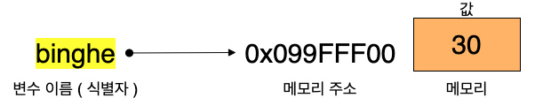

# 메모리 특징

프로그래밍 언어는 메모리 사용 관련해서 두 가지로 나눌 수 있다.

* Managed 언어
  * JAVA, Python, C#, Javascript...
* Unmanaged 언어
  * C, C++, Assembly..

이번 글에서는 JS는 메모리를 어떻게 사용하는지 정리하였다.

<br>

- [메모리 특징](#메모리-특징)
  - [1 JS는 Managed 언어이다](#1-js는-managed-언어이다)
    - [식별자](#식별자)
  - [2 값의 할당](#2-값의-할당)
    - [변수 선언 -> undefined](#변수-선언---undefined)
    - [값의 할당](#값의-할당)
    - [불변성](#불변성)
    - [값의 재할당](#값의-재할당)
  - [3 호이스팅](#3-호이스팅)
  - [4 네이밍 규칙](#4-네이밍-규칙)


<br>

## 1 JS는 Managed 언어이다

JS는 Managed언어이며, 식별자가 값이 아닌 메모리 주소를 가리키고 있다.

<br>

### 식별자

<p align="center">
</p>

* 식별자란
  * 어떤 값을 구별해서 식별할 수 있는 고유한 이름
* JS의 식별자
  * 식별자는 값이 아니라 메모리 주소를 기억하고 있다.
    * 실제 값은 메모리에 위치하며, 식별자는 그저 메모리 주소를 기억하고 있는다. (포인터)
  * 자바의 참조형과 동일하다.

<br>

## 2 값의 할당

JS에서는 값의 할당과 재할당을 어떻게 하는 알아보자.

<br>

### 변수 선언 -> undefined

```js
var score; // 변수 선언문 -> undefined
```

<p align="center"></p>

* **변수 선언을 하면 메모리 공간을 확보하고 `undefined`값으로 초기화한다.**
  * null과 undefined의 차이점은 [여기](./데이터타입.md)서 확인하자.
* `undefined`값은 JS에서 제공하는 **원시 타입의 값**이다.

<br>

### 값의 할당

```js
var score = 80; // 변수 선언과 값의 할당
```

**변수 선언은 호이스팅에 의해 런타임 이전에 실행되고, 값의 할당은 런타임시 순서대로 호출된다.**

<p align="center"></p>

1. 변수 선언 (호이스팅) -> `undefined`
2. 값 할당 -> `80`

<br>

### 불변성

* 값의 할당 과정
  * 변수에 값을 할당할 때는 **이전 값 `undefined`가 저장되어 있던 메모리 공간을 지우고 그 메모리 공간에 할당 값 80을 새롭게 저장하는 것이 아니라 새로운 메모리 공간을 확보하고 그곳에 할당 값 80을 저장한다.**
* 불변성
  * 이러한 값의 할당 방식은 **값이 할당되고 변경될 수 없다는 성질을 의미하며, 이를 불변성**이라 칭한다.

<br>

### 값의 재할당

```js
var score = 80;
score = 90;
```

<br>

<p align="center"></p>

* 컴파일 전 : score 변수 선언과 동시에 `undefined`로 할당
* 컴파일 후 : `80`으로 재할당 후, `90`으로 재할당.

> **중요한 점은 재할당 할 때마다 메모리를 담는 주소가 변경된다는 것이다. -> 불변성**

<br>

## 3 호이스팅

```js
console.log(score); // undefined

var score = 80;

console.log(score); // 80;
```

* 호이스팅이란
  * 변수 선언문이 코드 선두로 끌어 올려진 것처럼 동작하는 자바스크립트 고유의 특징
  * **변수 선언이 소스코드가 한 줄씩 순차적으로 실행되는 시점인 런타임이 아니라 그 이전 단계에 먼저 실행된다.**
    * **변수 선언만 컴파일 후 :arrow_right: 인터프리터방식으로 한 줄씩 실행**

<br>

## 4 네이밍 규칙

```js
// 카멜 케이스
var firstName;

// 스네이크 케이스
var first_name;

// 파스칼 케이스
var FirstName;

// 헝가리언 케이스
var strFirstName; // type + identifier
var $elem = document.getElementById('myId'); // DOM노드
var observable$ = fromEvent(document, 'click'); // RxJS 옵저버블
```

JS에서 자주 사용되는 방법

* 변수나 함수 - 카멜 케이스
* 생성자, 클래스 - 파스칼 케이스

<br>