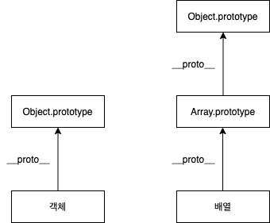

# 배열

JS에서 배열은 **특별한 형태의 객체**이다.

C나 자바의 배열과 같은 기능을 하는 객체지만, 크기를 지정하지 않아도 되며, 어떤 위치에 어느 타입의 데이터를 저장하더라도 에러가 발생하지 않는다. (리스트와 비슷)

<br>

- [배열](#배열)
  - [1 배열 리터럴](#1-배열-리터럴)
  - [2 배열의 요소 생성](#2-배열의-요소-생성)
    - [배열의 length를 이용한 요소 추가/삭제](#배열의-length를-이용한-요소-추가삭제)
  - [3 배열과 객체](#3-배열과-객체)
    - [3-1 차이점](#3-1-차이점)
    - [3-2 배열 프로토타입](#3-2-배열-프로토타입)
    - [3-3 배열의 프로퍼티 동적 생성](#3-3-배열의-프로퍼티-동적-생성)
    - [3-4 배열 요소 삭제](#3-4-배열-요소-삭제)

<br>

## 1 배열 리터럴
* 배열 리터럴이란?
  * 배열 리터럴은 JS에서 새로운 배열을 만드는 데 사용하는 표기법이다.
* 예시

```js
// 배열 리터럴을 통한 5개의 원소를 가진 배열 생성
var colorArr = ['orange', 'yello', 'blue', 'green', 'red'];
console.log(colorArr[0]); // orange
```

<br>

## 2 배열의 요소 생성
* JS 배열 요소 생성의 특징
  * 객체가 동적으로 프로퍼티를 추가할 수 있듯이, **배열도 동적으로 원소를 추가할 수 있다.**
  * 특히, **순차적으로 넣을 필요 없이 아무 인덱스 위칭에나 값을 동적으로 추가할 수 있다.**

```js
// 빈 배열
var emptyArr = [];
console.log(emptyArr[0]);     // undefined

// 배열 요소 동적 생성
emptyArr[0] = 100;
emptyArr[3] = 'eight';
emptyArr[7] = true;
console.log(emptyArr);        // [ 100, <2 empty items>, 'eight', <3 empty items>, true ]
console.log(emptyArr.length); // 8
```
* JS에서는 **여러 데이터 타입을 하나의 배열안에 넣을 수 있다.**
* `emptyArr`의 길이가 8인 이유
  * JS에서는 **배열의 크기를 현재 배열의 인덱스 중 가장 큰 값**을 기준으로 정하기 때문이다.

<br>

### 배열의 length를 이용한 요소 추가/삭제
```js
var arr = [0, 1, 2];
console.log(arr.length); // 3

// length를 이용하여 요소 추가
arr.length = 5;
console.log(arr);        // [ 0, 1, 2, undefined, undefined ]

// length를 이용하여 요소 삭제
arr.length = 2;
console.log(arr);        // [ 0, 1 ]
```
배열의 length 프로퍼티를 사용하여 위와 같이 요소를 추가하거나 삭제할 수 있다.

<br>

## 3 배열과 객체
JS에서는 배열 역시 객체로 취급한다. `typeof`의 결과가 모두 `Object`이다.

<br>

### 3-1 차이점

<p align="center"></p>

* 객체의 프로토타입은 `Object`이며, 배열의 프로토타입은 `Array`이다.
  * 그러므로 배열은 `push`, `length`와 같은 배열 표준 메서드를 사용가능하지만, `Object`는 사용할 수 없다.

```js
// 배열
var colorArray = ['orange', 'red'];
console.log(colorArray[0]); // orange
console.log(colorArray[1]); // red

// 객체
var colorObj = {
    '0': 'orange',
    '1': 'red'
};

console.log(colorObj[0]); // orange
console.log(colorObj[1]); // red

// typedef
console.log(colorArray); // object
console.log(colorObj);   // object
```

<br>

### 3-2 배열 프로토타입
<p align="center"></p>

* 배열의 프로토타입은(`array.__proto__`)는 기본적으로 `Array[0]`을 가리키고 있다.
* 배열의 프로토타입은 기본적으로 배열을 사용하는데 필요한 여러 메서드를 정의하고 있는다.
* 프로토타입으로 `Object`를 가리키고 있는 것을 볼 수 있다.

<br>

### 3-3 배열의 프로퍼티 동적 생성
배열도 객체이므로, 인덱스가 숫자인 배열 원소 이외에도 객체처럼 동적으로 프로퍼티를 추가할 수 있다.

```js
// 배열 생성
var arr = ['zero', 'one', 'two'];
console.log(arr.length); // 3

// 프로퍼티 동적 추가
arr.color = 'blue';
arr.name = 'number_array';
console.log(arr.length); // 3 (여전히 3)

// 배열 원소 추가
arr[3] = 'red';
console.log(arr.length); // 4
```
* 배열은 `length`라는 프로퍼티를 가지고 있으며, 배열 원소의 가장 큰 인덱스가 변했을 경우에만 변경된다.
  * 그리고 `length()`는 이 프로퍼티를 반환할 뿐이다.
  * 그러므로 배열에 객체처럼 프로퍼티를 생성하면 `length`에 아무 영향이 없다.

<br>

### 3-4 배열 요소 삭제
**delete**

```js
// delete 연산자를 이용한 삭제
var arr = ['zero', 'one', 'two', 'three'];
delete arr[2];
console.log(arr); // ["zero", "one", undefined, "three"]
```
* `delete`를 사용해서 요소를 삭제할 수 있지만, `undefined`로 할당되고 length값은 변하지 않는다.

<br>

**splice**

`splice`를 사용하면 완전히 삭제할 수 있다.

```js
var arr = ['zero', 'one', 'two', 'three'];

arr.splice(2, 1);    // 2번째 요소를 시작점으로 1개의 원소를 삭제한다.
console.log(arr);    // ["zero", "one", "three"]
```

* `splice(start, deleteCount, item ..)`
  * start : 배열에서 시작 위치
  * deleteCount : start에서 지정한 시작 위치부터 삭제할 요소의 수
  * item : 삭제할 위치에 추가할 요소

