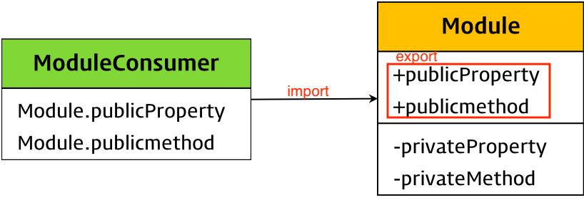

# 모듈

<br>

- [모듈](#모듈)
  - [모듈과 상태 관리를 알아야 하는 이유](#모듈과-상태-관리를-알아야-하는-이유)
  - [1 모듈의 의미](#1-모듈의-의미)
  - [2 모듈의 핵심 - 캡슐화](#2-모듈의-핵심---캡슐화)
  - [3 export와 import](#3-export와-import)
    - [3-1 export](#3-1-export)
    - [3-2 import](#3-2-import)
  - [번외 - 상태란](#번외---상태란)
- [참고](#참고)

<br>

## 모듈과 상태 관리를 알아야 하는 이유
* JS 코드의 재사용성을 높이고 싶다면
* JS로 Module로 구분했을 때 데이터의 상태관리를 일관되게 하고 싶다면

<br>

## 1 모듈의 의미
* ES6 이전 (더 자세한 내용은 [여기](https://d2.naver.com/helloworld/12864))
  * ES6 이전까지 JS 파일에 정의된 애플리케이션의 모든 부분은 하나의 전역 스코프를 공유했다.
  * 그리고 애플리케이션이 점점 복잡해질수록, JS 파일이 많아지고, 이름 충돌이나 보안상 우려되는 문제들을 일으켰다.
  * 실제로, `script` 태그로 여러 js파일을 로드해도 하나의 JS 파일 내에 있는 것처럼 동작한다.
  * ES6 전에는 모듈과 비슷한 방법으로 `즉시 실행 함수`를 이용했다고 한다. (클로저를 활용)
* **모듈의 의미**
  * **모듈이란 애플리케이션을 구성하는 개별적 요소로서 재사용 가능한 코드 묶음 단위를 의미한다.**
  * 일반적으로 **모듈은 기능을 기준으로 파일 단위**로 분리한다.
  * 모듈이 성립하려면 모듈은 자신만의 파일 스코프(모듈 스코프)를 가질 수 있어야 한다.

<p align="center"><br> 출처 : https://poiemaweb.com/es6-module </p>

<br>

## 2 모듈의 핵심 - 캡슐화
* 모듈의 핵심은 캡슐화다.
  * 모듈 안의 모든 기능은 모듈 안에서 동작하며, 모듈 밖에서는 접근이 허용된 속성이나 메서드만 사용할 수 있도록 허용된다.

<br>

## 3 export와 import

<br>

### 3-1 export
모듈은 독자적인 모듈 스코프를 갖는다. 

**모듈 내부에서 선언한 식별자를 외부에 공개하여 다른 모듈들이 재사용할 수 있게 하려면 `export`키워드를 사용한다.**
```js
// 변수의 공개
export const pi = Math.PI;

// 함수의 공개
export function square(x) { 
    return x * x;
}

// 클래스의 공개
export class Person {
    constructor(name) {
        this.name = name;
    }
}
```
```js
// lib.mjs
const pi = Math.PI;

function square(x) { 
    return x * x;
}

class Person {
    constructor(name) {
        this.name = name;
    }
}

// 변수, 함수 클래스를 하나의 객체로 구성하여 공개
export { pi, square, Person }
```
```js
// 모듈에서 하나의 값만 export한다면 default 키워드를 사용할 수 있다.
export default x => x * x;
```
* `default` 키워드를 사용하는 경우 `var`, `let`, `const` 키워드를 사용할 수 없다.

<br>

### 3-2 import
다른 모듈에서 공개(`export`)한 식별자를 자신의 모듈 스코프 내부로 로드하려면 `import` 키워드를 사용한다.

```js
// 파일 확장자를 생략할 수 없다.
import { pi, square, Person} from './lib.mjs';

// lib.mjs 모듈이 export한 모든 식별자를 lib 객체의 프로퍼티로 모아 import 한다.
import * as lib from './lib.mjs';

// 식별자 이름을 변경할 수도 있다.
import { pi as PI, square as sq, Person as P} from './lib.mjs';
```

<br>

## 번외 - 상태란
* 상태(state)란
  * 상태란 쉽게 말하면 '데이터' 라고 생각하면 좋다고 한다.
  * 상태가 있고, 상태가 아닌 것이 있을텐데, 둘은 어떤 차이가 있을까요?
    * **상태에서 중요한 부분은 바로 값이 변한다는 것이다.**
* 상태 관리는 애플리케이션이 복잡해질수록 점점 어려워진다고 한다.
  * 그렇기 때문에 단순한 구조일때부터 이 상태를 어떻게 관리하면 좋을지 생각해야한다.
  * **값이 변하는데 예측된 값으로 변해야 의도한대로 동작을 수행할 수 있으니, 예측 범위 안에서 변하게 하는 것이 중요하다.**
* **예측 범위를 최소화 하기 위해서는**
  * **일관되게 READ하는 로직과**
  * **최소화한 Write하는 로직을 만들때 가능해진다.**
  * 즉, 자바스크립트의 상태 관리를 위해 일관되게, 상태에 대해 접근할 수 있는 범위를 고려해야 한다.
    * 모듈을 나눠서 여러 곳에서 READ하되, 여러 곳에서 직접적으로 수정하지 못하게 해야 한다.
> 좋은 참고 자료: https://css-tricks.com/build-a-state-management-system-with-vanilla-javascript/

<br>

# 참고
* 우테코 모듈 & 상태 관리 강의
* [모던 자바스크립트 Deep Dive]()
