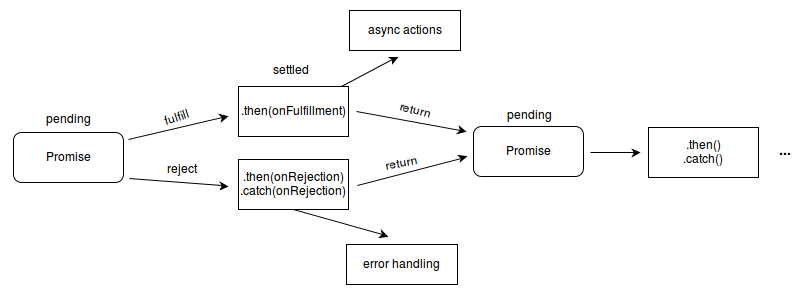

# Promise

<br>

- [Promise](#promise)
  - [1 비동기 처리를 위한 콜백 패턴의 단점](#1-비동기-처리를-위한-콜백-패턴의-단점)
    - [1-1 콜백 헬](#1-1-콜백-헬)
      - [비동기 함수란?](#비동기-함수란)
      - [비동기 처리 결과를 외부로 반환할 경우](#비동기-처리-결과를-외부로-반환할-경우)
      - [비동기의 처리결과는 비동기 함수 내부에서 수행해야한다](#비동기의-처리결과는-비동기-함수-내부에서-수행해야한다)
      - [콜백 함수를 비동기 처리결과에 대한 후속처리에 전달한다](#콜백-함수를-비동기-처리결과에-대한-후속처리에-전달한다)
      - [콜백 헬](#콜백-헬)
    - [1-2 예외 처리의 한계](#1-2-예외-처리의-한계)
  - [2 프로미스란 - 진동벨](#2-프로미스란---진동벨)
  - [3 프로미스 사용법](#3-프로미스-사용법)
    - [3-1 프로미스 상태](#3-1-프로미스-상태)
    - [3-2 resolve, reject](#3-2-resolve-reject)
    - [3-3 후속 처리 메서드](#3-3-후속-처리-메서드)
      - [then](#then)
      - [catch](#catch)
      - [finally](#finally)
  - [4 프로미스 체이닝](#4-프로미스-체이닝)
    - [4-1 프로미스 체이닝 예시](#4-1-프로미스-체이닝-예시)
    - [4-2 async/await](#4-2-asyncawait)
- [출처](#출처)

<br>

## 1 비동기 처리를 위한 콜백 패턴의 단점
전통적인 콜백 패턴은 콜백 헬로 인해 가독성이 나쁘고 비동기 처리 중 발생한 에러의 처리가 곤란하며 여러 개의 비동기 처리를 한번에 처리하는 데도 한계가 있다.

<br>

### 1-1 콜백 헬

<br>

#### 비동기 함수란?
```js
// GET 요청을 위한 비동기 함수
const get = url => {
    const xhr = new XMLHttpRequest();
    xhr.open('GET', url, true);
    xhr.send();

    xhr.onload = () => {
        if (xhr.status === 200) {
            // 서버의 응답을 콘솔에 출력한다.
            console.log(JSON.parse(xhr.response));
        } else {
            console.error(`${xhr.status} ${xhr.statusText}`);
        }
    };
};

get('https://jsonplaceholder.typicode.com/posts/1');
/*
{
    "userId": 1,
    "id": 1,
    "title": "sunt aut facere ...",
    "body": "quia et suscipit ..."
}
*/
```
* **비동기 함수란**
  * 함수 내부에 비동기로 동작하는 코드를 포함한 함수를 의미한다.
  * 위 예시에서는 `onload` 이벤트 핸들러가 비동기로 동작한다.
* **비동기 함수의 특징**
  * 함수 내부의 비동기로 동작하는 코드가 완료되지 않았다 해도 기다리지 않고 즉시 종료된다.
  * 즉, **비동기 함수 내부의 비동기로 동작하는 코드는 비동기 함수가 종료된 이후에 완료된다.**

> 따라서, 비동기 함수의 처리 결과를 **외부로 반환하거나 상위 스코프의 변수에 할당**하면 **기대한 대로 동작하지 않는다.**

<br>

#### 비동기 처리 결과를 외부로 반환할 경우
```js
// GET 요청을 위한 비동기 함수
const get = url => {
    const xhr = new XMLHttpRequest();
    xhr.open('GET', url, true);
    xhr.send();

    xhr.onload = () => {
        if (xhr.status === 200) {
            // 서버의 응답을 반환한다.
            return JSON.parse(xhr.response);
        }
        console.error(`${xhr.status} ${xhr.statusText}`);
    };
};

// 서버의 응답을 외부의 변수에 할당 
const response = get('https://jsonplaceholder.typicode.com/posts/1');
console.log(response); // undefined (할당이 되지 않았다.)
```
* `onload`는 비동기적으로 처리하므로, `xhr.response`를 비동기적으로 처리하고, `undefined`를 return하게 된다.


```js
// 비동기 처리결과를 상위 스코프의 변수에 할당할 경우
let todos; // 상위 스코프의 변수

// GET 요청을 위한 비동기 함수
const get = url => {
    const xhr = new XMLHttpRequest();
    xhr.open('GET', url, true);
    xhr.send();

    xhr.onload = () => {
        if (xhr.status === 200) {
            // 서버의 응답을 반환한다.
            todos = JSON.parse(xhr.response);
        } else {
            console.error(`${xhr.status} ${xhr.statusText}`);
        }
    };
};

get('https://jsonplaceholder.typicode.com/posts/1');
console.log(todos); // undefined
```
* 비동기 처리의 결과를 상위 스코프로 할당해도 기대한 대로 동작하지 않는다.

<br>

#### 비동기의 처리결과는 비동기 함수 내부에서 수행해야한다
이처럼 비동기 함수는 **처리 결과를 외부에 반환할 수 없고, 상위 스코프의 변수에 할당할 수도 없다.**

따라서 **비동기 함수의 처리 결과(서버의 응답)에 대한 후속 처리는 비동기 함수 내부에서 수행해야 한다.**

그 이유는 다음과 같다.

* `xhr.onload` 이벤트가 바인딩되면 get함수는 종료된다. 그리고 `console.log` 실행 컨텍스트가 콜 스택에 올라간다.
* **이때 `xhr.onload`의 결과가 아무리 빨리와도 무조건 `console.log` 실행 컨텍스트가 끝나고 실행된다.**
  * 정확히는 콜스택이 비면 이벤트 루프에 의해 `onload`의 결과가 콜 스택에 푸시된다.
* 그러므로 `console.log`를 100번 사용해도 `undefined`만 나오게 된다.

<br>

#### 콜백 함수를 비동기 처리결과에 대한 후속처리에 전달한다
그래서 **비동기 함수의 처리 결과에 대한 후속 처리를 수행하기 위해 콜백 함수를 전달한다.**

```js
// GET 요청을 위한 비동기 함수
const get = (url, successCallback, failCallback) => {
    const xhr = new XMLHttpRequest();
    xhr.open('GET', url, true);
    xhr.send();

    xhr.onload = () => {
        if (xhr.status === 200) {
            // 서버의 응답을 콜백 함수에 인수로 전달하면서 호출하여 응답에 대한 후속 처리를 한다.
            successCallback(JSON.parse(xhr.response));
        } else {
            failCallback(xhr.status);
        }
    };
};

// 서버의 응답에 대한 후속 처리를 위한 콜백 함수를 비동기 함수인 get에 전달해야 한다
get('https://jsonplaceholder.typicode.com/posts/1', console.log, console.log);
```

<br>

#### 콜백 헬
이처럼 비동기 처리 결과에 대한 후속 처리를 수행하는 콜백함수가 또 다시 비동기 처리 결과를 가지고 다른 비동기 처리 함수를 호출해야 한다면 

**콜백 함수 호출이 중첩되어 콜백 헬이 발생하게 된다.**

```js
// GET 요청을 위한 비동기 함수
const get = (url, callback) => {
    const xhr = new XMLHttpRequest();
    xhr.open('GET', url, true);
    xhr.send();

    xhr.onload = () => {
        if (xhr.status === 200) {
            // 서버의 응답을 콜백 함수에 인수로 전달하면서 호출하여 응답에 대한 후속 처리를 한다.
            callback(JSON.parse(xhr.response));
        } else {
            console.log(`${xhr.status} ${xhr.statusText}`);
        }
    };
};

const url = 'https://jsonplaceholder.typicode.com';

// id가 1인 post의 userId를 취득
get(`${url}/posts/1`, ({userId}) => {
    console.log(userId); // 1
    // post의 userId를 사용하여 user 정보를 취득
    get(`${url}/users/${userId}`, userInfo => {
        console.log(userInfo);
    });
});
// {id: 1, name: "Leanne Graham", username: "Bret", email: "Sincere@april.biz" ... }
```
더 나아가 중첩하게 된다면 아래와 같은 코드가 나오게 된다.
```js
// 콜백 지옥
get(`/step1`, a => {
    get(`/step2/${a}`, b => {
        get(`/step3/${b}`, c => {
            get(`/step4/${c}`, d => {
                console.log(d);
            })
        })
    })
})
```


<br>

### 1-2 예외 처리의 한계
비동기 처리를 위한 콜백 패턴의 문제점 중 다른 하나는 예외 처리가 힘들다는 것이다.
```js
try {
    setTimeout(() => { throw new Error('Error! '); }, 1000);
} catch (e) {
    // 에러를 캐치하지 못한다.
    console.error('캐시찬 에러', e);
}
```
* 에러를 호출자 방향으로 전파된다. 즉, 콜 스택의 아래 방향으로 전파된다.
* 하지만, 콜백 함수가 실행되면서 예외가 발생할 땐 이미 호출자가 콜 스택에서 제거된 상태라 catch하지 못하게 된다.

<br>

## 2 프로미스란 - 진동벨
[MDN](https://developer.mozilla.org/ko/docs/Web/JavaScript/Reference/Global_Objects/Promise)에서는 Promise를 다음과 같이 설명하고 있다.
```text
Promise는 Promise가 생성될 때 꼭 알 수 있지는 않은 값을 위한 대리자로, 비동기 연산이 종료된 이후의 결과값이나 실패 이유를 처리하기 위한 처리기를 연결할 수 있도록 합니다. Promise를 사용하면 비동기 메서드에서 마치 동기 메서드처럼 값을 반환할 수 있습니다. 다만 최종 결과를 반환하지는 않고, 대신 Promise를 반환해서 미래의 어떤 시점에 결과를 제공합니다.
```
* 여기서 가장 중요한 것은 미래의 어떤 시점에 결과를 제공한다는 것이다.
  * 즉, Promise는 `미랫값`이다.
* 예시
  * 커피집에 가서 커피를 주문하면, 직원은 `진동벨`을 넘겨준다. 이 `진동벨`이 바로 Promise다.
  * 이 진동벨은 미래에 내가 커피를 받을 수 있을 것이라는 `약속`이다. 이 와중에 나는 다른 일을 볼 수 있다. (비동기)
  * 미랫값인 Promise는 성공할 수도, 실패할 수도 있다.
    * 커피가 제대로 나온다면 성공한 것이고, 재료가 부족하다면 실패한 것이다.

> 즉, **프로미스는 비동기 처리 상태와 처리 결과를 관리하는 객체다.**

<br>

## 3 프로미스 사용법

<br>

### 3-1 프로미스 상태
<p align="center">출처 : https://developer.mozilla.org/ko/docs/Web/JavaScript/Reference/Global_Objects/Promise</p>

* pending: 이행하거나 거부되지 않은 초기 상태. (Promise가 생성된 직후)
* settled: fulfilled 혹은 rejected 상태와 상관없이 비동기 처리가 수행된 상태
  * fulfilled: 연산이 성공적으로 완료됨 (resolve 함수 호출)
  * rejected: 연산이 실패함 (reject 함수 호출)

<br>

### 3-2 resolve, reject
Promise 생성자 함수는 new 연산자와 함께 생성할 수 있다. 
```js
// 프로미스 생성
const promise = new Promise((resolve, reject) => {
    // Promise 함수의 콜백 함수 내부에서 비동기 처리를 수행한다.
    if (/* 비동기 처리 성공 */) {
        resolve('result');
    } else {
        reject('failure reason');
    }
});
```
* Promise는 생성자 함수의 인수로 전달되는 콜백 함수 내부에서 비동기 처리를 수행한다.
  * 비동기 처리가 성공하면 `resolve` 함수를 호출한다. 그리고 프로미스를 `fulfilled`상태로 변경한다.
  * 비동기 처리가 실패하면 `reject` 함수를 호출한다. 그리고 프로미스를 `rejected`상태로 변경한다.

<br>

```js
// 예시
const promiseGet = (url) => {
    return new Promise((resolve, reject) => {
        const xhr = new XMLHttpRequest();
        xhr.open('GET', url);
        xhr.send();

        xhr.onload = () => {
            if (xhr.status === 200) {
                // 성공적으로 응답을 전달받으면 resolve 함수를 호출한다.
                resolve(JSON.parse(xhr.response));
            } else {
                // 에러 처리를 위해 reject 함수를 호출한다.
                reject(new Error(xhr.status));
            }
        };
    });
};

// promiseGet 함수는 프로미스를 반환한다.
promiseGet('https://jsonplaceholder.typicode.com/posts/1') // Promise 객체를 반환한다.
  .then(res => console.log(res))
  .catch(err => console.log(err))
  .finally(() => console.log('Finally!'));
```

<br>

### 3-3 후속 처리 메서드
Promise의 상태가 변화하면 이에 따른 후속 처리를 해야 한다. 이를 위해 `then`, `catch`, `finally`를 제공한다.

> 프로미스의 상태가 변환하면 후속 처리 메서드에 현재의 콜백 함수(인수로 전달한 콜백함수)가 선택적으로 호출된다. 
> 
> **이때 후속 처리 메서드의 콜백 함수에 프로미스의 처리 결과가 인수로 전달된다.**

<br>

#### then
> Promise.prototype.then
```js
// fulfilled
new Promise(resolve => resolve('fulfilled'))
  .then(v => console.log(v), e => console.error(e)); // fulfilled

// rejected
new Promise((_, reject) => reject(new Error('rejected')))
  .then(v => console.log(v), e => console.error(e)); // Error: rejected
```
* 첫 번째 콜백 함수: fulfilled상태(resolve함수가 호출된 상태)가 되면 호출된다.
* 두 번째 콜백 함수: rejected상태(reject함수가 호출된 상태)가 되면 호출된다.

<br>

#### catch
> Promise.prototype.catch
```js
// rejected
new Promise((_, reject) => reject(new Error('rejected')))
  .catch(e => console.error(e));
```
* reject인 상태에서만 실행된다.

> `then(undefined, onRejected)`와 똑같다.

<br>

#### finally
> Promise.prototype.finally
```js
new Promise(() => {})
  .finally(() => console.log('finally')); // finally
```
* 프로미스의 성공 또는 실패와 상관없이 무조건 한 번 실행된다.
 
<br>

## 4 프로미스 체이닝
프로미스는 체이닝 방식을 통해 콜백 헬을 해결했다. (`then`, `catch`, `finally`을 활용)

<br>

### 4-1 프로미스 체이닝 예시
```js
// 이전의 콜백 지옥이었던 것을 프로미스를 통해 다음과 같이 해결 할 수 있다.
const promiseGet = (url) => {
    return new Promise((resolve, reject) => {
        const xhr = new XMLHttpRequest();
        xhr.open('GET', url);
        xhr.send();

        xhr.onload = () => {
            if (xhr.status === 200) {
                resolve(JSON.parse(xhr.response));
            } else {
                reject(new Error(xhr.status));
            }
        }
    })
}

const url = 'https://jsonplaceholder.typicode.com';

promiseGet(`${url}/posts/1`)
  .then(({userId}) => promiseGet(`${url}/users/${userId}`))
  .then((userInfo) => console.log(userInfo))
  .catch(e => console.error(e));
```
* 이렇게 가능한 이유는 후속 처리 메서드들이 콜백 함수가 반환한 프로미스를 반환하기 때문이다.
  * 프로미스가 아닌 값을 반환하더라도 암묵적으로 settled상태의 프로미스를 래핑해서 반환한다.

<br>

### 4-2 async/await
프로미스는 콜백 헬이 발생하지 않지만, 콜백 패턴을 그대로 사용하므로 가독성이 좋지 않다. 대신

이 문제는 ES8에서 도입된 async/await를 통해 해결할 수 있다.

```js
const url = 'https://jsonplaceholder.typicode.com';

(async () => {
    // id가 1인 post의 userId를 취득
    const {userId} = await promiseGet(`${url}/posts/1`);

    // 취득한 post의 userId로 user 정보를 취득
    const userInfo = await promiseGet(`${url}/users/${userId}`);

    console.log(userInfo);
})();
```

<br>

# 출처
* 우테코 프로미스 강의 내용
* [모던 자바스크립트 Deep Dive]()
