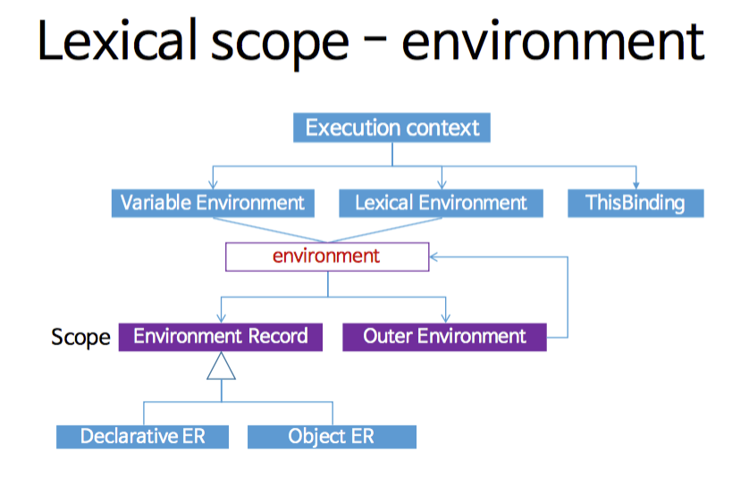

# 스코프 체인

<br>

- [스코프 체인](#스코프-체인)
  - [1 스코프 체인 개념](#1-스코프-체인-개념)
    - [1-1 스코프는 계층적 구조로 되어있다](#1-1-스코프는-계층적-구조로-되어있다)
    - [1-2 스코프는 단방향으로 검색한다](#1-2-스코프는-단방향으로-검색한다)
  - [2 Lexical Environment](#2-lexical-environment)
    - [2-1 동적 스코프와 렉시컬 스코프](#2-1-동적-스코프와-렉시컬-스코프)
    - [2-2 JS는 렉시컬 스코프다](#2-2-js는-렉시컬-스코프다)
    - [2-3 환경 레코드와 렉시컬 환경](#2-3-환경-레코드와-렉시컬-환경)
  - [참조](#참조)

<br>

## 1 스코프 체인 개념
> 스코프 체인 = 현재 실행 컨텍스트의 변수 객체 + 상위 컨텍스트의 스코프 체인

<br>

### 1-1 스코프는 계층적 구조로 되어있다
<p align="center"> </p>

* 스코프 체인이란?
  * 스코프는 **함수의 중첩에 의해 계층적 구조**를 갖는다.
  * 이렇게 **스코프가 계층적으로 연결된 것을 스코프 체인**이라 한다.
  * 그리고 유효 범위를 나타내는 스코프가 `[[scope]]` 프로퍼티로 각 함수 객체 내에서 연결 리스트 형식으로 관리한다.
> 더 자세한 내용은 [2-3 환경 레코드와 렉시컬 환경](#2-3-환경-레코드와-렉시컬-환경)에서 확인!

<br>

### 1-2 스코프는 단방향으로 검색한다
* **하위 스코프 -> 상위 스코프 순으로 검색한다.**
  * 변수를 참조할 때 JS는 스코프 체인을 통해 변수를 참조하는 코드의 스코프에서 시작하여 상위 스코프 방향으로 이동하며 선언된 변수를 검색한다.
* 즉 다음과 같다.
  * 상위 스코프에서 유효한 변수 -> 하위 스코프에서 자유롭게 참조할 수 있다.
  * 하위 스코프에서 유효한 변수 -> 상위 스코프에서 참조할 수 없다.

<br>

## 2 Lexical Environment
스코프는 계층적구조로 식별자를 검색 한다고 했는데 **어떻게 상위 스코프를 아는 것일까? 바로 렉시컬 환경으로 인해 가능한 것이다.**

<br>

### 2-1 동적 스코프와 렉시컬 스코프
```js
var x = 1;

function foo() {
    var x = 10;
    bar();
}

function bar() {
    console.log(x);
}

// 동적 스코프
foo(); // 10
bar(); // 1

// 렉시컬 스코프
foo(); // 1
bar(); // 1
```

<br>

> 동적 스코프 (런타임시점)
* **함수를 어디서 호출했는지에 따라 함수의 상위 스코프를 결정한다.**
  * 즉, 스코프가 **런타임 도중**의 실행 컨텍스트나 호출 컨텍스트에 의해 결정된다.
* 함수를 정의하는 시점에는 함수가 어디서 호출될 지 알 수 없다.
  * 따라서 동적 스코프는 함수가 호출되는 시점에 동적으로 상위 스코프를 결정한다.

<br>

> 렉시컬 스코프 (컴파일타임시점)
* 함수를 **어디서 정의헀는지에 따라 함수의 상위 스코프를 결정한다.**
* 함수 정의가 평가되는 시점에 상위 스코프가 정적으로 결정되기 때문에 정적 스코프라 부른다.

<br>

### 2-2 JS는 렉시컬 스코프다
* JS는 렉시컬 스코프 규칙을 따른다.
  * JS를 비롯한 대부분의 프로그래밍 언어가 렉시컬 스코프를 따른다.
* **JS의 함수는 호출 스택과 관계없이 각각의 (this를 제외한)대응표를 소스코드 기준으로 정의하고, 런타임에 그 대응표를 변경시키지 않는다.** 
  * (사실 런타임에 렉시컬 스코프를 수정할 수 있는 방법들(eval, with)이 있지만, 권장하지 않는다.)
* **렉시컬 스코프는 어디서 함수를 어디서 호출했는지가 아니라 함수를 어디서 정의했는지에 따라 상위 스코프를 결정한다.**
  * 함수가 호출된 위치는 상위 스코프 결정에 아무런 영향을 못 준다.

<br>

### 2-3 환경 레코드와 렉시컬 환경
> JS의 스코프는 ECMAScript 언어 명세에서 렉시컬 환경과 환경 레코드라는 개념으로 정의되어 있다.
<p align="center"><br> 출처 : https://meetup.toast.com/posts/86 </p>

* **환경 레코드**
  * 현재 렉시컬 환경의 **"이름:값"의 대응표**
  * 지역 변수, this, 매개변수등을 저장하는 객체
* **렉시컬 환경**
  * 이 환경 레코드와 **상위 렉시컬 환경에 대한 참조**
  * 렉시컬 환경이 만들어질 때 `Environment`라는 숨김 프로퍼티가 만들어진다.
    * 프로퍼티에는 외부렉시컬 환경이 저장되어있으며 지역내에서 참조할 값이 없을 경우 프로퍼티에 접근하여 외부 렉시컬 환경을 참조하게되는데 값이 없을 경우 최상위 렉시컬 환경까지 검색하게 되는 체이닝 과정이 일어난다.
* **현재 렉시컬 환경의 대응표(환경 레코드)에서 변수를 찾아보고, 없다면 바깥 렉시컬 환경을 참조하여 찾아보는 방식**

<br>

**예시**
<p align="center"><br> 참조 : https://meetup.toast.com/posts/86 </p>

<br>

**예시**
```js
function makeCounter() {
  let count = 0;

  return function() {
    return count++;
  };
}

let counter = makeCounter();
console.log(counter()); // 0
console.log(counter()); // 1
console.log(counter()); // 2

console.log(makeConter()()); // 0
console.log(makeConter()()); // 0
console.log(makeConter()()); // 0
```

<br>

## 참조
* https://meetup.toast.com/posts/86
* [자바스크립트 렉시컬 환경(Lexical Environment) - HyosikPark](https://velog.io/@gytlr01/%EC%9E%90%EB%B0%94%EC%8A%A4%ED%81%AC%EB%A6%BD%ED%8A%B8-%EB%A0%89%EC%8B%9C%EC%BB%AC-%ED%99%98%EA%B2%BDLexical-Environment)