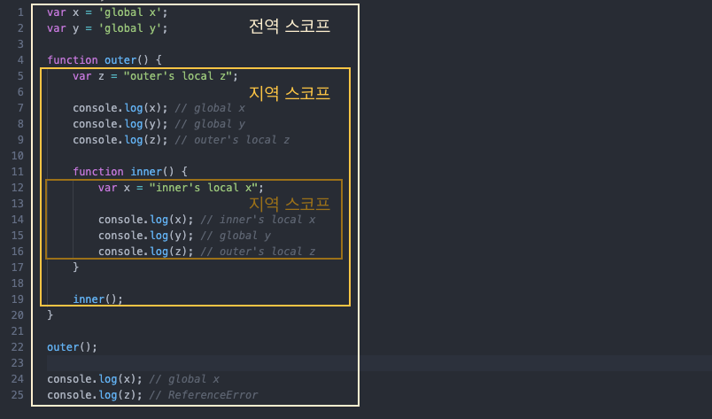

# 스코프란?

<br>

- [스코프란?](#스코프란)
  - [1 스코프 개념](#1-스코프-개념)
    - [1-1 스코프](#1-1-스코프)
    - [1-2 식별자 결정](#1-2-식별자-결정)
  - [2 스코프의 레벨](#2-스코프의-레벨)
    - [2-1 함수 레벨 스코프](#2-1-함수-레벨-스코프)
    - [2-2 블록 레벨 스코프](#2-2-블록-레벨-스코프)
    - [2-3 var vs let, const](#2-3-var-vs-let-const)
  - [3 스코프의 종류](#3-스코프의-종류)
  - [참조](#참조)

<br>

## 1 스코프 개념

<br>

### 1-1 스코프
* 변수의 스코프
  * 변수는 자신이 선언된 위치에 의해 자신이 유효한 범위가 정해진다
* 스코프란
  * 모든 식별자 (변수 이름, 함수 이름, 클래스 이름 등등)는 **자신이 선언된 위치에 의해** 다른 코드가 식별자 자신을 참조할 수 있는 **유효 범위**가 결정된다.
* 스코프의 예시
  * 파일 시스템
    * 파일 시스템에서 파일 이름을 중복해서 사용할 수 있는 이유는 **폴더**라는 개념 때문이다.
  * 네임스페이스

<br>

### 1-2 식별자 결정
* 식별자 결정
  * **JS는 스코프를 이용해 어떤 변수를 참조해야 할 것인지 결정한다.**
  * 스코프란 식별자를 검색할 때 사용하는 규칙이다.
    * 검색할 때, JS 엔진은 코드의 문맥을 고려한다.
* 렉시컬 환경 (Lexical Environment)
  * 코드가 어디서 실행되되며 주변에 어떤 코드가 있는지를 저장한다.
  * 즉, **코드의 문맥은 렉시컬 환경으로 이뤄진다.**

<br>

## 2 스코프의 레벨
JS는 굉장히 유연한 언어다. 스코프도 어떤 타입(`var`, `let`, `const`)를 사용하느냐에 따라 레벨이 달라진다.

<br>

### 2-1 함수 레벨 스코프
> `var`를 사용하는 경우 함수 레벨 스코프로 동작한다.
> * 기존의 JS는 오직 함수만 유효 범위의 한 단위가 된다 (함수 레벨 스코프)
* 기존의 JS와 기존 정적 언어 (C)의 다른점
  * C에서는 함수의 `{}`뿐만 아니라 `if`, `for`문의 `{}`도 하나의 스코프로 본다.
  * JS에서는 `if`, `for`문은 유효 범위가 없다. **오직 함수만이 유효 범위의 한 단위가 된다.**

<br>

```js
function foo() {
    if (true) {
        var color = 'blue';
    }
    console.log(color);
}

foo(); // blue
```
* 위 코드는 아무런 문제없이 `blue`를 출력한다.
  * C나 자바에 익숙한 개발자는 이게 어떻게 되지?라는 생각을 할거라고 생각든다.. (me too...)

<br>

### 2-2 블록 레벨 스코프
ES6의 `let`, `const`키워드는 블록 레벨 스코프 변수를 만들어 준다.
```js
function foo() {
    if (true) {
        let color = 'blue';
        console.log(color); // blue
    }
    console.log(color);     // ReferenceError: color is not defined.
}

foo();
```
* `let color`를 `if`블록 내부에서 선언하였다. 
  * 때문에 `if`블록 내부에서 참조할 수 있으며, 그 밖의 영역에서 잘못된 참조로 에러가 발생한다.

<br>

### 2-3 var vs let, const
* ES6가 표준화가 되면서 블록 레벨과 함수 레벨을 모두 지원하게 되었다고 한다.
  * "You don't know JS" 시리즈의 저자인 Kyle Simpson은 `var`, `let`, `const`가 서로 다르기에 필요한 상황에 알맞게 사용할 줄 알아야 한다고 설명하고 있다.
* ES6 코드 대부분은 `var`를 사용하지 않는다고 한다. `let`과 `const`가 모두 대체가 가능하고, 서로 스코프의 레벨이 다르므로 혼용해서 사용하면 안되겠다.

<br>

## 3 스코프의 종류
<p align="center"></p>

JS에서는 스코프를 크게 두 가지로 나눌 수 있따.
* 전역 스코프 - 전역 변수
  * 전역 변수는 어디서든지 참조할 수 있다.
* 지역 스코프 - 지역 변수
  * 지역 변수는 자신의 지역 스코프와 하위 지역 스코프에서 유효하다.


<br>

## 참조
* https://meetup.toast.com/posts/86