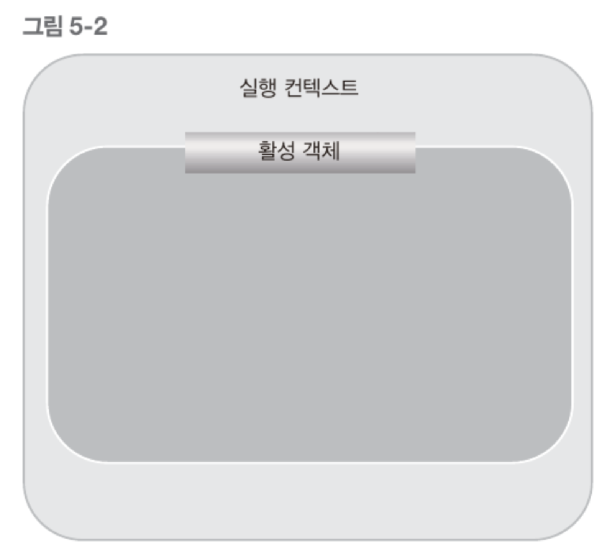
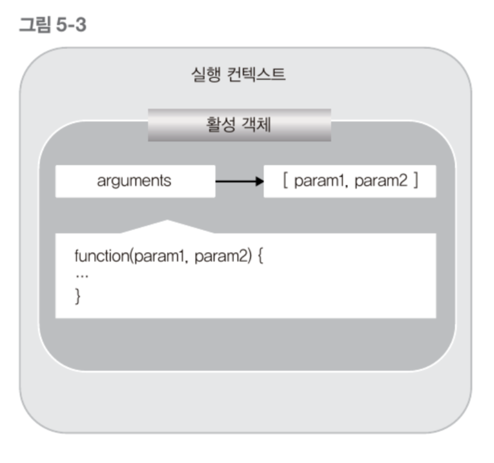
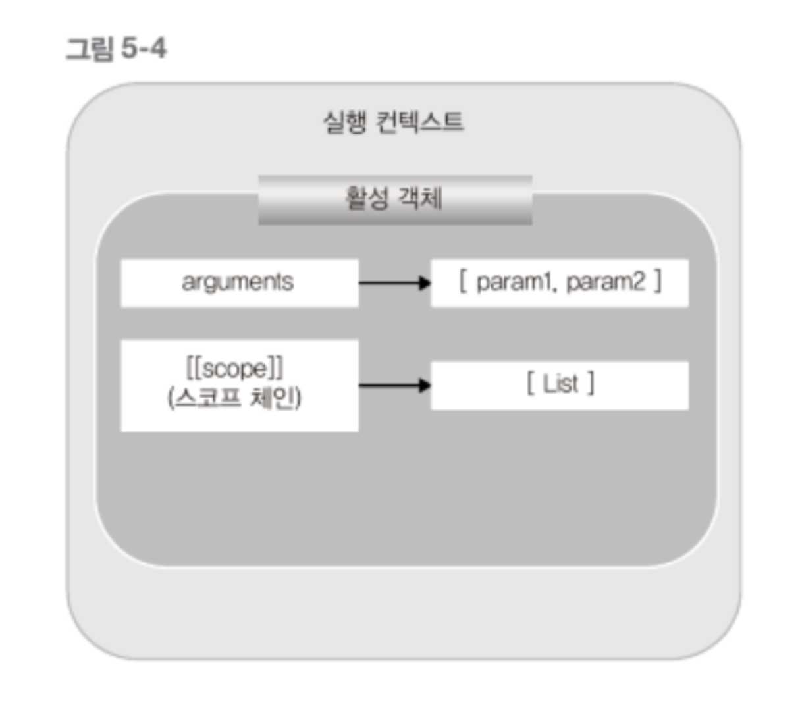
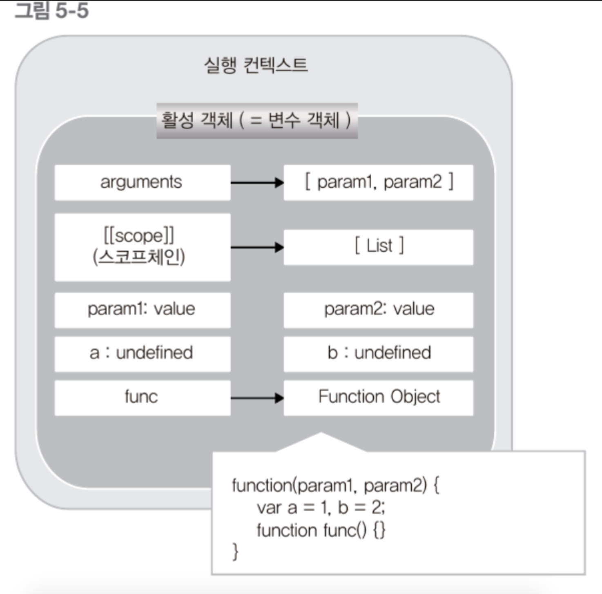
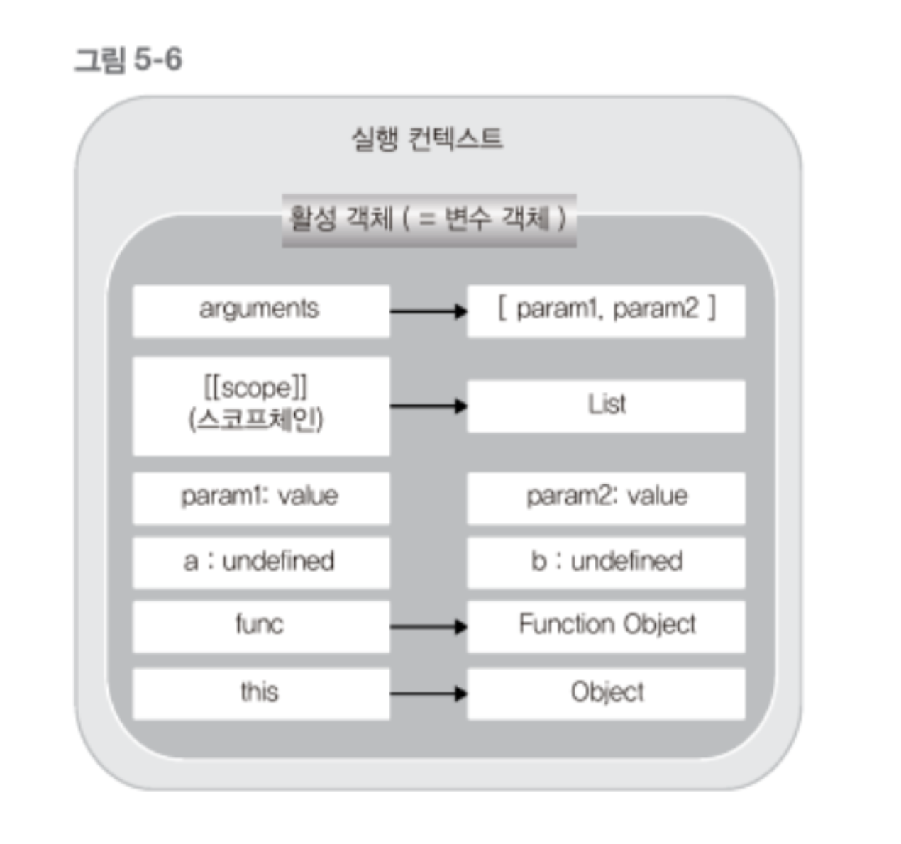

# 실행 컨텍스트 생성 과정

<br>

- [실행 컨텍스트 생성 과정](#실행-컨텍스트-생성-과정)
  - [예제](#예제)
  - [1 활성 객체 생성](#1-활성-객체-생성)
  - [2 arguments 객체 생성](#2-arguments-객체-생성)
  - [3 스코프 정보 생성](#3-스코프-정보-생성)
  - [4 변수 생성](#4-변수-생성)
  - [5 this 바인딩](#5-this-바인딩)
  - [6 코드 실행](#6-코드-실행)

<br>

## 예제
아래 예제를 통해 생성 과정을 알아본다.
```js
function execute(param1, param2) {
    var a = 1, b = 2;
    function func() {
        return a + b;
    }
    return param1 + param2 + func();
}

execute(3, 4);
```

## 1 활성 객체 생성
<p align="center"></p>

* 활성 객체란?
  * 실행 컨텍스트가 생성되면 **해당 컨텍스트에서 실행에 필요한 여러 가지 정보를 담을 객체**를 생성한다.
  * 이를 **활성 객체**라 한다.
* 활성 객체에 담을 데이터
  * 활성 객체에 앞으로 매개변수나 사용자가 정의한 변수 및 객체를 저장하고, 새로 만들어진 컨텍스트로 접근 가능하게 되어 있다.

<br>

## 2 arguments 객체 생성
<p align="center"></p>

* 앞서 만들어진 활성 객체는 `arguments` 프로퍼티로 이 `arguments` 객체를 참조한다.

<br>

## 3 스코프 정보 생성
<p align="center"></p>

* 현재 컨텍스트의 유효 범위를 나타내는 스코프 정보를 생성한다.
  * 현재 컨텍스트에서 특정 변수에 접근해야 할 경우, 이 연결 리스트(스코프 정보)를 활용한다.
* **이 리스트를 스코프 체인이라고 한다. (`[[scope]]`)**

<br>

## 4 변수 생성
<p align="center"></p>

* 현재 컨텍스트에서 사용되는 지역 변수를 생성한다.
* 변수 객체 vs 활성 객체
  * 문서마다 어떤 곳에서는 활성 객체, 어떤 곳에서는 변수 객체라고 한다.
  * `변수 객체 === 활성 객체`

<br>

## 5 this 바인딩
<p align="center"></p>

* this 키워드로 사용하는 값이 활당된다.
  * 자세한 내용은 [여기](https://github.com/binghe819/TIL/blob/master/JS/JS%20%EA%B8%B0%EC%B4%88%20%EC%A0%95%EB%A6%AC/%ED%95%A8%EC%88%98/%ED%95%A8%EC%88%98%20%ED%98%B8%EC%B6%9C%EA%B3%BC%20this.md)에서 확인
* `this`가 참조하는 객체가 없으면 전역 객체를 참조한다.

<br>

## 6 코드 실행
이렇게 하나의 실행 컨텍스트가 생성되고, 변수 객체가 만들어진 후에, 코드에 있는 여러 코드가 실행된다.

예를 들어, 변수의 초기화 및 연산, 또 다른 함수 실행 등등.

> **전역 실행 컨텍스트는 `arguments` 객체가 없으며, 전역 객체 하나만을 포함하는 스코프 체인이 있다.**
