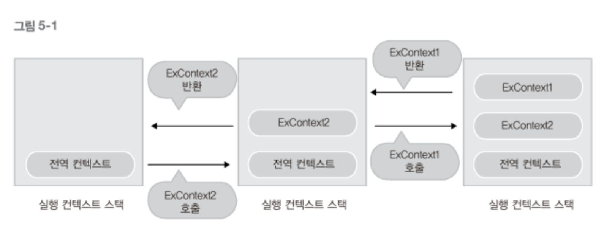

# 실행 컨텍스트란

<br>

- [실행 컨텍스트란](#실행-컨텍스트란)
  - [1 실행 컨텍스트 개념](#1-실행-컨텍스트-개념)
  - [2 실행 컨텍스트가 형성되는 경우](#2-실행-컨텍스트가-형성되는-경우)
  - [3 예시](#3-예시)

<br>

## 1 실행 컨텍스트 개념
> 현재 실행되는 컨텍스트에서 이 컨텍스트와 관련 없는 실행 코드가 실행되면, 
> 
> 새로운 컨텍스트가 생성되어 스택에 들어가고 제어권이 그 컨텍스트로 이동한다.
* ECMASCript 정의
  * **"실행 가능한 코드를 형상화하고 구분하는 추상적인 개념"**
* 콜 스택과 유사하다
  * 실행 컨텍스트는 **콜 스택에 들어가는 실행 정보 하나**와 비슷하다.
  * **"실행 가능한 JS 코드 블럭이 실행되는 환경"**
  * 콜 스택과 똑같이 하나하나 스택형태로 쌓인다.
* 실행에 필요한 여러가지 정보를 담고 있다.

<br>

## 2 실행 컨텍스트가 형성되는 경우
1. 전역 코드
2. `eval()`
3. 함수 실행

대부분은 함수로 실행 컨텍스트를 만든다.

<br>

## 3 예시
```js
console.log('This is global context');

function ExContext1() {
    console.log('This is ExContext1');
};

function ExContext2() {
    ExContext1();
    console.log('This is ExContext2");
};

ExContext2();

// 결과
This is global context
This is ExContext1
This is ExContext2
```

<p align="center"> </p>