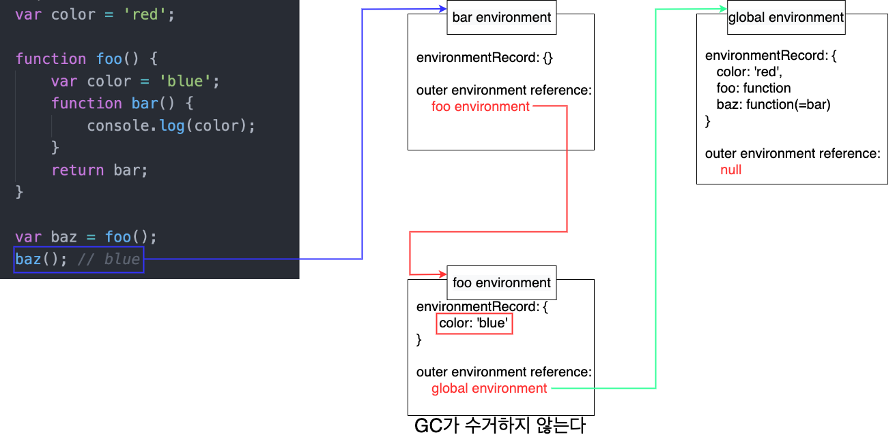

# 클로저란?
> 본 내용은 https://meetup.toast.com/posts/86의 내용을 제가 복습하기 좋게 정리한 글입니다.

<br>

- [클로저란?](#클로저란)
  - [1 클로저 개념](#1-클로저-개념)
    - [1-1 클로저의 의미](#1-1-클로저의-의미)
    - [1-2 JS의 클로저](#1-2-js의-클로저)
  - [2 예시를 통해 배워보자](#2-예시를-통해-배워보자)
    - [2-1 클로저라고 부르지 않는 예시](#2-1-클로저라고-부르지-않는-예시)
    - [2-2 클로저라고 부르는 예시](#2-2-클로저라고-부르는-예시)

<br>

## 1 클로저 개념
클로저는 다양한 의미를 가지고 있다.
* 자유 변수를 기억하는 함수
* 스코프를 기억하는 함수
* 환경(Lexical Environment)를 기억하는 함수
* ...

함수가 무언가를 기억하고 그것을 다시 사용한다는 것을 알 수 있지만, 여전히 모호하게 느껴진다.

<br>

### 1-1 클로저의 의미
* **클로저 = 함수 + 함수를 둘러싼 환경(Lexical Environment)**
  * 함수를 만들고 그 함수 내부의 코드가 탐색하는 스코프를 함수 생성 당시의 렉시컬 스코프로 고정하면 바로 클로저가 된다.
* **이미 생명 주기가 끝난 외부 함수의 변수를 참조하는 함수**
  * 생명 주기가 끝난 외부 함수의 변수를 **자유 변수**라고 한다.

<br>

### 1-2 JS의 클로저
* **JS에서 클로저는 함수가 생성되는 시점에 생성된다.**
  * **= 함수가 생성될 때 그 함수의 렉시컬 환경을 포섭(closure)하여 실행될 때 이용한다.**
  * 따라서 개념적으로는 JS의 모든 함수는 클로저지만, 실제로 클로저라고 부르진 않는다.

<br>

## 2 예시를 통해 배워보자

<br>

### 2-1 클로저라고 부르지 않는 예시
```js
function foo() {
    var color = 'blue';
    function bar() {
        console.log(color);
    }
    bar();
}
foo(); // blue
```
* 위 코드를 해석하자면
  * 일단 `bar`는 `foo`안에 속하기 때문에 `foo` 스코프를 외부 스코프(outer lexical environment) 참조로 저장한다.
  * 그리고 `bar`는 자신의 렉시컬 스코프 체인을 통해 `foo`의 `color`를 정확히 참조할 것이다.
* 그렇다면 `bar`함수는 클로저인가??
  * **아니다. 약간의 거리가 있다.**
  * **`bar`는 `foo` 안에서 정의되고 실행되었을 뿐, `foo` 밖으로 나오지 않았기 때문에 클로저라고 부르지 않는다.**
  * 즉, **외부에서 `bar`를 직접 호출하지 않았기 때문에 `bar`의 렉시컬 환경을 포섭(closure)할 필요가 없다.**

<br>

### 2-2 클로저라고 부르는 예시
```js
var color = 'red';
function foo() {
    var color = 'blue';
    function bar() {
        console.log(color);
    }
    return bar;
}
var baz = foo();
baz(); // blue
```
* 위 예시는 클로저가 맞다.
  * **`bar`는 자신이 생성된 렉시컬 스코프에서 벗어나 `global`에서 `baz`라는 이름으로 호출되었고, 스코프 탐색은 현재 실행 스택과 관련 없는 `foo`를 거쳐갔다.**
* **`baz`를 `bar`로 초기화할 때 이미 `bar`의 `outer lexical environment`를 `foo`로 했다.**
  * 때문에 `global`에서 아무리 호출해도 여전히 `foo`에서 `color`를 찾게 된다.

<br>

<p align="center"> </p>

<br>

> 우리는 2개의 예시를 통해 알 수 있다.
> * **클로저는 콜 스택에 따라 스코프가 결정되지 않고 렉시컬 환경에 따라 결정된다.**
>   * 클로저는 동적 스코프(콜 스택)가 아닌, 소스코드가 작성된 그 문맥인 정적 스코프(렉시컬 환경)를 사용한다는 것.

