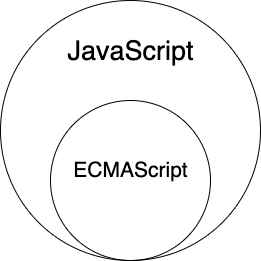
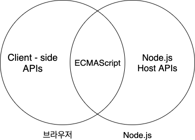

# 자바스크립트란?

자바스크립트에 대한 기본적 정의는 [위키백과](https://ko.wikipedia.org/wiki/%EC%9E%90%EB%B0%94%EC%8A%A4%ED%81%AC%EB%A6%BD%ED%8A%B8)에 잘 정리되어 있다.

- [자바스크립트란?](#자바스크립트란)
  - [1 자바스크립트와 ECMAScript](#1-자바스크립트와-ecmascript)
  - [2 자바스크립트 특징](#2-자바스크립트-특징)
  - [3 브라우저 vs Node.js](#3-브라우저-vs-nodejs)
  - [4 모듈과 NPM](#4-모듈과-npm)

 

## 1 자바스크립트와 ECMAScript

   
  자바스크립트는 일반적으로 ECMAScript를 아우르는 개념이다.

* ECMAScript
  * 자바스크립트의 표준 사양인 ECMA-262를 말하며, 자바스크립트의 기본적인 핵심 문법을 규정한다.
    * 기본 뼈대라고 생각하면 된다.
  * 값, 타입, 객체, 프로퍼티, 함수, 객체 등등 많은 것을 규정한다.
* 자바스크립트
  * ECMAScript + API
    * 자바스크립트는 기본 뼈대인 ECMAScript와 브라우저나 여러 API등을 아우르는 개념이다.
  * [Web API](https://developer.mozilla.org/ko/docs/Web/API)
    * DOM, BOM, fetch ...등등

 

## 2 자바스크립트 특징

* 웹 브라우저에서 동작하는 유일한 프로그래밍 언어
  * **인터프리터 언어 ( + 약간의 컴파일 == 호이스팅)**
* 멀티 패러다임 프로그래밍 언어
  * 명령형, 함수형, 프로토타입 기반 객체지향 프로그래밍

 

## 3 브라우저 vs Node.js

	

* 브라우저
  * 클라이언트 사이드 Web API 지원
    * DOM API를 기본적으로 제공
    * 파일 시스템을 기본적으로 지원하지 않는다. (물론 방법은 있다)
* Node.js
  * 파일 시스템, HTTP...등 API 지원
    * DOM API같은 브라우저에서 사용하는 API를 제공하지 않는다.
    * 파일 시스템을 기본적으로 지원

## 4 모듈과 NPM

https://poiemaweb.com/nodejs-npm

 
