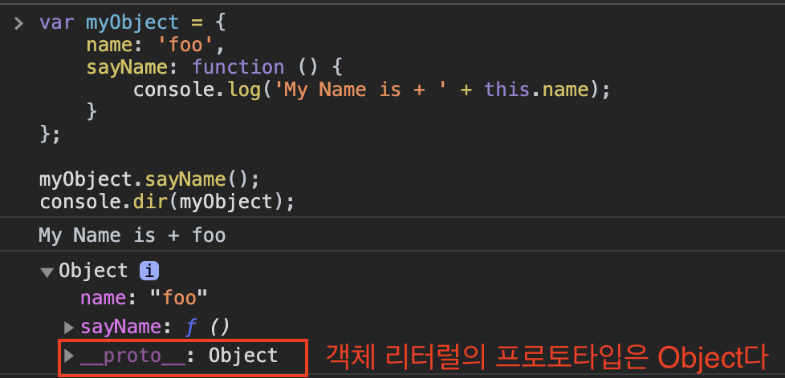
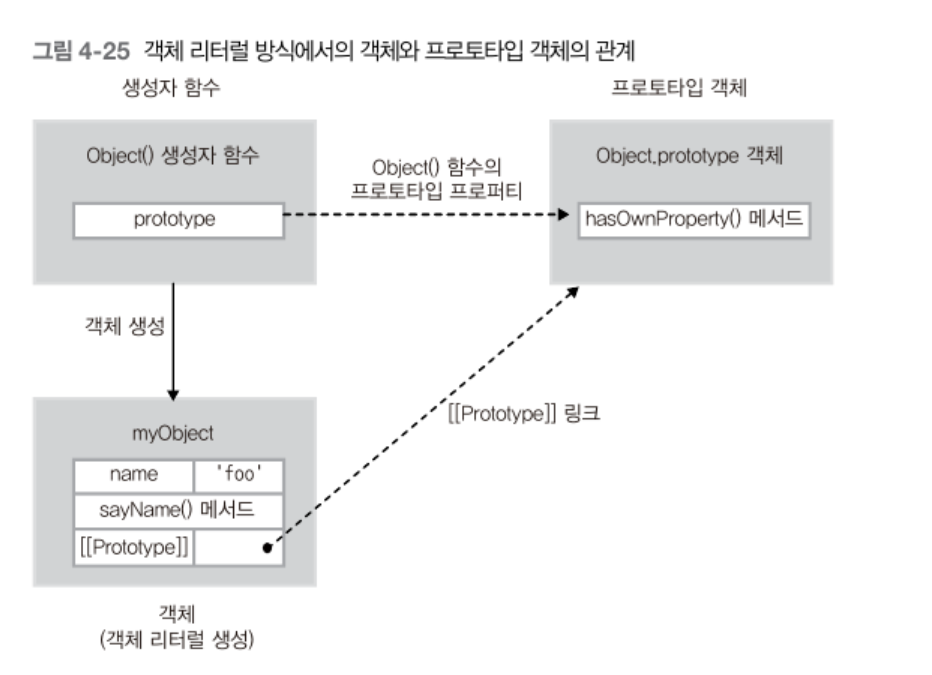
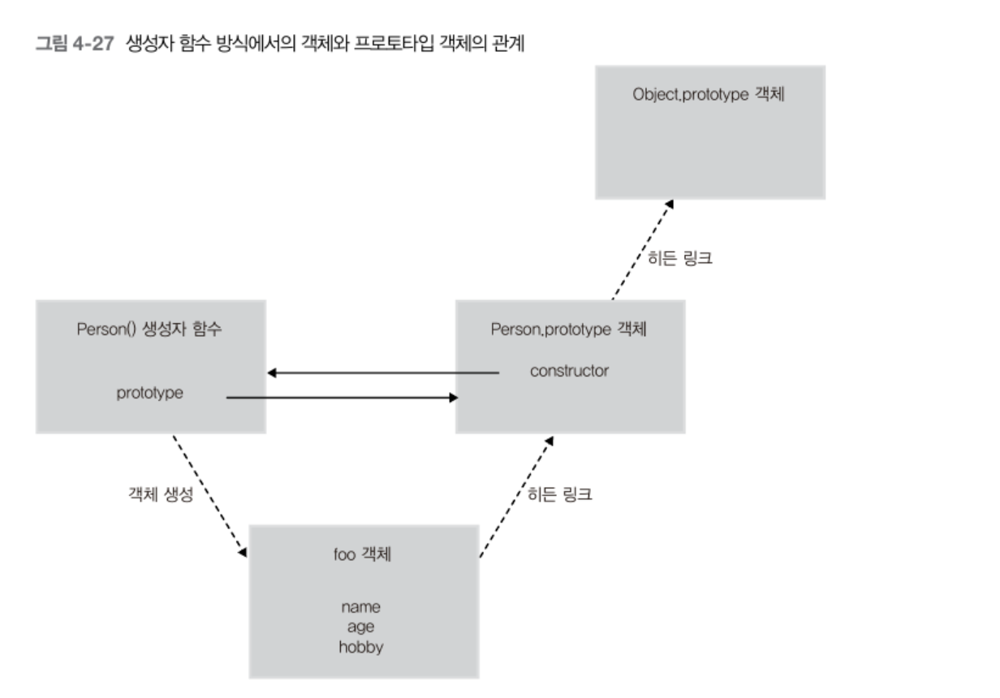

# 프로토타입 체이닝

<br>

- [프로토타입 체이닝](#프로토타입-체이닝)
  - [1 프로토타입 체이닝이란](#1-프로토타입-체이닝이란)
  - [2 객체 리터럴 방식으로 생성된 객체의 프로토타입 체이닝](#2-객체-리터럴-방식으로-생성된-객체의-프로토타입-체이닝)
  - [2 생성자 함수로 생성된 객체의 프로토타입 체이닝](#2-생성자-함수로-생성된-객체의-프로토타입-체이닝)
  - [3 프로토타입 체이닝의 종점 - Object](#3-프로토타입-체이닝의-종점---object)
  - [4 프로토타입 메서드와 this 바인딩](#4-프로토타입-메서드와-this-바인딩)
  - [5 디폴트 프로토타입은 다른 객체로 변경이 가능하다](#5-디폴트-프로토타입은-다른-객체로-변경이-가능하다)
  - [6 프로퍼티 읽기나 메서드를 실행할 때만 체이닝이 동작한다](#6-프로퍼티-읽기나-메서드를-실행할-때만-체이닝이-동작한다)

<br>

## 1 프로토타입 체이닝이란
* `__proto__`
  * 모든 객체는 `__proto__`라는 프로퍼티를 가지고 있으며, 이 객체를 통해 자신의 부모 역할을 하는 객체에 접근할 수 있다.
* 프로토타입 체이닝이란
  * 특정 객체의 프로퍼티나 메서드에 접근하려고 할 때, 해당 객체에 접근하고자하는 프로퍼티나 메서드가 없을 경우, `__proto__` 링크를 따라 프로퍼티를 검색한다. 
  * 이렇게 **`__proto__`를 통해 상위 프로토타입들과 연결성이 Chain처럼 연결되어있어서 이를 프로토타입 체이닝이라 한다.**

<br>

## 2 객체 리터럴 방식으로 생성된 객체의 프로토타입 체이닝
<p align="center"></p>

* **객체 리터럴 방식으로 생성된 객체의 프로토타입은 `Object`로 체이닝되어있다.**
  * 즉, **객체 리터럴 방식의 생성자 함수는 `Object`다.**
* 그러므로 아래와 같이 `Object`의 메서드인 `hasOwnProperty()`를 호출할 수 있다.

<p align="center"><br> 출처 : 인사이드 자바스크립트 </p>

<br>

## 2 생성자 함수로 생성된 객체의 프로토타입 체이닝
```js
// Person() 생성자 함수
function Person(name, age, hobby) {
    this.name = name;
    this.age = age;
    this.hobby = hobby;
}

// foo 객체 생성
var foo = new Person('foo', 30, 'tennis');

// 프로토타입 체이닝
console.dir(foo.hasOwnProperty('name')); // true
```

<p align="center"><br> 출처 : 인사이드 자바스크립트 </p>

* 모든 객체는 자신을 생성한 생성자 함수의 `prototype` 프로퍼티가 가리키는 객체를 자신의 프로토타입 객체(부모 객체)로 취급한다.

<br>

## 3 프로토타입 체이닝의 종점 - Object
* JS에서 `Object.prototype` 객체는 프로토타입 체이닝의 종점이다.
  * 객체 리터럴 방식이나 생성자 함수를 이용한 방법이나 모두 프로토타입 체이닝의 종점은 `Object.prototype`이다.

<br>

## 4 프로토타입 메서드와 this 바인딩
프로토타입도 JS 객체다. 그러므로 객체와 동일하게 동작한다.

**프로토타입 메서드의 `this`는 기존의 메서드와 동일하게 동작한다.**

```js
// Person() 생성자 함수
function Person(name) {
    this.name = name;
}

// getName() 프로토타입 메서드
Person.prototype.getName = function() {
    return this.name;
};

// foo 객체 생성
var foo = new Person('foo');

console.log(foo.getName());              // foo

// Person.prototype 객체에 name 프로퍼티 동적 추가
Person.prototype.name = 'person';

console.log(Person.prototype.getName()); // person
```
* `this`는 그 메서드를 호출한 객체에 바인딩된다.

<br>

## 5 디폴트 프로토타입은 다른 객체로 변경이 가능하다
```js
// Person() 생성자 함수
function Person(name) {
    this.name = name;
}
console.log(Person.prototype.constructor); // Person

// foo 객체 생성
var foo = new Person('foo');
console.log(foo.country);     // undefined

// 디폴트 프로토타입 객체 변경
Person.prototype = {
    country: 'korea'
};
console.log(Person.prototype.constructor); // Object

// bar 객체 생성
var bar = new Person('bar');

console.log(foo.country);    // undefined
console.log(bar.country);    // korea
console.log(foo.constructor); // Person
console.log(bar.constructor); // Object
```
* 생성자 함수의 디폴트 프로토타입을 다른 일반 객체로 변경하는 것이 가능하다.
* **디폴트 프로토타입이 변경되면, 변경된 시점 이후에 생성된 객체들은 변경된 프로토타입 객체로 링크가 연결된다.**

<br>

## 6 프로퍼티 읽기나 메서드를 실행할 때만 체이닝이 동작한다
* 객체의 특정 프로퍼티를 읽으려고 할 때, 프로퍼티가 해당 객체에 없는 경우 프로토타입 체이닝이 발생한다.
* 반대로 객체에 있는 특정 프로퍼티에 값을 쓰려고 한다면 이때는 체이닝이 발생하지 않는다.