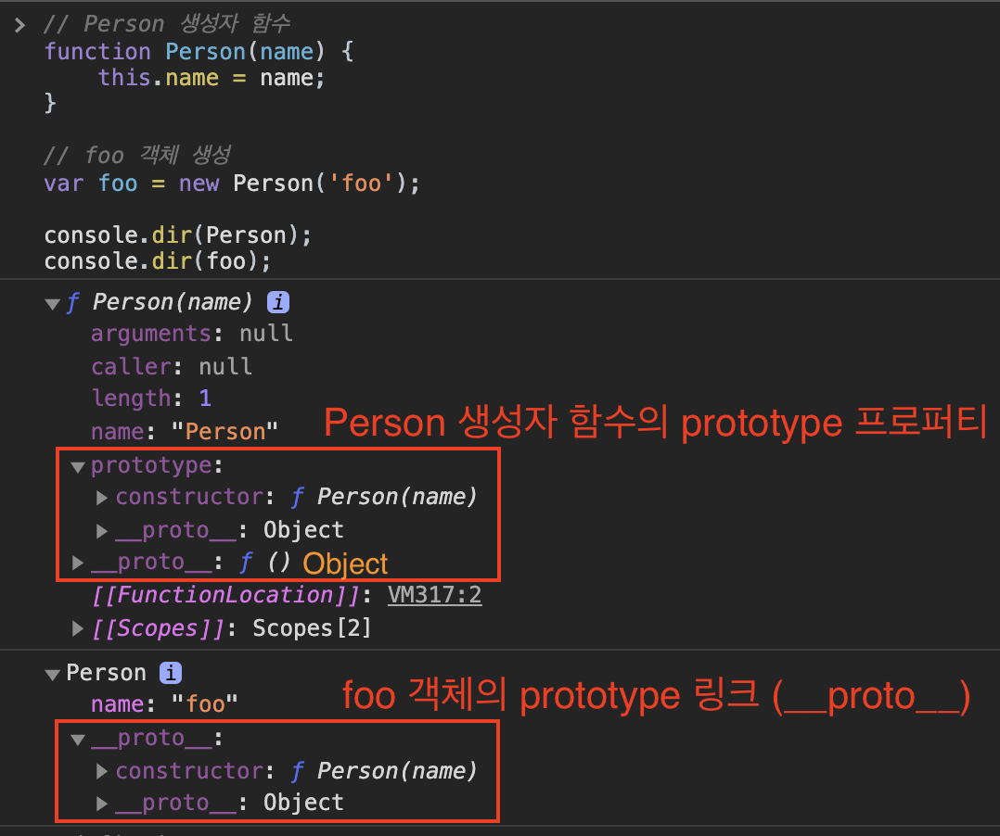
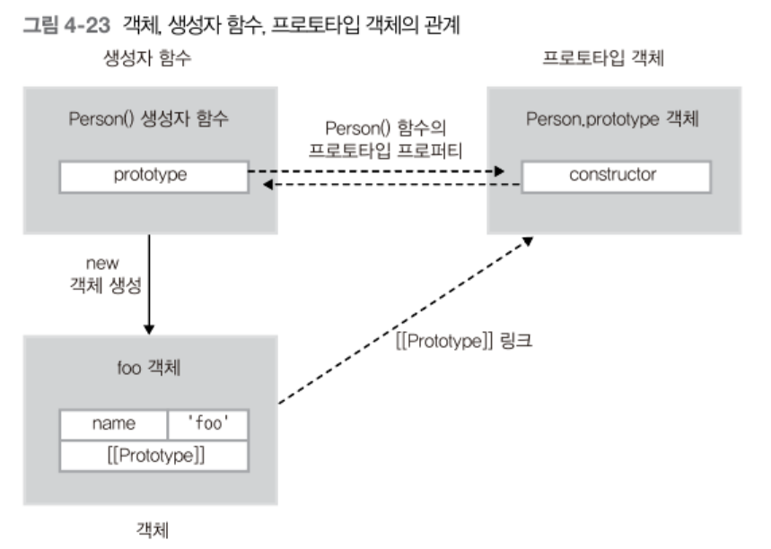

# 프로토타입이란

<br>

- [프로토타입이란](#프로토타입이란)
  - [1 사전적 의미](#1-사전적-의미)
  - [2 프로토타입의 두 가지 의미](#2-프로토타입의-두-가지-의미)
    - [2-1 prototype과 \_\_proto\_\_](#2-1-prototype과-__proto__)
    - [2-2 예시](#2-2-예시)
    - [2-3 예시](#2-3-예시)

<br>

## 1 사전적 의미
* 프로토타입(prototype)은 원래의 형태 또는 전형적인 예, 기초 또는 표준을 의미한다.
* protos (처음) + typos (느낌) => prototype (원본, 초기)

<br>

## 2 프로토타입의 두 가지 의미
JS에서는 두 가지의 프로토타입이 존재한다. 그리고 처음 배울 때 이게 굉장히 헷갈린다.
* `prototype` 프로퍼티 : 프로토타입 속성
* `__proto__` (`[[Prototype]]`) : 프로토타입 연결

이 두 가지의 프로토타입을 이해하기 위해선 [객체 생성 규칙](https://github.com/binghe819/TIL/blob/master/JS/JS%20%EA%B8%B0%EC%B4%88%20%EC%A0%95%EB%A6%AC/%EB%8D%B0%EC%9D%B4%ED%84%B0%20%ED%83%80%EC%9E%85%20%EB%B0%8F%20%EC%97%B0%EC%82%B0%EC%9E%90/%EA%B0%9D%EC%B2%B4%20%EC%83%9D%EC%84%B1.md)에 대해서 알아야한다.

<br>

### 2-1 prototype과 \_\_proto\_\_
* **모든 객체는 자신을 생성한 생성자 함수의 `prototype` 프로퍼티가 가리키는 객체를 자신의 프로토타입 객체 (부모 객체)로 취급한다.**
  * `prototype` : 생성자 함수로 생성하는 모든 객체의 부모 객체 (프로토타입 속성)
  * `__proto__` : 모든 객체가 가지고 있는 부모 객체 링크 (프로토타입 연결)
* 생성자 함수는 새로운 객체를 만들어주고, 자신의 `prototype` 프로퍼티를 부모 프로토타입으로 연결해주는 역할을 한다.

> 더 자세한 내용은 [여기](https://github.com/binghe819/TIL/blob/master/JS/JS%20%EA%B8%B0%EC%B4%88%20%EC%A0%95%EB%A6%AC/%ED%95%A8%EC%88%98/%ED%95%A8%EC%88%98%20%ED%98%B8%EC%B6%9C%EA%B3%BC%20this.md#3-2-%EC%83%9D%EC%84%B1%EC%9E%90-%ED%95%A8%EC%88%98%EC%9D%98-%EB%8F%99%EC%9E%91-%EB%B0%A9%EC%8B%9D)에서 확인.

<br>

### 2-2 예시

<p align="center"> </p>

<p align="center"><br> 출처 : 인사이드 자바스크립트</p>

* `Person()` 생성자 함수는 `prototype` 프로퍼티로 자신과 링크된 프로토타입 객체를 가리킨다.
* `Person()` 생성자 함수로 생성된 `foo`는 `Person()` 함수의 `prototype`를 `__proto__` 링크로 연결한다.

> **결국 객체를 생성하는 건 생성자 함수의 역할이지만, 생성된 객체의 실제 부모 역할을 하는 건 생성자 자신이 아닌 생성자의 `prototype` 프로퍼티가 가리키는 프로토타입 객체다.**

<br>

### 2-3 예시
평소에 자주 보던 [동욱님 블로그](https://jojoldu.tistory.com/7)에서 좋은 예시를 찾아서 정리하였다.

```js
function Member() {
    this.x = "this";
};

Member.prototype.x = "protoX";
Member.prototype.y = "protoY";
Member.x = "x";

var a = new Member();

console.log(a.x);                // "this"
console.log(Member.x);           // "x"
console.log(a.y);                // "protoY"
console.log(Member.prototype.x); // "protoX"
console.log(Member.prototype.y); // "protoY"
```
* 출력되는 값들을 이해했다면 2가지의 프로토타입을 모두 이해한 것.
