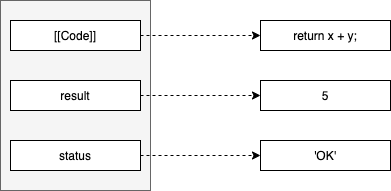
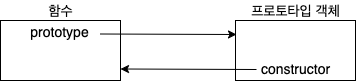

# 함수 객체 : 함수도 객체다

<br>

- [함수 객체 : 함수도 객체다](#함수-객체--함수도-객체다)
  - [1 함수도 객체다](#1-함수도-객체다)
    - [1-1 "함수도 객체다"의 의미](#1-1-함수도-객체다의-의미)
    - [1-2 예시](#1-2-예시)
  - [2 함수 객체의 기본 프로퍼티](#2-함수-객체의-기본-프로퍼티)
    - [2-1 name](#2-1-name)
    - [2-2 caller](#2-2-caller)
    - [2-3 arguments](#2-3-arguments)
    - [2-4 \_\_proto\_\_ - 보완 필요](#2-4-__proto__---보완-필요)
    - [2-5 length](#2-5-length)
    - [2-6 prototype 프로퍼티](#2-6-prototype-프로퍼티)
      - [2개의 prototype](#2개의-prototype)
      - [함수 객체와 prototype 객체의 관계](#함수-객체와-prototype-객체의-관계)
      - [왜 서로 참조하고 있는것인가? - 보완 필요](#왜-서로-참조하고-있는것인가---보완-필요)

<br>

## 1 함수도 객체다

<br>

### 1-1 "함수도 객체다"의 의미

함수도 객체다. 이 말은 다르게 말하면 **함수 객체 = 일반 객체 Property + 함수 객체만의 Property**다.

즉, **함수는 일반적인 객체의 기능에 추가로 호출됐을 때 정의된 코드를 실행하는 기능을 가지고 있다.**

<br>

### 1-2 예시

```js
// 함수 선언 방식으로 add()함수 정의
function add(x, y) {
    return x + y;
}

// add() 함수 객체에 result, status 프로퍼티 추가
add.result = add(3, 2);
add.status = 'OK';

console.log(add.result); // 5
console.log(add.status); // 'OK'
```

<br>

<p align="center"><br>함수 코드는 함수 객체의 [[Code]] 내부 프로퍼티에 저장된다.</p>

<br>

* JS에서는 **함수도 객체다**. 일반 객체와 동일하게 동작할 수 있다.
  * 함수는 객체이므로 일반 객체와 동일하게 동작할 수 있다. ()
  * 반대로 일반 객체는 호출할 수 없다.

<br>

## 2 함수 객체의 기본 프로퍼티

<br>

<p align="center"><br>add 함수 객체</p>

함수는 일반 객체와는 다르게 **추가로 함수 객체만의 표준 프로퍼티가 정의**되어 있다.

* arguments
* caller
* length
* ...

<br>

### 2-1 name
* 함수의 이름을 나타낸다.
  * 익명함수일 경우엔 빈 문자열.

<br>

### 2-2 caller
```js
function foo(func) {
  return func();
}

function bar() {
  return 'caller : '+bar.caller;
}

console.log(foo(bar)); // caller : function foo(funct) {...}
console.log(bar()); // caller : null
```
* 자신을 호출한 함수를 나타낸다.
  
<br>

### 2-3 arguments
```js
function multiply(x, y){
  console.log(arguments);
  return x*y;
}

console.log(multiply()); // NaN
console.log(multiply(1)); // NaN
console.log(multiply(1, 2)); // 2
console.log(multiply(1, 2, 3)); // 2
```
* **arguments 객체는 함수 호출 시 전달된 인수들의 정보를 담고 있는 유사 배열 객체**
  * 함수를 호출할 때 arguments 객체를 생성하여 인자값과 함께 전달된다.
  * **가변 인자 함수라고 보면 된다.**

<br>

### 2-4 \_\_proto\_\_ - 보완 필요
* 일반적인 객체와 동일하게 부모 역할을 하는 프로토타입 객체를 가리킨다.
  * `Function.prototype` 객체라 부르며, `Empty()` 함수라고도 불린다.
* `add()` 객체와 마찬가지로 name, caller, arguments등 함수 프로퍼티를 가지고있다.
  * **모든 함수들의 부모 역할을 하는 프로토타입이다.**
  * 프로토타입으로 `Object`를 가리키고 있다.
* **ECMASCript에는 `Function.prototype`객체는 아래 프로퍼티를 가져야한다고 기술하고있다.**
  * `constructor` 프로퍼티
  * `toString()` 메서드
  * `apply(thisArg, argArray)` 메서드
  * `call(thisArg, [, arg1 [, arg2]])` 메서드
  * `bind(thisArg, [, arg1 [, arg2]])` 메서드

> `call`과 `apply` 메서드를 이용한 명시적인 this 바인딩은 나중에 더 자세히 정리할 예정이다.

<br>

### 2-5 length
* 모든 함수가 가져야하는 표준 프로퍼티 (ECMAScript)
* **함수가 정상적으로 실행될 때 기대되는 인자의 개수를 나타낸다.**
  * 함수를 작성할 때 정의한 인자 개수

<br>

### 2-6 prototype 프로퍼티

<br>

#### 2개의 prototype
* **여기서 말하는 `prototype`은 부모 프로퍼티를 가리키는 `__proto__`와 다른 프로퍼티다.**
  * `__proto__` : 부모 역할을 하는 프로토타입을 가리킨다.
  * **`prototype` : 함수 객체가 가지고 있으며, 함수가 생성자로 사용될 때 이 함수를 통해 생성된 객체의 부모 역할을 하는 프로토타입 객체를 가리킨다.**

<br>

#### 함수 객체와 prototype 객체의 관계
<p align="center"><br>함수 객체와 prototype 객체의 관계 </p>

* **`prototype` 객체는 함수가 생성될 때 만들어지며, 위 그림과 같이 단지 `constructor`프로퍼티 하나만 있는 객체를 가리킨다.**
  * `constuctor` 프로퍼티는 자신과 연결된 함수를 가리킨다.
  * 즉, 함수를 생성할 때, 함수 자신과 연결된 프로토타입 객체를 동시에 생성하며, 이 둘은 서로 참조한다.

```js
// 함수 객체와 프로토타입 객체와의 관계를 보여주는 코드
function myFunction() {
    return true;
}

console.dir(myFunction.prototype);              // myFunction의 prototype 객체
console.dir(myFunction.prototype.constructor);  // myFunction
```

<br>

#### 왜 서로 참조하고 있는것인가? - 보완 필요
함수가 생성자로 사용될 때 이 함수를 통해 생성된 객체의 부모 역할을 하는 프로토타입 객체를 가리킨다고하는데 정확히 무슨 소리인지 모르겠다.. 

뒤 내용을 더 공부하고 이해하면 추가할 예정.
