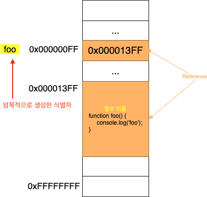

# 함수 정의


<br>

- [함수 정의](#함수-정의)
  - [개요](#개요)
  - [1 함수 리터럴](#1-함수-리터럴)
  - [2 함수 선언문](#2-함수-선언문)
    - [함수는 함수 이름이 아닌 함수 객체를 가리키는 식별자로 호출한다.](#함수는-함수-이름이-아닌-함수-객체를-가리키는-식별자로-호출한다)
    - [함수 선언문은 함수 식별자를 생성한다](#함수-선언문은-함수-식별자를-생성한다)
  - [3 함수 표현식](#3-함수-표현식)
    - [함수 생성 시점과 호이스팅](#함수-생성-시점과-호이스팅)
  - [4 Function 생성자 함수 - 보완필요](#4-function-생성자-함수---보완필요)
  - [5 화살표 함수 - 보완필요](#5-화살표-함수---보완필요)


<br>

## 개요
함수를 정의(생성)하는 4가지 방법에 대해서 정리하였다.
* 함수 선언문
* 함수 표현식
* Function 생성자 함수
* 화살표 함수 (ES6)

<br>

## 1 함수 리터럴
```js
function add(x, y){
  return x + y;
};
```

* 자바스크립트의 함수는 객체 타입의 값이다.
  * 리터럴은 값을 생성하기 위한 표기법이다. 따라서 함수 리터럴도 평가되어 값을 생성하며, 이 값은 객체다.
* 함수 선언문이나 함수 표현식 방법에 모두 함수 리터럴이 사용된다.

<br>

## 2 함수 선언문
```js
// 함수 선언문
function add(x, y) {
    return x + y;
}

console.log(add(2,5)); // 7
```
* 함수 선언문은 이름을 생략할 수 없다.

<br>

### 함수는 함수 이름이 아닌 함수 객체를 가리키는 식별자로 호출한다.
<p align="center"> </p>

* 함수는 함수 이름으로 호출하는 것이 아니라 함수 객체를 가리키는 식별자로 호출한다.
  * **함수 이름은 함수 내부에서만 호출가능하다.** (재귀)

<br>

### 함수 선언문은 함수 식별자를 생성한다
```js
function foo() {
    console.log('foo');
}

// 아래와 같이 자동적으로 변수에 할당된다.
var foo = function foo() {
    console.log('foo');
}
```

<p align="center"> </p>

* 함수 선언문은 생성된 함수를 호출하기 위해 위와 같이 **함수 이름과 동일한 이름의 식별자를 암묵적으로 생성하고, 거기에 함수 객체를 할당한다.**
* **함수 선언문도 함수 표현식으로 변환되어 사용되어지는 것이다.**

<br>

## 3 함수 표현식
```js
// 함수 표현식
var add = function (x, y) {
    return x + y;
}

var plus = add;

console.log(add(3,4));   // 7
console.log(plus(5,6));  // 11
```

<p align="center"></p>

* 함수 표현식이란
  * 함수 리터럴로 생성한 함수 객체를 변수에 할당하는 것.
* 함수 리터럴의 함수 이름은 생략할 수 있다. (익명함수)

<br>

### 함수 생성 시점과 호이스팅
```js
// 함수 참조
console.dir(add); // f add(x,y)
console.dir(sub); // undefined

// 함수 호출
console.log(add(2, 5)); // 7
console.log(sub(2, 5)); // TypeError: sub is not a function

// 함수 선언문
function add(x, y) {
    return x + y;
}

// 함수 표현식
var sub = function(x ,y) {
    return x + y;
}
```
* **함수 선언문과 함수 표현식의 함수 생성 시점이 다르다.**
  * 함수 선언문 - 함수 호이스팅
  * 함수 표현식 - 변수 호이스팅

> 함수 호이스팅은 함수를 호출하기 전에 반드시 함수를 선언해야 한다는 규칙을 무시한다.
> 이같은 이유로 **더글라스 크락포드는 함수 선언문 대신 함수 표현식을 사용할 것을 권장한다.**

<br>

## 4 Function 생성자 함수 - 보완필요
> 뒤에서 설명하겠지만, **JS의 모든 함수도 `Function()`이라는 기본 내장 생성자 함수로부터 생성된 객체라고한다.**
> 
> 일단 어떻게 사용되는지만 알고 나중에 더 자세히 정리해야겠다..

<br>

```js
new Function(arg1, arg2, ..., argN, functionBody);
```
* arg1, arg2, ... argN : 함수의 매개변수
* functionBody : 함수가 호출될 때 실행될 코드를 포함한 문자열

<br>

```js
var add = new Function('x', 'y', 'return x + y');

console.log(add(2, 5));
```
* Function 생성자 함수에 매개변수 목록과 함수 몸체를 문자열로 전달하면서 new 연산자와 함께 호출하면 함수 객체를 생성해서 반환한다.
* 객체를 생성하는 함수를 의미한다.

<br>

## 5 화살표 함수 - 보완필요 
> 화살표 함수 관련되서는 나중에 더 자세히 정리할 생각이다..

<br>

```js
// 화살표 함수
const add = (x, y) => x + y;
console.log(add(2,5));
```

* 화살표 함수는 기존의 함수보다 표현만 간략한 것이 아니라 내부 동작 또한 간략화 되어있다.
  * 기존 함수와 this 바인딩 방식이 다르고, prototype 프로퍼티가 없으며 arguments 객체를 생성하지 않는다.

