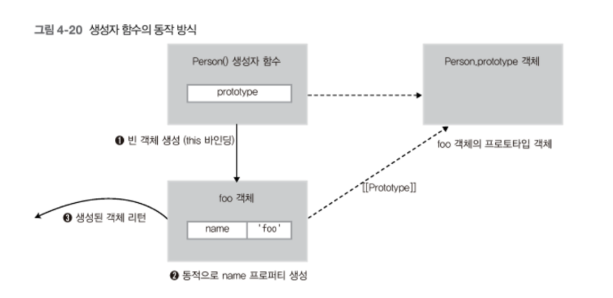

# 함수 호출과 this

<br>

- [함수 호출과 this](#함수-호출과-this)
  - [개요](#개요)
  - [1 객체의 메서드 호출할 때 this 바인딩](#1-객체의-메서드-호출할-때-this-바인딩)
  - [2 함수를 호출할 때 this 바인딩](#2-함수를-호출할-때-this-바인딩)
    - [2-1 내부 함수의 this 바인딩](#2-1-내부-함수의-this-바인딩)
  - [3 생성자 함수를 호출할 때 this 바인딩](#3-생성자-함수를-호출할-때-this-바인딩)
    - [3-1 생성자 함수란](#3-1-생성자-함수란)
    - [3-2 생성자 함수의 동작 방식](#3-2-생성자-함수의-동작-방식)
    - [3-3 생성자 함수의 this](#3-3-생성자-함수의-this)
  - [4 call과 apply 메서드를 이용한 명시적인 this 바인딩](#4-call과-apply-메서드를-이용한-명시적인-this-바인딩)

<br>

## 개요
JS에서 함수를 호출하면 `arguments` 객체 및 `this` 인자가 함수 내부로 암묵적으로 전달된다.

`this`는 이해하기 어려운데, 그 이유는 **여러 가지 함수가 호출되는 방식(호출 패턴)에 따라 `this`가 다른 객체를 참조(this바인당)하기 때문이다.**

이번 글에서는 함수 호출 패턴과 해당 패턴에 따라 `this`가 어떤 객체를 바인딩하는지 알아본다.

<br>

## 1 객체의 메서드 호출할 때 this 바인딩
```js
// myObject 객체 생성
var myObject = {
    name: 'foo',
    sayName: function() {
        console.log(this.name);
    }
};

// otherObject 객체 생성
var otherObject = {
    name: 'bar'
};

// otherObject.sayName() 메서드
otherObject.sayName = myObject.sayName;

// sayName() 메서드 호출
myObject.sayName();      // foo
otherObject.sayName();   // bar
```

<p align="center"><br>sayName()에서 사용된 this는 자신을 호출한 객체에 바인딩 된다.</p>

* 메서드란
  * 객체의 프로퍼티가 함수이면 이 함수를 메서드라한다.
* **메서드 내부 코드에서 사용된 `this`는 해당 메서드를 호출한 객체로 바인딩된다.**

<br>

## 2 함수를 호출할 때 this 바인딩
```js
var foo = "i'm foo"; // 전역 변수 선언

console.log(foo);        // i'm foo
console.log(window.foo); // i'm foo
```

* 함수 호출시, **함수 내부 코드의 `this`는 전역 객체에 바인딩된다.**

<br>

### 2-1 내부 함수의 this 바인딩
메서드가 아닌 함수 호출에서의 `this` 바인딩 특성은 **내부 함수**를 호출했을 때도 그대로 적용된다.

```js
// 전역 변수 value 정의
var value = 100;

// myObject 객체 생성
var myObject = {
    value: 1,

    // func1() 함수 (메서드)
    func1: function() {
        this.value += 1;
        console.log('func1() called. this.value : ' + this.value);

        // func2() 내부 함수 (메서드가 아닌 일반 함수)
        var func2 = function() {
            this.value += 1;
            console.log('func2() called. this.value : ' + this.value);

            // func3() 내부 함수 (메서드가 아닌 일반 함수)
            var func3 = function() {
                this.value += 1;
                console.log('func3() called. this.value : ' + this.value);
            }

            func3(); // func3() 내부 함수 호출
        }

        func2(); // func2() 내부 함수 호출
    }
};

myObject.func1(); // func1() 메서드 호출
```
<p align="center"><br>출처 : 인사이드 자바스크립트</p>

흔히 메서드 `this` 바인딩과 혼동이 와서 아래와 같이 출력될 것이라 생각한다.
```
func1() called. this.value : 2
func2() called. this.value : 3
func3() called. this.value : 4
```

하지만 실제 결과는 아래와 같다.
```
func1() called. this.value : 2
func2() called. this.value : 101
func3() called. this.value : 102
```

그 이유는 JS에서는 내부 함수 호출 패턴을 정의해 놓지 않았기 때문이다.

**결국 내부 함수도 함수 호출로 취급하게 된다.**

<br>

이를 해결하는 방법으로는 `that`을 사용하는 방법이 있다.
```js
// 전역 변수 value 정의
var value = 100;

// myObject 객체 생성
var myObject = {
    value: 1,

    // func1() 함수 (메서드)
    func1: function() {
        var that = this;  // myObject를 가리킨다.

        this.value += 1;
        console.log('func1() called. this.value : ' + this.value);

        // func2() 내부 함수 (메서드가 아닌 일반 함수)
        func2 = function() {
            that.value += 1;
            console.log('func2() called. this.value : ' + that.value);

            // func3() 내부 함수 (메서드가 아닌 일반 함수)
            func3 = function() {
                that.value += 1;
                console.log('func3() called. this.value : ' + that.value);
            }

            func3(); // func3() 내부 함수 호출
        }

        func2(); // func2() 내부 함수 호출
    }
};

myObject.func1(); // func1() 메서드 호출
```
스코프 체인을 이용해서 `that`을 this에 바인딩 시켜서 우회해서 해결하는 방법이다.

<br>

## 3 생성자 함수를 호출할 때 this 바인딩

<br>

### 3-1 생성자 함수란
```js
// Person() 생성자 함수
var Person = function(name) {
    // 함수 코드 실행 전
    this.name = name;
    // 함수 리턴
};

// foo 객체 생성
var foo = new Person('foo');
console.log(foo.name); // foo
```
* JS에서는 자바와 같은 객체지향과 다르게 **기존 함수에 `new` 연산자를 붙여서 호출하면 해당 함수는 생성자 함수로 동작하게 된다.**
* 일반 함수와 인스턴스를 생성하는 **생성자 함수를 구분하기 위해서 생성자 함수 이름의 첫 문자를 대문자로 쓴다.**

<br>

### 3-2 생성자 함수의 동작 방식
```js
function Circle(radius) {
  // 1. 암묵적으로 빈 인스턴스가 생성되고 this에 바인딩된다.
  console.log(this); // Circle {} (빈 인스턴스)
  
  // 2. this에 바인딩되어 있는 인스턴스를 초기화한다.
  this.radius = radius;
  this.getDiameter = function() {
    return 2*this.radius;
  };
  
  // 3. 완성된 인스턴스가 바인딩된 this가 암묵적으로 반환된다.
  // return this;
}
```

<p align="center"><br>출처 : 인사이드 자바스크립트</p>

1. 인스턴스 생성과 this 바인딩
2. 인스턴스 초기화
3. 인스턴스 반환

<br>

**또 다른 예시**
```js
function Person(name) {
  // 생성자 함수 코드 실행 전 -------- 1
  this.name = name;  // --------- 2
  // 생성된 함수 반환 -------------- 3
}

var me = new Person('Lee');
console.log(me.name);
```
<p align="center"><br>출처 : https://poiemaweb.com/js-this</p>

<br>

### 3-3 생성자 함수의 this
위와 같이 생성자 함수의 `this`는 새롭게 생성한 인스턴스를 가리킨다.

<br>

## 4 call과 apply 메서드를 이용한 명시적인 this 바인딩

