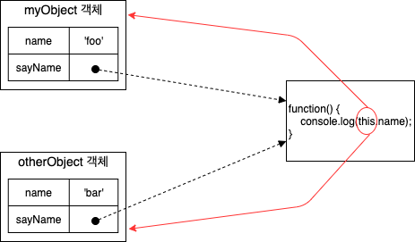
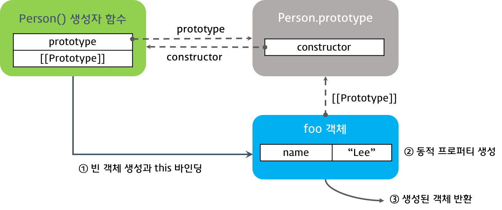

# 함수 호출과 this

<br>

- [함수 호출과 this](#함수-호출과-this)
  - [개요](#개요)
  - [1 객체의 메서드 호출할 때 this 바인딩](#1-객체의-메서드-호출할-때-this-바인딩)
  - [2 함수를 호출할 때 this 바인딩](#2-함수를-호출할-때-this-바인딩)
    - [2-1 내부 함수의 this 바인딩](#2-1-내부-함수의-this-바인딩)
  - [3 생성자 함수를 호출할 때 this 바인딩](#3-생성자-함수를-호출할-때-this-바인딩)
    - [3-1 생성자 함수란](#3-1-생성자-함수란)
    - [3-2 생성자 함수의 동작 방식](#3-2-생성자-함수의-동작-방식)
    - [3-3 생성자 함수의 this](#3-3-생성자-함수의-this)
  - [4 call과 apply 메서드를 이용한 명시적인 this 바인딩](#4-call과-apply-메서드를-이용한-명시적인-this-바인딩)
  - [5 함수 리턴](#5-함수-리턴)
    - [5-1 일반 함수나 메서드는 리턴값을 지정하지 않으면 undefined 값이 리턴된다](#5-1-일반-함수나-메서드는-리턴값을-지정하지-않으면-undefined-값이-리턴된다)
    - [5-2 생성자 함수에서 리턴값을 지정하지 않을 경우 생성된 객체가 리턴된다](#5-2-생성자-함수에서-리턴값을-지정하지-않을-경우-생성된-객체가-리턴된다)

<br>

## 개요
JS에서 함수를 호출하면 `arguments` 객체 및 `this` 인자가 함수 내부로 암묵적으로 전달된다.

`this`는 이해하기 어려운데, 그 이유는 **여러 가지 함수가 호출되는 방식(호출 패턴)에 따라 `this`가 다른 객체를 참조(this바인당)하기 때문이다.**

이번 글에서는 함수 호출 패턴과 해당 패턴에 따라 `this`가 어떤 객체를 바인딩하는지 알아본다.

<br>

## 1 객체의 메서드 호출할 때 this 바인딩
```js
// myObject 객체 생성
var myObject = {
    name: 'foo',
    sayName: function() {
        console.log(this.name);
    }
};

// otherObject 객체 생성
var otherObject = {
    name: 'bar'
};

// otherObject.sayName() 메서드
otherObject.sayName = myObject.sayName;

// sayName() 메서드 호출
myObject.sayName();      // foo
otherObject.sayName();   // bar
```

<p align="center"><br>sayName()에서 사용된 this는 자신을 호출한 객체에 바인딩 된다.</p>

* 메서드란
  * 객체의 프로퍼티가 함수이면 이 함수를 메서드라한다.
* **메서드 내부 코드에서 사용된 `this`는 해당 메서드를 호출한 객체로 바인딩된다.**

<br>

## 2 함수를 호출할 때 this 바인딩
```js
var foo = "i'm foo"; // 전역 변수 선언

console.log(foo);        // i'm foo
console.log(window.foo); // i'm foo
```

* 함수 호출시, **함수 내부 코드의 `this`는 전역 객체에 바인딩된다.**

<br>

### 2-1 내부 함수의 this 바인딩
메서드가 아닌 함수 호출에서의 `this` 바인딩 특성은 **내부 함수**를 호출했을 때도 그대로 적용된다.

```js
// 전역 변수 value 정의
var value = 100;

// myObject 객체 생성
var myObject = {
    value: 1,

    // func1() 함수 (메서드)
    func1: function() {
        this.value += 1;
        console.log('func1() called. this.value : ' + this.value);

        // func2() 내부 함수 (메서드가 아닌 일반 함수)
        var func2 = function() {
            this.value += 1;
            console.log('func2() called. this.value : ' + this.value);

            // func3() 내부 함수 (메서드가 아닌 일반 함수)
            var func3 = function() {
                this.value += 1;
                console.log('func3() called. this.value : ' + this.value);
            }

            func3(); // func3() 내부 함수 호출
        }

        func2(); // func2() 내부 함수 호출
    }
};

myObject.func1(); // func1() 메서드 호출
```
<p align="center"><br>출처 : 인사이드 자바스크립트</p>

흔히 메서드 `this` 바인딩과 혼동이 와서 아래와 같이 출력될 것이라 생각한다.
```
func1() called. this.value : 2
func2() called. this.value : 3
func3() called. this.value : 4
```

하지만 실제 결과는 아래와 같다.
```
func1() called. this.value : 2
func2() called. this.value : 101
func3() called. this.value : 102
```

그 이유는 JS에서는 내부 함수 호출 패턴을 정의해 놓지 않았기 때문이다.

**결국 내부 함수도 함수 호출로 취급하게 된다.**

<br>

이를 해결하는 방법으로는 `that`을 사용하는 방법이 있다.
```js
// 전역 변수 value 정의
var value = 100;

// myObject 객체 생성
var myObject = {
    value: 1,

    // func1() 함수 (메서드)
    func1: function() {
        var that = this;  // myObject를 가리킨다.

        this.value += 1;
        console.log('func1() called. this.value : ' + this.value);

        // func2() 내부 함수 (메서드가 아닌 일반 함수)
        func2 = function() {
            that.value += 1;
            console.log('func2() called. this.value : ' + that.value);

            // func3() 내부 함수 (메서드가 아닌 일반 함수)
            func3 = function() {
                that.value += 1;
                console.log('func3() called. this.value : ' + that.value);
            }

            func3(); // func3() 내부 함수 호출
        }

        func2(); // func2() 내부 함수 호출
    }
};

myObject.func1(); // func1() 메서드 호출
```
스코프 체인을 이용해서 `that`을 this에 바인딩 시켜서 우회해서 해결하는 방법이다.

<br>

## 3 생성자 함수를 호출할 때 this 바인딩

<br>

### 3-1 생성자 함수란
```js
// Person() 생성자 함수
var Person = function(name) {
    // 함수 코드 실행 전
    this.name = name;
    // 함수 리턴
};

// foo 객체 생성
var foo = new Person('foo');
console.log(foo.name); // foo
```
* JS에서는 자바와 같은 객체지향과 다르게 **기존 함수에 `new` 연산자를 붙여서 호출하면 해당 함수는 생성자 함수로 동작하게 된다.**
* 일반 함수와 인스턴스를 생성하는 **생성자 함수를 구분하기 위해서 생성자 함수 이름의 첫 문자를 대문자로 쓴다.**

<br>

### 3-2 생성자 함수의 동작 방식
```js
function Circle(radius) {
  // 1. 암묵적으로 빈 인스턴스가 생성되고 this에 바인딩된다.
  console.log(this); // Circle {} (빈 인스턴스)
  
  // 2. this에 바인딩되어 있는 인스턴스를 초기화한다.
  this.radius = radius;
  this.getDiameter = function() {
    return 2*this.radius;
  };
  
  // 3. 완성된 인스턴스가 바인딩된 this가 암묵적으로 반환된다.
  // return this;
}
```

<p align="center"><br>출처 : 인사이드 자바스크립트</p>

1. 인스턴스 생성과 this 바인딩
2. 인스턴스 초기화
3. 인스턴스 반환

<br>

**또 다른 예시**
```js
function Person(name) {
  // 생성자 함수 코드 실행 전 -------- 1
  this.name = name;  // --------- 2
  // 생성된 함수 반환 -------------- 3
}

var me = new Person('Lee');
console.log(me.name);
```
<p align="center"><br>출처 : https://poiemaweb.com/js-this</p>

<br>

### 3-3 생성자 함수의 this
위와 같이 생성자 함수의 `this`는 새롭게 생성한 인스턴스를 가리킨다.

<br>

## 4 call과 apply 메서드를 이용한 명시적인 this 바인딩
```js
// thisArg : apply() 메서드를 호출한 함수 내부에서 사용한 this에 바인딩할 객체
// argArray : 함수를 호출할 때 넘길 인자들의 배열을 가리킨다.
function.apply(thisArg, argArray)
```
```js
// 생성자 함수
function Person(name, age, gender) {
    this.name = name;
    this.age = age;
    this.gender = gender;
}

// foo 빈 객체 생성
var foo = {};

// apply() 메서드 호출
Person.apply('foo', 30, 'man');
```
* call, apply 메서드란?
  * `this`를 특정 객체에 명시적으로 바인딩시키는 방법.
* `apply()` 핵심 개념
  * `apply()`메서드는 `this`를 특정 객체에 바인딩할 뿐 결국 본질적인 기능은 **함수 호출**이다.
  * 예를 들어, `Person.apply()` 호출하면 이것의 기본적인 기능은 `Person()` 함수를 호출하는 것이다.
* `call`은 `apply()`에서 매개변수만 조금 달라진 것 뿐이다.

<br>

**예시**

`this`를 원하는 값으로 명시적으로 매핑해서 특정 함수나 메서드를 호출할 수 있다는 장점이 있다.

```js
function myFunction() {
    console.dir(arguments);

    // arguments.shift(); 배열 메서드이므로 오류 발생

    // arguments 객체를 배열로 변환
    var args = Array.prototype.slice.apply(arguments);
    console.dir(args);
}

myFunction(1, 2, 3);
```

<p align="center"></p>

* `Array.prototype.splice()` 메서드를 호출해라. 이때 `this`는 `arguments` 객체로 바인딩하라.
* 유사 배열 객체을 배열 객체처럼 사용할 수 있게 됐다.

<br>

## 5 함수 리턴
**JS 함수는 항상 리턴값을 반환한다.**

<br>

### 5-1 일반 함수나 메서드는 리턴값을 지정하지 않으면 undefined 값이 리턴된다
```js
// noReturnFunc() 함수
var noReturnFunc = function() {
    console.log('This function has no return statement.');
};

var result = noReturnFunc();
console.log(result);

// 결과
This function has no return statement.
undefined
```

<br>

### 5-2 생성자 함수에서 리턴값을 지정하지 않을 경우 생성된 객체가 리턴된다
```js
// Person() 생성자 함수
function Person(name, age, gender) {
    this.name = name;
    this.age = age;
    this.gender = gender;

    // 명시적으로 다른 객체 반환
    return {name:'bar', age:20, gender:'woman'};
}

var foo = new Person('foo', 30, 'man');
console.dir(foo); // age: 20, gender: 'woman', name: 'bar'
```
* 위와 같이 명시적으로 다른 객체를 반환하면 해당 객체가 반환된다.
* 하지만 만약 객체가 아닌 불린, 숫자, 문자열의 경우는 리턴 값을 무시하고 `this`로 바인딩 된 객체가 리턴된다.
