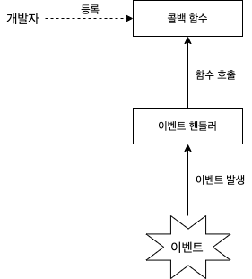
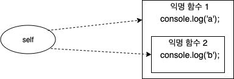

# 함수의 다양한 형태

<br>

- [함수의 다양한 형태](#함수의-다양한-형태)
  - [1 콜백 함수](#1-콜백-함수)
    - [1-1 콜백 함수란?](#1-1-콜백-함수란)
    - [1-2 예시](#1-2-예시)
  - [2 즉시 실행 함수](#2-즉시-실행-함수)
  - [3 내부 함수](#3-내부-함수)
  - [4 함수를 리턴하는 함수](#4-함수를-리턴하는-함수)
  - [5 순수함수와 비순수함수](#5-순수함수와-비순수함수)
    - [5-1 순수 함수](#5-1-순수-함수)
    - [5-2 비순수 함수](#5-2-비순수-함수)

<br>

## 1 콜백 함수

<br>

### 1-1 콜백 함수란?

<p align="center"></p>

* 콜백 함수란
  * 콜백 함수는 코드를 통해 명시적으로 호출하는 함수가 아니라, **함수를 등록하고 어떤 이벤트가 발생했거나 특정 시점에 도달했을 때 시스템에서 호출되는 함수를 말한다.**
  * 대표적인 콜백 함수는 이벤트 핸들러 처리이다.

<br>

### 1-2 예시

```js
// n만큼 반복하며 출력한다.
function repeat1(n) {
  for(var i = 0; i < n; i++)
    console.log(i);
}

repeat1(5); // 0 1 2 3 4

// 콜백 함수를 사용
// 외부에서 전달받은 f를 n만큼 반복 (부가 로직)
function repeat(n, f) {
  for(var i = 0; i < n; i++)
    f(i); // i를 전달하면서 f를 호출
}

// 핵심 로직
var logAll = function(i) {
  console.log(i);
};

repeat(5, logAll); // 0 1 2 3 4

// 핵심 로직
var logOdds = function(i) {
  if(i % 2)
    console.log(i);
}

repeat(5, logOdds); // 1 3
```

* 콜백 함수
  * 함수의 매개변수를 통해 다른 함수의 내부로 전달되는 함수를 콜백함수라 한다.
  * **핵심 로직 (전략)**
* 고차 함수
  * 매개변수를 통해 함수의 외부에서 콜백 함수를 전달받은 함수를 고차함수라 한다.
  * **부가 로직 (컨텍스트)**

```js
// 콜백 함수를 이용한 배열 고차함수
// map
var res = [1, 2, 3].map(function(item) {
  return item * 2;
});

console.log(res); // [2, 4, 6]

// filter
res = [1, 2, 3].filter(function(item) {
  return item % 2;
});

console.log(res); // [1, 3]

// reduce
res = [1, 2, 3].reduce(function(acc, cur) {
  return acc + cur;
}, 0);

console.log(res); // 6
```

<br>

## 2 즉시 실행 함수
```js
(function (name) {
    console.log('This is the immediate function -> ' + name);
})('foo');
```
* 즉시 실행 함수란
  * 즉시 실행 함수는 **함수를 정의함과 동시에 바로 실행하는 함수**를 가리킨다.
* 특징
  * 즉시 실행 함수는 같은 함수를 다시 호출할 수 없다. (일회성)
    * 최초 한 번의 실행만을 필요로 하는 초기화 코드 부분에 사용된다.
  * 외부에서 함수를 호출할 수 없다.

<br>

## 3 내부 함수
```js
// parent() 함수 정의
function parent() {
    var a = 100;
    var b = 200;

    // child() 내부 함수 정의
    function child() {
        var b = 300;

        console.log(a); // 100
        console.log(b); // 300
    }
    child();
}
parent();
child(); // Uncaught ReferenceError: child is not defined
```
* 내부 함수란
  * 함수 내부에 정의된 함수 (중첩 함수라고도 부른다.)
* 활용
  * 클로저를 생성
  * 부모 함수 코드에서 외부에서의 접근을 막고 독립적인 헬퍼 함수를 구현하는 용도로 사용된다.
* 특징
  * 내부 함수는 자신이 정의된 부모 함수 내부에서만 호출이 가능하다.
  * 스코프 체이닝을 통해 부모 함수의 변수에 접근할 수 있다.

<br>

## 4 함수를 리턴하는 함수
```js
// 자신을 재정의하는 함수 예제 코드
// self() 함수
var self = function () {
    console.log('a');
    return function() {
        console.log('b');
    }
}

self = self(); // a
self();        // b
```

<p align="center"></p>

* JS에서는 함수도 일급 객체이므로 일반 값처럼 함수 자체를 리턴할 수도 있다.
  * 이 특징으로 다양한 활용이 가능해진다.


<br>

## 5 순수함수와 비순수함수

### 5-1 순수 함수

```js
var count = 0;

// 순수 함수는 동일한 인수가 전달되면 언제나 동일한 값을 반환
function increase(n) {
  return ++n;
}

// 순수 함수가 반환한 결과값을 변수에 재할당해서 상태를 변경
count = increase(count);
console.log(count); // 1

count = increase(count);
console.log(count); // 2
```

* 순수 함수의 특징
  * **부수효과가 없다.**
  * 동일한 인수가 전달되면 언제나 동일한 값을 반환한다.
  * **함수의 외부 상태를 변경하지 않는다.**

<br>

### 5-2 비순수 함수

```js
var count = 0;

// 비순수 함수
function increase() {
  return ++count;
}

// 비순수 함수는 외부 상태를 변경하므로 상태 변화를 추적하기 어렵다.
increase();
console.log(count); // 1

increase();
console.log(count); // 2
```

* 비순수 함수의 특징
  * **부수효과가 있다.**
  * 외부 상태에 따라 반환값이 달라지는 함수
  * **함수의 외부 상태를 변경한다.**
* 객체는 기본적으로 비순수함수이다.
  * 매개변수를 통해 복사된 참조값이 변경되면 부수효과가 발생하기 때문.


> **함수형 프로그래밍은 순수함수와 보조 함수의 조합을 통해 부수 효과를 최소화해서 불변성을 지향하는 프로그래밍 패러다임.**
