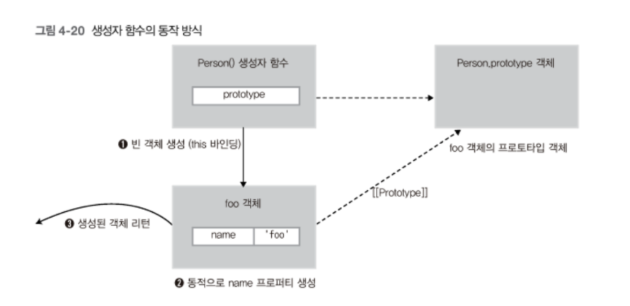

# 목차

<br>

- [목차](#목차)
- [this 이해하기](#this-이해하기)
- [1 this는 실행 컨텍스트가 활성화될 때 바인딩된다](#1-this는-실행-컨텍스트가-활성화될-때-바인딩된다)
- [2 this 바인딩 - 전역 공간에서](#2-this-바인딩---전역-공간에서)
- [3 함수 호출시](#3-함수-호출시)
  - [3-1 내부 함수의 this 바인딩](#3-1-내부-함수의-this-바인딩)
  - [3-2 내부함수에서의 this 우회법](#3-2-내부함수에서의-this-우회법)
- [4 메서드 호출시](#4-메서드-호출시)
- [5 명시적 this - call, apply, bind](#5-명시적-this---call-apply-bind)
- [6 callback 호출시](#6-callback-호출시)
- [7 생성자함수 호출시](#7-생성자함수-호출시)
- [참고](#참고)

<br>

# this 이해하기
JS에서 함수를 호출하면 arguments 객체 및 this 인자가 함수 내부로 암묵적으로 전달된다.

this는 이해하기 어려운데, 그 이유는 여러 가지 함수가 호출되는 방식(호출 패턴)에 따라 this가 다른 객체를 참조(this바인당)하기 때문이다.

이번 글에서는 함수 호출 패턴과 해당 패턴에 따라 this가 어떤 객체를 바인딩하는지 알아본다.

<br>

# 1 this는 실행 컨텍스트가 활성화될 때 바인딩된다

<br>

🤔 **this 바인딩은 언제되는가?**

<p align="center"> </p>

* 실행 컨텍스트는 함수가 호출되는 순간 형성되는데, 이때 실행 컨텍스트가 활성화되는 가장 마지막 단계에서 this 바인딩이 일어난다.
* 즉, this는 함수가 호출될 때 결정된다.

<br>

💁‍♂️ **this는 실행 컨텍스트 활성화시 결정되기때문에, 컴파일 시점에 정적으로된 코드만보고는 this가 어떤 것을 가리키는지 알 수 없다.**

**this는 실행 컨텍스트 활성화시 결정되기때문에, this는 함수를 어떻게 호출했느냐에따라 언제든 변경될 수 있다.**

<br>

# 2 this 바인딩 - 전역 공간에서
전역 공간에서의 `this`는 전역 객체를 가리킨다.
* 브라우저 - `window`
* Node.js - `global`

전역 공간에서의 `this`가 전역 객체를 가리키는 이유는 **개념상 전역 컨텍스트를 실행하는 주체가 바로 전역객체이기때문이다.**

> 전역 객체는 호스팅 (Hosting)객체라고도 불리운다.

<br>

# 3 함수 호출시

<br>

💁‍♂️ 조금 의아한 부분이기도한데.. **함수 호출시의 `this`는 전역 객체를 가리킨다.**

```js
function a() {
    console.log(this);
}
a(); // 전역 객체를 가리킨다.
```
그래도 위 코드는 `a` 함수를 실행해주는 주체가 전역 객체이기때문에 `this`가 전역 객체를 가리키는게 어색하진 않다.

<br>

## 3-1 내부 함수의 this 바인딩
문제는 내부 함수에서의 `this`도 전역 객체를 가리키게된다.

```js
function b() {
    function c() {
        console.log(this); // 전역 객체를 가리킨다.
    }
    c();
}
b(); 
```
위 코드에서 `c()`의 호출결과도 전역 객체이다.

> 이를 JS의 버그라고 보는 시각도있다고한다. 이후에 이러한 문제를 수렴해서 ES6부터의 arrow function의 this는 전역 객체가 아닌 바로 위의 존재하는 실행 컨텍스트에 있는 this를 가져다 사용한다.

<br>

다른 예시를 보면

```js
// 전역 변수 value 정의
var value = 100;

// myObject 객체 생성
var myObject = {
    value: 1,

    // func1() 함수 (메서드)
    func1: function() {
        this.value += 1;
        console.log('func1() called. this.value : ' + this.value);

        // func2() 내부 함수 (메서드가 아닌 일반 함수)
        var func2 = function() {
            this.value += 1;
            console.log('func2() called. this.value : ' + this.value);

            // func3() 내부 함수 (메서드가 아닌 일반 함수)
            var func3 = function() {
                this.value += 1;
                console.log('func3() called. this.value : ' + this.value);
            }

            func3(); // func3() 내부 함수 호출
        }

        func2(); // func2() 내부 함수 호출
    }
};

myObject.func1(); // func1() 메서드 호출
```
보통 실행 결과가 아래와 같다고 예상한다.

```js
func1() called. this.value : 2
func2() called. this.value : 3
func3() called. this.value : 4
```

하지만 실제 실행해보면 결과는 아래와 같다.

```js
func1() called. this.value : 2
func2() called. this.value : 101
func3() called. this.value : 102
```

<p align="center"><br>출처 : 인사이드 자바스크립트 </p>

그 이유는 JS에서는 내부 함수 호출 패턴을 정의해 놓지 않았기 때문이다.

**결국 내부 함수도 함수 호출로 취급하게 된다.** -> 내부 함수도 `this`는 전역 객체를 가리키게된다.

즉, 단순한 함수에서의 `this`는 따로 설정해주지않으면 모두 전역 객체를 바라보게된다.

<br>

## 3-2 내부함수에서의 this 우회법

```js
var a = 10;
var obj = {
    a: 20,
    b: function() {
        console.log(this.a); // 20

        function c() {
            console.log(this.a); // 전역객체 a의 10을 가리킴.
        }
        c();
    }
}
obj.b();
```

메서드내의 내부함수에서의 `this`도 전역객체를 바라본다.

그렇다면 메서드 내의 내부함수에서 `this`를 전역객체가 아닌 바로 위 실행 컨텍스트를 가리키도록하기위해선 우회법을 사용해야한다.

<br>

1️⃣ **`self` 사용**

```js
var a = 10;
var obj = {
    a: 20,
    b: function() {
        console.log(this.a); // 20
        var self = this;

        function c() {
            console.log(self.a); // 20
        }
        c();
    }
}
obj.b();
```
* `this`와 다르게 일반 변수인 `self`를 만들어 `this`를 할당하는 방식이다.
* 이렇게하면 함수는 자신의 `LexicalEnvironment`에서 `self`를 찾고, 없으면 바로 위의 `LexicalEnvironment`를 찾게된다. 그리하여 바로 위의 실행 컨텍스트를 `this`로 바라보게된다.

> 가장 많이 사용되는 방법이기도하다.

<br>

2️⃣ ES6 arrow function 사용

```js
var a = 10;
var obj = {
    a: 20,
    b: function() {
        console.log(this.a); // 20

        const c = () => {
            console.log(this.a); // 20
        }
        c();
    }
}
obj.b();
```
* ES6에서 등장한 arrow function은 this를 바인딩하지 않는다.(실행 컨텍스트에서 아예 바인딩하지 않는다.)
* 대신 스코프 체인상의 상위 실행 컨텍스트 `b()`와 동일하게 `obj`를 `this`로 바라보게된다.

<br>

3️⃣ call, apply 등 사용

```js
var a = 10;
var obj = {
    a: 20,
    b: function() {
        console.log(this.a); // 20

        function c() {
            console.log(this.a);
        }
        c.call(this);
    }
}
obj.b();
```
* `call`과 `apply`를 사용해서 `this`를 수동으로 설정해줄 수 있다.
* `c.call(this)` 를 호출할 때의 실행컨텍스트의 `this`는 b메서드이므로, b메서드의 `this`인 `obj`를 `this`로 바라보게된다.

<br>

# 4 메서드 호출시

<br>

💁‍♂️ **메서드 호출시의 `this`는 메서드를 호출하는 주체 (메서드명 앞)가된다.**

```js
var a = {
    b: function() {
        console.log(this);
    }
}
a.b();
```
`b`함수를 `a`객체의 `메서드로서 호출`했기 때문에, `b`함수 내부에서의 `this`는 `a`를 가리킨다.

> 메서드란 인스턴스 (객체)와 관련된 동작을 의미한다.
> 
> 즉, 어떤 객체와 '관련된' 동작을 하게되면 이는 함수가 아닌 메서드라고 볼 수 있다.

<br>

💁‍♂️ **또 다른 예시**

```js
var a = {
    b: {
        c: function() {
            console.log(this);
        }
    }
}
a.b.c();
```
위 예시에서 `a.b.c()`호출됨에따라 `a.b()`까지가 `this`가 된다.

> 이는 대괄호 표기법으로 호출해도 동일하게 동작한다. a[b].c()

<br>

# 5 명시적 this - call, apply, bind

`this`를 명시적으로 바인딩하는 방법도 3가지가 존재한다.

```js
function a(x, y, z) {
    console.log(this, x, y, z);
}
var b = {
    bb: 'bbb'
};

a.call(b, 1, 2, 3); // {bb: "bbb"} 1 2 3
a.apply(b, [1, 2, 3]); // {bb: "bbb"} 1 2 3

var c = a.bind(b);
c(1, 2, 3); // {bb: "bbb"} 1 2 3

var d = a.bind(b, 1, 2);
d(3); // // {bb: "bbb"} 1 2 3
```

* `call`
  * `func.call(thisArg[, arg1[, arg2[, ...]]])`
  * this를 특정 객체에 명시적으로 바인딩시키는 방법.
  * `this`를 특정 객체에 바인딩할 뿐 결국 본질적인 기능은 함수 호출이다.
* `apply`
  * `func.apply(thisArg, [argsArray])`
  * this를 특정 객체에 명시적으로 바인딩시키는 방법.
  * `this`를 특정 객체에 바인딩할 뿐 결국 본질적인 기능은 함수 호출이다.
  * `call`과 차이점은 매개변수로 배열을 받는다는 것뿐이다.
* `bind`
  * `func.bind(thisArg[, arg1[, arg2[, ... ]]])`
  * `bind()` 메서드가 호출되면 첫 인자의 value를 `this`로 설정하고 새로운 함수를 생성한다. ([참고](https://developer.mozilla.org/ko/docs/Web/JavaScript/Reference/Global_Objects/Function/bind))

> 결국 `call`과 `apply`는 두 번째 인자인 argArray배열을 자신을 호출한 함수의 인자로 사용하되, 이 함수 내부에서 사용된 `this`는 첫 번째 인자인 `thisArg`객체로 바인딩해서 함수를 호출하는 기능을 하는 것이다.

<br>

# 6 callback 호출시

<br>

💁‍♂️ **Callback 함수도 일반적인 함수와 동일하므로 호출시 전역 객체를 가리킨다.**

```js
var callback = function() {
    console.dir(this);
};

var obj = {
    a: 1,
    b: function(cb) {
        cb();
    }
};
obj.b(callback); // 전역 객체
```
* 기본적으로 callback함수는 함수로써 호출된다. 그러므로 위 예시에서의 `this`는 전역 객체가 나오게된다.

> **함수로서의 호출시의 `this`는 무조건 전역 객체!!**

<br>

💁‍♂️ **Callback 함수의 `this`를 변경하고싶다면 명시적 바인딩을 사용하면된다.**

```js
var callback = function() {
    console.dir(this);
}
var obj = {
    a: 1,
    b: function(cb) {
        cb.call(this);
    }
};
obj.b(callback); // obj
```
* 콜백함수를 실행할 때 명시적 바인딩 (`call`)로 호출하게되면 해당 콜백을 실행하는 주체 (`obj`)가 `this`로 바인딩된다.

> 여기서 주의할 점은. 콜백함수는 지정하는 바에 따라 달라지므로 실행될 때마다 다르게 동작할 수 있다는 것이다. `this`가 중요한 이유이기도하다.

<br>

💁‍♂️ **실제로 callback 함수를 매개변수로 받으면서, 따로 `this`를 바인딩하지 않는 함수가 존재한다. - `setTimeout`**

```js
var callback = function() {
    console.dir(this);
}
setTimeout(callback, 100); // 전역 객체
```
`this`를 바인딩하지않은 콜백함수를 그대로 넘기게되면 콜백함수내에서의 `this`는 전역 객체를 가리키게된다.

**만약 `this`를 지정하고싶다면 아래와 같이 콜백함수를 넘길때 `this`를 따로 명시적 바인딩해서 넘겨줘야한다.**

```js
var callback = function() {
    console.dir(this);
}
var obj = {
    a: 1
};
// 명시적 바인딩
setTimeout(callback.bind(obj), 100); // obj
```

<br>

💁‍♂️ **물론 콜백함수를 실행하는 주체가 따로 `this`를 바인딩하는 함수도 존재한다. - `addEventListener`**

```js
document.body.innerHTML += '<div id="a">클릭하세요</div>';

document.getElementById('a').addEventListener(
    'click',
    function() {
        console.dir(this); // div (타겟 엘레멘트)
    }
)
```
* `addEventListener`는 콜백 함수를 실행할 때, `this`가 타겟 엘레멘트를 가리키도록 자동으로 바인딩한다.
  * 즉, `addEventListener`는 콜백 함수 실행시 `this`를 별도로 지정해준다.

> 물론 위 예시에서도 콜백 함수의 `this`를 수정하고싶으면 명시적으로 설정해줄 수 있다. (`bind`사용)

<br>

💁‍♂️ **정리하면! callback 함수를 사용할 때의 `this`는 케바케이다.**

- Callback 함수는 기본적으로 일반적인 함수 호출시의 `this`와 같다.
- 제어권을 가진 함수가 Callback의 `this`를 지정해둔 경우도 존재한다. 이 경우 지정해준 `this`를 가리키게된다.
    - ex. `addEventListener`
- Callback 함수를 넘길 때 개발자가 따로 지정해줄 수도 있는데, 그땐 `this`가 지정된 것으로 바인딩된다.

<br>

# 7 생성자함수 호출시
> 생성자 함수의 `this`는 새롭게 생성한 인스턴스를 가리킨다. 자바에서의 일반적인 `this`와 동일하다.

<br>

🤔 **생성자 함수란**
```js
// Person() 생성자 함수
var Person = function(name) {
    // 함수 코드 실행 전
    this.name = name;
    // 함수 리턴
};

// foo 객체 생성
var foo = new Person('foo');
console.log(foo.name); // foo
```
* JS에서는 자바와 같은 객체지향과 다르게 **기존 함수에 `new` 연산자를 붙여서 호출하면 해당 함수는 생성자 함수로 동작하게 된다.**
* 일반 함수와 인스턴스를 생성하는 **생성자 함수를 구분하기 위해서 생성자 함수 이름의 첫 문자를 대문자로 쓴다.**

<br>

💁‍♂️ **생성자 함수의 동작 방식**
```js
function Circle(radius) {
  // 1. 암묵적으로 빈 인스턴스가 생성되고 this에 바인딩된다.
  console.log(this); // Circle {} (빈 인스턴스)
  
  // 2. this에 바인딩되어 있는 인스턴스를 초기화한다.
  this.radius = radius;
  this.getDiameter = function() {
    return 2*this.radius;
  };
  
  // 3. 완성된 인스턴스가 바인딩된 this가 암묵적으로 반환된다.
  // return this;
}
```

<p align="center"><br>출처 : 인사이드 자바스크립트</p>

1. 인스턴스 생성과 this 바인딩
2. 인스턴스 초기화
3. 인스턴스 반환

<br>

💁‍♂️ **또 다른 예시**
```js
function Person(name) {
  // 생성자 함수 코드 실행 전 -------- 1
  this.name = name;  // --------- 2
  // 생성된 함수 반환 -------------- 3
}

var me = new Person('Lee');
console.log(me.name);
```
<p align="center"><br>출처 : https://poiemaweb.com/js-this</p>

<br>

💁‍♂ **생성자 함수의 this**
위와 같이 생성자 함수의 `this`는 새롭게 생성한 인스턴스를 가리킨다.

<br>

# 참고
* 코어 자바스크립트
* 모던자바스크립트
* 인사이드 자바스크립트


