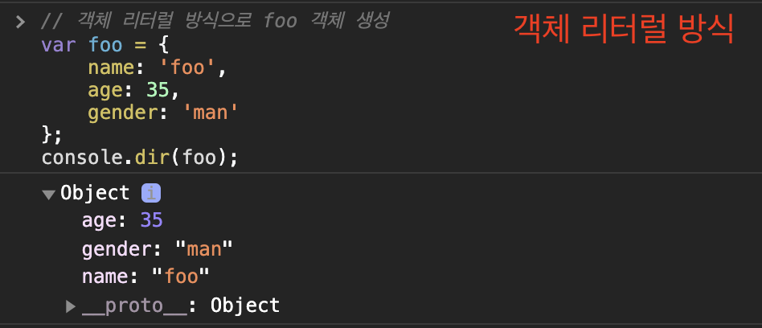
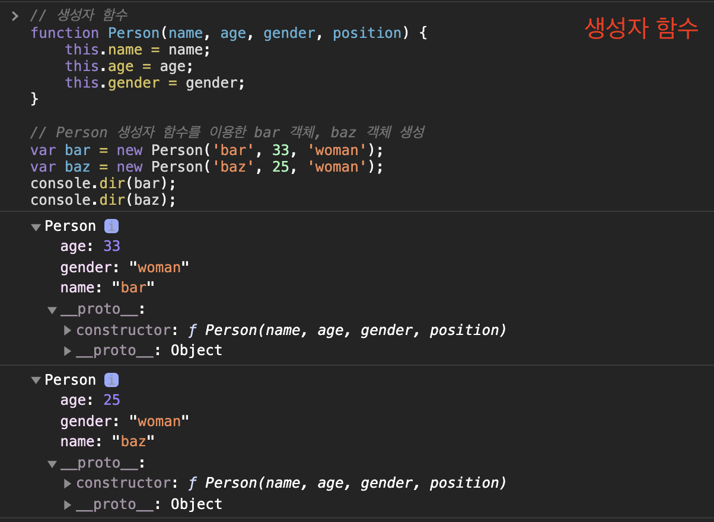

# 객체 생성

자바에서는 클래스를 정의하고, 클래스의 인스턴스를 생성하는 과정에서 객체가 만들어진다.

하지만, **JS는 클래스라는 개념이 없고 (물론 비슷한 클래스가 존재하지만), 객체 리터럴이나 생성자 함수 등 별도의 생성 방식이 존재한다.**

<br>

- [객체 생성](#객체-생성)
  - [1 객체 생성 방식](#1-객체-생성-방식)
    - [1-1 클래스 기반](#1-1-클래스-기반)
    - [1-2 프로토타입 기반](#1-2-프로토타입-기반)
  - [2 객체 생성 방법](#2-객체-생성-방법)
    - [2-1 객체 리터럴](#2-1-객체-리터럴)
    - [2-2 Object() 생성자 함수 이용](#2-2-object-생성자-함수-이용)
    - [2-3 생성자 함수 이용](#2-3-생성자-함수-이용)
      - [생성자 함수란](#생성자-함수란)
      - [생성자 함수를 사용하는 이유](#생성자-함수를-사용하는-이유)
      - [생성자 함수의 인스턴스 생성 과정](#생성자-함수의-인스턴스-생성-과정)
      - [내부 메서드 \[\[Call\]\]과 \[\[Construct\]\] - 함수도 일반 객체와 같다](#내부-메서드-call과-construct---함수도-일반-객체와-같다)
      - [callable과 constructor](#callable과-constructor)
      - [constructor와 non-constructor의 구분](#constructor와-non-constructor의-구분)
      - [new.target과 생성자 함수](#newtarget과-생성자-함수)
    - [2-4 클래스](#2-4-클래스)

<br>

## 1 객체 생성 방식
객체지향언어의 대표적인 2가지 방식은 바로 클래스 기반과 프로토타입 기반이다.

**JS는 대표적인 프로토타입 기반의 언어이다.**

<br>

### 1-1 클래스 기반

* 클래스 기반의 객체지향 언어는 **클래스를 사전에 정의**하고 **필요한 시점에 new 연산자와 함께 생성자를 호출하여 인스턴스를 생성**하는 방식으로 객체를 생성한다.

<br>

### 1-2 프로토타입 기반

JS는 프로토타입 기반의 객체지향이므로 다양한 객체 생성 방법을 지원한다.

* 객체 리터럴
* Object 생성자 함수
* 생성자 함수
* Object.create메서드
* 클래스(ES6)

이중에서 **가장 일반적이고 간단한 방법은 객체 리터럴을 사용하는 방법이다.**

<br>

## 2 객체 생성 방법

<br>

### 2-1 객체 리터럴
> 객체 리터럴의 의미 : 객체를 생성하는 표기법.
```js
// 객체 리터럴
var person = {
  name: 'binghe',
  sayHello: function() {
    console.log(`Hello! My name is ${this.name}`);
  }
};
```
* 객체 리터럴은 값으로 평가되는 표현식이다.
  * 따라서 객체 리터럴의 닫는 중괄호 뒤에는 세미콜론을 붙인다.
* 객체 리터럴의 장점
  * **객체를 생성하기 위해 클래스를 먼저 정의하고 new 연산자와 함께 생성자를 호출할 필요가 없다.**
    * **즉, 객체를 생성하고 사용하는 것조차 동적이다.**

<br>

### 2-2 Object() 생성자 함수 이용
JS에서는 객체를 생성할 때, 내장 `Object()` 생성자 함수를 제공한다.
```js
// Object()를 이용해서 foo 빈 객체 생성
var foo = new Object();

// foo 객체 프로퍼티 생성
foo.name = 'foo';
foo.age = 30;
foo.gender = 'male';

console.log(typedef foo);  // object
console.log(foo); // { name: 'foo', age: 30, gender: 'male' }
```

<br>

### 2-3 생성자 함수 이용
JS의 경우 함수를 통해서도 객체를 생성할 수 있다. 그리고 이렇게 생성하는 함수를 생성자 함수라고 부른다.

<br>

#### 생성자 함수란
```js
// 함수이면서도 객체를 생성하는 템플릿(클래스) 역할을 한다.
function Circle(radius) {
    // 생성자 함수 내부의 this는 생성자 함수가 생성할 인스턴스를 가리킨다.
    this.radius = radius;
    this.getDiameter = function() {
        return 2 * thos.radius;
    };
}

// 인스턴스 생성
const circle1 = new Circle(5);
const circle2 = new Circle(10);

console.log(circle1.getDiameter()); // 10
console.log(circle2.getDiameter()); // 20
```
* **new 연산자와 함께 호출하여 객체(인스턴스)를 생성하는 함수를 말한다.**
  * 생성자 함수는 이름 그대로 객체(인스턴스)를 생성하는 함수다.
  * 하지만 자바의 클래스 기반과 다르게 JS에서는 형식이 정해져 있지 않고 일반 함수와 동일한 방법으로 생성자 함수를 정의하고 **new 연산자와 함께 호출하면 해당 함수는 생성자 함수로 동작한다.**
  * 만약, **new 연산자와 함께 생성자 함수를 호출하지 않으면 일반 함수로 동작한다.**

<br>

#### 생성자 함수를 사용하는 이유
> 쉽게 보면, 객체 리터럴 방식은 익명 함수이다. 따라서 동일한 프로퍼티를 갖는 여러 객체를 만들려면 비효율적이다.
>
> 반대로 생성자 함수 방식은 자바에서 new 방식과 유사하다. 클래스를 만들어 동일한 프로퍼티를 갖는 객체를 계속해서 만들 수 있다.

<p align="center"> </p>

<p align="center"> </p>

* 객체 리터럴과 생성자 함수의 차이
  * 객체 리터럴의 프로토타입은 `Object`
  * 생성자 함수의 프로토타입은 `Person` (클래스와 유사한 템플릿)
* 객체 리터럴에 의한 객체 생성 방식의 문제점
  * 객체 리터럴에 의한 객체 생성 방식은 재활용이 안되고, 단 하나의 객체만 생성한다.
  * 따라서 동일한 프로퍼티를 갖는 객체를 여러 개 생성해야 하는 경우에 같은 프로퍼티를 계속해서 기술해줘야 한다.
* 생성자 함수에 의한 객체 생성 방식의 장점
  * 생성자 함수에 의한 객체 생성 방식은 마치 객체(인스턴스)를 생성하기 위한 템플릿(클래스)처럼 생성자 함수를 사용하여 프로퍼티 구조가 동일한 객체 여러 개를 간편하게 생성할 수 있다.

<br>

#### 생성자 함수의 인스턴스 생성 과정
```js
function Circle(radius) {
  // 1. 암묵적으로 빈 인스턴스가 생성되고 this에 바인딩된다.
  console.log(this); // Circle {} (빈 인스턴스)
  
  // 2. this에 바인딩되어 있는 인스턴스를 초기화한다.
  this.radius = radius;
  this.getDiameter = function() {
    return 2*this.radius;
  };
  
  // 3. 완성된 인스턴스가 바인딩된 this가 암묵적으로 반환된다.
  // return this;
}
```

1. 인스턴스 생성과 this 바인딩
2. 인스턴스 초기화
3. 인스턴스 반환

<br>

#### 내부 메서드 [[Call]]과 [[Construct]] - 함수도 일반 객체와 같다
```js
// 함수는 객체다
function foo() {}

// 함수는 객체이므로 프로퍼티를 소유할 수 있다
foo.prop = 10;

// 함수는 객체이므로 메서드를 소유할 수 있다
foo.method = function() {
  console.log(this.prop);
}

foo.method(); // 10
```

* JS에서 **함수는 객체이므로 일반 객체와 동일하게 동작할 수 있다.** 
  * **하지만 일반 객체는 호출할 수 없지만 함수는 호출할 수 있다.**
* 함수 객체 = 일반 객체 Property + 함수 객체만을 위한 Property
  * 함수 객체의 Property
    * [[Envinronment]]
    * [[FormalParameters]]
    * [[Call]]
    * [[Construct]]

```js
function foo() {}

// 일반적인 함수로서 호출 : [[Call]]이 호출된다.
foo();

// 생성자 함수로서 호출 : [[Construct]]가 호출된다.
new foo();
```

* 함수가 일반 함수로서 호출되면 내부 메서드 [[Call]]이 호출된다.
* new 연산자와 함께 생성자 함수로서 호출되면 내부 메서드 [[Construct]]가 호출된다.

<br>

#### callable과 constructor

* callable은 호출할 수 있는 객체 -> [[Call]]을 지닌 객체
* constructor는 생성자 함수로서 호출할 수 있는 함수 -> [[Construct]]를 지닌 객체

<br>

#### constructor와 non-constructor의 구분

```js
// 일반 함수 정의: 함수 선언문, 함수 표현식
function foo() {}
const bar = function() {};

// 프로퍼티 x의 값으로 할당된 것은 일반 함수로 정의된 함수다. 이는 메서드로 인정하지 않는다.
const baz = {
  x: function(){}
};

// 일반 함수로 정의된 함수만이 constructor다.
new foo(); // -> foo {}
new bar(); // -> bar {}
new baz.x(); // -> x {}

// 화살표 함수 정의
const arrow = () => {};
new arrow(); // TypeError

// 메서드 정의
const obj = {
  x() {}
};

new obj.x(); // TypeError
```

* constructor : 함수 선언문, 함수 표현식, 클래스 (클래스도 함수다)
* non-constructor : 메서드, 화살표 함수
  * 내부에 [[Construct]]를 갖지 않는다. 따라서 non-constructor인 함수 객체를 생성자 함수로서 호출하면 에러가 발생한다.

<br>

#### new.target과 생성자 함수
> 더 자세한 내용은 https://ko.javascript.info/constructor-new 에서 확인 가능합니다.
```js
function User() {
  alert(new.target);
}

// "new"없이 호출
User(); // undefined

// "new"를 붙여 호출
new User(); // function User {...}
```
* `new.target` 프로퍼티를 사용하면 함수가 `new`와 함께 호출되었는지 아닌지 확인할 수 있다.
  * 일반적인 함수를 호출하면 `new.target`은 `undefined`를 반환한다.
  * 반면 `new`와 함께 호출하면 `new.target`는 함수 자체를 반환해준다.

```js
// 활용
function User(name) {
  if (!new.target) {  // new 없이 호출해도
    return new User(name); // new를 붙여준다.
  }
  
  this.name = name;
}
```
* 이런 방식을 사용하면 `new`를 붙여 함수를 호출하든 아니든 코드가 동일하게 동작하기 때문에, 좀 더 유연하게 코드를 작성할 수 있다.

<br>

### 2-4 클래스
> 클래스 관련 내용은 추후에 모든 기초적인 JS 내용을 다루고나서 정리할 예정이다.
