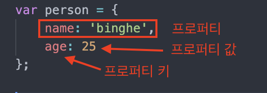

# 객체란

자바스크립트는 객체기반의 프로그래밍 언어이며, **원시 값을 제외한 "모든 것" (함수, 배열, 정규 표현식 등등) 이 모두 객체다.**

<br>

- [객체란](#객체란)
  - [1 객체란?](#1-객체란)
  - [2 프로퍼티](#2-프로퍼티)
    - [프로퍼티](#프로퍼티)
    - [프로퍼티 접근](#프로퍼티-접근)
    - [프로퍼티 삭제](#프로퍼티-삭제)
    - [프로퍼티 관리 방식](#프로퍼티-관리-방식)
  - [3 메서드](#3-메서드)

<br>

## 1 객체란?

<p align="center"><br>객체 리터럴을 통한 객체 생성</p>

* 원시 타입
  * 단 하나의 값만 나타낸다.
* 객체 타입
  * 다양한 타입의 값 (원시 또는 다른 객체)을 **하나의 단위로 구성한 복합적인 자료구조.**
* 차이
  * **원시 타입은 변경 불가능 (불변)한 값**
  * **객체 타입의 값은 변경 가능한 값이다.**

<br>

## 2 프로퍼티

<br>

### 프로퍼티

* 프로퍼티
  * **객체의 상태를 나타내는 값**
* 키와 값
  * 키 - 빈 문자열을 포함하는 모든 문자열 또는 심벌 값
  * 값 - 자바스크립트에서 사용할 수 있는 모든 값 (참조값을 통해 저장하기 때문)

> **자바에서 Map과 유사하다고 생각하면 될 듯하다.**

<br>

### 프로퍼티 접근

```js
// 동적 생성
var obj = {};
var key = 'hello';

// ES5: 프로퍼티 키 동적 생성
obj[key] = 'world';
// ES6: 계산된 프로퍼티 이름
// var obj = {[key]: 'world'};

console.log(obj); // {hello: "world"}
console.log(obj[key]); // world
console.log(obj['hello']); // world
```

* 프로퍼티 접근
  * 마침표 표기법 - `obj.hello`
  * 대괄호 표기법 - `obj['hello']`
    * 키는 반드시 따옴표를 감싼 문자열이여야 한다.

* **객체에 존재하지 않는 프로퍼티에 접근하면 `undefined`를 반환한다.**

<br>

### 프로퍼티 삭제

```js
var person = {
  name: 'Lee'
};

// 프로퍼티 동적 생성
person.age = 20;

// 프로퍼티 삭제
delete person.age;

// 존재하지 않은 프로퍼티 삭제시 에러가 발생하지 않는다.
delete person.address;

console.log(person); //{name : "Lee"}
```

<br>

### 프로퍼티 관리 방식

<p align="center"><br>출처 : https://ko.wikipedia.org/wiki/해시_테이블</p>

* 프로퍼티 관리 방식
  * **프로퍼티 키를 인덱스로 사용하는 해시테이블와 같다고 생각할 수 있다.**
* 특징
  * 자바스크립트는 **클래스 없이 객체를 생성할 수 있으며 객체가 생성된 이후라도 동적으로 프로퍼티와 메서드를 추가할 수 있다.**
  * 이는 사용하기 매우 편리하지만 비용이 많이 든다. **V8에서는 프로퍼티에 접근하기 위해 동적 탐색 대신 히든 클래스라는 방식을 사용해 프로퍼티 접근 성능을 보장한다.**

<br>

## 3 메서드

```js
var circle = {
  radius: 5, // 프로퍼티
  
  // 원의 지름
  getDiameter: function() {
    return 2 * this.radius;
  }
};

console.log(circle.getDiameter()); // 10
```

* 자바스크립트의 함수는 **일급 객체이므로 함수도 값으로 취급할 수 있다.**
  * **함수도 프로퍼티 값으로 사용가능하다는 의미.**
* 메서드
  * **프로퍼티 값이 함수일 경우, 일반 함수와 구분하기 위해 메서드라 부른다.**
  * **프로퍼티(상태)를 참조하고 조작할 수 있는 동작**
* **함수 vs 메서드**
  * 함수 - 독립적으로 존재
  * 메서드 - 클래스에 종속되어 존재


> 자바스크립트에서 함수와 객체는 분리해서 생각할 수 없는 개념이다. 두 개를 같이 이해해야 한다.