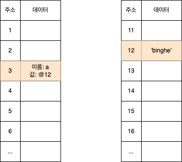
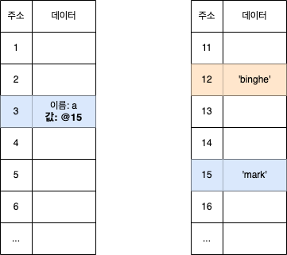
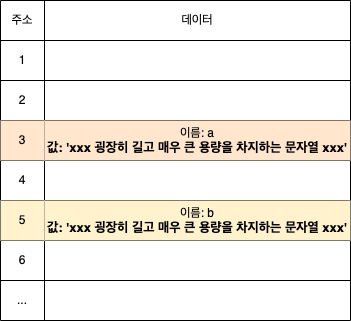
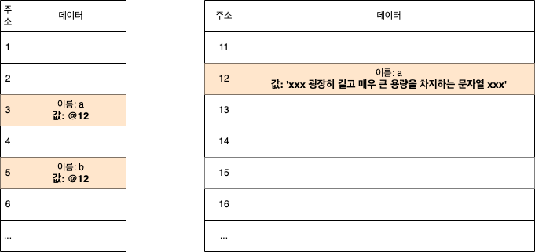
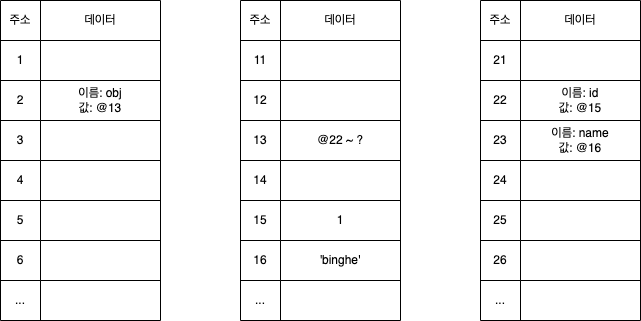
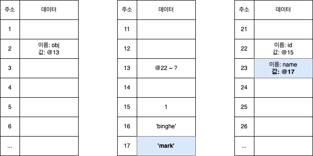

# 목차

<br>

- [목차](#목차)
- [JS 데이터 할당의 동작원리와 불변성](#js-데이터-할당의-동작원리와-불변성)
- [1 JS의 두 가지 데이터 타입](#1-js의-두-가지-데이터-타입)
- [2 기본형과 참조형의 데이터 할당 방식](#2-기본형과-참조형의-데이터-할당-방식)
  - [2-1 기본형의 데이터 할당](#2-1-기본형의-데이터-할당)
  - [2-2 기본형 데이터 타입은 모두 불변성을 지닌다.](#2-2-기본형-데이터-타입은-모두-불변성을-지닌다)
  - [2-3 참조형의 데이터 할당](#2-3-참조형의-데이터-할당)
- [참고](#참고)

<br>

# JS 데이터 할당의 동작원리와 불변성
이번 글은 JS의 데이터 할당의 동작원리에 대해 정리한 글이다.

기본형 (Primitive)타입과 참고형 (Reference)타입의 특징에 대해서 알아보면서 자바스크립트는 어떻게 데이터를 메모리에 할당하는지 살펴본다.

그 과정에서 JS의 대표적인 특징이자 기본형 타입의 특징인 불변성에 대해서도 알아본다.

<br>

# 1 JS의 두 가지 데이터 타입

<br>

💁‍♂️ **JS의 데이터 타입은 크게 두 가지로 나뉜다.**

* Primitive Type
  * Number, String, Boolean, null, undefined, Symbol
* Reference Type
  * Array, Function, RegExp, Set, Map, ...

<br>

# 2 기본형과 참조형의 데이터 할당 방식
아마 객체지향을 지원하는 프로그래밍 언어를 사용했다면, 대부분의 언어는 기본형과 참조형으로 나뉜다는 것정도는 당연히 알 것이다.

하지만 JS는 다른 언어와 다르게 조금 특이한 특성을 지니는데, 바로 JS의 기본형은 기본적으로 불변(immutable)하다.

이게 어떤 의미인지 한번 알아보자.

<br>

## 2-1 기본형의 데이터 할당

<br>

💁‍♂️ **기본형 데이터 할당 순서**

기본형을 아래와같이 할당한다고 가정해본다.

```js
var a;
a = 'binghe';
```

위 코드를 JS는 아래와 같이 할당하며 저장한다.

<p align="center"><br>JS 기본형 데이터 할당</p>

1. `binghe` 값을 저장할 메모리의 아무 위치를 찾아 특정 위치에 저장한다. (위 그림에서는 `12`라는 주소)
2. 식별자 `a`가 위치한 메모리를 찾아 해당 값을 `@12` (`binghe`가 담긴 주소)로 저장한다.

<br>

💁‍♂️ **새로운 값을 할당할 경우**

```js
var a;
a = 'binghe';

// 새로운 값 할당
a = 'mark';
```

기존에 `binghe`를 저장한 `a`에 `mark`라는 새로운 값을 할당할 경우 아래와 같이 할당된다.

<p align="center"><br>JS 기본형 새로운 값 데이터 할당 </p>

1. 새로운 값인 `mark`를 저장할 메모리의 아무 위치를 찾아 특정 위치에 저장한다. (위 그림에선 `15`라는 주소)
2. 식별자 `a`가 위치한 메모리를 찾아 해당 값을 `@15` (`mark`가 저장된 주소)로 저장한다.

<br>

## 2-2 기본형 데이터 타입은 모두 불변성을 지닌다.

💁‍♂️ **JS 기본형 타입의 특징 - 불변**

**JS는 데이터 할당시 변수에 값을 저장할 때, 해당 변수에 값을 직접 저장하지 않는다. 대신, 값이 저장된 메모리의 주소값을 저장한다.**

즉, **변수에 실제 데이터의 주소값이 저장되어있으며, 실제 데이터의 값은 메모리의 또 다른 주소에 저장하는 형태이다.**

그리고 **위 특징은 모두 `불변`이란 단어로 나타낼 수 있다.**

> 자바에서의 String을 저장하는 방식과 유사하다. (실제로 자바의 String은 대표적인 불변타입이다.)

<br>

🤔 **왜 식별자를 담은 메모리에 값을 바로 저장하지않는 것일까?** (왜 불변일까?)

크게 두 가지 이유때문이다. `메모리 낭비 최소화`와 `비교연산 비용 최소화`.

아래 간단히 굉장히 길고 매우 큰 용량을 차지하는 문자열을 두 식별자에 저장하는 예시를 통해 JS에서 값을 불변으로 저장하는 이유를 살펴본다.

```js
var a = 'xxx 굉장히 길고 매우 큰 용량을 차지하는 문자열 xxx`;
var b = 'xxx 굉장히 길고 매우 큰 용량을 차지하는 문자열 xxx`;
```

<br>

**우선 아래와 같이 식별자를 담은 메모리에 값을 바로 가진다고 가정해본다.**

<p align="center"><br>식별자를 담은 메모리에 값을 바로 가질 경우 </p>

위 방식은 **두 가지 단점을 가지게된다.**

1. 메모리 낭비가 심하다.
   * 같은 내용의 데이터임에도 따로 메모리에 저장하기때문에 메모리 사용량이 증가한다.
2. 비교연산에 비용이 많이 든다.
   * 컴퓨터는 이진수로 비교연산을 수행하는데, 비교적 긴 문자열이라면 생각보다 비교연산이 오래 걸릴 수 있다.

<br>

반면에, **아래와 같이 식별자를 담는 메모리와 값을 담는 메모리를 분리해서 저장한다고 가정해본다.**

<p align="center"><br>식별자를 담는 메모리와 값을 담는 메모리를 분리할 경우 </p>

위 방식은 **두 가지 장점을 가지게된다.**

1. 메모리 낭비 최소화
   * 같은 내용의 값은 오직 하나만 가지기때문에 메모리 낭비가 발생하지않는다.
2. 비교연산에 비용이 들지 않는다.
   * 같은 값이 메모리상에 오직 하나만 존재하기때문에 비교 연산의 비용이 들지 않는다.

위와 **같은 이유로 JS는 기본형타입을 불변으로 할당하게된다.**

> 물론 다른 이유도있을텐데, 위 이유만으로도 불변으로 저장하는 이유론 충분해보인다.

<br>

💁‍♂️ **JS의 기본형은 불변이므로 같은 값이 메모리상에 오직 하나만 존재해야한다.**

불변이라는 말은 해당 프로세스의 메모리상에 같은 값이 오직 하나만 존재해야한다는 의미로 볼 수 있다.

그러므로 값을 저장할 때, 이미 메모리상에 해당 값이 저장되어있는지를 보장해주어야한다.

> 자바의 String은 해시값을 통해 동일한 데이터가 존재하는지 확인하듯이, JS도 아마 기본형타입의 해시값등을 통해 동일한 데이터가 존재하는지 확인할 듯 하다. 
> 
> 정확한건 아니지만, 아마 특정 로직을 통해 쉽게 메모리상에 이미 존재하는 기본형 데이터인지 확인하는 로직이 분명 존재할 듯 하다.

<br>

💁‍♂️ **각각의 데이터 할당 방식의 장단점을 정리하자면 아래와 같다.**

* 식별자 메모리에 값을 직접 저장시
  * 데이터 할당이 빠름.
  * 비교에 비용이 많이 소요.
  * 메모리 낭비가 심함.
* 식별자 메모리에 값의 주소를 저장시
  * 데이터 할당이 비교적 느림. (같은 값이 이미 메모리에 존재하는지 확인해야하므로 비교적 느릴 수 있다.)
  * 비교에 비용이 들지 않음. (같은 값이 메모리상에 오직 하나만 존재 -> 불변)
  * 메모리 낭비 최소화.

위와 같은 두 가지 데이터 방식중 **JS의 기본형은 식별자 메모리에 값의 주소를 저장하는 불변 방식을 사용한다.**

<br>

## 2-3 참조형의 데이터 할당
이번엔 JS의 데이터 타입중 나머지 하나인 참조형의 데이터 할당 방식을 살펴본다.

**JS의 참조형 타입은 따로 불변처리를 해주지않는이상 가변이다.**

<br>

💁‍♂️ **참조형 데이터 할당 순서**

```js
var obj = {
  id: 1,
  name: 'binghe'
};
```

위 코드를 JS는 아래와 같이 할당하며 저장한다.

<p align="center"> </p>

1. 식별자 `obj`가 메모리에 위치한다. (위 그림에서 `@2`)
   * `var obj`가 먼저 선언되고 할당이 이뤄진다. (선언이 이뤄지고나서 할당이 이뤄진다.)
2. 하나의 메모리 셀안에 `obj`에 할당될 모든 데이터를 한번에 할당할 순 없기때문에, `obj`가 가리키는 메모리 셀은 특정 구간부터 특정 구간까지의 메모리를 포함한다는 데이터를 가지게된다. (위 그림에서 `@22 ~ ?`)
3. `id` 프로퍼티를 할당한다. -> 기존의 기본형 타입의 할당 방식과 동일하다.
4. `name` 프로퍼티를 할당한다. -> 기존의 기본형 타입의 할당 방식과 동일하다.

<br>

💁‍♂️ **새로운 값을 할당할 경우**

```js
var obj = {
  id: 1,
  name: 'binghe'
};

obj.name = 'mark';
```

위 코드를 JS는 아래와 같이 할당하며 저장한다.

<p align="center"> </p>

이때 식별자 `obj`가 위치한 메모리에 값은 변하지 않는다.

**기본형에 비해서 참조형이 메모리 할당 과정을 1단계 더 거치기때문에 기본형은 바로 값이 변하는 반면에, 참조형은 바라보고있는 값이 변하지않는다.**

<br>

💁‍♂️ JS의 참조형은 기본이 가변이다. 불변처럼 동작하려면 따로 불변객체로 만들어주어야한다. 이와 관련해서는 [다음 글]()에서 더 자세히 다룬다.

<br>

# 참고
* https://namu.wiki/w/JavaScript
* 코어 자바스크립트
