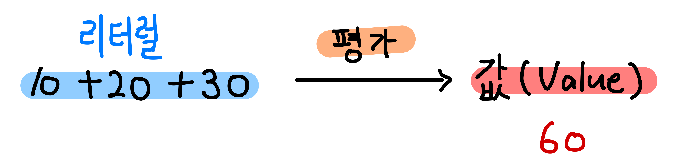
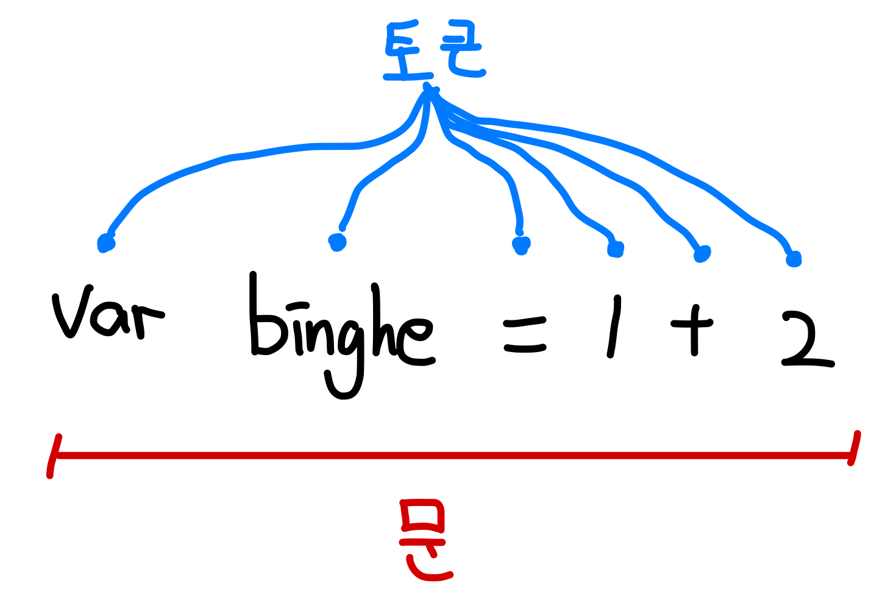

# 표현식과 문

- [표현식과 문](#표현식과-문)
  - [1 값](#1-값)
  - [2 리터럴](#2-리터럴)
  - [3 표현식](#3-표현식)
  - [4 문](#4-문)

<br>

## 1 값

```js
// 10 + 20은 평가되어 숫자 값 30을 생성한다
10 + 20; // 30
var sum = 10 + 20; // 변수에는 10 + 20이 평가되어 생성된 숫자 값 30일 할당된다
```

* 값 (value)
  * 값은 식 (표현식, expression)이 평가되어 생성된 결과를 말한다
  * 변수에 평가되어 할당되는 값

<br>

## 2 리터럴

```js
100 // 정수 리터럴

10.5 // 부동소수점 리터럴

'hello' // 문자열 리터럴

true // 불리언 리터럴

null // null 리터럴

undefined // undefined 리터럴

{name : 'lee', address : 'seoul'} // 객체 리터럴

function() {} // 함수 리터럴
```

* 사전적 의미 (literal)
  * **문자 그대로, 상상력이 부족한**
* 개념
  * 소스 코드에서 특정한 자료형의 **값을 직접 표현하는 방식.**
  * **변수 및 상수에 저장되는 값 자체**
  * 사람이 이해할 수 있는 문자 또는 약속된 기호를 사용해 **값을 생성하는 표기법**
  * **리터럴은 평가되어 값을 생성한다.**
* 예시
    * 정수 리터럴 - 10, 1, 10000
    * 실수 리터럴 - 10.1, 10e3
    * 문자열 리터럴 - "System", "Binghe"

<p align="center"></p>

<br>

## 3 표현식

```js
// 리터럴 표현식
10
'hello'

// 식별자 표현식
sum
person.name
arr[1]

// 연산자 표현식
10 + 20
sum = 10
sum !== 10

// 함수/메서드 호출 표현식
square()
person.getName()
```

* 표현식 (expression)
  * **표현식은 값으로 평가될 수 있는 문(statement)이다.**
  * 즉, 표현식이 평가되어 새로운 값을 생성하거나 기존 값을 참조한다.
  * **인터프리터가 값으로 평가하는 구문**
* **값으로 평가될 수 있는 문은 모두 표현식이다.**
  * **표현식 == 값으로 평가**

<br>

## 4 문

```js
// 변수 선언문
var x;

// 할당문
x = 5;

// 함수 선언문
function foo() {}

// 조건문
if (x > 1) {console.log(x);}

// 반복문
for (var i = 0; i < 2; i++) {console.log(i);}
```

<p align="center"></p>

* 문 (statement)
  * **문은 프로그램을 구성하는 기본 단위이자 최소 실행 단위. (문이 모여 프로그램이 된다)**


> 표현식인 문과 표현식이 아닌 문
>
> ```js
> // 변수 선언문은 표현식이 아닌 문이다 (값으로 평가될 수 없기 때문)
> var x;
> 
> // 할당문은 그 자체가 표현식이지만 완전한 문이기도 하다 (값으로 평가되기 때문)
> x = 100;
> 
> // 표현식이 아닌 문은 값처럼 사용할 수 없다
> var foo = var x;
> 
> // 할당문은 표현식이기 때문에 값처럼 사용이 가능하다
> var foo = x;
> ```

<br>