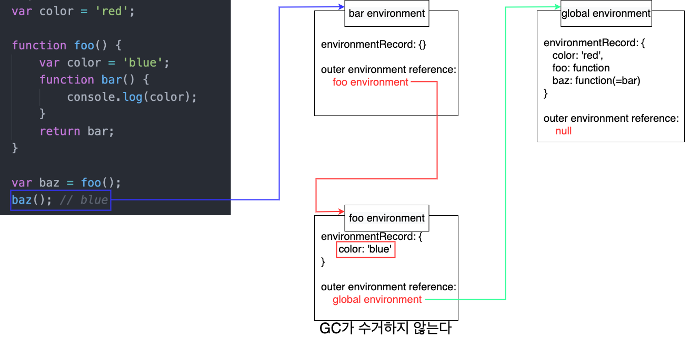

# 목차

<br>

- [목차](#목차)
- [Closure 이해하기](#closure-이해하기)
- [1 클로저의 의미](#1-클로저의-의미)
  - [1-1 클로저](#1-1-클로저)
  - [1-2 클로저의 진짜 의미](#1-2-클로저의-진짜-의미)
- [2 클로저의 핵심은 지역변수가 함수 종료후에도 사라지지 않게하기위함이다 - 캡슐화](#2-클로저의-핵심은-지역변수가-함수-종료후에도-사라지지-않게하기위함이다---캡슐화)

<br>

# Closure 이해하기

<br>

# 1 클로저의 의미

<br>

## 1-1 클로저

💁‍♂️ **클로저는 다양한 의미를 가지고 있다.**

* 자유 변수를 기억하는 함수
* 스코프를 기억하는 함수
* 환경(Lexical Environment)를 기억하는 함수
* ...

함수가 무언가를 기억하고 그것을 다시 사용한다는 것을 알 수 있지만, 여전히 모호하게 느껴진다.

<br>

💁‍♂️ **클로저의 의미**
* 클로저 = 내부 함수 + 둘러쌓인 Lexical Environment의 참조 (함수를 둘러싼 환경)
  * 함수를 만들고 그 함수 내부의 코드가 탐색하는 스코프를 함수 생성 당시의 렉시컬 스코프로 고정하면 바로 클로저가 된다.
  * 이를 더 해석해보면, 둘러쌓인은 내부함수를 의미하기때문에 클로저는 `내부함수와 LexicalEnvironment의 조합`이라고 볼 수 있다.
* 이미 생명 주기가 끝난 외부 함수의 변수를 참조하는 함수
  * 생명 주기가 끝난 외부 함수의 변수를 자유 변수라고 한다.

<br>

💁‍♂️ **클러저는 함수가 생성될 때면 매번 같이 발생한다.**

```text
In JS, closure are created every time a function is created, at function creation time
```
MDN의 글을 가져온 것이며, 해석하면 `클로저는 특별한 개념이 아니라, 함수의 생성과 함께 무조건 생기는 '당연한' 개념`이라고 볼 수 있다.

<br>

## 1-2 클로저의 진짜 의미

앞서 말했듯이, **클로저는 함수가 생성될 때 그 함수의 Lexical 환경을 포섭 (closure)하여 실행될 때를 말한다.**

그렇다고 함수가 생성되는 모든 경우에 `클로저`라는 단어를 보편적으로 사용하진않는다.

즉, 많은 사람들이 말하는 `클로저`는 클로저 환경에서만 발생하는 무언가 특별한 현상을 표현하기위해 사용된다.

<br>

💁‍♂️ 클로저라고 부르지 않는 예시

```js
function foo() {
    var color = 'blue';
    function bar() {
        console.log(color);
    }
    bar();
}
foo(); // blue
```
* 위 코드를 해석하자면
  * 일단 bar는 foo 안에 속하기 때문에 foo 스코프를 외부 스코프(outer lexical environment) 참조로 저장한다.
  * 그리고 bar는 자신의 렉시컬 스코프 체인을 통해 foo의 color를 정확히 참조할 것이다.
* 그렇다면 bar함수는 클로저인가??
  * 아니다. 약간의 거리가 있다.
    * **bar는 foo 안에서 정의되고 실행되었을 뿐, foo 밖으로 나오지 않았기 때문에 클로저라고 부르지 않는다.**
  * 즉, 외부에서 bar를 직접 호출하지 않았기 때문에 bar의 렉시컬 환경을 포섭(closure)할 필요가 없다.

<br>

💁‍♂️ **클로저라고 부르는 예시**

```js
var color = 'red';
function foo() {
    var color = 'blue';
    function bar() {
        console.log(color);
    }
    return bar;
}
var baz = foo();
baz(); // blue
```
* 위 예시는 클로저가 맞다.
  * bar는 자신이 생성된 렉시컬 스코프에서 벗어나 global에서 baz라는 이름으로 호출되었고, 스코프 탐색은 현재 실행 스택과 관련 없는 foo를 거쳐갔다.
* baz를 bar로 초기화할 때 이미 bar의 outer lexical environment를 foo로 했다.
  * 때문에 global에서 아무리 호출해도 여전히 foo에서 color를 찾게 된다.

<p align="center"> </p>

<br>

💁‍♂️ **또 다른 예시를 통해 클로저를 살펴본다.**

```js
var outer = function() {
    var a = 1;
    var inner = function() {
        return ++a;
    }
    return inner;
}

var outer2 = outer();
console.log(outer2()); // 2
console.log(outer2()); // 3
```
* `outer()`가 반환될 때 `inner`의 내부에서 `outer`함수내에 선언된 `a`변수를 참조하게된다.
* 이로인해, `outer()` 함수가 종료되었음에도, `inner` 함수가 해당 변수를 가지고있기때문에 `outer` 함수의 LexicalEnvironment는 GC 대상이 되지 않는다.
  * **변수 a가 좀비가 되었다!**
* **`outer`의 LexicalEnvironment가 계속 살아있기때문에, 반환받은 `inner`(`outer2`)를 계속호출 할때마다 `a` 변수가 증가하는 것을 볼 수 있다.**

<br>

# 2 클로저의 핵심은 지역변수가 함수 종료후에도 사라지지 않게하기위함이다 - 캡슐화

**클로저의 핵심은 `지역변수가 함수 종료 후에도 사라지지 않게 할 수 있다`는 것이다.**

쉽게 얘기해 **클로저의 큰 장점은 함수 종료 후에도 사라지지않는 지역변수를 만들 수 있다는 것** (지역 변수 좀비 만들기 가능)

> 물론 할 수 있다이지 클로저를 활용하지 않는다면 꼭 하지 않아도 된다.

<br>

💁‍♂️ 예시를 살펴보자

```js
function user(_name) {
    var _logged = true;
    return {
        get name() {return _name},
        set name(v) {_name = v},
        login() {_logged = true},
        logout() {_logged = false},
        get status() {
            return _logged ? 'login' : 'logout';
        },
    }
}

var binghe = user('병화');
console.log(binghe.name); // 병화

// setter가 정의된 name 수정 (클로저)
binghe.name = '빙허';
console.log(binghe.name); // 빙허

// setter가 정의되지않은 직접 함수의 값 변경 (클로저 아님)
// 클로저가 아니기때문에 해당 값이 변경되지않는다. 대신 _name 변수가 추가될 뿐이다.
binghe._name = '마크';
console.log(binghe.name); // 빙허

console.log(binghe.status); // 'login'

// 클로저 (기존의 좀비로된 status 값을 변경함)
binghe.logout();
console.log(binghe.status); // 'logout'

// 클로저 아님 (기존의 좀비로된 status 값을 변경하는 것이 아님. 그러므로 값이 변경되지 않는다.)
binghe.status = true;
console.log(binghe.status); // 'logout
```
위 예시를 이해했다면, 어느정도 클로저를 이해했다고 볼 수 있다.

그리고 위 예시를 통해 알 수 있는 정은 아래와 같다.

* 클로저는 함수 종료 후에도 사라지지않고 변수의 값을 유지할 수 있게한다.
* 그리고 **이를 외부로부터 내부 변수를 보호한다.** (캡슐화)

이러한 클로저의 특징을 활용하면 객체지향을 구현할 수 있으며, 자율적인 객체를 만들 수 있다.

(쉽게 말해.. 객체의 멤버 접근 제어자를 `private`처럼 사용할 수 있게된다.)

